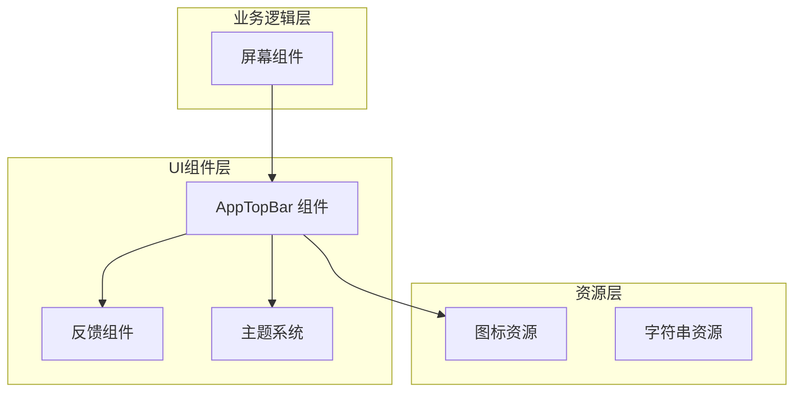
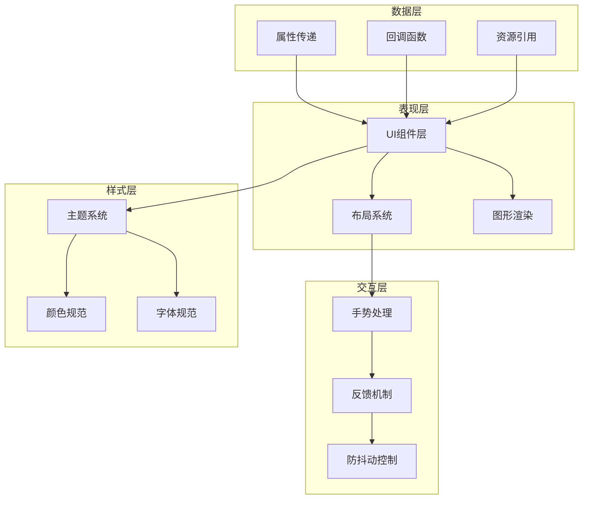
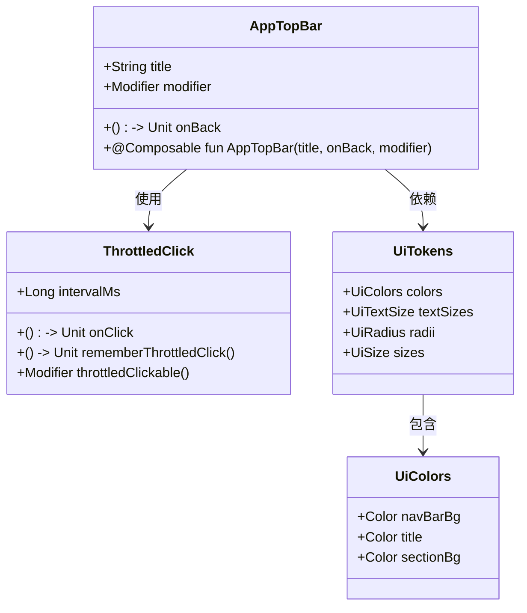
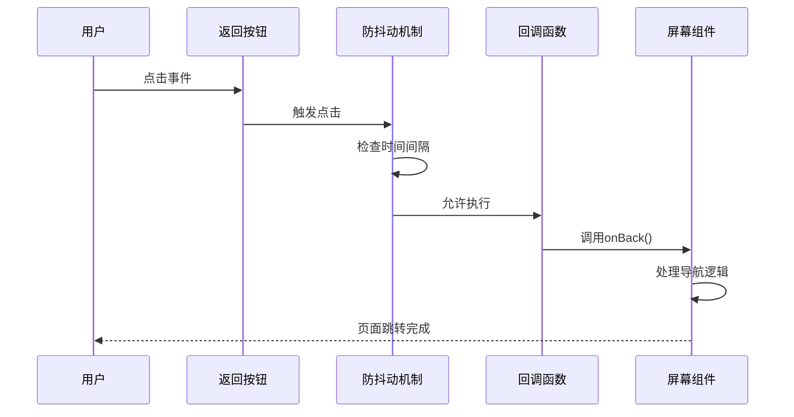
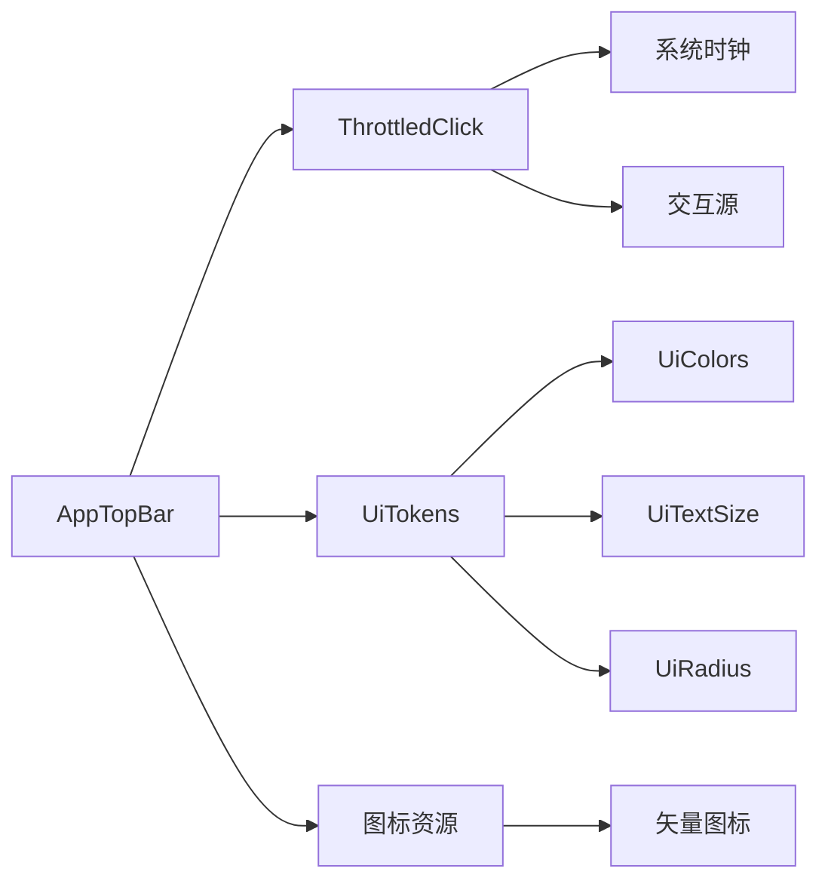

# AppTopBar导航组件

<cite>
**本文档引用的文件**
- [AppTopBar.kt](file://android/app/src/main/kotlin/com/photovault/app/ui/components/AppTopBar.kt)
- [UiTokens.kt](file://android/app/src/main/kotlin/com/photovault/app/ui/theme/UiTokens.kt)
- [ThrottledClick.kt](file://android/app/src/main/kotlin/com/photovault/app/ui/feedback/ThrottledClick.kt)
- [ic_topbar_back.xml](file://android/app/src/main/res/drawable/ic_topbar_back.xml)
- [AlbumListScreen.kt](file://android/app/src/main/kotlin/com/photovault/app/ui/AlbumListScreen.kt)
</cite>

## 更新摘要
**变更内容**
- 更新了返回箭头视觉长度和图标尺寸规格
- 改进了导航组件的高保真视觉规范
- 优化了返回按钮的尺寸和比例

## 目录
1. [简介](#简介)
2. [项目结构](#项目结构)
3. [核心组件](#核心组件)
4. [架构概览](#架构概览)
5. [详细组件分析](#详细组件分析)
6. [依赖关系分析](#依赖关系分析)
7. [性能考虑](#性能考虑)
8. [故障排除指南](#故障排除指南)
9. [结论](#结论)

## 简介

AppTopBar是AI照片保险库应用中的核心导航组件，采用Jetpack Compose构建。该组件提供了一个简洁、响应式的顶部导航栏，包含返回按钮和居中的标题文本。它遵循应用的整体设计语言，确保了统一的用户体验和视觉一致性。

该组件特别注重用户体验优化，通过防抖动点击机制防止重复触发，同时集成了主题系统以适应深色和浅色模式。最新的改进增强了返回箭头的视觉长度和图标尺寸，更好地符合高保真导航规范。

## 项目结构

AppTopBar组件位于应用的UI组件层，与主题系统和反馈机制紧密集成：



**图表来源**
- [AppTopBar.kt:1-66](file://android/app/src/main/kotlin/com/photovault/app/ui/components/AppTopBar.kt#L1-L66)
- [UiTokens.kt:1-185](file://android/app/src/main/kotlin/com/photovault/app/ui/theme/UiTokens.kt#L1-L185)

**章节来源**
- [AppTopBar.kt:1-66](file://android/app/src/main/kotlin/com/photovault/app/ui/components/AppTopBar.kt#L1-L66)
- [UiTokens.kt:1-185](file://android/app/src/main/kotlin/com/photovault/app/ui/theme/UiTokens.kt#L1-L185)

## 核心组件

AppTopBar组件的核心功能包括：

### 主要特性
- **响应式布局**：使用Row布局实现水平排列
- **防抖动点击**：集成ThrottledClick机制防止重复触发
- **主题化设计**：完全集成到应用的主题系统
- **可定制性**：支持自定义修饰符和回调函数
- **高保真视觉规范**：优化的返回箭头视觉长度和图标尺寸

### 设计规范
- **返回按钮尺寸**：宽度38dp，高度36dp，提供充足的点击区域
- **图标尺寸规格**：返回图标20dp，确保清晰的视觉识别
- **圆角设计**：10dp圆角边框，符合整体设计语言
- **颜色系统**：使用UiColors.Home.navBarBg和UiColors.Home.title
- **字体规范**：24sp粗体字体，符合标题级别

**更新** 新的尺寸规格提供了更好的视觉平衡和用户交互体验

**章节来源**
- [AppTopBar.kt:38-53](file://android/app/src/main/kotlin/com/photovault/app/ui/components/AppTopBar.kt#L38-L53)
- [UiTokens.kt:55-72](file://android/app/src/main/kotlin/com/photovault/app/ui/theme/UiTokens.kt#L55-L72)

## 架构概览

AppTopBar组件采用分层架构设计，确保了良好的关注点分离：



**图表来源**
- [AppTopBar.kt:28-65](file://android/app/src/main/kotlin/com/photovault/app/ui/components/AppTopBar.kt#L28-L65)
- [ThrottledClick.kt:17-51](file://android/app/src/main/kotlin/com/photovault/app/ui/feedback/ThrottledClick.kt#L17-L51)

## 详细组件分析

### 组件结构分析



**图表来源**
- [AppTopBar.kt:28-65](file://android/app/src/main/kotlin/com/photovault/app/ui/components/AppTopBar.kt#L28-L65)
- [ThrottledClick.kt:17-51](file://android/app/src/main/kotlin/com/photovault/app/ui/feedback/ThrottledClick.kt#L17-L51)
- [UiTokens.kt:9-73](file://android/app/src/main/kotlin/com/photovault/app/ui/theme/UiTokens.kt#L9-L73)

### 交互流程分析



**图表来源**
- [ThrottledClick.kt:18-33](file://android/app/src/main/kotlin/com/photovault/app/ui/feedback/ThrottledClick.kt#L18-L33)
- [AppTopBar.kt:44](file://android/app/src/main/kotlin/com/photovault/app/ui/components/AppTopBar.kt#L44)

### 样式系统集成

AppTopBar完全集成到应用的样式系统中，通过以下方式实现：

#### 颜色系统
- **导航栏背景色**：UiColors.Home.navBarBg (半透明深色背景)
- **标题文字色**：UiColors.Home.title (浅色主题下的高对比度文字)
- **边框颜色**：UiColors.Home.navBarStroke (深色边框增强层次感)

#### 字体系统
- **标题字体大小**：UiTextSize.homeTitle (24sp，符合主标题级别)
- **字体粗细**：FontWeight.Bold (强调标题重要性)
- **文本对齐**：TextAlign.Center (居中显示提升视觉平衡)

#### 圆角系统
- **按钮圆角**：UiRadius.homeNavBar (10dp，适中的圆角半径)
- **形状一致性**：RoundedCornerShape(10.dp) (与整体设计语言保持一致)

**更新** 新的尺寸规格确保了更好的视觉比例和用户交互体验

**章节来源**
- [AppTopBar.kt:38-63](file://android/app/src/main/kotlin/com/photovault/app/ui/components/AppTopBar.kt#L38-L63)
- [UiTokens.kt:55-72](file://android/app/src/main/kotlin/com/photovault/app/ui/theme/UiTokens.kt#L55-L72)
- [UiTokens.kt:164-184](file://android/app/src/main/kotlin/com/photovault/app/ui/theme/UiTokens.kt#L164-L184)

### 使用模式分析

AppTopBar在不同屏幕中的使用模式展示了其灵活性和一致性：

#### 基本使用模式
```kotlin
// 标准用法
AppTopBar(
    title = stringResource(R.string.album_list_title),
    onBack = onBack
)

// 自定义修饰符
AppTopBar(
    title = "自定义标题",
    onBack = onBack,
    modifier = Modifier.padding(16.dp)
)
```

#### 屏幕集成模式
组件通常作为屏幕内容的第一个子元素出现，与屏幕的其他UI元素形成清晰的层次结构。

**章节来源**
- [AlbumListScreen.kt:86](file://android/app/src/main/kotlin/com/photovault/app/ui/AlbumListScreen.kt#L86)
- [AppTopBar.kt:28-33](file://android/app/src/main/kotlin/com/photovault/app/ui/components/AppTopBar.kt#L28-L33)

## 依赖关系分析

### 内部依赖关系



**图表来源**
- [AppTopBar.kt:10-25](file://android/app/src/main/kotlin/com/photovault/app/ui/components/AppTopBar.kt#L10-L25)
- [ThrottledClick.kt:3-13](file://android/app/src/main/kotlin/com/photovault/app/ui/feedback/ThrottledClick.kt#L3-L13)

### 外部依赖关系

AppTopBar组件依赖于以下外部库和框架：

#### Jetpack Compose依赖
- **Material3组件**：Icon, Text等基础UI组件
- **布局系统**：Row, Spacer等布局容器
- **状态管理**：remember等状态管理工具

#### Android框架依赖
- **资源系统**：painterResource用于图标资源
- **系统时钟**：SystemClock.elapsedRealtime用于防抖动
- **主题系统**：UiTokens提供的主题规范

**章节来源**
- [AppTopBar.kt:3-25](file://android/app/src/main/kotlin/com/photovault/app/ui/components/AppTopBar.kt#L3-L25)
- [ThrottledClick.kt:3](file://android/app/src/main/kotlin/com/photovault/app/ui/feedback/ThrottledClick.kt#L3)

## 性能考虑

### 渲染性能优化

AppTopBar组件在设计时充分考虑了性能优化：

#### 组合器优化
- **无状态组件**：AppTopBar是纯函数式组件，避免不必要的重组
- **参数缓存**：使用remember缓存防抖动状态，减少内存分配
- **修饰符链优化**：合理组织修饰符顺序，避免重复计算

#### 内存管理
- **轻量级状态**：仅存储必要的lastClickTime状态
- **默认参数**：提供合理的默认值，减少参数传递开销
- **资源复用**：图标和颜色资源通过UiTokens统一管理

### 用户体验优化

#### 响应性优化
- **500ms防抖动间隔**：平衡响应速度和防重复触发需求
- **即时视觉反馈**：通过Material3的indication系统提供点击反馈
- **流畅动画**：与Compose的动画系统无缝集成

**更新** 新的尺寸规格提供了更佳的视觉比例和用户交互体验

**章节来源**
- [ThrottledClick.kt:15-33](file://android/app/src/main/kotlin/com/photovault/app/ui/feedback/ThrottledClick.kt#L15-L33)
- [AppTopBar.kt:44](file://android/app/src/main/kotlin/com/photovault/app/ui/components/AppTopBar.kt#L44)

## 故障排除指南

### 常见问题及解决方案

#### 图标显示问题
**问题描述**：返回图标不显示或显示异常
**可能原因**：
- 图标资源路径错误
- 颜色配置问题
- 尺寸设置不当

**解决方案**：
1. 检查ic_topbar_back.xml资源文件
2. 验证UiTokens中的颜色配置
3. 确认图标尺寸设置为20dp

#### 点击响应问题
**问题描述**：返回按钮无法点击或响应迟钝
**可能原因**：
- 防抖动间隔过长
- 点击区域设置不当
- 交互源配置错误

**解决方案**：
1. 检查throttledClickable的intervalMs参数
2. 验证按钮的size修饰符设置
3. 确认interactionSource的正确初始化

#### 样式不一致问题
**问题描述**：AppTopBar样式与其他组件不一致
**可能原因**：
- UiTokens配置错误
- 主题切换问题
- 颜色值不匹配

**解决方案**：
1. 检查UiColors.Home.navBarBg和title的颜色值
2. 验证主题系统的正确配置
3. 确认UiTextSize.homeTitle的字体大小

**更新** 新的尺寸规格需要确保与整体设计规范的一致性

**章节来源**
- [ic_topbar_back.xml:1-21](file://android/app/src/main/res/drawable/ic_topbar_back.xml#L1-L21)
- [ThrottledClick.kt:35-51](file://android/app/src/main/kotlin/com/photovault/app/ui/feedback/ThrottledClick.kt#L35-L51)
- [UiTokens.kt:55-72](file://android/app/src/main/kotlin/com/photovault/app/ui/theme/UiTokens.kt#L55-L72)

## 结论

AppTopBar导航组件展现了现代Android应用开发的最佳实践：

### 设计优势
- **简洁性**：专注于核心功能，避免过度设计
- **一致性**：严格遵循应用设计语言
- **可扩展性**：良好的接口设计便于功能扩展
- **性能优化**：从架构层面考虑性能影响
- **高保真规范**：最新的视觉规格提升用户体验

### 技术亮点
- **防抖动机制**：有效防止用户误操作
- **主题集成**：无缝融入整体设计系统
- **响应式设计**：适应不同的屏幕尺寸和方向
- **类型安全**：充分利用Kotlin的类型系统
- **视觉优化**：改进的返回箭头视觉长度和图标尺寸

### 改进建议
1. **无障碍支持**：添加contentDescription参数
2. **动画效果**：考虑添加淡入淡出动画
3. **自定义选项**：提供更多样式定制选项
4. **测试覆盖**：增加单元测试和UI测试

AppTopBar组件为AI照片保险库应用提供了坚实的基础UI组件，其设计理念和实现方式值得在其他类似应用中借鉴和学习。最新的视觉规格改进进一步提升了组件的专业性和用户体验。