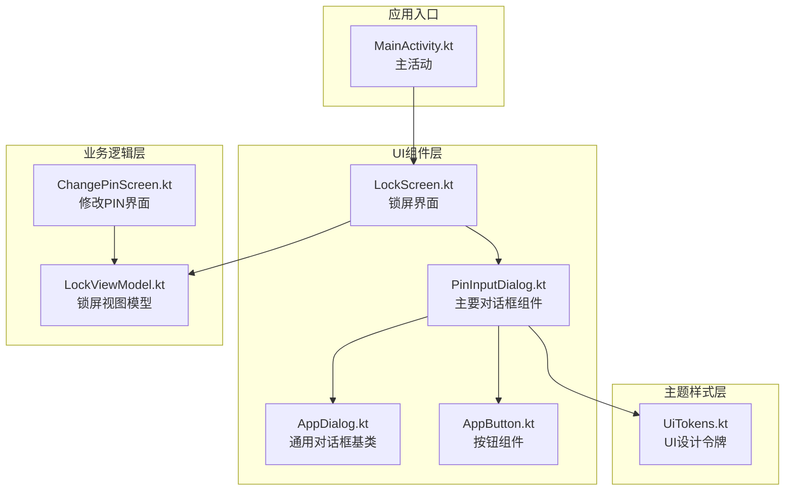
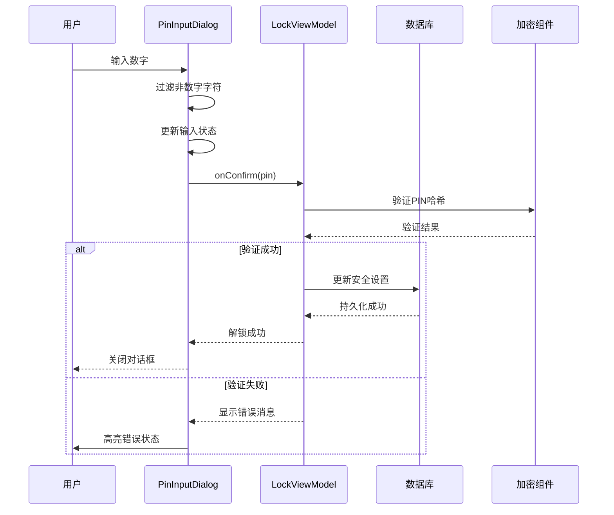
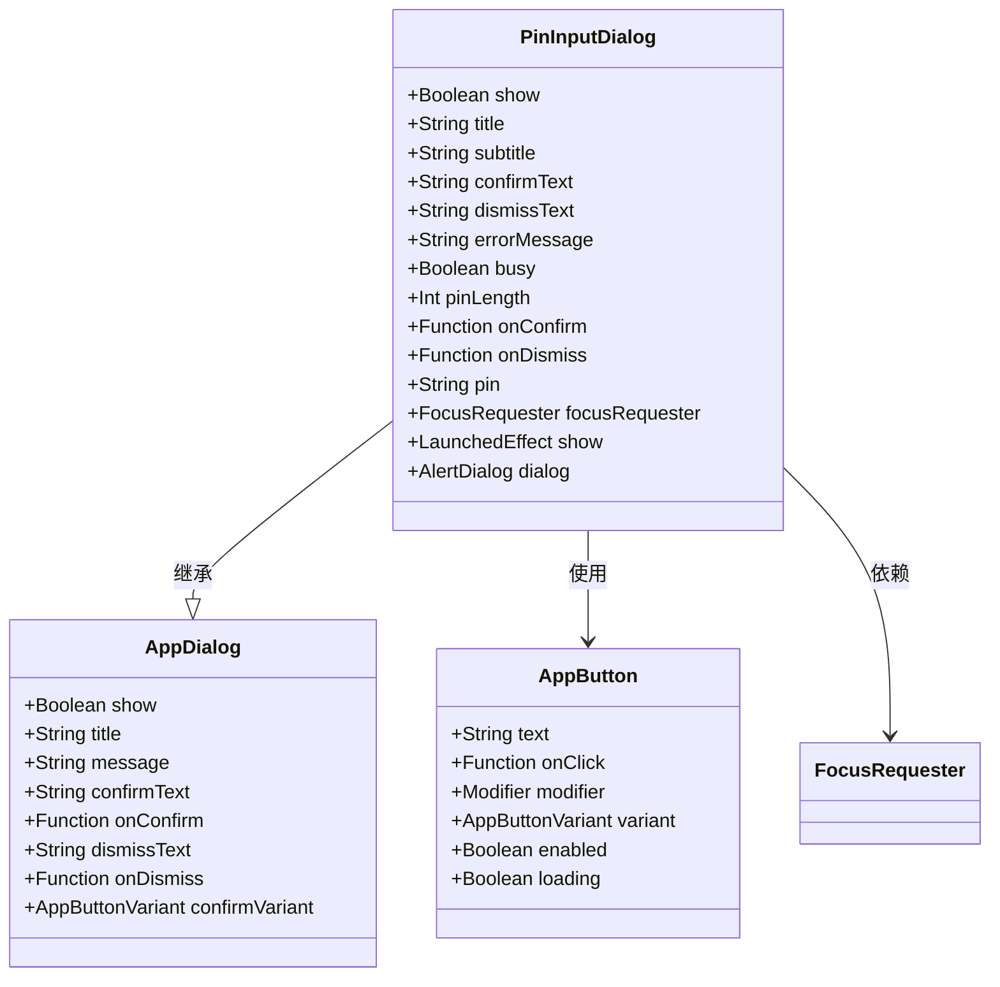
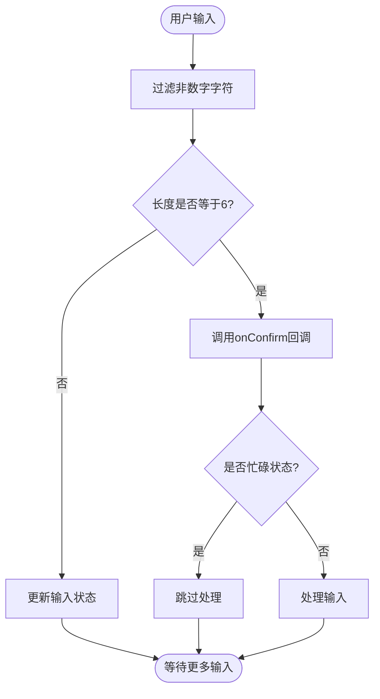
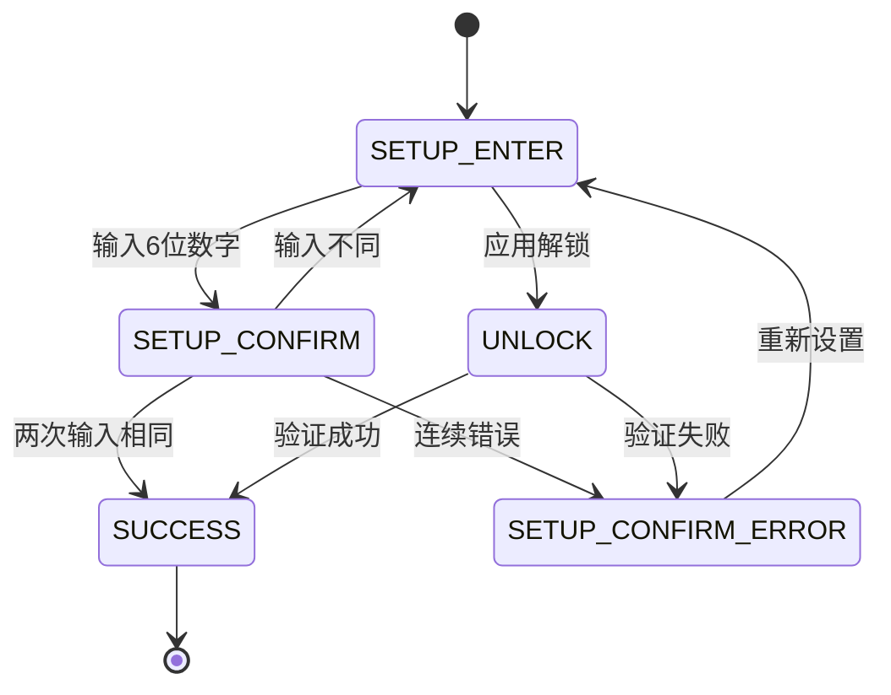
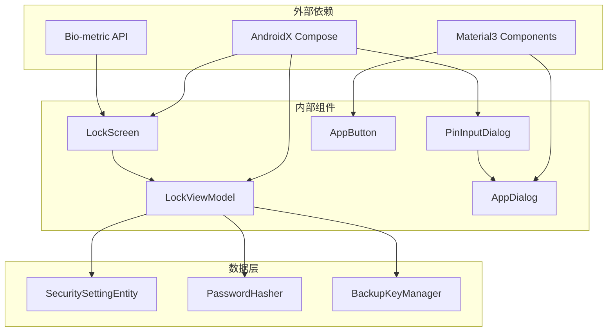

# PIN输入对话框

<cite>
**本文档引用的文件**
- [PinInputDialog.kt](file://android/app/src/main/kotlin/com/xpx/vault/ui/components/PinInputDialog.kt)
- [LockScreen.kt](file://android/app/src/main/kotlin/com/xpx/vault/ui/lock/LockScreen.kt)
- [LockViewModel.kt](file://android/app/src/main/kotlin/com/xpx/vault/ui/lock/LockViewModel.kt)
- [AppDialog.kt](file://android/app/src/main/kotlin/com/xpx/vault/ui/components/AppDialog.kt)
- [AppButton.kt](file://android/app/src/main/kotlin/com/xpx/vault/ui/components/AppButton.kt)
- [UiTokens.kt](file://android/app/src/main/kotlin/com/xpx/vault/ui/theme/UiTokens.kt)
- [ChangePinScreen.kt](file://android/app/src/main/kotlin/com/xpx/vault/ui/ChangePinScreen.kt)
- [MainActivity.kt](file://android/app/src/main/kotlin/com/xpx/vault/MainActivity.kt)
</cite>

## 目录
1. [简介](#简介)
2. [项目结构](#项目结构)
3. [核心组件](#核心组件)
4. [架构概览](#架构概览)
5. [详细组件分析](#详细组件分析)
6. [依赖关系分析](#依赖关系分析)
7. [性能考虑](#性能考虑)
8. [故障排除指南](#故障排除指南)
9. [结论](#结论)

## 简介

PIN输入对话框是AI Vault私密相册应用中的核心安全组件，负责提供6位数字PIN码的输入界面。该组件采用隐藏输入框配合可视化圆点指示的设计，确保用户隐私的同时提供直观的输入反馈。该实现结合了Compose UI、状态管理和安全验证机制，为用户提供流畅且安全的PIN码输入体验。

## 项目结构

PIN输入对话框功能分布在以下关键文件中：

**图表来源**
- [PinInputDialog.kt:1-208](file://android/app/src/main/kotlin/com/xpx/vault/ui/components/PinInputDialog.kt#L1-L208)
- [LockScreen.kt:1-478](file://android/app/src/main/kotlin/com/xpx/vault/ui/lock/LockScreen.kt#L1-L478)
- [LockViewModel.kt:1-334](file://android/app/src/main/kotlin/com/xpx/vault/ui/lock/LockViewModel.kt#L1-L334)

**章节来源**
- [PinInputDialog.kt:1-208](file://android/app/src/main/kotlin/com/xpx/vault/ui/components/PinInputDialog.kt#L1-L208)
- [LockScreen.kt:1-478](file://android/app/src/main/kotlin/com/xpx/vault/ui/lock/LockScreen.kt#L1-L478)
- [LockViewModel.kt:1-334](file://android/app/src/main/kotlin/com/xpx/vault/ui/lock/LockViewModel.kt#L1-L334)

## 核心组件

### PinInputDialog 主要特性

PIN输入对话框具备以下核心功能：

- **6位数字输入限制**：强制要求精确的6位数字输入
- **隐藏输入显示**：使用透明文本样式隐藏实际输入内容
- **可视化进度指示**：通过6个圆点显示当前输入进度
- **错误状态处理**：支持错误状态下的视觉反馈
- **忙碌状态指示**：处理异步验证过程中的加载状态
- **响应式交互**：提供确认和取消按钮的完整交互

### 锁屏集成

锁屏界面集成了PIN输入对话框，提供完整的解锁流程：

- **设置PIN阶段**：引导用户设置新的6位PIN码
- **确认PIN阶段**：要求用户重新输入以确认PIN码
- **解锁阶段**：验证现有PIN码进行应用解锁
- **错误处理**：处理PIN码不匹配和验证失败的情况

**章节来源**
- [PinInputDialog.kt:41-46](file://android/app/src/main/kotlin/com/xpx/vault/ui/components/PinInputDialog.kt#L41-L46)
- [LockScreen.kt:347-370](file://android/app/src/main/kotlin/com/xpx/vault/ui/lock/LockScreen.kt#L347-L370)

## 架构概览

PIN输入对话框采用MVVM架构模式，结合Jetpack Compose的状态管理：

**图表来源**
- [PinInputDialog.kt:104-113](file://android/app/src/main/kotlin/com/xpx/vault/ui/components/PinInputDialog.kt#L104-L113)
- [LockViewModel.kt:200-217](file://android/app/src/main/kotlin/com/xpx/vault/ui/lock/LockViewModel.kt#L200-L217)

## 详细组件分析

### PinInputDialog 组件分析

#### 组件结构

**图表来源**
- [PinInputDialog.kt:48-59](file://android/app/src/main/kotlin/com/xpx/vault/ui/components/PinInputDialog.kt#L48-L59)
- [AppDialog.kt:23-32](file://android/app/src/main/kotlin/com/xpx/vault/ui/components/AppDialog.kt#L23-L32)
- [AppButton.kt:29-36](file://android/app/src/main/kotlin/com/xpx/vault/ui/components/AppButton.kt#L29-L36)

#### 输入处理流程

**图表来源**
- [PinInputDialog.kt:104-113](file://android/app/src/main/kotlin/com/xpx/vault/ui/components/PinInputDialog.kt#L104-L113)

#### 错误状态处理

当出现错误时，组件会显示红色边框和背景的圆点，提供清晰的视觉反馈：

- **错误颜色方案**：使用品牌错误色（#FF4372）
- **激活状态**：错误状态下圆点填充红色背景
- **边框强调**：红色边框突出显示错误状态

**章节来源**
- [PinInputDialog.kt:122-144](file://android/app/src/main/kotlin/com/xpx/vault/ui/components/PinInputDialog.kt#L122-L144)
- [UiTokens.kt:31](file://android/app/src/main/kotlin/com/xpx/vault/ui/theme/UiTokens.kt#L31)

### LockViewModel 状态管理

#### 锁屏状态流转

**图表来源**
- [LockViewModel.kt:308-314](file://android/app/src/main/kotlin/com/xpx/vault/ui/lock/LockViewModel.kt#L308-L314)
- [LockViewModel.kt:79-117](file://android/app/src/main/kotlin/com/xpx/vault/ui/lock/LockViewModel.kt#L79-L117)

#### PIN验证机制

组件实现了多层次的安全验证：

- **哈希验证**：使用SHA-256算法对输入进行哈希比较
- **失败计数**：跟踪连续错误尝试次数
- **临时锁定**：超过阈值时提供临时锁定保护
- **密钥派生**：成功验证后派生备份密钥

**章节来源**
- [LockViewModel.kt:200-217](file://android/app/src/main/kotlin/com/xpx/vault/ui/lock/LockViewModel.kt#L200-L217)
- [LockViewModel.kt:184-198](file://android/app/src/main/kotlin/com/xpx/vault/ui/lock/LockViewModel.kt#L184-L198)

### 主题和样式系统

#### 设计令牌定义

组件使用统一的主题系统确保视觉一致性：

- **颜色系统**：深色主题适配，包含背景、文本、强调色
- **圆角系统**：对话框圆角、按钮圆角、卡片圆角
- **尺寸系统**：按钮高度、加载指示器大小、间距规范
- **字体系统**：标题、正文、按钮文本的字体大小

**章节来源**
- [UiTokens.kt:24-53](file://android/app/src/main/kotlin/com/xpx/vault/ui/theme/UiTokens.kt#L24-L53)
- [UiTokens.kt:110-126](file://android/app/src/main/kotlin/com/xpx/vault/ui/theme/UiTokens.kt#L110-L126)

## 依赖关系分析

### 组件间依赖关系

**图表来源**
- [PinInputDialog.kt:3-39](file://android/app/src/main/kotlin/com/xpx/vault/ui/components/PinInputDialog.kt#L3-L39)
- [LockScreen.kt:54-56](file://android/app/src/main/kotlin/com/xpx/vault/ui/lock/LockScreen.kt#L54-L56)

### 状态管理依赖

组件间的状态传递遵循单向数据流原则：

- **输入到验证**：PinInputDialog -> LockViewModel
- **验证到UI**：LockViewModel -> LockScreen
- **UI到持久化**：LockScreen -> 数据库
- **持久化到加密**：数据库 -> 加密组件

**章节来源**
- [LockViewModel.kt:38-39](file://android/app/src/main/kotlin/com/xpx/vault/ui/lock/LockViewModel.kt#L38-L39)
- [LockScreen.kt:66](file://android/app/src/main/kotlin/com/xpx/vault/ui/lock/LockScreen.kt#L66)

## 性能考虑

### 渲染优化

- **状态最小化**：仅在必要时重建UI组件
- **记忆化策略**：使用remember和LaunchedEffect避免不必要的重计算
- **焦点管理**：智能焦点请求减少布局抖动
- **条件渲染**：根据状态动态显示/隐藏组件

### 内存管理

- **资源清理**：组件销毁时自动清理状态
- **生命周期感知**：与Compose生命周期绑定
- **异步处理**：耗时操作在IO线程执行
- **内存泄漏防护**：正确处理回调和订阅

## 故障排除指南

### 常见问题诊断

#### 输入问题
- **问题**：无法输入数字
- **原因**：键盘类型配置错误
- **解决方案**：检查KeyboardOptions设置

#### 状态同步问题
- **问题**：输入状态不同步
- **原因**：状态管理逻辑错误
- **解决方案**：检查onValueChange回调

#### 错误显示问题
- **问题**：错误状态不显示
- **原因**：错误消息为空
- **解决方案**：确保errorMessage参数正确传递

**章节来源**
- [PinInputDialog.kt:104-113](file://android/app/src/main/kotlin/com/xpx/vault/ui/components/PinInputDialog.kt#L104-L113)
- [LockViewModel.kt:208-216](file://android/app/src/main/kotlin/com/xpx/vault/ui/lock/LockViewModel.kt#L208-L216)

### 调试技巧

1. **日志记录**：在关键状态变更处添加日志
2. **状态检查**：使用Compose DevTools检查状态树
3. **性能分析**：监控重组频率和内存使用
4. **单元测试**：为关键逻辑编写测试用例

## 结论

PIN输入对话框作为AI Vault应用的核心安全组件，展现了现代Android应用开发的最佳实践。通过精心设计的架构、完善的错误处理机制和一致的用户体验，该组件为用户提供了既安全又便捷的PIN码输入体验。

该实现的关键优势包括：

- **安全性**：采用哈希验证和密钥派生机制
- **可用性**：直观的视觉反馈和响应式交互
- **可维护性**：清晰的架构分离和状态管理
- **可扩展性**：模块化设计支持功能扩展

未来可以考虑的功能增强包括：支持自定义PIN长度、添加生物识别替代方案、改进错误消息提示等。