# UI组件系统

<cite>
**本文档引用的文件**
- [Theme.kt](file://android/app/src/main/kotlin/com/xpx/vault/ui/theme/Theme.kt)
- [Type.kt](file://android/app/src/main/kotlin/com/xpx/vault/ui/theme/Type.kt)
- [UiTokens.kt](file://android/app/src/main/kotlin/com/xpx/vault/ui/theme/UiTokens.kt)
- [AppButton.kt](file://android/app/src/main/kotlin/com/xpx/vault/ui/components/AppButton.kt)
- [AppDialog.kt](file://android/app/src/main/kotlin/com/xpx/vault/ui/components/AppDialog.kt)
- [AppTopBar.kt](file://android/app/src/main/kotlin/com/xpx/vault/ui/components/AppTopBar.kt)
- [VaultProgressiveImage.kt](file://android/app/src/main/kotlin/com/xpx/vault/ui/components/VaultProgressiveImage.kt)
- [PressFeedback.kt](file://android/app/src/main/kotlin/com/xpx/vault/ui/feedback/PressFeedback.kt)
- [ThrottledClick.kt](file://android/app/src/main/kotlin/com/xpx/vault/ui/feedback/ThrottledClick.kt)
- [LockScreen.kt](file://android/app/src/main/kotlin/com/xpx/vault/ui/lock/LockScreen.kt)
- [AiHomeScreen.kt](file://android/app/src/main/kotlin/com/xpx/vault/ui/AiHomeScreen.kt)
- [HomeScreen.kt](file://android/app/src/main/kotlin/com/xpx/vault/ui/HomeScreen.kt)
- [AlbumScreen.kt](file://android/app/src/main/kotlin/com/xpx/vault/ui/AlbumScreen.kt)
- [VaultSearchScreen.kt](file://android/app/src/main/kotlin/com/xpx/vault/ui/VaultSearchScreen.kt)
- [VaultStore.kt](file://android/app/src/main/kotlin/com/xpx/vault/ui/vault/VaultStore.kt)
- [MainScreen.kt](file://android/app/src/main/kotlin/com/xpx/vault/ui/MainScreen.kt)
- [BulkExportScreen.kt](file://android/app/src/main/kotlin/com/xpx/vault/ui/BulkExportScreen.kt)
- [ExportProgressScreen.kt](file://android/app/src/main/kotlin/com/xpx/vault/ui/ExportProgressScreen.kt)
- [ExportResultScreen.kt](file://android/app/src/main/kotlin/com/xpx/vault/ui/ExportResultScreen.kt)
- [ExportRuntimeState.kt](file://android/app/src/main/kotlin/com/xpx/vault/ui/export/ExportRuntimeState.kt)
- [MediaExporter.kt](file://android/app/src/main/kotlin/com/xpx/vault/ui/export/MediaExporter.kt)
- [themes.xml](file://android/app/src/main/res/values/themes.xml)
- [colors.xml](file://android/app/src/main/res/values/colors.xml)
- [PhotoVaultApp.kt](file://android/app/src/main/kotlin/com/xpx/vault/PhotoVaultApp.kt)
- [MainActivity.kt](file://android/app/src/main/kotlin/com/xpx/vault/MainActivity.kt)
</cite>

## 更新摘要
**变更内容**
- 新增批量导出界面组件系统，包括BulkExportScreen、ExportProgressScreen、ExportResultScreen等完整导出功能界面
- 新增AlbumSelectionBottomBar、AlbumTopBar等导出相关UI组件，支持相册选择模式
- 新增ExportRuntimeState运行时状态管理和MediaExporter导出器，实现完整的批量导出功能
- 新增BulkExportFilter枚举和相关过滤组件，支持图片/视频筛选
- 完善整体交互反馈机制，新增批量选择和导出操作的视觉反馈
- **重要更新**：ExportProgressScreen添加了完整的取消支持系统，包括BackHandler集成和AlertDialog确认对话框

## 目录
1. [简介](#简介)
2. [项目结构](#项目结构)
3. [核心组件](#核心组件)
4. [架构总览](#架构总览)
5. [详细组件分析](#详细组件分析)
6. [依赖关系分析](#依赖关系分析)
7. [性能考量](#性能考量)
8. [故障排查指南](#故障排查指南)
9. [结论](#结论)
10. [附录](#附录)

## 简介
本文件面向AI照片保险库项目的UI组件系统，聚焦Jetpack Compose的组件设计理念与实现方式，系统化阐述Material 3主题体系的配置与定制、响应式设计策略、交互反馈机制、组件属性与事件处理、状态管理、样式定制与主题支持、组件组合模式以及与导航系统的集成方式，并提供可访问性合规建议与跨设备兼容性考虑，帮助UI开发者高效使用与扩展组件。

## 项目结构
UI层采用按功能域分层组织：主题与通用组件位于ui/theme与ui/components，交互反馈位于ui/feedback，业务场景屏幕位于ui/下各子包，导出功能位于ui/export，入口在MainActivity中统一渲染与导航。

```mermaid
graph TB
subgraph "应用入口"
MA["MainActivity<br/>设置Compose内容与导航"]
APP["PhotoVaultApp<br/>全局异常边界与依赖注入"]
end
subgraph "主题与通用组件"
THEME["Theme.kt<br/>XpxVaultTheme"]
TYPE["Type.kt<br/>Typography"]
TOKENS["UiTokens.kt<br/>UiColors/UiRadius/UiSize/UiTextSize"]
BTN["AppButton.kt"]
DLG["AppDialog.kt"]
TOPBAR["AppTopBar.kt"]
PROGIMG["VaultProgressiveImage.kt"]
FEED["PressFeedback.kt / ThrottledClick.kt"]
end
subgraph "导出功能组件"
BULK["BulkExportScreen.kt<br/>批量导出界面"]
PROGRESS["ExportProgressScreen.kt<br/>导出进度界面"]
RESULT["ExportResultScreen.kt<br/>导出结果界面"]
RUNTIME["ExportRuntimeState.kt<br/>导出运行时状态"]
EXPORTER["MediaExporter.kt<br/>媒体导出器"]
end
subgraph "业务屏幕"
HOME["HomeScreen.kt"]
ALBUM["AlbumScreen.kt<br/>相册详情含选择模式"]
SEARCH["VaultSearchScreen.kt"]
AI["AiHomeScreen.kt"]
LOCK["LockScreen.kt"]
MAIN["MainScreen.kt"]
VAULT["VaultStore.kt"]
end
MA --> THEME
MA --> HOME
MA --> ALBUM
MA --> SEARCH
MA --> AI
MA --> LOCK
MA --> MAIN
MA --> BULK
MA --> PROGRESS
MA --> RESULT
HOME --> BTN
HOME --> DLG
HOME --> TOPBAR
HOME --> PROGIMG
HOME --> FEED
ALBUM --> TOPBAR
ALBUM --> PROGIMG
ALBUM --> FEED
ALBUM --> RUNTIME
ALBUM --> EXPORTER
BULK --> TOPBAR
BULK --> PROGIMG
BULK --> RUNTIME
BULK --> EXPORTER
PROGRESS --> TOPBAR
PROGRESS --> RUNTIME
RESULT --> TOPBAR
RESULT --> RUNTIME
RESULT --> EXPORTER
HOME --> VAULT
```

**图表来源**
- [MainActivity.kt:46-243](file://android/app/src/main/kotlin/com/xpx/vault/MainActivity.kt#L46-L243)
- [Theme.kt:9-18](file://android/app/src/main/kotlin/com/xpx/vault/ui/theme/Theme.kt#L9-L18)
- [HomeScreen.kt:84-334](file://android/app/src/main/kotlin/com/xpx/vault/ui/HomeScreen.kt#L84-L334)
- [AlbumScreen.kt:64-245](file://android/app/src/main/kotlin/com/xpx/vault/ui/AlbumScreen.kt#L64-L245)
- [VaultSearchScreen.kt:45-135](file://android/app/src/main/kotlin/com/xpx/vault/ui/VaultSearchScreen.kt#L45-L135)
- [AiHomeScreen.kt:23-54](file://android/app/src/main/kotlin/com/xpx/vault/ui/AiHomeScreen.kt#L23-L54)
- [LockScreen.kt:52-228](file://android/app/src/main/kotlin/com/xpx/vault/ui/lock/LockScreen.kt#L52-L228)
- [MainScreen.kt:14-80](file://android/app/src/main/kotlin/com/xpx/vault/ui/MainScreen.kt#L14-L80)
- [VaultStore.kt:39-114](file://android/app/src/main/kotlin/com/xpx/vault/ui/vault/VaultStore.kt#L39-L114)
- [BulkExportScreen.kt:57-179](file://android/app/src/main/kotlin/com/xpx/vault/ui/BulkExportScreen.kt#L57-L179)
- [ExportProgressScreen.kt:35-112](file://android/app/src/main/kotlin/com/xpx/vault/ui/ExportProgressScreen.kt#L35-L112)
- [ExportResultScreen.kt:37-134](file://android/app/src/main/kotlin/com/xpx/vault/ui/ExportResultScreen.kt#L37-L134)
- [ExportRuntimeState.kt:24-155](file://android/app/src/main/kotlin/com/xpx/vault/ui/export/ExportRuntimeState.kt#L24-L155)
- [MediaExporter.kt:27-218](file://android/app/src/main/kotlin/com/xpx/vault/ui/export/MediaExporter.kt#L27-L218)

**章节来源**
- [MainActivity.kt:46-243](file://android/app/src/main/kotlin/com/xpx/vault/MainActivity.kt#L46-L243)
- [PhotoVaultApp.kt:7-30](file://android/app/src/main/kotlin/com/xpx/vault/PhotoVaultApp.kt#L7-L30)

## 核心组件
- 主题系统：XpxVaultTheme基于系统深浅模式选择颜色方案，结合Typography与UiTokens中的尺寸、半径、文本字号等统一风格。
- 通用组件：AppButton提供主/次/危险三种变体，支持禁用与加载态；AppDialog封装对话框容器与按钮组合；AppTopBar提供统一的顶部导航栏；VaultProgressiveImage支持渐进式图片加载，**新增背景色定制功能**。
- 导出功能组件：BulkExportScreen提供批量选择界面，支持图片/视频筛选和批量导出；ExportProgressScreen显示导出进度；ExportResultScreen展示导出结果；ExportRuntimeState管理导出状态；MediaExporter执行实际导出操作。
- 交互反馈系统：PressFeedback提供按压缩放与透明度动画，支持extraHighlight参数；ThrottledClick提供点击节流，避免重复触发。
- 屏幕组件：HomeScreen负责首页相册、最近照片、权限提示与底部导航；LockScreen负责PIN解锁与生物识别流程；AiHomeScreen提供AI页占位布局；MainScreen进行多屏切换与层级控制。

**章节来源**
- [Theme.kt:9-18](file://android/app/src/main/kotlin/com/xpx/vault/ui/theme/Theme.kt#L9-L18)
- [Type.kt:5](file://android/app/src/main/kotlin/com/xpx/vault/ui/theme/Type.kt#L5)
- [UiTokens.kt:9-220](file://android/app/src/main/kotlin/com/xpx/vault/ui/theme/UiTokens.kt#L9-L220)
- [AppButton.kt:26-66](file://android/app/src/main/kotlin/com/xpx/vault/ui/components/AppButton.kt#L26-L66)
- [AppDialog.kt:22-83](file://android/app/src/main/kotlin/com/xpx/vault/ui/components/AppDialog.kt#L22-L83)
- [AppTopBar.kt:26-63](file://android/app/src/main/kotlin/com/xpx/vault/ui/components/AppTopBar.kt#L26-L63)
- [VaultProgressiveImage.kt:23-90](file://android/app/src/main/kotlin/com/xpx/vault/ui/components/VaultProgressiveImage.kt#L23-L90)
- [PressFeedback.kt:18-37](file://android/app/src/main/kotlin/com/xpx/vault/ui/feedback/PressFeedback.kt#L18-L37)
- [ThrottledClick.kt:17-52](file://android/app/src/main/kotlin/com/xpx/vault/ui/feedback/ThrottledClick.kt#L17-L52)
- [BulkExportScreen.kt:55-341](file://android/app/src/main/kotlin/com/xpx/vault/ui/BulkExportScreen.kt#L55-L341)
- [ExportProgressScreen.kt:36-112](file://android/app/src/main/kotlin/com/xpx/vault/ui/ExportProgressScreen.kt#L36-L112)
- [ExportResultScreen.kt:38-134](file://android/app/src/main/kotlin/com/xpx/vault/ui/ExportResultScreen.kt#L38-L134)
- [ExportRuntimeState.kt:24-155](file://android/app/src/main/kotlin/com/xpx/vault/ui/export/ExportRuntimeState.kt#L24-L155)
- [MediaExporter.kt:27-218](file://android/app/src/main/kotlin/com/xpx/vault/ui/export/MediaExporter.kt#L27-L218)
- [HomeScreen.kt:84-334](file://android/app/src/main/kotlin/com/xpx/vault/ui/HomeScreen.kt#L84-L334)
- [LockScreen.kt:52-228](file://android/app/src/main/kotlin/com/xpx/vault/ui/lock/LockScreen.kt#L52-L228)
- [AiHomeScreen.kt:23-54](file://android/app/src/main/kotlin/com/xpx/vault/ui/AiHomeScreen.kt#L23-L54)
- [MainScreen.kt:14-80](file://android/app/src/main/kotlin/com/xpx/vault/ui/MainScreen.kt#L14-L80)

## 架构总览
Compose UI通过XpxVaultTheme集中注入颜色、排版与形状，业务屏幕以组合方式复用AppButton、AppDialog、AppTopBar与反馈修饰符，导航由MainActivity统一管理，屏幕间通过路由切换与参数传递解耦。新增的导出功能通过ExportRuntimeState在多个屏幕间共享状态，实现完整的批量导出工作流。

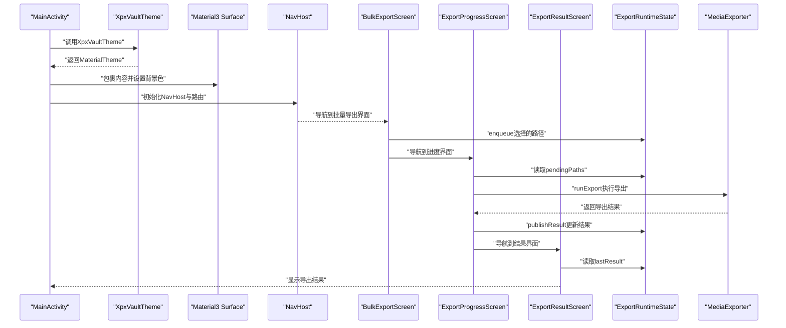

**图表来源**
- [MainActivity.kt:49-243](file://android/app/src/main/kotlin/com/xpx/vault/MainActivity.kt#L49-L243)
- [Theme.kt:9-18](file://android/app/src/main/kotlin/com/xpx/vault/ui/theme/Theme.kt#L9-L18)
- [BulkExportScreen.kt:57-179](file://android/app/src/main/kotlin/com/xpx/vault/ui/BulkExportScreen.kt#L57-L179)
- [ExportProgressScreen.kt:35-112](file://android/app/src/main/kotlin/com/xpx/vault/ui/ExportProgressScreen.kt#L35-L112)
- [ExportResultScreen.kt:37-134](file://android/app/src/main/kotlin/com/xpx/vault/ui/ExportResultScreen.kt#L37-L134)
- [ExportRuntimeState.kt:24-155](file://android/app/src/main/kotlin/com/xpx/vault/ui/export/ExportRuntimeState.kt#L24-L155)
- [MediaExporter.kt:27-218](file://android/app/src/main/kotlin/com/xpx/vault/ui/export/MediaExporter.kt#L27-L218)

## 详细组件分析

### 主题系统与定制
- 颜色方案：根据系统深浅模式动态选择Material 3颜色方案，Typography直接复用默认值。
- 设计令牌：UiTokens集中定义颜色、圆角、尺寸、文本字号，形成统一视觉规范，便于主题扩展与品牌化。
- 使用建议：新增主题时可在UiTokens中扩展颜色对象，或在XpxVaultTheme中增加条件分支以支持更多配色。

**图表来源**
- [Theme.kt:9-18](file://android/app/src/main/kotlin/com/xpx/vault/ui/theme/Theme.kt#L9-L18)
- [Type.kt:5](file://android/app/src/main/kotlin/com/xpx/vault/ui/theme/Type.kt#L5)
- [UiTokens.kt:9-220](file://android/app/src/main/kotlin/com/xpx/vault/ui/theme/UiTokens.kt#L9-L220)

**章节来源**
- [Theme.kt:9-18](file://android/app/src/main/kotlin/com/xpx/vault/ui/theme/Theme.kt#L9-L18)
- [Type.kt:5](file://android/app/src/main/kotlin/com/xpx/vault/ui/theme/Type.kt#L5)
- [UiTokens.kt:9-220](file://android/app/src/main/kotlin/com/xpx/vault/ui/theme/UiTokens.kt#L9-L220)

### 通用按钮组件 AppButton
- 功能特性：支持主/次/危险三类变体、禁用与加载态、统一高度与文字大小；内部使用UiTokens控制尺寸与颜色。
- 交互反馈：通过rememberThrottledClick对点击事件进行节流，避免重复触发。
- 扩展建议：如需图标按钮，可在组件中增加startIcon/结束Icon参数；如需不同高度，可引入可选Modifier覆盖。

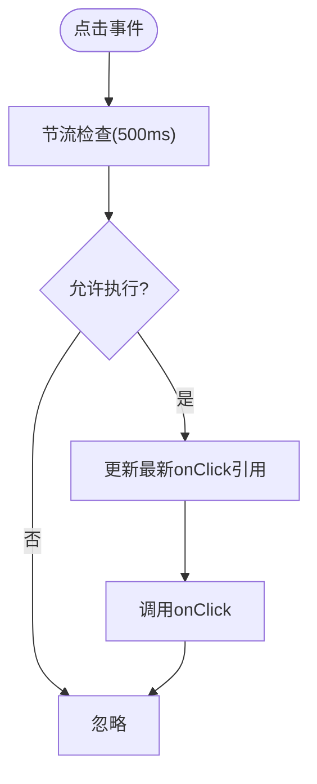

**图表来源**
- [AppButton.kt:26-66](file://android/app/src/main/kotlin/com/xpx/vault/ui/components/AppButton.kt#L26-L66)
- [ThrottledClick.kt:17-33](file://android/app/src/main/kotlin/com/xpx/vault/ui/feedback/ThrottledClick.kt#L17-L33)

**章节来源**
- [AppButton.kt:26-66](file://android/app/src/main/kotlin/com/xpx/vault/ui/components/AppButton.kt#L26-L66)
- [ThrottledClick.kt:17-33](file://android/app/src/main/kotlin/com/xpx/vault/ui/feedback/ThrottledClick.kt#L17-L33)

### 对话框组件 AppDialog
- 功能特性：统一容器背景与圆角、标题/正文文本样式、确认/取消按钮权重布局；支持可选取消按钮与自定义变体。
- 组合模式：内部复用AppButton，确保与主按钮风格一致。
- 使用建议：当需要更复杂的表单时，可将对话框文本区域替换为OutlinedTextField等输入控件。

**章节来源**
- [AppDialog.kt:22-83](file://android/app/src/main/kotlin/com/xpx/vault/ui/components/AppDialog.kt#L22-L83)
- [AppButton.kt:26-66](file://android/app/src/main/kotlin/com/xpx/vault/ui/components/AppButton.kt#L26-L66)

### 顶部导航栏组件 AppTopBar
- 功能特性：提供统一的标题栏布局，包含可点击的返回按钮、居中标题和占位空间；使用UiTokens控制颜色与尺寸。
- 交互反馈：返回按钮使用throttledClickable确保点击防抖；支持自定义修饰符扩展。
- 设计特点：采用Row布局，左侧返回按钮、中间标题文本、右侧占位符，整体居中对齐。

**图表来源**
- [AppTopBar.kt:26-63](file://android/app/src/main/kotlin/com/xpx/vault/ui/components/AppTopBar.kt#L26-L63)

**章节来源**
- [AppTopBar.kt:26-63](file://android/app/src/main/kotlin/com/xpx/vault/ui/components/AppTopBar.kt#L26-L63)

### 渐进式图片组件 VaultProgressiveImage
**重要更新** VaultProgressiveImage组件经过重大优化，显著提升了视觉一致性和性能表现：

- **核心功能增强**：
  - 支持缩略图优先加载、高质量图片延迟加载、渐进式显示效果
  - 新增`loadedBackgroundColor`参数，允许指定加载完成后的背景色，提升视觉一致性
  - 改进的呼吸效果（breathing effect），在加载超过300ms时自动启用，提供更自然的等待体验
  - 增强的视频支持，包括视频帧提取、时长显示和播放徽章

- **性能优化**：
  - 使用协程异步解码，避免阻塞主线程
  - 智能缩放算法，支持原图与缩略图的动态选择
  - 改进的内存管理，及时回收不需要的Bitmap资源
  - 优化的加载策略，减少不必要的重新解码

- **视觉体验提升**：
  - 渐进式背景图形，支持纯色背景替代
  - 自适应的渐变背景，区分图片和视频内容
  - 平滑的过渡动画，提升用户体验
  - 支持多种内容填充模式（Crop/Fit等）

- **使用场景**：
  - 适用于相册浏览、图片查看、视频预览等需要大量图片加载的场景
  - 支持不同分辨率需求，从缩略图到高清大图的完整加载流程

**章节来源**
- [VaultProgressiveImage.kt:23-90](file://android/app/src/main/kotlin/com/xpx/vault/ui/components/VaultProgressiveImage.kt#L23-L90)
- [VaultProgressiveImage.kt:50-216](file://android/app/src/main/kotlin/com/xpx/vault/ui/components/VaultProgressiveImage.kt#L50-L216)

### 批量导出界面组件系统

#### BulkExportScreen 批量导出界面
- **核心功能**：提供批量选择界面，支持图片/视频筛选、全选/取消全选、批量导出功能
- **界面组成**：
  - BulkExportTopBar：顶部导航栏，支持返回和全选操作
  - BulkExportFilterChips：筛选标签，支持全部/图片/视频三种筛选模式
  - LazyVerticalGrid：3列网格布局显示媒体项
  - 底部导出按钮：根据选择数量动态显示

- **交互特性**：
  - 支持选择模式切换，显示选择计数
  - 实时筛选功能，支持按类型过滤
  - 批量选择和取消选择
  - 导出前的状态验证和队列管理

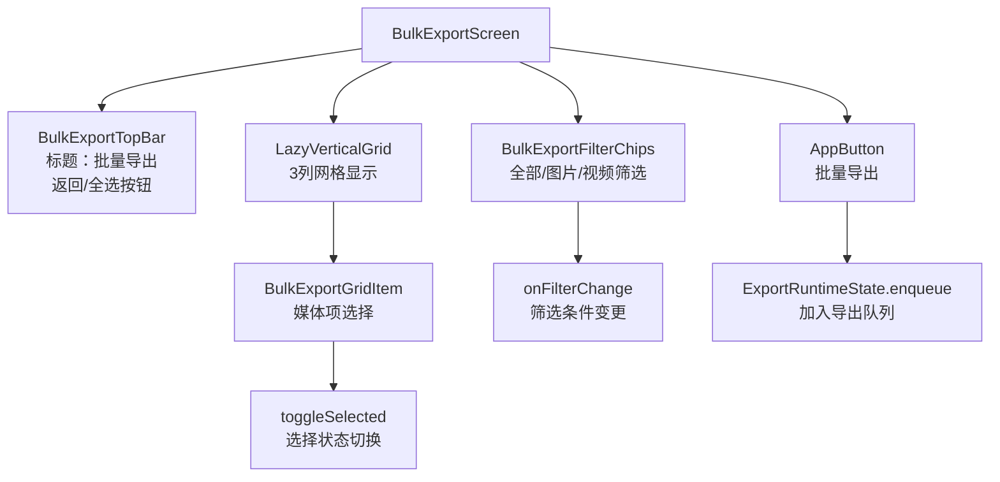

**图表来源**
- [BulkExportScreen.kt:57-179](file://android/app/src/main/kotlin/com/xpx/vault/ui/BulkExportScreen.kt#L57-L179)
- [BulkExportScreen.kt:182-234](file://android/app/src/main/kotlin/com/xpx/vault/ui/BulkExportScreen.kt#L182-L234)
- [BulkExportScreen.kt:236-289](file://android/app/src/main/kotlin/com/xpx/vault/ui/BulkExportScreen.kt#L236-L289)
- [BulkExportScreen.kt:291-341](file://android/app/src/main/kotlin/com/xpx/vault/ui/BulkExportScreen.kt#L291-L341)

**章节来源**
- [BulkExportScreen.kt:55-341](file://android/app/src/main/kotlin/com/xpx/vault/ui/BulkExportScreen.kt#L55-L341)

#### ExportProgressScreen 导出进度界面
- **核心功能**：显示导出进度，包括进度条、已完成/总数统计、当前处理文件名
- **状态管理**：通过ExportRuntimeState获取进度状态，自动更新UI
- **界面设计**：
  - 中央进度指示器，显示导出进度
  - 进度统计信息，显示已完成数量和总数量
  - 当前文件名显示，提供实时反馈
  - AppTopBar统一导航

**重要更新**：ExportProgressScreen现已添加完整的取消支持系统

- **取消支持系统**：
  - **BackHandler集成**：拦截系统返回键，防止误操作中断导出
  - **AlertDialog确认对话框**：提供明确的取消确认，避免意外中断
  - **协程取消支持**：通过exportJob.cancel()中断正在进行的导出任务
  - **状态清理**：取消时清除pendingPaths，避免残留状态
  - **用户反馈**：cancelled状态控制导航行为，确保用户体验连贯

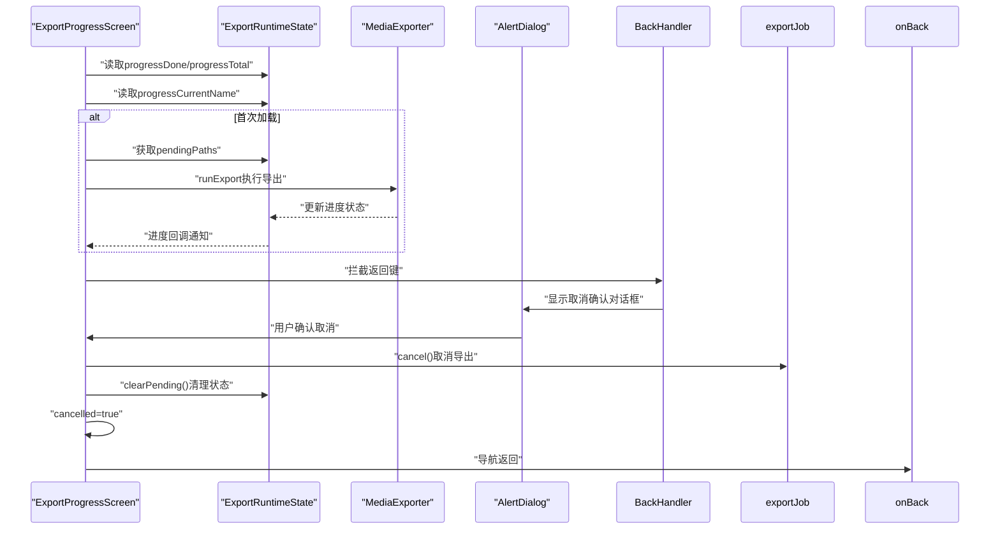

**图表来源**
- [ExportProgressScreen.kt:35-112](file://android/app/src/main/kotlin/com/xpx/vault/ui/ExportProgressScreen.kt#L35-L112)
- [ExportProgressScreen.kt:83-106](file://android/app/src/main/kotlin/com/xpx/vault/ui/ExportProgressScreen.kt#L83-L106)
- [ExportRuntimeState.kt:68-128](file://android/app/src/main/kotlin/com/xpx/vault/ui/export/ExportRuntimeState.kt#L68-L128)

**章节来源**
- [ExportProgressScreen.kt:36-112](file://android/app/src/main/kotlin/com/xpx/vault/ui/ExportProgressScreen.kt#L36-L112)
- [ExportProgressScreen.kt:83-106](file://android/app/src/main/kotlin/com/xpx/vault/ui/ExportProgressScreen.kt#L83-L106)

#### ExportResultScreen 导出结果界面
- **核心功能**：展示导出结果，包括成功/失败统计、操作按钮
- **结果展示**：
  - 成功/部分成功/全部失败的不同提示
  - 成功数量和总数量统计
  - 失败文件数量提示
  - 结果徽章和图标

- **操作功能**：
  - 打开系统相册按钮
  - 完成按钮，关闭结果界面
  - 自动导航到结果界面

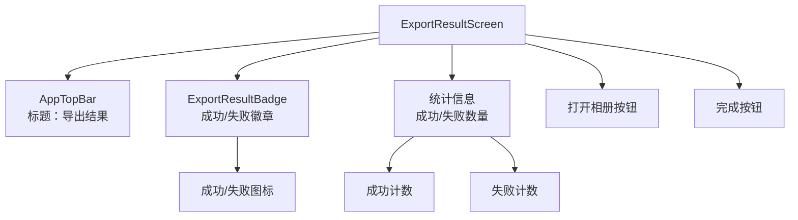

**图表来源**
- [ExportResultScreen.kt:37-134](file://android/app/src/main/kotlin/com/xpx/vault/ui/ExportResultScreen.kt#L37-L134)
- [ExportResultScreen.kt:114-134](file://android/app/src/main/kotlin/com/xpx/vault/ui/ExportResultScreen.kt#L114-L134)

**章节来源**
- [ExportResultScreen.kt:38-134](file://android/app/src/main/kotlin/com/xpx/vault/ui/ExportResultScreen.kt#L38-L134)

#### ExportRuntimeState 导出运行时状态
- **核心职责**：管理批量导出过程中的状态共享，包括待处理路径、进度状态、最终结果
- **状态管理**：
  - pendingPaths：待导出的文件路径列表
  - progressDone/progressTotal：进度计数器
  - progressCurrentName：当前处理的文件名
  - lastResult：最后的导出结果

- **并发控制**：
  - 最大并发度3，平衡性能和资源使用
  - 进度更新节流，避免频繁重组
  - 原子计数器确保线程安全

**章节来源**
- [ExportRuntimeState.kt:24-155](file://android/app/src/main/kotlin/com/xpx/vault/ui/export/ExportRuntimeState.kt#L24-L155)

#### MediaExporter 导出器
- **核心功能**：执行实际的媒体文件导出操作到系统相册
- **平台适配**：
  - Android 10+：使用MediaStore API，支持RELATIVE_PATH和IS_PENDING事务
  - Android 9及以下：直接写入公共目录，通过MediaScanner触发扫描
- **性能优化**：
  - 零拷贝传输，优先使用FileChannel.transferTo
  - 回退到256KB缓冲区拷贝，确保兼容性
  - 智能文件名生成，避免冲突

**章节来源**
- [MediaExporter.kt:27-218](file://android/app/src/main/kotlin/com/xpx/vault/ui/export/MediaExporter.kt#L27-L218)

### 相册选择模式组件

#### AlbumTopBar 相册顶部导航
- **功能特性**：支持普通模式和选择模式的顶部导航栏
- **模式切换**：
  - 普通模式：显示相册名称和选择按钮
  - 选择模式：显示选择计数和全选/取消全选按钮
- **交互反馈**：统一的返回和选择按钮样式，使用throttledClickable确保防抖

**章节来源**
- [AlbumScreen.kt:298-368](file://android/app/src/main/kotlin/com/xpx/vault/ui/AlbumScreen.kt#L298-L368)

#### AlbumSelectionBottomBar 相册选择底部栏
- **功能特性**：提供批量操作的底部工具栏
- **操作按钮**：
  - 分享按钮：分享选中的媒体
  - 导出到相机胶卷：批量导出到系统相册
  - 删除按钮：删除选中的媒体
- **状态管理**：根据选择数量动态启用/禁用按钮

**章节来源**
- [AlbumScreen.kt:434-474](file://android/app/src/main/kotlin/com/xpx/vault/ui/AlbumScreen.kt#L434-L474)

#### BottomActionButton 底部操作按钮
- **功能特性**：通用的底部操作按钮组件
- **样式变体**：
  - 普通状态：使用主色调
  - 选中状态：使用强调色
  - 危险状态：使用错误色（删除）
  - 主要状态：使用成功色（导出）
- **交互反馈**：集成PressFeedback和ThrottledClick，提供一致的触觉反馈

**章节来源**
- [AlbumScreen.kt:476-542](file://android/app/src/main/kotlin/com/xpx/vault/ui/AlbumScreen.kt#L476-L542)

### 交互反馈系统
- 按压反馈 PressFeedback：基于InteractionSource监听按压状态，使用animateFloatAsState在按压与释放时分别应用缩放与透明度动画，提升触觉反馈。新增extraHighlight参数支持额外高亮效果。
- 节流点击 ThrottledClick：提供rememberThrottledClick与throttledClickable两个API，前者返回函数，后者作为Modifier链式使用，适合不同场景。
- **新增**：批量选择反馈：AlbumSelectionBottomBar中的BottomActionButton组件集成了增强的PressFeedback系统，提供按压缩放、阴影和额外高亮效果。

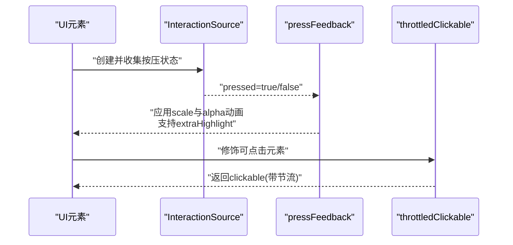

**图表来源**
- [PressFeedback.kt:18-37](file://android/app/src/main/kotlin/com/xpx/vault/ui/feedback/PressFeedback.kt#L18-L37)
- [ThrottledClick.kt:35-52](file://android/app/src/main/kotlin/com/xpx/vault/ui/feedback/ThrottledClick.kt#L35-L52)

**章节来源**
- [PressFeedback.kt:18-37](file://android/app/src/main/kotlin/com/xpx/vault/ui/feedback/PressFeedback.kt#L18-L37)
- [ThrottledClick.kt:17-52](file://android/app/src/main/kotlin/com/xpx/vault/ui/feedback/ThrottledClick.kt#L17-L52)

### 锁屏与生物识别 LockScreen
- 生物识别：检测可用性并弹出BiometricPrompt，失败时回退到PIN解锁；成功后可引导开启生物识别。
- UI状态：根据阶段与错误显示不同提示与按钮；使用AppDialog二次确认开启生物识别。
- 交互：数字键盘与快捷拍照按键均应用pressFeedback与throttledClickable，保证一致性与防抖。

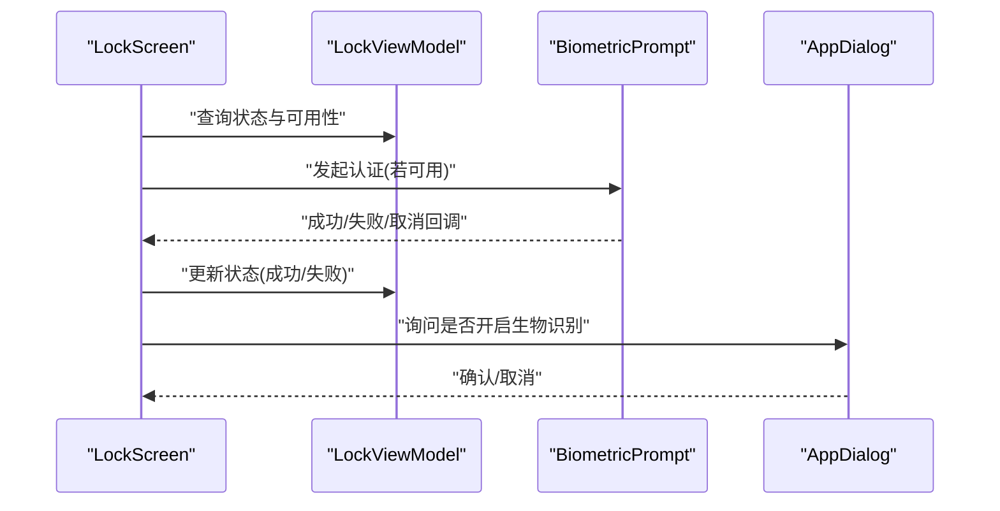

**图表来源**
- [LockScreen.kt:52-228](file://android/app/src/main/kotlin/com/xpx/vault/ui/lock/LockScreen.kt#L52-L228)
- [AppDialog.kt:22-83](file://android/app/src/main/kotlin/com/xpx/vault/ui/components/AppDialog.kt#L22-L83)

**章节来源**
- [LockScreen.kt:52-228](file://android/app/src/main/kotlin/com/xpx/vault/ui/lock/LockScreen.kt#L52-L228)

### 首页与相册 HomeScreen
- 数据与状态：通过VaultStore加载快照，缓存最近照片与相册列表；生命周期事件触发刷新。
- 权限与导入：请求相册读取权限，支持从图库批量导入；导入结果以提示信息反馈。
- 布局与网格：使用LazyColumn/LazyRow与LazyVerticalGrid构建相册与最近照片区；底部导航HomeBottomNav按选中状态高亮。
- 交互：所有可点击项均应用pressFeedback与throttledClickable，确保一致的触觉反馈与防抖。
- **新增**：引入VaultEmptyActionButton组件，提供统一的空状态操作按钮样式，支持主要和次要两种类型，内置加载状态指示器。

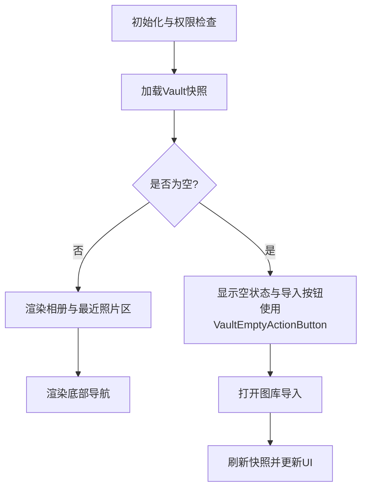

**图表来源**
- [HomeScreen.kt:84-334](file://android/app/src/main/kotlin/com/xpx/vault/ui/HomeScreen.kt#L84-L334)
- [VaultStore.kt:39-114](file://android/app/src/main/kotlin/com/xpx/vault/ui/vault/VaultStore.kt#L39-L114)

**章节来源**
- [HomeScreen.kt:84-334](file://android/app/src/main/kotlin/com/xpx/vault/ui/HomeScreen.kt#L84-L334)
- [VaultStore.kt:39-114](file://android/app/src/main/kotlin/com/xpx/vault/ui/vault/VaultStore.kt#L39-L114)

### 相册详情 AlbumScreen
- **重构**：完全重构的相册详情界面，采用AppTopBar统一顶部导航。
- 功能特性：显示相册内所有图片，支持添加新图片；空状态时提供添加按钮的视觉反馈。
- 交互增强：使用增强的pressFeedback系统，添加按钮具有按压缩放和阴影效果，通过plusPressFeedback修饰符实现。
- **新增**：完整的相册选择模式，支持批量选择、全选/取消全选、底部操作栏等完整功能。

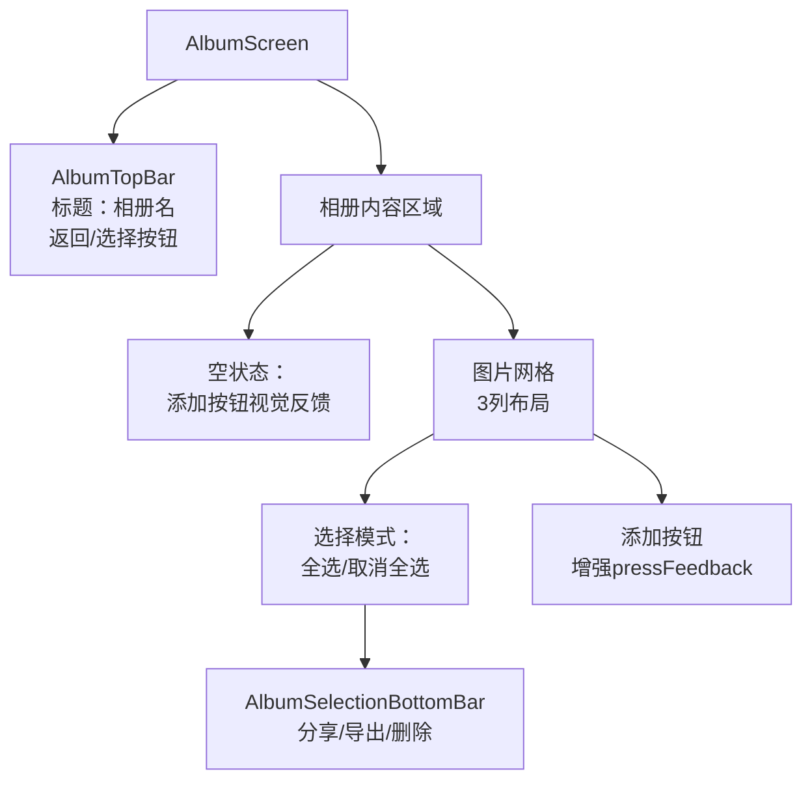

**图表来源**
- [AlbumScreen.kt:64-245](file://android/app/src/main/kotlin/com/xpx/vault/ui/AlbumScreen.kt#L64-L245)
- [AlbumScreen.kt:135-373](file://android/app/src/main/kotlin/com/xpx/vault/ui/AlbumScreen.kt#L135-L373)
- [AlbumScreen.kt:434-474](file://android/app/src/main/kotlin/com/xpx/vault/ui/AlbumScreen.kt#L434-L474)

**章节来源**
- [AlbumScreen.kt:64-245](file://android/app/src/main/kotlin/com/xpx/vault/ui/AlbumScreen.kt#L64-L245)

### 搜索界面 VaultSearchScreen
- **重构**：完全重构的搜索界面，采用AppTopBar统一顶部导航。
- 功能特性：提供搜索输入框、搜索结果网格显示、实时搜索功能。
- 交互特性：使用ThrottledClick确保搜索输入的防抖处理，提升用户体验。

**章节来源**
- [VaultSearchScreen.kt:45-135](file://android/app/src/main/kotlin/com/xpx/vault/ui/VaultSearchScreen.kt#L45-L135)

### 多屏切换 MainScreen
- 切换策略：通过alpha与zIndex控制各屏可见性与层级，仅在对应Tab激活时显示；其余屏隐藏但保留状态。
- 适用场景：适用于Tab切换频繁且内容体量较大的场景，减少重建成本。

**章节来源**
- [MainScreen.kt:14-80](file://android/app/src/main/kotlin/com/xpx/vault/ui/MainScreen.kt#L14-L80)

### AI首页与主题支持
- 布局：顶部标题与中间空状态卡片，底部可选导航；使用UiTokens统一颜色与尺寸。
- 主题：继承XpxVaultTheme，自动适配深浅模式与Typography。

**章节来源**
- [AiHomeScreen.kt:23-54](file://android/app/src/main/kotlin/com/xpx/vault/ui/AiHomeScreen.kt#L23-L54)
- [Theme.kt:9-18](file://android/app/src/main/kotlin/com/xpx/vault/ui/theme/Theme.kt#L9-L18)

## 依赖关系分析
- 入口依赖：MainActivity依赖XpxVaultTheme与各业务屏幕；PhotoVaultApp提供全局异常边界与依赖注入。
- 组件依赖：HomeScreen、LockScreen、AlbumScreen、VaultSearchScreen依赖AppButton、AppDialog、AppTopBar与反馈系统；VaultStore提供数据与IO能力。
- **新增**：导出功能依赖ExportRuntimeState和MediaExporter在多个屏幕间共享状态和执行导出操作。
- 主题依赖：UiTokens被各屏幕与组件广泛引用，形成统一视觉基础。

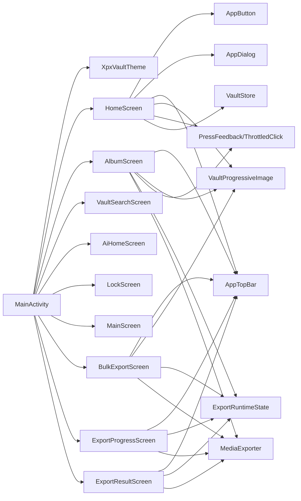

**图表来源**
- [MainActivity.kt:49-243](file://android/app/src/main/kotlin/com/xpx/vault/MainActivity.kt#L49-L243)
- [HomeScreen.kt:84-334](file://android/app/src/main/kotlin/com/xpx/vault/ui/HomeScreen.kt#L84-L334)
- [AlbumScreen.kt:64-245](file://android/app/src/main/kotlin/com/xpx/vault/ui/AlbumScreen.kt#L64-L245)
- [VaultSearchScreen.kt:45-135](file://android/app/src/main/kotlin/com/xpx/vault/ui/VaultSearchScreen.kt#L45-L135)
- [LockScreen.kt:52-228](file://android/app/src/main/kotlin/com/xpx/vault/ui/lock/LockScreen.kt#L52-L228)
- [MainScreen.kt:14-80](file://android/app/src/main/kotlin/com/xpx/vault/ui/MainScreen.kt#L14-L80)
- [AppButton.kt:26-66](file://android/app/src/main/kotlin/com/xpx/vault/ui/components/AppButton.kt#L26-L66)
- [AppDialog.kt:22-83](file://android/app/src/main/kotlin/com/xpx/vault/ui/components/AppDialog.kt#L22-L83)
- [AppTopBar.kt:26-63](file://android/app/src/main/kotlin/com/xpx/vault/ui/components/AppTopBar.kt#L26-L63)
- [PressFeedback.kt:18-37](file://android/app/src/main/kotlin/com/xpx/vault/ui/feedback/PressFeedback.kt#L18-L37)
- [ThrottledClick.kt:17-52](file://android/app/src/main/kotlin/com/xpx/vault/ui/feedback/ThrottledClick.kt#L17-L52)
- [VaultStore.kt:39-114](file://android/app/src/main/kotlin/com/xpx/vault/ui/vault/VaultStore.kt#L39-L114)
- [BulkExportScreen.kt:57-179](file://android/app/src/main/kotlin/com/xpx/vault/ui/BulkExportScreen.kt#L57-L179)
- [ExportProgressScreen.kt:35-112](file://android/app/src/main/kotlin/com/xpx/vault/ui/ExportProgressScreen.kt#L35-L112)
- [ExportResultScreen.kt:37-134](file://android/app/src/main/kotlin/com/xpx/vault/ui/ExportResultScreen.kt#L37-L134)
- [ExportRuntimeState.kt:24-155](file://android/app/src/main/kotlin/com/xpx/vault/ui/export/ExportRuntimeState.kt#L24-L155)
- [MediaExporter.kt:27-218](file://android/app/src/main/kotlin/com/xpx/vault/ui/export/MediaExporter.kt#L27-L218)

**章节来源**
- [MainActivity.kt:49-243](file://android/app/src/main/kotlin/com/xpx/vault/MainActivity.kt#L49-L243)

## 性能考量
- 组合与懒加载：使用LazyColumn/LazyRow/LazyVerticalGrid按需渲染，降低首帧压力。
- 缓存与去抖：VaultStore缓存快照与相册内照片列表；AppButton与按键均使用ThrottledClick避免重复IO与状态变更。
- 视觉资源：UiTokens集中管理尺寸与半径，减少重复计算；图片加载使用decodeFile并按需裁剪，避免过度内存占用。
- 导航与层级：MainScreen通过alpha/zIndex切换而非重建，降低切换开销。
- **重要更新** VaultProgressiveImage组件优化图片加载性能，支持渐进式显示与智能缩放，新增呼吸效果和背景色定制功能，显著提升用户体验和视觉一致性。
- **新增** 导出功能性能优化：ExportRuntimeState使用最大并发度3，进度更新节流100ms，避免频繁重组；MediaExporter采用零拷贝传输和256KB缓冲区回退策略，确保大文件传输效率。
- **重要更新** ExportProgressScreen的取消支持系统优化了用户体验，通过BackHandler和AlertDialog确保用户能够安全地取消导出操作，同时避免误操作中断正在进行的任务。

## 故障排查指南
- 冷启动白屏：themes.xml与colors.xml中设置windowBackground与状态栏/导航栏颜色，避免系统默认导致的闪烁。
- 生物识别不可用：在LockScreen中根据返回的不可用原因提示用户前往系统设置录入或启用生物识别。
- 权限拒绝：HomeScreen中区分"永久拒绝"与"可再次申请"，提供"打开设置"入口。
- 点击抖动：确认使用throttledClickable或rememberThrottledClick包裹onClick；检查节流间隔是否合理。
- 深浅主题不一致：确认XpxVaultTheme正确读取系统深浅模式并传入MaterialTheme。
- **新增**：AppTopBar图标显示问题：检查ic_topbar_back资源是否存在且正确引用。
- **新增**：VaultProgressiveImage加载异常：检查图片路径有效性，确认内存充足，验证thumbnailMaxPx参数设置是否合理。
- **新增**：批量导出功能问题：
  - 检查ExportRuntimeState.enqueue是否正确接收选择的路径
  - 验证MediaExporter.exportFile的文件路径和权限
  - 确认Android版本兼容性（10+使用MediaStore，9及以下使用传统方式）
  - 检查导出目录权限和存储空间
- **重要更新**：ExportProgressScreen取消功能问题：
  - 确认BackHandler的enabled状态正确反映finished和cancelled状态
  - 检查AlertDialog的显示逻辑和用户交互
  - 验证exportJob.cancel()是否正确中断协程
  - 确认ExportRuntimeState.clearPending()在取消时被调用
  - 检查cancelled状态是否正确传递给onBack回调

**章节来源**
- [themes.xml:1-10](file://android/app/src/main/res/values/themes.xml#L1-L10)
- [colors.xml:1-6](file://android/app/src/main/res/values/colors.xml#L1-L6)
- [LockScreen.kt:360-382](file://android/app/src/main/kotlin/com/xpx/vault/ui/lock/LockScreen.kt#L360-L382)
- [HomeScreen.kt:568-636](file://android/app/src/main/kotlin/com/xpx/vault/ui/HomeScreen.kt#L568-L636)
- [ThrottledClick.kt:17-33](file://android/app/src/main/kotlin/com/xpx/vault/ui/feedback/ThrottledClick.kt#L17-L33)
- [Theme.kt:9-18](file://android/app/src/main/kotlin/com/xpx/vault/ui/theme/Theme.kt#L9-L18)
- [BulkExportScreen.kt:57-179](file://android/app/src/main/kotlin/com/xpx/vault/ui/BulkExportScreen.kt#L57-L179)
- [ExportProgressScreen.kt:35-112](file://android/app/src/main/kotlin/com/xpx/vault/ui/ExportProgressScreen.kt#L35-L112)
- [ExportResultScreen.kt:37-134](file://android/app/src/main/kotlin/com/xpx/vault/ui/ExportResultScreen.kt#L37-L134)
- [ExportRuntimeState.kt:24-155](file://android/app/src/main/kotlin/com/xpx/vault/ui/export/ExportRuntimeState.kt#L24-L155)
- [MediaExporter.kt:27-218](file://android/app/src/main/kotlin/com/xpx/vault/ui/export/MediaExporter.kt#L27-L218)
- [ExportProgressScreen.kt:83-106](file://android/app/src/main/kotlin/com/xpx/vault/ui/ExportProgressScreen.kt#L83-L106)

## 结论
本UI组件系统以XpxVaultTheme为核心，配合UiTokens统一视觉规范，通过AppButton、AppDialog、AppTopBar与反馈系统提供一致的交互体验；HomeScreen、LockScreen、AiHomeScreen、AlbumScreen、VaultSearchScreen与MainScreen以组合方式实现功能模块化与可扩展性。新增的AppTopBar组件系统提供了统一的顶部导航体验，VaultEmptyActionButton增强了空状态的操作一致性，改进的PressFeedback系统提升了整体交互反馈质量。**最重要的是，VaultProgressiveImage组件经过重大优化，显著提升了视觉一致性和性能表现，新增的背景色定制、呼吸效果和视频支持等功能，为用户提供了更加流畅和专业的图片浏览体验。**

**本次更新新增了完整的批量导出功能界面系统，包括BulkExportScreen、ExportProgressScreen、ExportResultScreen等核心组件，以及ExportRuntimeState运行时状态管理和MediaExporter导出器。这些组件形成了从选择到导出再到结果展示的完整工作流，支持图片和视频的批量导出，具有良好的性能优化和用户体验。同时，AlbumScreen的相册选择模式也得到了增强，提供了完整的批量操作能力。**

**特别重要的是，ExportProgressScreen现已添加了完整的取消支持系统，通过BackHandler集成和AlertDialog确认对话框，确保用户能够在导出过程中安全地取消操作。这一更新显著提升了用户体验，避免了误操作中断导出任务，同时通过协程取消机制确保资源得到正确清理。**

建议在保持UiTokens稳定的基础上，逐步扩展主题与样式变量，完善无障碍与跨设备适配，持续优化懒加载与状态缓存策略。

## 附录

### 组件属性与事件处理清单
- AppButton
  - 属性：text、variant、enabled、loading、modifier
  - 事件：onClick（经rememberThrottledClick）
  - 样式：颜色来自UiColors，高度与字号来自UiSize/UiTextSize
- AppDialog
  - 属性：show、title、message、confirmText、dismissText、confirmVariant、onConfirm、onDismiss
  - 事件：确认/取消回调
  - 样式：容器背景与圆角来自UiColors/UiRadius，文本来自UiTextSize
- **新增** AppTopBar
  - 属性：title、onBack、modifier
  - 事件：onBack回调（经throttledClickable）
  - 样式：使用UiTokens控制颜色与尺寸
- **重要更新** VaultProgressiveImage
  - 属性：path、modifier、contentDescription、contentScale、thumbnailMaxPx、loadHighQuality、highQualityMaxPx、showVideoIndicator、loadedBackgroundColor
  - 事件：无
  - 样式：渐进式加载效果，支持多种内容填充模式，新增背景色定制功能
- **新增** BulkExportScreen
  - 属性：onOpenExportProgress、onBack
  - 事件：批量导出、筛选变更、选择状态变更
  - 样式：使用UiTokens统一颜色与尺寸，支持3列网格布局
- **重要更新** ExportProgressScreen
  - 属性：onExportSuccess、onBack
  - 事件：进度更新、导出完成、取消确认
  - 样式：中央进度指示器，统计信息展示
  - **新增**：BackHandler取消支持，AlertDialog确认对话框
- **新增** ExportResultScreen
  - 属性：onDone
  - 事件：打开相册、完成操作
  - 样式：结果徽章、统计信息、操作按钮
- **新增** ExportRuntimeState
  - 属性：pendingPaths、progressDone、progressTotal、progressCurrentName、lastResult
  - 事件：状态更新、结果发布
  - 功能：批量导出状态管理、并发控制、进度节流、协程取消支持
- **新增** MediaExporter
  - 属性：无
  - 事件：导出完成、失败回调
  - 功能：平台适配、性能优化、文件名生成、协程取消处理
- PressFeedback
  - 修饰：pressFeedback(Modifier)
  - 行为：按压缩放与透明度动画，支持extraHighlight参数
- ThrottledClick
  - API：rememberThrottledClick(intervalMs, onClick)、throttledClickable(...)
  - 行为：点击节流，避免重复触发

**章节来源**
- [AppButton.kt:26-66](file://android/app/src/main/kotlin/com/xpx/vault/ui/components/AppButton.kt#L26-L66)
- [AppDialog.kt:22-83](file://android/app/src/main/kotlin/com/xpx/vault/ui/components/AppDialog.kt#L22-L83)
- [AppTopBar.kt:26-63](file://android/app/src/main/kotlin/com/xpx/vault/ui/components/AppTopBar.kt#L26-L63)
- [VaultProgressiveImage.kt:23-90](file://android/app/src/main/kotlin/com/xpx/vault/ui/components/VaultProgressiveImage.kt#L23-L90)
- [BulkExportScreen.kt:55-341](file://android/app/src/main/kotlin/com/xpx/vault/ui/BulkExportScreen.kt#L55-L341)
- [ExportProgressScreen.kt:36-112](file://android/app/src/main/kotlin/com/xpx/vault/ui/ExportProgressScreen.kt#L36-L112)
- [ExportProgressScreen.kt:83-106](file://android/app/src/main/kotlin/com/xpx/vault/ui/ExportProgressScreen.kt#L83-L106)
- [ExportResultScreen.kt:38-134](file://android/app/src/main/kotlin/com/xpx/vault/ui/ExportResultScreen.kt#L38-L134)
- [ExportRuntimeState.kt:24-155](file://android/app/src/main/kotlin/com/xpx/vault/ui/export/ExportRuntimeState.kt#L24-L155)
- [MediaExporter.kt:27-218](file://android/app/src/main/kotlin/com/xpx/vault/ui/export/MediaExporter.kt#L27-L218)
- [PressFeedback.kt:18-37](file://android/app/src/main/kotlin/com/xpx/vault/ui/feedback/PressFeedback.kt#L18-L37)
- [ThrottledClick.kt:17-52](file://android/app/src/main/kotlin/com/xpx/vault/ui/feedback/ThrottledClick.kt#L17-L52)

### 可访问性合规与跨设备兼容
- 可访问性：为图标与按钮提供contentDescription；确保文本对比度满足WCAG；使用Material 3语义化组件。
- 跨设备：使用相对单位与UiTokens尺寸；在不同屏幕密度下验证图片与图标清晰度；测试深浅主题下的可读性。
- **新增**：AppTopBar组件提供统一的导航体验，确保在不同设备上的导航一致性。
- **新增**：VaultProgressiveImage组件支持多种内容填充模式，确保在不同设备和屏幕尺寸下的最佳显示效果。
- **新增**：批量导出界面支持响应式布局，在不同屏幕尺寸下自动调整网格列数和间距。
- **新增**：导出功能支持Android版本差异，自动适配MediaStore API和传统文件系统写入方式。
- **重要更新**：ExportProgressScreen的取消支持系统确保在不同设备上的一致用户体验，BackHandler和AlertDialog在各种设备上都能正常工作。