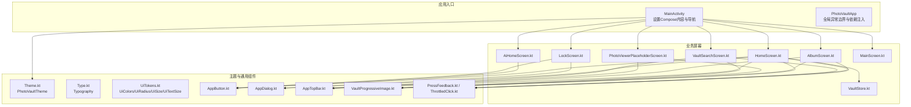
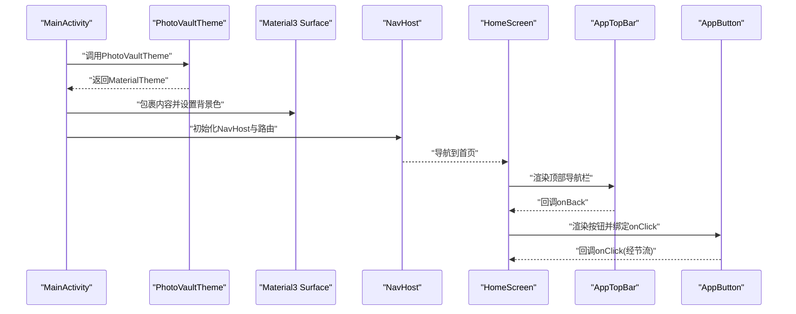
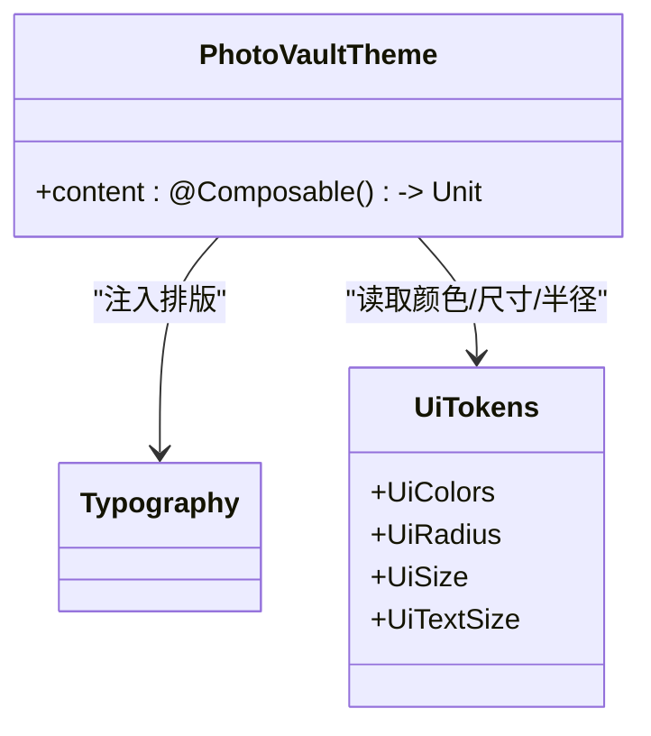
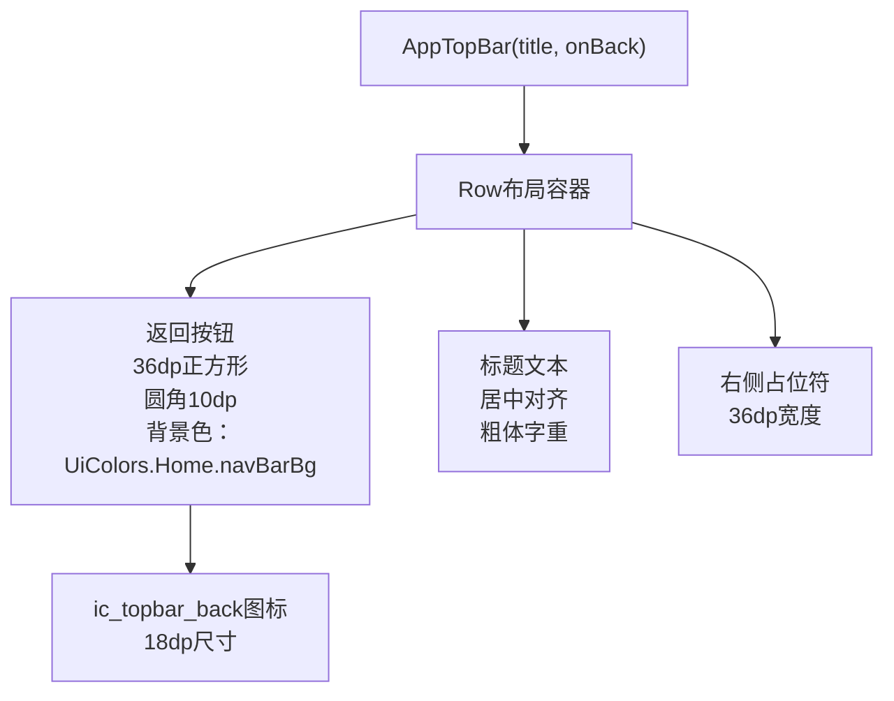
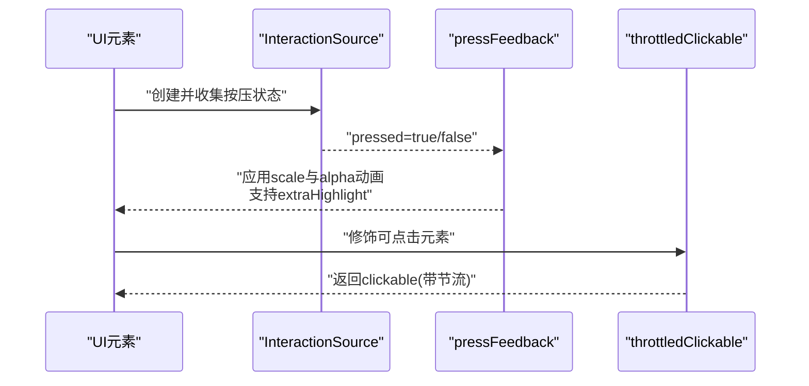
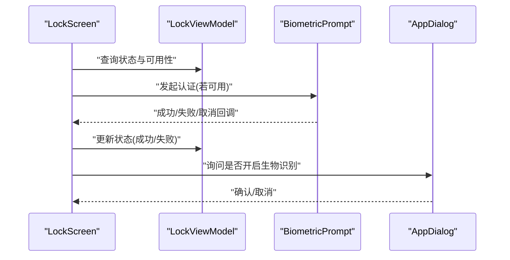
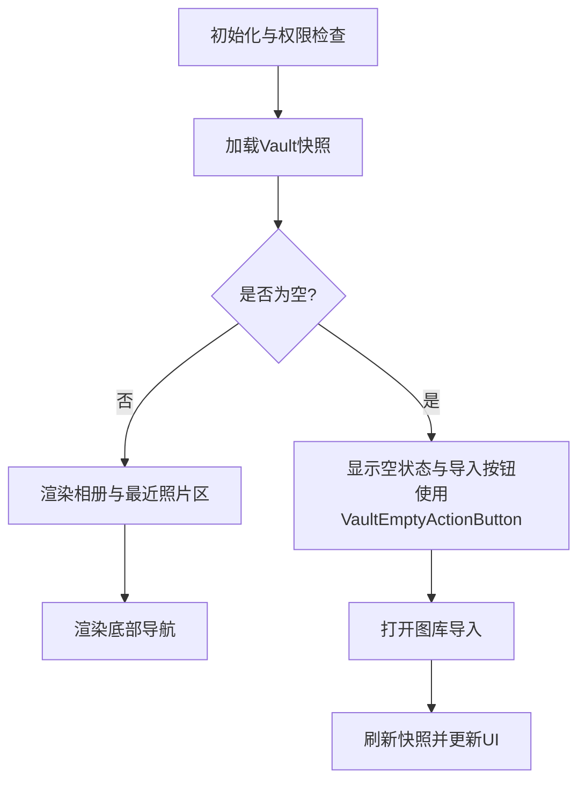
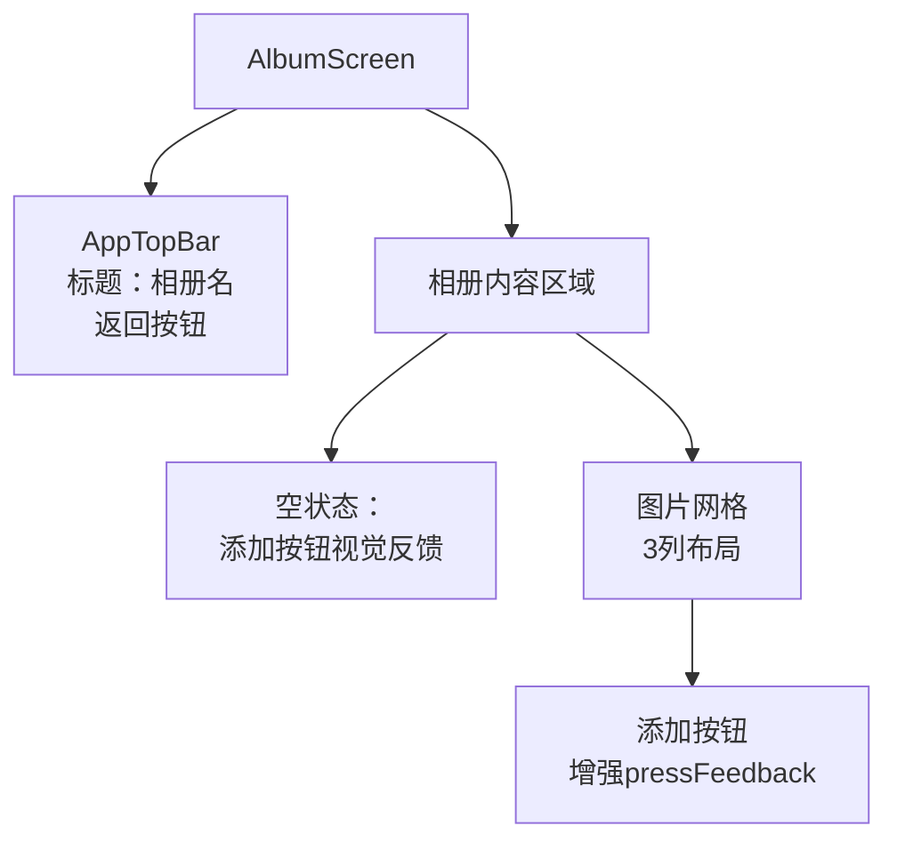
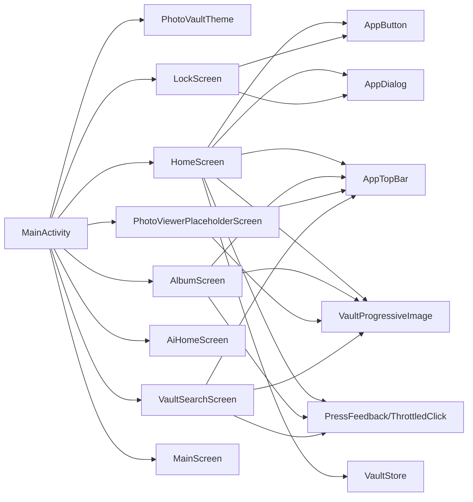

# UI组件系统

<cite>
**本文引用的文件**
- [Theme.kt](file://android/app/src/main/kotlin/com/photovault/app/ui/theme/Theme.kt)
- [Type.kt](file://android/app/src/main/kotlin/com/photovault/app/ui/theme/Type.kt)
- [UiTokens.kt](file://android/app/src/main/kotlin/com/photovault/app/ui/theme/UiTokens.kt)
- [AppButton.kt](file://android/app/src/main/kotlin/com/photovault/app/ui/components/AppButton.kt)
- [AppDialog.kt](file://android/app/src/main/kotlin/com/photovault/app/ui/components/AppDialog.kt)
- [AppTopBar.kt](file://android/app/src/main/kotlin/com/photovault/app/ui/components/AppTopBar.kt)
- [VaultProgressiveImage.kt](file://android/app/src/main/kotlin/com/photovault/app/ui/components/VaultProgressiveImage.kt)
- [PressFeedback.kt](file://android/app/src/main/kotlin/com/photovault/app/ui/feedback/PressFeedback.kt)
- [ThrottledClick.kt](file://android/app/src/main/kotlin/com/photovault/app/ui/feedback/ThrottledClick.kt)
- [LockScreen.kt](file://android/app/src/main/kotlin/com/photovault/app/ui/lock/LockScreen.kt)
- [AiHomeScreen.kt](file://android/app/src/main/kotlin/com/photovault/app/ui/AiHomeScreen.kt)
- [HomeScreen.kt](file://android/app/src/main/kotlin/com/photovault/app/ui/HomeScreen.kt)
- [AlbumScreen.kt](file://android/app/src/main/kotlin/com/photovault/app/ui/AlbumScreen.kt)
- [PhotoViewerPlaceholderScreen.kt](file://android/app/src/main/kotlin/com/photovault/app/ui/PhotoViewerPlaceholderScreen.kt)
- [VaultSearchScreen.kt](file://android/app/src/main/kotlin/com/photovault/app/ui/VaultSearchScreen.kt)
- [VaultStore.kt](file://android/app/src/main/kotlin/com/photovault/app/ui/vault/VaultStore.kt)
- [MainScreen.kt](file://android/app/src/main/kotlin/com/photovault/app/ui/MainScreen.kt)
- [themes.xml](file://android/app/src/main/res/values/themes.xml)
- [colors.xml](file://android/app/src/main/res/values/colors.xml)
- [PhotoVaultApp.kt](file://android/app/src/main/kotlin/com/photovault/app/PhotoVaultApp.kt)
- [MainActivity.kt](file://android/app/src/main/kotlin/com/photovault/app/MainActivity.kt)
</cite>

## 更新摘要
**变更内容**
- 新增AppTopBar组件系统，提供统一的顶部导航栏
- 重构HomeScreen、AlbumScreen、PhotoViewerPlaceholderScreen和VaultSearchScreen的UI架构
- 引入VaultEmptyActionButton组件，增强空状态操作按钮
- 改进PressFeedback系统，提供更丰富的交互反馈
- 增强整体交互反馈机制的一致性和用户体验

## 目录
1. [简介](#简介)
2. [项目结构](#项目结构)
3. [核心组件](#核心组件)
4. [架构总览](#架构总览)
5. [详细组件分析](#详细组件分析)
6. [依赖关系分析](#依赖关系分析)
7. [性能考量](#性能考量)
8. [故障排查指南](#故障排查指南)
9. [结论](#结论)
10. [附录](#附录)

## 简介
本文件面向AI照片保险库项目的UI组件系统，聚焦Jetpack Compose的组件设计理念与实现方式，系统化阐述Material 3主题体系的配置与定制、响应式设计策略、交互反馈机制、组件属性与事件处理、状态管理、样式定制与主题支持、组件组合模式以及与导航系统的集成方式，并提供可访问性合规建议与跨设备兼容性考虑，帮助UI开发者高效使用与扩展组件。

## 项目结构
UI层采用按功能域分层组织：主题与通用组件位于ui/theme与ui/components，交互反馈位于ui/feedback，业务场景屏幕位于ui/下各子包，入口在MainActivity中统一渲染与导航。

**图表来源**
- [MainActivity.kt:46-243](file://android/app/src/main/kotlin/com/photovault/app/MainActivity.kt#L46-L243)
- [Theme.kt:9-18](file://android/app/src/main/kotlin/com/photovault/app/ui/theme/Theme.kt#L9-L18)
- [HomeScreen.kt:84-334](file://android/app/src/main/kotlin/com/photovault/app/ui/HomeScreen.kt#L84-L334)
- [AlbumScreen.kt:64-245](file://android/app/src/main/kotlin/com/photovault/app/ui/AlbumScreen.kt#L64-L245)
- [PhotoViewerPlaceholderScreen.kt:36-134](file://android/app/src/main/kotlin/com/photovault/app/ui/PhotoViewerPlaceholderScreen.kt#L36-L134)
- [VaultSearchScreen.kt:45-135](file://android/app/src/main/kotlin/com/photovault/app/ui/VaultSearchScreen.kt#L45-L135)
- [AiHomeScreen.kt:23-54](file://android/app/src/main/kotlin/com/photovault/app/ui/AiHomeScreen.kt#L23-L54)
- [LockScreen.kt:52-228](file://android/app/src/main/kotlin/com/photovault/app/ui/lock/LockScreen.kt#L52-L228)
- [MainScreen.kt:14-80](file://android/app/src/main/kotlin/com/photovault/app/ui/MainScreen.kt#L14-L80)
- [VaultStore.kt:39-114](file://android/app/src/main/kotlin/com/photovault/app/ui/vault/VaultStore.kt#L39-L114)

**章节来源**
- [MainActivity.kt:46-243](file://android/app/src/main/kotlin/com/photovault/app/MainActivity.kt#L46-L243)
- [PhotoVaultApp.kt:7-30](file://android/app/src/main/kotlin/com/photovault/app/PhotoVaultApp.kt#L7-L30)

## 核心组件
- 主题系统：PhotoVaultTheme基于系统深浅模式选择颜色方案，结合Typography与UiTokens中的尺寸、半径、文本字号等统一风格。
- 通用组件：AppButton提供主/次/危险三种变体，支持禁用与加载态；AppDialog封装对话框容器与按钮组合；AppTopBar提供统一的顶部导航栏；VaultProgressiveImage支持渐进式图片加载。
- 反馈系统：PressFeedback提供按压缩放与透明度动画；ThrottledClick提供点击节流，避免重复触发。
- 屏幕组件：HomeScreen负责首页相册、最近照片、权限提示与底部导航；LockScreen负责PIN解锁与生物识别流程；AiHomeScreen提供AI页占位布局；MainScreen进行多屏切换与层级控制。

**章节来源**
- [Theme.kt:9-18](file://android/app/src/main/kotlin/com/photovault/app/ui/theme/Theme.kt#L9-L18)
- [Type.kt:5](file://android/app/src/main/kotlin/com/photovault/app/ui/theme/Type.kt#L5)
- [UiTokens.kt:9-185](file://android/app/src/main/kotlin/com/photovault/app/ui/theme/UiTokens.kt#L9-L185)
- [AppButton.kt:26-66](file://android/app/src/main/kotlin/com/photovault/app/ui/components/AppButton.kt#L26-L66)
- [AppDialog.kt:22-83](file://android/app/src/main/kotlin/com/photovault/app/ui/components/AppDialog.kt#L22-L83)
- [AppTopBar.kt:26-63](file://android/app/src/main/kotlin/com/photovault/app/ui/components/AppTopBar.kt#L26-L63)
- [VaultProgressiveImage.kt:23-90](file://android/app/src/main/kotlin/com/photovault/app/ui/components/VaultProgressiveImage.kt#L23-L90)
- [PressFeedback.kt:18-37](file://android/app/src/main/kotlin/com/photovault/app/ui/feedback/PressFeedback.kt#L18-L37)
- [ThrottledClick.kt:17-52](file://android/app/src/main/kotlin/com/photovault/app/ui/feedback/ThrottledClick.kt#L17-L52)
- [HomeScreen.kt:84-334](file://android/app/src/main/kotlin/com/photovault/app/ui/HomeScreen.kt#L84-L334)
- [LockScreen.kt:52-228](file://android/app/src/main/kotlin/com/photovault/app/ui/lock/LockScreen.kt#L52-L228)
- [AiHomeScreen.kt:23-54](file://android/app/src/main/kotlin/com/photovault/app/ui/AiHomeScreen.kt#L23-L54)
- [MainScreen.kt:14-80](file://android/app/src/main/kotlin/com/photovault/app/ui/MainScreen.kt#L14-L80)

## 架构总览
Compose UI通过PhotoVaultTheme集中注入颜色、排版与形状，业务屏幕以组合方式复用AppButton、AppDialog、AppTopBar与反馈修饰符，导航由MainActivity统一管理，屏幕间通过路由切换与参数传递解耦。

**图表来源**
- [MainActivity.kt:49-243](file://android/app/src/main/kotlin/com/photovault/app/MainActivity.kt#L49-L243)
- [Theme.kt:9-18](file://android/app/src/main/kotlin/com/photovault/app/ui/theme/Theme.kt#L9-L18)
- [HomeScreen.kt:84-334](file://android/app/src/main/kotlin/com/photovault/app/ui/HomeScreen.kt#L84-L334)
- [AppButton.kt:26-66](file://android/app/src/main/kotlin/com/photovault/app/ui/components/AppButton.kt#L26-L66)
- [AppTopBar.kt:26-63](file://android/app/src/main/kotlin/com/photovault/app/ui/components/AppTopBar.kt#L26-L63)

## 详细组件分析

### 主题系统与定制
- 颜色方案：根据系统深浅模式动态选择Material 3颜色方案，Typography直接复用默认值。
- 设计令牌：UiTokens集中定义颜色、圆角、尺寸、文本字号，形成统一视觉规范，便于主题扩展与品牌化。
- 使用建议：新增主题时可在UiTokens中扩展颜色对象，或在PhotoVaultTheme中增加条件分支以支持更多配色。

**图表来源**
- [Theme.kt:9-18](file://android/app/src/main/kotlin/com/photovault/app/ui/theme/Theme.kt#L9-L18)
- [Type.kt:5](file://android/app/src/main/kotlin/com/photovault/app/ui/theme/Type.kt#L5)
- [UiTokens.kt:9-185](file://android/app/src/main/kotlin/com/photovault/app/ui/theme/UiTokens.kt#L9-L185)

**章节来源**
- [Theme.kt:9-18](file://android/app/src/main/kotlin/com/photovault/app/ui/theme/Theme.kt#L9-L18)
- [Type.kt:5](file://android/app/src/main/kotlin/com/photovault/app/ui/theme/Type.kt#L5)
- [UiTokens.kt:9-185](file://android/app/src/main/kotlin/com/photovault/app/ui/theme/UiTokens.kt#L9-L185)

### 通用按钮组件 AppButton
- 功能特性：支持主/次/危险三类变体、禁用与加载态、统一高度与文字大小；内部使用UiTokens控制尺寸与颜色。
- 交互反馈：通过rememberThrottledClick对点击事件进行节流，避免重复触发。
- 扩展建议：如需图标按钮，可在组件中增加startIcon/结束Icon参数；如需不同高度，可引入可选Modifier覆盖。

**图表来源**
- [AppButton.kt:26-66](file://android/app/src/main/kotlin/com/photovault/app/ui/components/AppButton.kt#L26-L66)
- [ThrottledClick.kt:17-33](file://android/app/src/main/kotlin/com/photovault/app/ui/feedback/ThrottledClick.kt#L17-L33)

**章节来源**
- [AppButton.kt:26-66](file://android/app/src/main/kotlin/com/photovault/app/ui/components/AppButton.kt#L26-L66)
- [ThrottledClick.kt:17-33](file://android/app/src/main/kotlin/com/photovault/app/ui/feedback/ThrottledClick.kt#L17-L33)

### 对话框组件 AppDialog
- 功能特性：统一容器背景与圆角、标题/正文文本样式、确认/取消按钮权重布局；支持可选取消按钮与自定义变体。
- 组合模式：内部复用AppButton，确保与主按钮风格一致。
- 使用建议：当需要更复杂的表单时，可将对话框文本区域替换为OutlinedTextField等输入控件。

**章节来源**
- [AppDialog.kt:22-83](file://android/app/src/main/kotlin/com/photovault/app/ui/components/AppDialog.kt#L22-L83)
- [AppButton.kt:26-66](file://android/app/src/main/kotlin/com/photovault/app/ui/components/AppButton.kt#L26-L66)

### 顶部导航栏组件 AppTopBar
- 功能特性：提供统一的标题栏布局，包含可点击的返回按钮、居中标题和占位空间；使用UiTokens控制颜色与尺寸。
- 交互反馈：返回按钮使用throttledClickable确保点击防抖；支持自定义修饰符扩展。
- 设计特点：采用Row布局，左侧返回按钮、中间标题文本、右侧占位符，整体居中对齐。

**图表来源**
- [AppTopBar.kt:26-63](file://android/app/src/main/kotlin/com/photovault/app/ui/components/AppTopBar.kt#L26-L63)

**章节来源**
- [AppTopBar.kt:26-63](file://android/app/src/main/kotlin/com/photovault/app/ui/components/AppTopBar.kt#L26-L63)

### 渐进式图片组件 VaultProgressiveImage
- 功能特性：支持缩略图优先加载、高质量图片延迟加载、渐进式显示效果；可配置内容填充模式与最大像素尺寸。
- 性能优化：使用协程异步解码，避免阻塞主线程；支持原图与缩略图的智能选择。
- 使用场景：适用于相册浏览、图片查看等需要大量图片加载的场景。

**章节来源**
- [VaultProgressiveImage.kt:23-90](file://android/app/src/main/kotlin/com/photovault/app/ui/components/VaultProgressiveImage.kt#L23-L90)

### 交互反馈系统
- 按压反馈 PressFeedback：基于InteractionSource监听按压状态，使用animateFloatAsState在按压与释放时分别应用缩放与透明度动画，提升触觉反馈。新增extraHighlight参数支持额外高亮效果。
- 节流点击 ThrottledClick：提供rememberThrottledClick与throttledClickable两个API，前者返回函数，后者作为Modifier链式使用，适合不同场景。

**图表来源**
- [PressFeedback.kt:18-37](file://android/app/src/main/kotlin/com/photovault/app/ui/feedback/PressFeedback.kt#L18-L37)
- [ThrottledClick.kt:35-52](file://android/app/src/main/kotlin/com/photovault/app/ui/feedback/ThrottledClick.kt#L35-L52)

**章节来源**
- [PressFeedback.kt:18-37](file://android/app/src/main/kotlin/com/photovault/app/ui/feedback/PressFeedback.kt#L18-L37)
- [ThrottledClick.kt:17-52](file://android/app/src/main/kotlin/com/photovault/app/ui/feedback/ThrottledClick.kt#L17-L52)

### 锁屏与生物识别 LockScreen
- 生物识别：检测可用性并弹出BiometricPrompt，失败时回退到PIN解锁；成功后可引导开启生物识别。
- UI状态：根据阶段与错误显示不同提示与按钮；使用AppDialog二次确认开启生物识别。
- 交互：数字键盘与快捷拍照按键均应用pressFeedback与throttledClickable，保证一致性与防抖。

**图表来源**
- [LockScreen.kt:52-228](file://android/app/src/main/kotlin/com/photovault/app/ui/lock/LockScreen.kt#L52-L228)
- [AppDialog.kt:22-83](file://android/app/src/main/kotlin/com/photovault/app/ui/components/AppDialog.kt#L22-L83)

**章节来源**
- [LockScreen.kt:52-228](file://android/app/src/main/kotlin/com/photovault/app/ui/lock/LockScreen.kt#L52-L228)

### 首页与相册 HomeScreen
- 数据与状态：通过VaultStore加载快照，缓存最近照片与相册列表；生命周期事件触发刷新。
- 权限与导入：请求相册读取权限，支持从图库批量导入；导入结果以提示信息反馈。
- 布局与网格：使用LazyColumn/LazyRow与LazyVerticalGrid构建相册与最近照片区；底部导航HomeBottomNav按选中状态高亮。
- 交互：所有可点击项均应用pressFeedback与throttledClickable，确保一致的触觉反馈与防抖。
- **新增**：引入VaultEmptyActionButton组件，提供统一的空状态操作按钮样式。

**图表来源**
- [HomeScreen.kt:84-334](file://android/app/src/main/kotlin/com/photovault/app/ui/HomeScreen.kt#L84-L334)
- [VaultStore.kt:39-114](file://android/app/src/main/kotlin/com/photovault/app/ui/vault/VaultStore.kt#L39-L114)

**章节来源**
- [HomeScreen.kt:84-334](file://android/app/src/main/kotlin/com/photovault/app/ui/HomeScreen.kt#L84-L334)
- [VaultStore.kt:39-114](file://android/app/src/main/kotlin/com/photovault/app/ui/vault/VaultStore.kt#L39-L114)

### 相册详情 AlbumScreen
- **重构**：完全重构的相册详情界面，采用AppTopBar统一顶部导航。
- 功能特性：显示相册内所有图片，支持添加新图片；空状态时提供添加按钮的视觉反馈。
- 交互增强：使用增强的pressFeedback系统，添加按钮具有按压缩放和阴影效果。

**图表来源**
- [AlbumScreen.kt:64-245](file://android/app/src/main/kotlin/com/photovault/app/ui/AlbumScreen.kt#L64-L245)

**章节来源**
- [AlbumScreen.kt:64-245](file://android/app/src/main/kotlin/com/photovault/app/ui/AlbumScreen.kt#L64-L245)

### 图片查看器 Placeholder Screen
- **重构**：完全重构的图片查看器界面，采用AppTopBar统一顶部导航。
- 功能特性：支持图片滑动切换、左右按钮导航、渐进式高质量图片加载。
- 交互特性：支持水平拖拽手势切换图片，提供流畅的图片浏览体验。

**章节来源**
- [PhotoViewerPlaceholderScreen.kt:36-134](file://android/app/src/main/kotlin/com/photovault/app/ui/PhotoViewerPlaceholderScreen.kt#L36-L134)

### 搜索界面 VaultSearchScreen
- **重构**：完全重构的搜索界面，采用AppTopBar统一顶部导航。
- 功能特性：提供搜索输入框、搜索结果网格显示、实时搜索功能。
- 交互特性：使用ThrottledClick确保搜索输入的防抖处理，提升用户体验。

**章节来源**
- [VaultSearchScreen.kt:45-135](file://android/app/src/main/kotlin/com/photovault/app/ui/VaultSearchScreen.kt#L45-L135)

### 多屏切换 MainScreen
- 切换策略：通过alpha与zIndex控制各屏可见性与层级，仅在对应Tab激活时显示；其余屏隐藏但保留状态。
- 适用场景：适用于Tab切换频繁且内容体量较大的场景，减少重建成本。

**章节来源**
- [MainScreen.kt:14-80](file://android/app/src/main/kotlin/com/photovault/app/ui/MainScreen.kt#L14-L80)

### AI首页与主题支持
- 布局：顶部标题与中间空状态卡片，底部可选导航；使用UiTokens统一颜色与尺寸。
- 主题：继承PhotoVaultTheme，自动适配深浅模式与Typography。

**章节来源**
- [AiHomeScreen.kt:23-54](file://android/app/src/main/kotlin/com/photovault/app/ui/AiHomeScreen.kt#L23-L54)
- [Theme.kt:9-18](file://android/app/src/main/kotlin/com/photovault/app/ui/theme/Theme.kt#L9-L18)

## 依赖关系分析
- 入口依赖：MainActivity依赖PhotoVaultTheme与各业务屏幕；PhotoVaultApp提供全局异常边界与依赖注入。
- 组件依赖：HomeScreen、LockScreen、AlbumScreen、PhotoViewerPlaceholderScreen、VaultSearchScreen依赖AppButton、AppDialog、AppTopBar与反馈系统；VaultStore提供数据与IO能力。
- 主题依赖：UiTokens被各屏幕与组件广泛引用，形成统一视觉基础。

**图表来源**
- [MainActivity.kt:49-243](file://android/app/src/main/kotlin/com/photovault/app/MainActivity.kt#L49-L243)
- [HomeScreen.kt:84-334](file://android/app/src/main/kotlin/com/photovault/app/ui/HomeScreen.kt#L84-L334)
- [AlbumScreen.kt:64-245](file://android/app/src/main/kotlin/com/photovault/app/ui/AlbumScreen.kt#L64-L245)
- [PhotoViewerPlaceholderScreen.kt:36-134](file://android/app/src/main/kotlin/com/photovault/app/ui/PhotoViewerPlaceholderScreen.kt#L36-L134)
- [VaultSearchScreen.kt:45-135](file://android/app/src/main/kotlin/com/photovault/app/ui/VaultSearchScreen.kt#L45-L135)
- [LockScreen.kt:52-228](file://android/app/src/main/kotlin/com/photovault/app/ui/lock/LockScreen.kt#L52-L228)
- [MainScreen.kt:14-80](file://android/app/src/main/kotlin/com/photovault/app/ui/MainScreen.kt#L14-L80)
- [AppButton.kt:26-66](file://android/app/src/main/kotlin/com/photovault/app/ui/components/AppButton.kt#L26-L66)
- [AppDialog.kt:22-83](file://android/app/src/main/kotlin/com/photovault/app/ui/components/AppDialog.kt#L22-L83)
- [AppTopBar.kt:26-63](file://android/app/src/main/kotlin/com/photovault/app/ui/components/AppTopBar.kt#L26-L63)
- [PressFeedback.kt:18-37](file://android/app/src/main/kotlin/com/photovault/app/ui/feedback/PressFeedback.kt#L18-L37)
- [ThrottledClick.kt:17-52](file://android/app/src/main/kotlin/com/photovault/app/ui/feedback/ThrottledClick.kt#L17-L52)
- [VaultStore.kt:39-114](file://android/app/src/main/kotlin/com/photovault/app/ui/vault/VaultStore.kt#L39-L114)

**章节来源**
- [MainActivity.kt:49-243](file://android/app/src/main/kotlin/com/photovault/app/MainActivity.kt#L49-L243)

## 性能考量
- 组合与懒加载：使用LazyColumn/LazyRow/LazyVerticalGrid按需渲染，降低首帧压力。
- 缓存与去抖：VaultStore缓存快照与相册内照片列表；AppButton与按键均使用ThrottledClick避免重复IO与状态变更。
- 视觉资源：UiTokens集中管理尺寸与半径，减少重复计算；图片加载使用decodeFile并按需裁剪，避免过度内存占用。
- 导航与层级：MainScreen通过alpha/zIndex切换而非重建，降低切换开销。
- **新增**：VaultProgressiveImage组件优化图片加载性能，支持渐进式显示与智能缩放。

## 故障排查指南
- 冷启动白屏：themes.xml与colors.xml中设置windowBackground与状态栏/导航栏颜色，避免系统默认导致的闪烁。
- 生物识别不可用：在LockScreen中根据返回的不可用原因提示用户前往系统设置录入或启用生物识别。
- 权限拒绝：HomeScreen中区分"永久拒绝"与"可再次申请"，提供"打开设置"入口。
- 点击抖动：确认使用throttledClickable或rememberThrottledClick包裹onClick；检查节流间隔是否合理。
- 深浅主题不一致：确认PhotoVaultTheme正确读取系统深浅模式并传入MaterialTheme。
- **新增**：AppTopBar图标显示问题：检查ic_topbar_back资源是否存在且正确引用。

**章节来源**
- [themes.xml:1-10](file://android/app/src/main/res/values/themes.xml#L1-L10)
- [colors.xml:1-6](file://android/app/src/main/res/values/colors.xml#L1-L6)
- [LockScreen.kt:360-382](file://android/app/src/main/kotlin/com/photovault/app/ui/lock/LockScreen.kt#L360-L382)
- [HomeScreen.kt:568-636](file://android/app/src/main/kotlin/com/photovault/app/ui/HomeScreen.kt#L568-L636)
- [ThrottledClick.kt:17-33](file://android/app/src/main/kotlin/com/photovault/app/ui/feedback/ThrottledClick.kt#L17-L33)
- [Theme.kt:9-18](file://android/app/src/main/kotlin/com/photovault/app/ui/theme/Theme.kt#L9-L18)

## 结论
本UI组件系统以PhotoVaultTheme为核心，配合UiTokens统一视觉规范，通过AppButton、AppDialog、AppTopBar与反馈系统提供一致的交互体验；HomeScreen、LockScreen、AiHomeScreen、AlbumScreen、PhotoViewerPlaceholderScreen与VaultSearchScreen以组合方式实现功能模块化与可扩展性。新增的AppTopBar组件系统提供了统一的顶部导航体验，VaultEmptyActionButton增强了空状态的操作一致性，改进的PressFeedback系统提升了整体交互反馈质量。建议在保持UiTokens稳定的基础上，逐步扩展主题与样式变量，完善无障碍与跨设备适配，持续优化懒加载与状态缓存策略。

## 附录

### 组件属性与事件处理清单
- AppButton
  - 属性：text、variant、enabled、loading、modifier
  - 事件：onClick（经rememberThrottledClick）
  - 样式：颜色来自UiColors，高度与字号来自UiSize/UiTextSize
- AppDialog
  - 属性：show、title、message、confirmText、dismissText、confirmVariant、onConfirm、onDismiss
  - 事件：确认/取消回调
  - 样式：容器背景与圆角来自UiColors/UiRadius，文本来自UiTextSize
- **新增** AppTopBar
  - 属性：title、onBack、modifier
  - 事件：onBack回调（经throttledClickable）
  - 样式：使用UiTokens控制颜色与尺寸
- **新增** VaultProgressiveImage
  - 属性：path、modifier、contentDescription、contentScale、thumbnailMaxPx、loadHighQuality、highQualityMaxPx
  - 事件：无
  - 样式：渐进式加载效果，支持多种内容填充模式
- PressFeedback
  - 修饰：pressFeedback(Modifier)
  - 行为：按压缩放与透明度动画，支持extraHighlight参数
- ThrottledClick
  - API：rememberThrottledClick(intervalMs, onClick)、throttledClickable(...)
  - 行为：点击节流，避免重复触发

**章节来源**
- [AppButton.kt:26-66](file://android/app/src/main/kotlin/com/photovault/app/ui/components/AppButton.kt#L26-L66)
- [AppDialog.kt:22-83](file://android/app/src/main/kotlin/com/photovault/app/ui/components/AppDialog.kt#L22-L83)
- [AppTopBar.kt:26-63](file://android/app/src/main/kotlin/com/photovault/app/ui/components/AppTopBar.kt#L26-L63)
- [VaultProgressiveImage.kt:23-90](file://android/app/src/main/kotlin/com/photovault/app/ui/components/VaultProgressiveImage.kt#L23-L90)
- [PressFeedback.kt:18-37](file://android/app/src/main/kotlin/com/photovault/app/ui/feedback/PressFeedback.kt#L18-L37)
- [ThrottledClick.kt:17-52](file://android/app/src/main/kotlin/com/photovault/app/ui/feedback/ThrottledClick.kt#L17-L52)

### 可访问性合规与跨设备兼容
- 可访问性：为图标与按钮提供contentDescription；确保文本对比度满足WCAG；使用Material 3语义化组件。
- 跨设备：使用相对单位与UiTokens尺寸；在不同屏幕密度下验证图片与图标清晰度；测试深浅主题下的可读性。
- **新增**：AppTopBar组件提供统一的导航体验，确保在不同设备上的导航一致性。