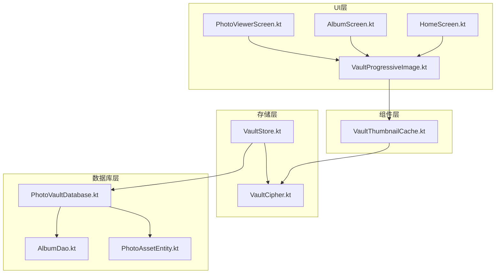
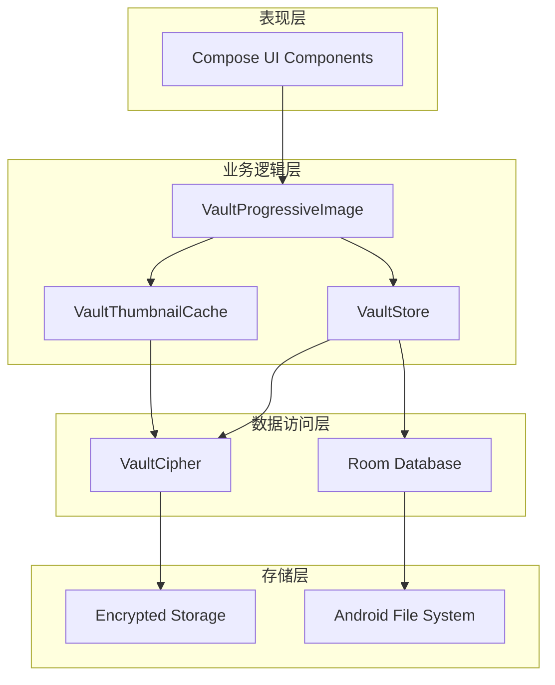
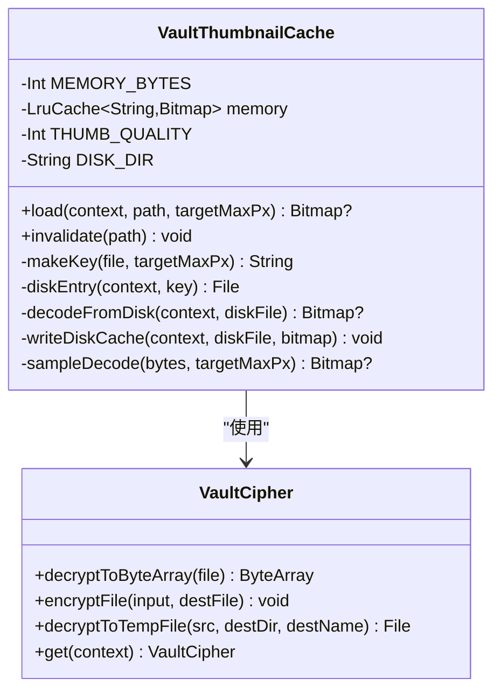
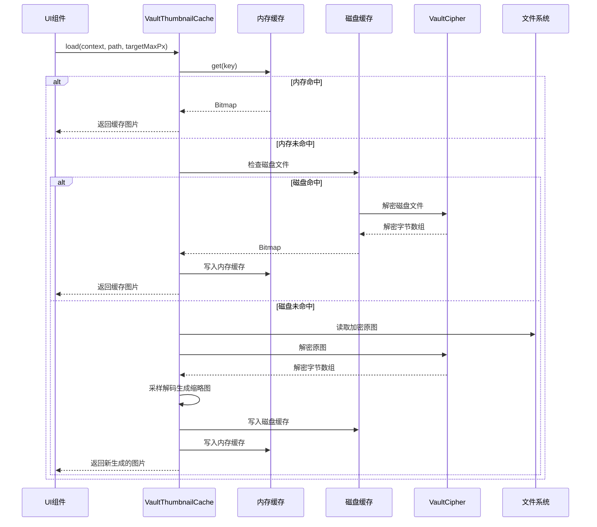
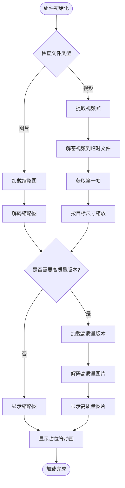
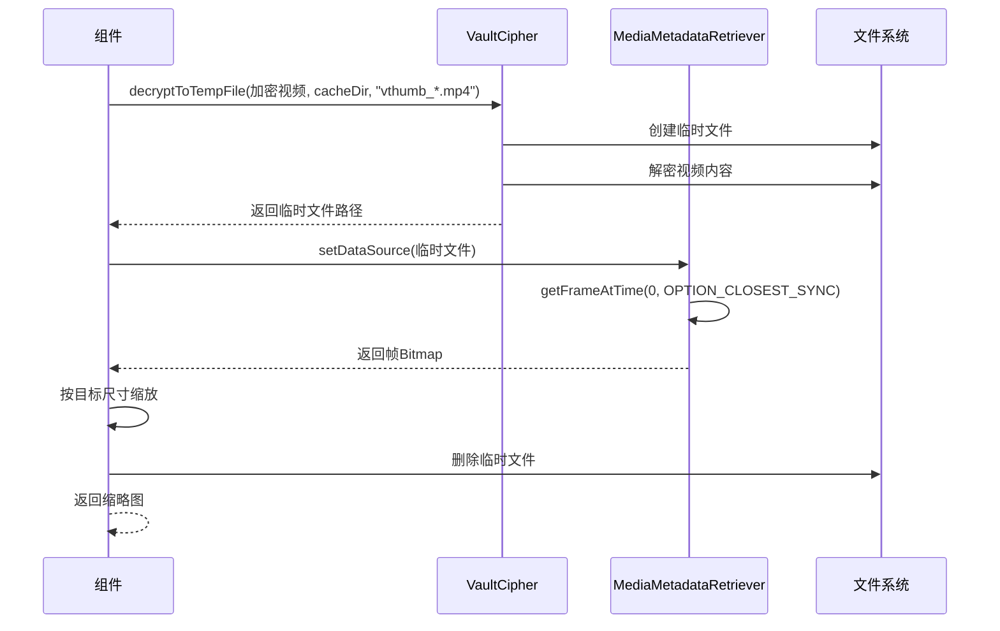
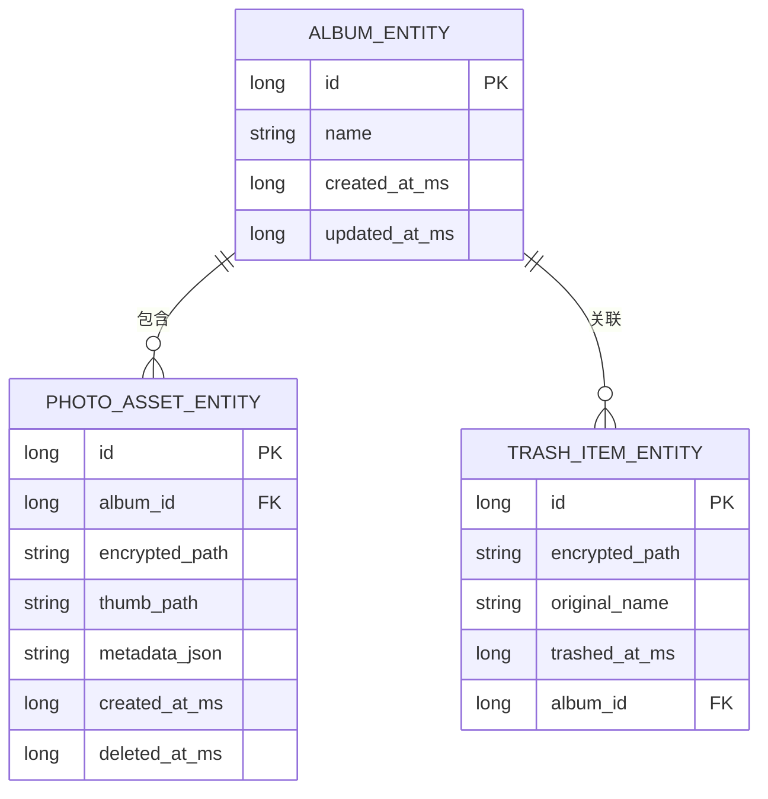
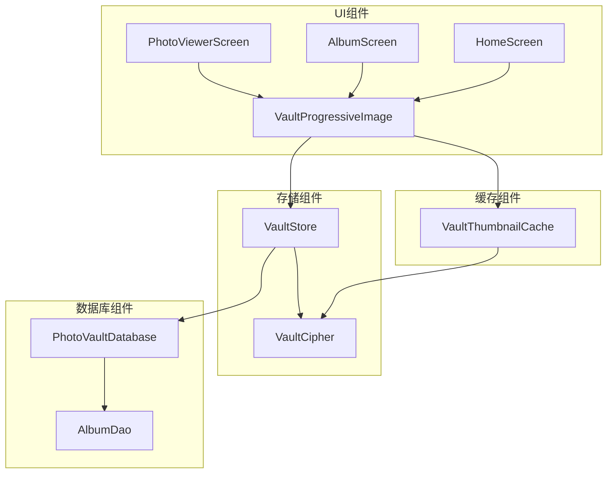

# Vault缩略图缓存系统

<cite>
**本文档引用的文件**
- [VaultThumbnailCache.kt](file://android/app/src/main/kotlin/com/xpx/vault/ui/components/VaultThumbnailCache.kt)
- [VaultProgressiveImage.kt](file://android/app/src/main/kotlin/com/xpx/vault/ui/components/VaultProgressiveImage.kt)
- [VaultStore.kt](file://android/app/src/main/kotlin/com/xpx/vault/ui/vault/VaultStore.kt)
- [VaultCipher.kt](file://android/core/data/src/main/kotlin/com/xpx/vault/data/crypto/VaultCipher.kt)
- [PhotoVaultDatabase.kt](file://android/core/data/src/main/kotlin/com/xpx/vault/data/db/PhotoVaultDatabase.kt)
- [AlbumDao.kt](file://android/core/data/src/main/kotlin/com/xpx/vault/data/db/dao/AlbumDao.kt)
- [PhotoAssetEntity.kt](file://android/core/data/src/main/kotlin/com/xpx/vault/data/db/entity/PhotoAssetEntity.kt)
- [HomeScreen.kt](file://android/app/src/main/kotlin/com/xpx/vault/ui/HomeScreen.kt)
- [AlbumScreen.kt](file://android/app/src/main/kotlin/com/xpx/vault/ui/AlbumScreen.kt)
- [PhotoViewerScreen.kt](file://android/app/src/main/kotlin/com/xpx/vault/ui/PhotoViewerScreen.kt)
</cite>

## 更新摘要
**变更内容**
- 新增两级缓存架构详细说明：内存LRU缓存 + 磁盘加密缓存
- 补充SHA-256哈希文件名机制和JPEG压缩策略
- 更新缓存加载流程和性能优化细节
- 增强安全性和性能考虑章节

## 目录
1. [简介](#简介)
2. [项目结构](#项目结构)
3. [核心组件](#核心组件)
4. [架构概览](#架构概览)
5. [详细组件分析](#详细组件分析)
6. [依赖关系分析](#依赖关系分析)
7. [性能考虑](#性能考虑)
8. [故障排除指南](#故障排除指南)
9. [结论](#结论)

## 简介

Vault缩略图缓存系统是一个专为私密相册应用设计的高性能图像加载和缓存解决方案。该系统采用创新的两级缓存架构，结合内存LRU缓存和磁盘加密缓存，实现了高效的缩略图生成和展示功能。

系统的核心特点包括：
- **两级缓存架构**：内存LRU缓存（约32MB）+ 磁盘加密缓存
- **高性能解密**：支持AES-256-CBC加密的原图解密
- **智能采样**：根据目标尺寸进行高效图像采样
- **视频支持**：完整的视频帧提取和缓存机制
- **安全加密**：使用SHA-256哈希文件名和AES-256-CBC加密
- **流畅体验**：确保相册滑动时的60fps性能

## 项目结构

该项目采用模块化的Android应用架构，主要包含以下核心模块：



**图表来源**
- [HomeScreen.kt:1-800](file://android/app/src/main/kotlin/com/xpx/vault/ui/HomeScreen.kt#L1-L800)
- [VaultProgressiveImage.kt:1-295](file://android/app/src/main/kotlin/com/xpx/vault/ui/components/VaultProgressiveImage.kt#L1-L295)
- [VaultThumbnailCache.kt:1-117](file://android/app/src/main/kotlin/com/xpx/vault/ui/components/VaultThumbnailCache.kt#L1-L117)
- [VaultStore.kt:1-440](file://android/app/src/main/kotlin/com/xpx/vault/ui/vault/VaultStore.kt#L1-L440)

**章节来源**
- [HomeScreen.kt:1-800](file://android/app/src/main/kotlin/com/xpx/vault/ui/HomeScreen.kt#L1-L800)
- [VaultProgressiveImage.kt:1-295](file://android/app/src/main/kotlin/com/xpx/vault/ui/components/VaultProgressiveImage.kt#L1-L295)
- [VaultThumbnailCache.kt:1-117](file://android/app/src/main/kotlin/com/xpx/vault/ui/components/VaultThumbnailCache.kt#L1-L117)

## 核心组件

### VaultThumbnailCache - 缩略图缓存核心

VaultThumbnailCache是整个缓存系统的核心组件，实现了创新的两级缓存策略：

**内存缓存特性**：
- 基于LruCache实现，容量约32MB
- 缓存键包含文件路径、文件大小、修改时间和目标最大像素
- 自动基于Bitmap的byteCount计算缓存大小

**磁盘缓存特性**：
- 加密存储在`cacheDir/thumb_cache/`目录下
- 使用SHA-256作为文件名，确保唯一性
- 存储加密的JPEG格式缩略图

**缓存策略**：
1. 首先检查内存缓存
2. 内存未命中时检查磁盘缓存
3. 磁盘未命中时从加密原图解密并生成缩略图
4. 生成的缩略图同时写入内存和磁盘缓存

**安全机制**：
- 所有磁盘缓存文件均使用AES-256-CBC加密
- SHA-256哈希确保文件名唯一性和安全性
- JPEG压缩（80%质量）减少存储空间占用

**章节来源**
- [VaultThumbnailCache.kt:14-117](file://android/app/src/main/kotlin/com/xpx/vault/ui/components/VaultThumbnailCache.kt#L14-L117)

### VaultProgressiveImage - 渐进式图像组件

VaultProgressiveImage是一个高度优化的Compose组件，提供流畅的图像加载体验：

**核心功能**：
- 支持图片和视频的渐进式加载
- 智能占位符动画，提升用户体验
- 自适应的缩略图质量控制
- 视频播放指示器显示

**加载策略**：
1. 首先加载低质量缩略图（128px+）
2. 后台异步加载高质量版本
3. 自动检测加载时间超过300ms时启用呼吸动画
4. 支持视频帧提取和缓存

**章节来源**
- [VaultProgressiveImage.kt:53-295](file://android/app/src/main/kotlin/com/xpx/vault/ui/components/VaultProgressiveImage.kt#L53-L295)

### VaultStore - 存储管理器

VaultStore负责管理Vault中的所有媒体文件，提供统一的访问接口：

**主要职责**：
- 媒体文件的导入、查询和管理
- 相册的创建和维护
- 垃圾桶功能的实现
- 相关的元数据管理

**文件组织**：
- 所有文件以AES-256-CBC加密形式存储
- 使用`vault_albums/`目录结构
- 支持传统格式的自动迁移

**章节来源**
- [VaultStore.kt:69-440](file://android/app/src/main/kotlin/com/xpx/vault/ui/vault/VaultStore.kt#L69-L440)

## 架构概览

系统采用分层架构设计，确保各层职责清晰分离：



**图表来源**
- [VaultProgressiveImage.kt:54-220](file://android/app/src/main/kotlin/com/xpx/vault/ui/components/VaultProgressiveImage.kt#L54-L220)
- [VaultThumbnailCache.kt:34-60](file://android/app/src/main/kotlin/com/xpx/vault/ui/components/VaultThumbnailCache.kt#L34-L60)
- [VaultStore.kt:77-93](file://android/app/src/main/kotlin/com/xpx/vault/ui/vault/VaultStore.kt#L77-L93)

## 详细组件分析

### VaultThumbnailCache详细分析

#### 类结构图



**图表来源**
- [VaultThumbnailCache.kt:24-117](file://android/app/src/main/kotlin/com/xpx/vault/ui/components/VaultThumbnailCache.kt#L24-L117)
- [VaultCipher.kt:149-169](file://android/core/data/src/main/kotlin/com/xpx/vault/data/crypto/VaultCipher.kt#L149-L169)

#### 缓存加载流程



**图表来源**
- [VaultThumbnailCache.kt:34-60](file://android/app/src/main/kotlin/com/xpx/vault/ui/components/VaultThumbnailCache.kt#L34-L60)
- [VaultCipher.kt:149-169](file://android/core/data/src/main/kotlin/com/xpx/vault/data/crypto/VaultCipher.kt#L149-L169)

**章节来源**
- [VaultThumbnailCache.kt:34-117](file://android/app/src/main/kotlin/com/xpx/vault/ui/components/VaultThumbnailCache.kt#L34-L117)

### VaultProgressiveImage详细分析

#### 组件交互流程



**图表来源**
- [VaultProgressiveImage.kt:72-98](file://android/app/src/main/kotlin/com/xpx/vault/ui/components/VaultProgressiveImage.kt#L72-L98)
- [VaultProgressiveImage.kt:222-257](file://android/app/src/main/kotlin/com/xpx/vault/ui/components/VaultProgressiveImage.kt#L222-L257)

#### 视频处理流程



**图表来源**
- [VaultProgressiveImage.kt:229-257](file://android/app/src/main/kotlin/com/xpx/vault/ui/components/VaultProgressiveImage.kt#L229-L257)

**章节来源**
- [VaultProgressiveImage.kt:54-295](file://android/app/src/main/kotlin/com/xpx/vault/ui/components/VaultProgressiveImage.kt#L54-L295)

### 数据库模型分析

#### 实体关系图



**图表来源**
- [PhotoAssetEntity.kt:24-33](file://android/core/data/src/main/kotlin/com/xpx/vault/data/db/entity/PhotoAssetEntity.kt#L24-L33)

**章节来源**
- [PhotoAssetEntity.kt:1-33](file://android/core/data/src/main/kotlin/com/xpx/vault/data/db/entity/PhotoAssetEntity.kt#L1-L33)

## 依赖关系分析

### 组件依赖图



**图表来源**
- [HomeScreen.kt:471-572](file://android/app/src/main/kotlin/com/xpx/vault/ui/HomeScreen.kt#L471-L572)
- [VaultProgressiveImage.kt:54-220](file://android/app/src/main/kotlin/com/xpx/vault/ui/components/VaultProgressiveImage.kt#L54-L220)
- [VaultThumbnailCache.kt:24-117](file://android/app/src/main/kotlin/com/xpx/vault/ui/components/VaultThumbnailCache.kt#L24-L117)

### 关键依赖关系

**VaultProgressiveImage依赖关系**：
- 依赖VaultThumbnailCache进行图片缓存
- 依赖VaultStore获取媒体信息
- 依赖VaultCipher进行文件解密
- 依赖Android系统API进行视频处理

**VaultThumbnailCache依赖关系**：
- 依赖VaultCipher进行文件解密
- 依赖Android LruCache进行内存管理
- 依赖MessageDigest进行文件名哈希

**VaultStore依赖关系**：
- 依赖VaultCipher进行文件加密
- 依赖Room数据库进行元数据管理
- 依赖Android文件系统进行文件操作

**章节来源**
- [VaultProgressiveImage.kt:46-49](file://android/app/src/main/kotlin/com/xpx/vault/ui/components/VaultProgressiveImage.kt#L46-L49)
- [VaultThumbnailCache.kt:3-12](file://android/app/src/main/kotlin/com/xpx/vault/ui/components/VaultThumbnailCache.kt#L3-L12)
- [VaultStore.kt:3-10](file://android/app/src/main/kotlin/com/xpx/vault/ui/vault/VaultStore.kt#L3-L10)

## 性能考虑

### 缓存性能优化

**内存缓存优化**：
- 32MB内存限制确保不会过度占用系统资源
- 基于Bitmap.byteCount的精确大小计算
- LRU算法确保最常用的数据优先保留

**磁盘缓存优化**：
- SHA-256哈希确保文件名唯一性和快速查找
- 加密存储保护敏感数据
- JPEG压缩（80%质量）减少存储空间占用

**解码性能优化**：
- 采样解码避免全尺寸解码
- 高质量版本异步加载
- 占位符动画提升感知性能

### 安全性考虑

**加密机制**：
- 所有磁盘缓存文件使用AES-256-CBC加密
- SHA-256哈希文件名防止缓存投毒攻击
- 临时文件在使用后自动清理

**性能与安全平衡**：
- 32MB内存缓存提供快速访问
- 磁盘缓存确保重复访问的稳定性
- JPEG压缩在质量与性能间取得平衡

### 线程和并发考虑

系统采用协程和IO调度器确保UI线程不被阻塞：

```mermaid
flowchart LR
UI_Thread[UI线程] --> Dispatchers_Main[Main Dispatcher]
Dispatchers_IO[IO Dispatcher] --> Background_Thread[后台线程]
subgraph "协程执行"
A[LaunchedEffect] --> B[withContext(IO)]
B --> C[文件操作]
C --> D[解密操作]
D --> E[图像解码]
end
Dispatchers_Main --> A
Background_Thread --> C
```

**图表来源**
- [VaultProgressiveImage.kt:72-98](file://android/app/src/main/kotlin/com/xpx/vault/ui/components/VaultProgressiveImage.kt#L72-L98)
- [VaultThumbnailCache.kt:38-60](file://android/app/src/main/kotlin/com/xpx/vault/ui/components/VaultThumbnailCache.kt#L38-L60)

## 故障排除指南

### 常见问题和解决方案

**缩略图加载失败**：
1. 检查文件是否存在且可访问
2. 验证加密密钥是否正确
3. 确认磁盘缓存权限设置

**内存不足错误**：
1. 检查内存缓存大小配置
2. 监控Bitmap内存使用情况
3. 考虑调整缓存策略

**视频帧提取失败**：
1. 验证视频格式支持性
2. 检查临时文件清理机制
3. 确认MediaMetadataRetriever使用正确

**缓存文件损坏**：
1. 检查SHA-256哈希验证
2. 验证AES-256-CBC解密完整性
3. 清理损坏的缓存文件

**性能问题排查**：
1. 监控缓存命中率
2. 分析解码时间分布
3. 检查磁盘I/O性能

**章节来源**
- [VaultProgressiveImage.kt:229-257](file://android/app/src/main/kotlin/com/xpx/vault/ui/components/VaultProgressiveImage.kt#L229-L257)
- [VaultThumbnailCache.kt:84-90](file://android/app/src/main/kotlin/com/xpx/vault/ui/components/VaultThumbnailCache.kt#L84-L90)

## 结论

Vault缩略图缓存系统通过精心设计的两级缓存架构和高效的解密机制，成功解决了私密相册应用中图像加载的性能瓶颈。系统的主要优势包括：

1. **高性能缓存**：32MB内存缓存配合磁盘加密缓存，确保快速访问
2. **安全可靠**：全程使用AES-256-CBC加密，保护用户隐私
3. **用户体验优秀**：渐进式加载和占位符动画提供流畅体验
4. **扩展性强**：模块化设计便于功能扩展和维护
5. **性能与安全平衡**：SHA-256哈希和JPEG压缩在性能和安全间取得最佳平衡

该系统为移动应用的图像处理提供了优秀的参考实现，特别是在需要平衡性能、安全性和用户体验的场景中具有重要价值。两级缓存架构的设计理念和实现细节为类似应用场景提供了宝贵的实践经验。