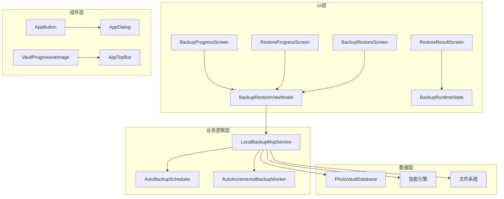
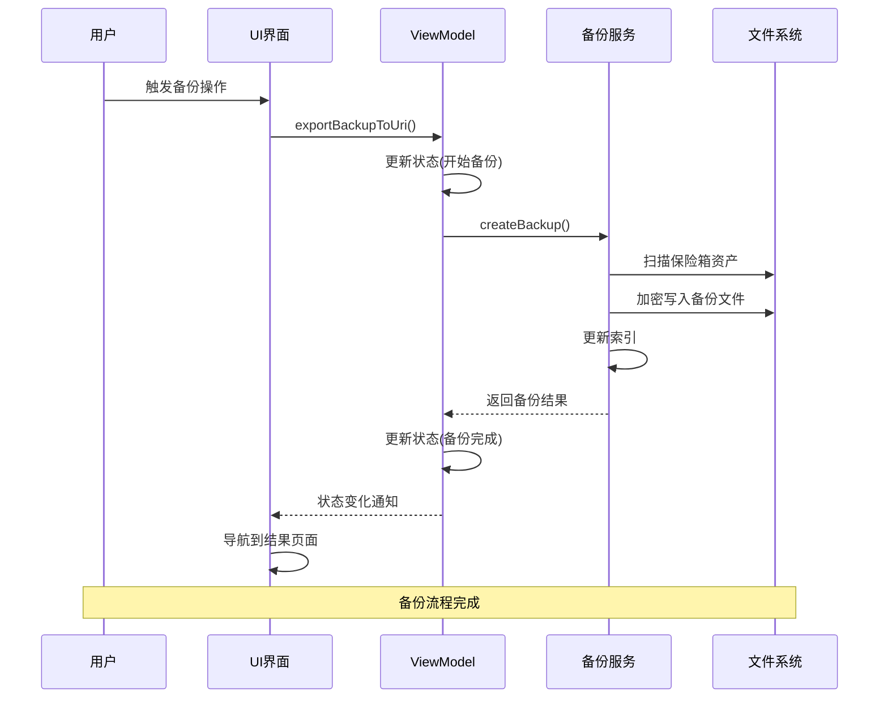
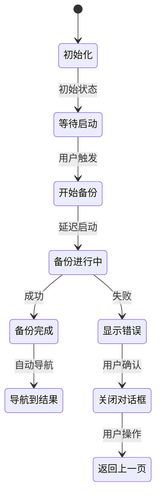
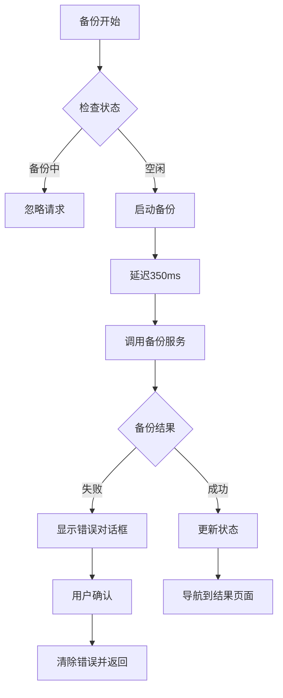
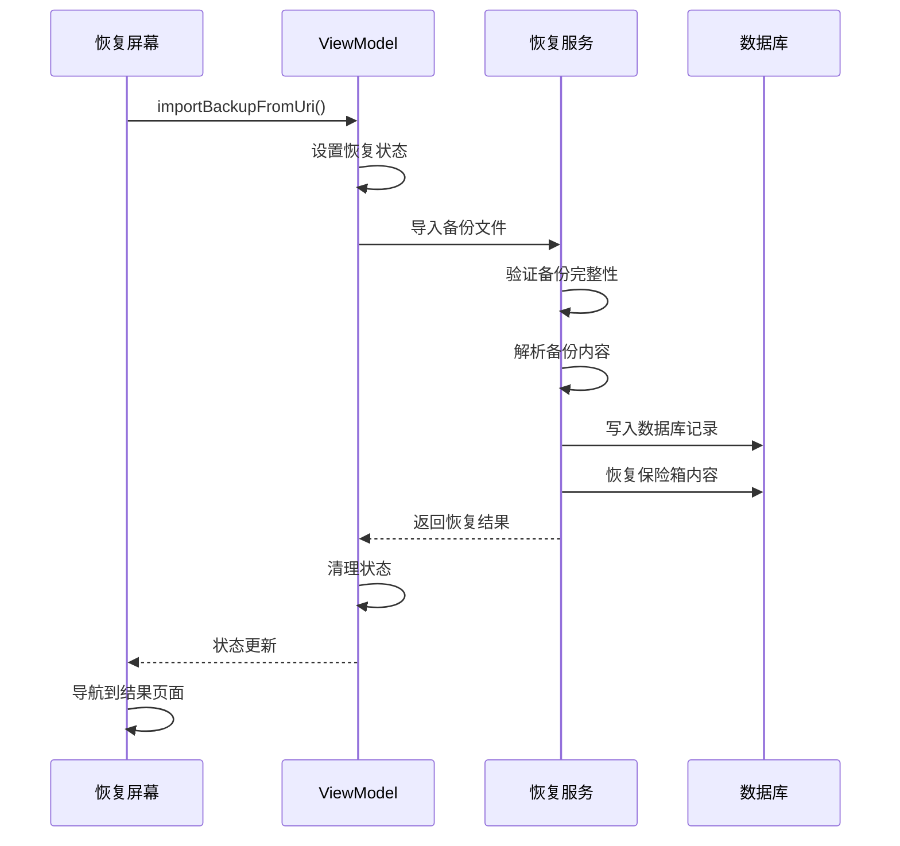
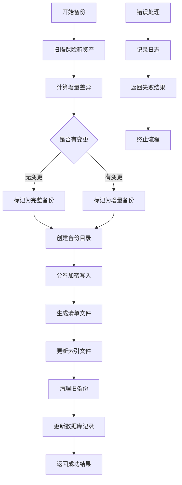
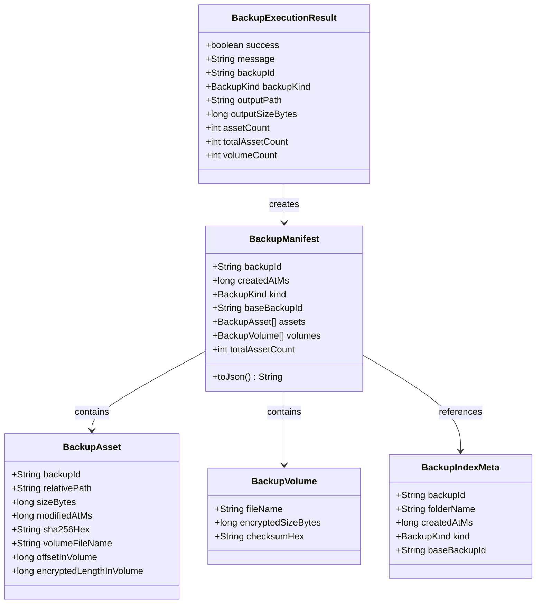
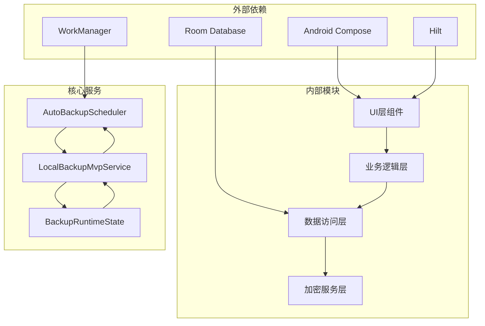

# 备份进度界面

<cite>
**本文档引用的文件**
- [BackupProgressScreen.kt](file://android/app/src/main/kotlin/com/photovault/app/ui/BackupProgressScreen.kt)
- [BackupRestoreScreen.kt](file://android/app/src/main/kotlin/com/photovault/app/ui/BackupRestoreScreen.kt)
- [RestoreProgressScreen.kt](file://android/app/src/main/kotlin/com/photovault/app/ui/RestoreProgressScreen.kt)
- [RestoreResultScreen.kt](file://android/app/src/main/kotlin/com/photovault/app/ui/RestoreResultScreen.kt)
- [AutoBackupScheduler.kt](file://android/app/src/main/kotlin/com/photovault/app/ui/backup/AutoBackupScheduler.kt)
- [AutoIncrementalBackupWorker.kt](file://android/app/src/main/kotlin/com/photovault/app/ui/backup/AutoIncrementalBackupWorker.kt)
- [LocalBackupMvpService.kt](file://android/app/src/main/kotlin/com/photovault/app/ui/backup/LocalBackupMvpService.kt)
- [BackupRuntimeState.kt](file://android/app/src/main/kotlin/com/photovault/app/ui/backup/BackupRuntimeState.kt)
- [BackupRestoreViewModel.kt](file://android/app/src/main/kotlin/com/photovault/app/ui/BackupRestoreScreen.kt)
- [AppButton.kt](file://android/app/src/main/kotlin/com/photovault/app/ui/components/AppButton.kt)
- [AppDialog.kt](file://android/app/src/main/kotlin/com/photovault/app/ui/components/AppDialog.kt)
- [strings.xml](file://android/app/src/main/res/values/strings.xml)
- [strings-en.xml](file://android/app/src/main/res/values-en/strings.xml)
</cite>

## 目录
1. [简介](#简介)
2. [项目结构](#项目结构)
3. [核心组件](#核心组件)
4. [架构概览](#架构概览)
5. [详细组件分析](#详细组件分析)
6. [依赖关系分析](#依赖关系分析)
7. [性能考虑](#性能考虑)
8. [故障排除指南](#故障排除指南)
9. [结论](#结论)

## 简介

备份进度界面是AI照片保险库应用中的重要功能模块，负责提供用户友好的备份和恢复进度展示。该界面采用现代化的Compose UI设计，结合加密备份服务，为用户提供安全可靠的本地数据保护解决方案。

该系统支持两种主要模式：
- **备份模式**：将保险箱内容导出为加密备份文件
- **恢复模式**：从历史备份文件恢复到当前设备

## 项目结构

备份进度界面位于Android应用的UI层，采用清晰的分层架构：



**图表来源**
- [BackupProgressScreen.kt:1-128](file://android/app/src/main/kotlin/com/photovault/app/ui/BackupProgressScreen.kt#L1-L128)
- [BackupRestoreScreen.kt:1-276](file://android/app/src/main/kotlin/com/photovault/app/ui/BackupRestoreScreen.kt#L1-L276)
- [LocalBackupMvpService.kt:1-734](file://android/app/src/main/kotlin/com/photovault/app/ui/backup/LocalBackupMvpService.kt#L1-L734)

**章节来源**
- [BackupProgressScreen.kt:1-128](file://android/app/src/main/kotlin/com/photovault/app/ui/BackupProgressScreen.kt#L1-L128)
- [BackupRestoreScreen.kt:1-276](file://android/app/src/main/kotlin/com/photovault/app/ui/BackupRestoreScreen.kt#L1-L276)

## 核心组件

### 主要界面组件

备份进度界面由多个精心设计的组件构成，每个组件都有明确的职责和交互逻辑：

#### 1. 备份进度屏幕
- **功能**：展示备份过程的实时进度
- **特性**：防抖动启动、错误处理、状态管理
- **用户体验**：流畅的动画效果和清晰的状态指示

#### 2. 恢复进度屏幕  
- **功能**：展示数据恢复过程的实时进度
- **特性**：延迟启动、状态同步、结果反馈
- **用户体验**：直观的进度指示和操作按钮

#### 3. 备份恢复主屏幕
- **功能**：提供备份和恢复的入口点
- **特性**：文件选择器集成、状态管理、导航控制
- **用户体验**：简洁明了的操作界面

#### 4. 恢复结果屏幕
- **功能**：展示恢复操作的最终结果
- **特性**：统计信息展示、成功状态标识
- **用户体验**：清晰的结果反馈和后续操作指引

**章节来源**
- [BackupProgressScreen.kt:39-128](file://android/app/src/main/kotlin/com/photovault/app/ui/BackupProgressScreen.kt#L39-L128)
- [RestoreProgressScreen.kt:39-125](file://android/app/src/main/kotlin/com/photovault/app/ui/RestoreProgressScreen.kt#L39-L125)
- [BackupRestoreScreen.kt:53-130](file://android/app/src/main/kotlin/com/photovault/app/ui/BackupRestoreScreen.kt#L53-L130)

## 架构概览

备份进度界面采用MVVM架构模式，结合协程和状态管理：



**图表来源**
- [BackupRestoreViewModel.kt:219-243](file://android/app/src/main/kotlin/com/photovault/app/ui/BackupRestoreScreen.kt#L219-L243)
- [LocalBackupMvpService.kt:49-106](file://android/app/src/main/kotlin/com/photovault/app/ui/backup/LocalBackupMvpService.kt#L49-L106)

### 自动备份架构

系统还支持自动备份功能，通过WorkManager实现：

```mermaid
flowchart TD
A[用户启用自动备份] --> B[AutoBackupScheduler]
B --> C[WorkManager调度]
C --> D[AutoIncrementalBackupWorker]
D --> E[LocalBackupMvpService]
E --> F[检查增量变更]
F --> G[创建增量备份]
G --> H[更新索引]
H --> I[定期执行(24小时)]
J[设备条件检查] --> K[充电状态]
J --> L[设备空闲状态]
J --> M[电池充足状态]
K --> C
L --> C
M --> C
```

**图表来源**
- [AutoBackupScheduler.kt:16-84](file://android/app/src/main/kotlin/com/photovault/app/ui/backup/AutoBackupScheduler.kt#L16-L84)
- [AutoIncrementalBackupWorker.kt:7-16](file://android/app/src/main/kotlin/com/photovault/app/ui/backup/AutoIncrementalBackupWorker.kt#L7-L16)

**章节来源**
- [AutoBackupScheduler.kt:16-84](file://android/app/src/main/kotlin/com/photovault/app/ui/backup/AutoBackupScheduler.kt#L16-L84)
- [AutoIncrementalBackupWorker.kt:7-16](file://android/app/src/main/kotlin/com/photovault/app/ui/backup/AutoIncrementalBackupWorker.kt#L7-L16)

## 详细组件分析

### 备份进度屏幕分析

备份进度屏幕是用户交互的核心界面，具有以下关键特性：

#### 状态管理机制



**图表来源**
- [BackupProgressScreen.kt:52-68](file://android/app/src/main/kotlin/com/photovault/app/ui/BackupProgressScreen.kt#L52-L68)

#### 错误处理流程



**图表来源**
- [BackupProgressScreen.kt:52-68](file://android/app/src/main/kotlin/com/photovault/app/ui/BackupProgressScreen.kt#L52-L68)
- [BackupRestoreViewModel.kt:219-243](file://android/app/src/main/kotlin/com/photovault/app/ui/BackupRestoreScreen.kt#L219-L243)

**章节来源**
- [BackupProgressScreen.kt:39-128](file://android/app/src/main/kotlin/com/photovault/app/ui/BackupProgressScreen.kt#L39-L128)

### 恢复进度屏幕分析

恢复进度屏幕提供了与备份进度屏幕相似的用户体验，但专注于数据恢复过程：

#### 恢复流程控制



**图表来源**
- [RestoreProgressScreen.kt:53-65](file://android/app/src/main/kotlin/com/photovault/app/ui/RestoreProgressScreen.kt#L53-L65)
- [BackupRestoreViewModel.kt:245-263](file://android/app/src/main/kotlin/com/photovault/app/ui/BackupRestoreScreen.kt#L245-L263)

**章节来源**
- [RestoreProgressScreen.kt:39-125](file://android/app/src/main/kotlin/com/photovault/app/ui/RestoreProgressScreen.kt#L39-L125)

### 备份服务架构分析

LocalBackupMvpService是备份功能的核心，实现了完整的备份生命周期管理：

#### 备份执行流程



**图表来源**
- [LocalBackupMvpService.kt:49-106](file://android/app/src/main/kotlin/com/photovault/app/ui/backup/LocalBackupMvpService.kt#L49-L106)

#### 数据结构设计



**图表来源**
- [LocalBackupMvpService.kt:554-734](file://android/app/src/main/kotlin/com/photovault/app/ui/backup/LocalBackupMvpService.kt#L554-L734)

**章节来源**
- [LocalBackupMvpService.kt:1-734](file://android/app/src/main/kotlin/com/photovault/app/ui/backup/LocalBackupMvpService.kt#L1-L734)

### 自动备份系统分析

自动备份系统通过WorkManager实现，确保在合适的条件下执行备份任务：

#### 条件约束管理

```mermaid
flowchart TD
A[检查自动备份状态] --> B{是否启用}
B --> |否| C[取消工作]
B --> |是| D[检查约束条件]
D --> E[充电状态检查]
D --> F[设备空闲检查]
D --> G[电池充足检查]
E --> H[设置约束]
F --> H
G --> H
H --> I[创建周期性工作]
I --> J[调度执行(24小时)]
K[用户偏好设置] --> L[充电要求]
K --> M[空闲要求]
L --> D
M --> D
```

**图表来源**
- [AutoBackupScheduler.kt:17-82](file://android/app/src/main/kotlin/com/photovault/app/ui/backup/AutoBackupScheduler.kt#L17-L82)

**章节来源**
- [AutoBackupScheduler.kt:1-84](file://android/app/src/main/kotlin/com/photovault/app/ui/backup/AutoBackupScheduler.kt#L1-L84)

## 依赖关系分析

备份进度界面的依赖关系体现了清晰的分层架构：



**图表来源**
- [BackupProgressScreen.kt:28-37](file://android/app/src/main/kotlin/com/photovault/app/ui/BackupProgressScreen.kt#L28-L37)
- [LocalBackupMvpService.kt:3-24](file://android/app/src/main/kotlin/com/photovault/app/ui/backup/LocalBackupMvpService.kt#L3-L24)

### 组件耦合度分析

系统采用了低耦合的设计原则：

- **UI层**：仅负责展示和用户交互，不直接操作数据
- **业务逻辑层**：封装复杂的业务规则和流程控制
- **数据访问层**：抽象数据持久化细节
- **加密服务层**：提供安全的数据处理能力

这种分层设计使得各层可以独立测试和维护，提高了系统的可扩展性和可维护性。

**章节来源**
- [BackupRestoreScreen.kt:208-276](file://android/app/src/main/kotlin/com/photovault/app/ui/BackupRestoreScreen.kt#L208-L276)

## 性能考虑

备份进度界面在性能方面采用了多项优化措施：

### 协程并发处理
- 使用协程进行异步备份操作
- 避免阻塞主线程
- 支持取消和错误处理

### 内存管理优化
- 分块处理大文件，避免内存溢出
- 及时释放资源和连接
- 合理的缓存策略

### UI响应性保证
- 使用LaunchedEffect进行副作用管理
- 状态分离，避免不必要的重组
- 防抖动机制防止重复操作

### 存储效率优化
- 增量备份减少存储空间
- 分卷压缩提高传输效率
- 完整的校验机制确保数据完整性

## 故障排除指南

### 常见问题及解决方案

#### 备份失败
**症状**：备份过程中出现错误对话框
**可能原因**：
- 存储空间不足
- 权限被拒绝
- 网络连接异常
- 文件损坏

**解决步骤**：
1. 检查设备存储空间
2. 确认必要的权限已授予
3. 重新尝试备份操作
4. 检查备份文件完整性

#### 恢复失败
**症状**：恢复过程中出现错误
**可能原因**：
- 备份文件格式不正确
- 数据库损坏
- 权限问题

**解决步骤**：
1. 验证备份文件的完整性
2. 检查数据库状态
3. 重新导入备份文件
4. 查看错误日志获取详细信息

#### 自动备份未执行
**症状**：设置自动备份但未生效
**可能原因**：
- 设备条件不满足
- 电池电量不足
- 设备未处于空闲状态

**解决步骤**：
1. 检查自动备份设置
2. 确认设备充电状态
3. 等待设备空闲状态
4. 重启应用以重新注册工作

**章节来源**
- [BackupRestoreViewModel.kt:219-263](file://android/app/src/main/kotlin/com/photovault/app/ui/BackupRestoreScreen.kt#L219-L263)
- [LocalBackupMvpService.kt:178-249](file://android/app/src/main/kotlin/com/photovault/app/ui/backup/LocalBackupMvpService.kt#L178-L249)

## 结论

备份进度界面展现了现代Android应用的最佳实践，通过以下关键特性提供了优秀的用户体验：

### 技术优势
- **架构清晰**：采用MVVM模式，职责分离明确
- **用户体验优秀**：流畅的动画效果和直观的状态指示
- **安全性强**：完整的加密备份和恢复流程
- **可靠性高**：完善的错误处理和状态管理

### 功能完整性
- 支持手动和自动备份两种模式
- 提供完整的备份生命周期管理
- 实现增量备份优化存储空间
- 具备强大的错误恢复能力

### 扩展性考虑
- 模块化设计便于功能扩展
- 清晰的接口定义支持二次开发
- 灵活的配置选项适应不同需求
- 完善的日志系统便于问题诊断

该备份进度界面为用户提供了安全、可靠、易用的数据保护解决方案，是AI照片保险库应用的重要组成部分。