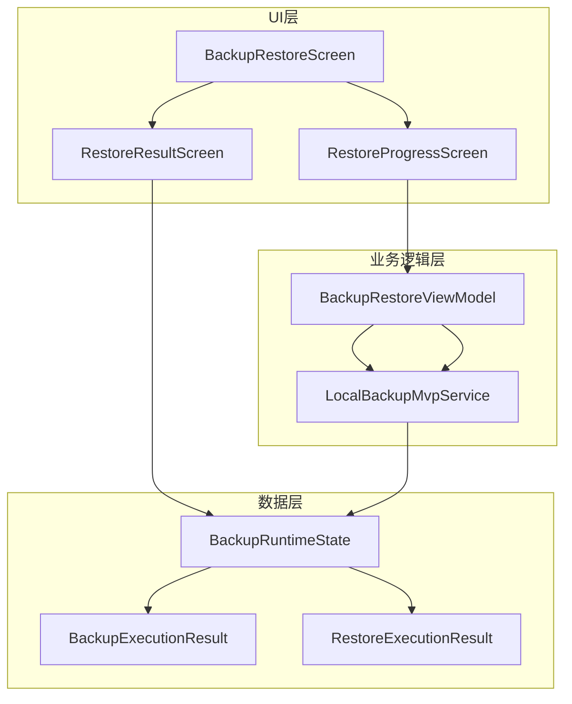
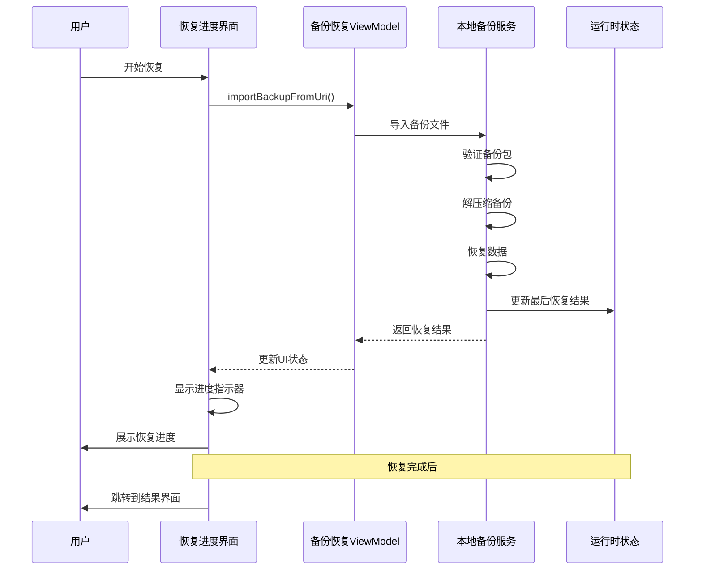
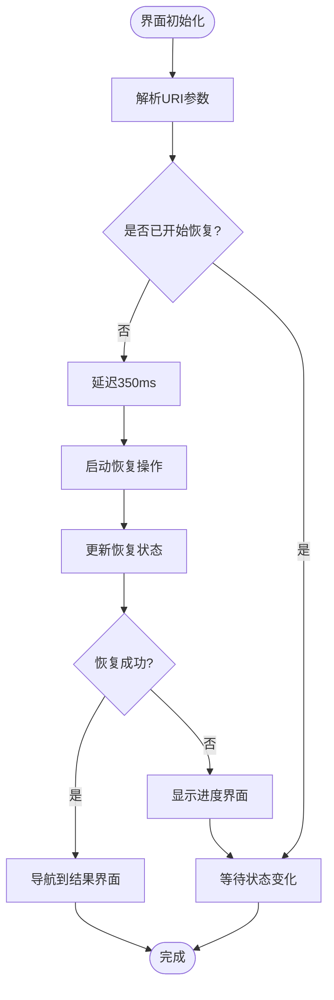
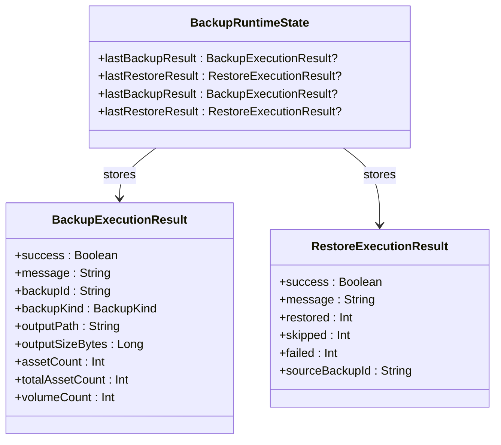
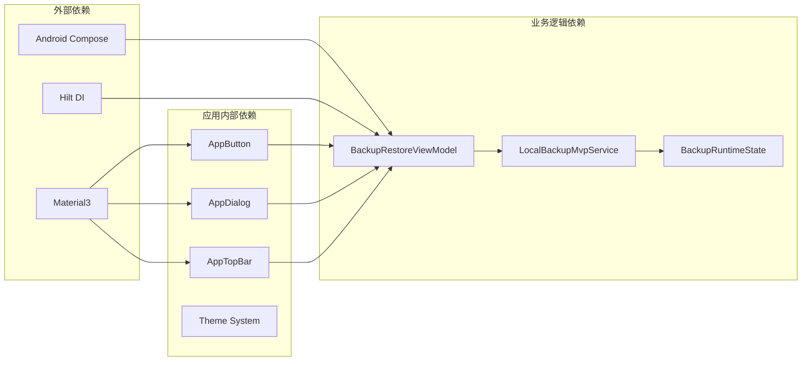

# 恢复进度界面

<cite>
**本文档引用的文件**
- [RestoreProgressScreen.kt](file://android/app/src/main/kotlin/com/photovault/app/ui/RestoreProgressScreen.kt)
- [RestoreResultScreen.kt](file://android/app/src/main/kotlin/com/photovault/app/ui/RestoreResultScreen.kt)
- [LocalBackupMvpService.kt](file://android/app/src/main/kotlin/com/photovault/app/ui/backup/LocalBackupMvpService.kt)
- [BackupRestoreViewModel.kt](file://android/app/src/main/kotlin/com/photovault/app/ui/BackupRestoreScreen.kt)
- [BackupRuntimeState.kt](file://android/app/src/main/kotlin/com/photovault/app/ui/backup/BackupRuntimeState.kt)
- [strings.xml](file://android/app/src/main/res/values/strings.xml)
- [strings.xml (en)](file://android/app/src/main/res/values-en/strings.xml)
</cite>

## 目录
1. [简介](#简介)
2. [项目结构](#项目结构)
3. [核心组件](#核心组件)
4. [架构概览](#架构概览)
5. [详细组件分析](#详细组件分析)
6. [依赖关系分析](#依赖关系分析)
7. [性能考虑](#性能考虑)
8. [故障排除指南](#故障排除指南)
9. [结论](#结论)

## 简介

恢复进度界面是AI照片保险库应用中用于展示备份恢复过程的重要用户界面组件。该界面提供了直观的进度指示器、状态信息和用户交互功能，确保用户能够清楚地了解备份恢复的当前状态和预期完成时间。

恢复进度界面采用现代化的Material Design设计语言，结合了Compose UI框架的优势，为用户提供流畅的用户体验。界面设计注重可用性和可访问性，通过清晰的视觉层次和适当的反馈机制来增强用户信心。

## 项目结构

恢复进度界面位于Android应用的UI层中，遵循模块化的设计原则。整个备份恢复功能由多个相互协作的组件组成，形成了一个完整的数据流架构。

**图表来源**
- [RestoreProgressScreen.kt:1-125](file://android/app/src/main/kotlin/com/photovault/app/ui/RestoreProgressScreen.kt#L1-L125)
- [BackupRestoreViewModel.kt:208-268](file://android/app/src/main/kotlin/com/photovault/app/ui/BackupRestoreScreen.kt#L208-L268)

**章节来源**
- [RestoreProgressScreen.kt:1-125](file://android/app/src/main/kotlin/com/photovault/app/ui/RestoreProgressScreen.kt#L1-L125)
- [BackupRestoreViewModel.kt:53-130](file://android/app/src/main/kotlin/com/photovault/app/ui/BackupRestoreScreen.kt#L53-L130)

## 核心组件

恢复进度界面主要由三个核心组件构成：

### 1. 恢复进度屏幕 (RestoreProgressScreen)
这是用户在开始备份恢复时看到的主要界面，负责显示实时的恢复进度和状态信息。

### 2. 恢复结果屏幕 (RestoreResultScreen)
在恢复完成后显示最终结果的界面，包含详细的统计信息和操作选项。

### 3. 备份运行时状态 (BackupRuntimeState)
全局状态管理对象，用于存储最后一次备份和恢复操作的结果信息。

**章节来源**
- [RestoreProgressScreen.kt:39-125](file://android/app/src/main/kotlin/com/photovault/app/ui/RestoreProgressScreen.kt#L39-L125)
- [RestoreResultScreen.kt:32-127](file://android/app/src/main/kotlin/com/photovault/app/ui/RestoreResultScreen.kt#L32-L127)
- [BackupRuntimeState.kt:1-10](file://android/app/src/main/kotlin/com/photovault/app/ui/backup/BackupRuntimeState.kt#L1-L10)

## 架构概览

恢复进度界面采用了MVVM（Model-View-ViewModel）架构模式，实现了清晰的关注点分离和良好的可测试性。

**图表来源**
- [RestoreProgressScreen.kt:40-65](file://android/app/src/main/kotlin/com/photovault/app/ui/RestoreProgressScreen.kt#L40-L65)
- [BackupRestoreViewModel.kt:245-263](file://android/app/src/main/kotlin/com/photovault/app/ui/BackupRestoreScreen.kt#L245-L263)
- [LocalBackupMvpService.kt:140-176](file://android/app/src/main/kotlin/com/photovault/app/ui/backup/LocalBackupMvpService.kt#L140-L176)

## 详细组件分析

### 恢复进度屏幕组件分析

恢复进度屏幕是一个高度响应式的界面组件，具有以下关键特性：

#### 界面布局结构
- **顶部栏**: 显示标题和返回按钮
- **进度容器**: 居中的圆形进度指示器和状态文本
- **操作按钮**: 在恢复完成后的返回按钮

#### 状态管理机制
界面使用LaunchedEffect来管理异步操作的生命周期，确保恢复操作只执行一次且正确清理。

**图表来源**
- [RestoreProgressScreen.kt:53-65](file://android/app/src/main/kotlin/com/photovault/app/ui/RestoreProgressScreen.kt#L53-L65)

#### 错误处理机制
界面集成了完善的错误处理系统，包括：
- 错误对话框显示
- 自动错误清除功能
- 用户友好的错误消息

**章节来源**
- [RestoreProgressScreen.kt:67-76](file://android/app/src/main/kotlin/com/photovault/app/ui/RestoreProgressScreen.kt#L67-L76)
- [RestoreProgressScreen.kt:114-123](file://android/app/src/main/kotlin/com/photovault/app/ui/RestoreProgressScreen.kt#L114-L123)

### 恢复结果屏幕组件分析

恢复结果屏幕提供了详细的恢复统计信息和后续操作选项：

#### 统计信息展示
- **恢复数量**: 显示成功恢复的项目数量
- **跳过数量**: 显示已存在的项目数量
- **失败数量**: 显示恢复失败的项目数量

#### 视觉设计元素
- **徽章图标**: 使用成功的视觉标识
- **统计卡片**: 结构化的数据展示
- **操作按钮**: 提供返回设置的选项

**章节来源**
- [RestoreResultScreen.kt:67-70](file://android/app/src/main/kotlin/com/photovault/app/ui/RestoreResultScreen.kt#L67-L70)
- [RestoreResultScreen.kt:101-125](file://android/app/src/main/kotlin/com/photovault/app/ui/RestoreResultScreen.kt#L101-L125)

### 备份运行时状态管理

BackupRuntimeState是一个全局状态管理对象，负责存储备份和恢复操作的结果信息：

**图表来源**
- [BackupRuntimeState.kt:3-9](file://android/app/src/main/kotlin/com/photovault/app/ui/backup/BackupRuntimeState.kt#L3-L9)
- [LocalBackupMvpService.kt:672-728](file://android/app/src/main/kotlin/com/photovault/app/ui/backup/LocalBackupMvpService.kt#L672-L728)

**章节来源**
- [BackupRuntimeState.kt:1-10](file://android/app/src/main/kotlin/com/photovault/app/ui/backup/BackupRuntimeState.kt#L1-L10)
- [LocalBackupMvpService.kt:708-728](file://android/app/src/main/kotlin/com/photovault/app/ui/backup/LocalBackupMvpService.kt#L708-L728)

## 依赖关系分析

恢复进度界面的依赖关系体现了清晰的分层架构：

**图表来源**
- [RestoreProgressScreen.kt:28-37](file://android/app/src/main/kotlin/com/photovault/app/ui/RestoreProgressScreen.kt#L28-L37)
- [BackupRestoreViewModel.kt:208-211](file://android/app/src/main/kotlin/com/photovault/app/ui/BackupRestoreScreen.kt#L208-L211)

### 组件耦合度分析

- **低耦合**: UI组件与业务逻辑通过ViewModel解耦
- **高内聚**: 每个组件专注于特定的功能领域
- **清晰边界**: 各层之间的职责划分明确

**章节来源**
- [RestoreProgressScreen.kt:16-37](file://android/app/src/main/kotlin/com/photovault/app/ui/RestoreProgressScreen.kt#L16-L37)
- [BackupRestoreViewModel.kt:208-268](file://android/app/src/main/kotlin/com/photovault/app/ui/BackupRestoreScreen.kt#L208-L268)

## 性能考虑

恢复进度界面在设计时充分考虑了性能优化：

### 内存管理
- 使用remember函数缓存计算结果
- 合理的StateFlow使用避免不必要的重组
- 及时清理LaunchedEffect订阅

### 网络和IO优化
- 异步操作在IO线程执行
- 流式处理大量数据
- 延迟初始化昂贵资源

### 用户体验优化
- 350ms的延迟避免界面闪烁
- 实时进度反馈
- 错误状态的及时处理

## 故障排除指南

### 常见问题及解决方案

#### 恢复操作失败
**症状**: 恢复进度界面显示错误消息
**原因**: 备份文件损坏或格式不正确
**解决方法**: 
1. 检查备份文件完整性
2. 重新下载或生成备份文件
3. 确保文件格式正确

#### 界面无响应
**症状**: 恢复进度界面卡住不动
**原因**: 异步操作未正确完成
**解决方法**:
1. 检查网络连接
2. 重启应用
3. 清除应用缓存

#### 数据不一致
**症状**: 恢复结果显示部分数据丢失
**原因**: 恢复过程中断或数据冲突
**解决方法**:
1. 检查存储空间
2. 关闭其他占用存储的应用
3. 重新尝试恢复操作

**章节来源**
- [LocalBackupMvpService.kt:178-214](file://android/app/src/main/kotlin/com/photovault/app/ui/backup/LocalBackupMvpService.kt#L178-L214)
- [RestoreProgressScreen.kt:67-76](file://android/app/src/main/kotlin/com/photovault/app/ui/RestoreProgressScreen.kt#L67-L76)

## 结论

恢复进度界面作为AI照片保险库的核心功能之一，展现了现代Android应用开发的最佳实践。通过采用MVVM架构、响应式UI设计和完善的错误处理机制，该界面为用户提供了可靠、直观的备份恢复体验。

界面设计充分考虑了用户体验的各个方面，从视觉设计到交互反馈都体现了专业水准。同时，底层的架构设计确保了系统的可维护性和扩展性，为未来的功能增强奠定了坚实基础。

该界面的成功实现证明了在移动应用开发中，优秀的架构设计和用户体验设计同样重要，两者缺一不可。