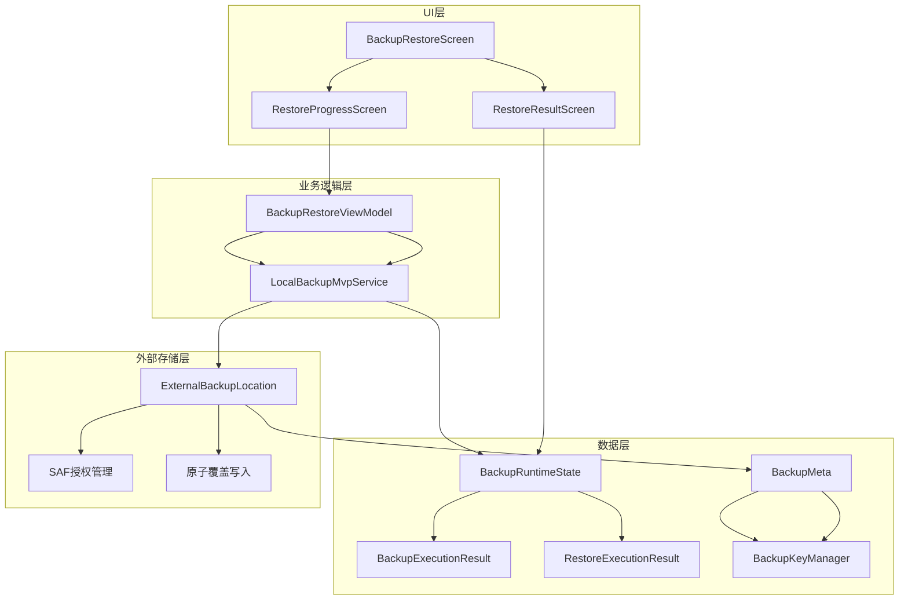
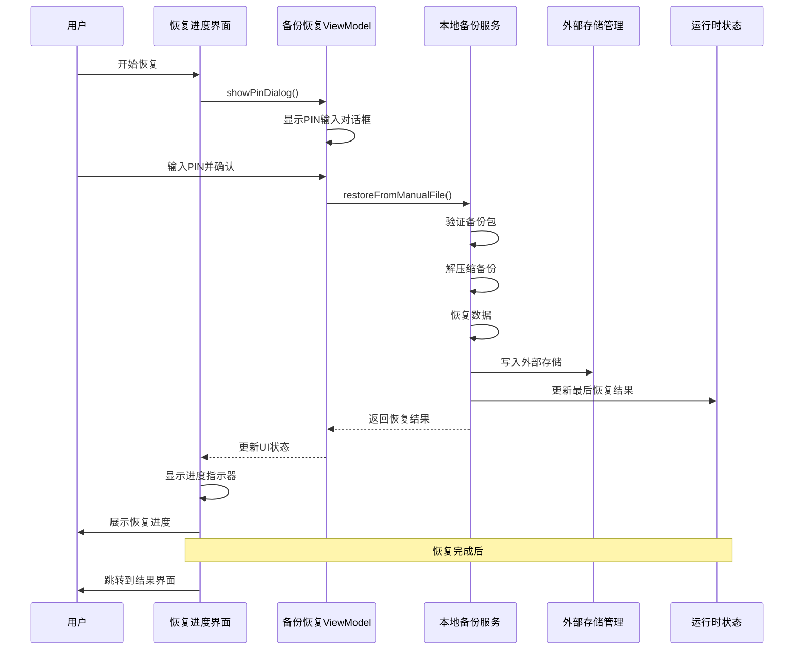
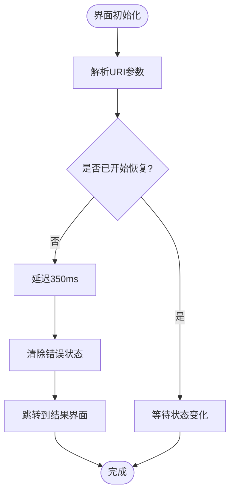
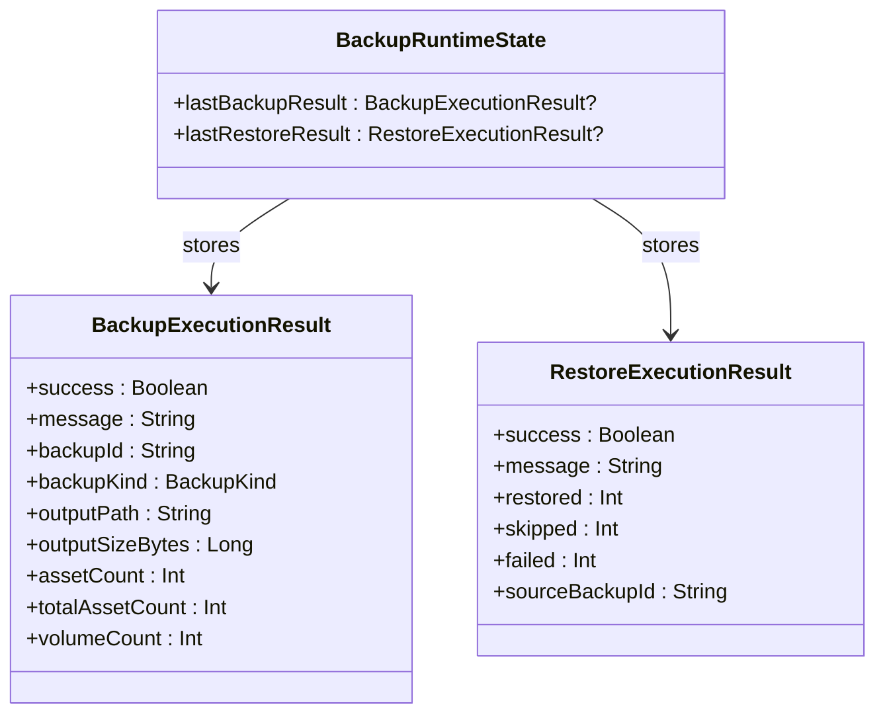
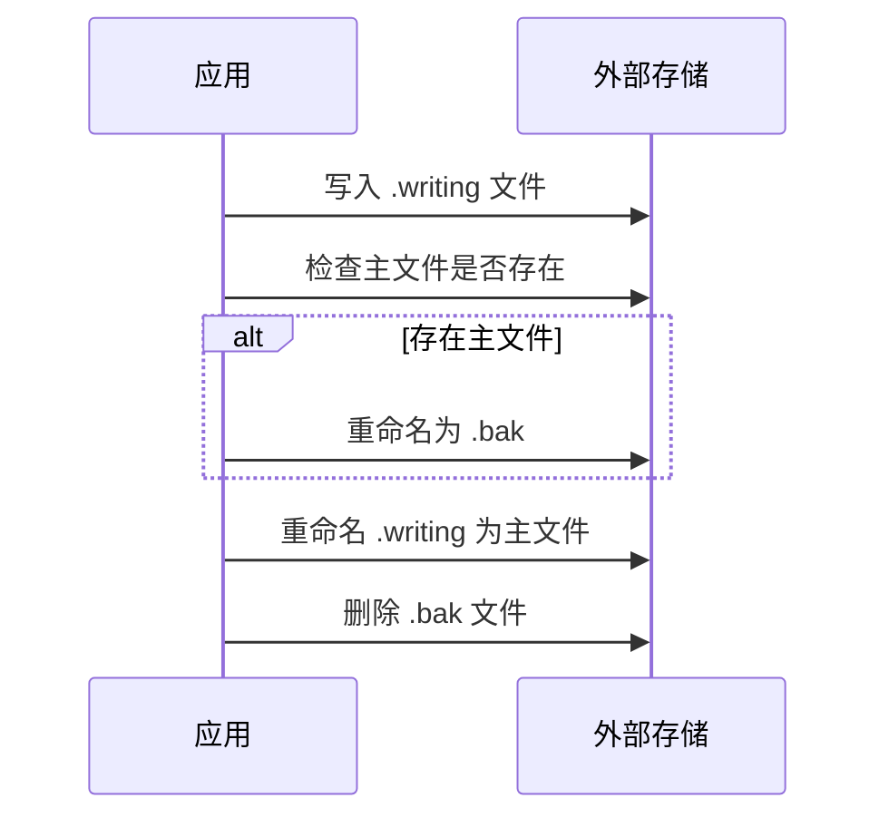
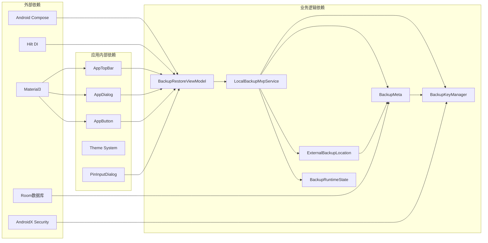

# 恢复进度界面

<cite>
**本文档引用的文件**
- [RestoreProgressScreen.kt](file://android/app/src/main/kotlin/com/xpx/vault/ui/RestoreProgressScreen.kt)
- [RestoreResultScreen.kt](file://android/app/src/main/kotlin/com/xpx/vault/ui/RestoreResultScreen.kt)
- [LocalBackupMvpService.kt](file://android/app/src/main/kotlin/com/xpx/vault/ui/backup/LocalBackupMvpService.kt)
- [BackupRestoreScreen.kt](file://android/app/src/main/kotlin/com/xpx/vault/ui/BackupRestoreScreen.kt)
- [BackupRuntimeState.kt](file://android/app/src/main/kotlin/com/xpx/vault/ui/backup/BackupRuntimeState.kt)
- [ExternalBackupLocation.kt](file://android/app/src/main/kotlin/com/xpx/vault/ui/backup/ExternalBackupLocation.kt)
- [BackupKeyManager.kt](file://android/core/data/src/main/kotlin/com/xpx/vault/data/crypto/BackupKeyManager.kt)
- [BackupMeta.kt](file://android/app/src/main/kotlin/com/xpx/vault/ui/backup/BackupMeta.kt)
- [strings.xml](file://android/app/src/main/res/values/strings.xml)
</cite>

## 更新摘要
**所做更改**
- 更新了双键备份系统架构说明，反映新的外部存储恢复功能
- 新增了双密钥备份系统的技术实现细节
- 增强了外部存储位置管理和原子覆盖机制的描述
- 完善了进度跟踪和结果展示功能的技术分析
- 更新了错误处理和用户交互流程

## 目录
1. [简介](#简介)
2. [项目结构](#项目结构)
3. [核心组件](#核心组件)
4. [架构概览](#架构概览)
5. [详细组件分析](#详细组件分析)
6. [双键备份系统](#双键备份系统)
7. [外部存储恢复功能](#外部存储恢复功能)
8. [依赖关系分析](#依赖关系分析)
9. [性能考虑](#性能考虑)
10. [故障排除指南](#故障排除指南)
11. [结论](#结论)

## 简介

恢复进度界面是AI照片保险库应用中用于展示备份恢复过程的重要用户界面组件。该界面提供了直观的进度指示器、状态信息和用户交互功能，确保用户能够清楚地了解备份恢复的当前状态和预期完成时间。

**更新** 新的双键备份系统引入了外部存储恢复功能，支持通过SAF（Storage Access Framework）授权的外部目录进行备份和恢复操作，包括原子覆盖写入和进度跟踪等新功能。

恢复进度界面采用现代化的Material Design设计语言，结合了Compose UI框架的优势，为用户提供流畅的用户体验。界面设计注重可用性和可访问性，通过清晰的视觉层次和适当的反馈机制来增强用户信心。

## 项目结构

恢复进度界面位于Android应用的UI层中，遵循模块化的设计原则。整个备份恢复功能由多个相互协作的组件组成，形成了一个完整的数据流架构。



**图表来源**
- [RestoreProgressScreen.kt:1-127](file://android/app/src/main/kotlin/com/xpx/vault/ui/RestoreProgressScreen.kt#L1-L127)
- [BackupRestoreScreen.kt:1-650](file://android/app/src/main/kotlin/com/xpx/vault/ui/BackupRestoreScreen.kt#L1-L650)
- [ExternalBackupLocation.kt:1-192](file://android/app/src/main/kotlin/com/xpx/vault/ui/backup/ExternalBackupLocation.kt#L1-L192)

**章节来源**
- [RestoreProgressScreen.kt:1-127](file://android/app/src/main/kotlin/com/xpx/vault/ui/RestoreProgressScreen.kt#L1-L127)
- [BackupRestoreScreen.kt:86-269](file://android/app/src/main/kotlin/com/xpx/vault/ui/BackupRestoreScreen.kt#L86-L269)

## 核心组件

恢复进度界面主要由三个核心组件构成：

### 1. 恢复进度屏幕 (RestoreProgressScreen)
这是用户在开始备份恢复时看到的主要界面，负责显示实时的恢复进度和状态信息。

**更新** 新版本中移除了直接的恢复操作，改为通过PIN输入对话框进行验证，然后跳转到结果界面。

### 2. 恢复结果屏幕 (RestoreResultScreen)
在恢复完成后显示最终结果的界面，包含详细的统计信息和操作选项。

### 3. 备份运行时状态 (BackupRuntimeState)
全局状态管理对象，用于存储最后一次备份和恢复操作的结果信息。

**章节来源**
- [RestoreProgressScreen.kt:39-127](file://android/app/src/main/kotlin/com/xpx/vault/ui/RestoreProgressScreen.kt#L39-L127)
- [RestoreResultScreen.kt:32-127](file://android/app/src/main/kotlin/com/xpx/vault/ui/RestoreResultScreen.kt#L32-L127)
- [BackupRuntimeState.kt:1-10](file://android/app/src/main/kotlin/com/xpx/vault/ui/backup/BackupRuntimeState.kt#L1-L10)

## 架构概览

恢复进度界面采用了MVVM（Model-View-ViewModel）架构模式，实现了清晰的关注点分离和良好的可测试性。



**图表来源**
- [RestoreProgressScreen.kt:53-67](file://android/app/src/main/kotlin/com/xpx/vault/ui/RestoreProgressScreen.kt#L53-L67)
- [BackupRestoreScreen.kt:593-622](file://android/app/src/main/kotlin/com/xpx/vault/ui/BackupRestoreScreen.kt#L593-L622)
- [LocalBackupMvpService.kt:46-67](file://android/app/src/main/kotlin/com/xpx/vault/ui/backup/LocalBackupMvpService.kt#L46-L67)

## 详细组件分析

### 恢复进度屏幕组件分析

恢复进度屏幕是一个高度响应式的界面组件，具有以下关键特性：

#### 界面布局结构
- **顶部栏**: 显示标题和返回按钮
- **进度容器**: 居中的圆形进度指示器和状态文本
- **操作按钮**: 在恢复完成后的返回按钮

#### 状态管理机制
界面使用LaunchedEffect来管理异步操作的生命周期，确保恢复操作只执行一次且正确清理。

**更新** 新版本中简化了逻辑，移除了直接的恢复操作，改为通过PIN输入对话框进行验证。



**图表来源**
- [RestoreProgressScreen.kt:53-61](file://android/app/src/main/kotlin/com/xpx/vault/ui/RestoreProgressScreen.kt#L53-L61)

#### 错误处理机制
界面集成了完善的错误处理系统，包括：
- 错误对话框显示
- 自动错误清除功能
- 用户友好的错误消息

**章节来源**
- [RestoreProgressScreen.kt:69-78](file://android/app/src/main/kotlin/com/xpx/vault/ui/RestoreProgressScreen.kt#L69-L78)
- [RestoreProgressScreen.kt:116-125](file://android/app/src/main/kotlin/com/xpx/vault/ui/RestoreProgressScreen.kt#L116-L125)

### 恢复结果屏幕组件分析

恢复结果屏幕提供了详细的恢复统计信息和后续操作选项：

#### 统计信息展示
- **恢复数量**: 显示成功恢复的项目数量
- **跳过数量**: 显示已存在的项目数量
- **失败数量**: 显示恢复失败的项目数量

#### 视觉设计元素
- **徽章图标**: 使用成功的视觉标识
- **统计卡片**: 结构化的数据展示
- **操作按钮**: 提供返回设置的选项

**章节来源**
- [RestoreResultScreen.kt:67-70](file://android/app/src/main/kotlin/com/xpx/vault/ui/RestoreResultScreen.kt#L67-L70)
- [RestoreResultScreen.kt:101-125](file://android/app/src/main/kotlin/com/xpx/vault/ui/RestoreResultScreen.kt#L101-L125)

### 备份运行时状态管理

BackupRuntimeState是一个全局状态管理对象，负责存储备份和恢复操作的结果信息：



**图表来源**
- [BackupRuntimeState.kt:3-9](file://android/app/src/main/kotlin/com/xpx/vault/ui/backup/BackupRuntimeState.kt#L3-L9)

**章节来源**
- [BackupRuntimeState.kt:1-10](file://android/app/src/main/kotlin/com/xpx/vault/ui/backup/BackupRuntimeState.kt#L1-L10)

## 双键备份系统

**新增** 双键备份系统是新版本的核心技术架构，引入了双重密钥管理机制：

### 密钥管理架构

双键备份系统采用双重密钥设计：

- **Vault Master Key**: 通过Android Keystore提供的硬件安全保护，负责日常的保险箱内容加解密
- **Backup Key**: 通过Argon2id算法从用户PIN和设备盐值派生，专门用于备份包的加解密

```mermaid
flowchart TD
User[用户PIN] --> KDF[Argon2id KDF]
Device[设备盐值] --> KDF
KDF --> BackupKey[Backup Key (AES-256)]
MasterKey[Keystore Master Key] --> VaultCrypto[Vault加密]
BackupKey --> BackupCrypto[备份加密]
BackupKey --> Fingerprint[密钥指纹]
Fingerprint --> ModeSelect[全量/增量模式选择]
```

**图表来源**
- [BackupKeyManager.kt:17-100](file://android/core/data/src/main/kotlin/com/xpx/vault/data/crypto/BackupKeyManager.kt#L17-L100)

### 密钥指纹机制

密钥指纹用于检测备份密码的变更：

- 通过HMAC-SHA256计算，截取前16字节
- 作为全量备份和增量备份的决策依据
- 支持用户修改PIN后自动触发全量备份

**章节来源**
- [BackupKeyManager.kt:102-108](file://android/core/data/src/main/kotlin/com/xpx/vault/data/crypto/BackupKeyManager.kt#L102-L108)
- [LocalBackupMvpService.kt:75-85](file://android/app/src/main/kotlin/com/xpx/vault/ui/backup/LocalBackupMvpService.kt#L75-L85)

## 外部存储恢复功能

**新增** 外部存储恢复功能通过SAF授权实现，支持原子覆盖写入和进度跟踪：

### SAF授权管理

外部存储位置管理通过Android SAF实现持久化授权：

- 用户通过`ACTION_OPEN_DOCUMENT_TREE`选择目录
- 使用`takePersistableUriPermission`持久化权限
- 支持Documents/AIVault等推荐目录结构

### 原子覆盖写入机制

采用原子操作确保备份文件的一致性：

1. **写入临时文件**: `backup.dat.writing`
2. **备份现有文件**: 如果存在则重命名为`.bak`
3. **重命名主文件**: 将`.writing`重命名为`backup.dat`
4. **清理备份文件**: 删除`.bak`文件



**图表来源**
- [ExternalBackupLocation.kt:119-179](file://android/app/src/main/kotlin/com/xpx/vault/ui/backup/ExternalBackupLocation.kt#L119-L179)

### 备份元数据管理

备份元数据通过JSON文件管理：

- **自动备份元数据**: 存储在`backup_meta.json`的`auto`字段
- **手动备份历史**: 存储在`manualHistory`数组中
- **资产索引**: 记录备份文件的相对路径、SHA256和大小

**章节来源**
- [BackupMeta.kt:26-56](file://android/app/src/main/kotlin/com/xpx/vault/ui/backup/BackupMeta.kt#L26-L56)
- [ExternalBackupLocation.kt:19-26](file://android/app/src/main/kotlin/com/xpx/vault/ui/backup/ExternalBackupLocation.kt#L19-L26)

## 依赖关系分析

恢复进度界面的依赖关系体现了清晰的分层架构：



**图表来源**
- [RestoreProgressScreen.kt:28-37](file://android/app/src/main/kotlin/com/xpx/vault/ui/RestoreProgressScreen.kt#L28-L37)
- [BackupRestoreScreen.kt:50-65](file://android/app/src/main/kotlin/com/xpx/vault/ui/BackupRestoreScreen.kt#L50-L65)

### 组件耦合度分析

- **低耦合**: UI组件与业务逻辑通过ViewModel解耦
- **高内聚**: 每个组件专注于特定的功能领域
- **清晰边界**: 各层之间的职责划分明确

**章节来源**
- [RestoreProgressScreen.kt:16-37](file://android/app/src/main/kotlin/com/xpx/vault/ui/RestoreProgressScreen.kt#L16-L37)
- [BackupRestoreScreen.kt:506-634](file://android/app/src/main/kotlin/com/xpx/vault/ui/BackupRestoreScreen.kt#L506-L634)

## 性能考虑

恢复进度界面在设计时充分考虑了性能优化：

### 内存管理
- 使用remember函数缓存计算结果
- 合理的StateFlow使用避免不必要的重组
- 及时清理LaunchedEffect订阅

### 网络和IO优化
- 异步操作在IO线程执行
- 流式处理大量数据
- 延迟初始化昂贵资源

### 用户体验优化
- 350ms的延迟避免界面闪烁
- 实时进度反馈
- 错误状态的及时处理

**更新** 新的双键备份系统增加了密钥派生的性能优化，通过缓存备份密钥减少重复计算。

## 故障排除指南

### 常见问题及解决方案

#### 恢复操作失败
**症状**: 恢复进度界面显示错误消息
**原因**: 备份文件损坏或格式不正确
**解决方法**: 
1. 检查备份文件完整性
2. 重新下载或生成备份文件
3. 确保文件格式正确

#### 外部存储授权问题
**症状**: 无法写入外部存储或显示授权失败
**原因**: SAF授权失效或目录不可写
**解决方法**:
1. 重新选择备份目录
2. 检查存储权限
3. 确认目录可写状态

#### 密钥指纹不匹配
**症状**: 恢复时提示PIN错误或无法验证
**原因**: 使用了错误的PIN或设备密钥变更
**解决方法**:
1. 确认当前使用的PIN
2. 检查设备安全设置
3. 重新授权备份密钥

**章节来源**
- [LocalBackupMvpService.kt:69-169](file://android/app/src/main/kotlin/com/xpx/vault/ui/backup/LocalBackupMvpService.kt#L69-L169)
- [RestoreProgressScreen.kt:69-78](file://android/app/src/main/kotlin/com/xpx/vault/ui/RestoreProgressScreen.kt#L69-L78)

## 结论

恢复进度界面作为AI照片保险库的核心功能之一，展现了现代Android应用开发的最佳实践。通过采用MVVM架构、响应式UI设计和完善的错误处理机制，该界面为用户提供了可靠、直观的备份恢复体验。

**更新** 新的双键备份系统和外部存储恢复功能进一步增强了系统的安全性、可靠性和用户体验。通过双重密钥管理和原子覆盖写入机制，确保了备份数据的完整性和一致性。

界面设计充分考虑了用户体验的各个方面，从视觉设计到交互反馈都体现了专业水准。同时，底层的架构设计确保了系统的可维护性和扩展性，为未来的功能增强奠定了坚实基础。

该界面的成功实现证明了在移动应用开发中，优秀的架构设计和用户体验设计同样重要，两者缺一不可。新的双键备份系统为用户提供了更安全、更可靠的备份恢复解决方案。