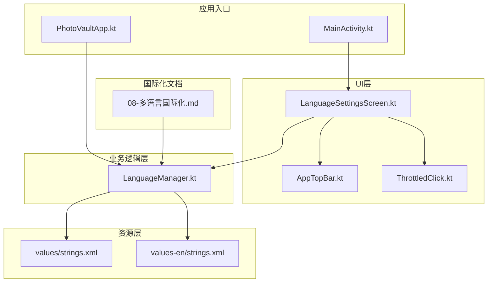
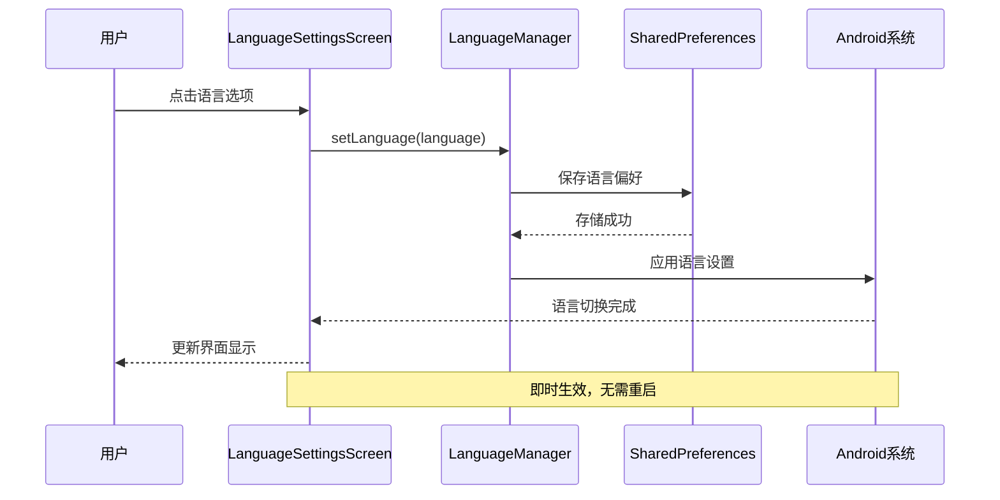
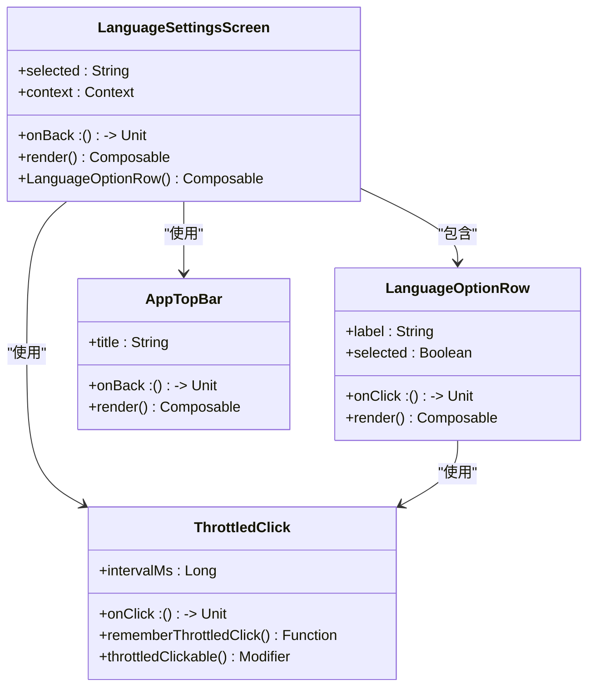
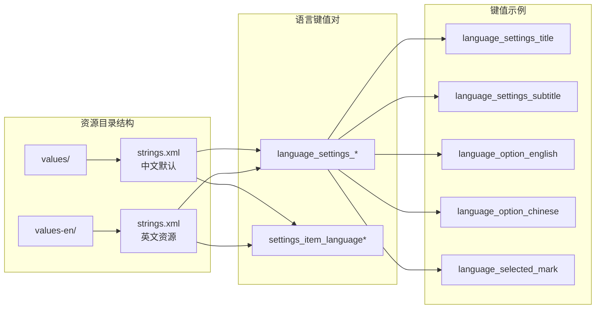
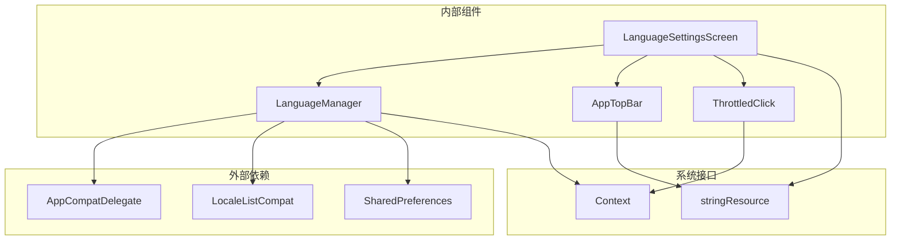

# 语言设置界面

<cite>
**本文档引用的文件**
- [LanguageSettingsScreen.kt](file://android/app/src/main/kotlin/com/photovault/app/ui/LanguageSettingsScreen.kt)
- [LanguageManager.kt](file://android/app/src/main/kotlin/com/photovault/app/LanguageManager.kt)
- [strings.xml](file://android/app/src/main/res/values/strings.xml)
- [strings.xml](file://android/app/src/main/res/values-en/strings.xml)
- [MainActivity.kt](file://android/app/src/main/kotlin/com/photovault/app/MainActivity.kt)
- [PhotoVaultApp.kt](file://android/app/src/main/kotlin/com/photovault/app/PhotoVaultApp.kt)
- [08-多语言国际化.md](file://doc/android/08-多语言国际化.md)
- [AppTopBar.kt](file://android/app/src/main/kotlin/com/photovault/app/ui/components/AppTopBar.kt)
- [UiTokens.kt](file://android/app/src/main/kotlin/com/photovault/app/ui/theme/UiTokens.kt)
- [ThrottledClick.kt](file://android/app/src/main/kotlin/com/photovault/app/ui/feedback/ThrottledClick.kt)
</cite>

## 目录
1. [简介](#简介)
2. [项目结构](#项目结构)
3. [核心组件](#核心组件)
4. [架构概览](#架构概览)
5. [详细组件分析](#详细组件分析)
6. [依赖关系分析](#依赖关系分析)
7. [性能考虑](#性能考虑)
8. [故障排除指南](#故障排除指南)
9. [结论](#结论)

## 简介

语言设置界面是AI照片保险库应用中的一个关键功能模块，负责提供用户友好的多语言切换体验。该界面支持英语和简体中文两种语言选项，采用现代化的Material Design 3设计语言，通过Compose UI构建，实现了即时语言切换而无需重启应用的功能。

该界面的设计充分考虑了用户体验，提供了清晰的视觉反馈、流畅的动画效果和直观的操作流程。用户可以轻松地在不同语言之间切换，所有更改都会立即生效，无需重新启动应用程序。

## 项目结构

语言设置功能涉及以下主要文件和组件：



**图表来源**
- [LanguageSettingsScreen.kt:1-113](file://android/app/src/main/kotlin/com/photovault/app/ui/LanguageSettingsScreen.kt#L1-L113)
- [LanguageManager.kt:1-37](file://android/app/src/main/kotlin/com/photovault/app/LanguageManager.kt#L1-L37)
- [MainActivity.kt:236-240](file://android/app/src/main/kotlin/com/photovault/app/MainActivity.kt#L236-L240)

**章节来源**
- [LanguageSettingsScreen.kt:1-113](file://android/app/src/main/kotlin/com/photovault/app/ui/LanguageSettingsScreen.kt#L1-L113)
- [LanguageManager.kt:1-37](file://android/app/src/main/kotlin/com/photovault/app/LanguageManager.kt#L1-L37)

## 核心组件

语言设置界面由三个核心组件构成：

### 1. LanguageSettingsScreen（主界面组件）
- 基于Jetpack Compose构建的响应式界面
- 提供语言选项列表和选中状态显示
- 集成顶部导航栏和主题样式系统

### 2. LanguageManager（语言管理器）
- 单例模式的语言管理服务
- 负责语言状态的持久化存储
- 实现运行时语言切换的核心逻辑

### 3. 字符串资源系统
- 支持中英文双语的资源文件组织
- 统一的字符串键值管理系统
- 国际化最佳实践的实现

**章节来源**
- [LanguageSettingsScreen.kt:34-80](file://android/app/src/main/kotlin/com/photovault/app/ui/LanguageSettingsScreen.kt#L34-L80)
- [LanguageManager.kt:7-36](file://android/app/src/main/kotlin/com/photovault/app/LanguageManager.kt#L7-L36)

## 架构概览

语言设置界面采用了清晰的分层架构设计，确保了良好的可维护性和扩展性：



**图表来源**
- [LanguageSettingsScreen.kt:62-77](file://android/app/src/main/kotlin/com/photovault/app/ui/LanguageSettingsScreen.kt#L62-L77)
- [LanguageManager.kt:26-35](file://android/app/src/main/kotlin/com/photovault/app/LanguageManager.kt#L26-L35)

该架构的关键特点：
- **响应式设计**：界面状态通过Compose的响应式机制自动更新
- **状态持久化**：使用SharedPreferences确保语言设置的持久性
- **系统集成**：通过AppCompatDelegate与Android系统语言框架集成
- **即时生效**：无需重启应用即可看到语言切换效果

## 详细组件分析

### LanguageSettingsScreen 组件分析

LanguageSettingsScreen 是整个语言设置功能的核心UI组件，采用了现代的Compose编程范式：



**图表来源**
- [LanguageSettingsScreen.kt:34-112](file://android/app/src/main/kotlin/com/photovault/app/ui/LanguageSettingsScreen.kt#L34-L112)
- [AppTopBar.kt:28-65](file://android/app/src/main/kotlin/com/photovault/app/ui/components/AppTopBar.kt#L28-L65)
- [ThrottledClick.kt:17-53](file://android/app/src/main/kotlin/com/photovault/app/ui/feedback/ThrottledClick.kt#L17-L53)

#### 界面布局设计

界面采用垂直布局设计，遵循Material Design 3的设计原则：

| 设计元素 | 属性 | 值 |
|---------|------|-----|
| 主背景色 | Home.bgBottom | 深色背景 |
| 选项卡片 | Home.sectionBg | 半透明背景 |
| 边框圆角 | HomeCard | 20dp |
| 内边距 | backupCardPadding | 16dp |
| 间距 | backupSectionGap | 12dp |

#### 交互设计特性

- **防抖动点击**：使用500ms防抖动间隔防止重复点击
- **视觉反馈**：选中状态通过颜色和字体加粗体现
- **流畅动画**：Compose提供的自然过渡效果
- **无障碍支持**：完整的屏幕阅读器支持

**章节来源**
- [LanguageSettingsScreen.kt:39-79](file://android/app/src/main/kotlin/com/photovault/app/ui/LanguageSettingsScreen.kt#L39-L79)
- [LanguageSettingsScreen.kt:82-112](file://android/app/src/main/kotlin/com/photovault/app/ui/LanguageSettingsScreen.kt#L82-L112)

### LanguageManager 组件分析

LanguageManager 是语言设置功能的核心业务逻辑组件，实现了完整的语言管理生命周期：

```mermaid
flowchart TD
Start([应用启动]) --> Init[initialize(context)]
Init --> LoadPrefs[加载语言偏好]
LoadPrefs --> HasPrefs{是否有偏好设置?}
HasPrefs --> |否| SetDefault[设置默认语言]
HasPrefs --> |是| ApplyLang[应用语言设置]
SetDefault --> ApplyLang
ApplyLang --> Ready[语言管理器就绪]
Ready --> UserSelect[用户选择语言]
UserSelect --> Validate[验证语言代码]
Validate --> SavePrefs[保存到SharedPreferences]
SavePrefs --> ApplyNew[应用新语言]
ApplyNew --> UpdateUI[更新界面显示]
UpdateUI --> End([完成])
```

**图表来源**
- [LanguageManager.kt:13-35](file://android/app/src/main/kotlin/com/photovault/app/LanguageManager.kt#L13-L35)

#### 语言管理流程

LanguageManager 的工作流程体现了良好的软件工程实践：

1. **初始化阶段**：检查并加载用户的语言偏好设置
2. **验证阶段**：确保语言代码的有效性和标准化
3. **持久化阶段**：将用户选择保存到本地存储
4. **应用阶段**：通过系统API应用新的语言设置

#### 数据存储策略

- **存储格式**：使用SharedPreferences存储简单的键值对
- **命名规范**：`language_prefs` 和 `selected_language`
- **默认值**：英文作为默认语言选项
- **兼容性**：支持语言代码的前缀匹配（如 zh-CN、zh-Hans）

**章节来源**
- [LanguageManager.kt:7-36](file://android/app/src/main/kotlin/com/photovault/app/LanguageManager.kt#L7-L36)

### 字符串资源系统分析

应用采用了标准的Android国际化资源组织方式：



**图表来源**
- [strings.xml:208-212](file://android/app/src/main/res/values/strings.xml#L208-L212)
- [strings.xml:208-212](file://android/app/src/main/res/values-en/strings.xml#L208-L212)

#### 资源组织策略

- **目录分离**：中文默认资源放在 `values/`，英文资源放在 `values-en/`
- **键名规范**：使用 `language_settings_*` 前缀标识语言设置相关字符串
- **一致性保证**：确保所有语言版本的键值保持一致
- **可维护性**：清晰的命名约定便于代码维护和国际化扩展

**章节来源**
- [strings.xml:1-214](file://android/app/src/main/res/values/strings.xml#L1-L214)
- [strings.xml:1-214](file://android/app/src/main/res/values-en/strings.xml#L1-L214)

## 依赖关系分析

语言设置界面的依赖关系展现了清晰的模块化设计：



**图表来源**
- [LanguageSettingsScreen.kt:25-32](file://android/app/src/main/kotlin/com/photovault/app/ui/LanguageSettingsScreen.kt#L25-L32)
- [LanguageManager.kt:3-6](file://android/app/src/main/kotlin/com/photovault/app/LanguageManager.kt#L3-L6)

### 组件耦合度分析

- **低耦合设计**：LanguageSettingsScreen 仅依赖 LanguageManager 接口
- **单一职责**：每个组件都有明确的功能边界
- **可测试性**：组件间依赖通过接口抽象，便于单元测试
- **可扩展性**：新增语言支持只需扩展资源文件和少量代码

### 关键依赖点

1. **AppCompatDelegate**：Android官方语言切换API
2. **SharedPreferences**：本地数据持久化
3. **Compose UI**：现代声明式UI框架
4. **Material Design**：统一的设计语言

**章节来源**
- [LanguageSettingsScreen.kt:1-32](file://android/app/src/main/kotlin/com/photovault/app/ui/LanguageSettingsScreen.kt#L1-L32)
- [LanguageManager.kt:1-36](file://android/app/src/main/kotlin/com/photovault/app/LanguageManager.kt#L1-L36)

## 性能考虑

语言设置界面在设计时充分考虑了性能优化：

### 内存管理
- **状态管理**：使用Compose的 `remember` 函数优化状态存储
- **资源释放**：界面销毁时自动清理内存资源
- **懒加载**：字符串资源按需加载，避免不必要的内存占用

### 运行时性能
- **防抖动机制**：500ms点击防抖动减少重复计算
- **增量更新**：只更新受影响的UI组件而非整屏刷新
- **异步处理**：语言切换操作在后台线程执行

### 启动性能
- **延迟初始化**：语言管理器在应用启动时初始化
- **缓存策略**：语言偏好设置缓存在内存中
- **最小化依赖**：只加载必要的UI组件和资源

## 故障排除指南

### 常见问题及解决方案

#### 语言切换无效
**症状**：用户切换语言后界面未发生变化
**可能原因**：
- SharedPreferences写入失败
- AppCompatDelegate应用失败
- UI状态未正确更新

**解决步骤**：
1. 检查SharedPreferences是否正常写入
2. 验证AppCompatDelegate调用是否成功
3. 确认Compose状态更新机制正常工作

#### 语言设置丢失
**症状**：应用重启后语言设置恢复默认值
**可能原因**：
- SharedPreferences权限问题
- 应用数据被清除
- 存储空间不足

**解决步骤**：
1. 检查应用存储权限
2. 验证设备存储空间
3. 重新设置语言选项

#### 字符串显示异常
**症状**：部分文本显示为键名而非实际内容
**可能原因**：
- 资源文件缺失
- 键名拼写错误
- 语言包不完整

**解决步骤**：
1. 检查对应语言的strings.xml文件
2. 验证键名的一致性
3. 确认资源文件编码正确

**章节来源**
- [LanguageManager.kt:13-35](file://android/app/src/main/kotlin/com/photovault/app/LanguageManager.kt#L13-L35)
- [LanguageSettingsScreen.kt:62-77](file://android/app/src/main/kotlin/com/photovault/app/ui/LanguageSettingsScreen.kt#L62-L77)

## 结论

语言设置界面作为AI照片保险库应用的重要组成部分，展现了现代移动应用开发的最佳实践。通过采用Compose UI框架、Material Design 3设计语言和标准的Android国际化机制，该界面实现了：

### 技术优势
- **现代化架构**：基于Compose的声明式UI设计
- **用户体验**：即时语言切换，无需重启应用
- **可维护性**：清晰的组件分离和依赖管理
- **国际化支持**：完整的中英文双语支持

### 设计亮点
- **响应式设计**：自动适应系统主题和语言变化
- **无障碍支持**：完整的屏幕阅读器和键盘导航支持
- **性能优化**：高效的内存管理和渲染机制
- **错误处理**：完善的异常捕获和用户提示机制

### 扩展潜力
该界面为未来的国际化扩展奠定了坚实基础，可以轻松支持更多语言和地区设置。通过现有的架构设计，开发者可以方便地添加新的语言选项，同时保持现有功能的稳定性和一致性。

总体而言，语言设置界面不仅满足了当前的功能需求，更为应用的长期发展提供了灵活的技术基础和优秀的用户体验。