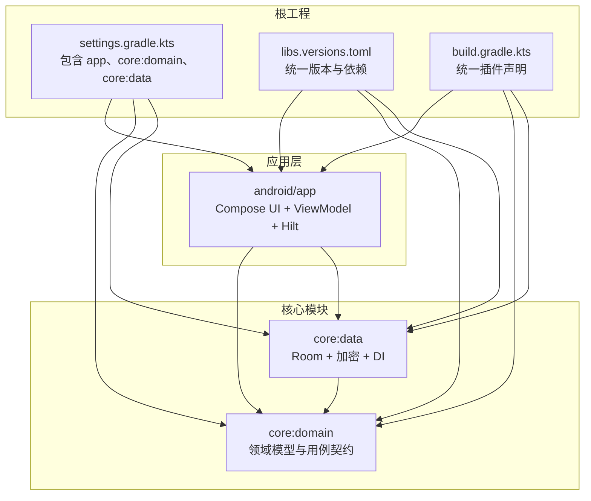
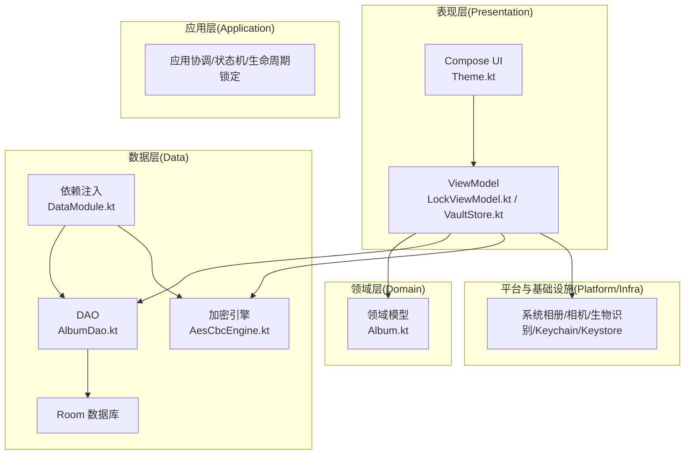
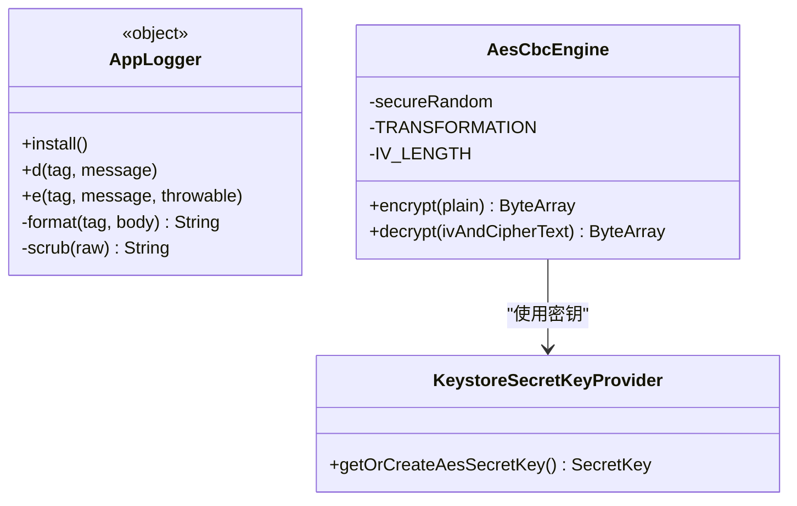
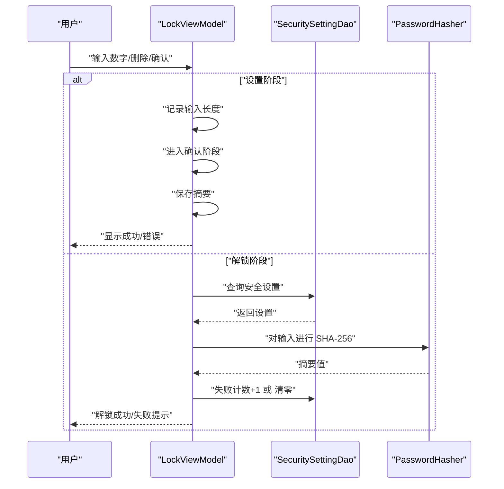
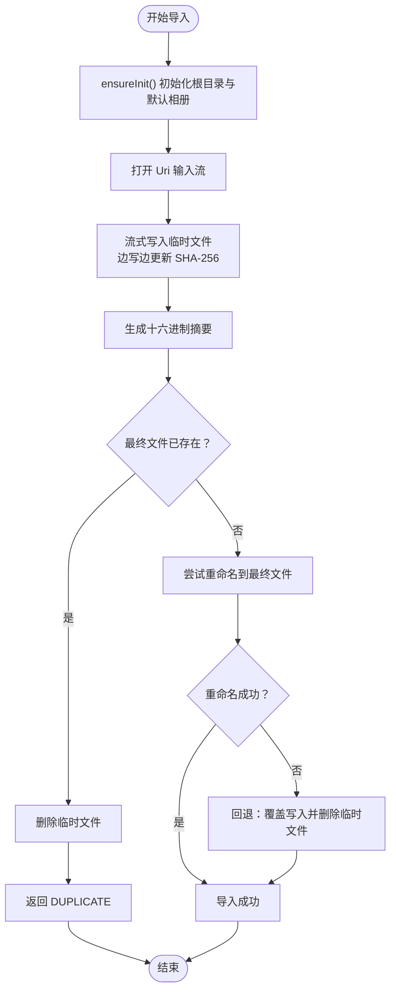
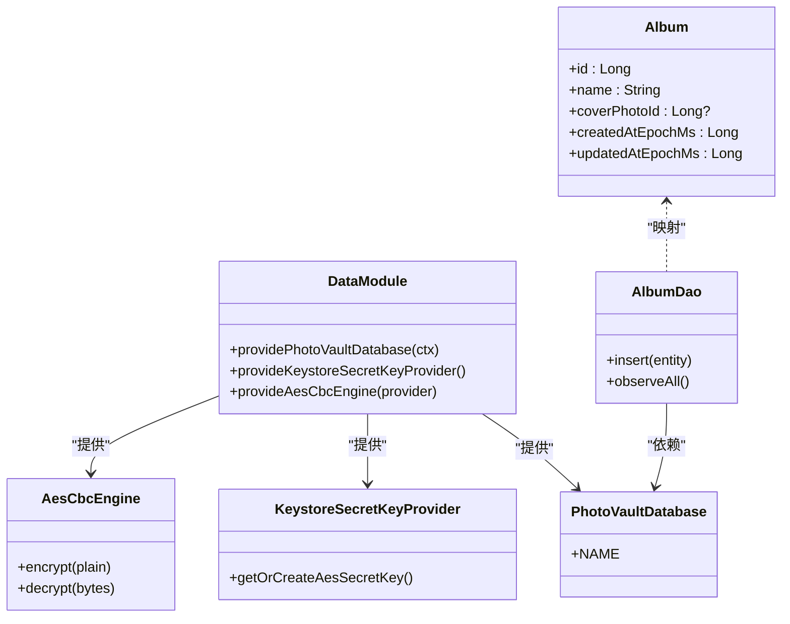
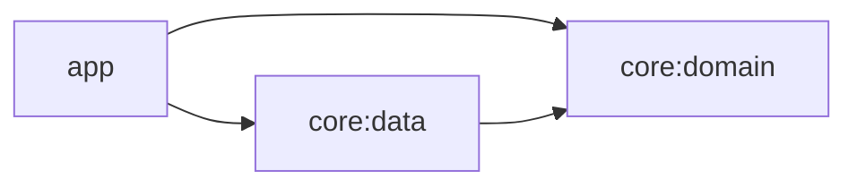

# 开发指南

<cite>
**本文引用的文件**
- [android/build.gradle.kts](file://android/build.gradle.kts)
- [android/gradle/libs.versions.toml](file://android/gradle/libs.versions.toml)
- [android/settings.gradle.kts](file://android/settings.gradle.kts)
- [android/app/build.gradle.kts](file://android/app/build.gradle.kts)
- [android/core/data/build.gradle.kts](file://android/core/data/build.gradle.kts)
- [android/core/domain/build.gradle.kts](file://android/core/domain/build.gradle.kts)
- [spec/私密相册 App（一期）原生双端架构设计方案.md](file://spec/私密相册 App（一期）原生双端架构设计方案.md)
- [doc/android-ui-design-spec-baseline.md](file://doc/android-ui-design-spec-baseline.md)
- [android/app/src/main/kotlin/com/photovault/app/ui/theme/Theme.kt](file://android/app/src/main/kotlin/com/photovault/app/ui/theme/Theme.kt)
- [android/app/src/main/kotlin/com/photovault/app/AppLogger.kt](file://android/app/src/main/kotlin/com/photovault/app/AppLogger.kt)
- [android/core/data/src/main/kotlin/com/photovault/data/crypto/AesCbcEngine.kt](file://android/core/data/src/main/kotlin/com/photovault/data/crypto/AesCbcEngine.kt)
- [android/core/data/src/main/kotlin/com/photovault/data/db/dao/AlbumDao.kt](file://android/core/data/src/main/kotlin/com/photovault/data/db/dao/AlbumDao.kt)
- [android/core/domain/src/main/kotlin/com/photovault/domain/model/Album.kt](file://android/core/domain/src/main/kotlin/com/photovault/domain/model/Album.kt)
- [android/app/src/main/kotlin/com/photovault/app/ui/lock/LockViewModel.kt](file://android/app/src/main/kotlin/com/photovault/app/ui/lock/LockViewModel.kt)
- [android/app/src/main/kotlin/com/photovault/app/ui/vault/VaultStore.kt](file://android/app/src/main/kotlin/com/photovault/app/ui/vault/VaultStore.kt)
- [android/core/data/src/main/kotlin/com/photovault/data/di/DataModule.kt](file://android/core/data/src/main/kotlin/com/photovault/data/di/DataModule.kt)
- [android/core/data/src/test/kotlin/com/photovault/data/crypto/AesCbcEngineTest.kt](file://android/core/data/src/test/kotlin/com/photovault/data/crypto/AesCbcEngineTest.kt)
</cite>

## 目录
1. [简介](#简介)
2. [项目结构](#项目结构)
3. [核心组件](#核心组件)
4. [架构总览](#架构总览)
5. [详细组件分析](#详细组件分析)
6. [依赖分析](#依赖分析)
7. [性能考虑](#性能考虑)
8. [调试与排错指南](#调试与排错指南)
9. [结论](#结论)
10. [附录](#附录)

## 简介
本开发指南面向AI照片保险库（PhotoVault）开发团队，旨在提供统一的代码规范、开发流程、调试与排错方法、性能与安全最佳实践，以及新功能开发的协作模板。文档结合现有代码库与架构方案，帮助团队高效协作并持续提升代码质量。

## 项目结构
项目采用多模块 Gradle 架构，根工程统一版本与插件，模块按“表现层/应用层/领域层/数据层/平台与基础设施”分层组织，Android 端以 Jetpack Compose + Hilt + Room + Kotlin Coroutines 为主要技术栈。

图表来源
- [android/settings.gradle.kts:17-21](file://android/settings.gradle.kts#L17-L21)
- [android/gradle/libs.versions.toml:1-64](file://android/gradle/libs.versions.toml#L1-L64)
- [android/build.gradle.kts:1-10](file://android/build.gradle.kts#L1-L10)

章节来源
- [android/settings.gradle.kts:1-21](file://android/settings.gradle.kts#L1-L21)
- [android/gradle/libs.versions.toml:1-64](file://android/gradle/libs.versions.toml#L1-L64)
- [android/build.gradle.kts:1-10](file://android/build.gradle.kts#L1-L10)

## 核心组件
- 日志与可观测性：统一日志入口，限制单条日志长度，仅在 Debug 构建输出，避免敏感信息泄露。
- 安全与加密：基于 Android Keystore 的 AES-256-CBC（前置 IV）加解密引擎，口令摘要采用 SHA-256。
- 数据访问：Room DAO 提供实体观察与插入，领域模型与数据实体分离。
- UI 与状态：Jetpack Compose + ViewModel + Hilt，状态以 StateFlow 暴露，UI 与业务逻辑解耦。
- 应用与业务：解锁/安全设置、私密相册与导入、备份与恢复等业务通过 ViewModel 与数据层协作完成。

章节来源
- [android/app/src/main/kotlin/com/photovault/app/AppLogger.kt:1-43](file://android/app/src/main/kotlin/com/photovault/app/AppLogger.kt#L1-L43)
- [android/core/data/src/main/kotlin/com/photovault/data/crypto/AesCbcEngine.kt:1-40](file://android/core/data/src/main/kotlin/com/photovault/data/crypto/AesCbcEngine.kt#L1-L40)
- [android/core/data/src/main/kotlin/com/photovault/data/db/dao/AlbumDao.kt:1-18](file://android/core/data/src/main/kotlin/com/photovault/data/db/dao/AlbumDao.kt#L1-L18)
- [android/core/domain/src/main/kotlin/com/photovault/domain/model/Album.kt:1-13](file://android/core/domain/src/main/kotlin/com/photovault/domain/model/Album.kt#L1-L13)
- [android/app/src/main/kotlin/com/photovault/app/ui/lock/LockViewModel.kt:1-222](file://android/app/src/main/kotlin/com/photovault/app/ui/lock/LockViewModel.kt#L1-L222)
- [android/app/src/main/kotlin/com/photovault/app/ui/vault/VaultStore.kt:1-226](file://android/app/src/main/kotlin/com/photovault/app/ui/vault/VaultStore.kt#L1-L226)

## 架构总览
项目采用“同构分层”的原生双端架构，Android 侧以 Compose + ViewModel + Hilt + Room + 加密管线为核心，强调“主线程只做渲染与轻逻辑”，加密、解码、AI、大批量 IO 在后台执行器中进行。

图表来源
- [spec/私密相册 App（一期）原生双端架构设计方案.md:20-54](file://spec/私密相册 App（一期）原生双端架构设计方案.md#L20-L54)
- [android/app/src/main/kotlin/com/photovault/app/ui/theme/Theme.kt:1-19](file://android/app/src/main/kotlin/com/photovault/app/ui/theme/Theme.kt#L1-L19)
- [android/app/src/main/kotlin/com/photovault/app/ui/lock/LockViewModel.kt:1-222](file://android/app/src/main/kotlin/com/photovault/app/ui/lock/LockViewModel.kt#L1-L222)
- [android/app/src/main/kotlin/com/photovault/app/ui/vault/VaultStore.kt:1-226](file://android/app/src/main/kotlin/com/photovault/app/ui/vault/VaultStore.kt#L1-L226)
- [android/core/data/src/main/kotlin/com/photovault/data/db/dao/AlbumDao.kt:1-18](file://android/core/data/src/main/kotlin/com/photovault/data/db/dao/AlbumDao.kt#L1-L18)
- [android/core/data/src/main/kotlin/com/photovault/data/crypto/AesCbcEngine.kt:1-40](file://android/core/data/src/main/kotlin/com/photovault/data/crypto/AesCbcEngine.kt#L1-L40)
- [android/core/data/src/main/kotlin/com/photovault/data/di/DataModule.kt:1-40](file://android/core/data/src/main/kotlin/com/photovault/data/di/DataModule.kt#L1-L40)

章节来源
- [spec/私密相册 App（一期）原生双端架构设计方案.md:20-54](file://spec/私密相册 App（一期）原生双端架构设计方案.md#L20-L54)

## 详细组件分析

### 组件A：日志与安全（AppLogger 与 AesCbcEngine）
- 日志规范：统一全局 Tag，Debug 构建下输出，消息截断上限，避免敏感信息泄露。
- 加密规范：AES-256-CBC + PKCS5Padding（与 PKCS7 等价），前置 IV（16 字节），密钥来自 Keystore，口令摘要使用 SHA-256。

图表来源
- [android/app/src/main/kotlin/com/photovault/app/AppLogger.kt:1-43](file://android/app/src/main/kotlin/com/photovault/app/AppLogger.kt#L1-L43)
- [android/core/data/src/main/kotlin/com/photovault/data/crypto/AesCbcEngine.kt:1-40](file://android/core/data/src/main/kotlin/com/photovault/data/crypto/AesCbcEngine.kt#L1-L40)

章节来源
- [android/app/src/main/kotlin/com/photovault/app/AppLogger.kt:1-43](file://android/app/src/main/kotlin/com/photovault/app/AppLogger.kt#L1-L43)
- [android/core/data/src/main/kotlin/com/photovault/data/crypto/AesCbcEngine.kt:1-40](file://android/core/data/src/main/kotlin/com/photovault/data/crypto/AesCbcEngine.kt#L1-L40)

### 组件B：解锁与安全（LockViewModel）
- 状态机：支持设置 PIN（6 位）、确认 PIN、解锁校验、生物识别启用与失败计数。
- 数据持久化：通过 DAO 读写安全设置，口令以 SHA-256 十六进制摘要存储，失败次数清零或递增。
- UI 行为：根据阶段切换标题/副标题/步骤标签，错误提示与成功提示明确。

图表来源
- [android/app/src/main/kotlin/com/photovault/app/ui/lock/LockViewModel.kt:19-197](file://android/app/src/main/kotlin/com/photovault/app/ui/lock/LockViewModel.kt#L19-L197)

章节来源
- [android/app/src/main/kotlin/com/photovault/app/ui/lock/LockViewModel.kt:1-222](file://android/app/src/main/kotlin/com/photovault/app/ui/lock/LockViewModel.kt#L1-L222)

### 组件C：私密相册与导入（VaultStore）
- 文件组织：私密相册根目录与默认相册初始化，兼容旧版目录迁移。
- 导入策略：基于内容提供者流式拷贝，SHA-256 去重，重复则删除临时文件并返回 DUPLICATE。
- 查询与缓存：专辑与照片列表缓存，最近照片与总数统计，搜索大小写不敏感。

图表来源
- [android/app/src/main/kotlin/com/photovault/app/ui/vault/VaultStore.kt:120-154](file://android/app/src/main/kotlin/com/photovault/app/ui/vault/VaultStore.kt#L120-L154)

章节来源
- [android/app/src/main/kotlin/com/photovault/app/ui/vault/VaultStore.kt:1-226](file://android/app/src/main/kotlin/com/photovault/app/ui/vault/VaultStore.kt#L1-L226)

### 组件D：数据层与依赖注入（DataModule、AlbumDao、Album）
- DI：通过 Hilt 提供 Room 数据库、Keystore 密钥提供器与 AES 引擎。
- DAO：提供专辑插入与按更新时间倒序观察全部专辑。
- 领域模型：Album 数据类承载相册标识、封面、创建/更新时间等。

图表来源
- [android/core/data/src/main/kotlin/com/photovault/data/di/DataModule.kt:15-39](file://android/core/data/src/main/kotlin/com/photovault/data/di/DataModule.kt#L15-L39)
- [android/core/data/src/main/kotlin/com/photovault/data/db/dao/AlbumDao.kt:10-17](file://android/core/data/src/main/kotlin/com/photovault/data/db/dao/AlbumDao.kt#L10-L17)
- [android/core/domain/src/main/kotlin/com/photovault/domain/model/Album.kt:6-12](file://android/core/domain/src/main/kotlin/com/photovault/domain/model/Album.kt#L6-L12)

章节来源
- [android/core/data/src/main/kotlin/com/photovault/data/di/DataModule.kt:1-40](file://android/core/data/src/main/kotlin/com/photovault/data/di/DataModule.kt#L1-L40)
- [android/core/data/src/main/kotlin/com/photovault/data/db/dao/AlbumDao.kt:1-18](file://android/core/data/src/main/kotlin/com/photovault/data/db/dao/AlbumDao.kt#L1-L18)
- [android/core/domain/src/main/kotlin/com/photovault/domain/model/Album.kt:1-13](file://android/core/domain/src/main/kotlin/com/photovault/domain/model/Album.kt#L1-L13)

## 依赖分析
- 版本与插件：根工程统一声明插件与版本，模块共享 libs.versions.toml。
- 模块依赖：app 依赖 core:domain 与 core:data；core:data 依赖 core:domain。
- 运行时依赖：Compose、Lifecycle、Navigation、Room、Security Crypto、Hilt、CameraX、Biometric 等。

图表来源
- [android/app/build.gradle.kts:63-90](file://android/app/build.gradle.kts#L63-L90)
- [android/core/data/build.gradle.kts:31-47](file://android/core/data/build.gradle.kts#L31-L47)
- [android/core/domain/build.gradle.kts:9-12](file://android/core/domain/build.gradle.kts#L9-L12)

章节来源
- [android/app/build.gradle.kts:1-91](file://android/app/build.gradle.kts#L1-L91)
- [android/core/data/build.gradle.kts:1-48](file://android/core/data/build.gradle.kts#L1-L48)
- [android/core/domain/build.gradle.kts:1-13](file://android/core/domain/build.gradle.kts#L1-L13)

## 性能考虑
- 线程与调度：主线程仅做 UI 渲染与轻逻辑；加密、解码、AI、大批量 IO 放在后台执行器。
- 数据与事务：批量导入分批提交或单事务；避免每张照片触发全表扫描。
- 内存：大图按目标尺寸解码；AI 输入 Tensor 尽量复用缓冲区。
- 缓存：私密相册列表与专辑内照片列表采用内存缓存，降低重复 IO。
- UI 一致性：Material 3 主题自动适配深浅色，减少 UI 计算开销。

章节来源
- [spec/私密相册 App（一期）原生双端架构设计方案.md:151-157](file://spec/私密相册 App（一期）原生双端架构设计方案.md#L151-L157)
- [android/app/src/main/kotlin/com/photovault/app/ui/theme/Theme.kt:9-18](file://android/app/src/main/kotlin/com/photovault/app/ui/theme/Theme.kt#L9-L18)
- [android/app/src/main/kotlin/com/photovault/app/ui/vault/VaultStore.kt:40-58](file://android/app/src/main/kotlin/com/photovault/app/ui/vault/VaultStore.kt#L40-L58)

## 调试与排错指南
- 日志规范：使用统一日志入口，Debug 构建输出；避免打印口令、密钥、完整路径与可识别用户路径；单条消息长度截断上限。
- 单元测试：加密模块提供单元测试示例，验证加解密往返正确性。
- UI 规范：遵循设计基线与按钮/弹窗规范，PR 中如与规范不一致需标注原因与后续计划。
- 常见问题
  - 解锁失败：检查口令摘要是否一致，失败次数是否递增；确认生物识别回调成功/失败路径。
  - 导入重复：确认 SHA-256 去重逻辑与最终文件存在判断；关注重命名失败的回退路径。
  - 相册列表异常：核对专辑排序与默认相册优先级；检查缓存命中与失效策略。

章节来源
- [android/app/src/main/kotlin/com/photovault/app/AppLogger.kt:5-42](file://android/app/src/main/kotlin/com/photovault/app/AppLogger.kt#L5-L42)
- [android/core/data/src/test/kotlin/com/photovault/data/crypto/AesCbcEngineTest.kt:1-19](file://android/core/data/src/test/kotlin/com/photovault/data/crypto/AesCbcEngineTest.kt#L1-L19)
- [doc/android-ui-design-spec-baseline.md:15-26](file://doc/android-ui-design-spec-baseline.md#L15-L26)
- [android/app/src/main/kotlin/com/photovault/app/ui/lock/LockViewModel.kt:168-184](file://android/app/src/main/kotlin/com/photovault/app/ui/lock/LockViewModel.kt#L168-L184)
- [android/app/src/main/kotlin/com/photovault/app/ui/vault/VaultStore.kt:142-154](file://android/app/src/main/kotlin/com/photovault/app/ui/vault/VaultStore.kt#L142-L154)

## 结论
本指南基于现有架构与代码实现，总结了日志与安全、解锁与导入、数据层与依赖注入等关键组件的开发规范与最佳实践。建议团队在新功能开发中严格遵循命名、注释、线程与缓存策略，持续完善测试与 UI 规范，确保代码质量与用户体验的一致性。

## 附录

### A. 代码规范与约定
- 命名规范
  - 包名：com.photovault.{layer}，如 ui、data、domain。
  - 类/接口：PascalCase；对象单例使用 PascalCase；枚举与数据类同。
  - 常量：UPPER_SNAKE_CASE；私有常量带前缀“_”。
  - 方法：camelCase；纯函数与无副作用方法优先。
- 代码格式
  - 使用 Kotlin 编码风格，缩进 4 空格；表达式与操作符两侧留空格。
  - 函数体与条件块必须使用花括号；长参数分行对齐。
- 注释标准
  - 类/接口/公开函数需提供用途说明与关键参数/返回值说明。
  - 关键算法与安全相关逻辑需标注安全假设与边界条件。
  - TODO/FIXME 使用统一格式并在 PR 中跟踪解决。

### B. 开发流程与最佳实践
- 分支管理
  - 主分支保护：master/main 仅允许通过合并请求（MR/PR）合并。
  - 功能分支：feature/{issue-number}-{description}，短期任务可使用 hotfix/{issue-number}。
  - 合并策略：Rebase 或 Squash 合并，保留清晰提交历史；合并前必须通过 CI。
- 代码审查
  - 至少一名 reviewer；涉及安全/加密/数据库变更需两名 reviewer。
  - 审查要点：安全性、性能、可维护性、测试覆盖率、UI 规范一致性。
- 提交信息
  - 格式：[模块]: [类型] 摘要；正文说明动机与影响；引用 Issue/PR。

### C. 调试技巧与工具
- 日志
  - 使用 AppLogger 输出；避免在 Release 构建输出敏感信息。
  - 关键路径增加上下文 tag，便于过滤与定位。
- 断点与抓包
  - 使用 IDE 断点与 Logcat/设备日志；必要时使用网络抓包工具排查分享/备份链路。
- 性能分析
  - 使用 Android Studio Profiler 分析 CPU、内存与 IO；关注后台线程与 UI 卡顿。
- 测试
  - 单元测试：覆盖核心算法与边界条件；使用 Robolectric/Truth。
  - UI 测试：Compose 测试与交互模拟，确保主题与按钮规范符合设计基线。

### D. 性能优化与安全编码
- 性能
  - 后台执行：加密、解码、AI、IO 使用 Dispatchers.Default 或 IO；限制并发。
  - 分页与缓存：相册列表分页、专辑与照片列表缓存；避免全量扫描。
  - 内存：大图按目标尺寸解码；复用缓冲区；及时释放资源。
- 安全
  - 口令：仅存储 SHA-256 十六进制摘要；PIN 6 位，失败次数清零/递增。
  - 密钥：AES 密钥托管于 Keystore；避免硬编码密钥与口令。
  - 敏感信息：日志截断、不输出路径与明文口令；文件命名清理非法字符。

### E. 新功能开发指导流程与模板
- 步骤
  1) 需求评审：明确业务语义、数据契约与 UI 规范。
  2) 设计与建模：在领域层定义模型与用例；在数据层定义实体与 DAO。
  3) 实现
     - 数据层：实现 Repository 接口与 DAO；提供 DI 绑定。
     - 应用层：编写 ViewModel 与状态；处理业务流程与错误。
     - 表现层：实现 Compose UI；遵循设计基线。
  4) 测试：补充单元测试与 UI 测试；验证边界与异常路径。
  5) 审查与合并：通过代码审查与 CI；合并后回归测试。
- 模板
  - 领域模型：Album.kt 样例
  - 数据访问：AlbumDao.kt 样例
  - 安全与加密：AesCbcEngine.kt 样例
  - UI 与状态：LockViewModel.kt 样例
  - 文件导入：VaultStore.kt 样例

章节来源
- [android/core/domain/src/main/kotlin/com/photovault/domain/model/Album.kt:1-13](file://android/core/domain/src/main/kotlin/com/photovault/domain/model/Album.kt#L1-L13)
- [android/core/data/src/main/kotlin/com/photovault/data/db/dao/AlbumDao.kt:1-18](file://android/core/data/src/main/kotlin/com/photovault/data/db/dao/AlbumDao.kt#L1-L18)
- [android/core/data/src/main/kotlin/com/photovault/data/crypto/AesCbcEngine.kt:1-40](file://android/core/data/src/main/kotlin/com/photovault/data/crypto/AesCbcEngine.kt#L1-L40)
- [android/app/src/main/kotlin/com/photovault/app/ui/lock/LockViewModel.kt:1-222](file://android/app/src/main/kotlin/com/photovault/app/ui/lock/LockViewModel.kt#L1-L222)
- [android/app/src/main/kotlin/com/photovault/app/ui/vault/VaultStore.kt:1-226](file://android/app/src/main/kotlin/com/photovault/app/ui/vault/VaultStore.kt#L1-L226)