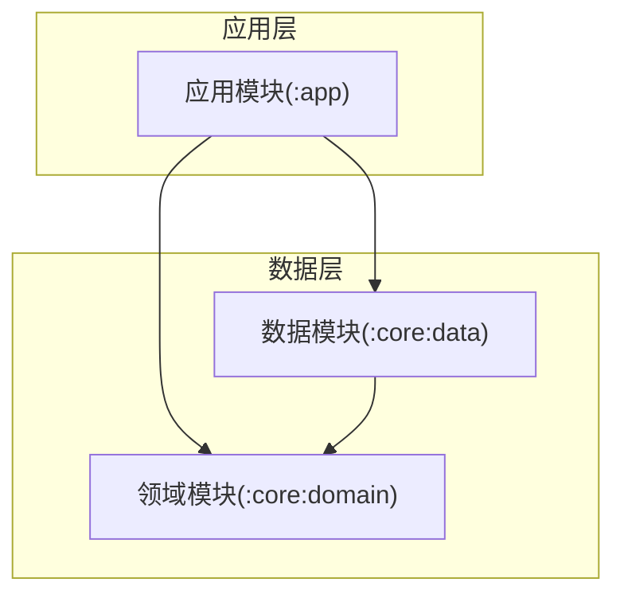
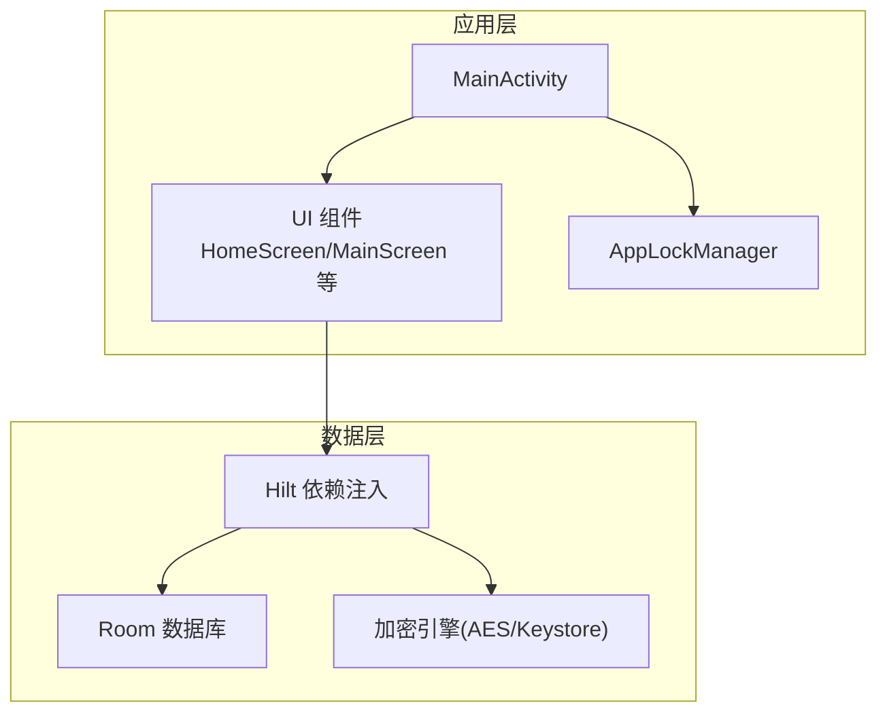
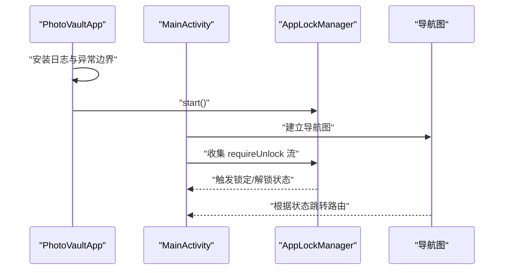
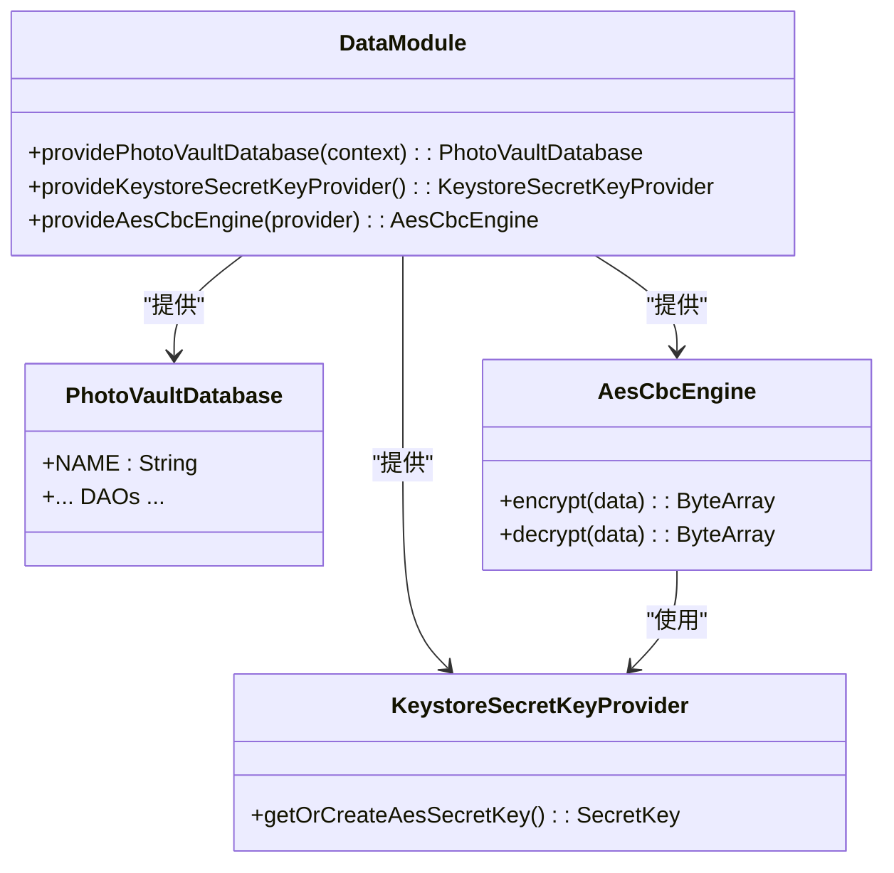
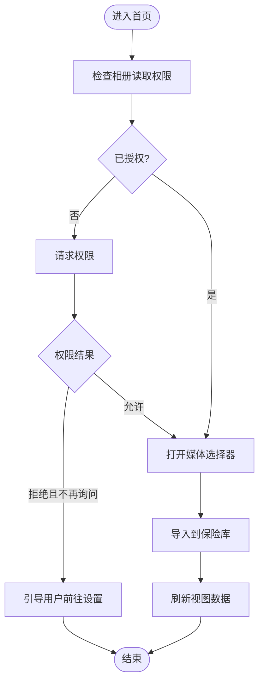
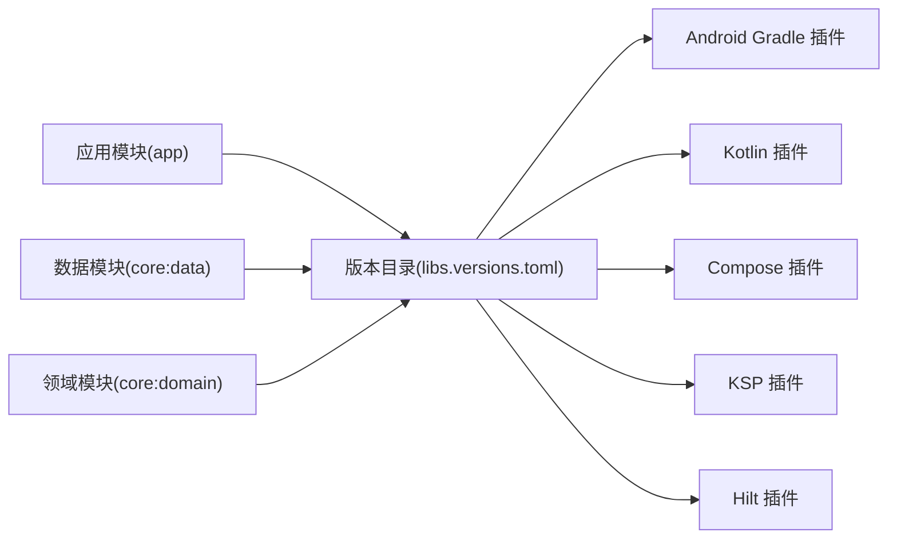

# 快速开始

<cite>
**本文引用的文件**
- [settings.gradle.kts](file://android/settings.gradle.kts)
- [build.gradle.kts](file://android/build.gradle.kts)
- [gradle.properties](file://android/gradle.properties)
- [libs.versions.toml](file://android/gradle/libs.versions.toml)
- [app/build.gradle.kts](file://android/app/build.gradle.kts)
- [AndroidManifest.xml](file://android/app/src/main/AndroidManifest.xml)
- [MainActivity.kt](file://android/app/src/main/kotlin/com/photovault/app/MainActivity.kt)
- [PhotoVaultApp.kt](file://android/app/src/main/kotlin/com/photovault/app/PhotoVaultApp.kt)
- [AppLockManager.kt](file://android/app/src/main/kotlin/com/photovault/app/AppLockManager.kt)
- [MainScreen.kt](file://android/app/src/main/kotlin/com/photovault/app/ui/MainScreen.kt)
- [HomeScreen.kt](file://android/app/src/main/kotlin/com/photovault/app/ui/HomeScreen.kt)
- [DataModule.kt](file://android/core/data/src/main/kotlin/com/photovault/data/di/DataModule.kt)
- [doc/android/README.md](file://doc/android/README.md)
</cite>

## 目录
1. [简介](#简介)
2. [项目结构](#项目结构)
3. [核心组件](#核心组件)
4. [架构概览](#架构概览)
5. [详细组件分析](#详细组件分析)
6. [依赖分析](#依赖分析)
7. [性能考虑](#性能考虑)
8. [故障排除指南](#故障排除指南)
9. [结论](#结论)
10. [附录](#附录)

## 简介
本指南面向新加入的开发者，帮助你在最短时间内完成 AI 照片保险库项目的开发环境搭建与首次运行。你将获得：
- 开发工具链安装与配置（Android Studio、JDK、Android SDK）
- 项目克隆、依赖安装与首次构建流程
- 基本运行与调试方法
- 常见环境问题的排查与解决建议

## 项目结构
该项目采用 Gradle 多模块结构，核心模块包括应用层与数据/领域层：
- 应用模块：负责 UI、导航、权限与生命周期管理
- 数据模块：负责数据库、加密与依赖注入提供者
- 领域模块：存放业务模型与纯 Kotlin 逻辑

图表来源
- [settings.gradle.kts:17-21](file://android/settings.gradle.kts#L17-L21)
- [app/build.gradle.kts:63-66](file://android/app/build.gradle.kts#L63-L66)

章节来源
- [settings.gradle.kts:1-21](file://android/settings.gradle.kts#L1-L21)
- [app/build.gradle.kts:1-91](file://android/app/build.gradle.kts#L1-L91)

## 核心组件
- 应用入口与生命周期
  - 应用类负责全局异常处理与启动时初始化
  - 主活动负责导航与页面路由
- 安全与锁定
  - 应用锁管理器在后台策略下触发锁定
- 数据与依赖注入
  - 数据模块提供数据库、密钥与加密引擎

章节来源
- [PhotoVaultApp.kt:1-31](file://android/app/src/main/kotlin/com/photovault/app/PhotoVaultApp.kt#L1-L31)
- [MainActivity.kt:1-262](file://android/app/src/main/kotlin/com/photovault/app/MainActivity.kt#L1-L262)
- [AppLockManager.kt:1-49](file://android/app/src/main/kotlin/com/photovault/app/AppLockManager.kt#L1-L49)
- [DataModule.kt:1-40](file://android/core/data/src/main/kotlin/com/photovault/data/di/DataModule.kt#L1-L40)

## 架构概览
应用采用分层架构与依赖注入：
- 应用层通过 Compose 进行 UI 呈现与导航
- 数据层使用 Room 管理本地数据库，结合 Hilt 提供依赖
- 加密模块基于 Keystore 与 AES 实现敏感数据保护

图表来源
- [MainActivity.kt:42-243](file://android/app/src/main/kotlin/com/photovault/app/MainActivity.kt#L42-L243)
- [AppLockManager.kt:17-48](file://android/app/src/main/kotlin/com/photovault/app/AppLockManager.kt#L17-L48)
- [DataModule.kt:15-39](file://android/core/data/src/main/kotlin/com/photovault/data/di/DataModule.kt#L15-L39)

## 详细组件分析

### 应用入口与导航
- 应用类负责安装日志与全局异常边界，并启动应用锁管理器
- 主活动定义了完整的导航图，包含启动页、锁屏、主界面、相机占位、搜索、相册、最近照片、回收站、付费墙、存储用量等路由
- 使用状态流驱动的锁定机制，在应用不可见或特定场景下自动跳转至锁屏

图表来源
- [PhotoVaultApp.kt:12-29](file://android/app/src/main/kotlin/com/photovault/app/PhotoVaultApp.kt#L12-L29)
- [MainActivity.kt:46-74](file://android/app/src/main/kotlin/com/photovault/app/MainActivity.kt#L46-L74)
- [AppLockManager.kt:22-47](file://android/app/src/main/kotlin/com/photovault/app/AppLockManager.kt#L22-L47)

章节来源
- [PhotoVaultApp.kt:1-31](file://android/app/src/main/kotlin/com/photovault/app/PhotoVaultApp.kt#L1-L31)
- [MainActivity.kt:1-262](file://android/app/src/main/kotlin/com/photovault/app/MainActivity.kt#L1-L262)
- [AppLockManager.kt:1-49](file://android/app/src/main/kotlin/com/photovault/app/AppLockManager.kt#L1-L49)

### 数据与加密模块
- 数据模块通过 Hilt 提供单例数据库实例、密钥提供者与 AES 引擎
- Room 数据库用于持久化元数据（相册、照片、回收站、安全设置等）

图表来源
- [DataModule.kt:18-39](file://android/core/data/src/main/kotlin/com/photovault/data/di/DataModule.kt#L18-L39)

章节来源
- [DataModule.kt:1-40](file://android/core/data/src/main/kotlin/com/photovault/data/di/DataModule.kt#L1-L40)

### 权限与运行时交互
- 应用清单声明了相机、媒体读取等必要权限
- 主界面在 Compose 中处理相册读取权限请求与多图选择导入

图表来源
- [AndroidManifest.xml:3-6](file://android/app/src/main/AndroidManifest.xml#L3-L6)
- [HomeScreen.kt:136-188](file://android/app/src/main/kotlin/com/photovault/app/ui/HomeScreen.kt#L136-L188)

章节来源
- [AndroidManifest.xml:1-27](file://android/app/src/main/AndroidManifest.xml#L1-L27)
- [HomeScreen.kt:1-200](file://android/app/src/main/kotlin/com/photovault/app/ui/HomeScreen.kt#L1-L200)

## 依赖分析
- 版本与插件管理
  - 通过版本目录统一管理第三方库版本与插件 ID
  - 应用模块启用 Compose、KSP、Hilt 等插件
- 模块间依赖
  - 应用模块依赖数据与领域模块
  - 数据模块依赖领域模块（共享模型）

图表来源
- [libs.versions.toml:1-64](file://android/gradle/libs.versions.toml#L1-L64)
- [app/build.gradle.kts:1-7](file://android/app/build.gradle.kts#L1-L7)
- [settings.gradle.kts:17-21](file://android/settings.gradle.kts#L17-L21)

章节来源
- [libs.versions.toml:1-64](file://android/gradle/libs.versions.toml#L1-L64)
- [app/build.gradle.kts:1-91](file://android/app/build.gradle.kts#L1-L91)
- [settings.gradle.kts:1-21](file://android/settings.gradle.kts#L1-L21)

## 性能考虑
- 构建优化
  - 启用资源与代码压缩（发布版）
  - 使用 JVM 目标版本与编译选项匹配
- UI 与数据
  - 使用 Compose 的状态与生命周期感知组件
  - 在后台策略下触发锁定，避免不必要的 UI 更新

章节来源
- [app/build.gradle.kts:36-56](file://android/app/build.gradle.kts#L36-L56)
- [AppLockManager.kt:12-15](file://android/app/src/main/kotlin/com/photovault/app/AppLockManager.kt#L12-L15)

## 故障排除指南
- 构建失败（找不到符号或插件）
  - 确认根级构建脚本中插件别名可用
  - 确认版本目录存在且未被修改
- 依赖解析失败
  - 检查仓库源与网络连通性
  - 确认模块包含关系正确
- 运行时崩溃
  - 查看全局异常边界日志输出
  - 检查权限请求与系统设置
- 设备兼容性
  - 确认目标 SDK 与最小 SDK 设置满足设备版本

章节来源
- [build.gradle.kts:1-10](file://android/build.gradle.kts#L1-L10)
- [gradle.properties:1-5](file://android/gradle.properties#L1-L5)
- [PhotoVaultApp.kt:19-29](file://android/app/src/main/kotlin/com/photovault/app/PhotoVaultApp.kt#L19-L29)
- [AndroidManifest.xml:16-25](file://android/app/src/main/AndroidManifest.xml#L16-L25)

## 结论
按照本指南完成环境准备与首次构建后，你将能够：
- 在本地设备或模拟器上运行应用
- 理解应用的导航与安全机制
- 接触到数据层与加密模块的基本职责
- 面对常见问题时具备基础排查能力

## 附录

### 开发环境搭建步骤
- 安装 Android Studio
  - 推荐使用最新稳定版
- 安装 JDK
  - 应用模块使用 Java 21 目标版本，请安装对应 JDK 并在 IDE 中配置
- 安装 Android SDK
  - 安装目标 SDK 与平台工具，确保模拟器或真机满足最低 SDK 要求
- 克隆项目
  - 使用 Git 克隆仓库到本地
- 打开项目
  - 在 Android Studio 中打开项目根目录
- 配置 Gradle
  - 确保 Gradle Wrapper 与版本目录可用
- 首次构建
  - 同步项目并执行构建任务
- 运行与调试
  - 选择设备（模拟器或真机），点击运行
  - 使用日志面板与断点进行调试

章节来源
- [app/build.gradle.kts:50-56](file://android/app/build.gradle.kts#L50-L56)
- [gradle.properties:1-5](file://android/gradle.properties#L1-L5)

### 项目文档索引
- Android 技术方案总览与分项文档
  - 参考文档目录以获取更深入的功能说明与最佳实践

章节来源
- [doc/android/README.md:1-21](file://doc/android/README.md#L1-L21)