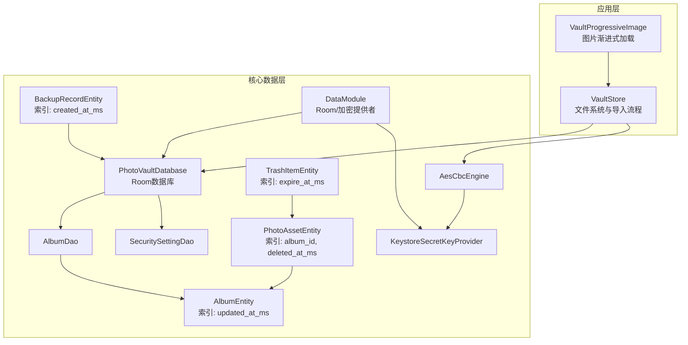
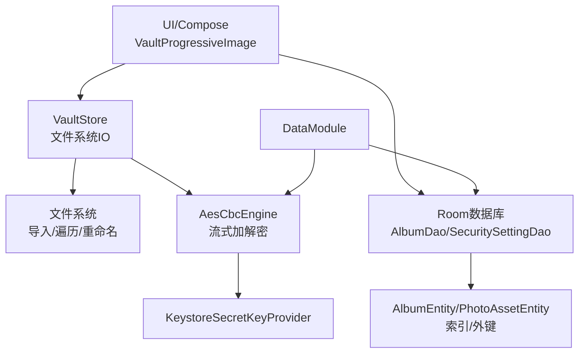
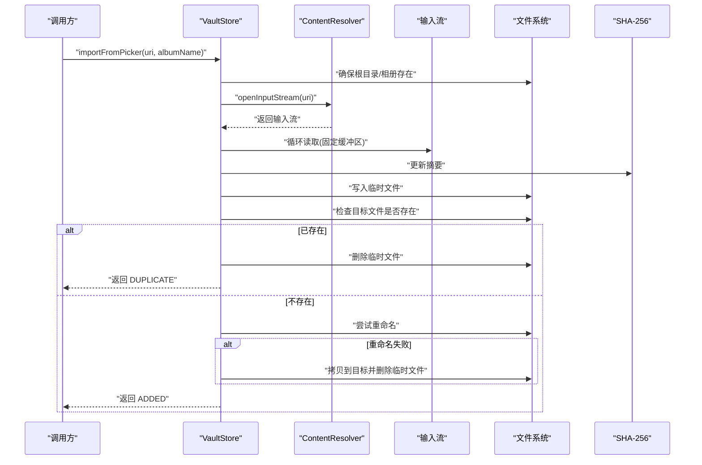
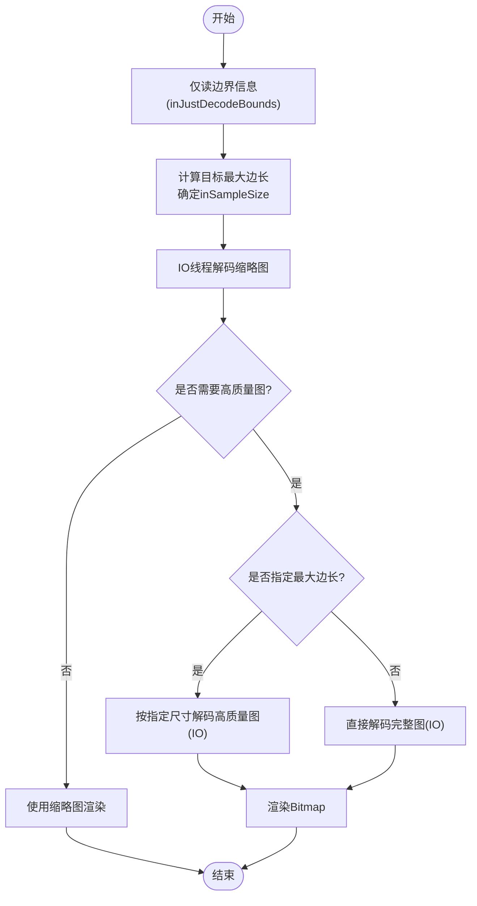
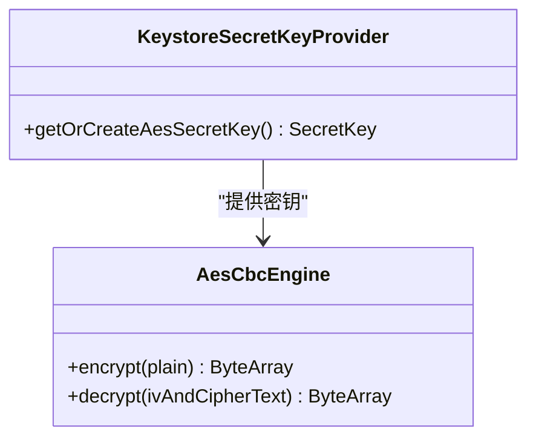
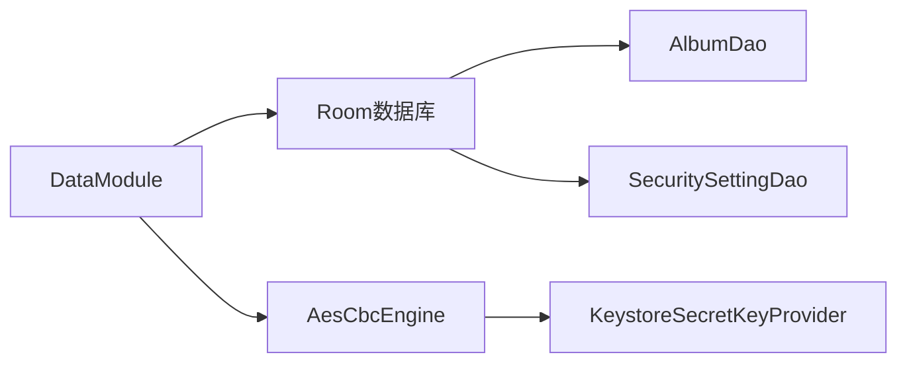

# IO优化技术

<cite>
**本文引用的文件**
- [android/app/src/main/kotlin/com/photovault/app/ui/vault/VaultStore.kt](file://android/app/src/main/kotlin/com/photovault/app/ui/vault/VaultStore.kt)
- [android/app/src/main/kotlin/com/photovault/app/ui/components/VaultProgressiveImage.kt](file://android/app/src/main/kotlin/com/photovault/app/ui/components/VaultProgressiveImage.kt)
- [android/core/data/src/main/kotlin/com/photovault/data/db/PhotoVaultDatabase.kt](file://android/core/data/src/main/kotlin/com/photovault/data/db/PhotoVaultDatabase.kt)
- [android/core/data/src/main/kotlin/com/photovault/data/db/dao/AlbumDao.kt](file://android/core/data/src/main/kotlin/com/photovault/data/db/dao/AlbumDao.kt)
- [android/core/data/src/main/kotlin/com/photovault/data/db/dao/SecuritySettingDao.kt](file://android/core/data/src/main/kotlin/com/photovault/data/db/dao/SecuritySettingDao.kt)
- [android/core/data/src/main/kotlin/com/photovault/data/db/entity/AlbumEntity.kt](file://android/core/data/src/main/kotlin/com/photovault/data/db/entity/AlbumEntity.kt)
- [android/core/data/src/main/kotlin/com/photovault/data/db/entity/PhotoAssetEntity.kt](file://android/core/data/src/main/kotlin/com/photovault/data/db/entity/PhotoAssetEntity.kt)
- [android/core/data/src/main/kotlin/com/photovault/data/db/entity/TrashItemEntity.kt](file://android/core/data/src/main/kotlin/com/photovault/data/db/entity/TrashItemEntity.kt)
- [android/core/data/src/main/kotlin/com/photovault/data/db/entity/BackupRecordEntity.kt](file://android/core/data/src/main/kotlin/com/photovault/data/db/entity/BackupRecordEntity.kt)
- [android/core/data/src/main/kotlin/com/photovault/data/di/DataModule.kt](file://android/core/data/src/main/kotlin/com/photovault/data/di/DataModule.kt)
- [android/core/data/src/main/kotlin/com/photovault/data/crypto/AesCbcEngine.kt](file://android/core/data/src/main/kotlin/com/photovault/data/crypto/AesCbcEngine.kt)
- [android/core/data/src/main/kotlin/com/photovault/data/crypto/KeystoreSecretKeyProvider.kt](file://android/core/data/src/main/kotlin/com/photovault/data/crypto/KeystoreSecretKeyProvider.kt)
- [android/core/data/src/main/kotlin/com/photovault/data/crypto/PasswordHasher.kt](file://android/core/data/src/main/kotlin/com/photovault/data/crypto/PasswordHasher.kt)
- [android/core/data/build.gradle.kts](file://android/core/data/build.gradle.kts)
- [doc/成熟三方库推荐（Android-iOS）.md](file://doc/成熟三方库推荐（Android-iOS）.md)
</cite>

## 目录
1. [简介](#简介)
2. [项目结构](#项目结构)
3. [核心组件](#核心组件)
4. [架构总览](#架构总览)
5. [详细组件分析](#详细组件分析)
6. [依赖关系分析](#依赖关系分析)
7. [性能考量与优化建议](#性能考量与优化建议)
8. [故障排查指南](#故障排查指南)
9. [结论](#结论)
10. [附录](#附录)

## 简介
本指南面向AI照片保险库项目的IO优化实践，围绕四大主题展开：文件系统操作优化（大文件读写、流式处理、缓冲区管理）、Room数据库查询优化（索引设计、批量操作、事务管理）、网络请求优化（连接复用、超时配置、重试机制）、图片加载与缓存优化（缩略图生成、内存缓存与磁盘缓存策略）、加密文件的IO优化（流式加密、分块处理、随机访问优化），并提供IO性能监控与分析方法，帮助开发者建立系统化的IO优化体系。

## 项目结构
项目采用分层与模块化组织：
- 应用层（android/app）：UI组件、业务入口（如VaultStore）、图片加载组件（VaultProgressiveImage）。
- 核心数据层（android/core/data）：Room数据库定义、DAO、实体、加密引擎与依赖注入模块。
- 文档（doc）：第三方库推荐与集成建议。



图表来源
- [android/app/src/main/kotlin/com/photovault/app/ui/vault/VaultStore.kt:1-226](file://android/app/src/main/kotlin/com/photovault/app/ui/vault/VaultStore.kt#L1-L226)
- [android/app/src/main/kotlin/com/photovault/app/ui/components/VaultProgressiveImage.kt:1-89](file://android/app/src/main/kotlin/com/photovault/app/ui/components/VaultProgressiveImage.kt#L1-L89)
- [android/core/data/src/main/kotlin/com/photovault/data/db/PhotoVaultDatabase.kt:1-36](file://android/core/data/src/main/kotlin/com/photovault/data/db/PhotoVaultDatabase.kt#L1-L36)
- [android/core/data/src/main/kotlin/com/photovault/data/db/dao/AlbumDao.kt:1-18](file://android/core/data/src/main/kotlin/com/photovault/data/db/dao/AlbumDao.kt#L1-L18)
- [android/core/data/src/main/kotlin/com/photovault/data/db/dao/SecuritySettingDao.kt:1-17](file://android/core/data/src/main/kotlin/com/photovault/data/db/dao/SecuritySettingDao.kt#L1-L17)
- [android/core/data/src/main/kotlin/com/photovault/data/db/entity/AlbumEntity.kt:1-19](file://android/core/data/src/main/kotlin/com/photovault/data/db/entity/AlbumEntity.kt#L1-L19)
- [android/core/data/src/main/kotlin/com/photovault/data/db/entity/PhotoAssetEntity.kt:1-33](file://android/core/data/src/main/kotlin/com/photovault/data/db/entity/PhotoAssetEntity.kt#L1-L33)
- [android/core/data/src/main/kotlin/com/photovault/data/db/entity/TrashItemEntity.kt:1-24](file://android/core/data/src/main/kotlin/com/photovault/data/db/entity/TrashItemEntity.kt#L1-L24)
- [android/core/data/src/main/kotlin/com/photovault/data/db/entity/BackupRecordEntity.kt:1-18](file://android/core/data/src/main/kotlin/com/photovault/data/db/entity/BackupRecordEntity.kt#L1-L18)
- [android/core/data/src/main/kotlin/com/photovault/data/di/DataModule.kt:1-40](file://android/core/data/src/main/kotlin/com/photovault/data/di/DataModule.kt#L1-L40)
- [android/core/data/src/main/kotlin/com/photovault/data/crypto/AesCbcEngine.kt:1-40](file://android/core/data/src/main/kotlin/com/photovault/data/crypto/AesCbcEngine.kt#L1-L40)
- [android/core/data/src/main/kotlin/com/photovault/data/crypto/KeystoreSecretKeyProvider.kt:1-42](file://android/core/data/src/main/kotlin/com/photovault/data/crypto/KeystoreSecretKeyProvider.kt#L1-L42)

章节来源
- [android/core/data/build.gradle.kts:1-47](file://android/core/data/build.gradle.kts#L1-L47)

## 核心组件
- 文件系统与导入（VaultStore）：负责保险库根目录初始化、相册目录管理、导入流程（流式复制+SHA-256去重）、遍历统计与迁移逻辑。
- 图片加载（VaultProgressiveImage）：支持渐进式缩略图解码与高质量图片按需加载，使用IO调度器避免阻塞UI线程。
- Room数据库（PhotoVaultDatabase及DAO）：提供相册列表观察、安全设置读写、实体索引与外键约束。
- 加密（AesCbcEngine、KeystoreSecretKeyProvider）：基于Android Keystore的AES-256-CBC流式加解密，前置IV兼容既有协议。
- 依赖注入（DataModule）：集中提供数据库与加密组件单例。

章节来源
- [android/app/src/main/kotlin/com/photovault/app/ui/vault/VaultStore.kt:1-226](file://android/app/src/main/kotlin/com/photovault/app/ui/vault/VaultStore.kt#L1-L226)
- [android/app/src/main/kotlin/com/photovault/app/ui/components/VaultProgressiveImage.kt:1-89](file://android/app/src/main/kotlin/com/photovault/app/ui/components/VaultProgressiveImage.kt#L1-L89)
- [android/core/data/src/main/kotlin/com/photovault/data/db/PhotoVaultDatabase.kt:1-36](file://android/core/data/src/main/kotlin/com/photovault/data/db/PhotoVaultDatabase.kt#L1-L36)
- [android/core/data/src/main/kotlin/com/photovault/data/db/dao/AlbumDao.kt:1-18](file://android/core/data/src/main/kotlin/com/photovault/data/db/dao/AlbumDao.kt#L1-L18)
- [android/core/data/src/main/kotlin/com/photovault/data/db/dao/SecuritySettingDao.kt:1-17](file://android/core/data/src/main/kotlin/com/photovault/data/db/dao/SecuritySettingDao.kt#L1-L17)
- [android/core/data/src/main/kotlin/com/photovault/data/crypto/AesCbcEngine.kt:1-40](file://android/core/data/src/main/kotlin/com/photovault/data/crypto/AesCbcEngine.kt#L1-L40)
- [android/core/data/src/main/kotlin/com/photovault/data/crypto/KeystoreSecretKeyProvider.kt:1-42](file://android/core/data/src/main/kotlin/com/photovault/data/crypto/KeystoreSecretKeyProvider.kt#L1-L42)
- [android/core/data/src/main/kotlin/com/photovault/data/di/DataModule.kt:1-40](file://android/core/data/src/main/kotlin/com/photovault/data/di/DataModule.kt#L1-L40)

## 架构总览
下图展示了应用层与数据层的IO交互路径，以及加密与数据库的关键节点。



图表来源
- [android/app/src/main/kotlin/com/photovault/app/ui/components/VaultProgressiveImage.kt:1-89](file://android/app/src/main/kotlin/com/photovault/app/ui/components/VaultProgressiveImage.kt#L1-L89)
- [android/app/src/main/kotlin/com/photovault/app/ui/vault/VaultStore.kt:1-226](file://android/app/src/main/kotlin/com/photovault/app/ui/vault/VaultStore.kt#L1-L226)
- [android/core/data/src/main/kotlin/com/photovault/data/db/dao/AlbumDao.kt:1-18](file://android/core/data/src/main/kotlin/com/photovault/data/db/dao/AlbumDao.kt#L1-L18)
- [android/core/data/src/main/kotlin/com/photovault/data/db/dao/SecuritySettingDao.kt:1-17](file://android/core/data/src/main/kotlin/com/photovault/data/db/dao/SecuritySettingDao.kt#L1-L17)
- [android/core/data/src/main/kotlin/com/photovault/data/crypto/AesCbcEngine.kt:1-40](file://android/core/data/src/main/kotlin/com/photovault/data/crypto/AesCbcEngine.kt#L1-L40)
- [android/core/data/src/main/kotlin/com/photovault/data/crypto/KeystoreSecretKeyProvider.kt:1-42](file://android/core/data/src/main/kotlin/com/photovault/data/crypto/KeystoreSecretKeyProvider.kt#L1-L42)
- [android/core/data/src/main/kotlin/com/photovault/data/di/DataModule.kt:1-40](file://android/core/data/src/main/kotlin/com/photovault/data/di/DataModule.kt#L1-L40)

## 详细组件分析

### 文件系统与导入流程（VaultStore）
- 初始化与目录管理：确保根目录与默认相册存在，必要时迁移旧版目录。
- 导入流程：通过ContentResolver打开输入流，使用固定大小缓冲区进行流式复制，同时计算SHA-256作为去重依据；若目标文件已存在则删除临时文件，否则尝试重命名，失败则回退到拷贝后删除临时文件。
- 列表与遍历：支持按相册列出照片、全局遍历、最近照片筛选、总数统计；使用拓扑遍历计数文件数量。
- 并发与IO：所有文件系统操作运行在IO调度器，避免阻塞主线程。



图表来源
- [android/app/src/main/kotlin/com/photovault/app/ui/vault/VaultStore.kt:120-154](file://android/app/src/main/kotlin/com/photovault/app/ui/vault/VaultStore.kt#L120-L154)

章节来源
- [android/app/src/main/kotlin/com/photovault/app/ui/vault/VaultStore.kt:60-154](file://android/app/src/main/kotlin/com/photovault/app/ui/vault/VaultStore.kt#L60-L154)

### 图片加载与缓存（VaultProgressiveImage）
- 渐进式加载：先解码低分辨率缩略图（根据目标最大边长计算inSampleSize），再按需加载高质量图片；解码在IO调度器执行。
- 内存缓存：通过remember状态持有缩略图与高质量图，避免重复解码。
- UI过渡：使用背景渐变提升视觉体验。



图表来源
- [android/app/src/main/kotlin/com/photovault/app/ui/components/VaultProgressiveImage.kt:68-89](file://android/app/src/main/kotlin/com/photovault/app/ui/components/VaultProgressiveImage.kt#L68-L89)

章节来源
- [android/app/src/main/kotlin/com/photovault/app/ui/components/VaultProgressiveImage.kt:1-89](file://android/app/src/main/kotlin/com/photovault/app/ui/components/VaultProgressiveImage.kt#L1-L89)

### Room数据库与查询优化
- 数据库与实体：定义了相册、照片资产、回收站、备份记录、安全设置等实体，并在关键列上建立索引以加速查询。
- 查询策略：
  - 使用索引列排序与过滤：如按updated_at_ms降序查询相册列表。
  - 外键级联：照片资产删除时自动清理关联项。
  - 批量与事务：建议将多次插入/更新放入Room事务中，减少写放大与锁竞争。
  - 流式观察：利用Flow观察相册列表变化，避免频繁全量查询。
- 实体索引与列设计：
  - AlbumEntity：索引updated_at_ms，适合“最近修改”排序场景。
  - PhotoAssetEntity：索引album_id与deleted_at_ms，便于按相册检索与软删除过滤。
  - TrashItemEntity：索引expire_at_ms，便于定时清理过期条目。
  - BackupRecordEntity：索引created_at_ms，便于备份时间线查询。

```mermaid
erDiagram
ALBUM_ENTITY {
long id PK
string name
long cover_photo_id
long created_at_ms
long updated_at_ms IX(updated_at_ms)
}
PHOTO_ASSET_ENTITY {
long id PK
long album_id IX(album_id)
string encrypted_path
string thumb_path
string metadata_json
long created_at_ms
long deleted_at_ms IX(deleted_at_ms)
}
TRASH_ITEM_ENTITY {
long photo_id PK
long expire_at_ms IX(expire_at_ms)
}
BACKUP_RECORD_ENTITY {
long id PK
string file_path
long created_at_ms IX(created_at_ms)
int version
string checksum_hex
}
ALBUM_ENTITY ||--o{ PHOTO_ASSET_ENTITY : "包含"
PHOTO_ASSET_ENTITY ||--o{ TRASH_ITEM_ENTITY : "可能被回收"
```

图表来源
- [android/core/data/src/main/kotlin/com/photovault/data/db/entity/AlbumEntity.kt:1-19](file://android/core/data/src/main/kotlin/com/photovault/data/db/entity/AlbumEntity.kt#L1-L19)
- [android/core/data/src/main/kotlin/com/photovault/data/db/entity/PhotoAssetEntity.kt:1-33](file://android/core/data/src/main/kotlin/com/photovault/data/db/entity/PhotoAssetEntity.kt#L1-L33)
- [android/core/data/src/main/kotlin/com/photovault/data/db/entity/TrashItemEntity.kt:1-24](file://android/core/data/src/main/kotlin/com/photovault/data/db/entity/TrashItemEntity.kt#L1-L24)
- [android/core/data/src/main/kotlin/com/photovault/data/db/entity/BackupRecordEntity.kt:1-18](file://android/core/data/src/main/kotlin/com/photovault/data/db/entity/BackupRecordEntity.kt#L1-L18)

章节来源
- [android/core/data/src/main/kotlin/com/photovault/data/db/PhotoVaultDatabase.kt:1-36](file://android/core/data/src/main/kotlin/com/photovault/data/db/PhotoVaultDatabase.kt#L1-L36)
- [android/core/data/src/main/kotlin/com/photovault/data/db/dao/AlbumDao.kt:1-18](file://android/core/data/src/main/kotlin/com/photovault/data/db/dao/AlbumDao.kt#L1-L18)
- [android/core/data/src/main/kotlin/com/photovault/data/db/dao/SecuritySettingDao.kt:1-17](file://android/core/data/src/main/kotlin/com/photovault/data/db/dao/SecuritySettingDao.kt#L1-L17)
- [android/core/data/src/main/kotlin/com/photovault/data/db/entity/AlbumEntity.kt:1-19](file://android/core/data/src/main/kotlin/com/photovault/data/db/entity/AlbumEntity.kt#L1-L19)
- [android/core/data/src/main/kotlin/com/photovault/data/db/entity/PhotoAssetEntity.kt:1-33](file://android/core/data/src/main/kotlin/com/photovault/data/db/entity/PhotoAssetEntity.kt#L1-L33)
- [android/core/data/src/main/kotlin/com/photovault/data/db/entity/TrashItemEntity.kt:1-24](file://android/core/data/src/main/kotlin/com/photovault/data/db/entity/TrashItemEntity.kt#L1-L24)
- [android/core/data/src/main/kotlin/com/photovault/data/db/entity/BackupRecordEntity.kt:1-18](file://android/core/data/src/main/kotlin/com/photovault/data/db/entity/BackupRecordEntity.kt#L1-L18)

### 加密文件IO（AesCbcEngine + Keystore）
- 加密模式：AES-256-CBC + PKCS5Padding（与PKCS7等价），前置IV（16字节）。
- 密钥管理：通过Android Keystore生成/读取AES密钥，密钥材料不可导出，满足安全要求。
- 流式处理：加密/解密以块方式处理，适合大文件与流式数据源。
- 随机访问：由于CBC模式需要IV前置且块对块依赖，不支持完全随机访问；建议在文件层面增加索引或元数据以支持定位。



图表来源
- [android/core/data/src/main/kotlin/com/photovault/data/crypto/KeystoreSecretKeyProvider.kt:1-42](file://android/core/data/src/main/kotlin/com/photovault/data/crypto/KeystoreSecretKeyProvider.kt#L1-L42)
- [android/core/data/src/main/kotlin/com/photovault/data/crypto/AesCbcEngine.kt:1-40](file://android/core/data/src/main/kotlin/com/photovault/data/crypto/AesCbcEngine.kt#L1-L40)

章节来源
- [android/core/data/src/main/kotlin/com/photovault/data/crypto/AesCbcEngine.kt:1-40](file://android/core/data/src/main/kotlin/com/photovault/data/crypto/AesCbcEngine.kt#L1-L40)
- [android/core/data/src/main/kotlin/com/photovault/data/crypto/KeystoreSecretKeyProvider.kt:1-42](file://android/core/data/src/main/kotlin/com/photovault/data/crypto/KeystoreSecretKeyProvider.kt#L1-L42)

## 依赖关系分析
- 依赖注入：DataModule统一提供Room数据库与加密组件单例，降低耦合与重复创建。
- Room依赖：androidx.room.runtime、ksp编译器、androidx.room.ktx；测试依赖robolectric与truth。
- 第三方库建议：图片加载与缓存可参考官方/成熟库（见文档）。



图表来源
- [android/core/data/src/main/kotlin/com/photovault/data/di/DataModule.kt:1-40](file://android/core/data/src/main/kotlin/com/photovault/data/di/DataModule.kt#L1-L40)

章节来源
- [android/core/data/build.gradle.kts:31-47](file://android/core/data/build.gradle.kts#L31-L47)
- [doc/成熟三方库推荐（Android-iOS）.md:9-26](file://doc/成熟三方库推荐（Android-iOS）.md#L9-L26)

## 性能考量与优化建议

### 文件系统操作优化
- 大文件读写与流式处理
  - 使用固定大小缓冲区（如DEFAULT_BUFFER_SIZE）进行流式复制，避免一次性读入内存。
  - 对导入流程采用“临时文件+去重校验”的两阶段提交策略，减少重复IO与磁盘碎片。
  - 遍历与统计：对大量文件的遍历建议分批处理或后台任务，避免阻塞UI。
- 缓冲区管理
  - 缓冲区大小应结合设备内存与文件大小动态选择，避免过大导致内存压力，过小导致系统调用频繁。
  - 对热点路径（如导入）可考虑使用ByteBuffer池化或共享缓冲区以降低GC压力。
- 随机访问优化
  - 当前CBC模式不适合随机访问；如需随机访问能力，可在文件格式层面引入索引块或分段元数据。

章节来源
- [android/app/src/main/kotlin/com/photovault/app/ui/vault/VaultStore.kt:120-154](file://android/app/src/main/kotlin/com/photovault/app/ui/vault/VaultStore.kt#L120-L154)

### Room数据库查询优化
- 索引设计
  - 已在关键列建立索引，查询时尽量命中索引列，避免全表扫描。
- 批量操作与事务
  - 将多次插入/更新放入Room事务中，减少写放大与锁竞争。
- 观察与增量更新
  - 使用Flow观察数据变化，避免频繁全量查询；对UI层采用响应式刷新。
- 外键与级联
  - 合理使用外键与CASCADE删除，保证数据一致性的同时减少冗余清理逻辑。

章节来源
- [android/core/data/src/main/kotlin/com/photovault/data/db/entity/AlbumEntity.kt:10-10](file://android/core/data/src/main/kotlin/com/photovault/data/db/entity/AlbumEntity.kt#L10-L10)
- [android/core/data/src/main/kotlin/com/photovault/data/db/entity/PhotoAssetEntity.kt:19-22](file://android/core/data/src/main/kotlin/com/photovault/data/db/entity/PhotoAssetEntity.kt#L19-L22)
- [android/core/data/src/main/kotlin/com/photovault/data/db/entity/TrashItemEntity.kt:19-19](file://android/core/data/src/main/kotlin/com/photovault/data/db/entity/TrashItemEntity.kt#L19-L19)
- [android/core/data/src/main/kotlin/com/photovault/data/db/entity/BackupRecordEntity.kt:10-10](file://android/core/data/src/main/kotlin/com/photovault/data/db/entity/BackupRecordEntity.kt#L10-L10)

### 图片加载与缓存优化
- 缩略图生成
  - 使用inJustDecodeBounds先读边界，再按目标最大边长计算inSampleSize，避免OOM。
  - 渐进式加载：先显示低分辨率缩略图，再异步加载高质量图。
- 内存缓存
  - 利用remember状态缓存解码结果，避免重复解码；对高频访问的缩略图可额外做LRU缓存。
- 磁盘缓存
  - 建议将高质量图与缩略图分别缓存至独立目录，设置TTL与容量上限，定期清理过期文件。
- 第三方库
  - 可参考官方/成熟库（如Coil/Glide）实现更完善的内存/磁盘缓存与解码管线。

章节来源
- [android/app/src/main/kotlin/com/photovault/app/ui/components/VaultProgressiveImage.kt:68-89](file://android/app/src/main/kotlin/com/photovault/app/ui/components/VaultProgressiveImage.kt#L68-L89)
- [doc/成熟三方库推荐（Android-iOS）.md:9-26](file://doc/成熟三方库推荐（Android-iOS）.md#L9-L26)

### 加密文件IO优化
- 流式加密
  - 采用AES-256-CBC流式处理，前置IV兼容既有协议；对大文件建议分块处理并记录块索引以便定位。
- 分块处理
  - 将文件切分为固定大小的块，逐块加密并写入，便于断点续传与随机访问优化。
- 随机访问优化
  - CBC模式天然不支持随机访问；可在文件格式中加入块索引与元数据，实现按块定位与解密。
- 密钥与性能
  - Keystore密钥生成与使用有开销，建议在会话内复用密钥实例，避免重复初始化。

章节来源
- [android/core/data/src/main/kotlin/com/photovault/data/crypto/AesCbcEngine.kt:17-32](file://android/core/data/src/main/kotlin/com/photovault/data/crypto/AesCbcEngine.kt#L17-L32)
- [android/core/data/src/main/kotlin/com/photovault/data/crypto/KeystoreSecretKeyProvider.kt:18-35](file://android/core/data/src/main/kotlin/com/photovault/data/crypto/KeystoreSecretKeyProvider.kt#L18-L35)

### 网络请求优化（概念性建议）
- 连接复用：使用连接池复用TCP连接，减少握手开销。
- 超时配置：合理设置连接超时、读写超时与总超时，避免长时间阻塞。
- 重试机制：对瞬时错误进行指数退避重试，避免雪崩效应；对幂等请求可放宽重试策略。
- 压缩与分片：对大响应启用压缩，必要时分片传输以提升吞吐。
- 缓存策略：结合ETag/Last-Modified实现条件请求，减少无效下载。

[本节为通用实践建议，不直接分析具体文件]

## 故障排查指南
- 导入失败
  - 检查ContentResolver是否成功打开输入流；确认临时文件写入权限与磁盘空间。
  - 若重命名失败，回退到拷贝后删除临时文件，确保原子性。
- 解码异常
  - inJustDecodeBounds失败或宽高为非正值时，应返回空结果并记录日志。
  - 高质量解码失败时，回退到缩略图或提示用户重试。
- 数据库查询慢
  - 确认查询是否命中索引；避免在未索引列上进行排序或过滤。
  - 对大批量写入使用事务包裹，减少锁竞争。
- 加密异常
  - 校验IV长度与格式；确保密钥来自Keystore且未被篡改。
  - 对异常输入进行严格校验，避免越界或空指针。

章节来源
- [android/app/src/main/kotlin/com/photovault/app/ui/vault/VaultStore.kt:120-154](file://android/app/src/main/kotlin/com/photovault/app/ui/vault/VaultStore.kt#L120-L154)
- [android/app/src/main/kotlin/com/photovault/app/ui/components/VaultProgressiveImage.kt:68-89](file://android/app/src/main/kotlin/com/photovault/app/ui/components/VaultProgressiveImage.kt#L68-L89)
- [android/core/data/src/main/kotlin/com/photovault/data/crypto/AesCbcEngine.kt:25-32](file://android/core/data/src/main/kotlin/com/photovault/data/crypto/AesCbcEngine.kt#L25-L32)

## 结论
本指南从文件系统、数据库、图片加载、加密与网络五个维度总结了AI照片保险库的IO优化要点。通过流式处理、索引设计、渐进式加载、事务批量写入与合理的缓存策略，可以在保证安全性与正确性的前提下显著提升IO性能与用户体验。建议在后续迭代中持续引入第三方成熟库与监控手段，进一步完善IO优化体系。

## 附录
- 第三方库推荐（Android/iOS）：可参考文档中的成熟库清单，用于图片加载、缓存与安全存储等场景。

章节来源
- [doc/成熟三方库推荐（Android-iOS）.md:9-26](file://doc/成熟三方库推荐（Android-iOS）.md#L9-L26)