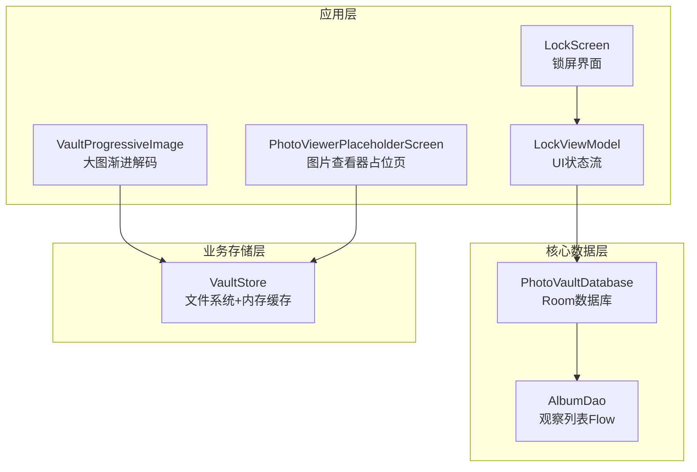
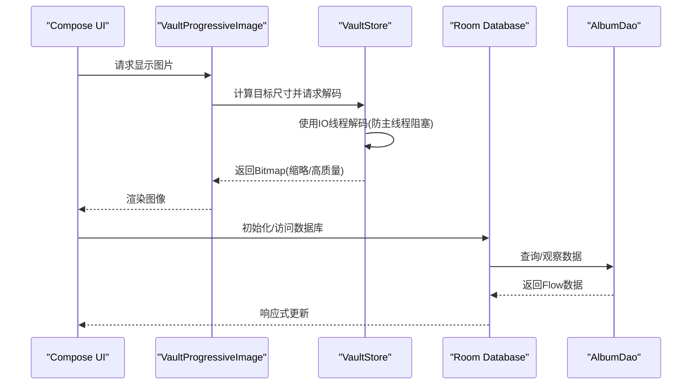
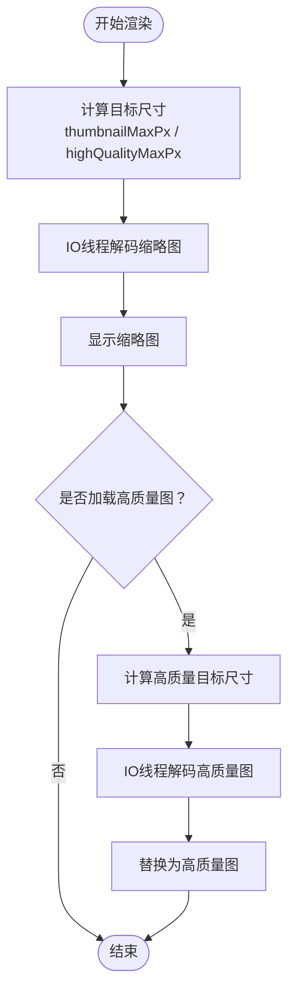
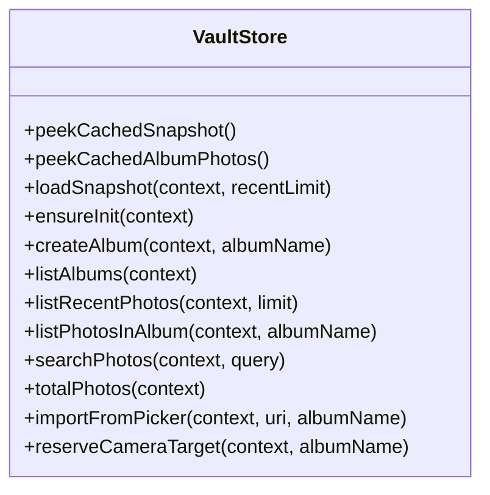
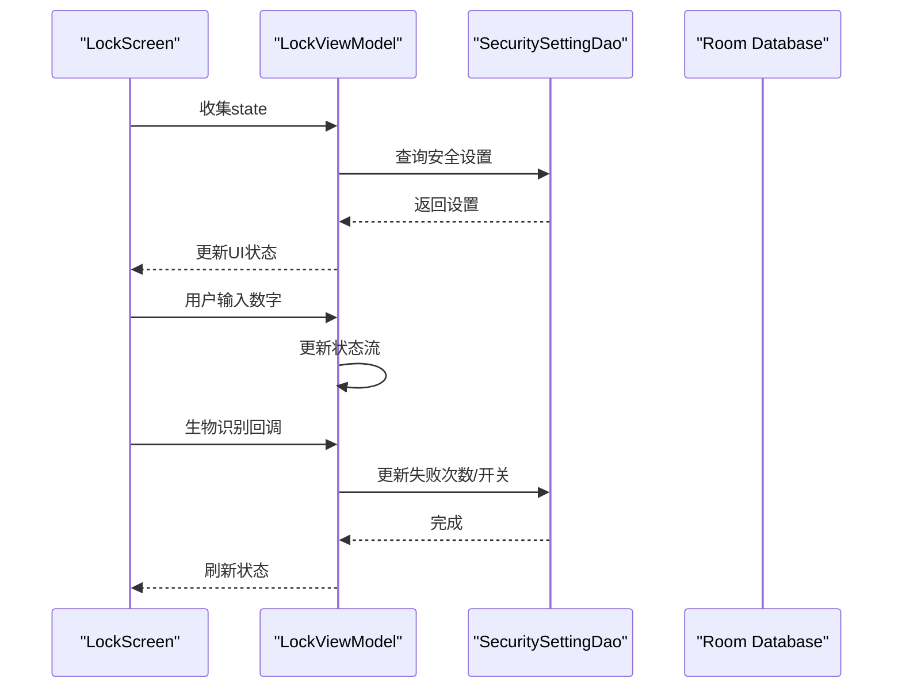
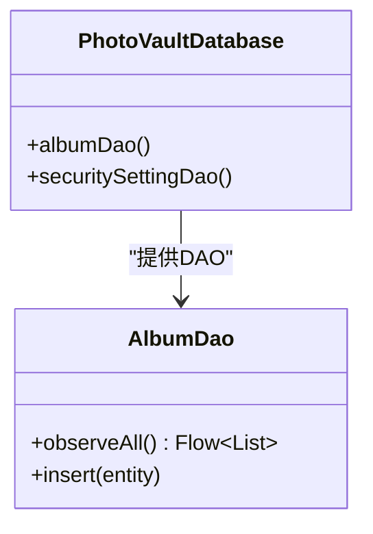
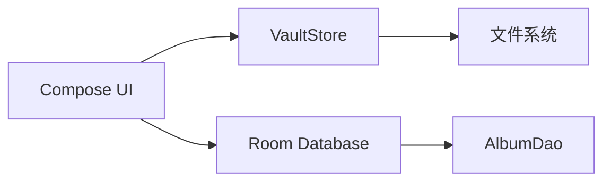

# 内存管理优化

<cite>
**本文引用的文件**
- [android/app/src/main/kotlin/com/photovault/app/ui/components/VaultProgressiveImage.kt](file://android/app/src/main/kotlin/com/photovault/app/ui/components/VaultProgressiveImage.kt)
- [android/app/src/main/kotlin/com/photovault/app/ui/PhotoViewerPlaceholderScreen.kt](file://android/app/src/main/kotlin/com/photovault/app/ui/PhotoViewerPlaceholderScreen.kt)
- [android/app/src/main/kotlin/com/photovault/app/ui/vault/VaultStore.kt](file://android/app/src/main/kotlin/com/photovault/app/ui/vault/VaultStore.kt)
- [android/app/src/main/kotlin/com/photovault/app/ui/lock/LockViewModel.kt](file://android/app/src/main/kotlin/com/photovault/app/ui/lock/LockViewModel.kt)
- [android/app/src/main/kotlin/com/photovault/app/ui/lock/LockScreen.kt](file://android/app/src/main/kotlin/com/photovault/app/ui/lock/LockScreen.kt)
- [android/core/data/src/main/kotlin/com/photovault/data/db/PhotoVaultDatabase.kt](file://android/core/data/src/main/kotlin/com/photovault/data/db/PhotoVaultDatabase.kt)
- [android/core/data/src/main/kotlin/com/photovault/data/db/dao/AlbumDao.kt](file://android/core/data/src/main/kotlin/com/photovault/data/db/dao/AlbumDao.kt)
</cite>

## 目录
1. [简介](#简介)
2. [项目结构](#项目结构)
3. [核心组件](#核心组件)
4. [架构总览](#架构总览)
5. [详细组件分析](#详细组件分析)
6. [依赖分析](#依赖分析)
7. [性能考量](#性能考量)
8. [故障排查指南](#故障排查指南)
9. [结论](#结论)
10. [附录](#附录)

## 简介
本指南聚焦于AI照片保险库项目的内存管理优化，围绕以下主题展开：
- Android 应用内存策略：对象生命周期、内存泄漏预防、垃圾回收优化
- 大图解码优化：按目标尺寸解码、内存池复用、Bitmap 内存管理
- 协程内存使用优化：作用域管理、泄漏防护、资源清理
- Room 数据库内存优化：查询结果分页、懒加载、连接池管理
- 内存监控工具：Android Profiler、Heap Viewer 的使用要点
- 实战案例与最佳实践：结合仓库现有代码路径给出可操作建议

## 项目结构
本项目采用多模块结构，其中与内存管理密切相关的模块与文件如下：
- 应用层 UI 组件与屏幕：负责图片展示、用户交互、状态管理
- 核心数据层：Room 数据库定义与 DAO 接口，提供数据访问能力
- 业务存储层：VaultStore 负责私密相册文件系统的读写与缓存

图表来源
- [android/app/src/main/kotlin/com/photovault/app/ui/components/VaultProgressiveImage.kt:1-90](file://android/app/src/main/kotlin/com/photovault/app/ui/components/VaultProgressiveImage.kt#L1-L90)
- [android/app/src/main/kotlin/com/photovault/app/ui/PhotoViewerPlaceholderScreen.kt:1-50](file://android/app/src/main/kotlin/com/photovault/app/ui/PhotoViewerPlaceholderScreen.kt#L1-L50)
- [android/app/src/main/kotlin/com/photovault/app/ui/vault/VaultStore.kt:1-226](file://android/app/src/main/kotlin/com/photovault/app/ui/vault/VaultStore.kt#L1-L226)
- [android/app/src/main/kotlin/com/photovault/app/ui/lock/LockViewModel.kt:1-222](file://android/app/src/main/kotlin/com/photovault/app/ui/lock/LockViewModel.kt#L1-L222)
- [android/core/data/src/main/kotlin/com/photovault/data/db/PhotoVaultDatabase.kt:1-36](file://android/core/data/src/main/kotlin/com/photovault/data/db/PhotoVaultDatabase.kt#L1-L36)
- [android/core/data/src/main/kotlin/com/photovault/data/db/dao/AlbumDao.kt:1-18](file://android/core/data/src/main/kotlin/com/photovault/data/db/dao/AlbumDao.kt#L1-L18)

章节来源
- [android/app/src/main/kotlin/com/photovault/app/ui/components/VaultProgressiveImage.kt:1-90](file://android/app/src/main/kotlin/com/photovault/app/ui/components/VaultProgressiveImage.kt#L1-L90)
- [android/app/src/main/kotlin/com/photovault/app/ui/PhotoViewerPlaceholderScreen.kt:1-50](file://android/app/src/main/kotlin/com/photovault/app/ui/PhotoViewerPlaceholderScreen.kt#L1-L50)
- [android/app/src/main/kotlin/com/photovault/app/ui/vault/VaultStore.kt:1-226](file://android/app/src/main/kotlin/com/photovault/app/ui/vault/VaultStore.kt#L1-L226)
- [android/app/src/main/kotlin/com/photovault/app/ui/lock/LockViewModel.kt:1-222](file://android/app/src/main/kotlin/com/photovault/app/ui/lock/LockViewModel.kt#L1-L222)
- [android/core/data/src/main/kotlin/com/photovault/data/db/PhotoVaultDatabase.kt:1-36](file://android/core/data/src/main/kotlin/com/photovault/data/db/PhotoVaultDatabase.kt#L1-L36)
- [android/core/data/src/main/kotlin/com/photovault/data/db/dao/AlbumDao.kt:1-18](file://android/core/data/src/main/kotlin/com/photovault/data/db/dao/AlbumDao.kt#L1-L18)

## 核心组件
- 渐进式图片组件：在 Compose 中实现“缩略图先行、高质量图随后”的解码流程，避免一次性加载大图导致 OOM
- 图片查看器占位页：根据屏幕尺寸动态选择高质量图的最大边长，减少不必要的内存占用
- 私密相册存储：基于文件系统，配合内存缓存（快照与相册项列表），降低重复 IO 与对象创建
- 锁屏视图模型：使用 ViewModel 的作用域管理 UI 状态流，避免泄漏；与数据库交互在 IO 线程执行
- Room 数据库：提供实体与 DAO，支持 Flow 观察，便于懒加载与响应式更新

章节来源
- [android/app/src/main/kotlin/com/photovault/app/ui/components/VaultProgressiveImage.kt:23-66](file://android/app/src/main/kotlin/com/photovault/app/ui/components/VaultProgressiveImage.kt#L23-L66)
- [android/app/src/main/kotlin/com/photovault/app/ui/PhotoViewerPlaceholderScreen.kt:22-48](file://android/app/src/main/kotlin/com/photovault/app/ui/PhotoViewerPlaceholderScreen.kt#L22-L48)
- [android/app/src/main/kotlin/com/photovault/app/ui/vault/VaultStore.kt:39-107](file://android/app/src/main/kotlin/com/photovault/app/ui/vault/VaultStore.kt#L39-L107)
- [android/app/src/main/kotlin/com/photovault/app/ui/lock/LockViewModel.kt:18-42](file://android/app/src/main/kotlin/com/photovault/app/ui/lock/LockViewModel.kt#L18-L42)
- [android/core/data/src/main/kotlin/com/photovault/data/db/PhotoVaultDatabase.kt:14-35](file://android/core/data/src/main/kotlin/com/photovault/data/db/PhotoVaultDatabase.kt#L14-L35)
- [android/core/data/src/main/kotlin/com/photovault/data/db/dao/AlbumDao.kt:10-17](file://android/core/data/src/main/kotlin/com/photovault/data/db/dao/AlbumDao.kt#L10-L17)

## 架构总览
下图展示了从 UI 到数据层的关键调用链路及内存关注点。

图表来源
- [android/app/src/main/kotlin/com/photovault/app/ui/components/VaultProgressiveImage.kt:36-47](file://android/app/src/main/kotlin/com/photovault/app/ui/components/VaultProgressiveImage.kt#L36-L47)
- [android/app/src/main/kotlin/com/photovault/app/ui/vault/VaultStore.kt:47-58](file://android/app/src/main/kotlin/com/photovault/app/ui/vault/VaultStore.kt#L47-L58)
- [android/core/data/src/main/kotlin/com/photovault/data/db/PhotoVaultDatabase.kt:26-35](file://android/core/data/src/main/kotlin/com/photovault/data/db/PhotoVaultDatabase.kt#L26-L35)
- [android/core/data/src/main/kotlin/com/photovault/data/db/dao/AlbumDao.kt:15-16](file://android/core/data/src/main/kotlin/com/photovault/data/db/dao/AlbumDao.kt#L15-L16)

## 详细组件分析

### 渐进式图片组件（大图解码优化）
该组件通过“先小后大”的策略降低峰值内存占用，并在 Compose 中利用状态与协程进行解码调度。

- 关键策略
  - 缩略图优先：首次解码使用较小的目标边长，快速渲染占位
  - 高质量图延迟：在满足条件时再解码高质量图，避免同时持有两张大图
  - 按目标尺寸解码：根据屏幕最大边长计算采样率，避免超分辨率解码
  - IO 线程解码：所有解码在 IO 线程执行，防止 UI 卡顿与 ANR

- 内存池与 Bitmap 管理
  - 当前实现未显式使用内存池，建议在高频场景引入 LruCache 或自定义池化策略，减少频繁分配
  - 对于相同路径的图片，可在 UI 层增加记忆化缓存，避免重复解码

- 生命周期与泄漏防护
  - 使用 remember 保存解码结果，确保在重组期间保持引用
  - 在 LaunchedEffect 的依赖变化时触发解码，避免无谓重建
  - 若组件被销毁，Compose 会自动释放状态引用，但需确保外部持有者及时取消协程

- 复杂度与性能
  - 解码复杂度近似 O(W×H)，采样率降低后内存占用呈平方级下降
  - 首帧渲染延迟低，用户体验更佳

图表来源
- [android/app/src/main/kotlin/com/photovault/app/ui/components/VaultProgressiveImage.kt:24-66](file://android/app/src/main/kotlin/com/photovault/app/ui/components/VaultProgressiveImage.kt#L24-L66)
- [android/app/src/main/kotlin/com/photovault/app/ui/components/VaultProgressiveImage.kt:68-89](file://android/app/src/main/kotlin/com/photovault/app/ui/components/VaultProgressiveImage.kt#L68-L89)

章节来源
- [android/app/src/main/kotlin/com/photovault/app/ui/components/VaultProgressiveImage.kt:23-66](file://android/app/src/main/kotlin/com/photovault/app/ui/components/VaultProgressiveImage.kt#L23-L66)
- [android/app/src/main/kotlin/com/photovault/app/ui/components/VaultProgressiveImage.kt:68-89](file://android/app/src/main/kotlin/com/photovault/app/ui/components/VaultProgressiveImage.kt#L68-L89)

### 图片查看器占位页（按需解码与尺寸控制）
该页面根据设备屏幕尺寸动态确定高质量图的最大边长，避免在小屏上加载过大图片。

- 关键点
  - 使用 LocalConfiguration 与 LocalDensity 获取屏幕像素上限
  - 将该上限传递给渐进式图片组件，作为高质量解码的目标尺寸
  - 通过 contentScale 控制显示比例，进一步减少无效像素

- 内存影响
  - 动态目标尺寸有效限制了 Bitmap 的像素数量，降低内存峰值
  - 与渐进式解码配合，可显著改善滚动列表中的内存表现

章节来源
- [android/app/src/main/kotlin/com/photovault/app/ui/PhotoViewerPlaceholderScreen.kt:22-48](file://android/app/src/main/kotlin/com/photovault/app/ui/PhotoViewerPlaceholderScreen.kt#L22-L48)

### 私密相册存储（内存缓存与文件系统）
VaultStore 提供内存缓存与文件系统读写，是内存优化的重要环节。

- 缓存策略
  - 全局快照缓存：避免重复构建相册与最近照片列表
  - 相册项缓存：按相册名缓存照片列表，减少重复 IO
  - 受控失效：当目录结构变化时，及时清空或更新缓存

- IO 与内存
  - 所有磁盘操作在 IO 线程执行，避免阻塞主线程
  - 列表构建与排序在内存中完成，注意限制最近照片数量与相册数量

- 泄漏与作用域
  - 使用 withContext(Dispatchers.IO) 明确协程作用域
  - 避免在存储对象中持有 Activity/Fragment 上下文

图表来源
- [android/app/src/main/kotlin/com/photovault/app/ui/vault/VaultStore.kt:39-224](file://android/app/src/main/kotlin/com/photovault/app/ui/vault/VaultStore.kt#L39-L224)

章节来源
- [android/app/src/main/kotlin/com/photovault/app/ui/vault/VaultStore.kt:39-107](file://android/app/src/main/kotlin/com/photovault/app/ui/vault/VaultStore.kt#L39-L107)
- [android/app/src/main/kotlin/com/photovault/app/ui/vault/VaultStore.kt:166-184](file://android/app/src/main/kotlin/com/photovault/app/ui/vault/VaultStore.kt#L166-L184)

### 锁屏视图模型（协程作用域与状态管理）
LockViewModel 使用 ViewModel 的作用域管理 UI 状态流，避免泄漏并保证生命周期安全。

- 作用域管理
  - 使用 viewModelScope 启动协程，随 ViewModel 销毁而取消
  - 数据库操作在 IO 线程执行，避免阻塞 UI

- 状态流与内存
  - 使用 StateFlow/MutableStateFlow 表达 UI 状态，避免直接持有上下文
  - 避免在状态中存放大型对象或引用到 Activity/Fragment

- 泄漏防护
  - 不在 ViewModel 中持有 View 或 Context 引用
  - 使用 Hilt 注入数据库 DAO，避免手动持有实例

图表来源
- [android/app/src/main/kotlin/com/photovault/app/ui/lock/LockViewModel.kt:18-42](file://android/app/src/main/kotlin/com/photovault/app/ui/lock/LockViewModel.kt#L18-L42)
- [android/app/src/main/kotlin/com/photovault/app/ui/lock/LockViewModel.kt:153-166](file://android/app/src/main/kotlin/com/photovault/app/ui/lock/LockViewModel.kt#L153-L166)
- [android/app/src/main/kotlin/com/photovault/app/ui/lock/LockViewModel.kt:168-184](file://android/app/src/main/kotlin/com/photovault/app/ui/lock/LockViewModel.kt#L168-L184)
- [android/app/src/main/kotlin/com/photovault/app/ui/lock/LockScreen.kt:52-128](file://android/app/src/main/kotlin/com/photovault/app/ui/lock/LockScreen.kt#L52-L128)

章节来源
- [android/app/src/main/kotlin/com/photovault/app/ui/lock/LockViewModel.kt:18-42](file://android/app/src/main/kotlin/com/photovault/app/ui/lock/LockViewModel.kt#L18-L42)
- [android/app/src/main/kotlin/com/photovault/app/ui/lock/LockViewModel.kt:153-166](file://android/app/src/main/kotlin/com/photovault/app/ui/lock/LockViewModel.kt#L153-L166)
- [android/app/src/main/kotlin/com/photovault/app/ui/lock/LockViewModel.kt:168-184](file://android/app/src/main/kotlin/com/photovault/app/ui/lock/LockViewModel.kt#L168-L184)
- [android/app/src/main/kotlin/com/photovault/app/ui/lock/LockScreen.kt:52-128](file://android/app/src/main/kotlin/com/photovault/app/ui/lock/LockScreen.kt#L52-L128)

### Room 数据库（懒加载与连接池）
PhotoVaultDatabase 与 AlbumDao 提供了基于 Flow 的懒加载能力，适合在 UI 中响应式消费数据。

- 懒加载
  - observeAll 返回 Flow<List<AlbumEntity>>，UI 在收集时才触发查询
  - 避免一次性加载全部数据，降低内存峰值

- 连接池与并发
  - Room 默认使用连接池，合理配置数据库选项可提升并发与内存效率
  - 避免在 UI 线程执行查询，使用协程切换到 IO 线程

- 分页与批量处理
  - 对于大量相册或照片，建议引入分页查询，避免一次性返回过多实体
  - 在 DAO 中使用 LIMIT/OFFSET 或基于游标分页策略

图表来源
- [android/core/data/src/main/kotlin/com/photovault/data/db/PhotoVaultDatabase.kt:26-35](file://android/core/data/src/main/kotlin/com/photovault/data/db/PhotoVaultDatabase.kt#L26-L35)
- [android/core/data/src/main/kotlin/com/photovault/data/db/dao/AlbumDao.kt:10-17](file://android/core/data/src/main/kotlin/com/photovault/data/db/dao/AlbumDao.kt#L10-L17)

章节来源
- [android/core/data/src/main/kotlin/com/photovault/data/db/PhotoVaultDatabase.kt:14-35](file://android/core/data/src/main/kotlin/com/photovault/data/db/PhotoVaultDatabase.kt#L14-L35)
- [android/core/data/src/main/kotlin/com/photovault/data/db/dao/AlbumDao.kt:15-16](file://android/core/data/src/main/kotlin/com/photovault/data/db/dao/AlbumDao.kt#L15-L16)

## 依赖分析
- UI 组件依赖存储层与数据库层，形成清晰的单向依赖
- 存储层与数据库层之间通过 DAO 接口解耦，利于测试与扩展
- ViewModel 仅依赖数据库层，不直接持有 UI 引用，降低耦合

图表来源
- [android/app/src/main/kotlin/com/photovault/app/ui/components/VaultProgressiveImage.kt:1-90](file://android/app/src/main/kotlin/com/photovault/app/ui/components/VaultProgressiveImage.kt#L1-L90)
- [android/app/src/main/kotlin/com/photovault/app/ui/vault/VaultStore.kt:1-226](file://android/app/src/main/kotlin/com/photovault/app/ui/vault/VaultStore.kt#L1-L226)
- [android/core/data/src/main/kotlin/com/photovault/data/db/PhotoVaultDatabase.kt:1-36](file://android/core/data/src/main/kotlin/com/photovault/data/db/PhotoVaultDatabase.kt#L1-L36)
- [android/core/data/src/main/kotlin/com/photovault/data/db/dao/AlbumDao.kt:1-18](file://android/core/data/src/main/kotlin/com/photovault/data/db/dao/AlbumDao.kt#L1-L18)

章节来源
- [android/app/src/main/kotlin/com/photovault/app/ui/components/VaultProgressiveImage.kt:1-90](file://android/app/src/main/kotlin/com/photovault/app/ui/components/VaultProgressiveImage.kt#L1-L90)
- [android/app/src/main/kotlin/com/photovault/app/ui/vault/VaultStore.kt:1-226](file://android/app/src/main/kotlin/com/photovault/app/ui/vault/VaultStore.kt#L1-L226)
- [android/core/data/src/main/kotlin/com/photovault/data/db/PhotoVaultDatabase.kt:1-36](file://android/core/data/src/main/kotlin/com/photovault/data/db/PhotoVaultDatabase.kt#L1-L36)
- [android/core/data/src/main/kotlin/com/photovault/data/db/dao/AlbumDao.kt:1-18](file://android/core/data/src/main/kotlin/com/photovault/data/db/dao/AlbumDao.kt#L1-L18)

## 性能考量
- 大图解码
  - 优先使用按目标尺寸解码，避免超分辨率解码
  - 在列表滚动场景中，优先显示缩略图，高质量图延后加载
  - 对热点图片增加 UI 层记忆化，减少重复解码
- 协程与线程
  - 所有 IO 与解码任务在 Dispatchers.IO 执行
  - 使用 viewModelScope 管理 ViewModel 生命周期内的协程
- 数据库
  - 使用 Flow 懒加载，避免一次性加载全部数据
  - 对大数据量场景引入分页查询，控制每页大小
- 缓存
  - 结合内存缓存与文件系统缓存，减少重复 IO
  - 明确缓存失效策略，避免脏数据与内存泄漏

## 故障排查指南
- OOM 或卡顿
  - 检查是否存在同时持有缩略图与高质量图的情况
  - 确认解码是否在 IO 线程执行
  - 使用 Android Profiler 检查堆内存与 GC 活动
- 数据不同步
  - 确认 Flow 收集是否正确，避免遗漏订阅
  - 检查数据库查询是否在 IO 线程执行
- 协程泄漏
  - 确保 ViewModel 中的协程使用 viewModelScope
  - 避免在协程中持有 Activity/Fragment 引用

## 结论
通过渐进式解码、合理的协程作用域管理、基于 Flow 的懒加载以及受控的内存缓存策略，AI照片保险库可以在保证用户体验的同时显著降低内存峰值与 GC 压力。建议在现有实现基础上引入 UI 层缓存与分页策略，持续使用内存监控工具进行回归验证。

## 附录
- 内存监控工具使用建议
  - Android Profiler：监控堆内存、GC 活动、CPU 与网络；重点关注大图解码阶段的内存波动
  - Heap Viewer：导出堆快照，定位 Bitmap 与集合对象的异常增长
  - Allocation Tracker：跟踪对象分配，识别重复解码与缓存缺失
- 实战案例
  - 列表滚动：优先缩略图，高质量图延迟加载
  - 图片详情页：根据屏幕尺寸动态调整高质量图目标尺寸
  - 数据变更：使用 Flow 响应式更新，避免手动刷新造成重复加载
- 最佳实践清单
  - 所有解码与 IO 在 IO 线程执行
  - 使用 remember 与缓存避免重复解码
  - ViewModel 使用 viewModelScope，避免泄漏
  - Room 查询使用 Flow 懒加载，必要时引入分页
  - 定期使用内存工具检查热点路径