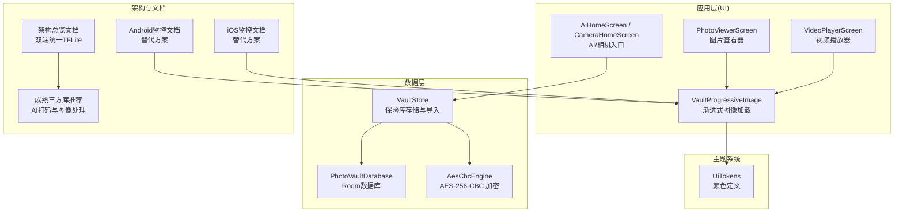
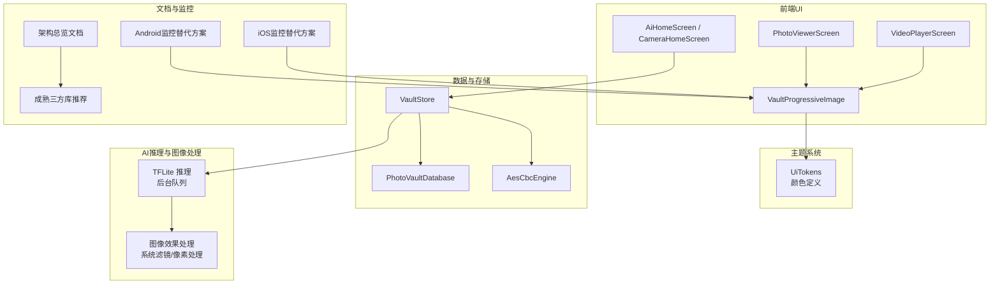
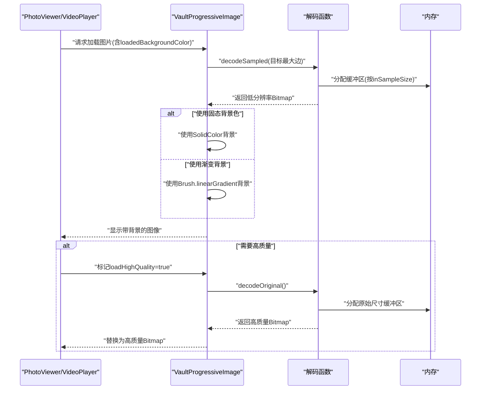
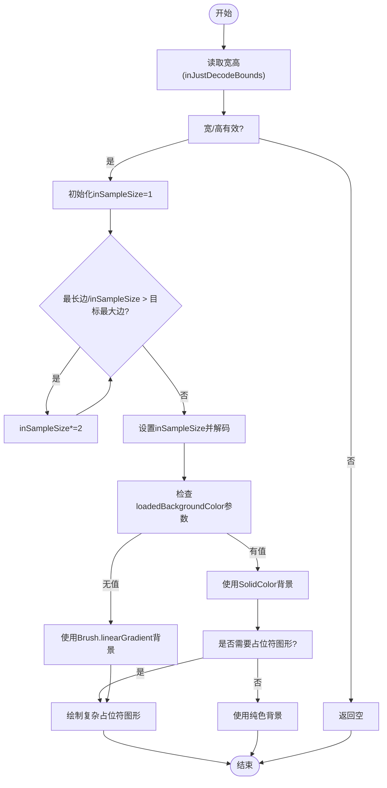
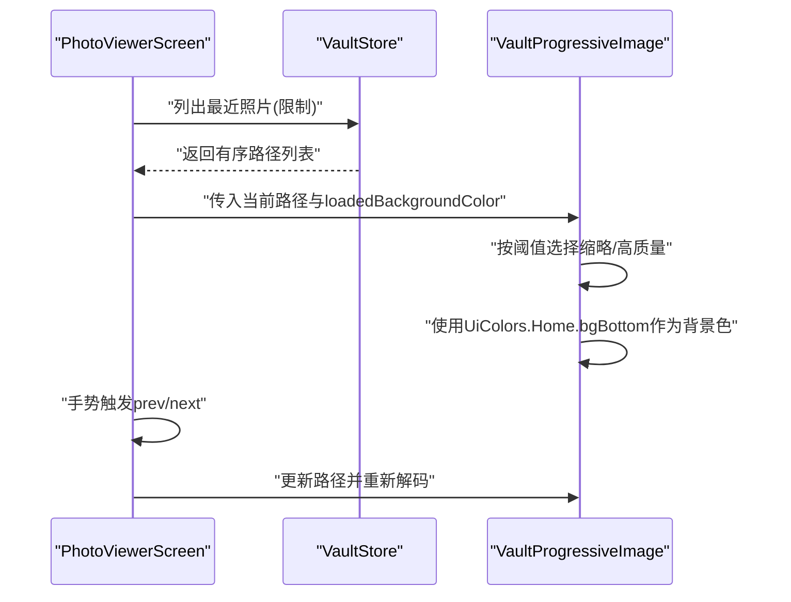
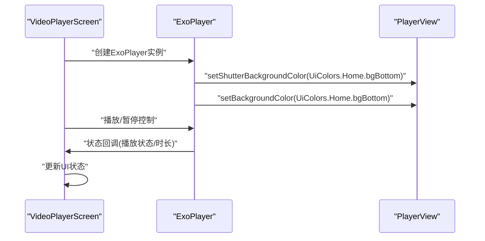
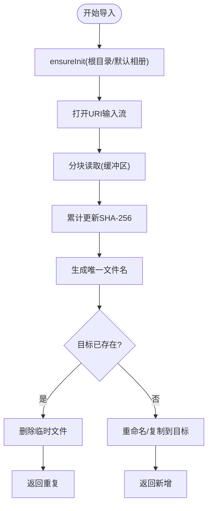
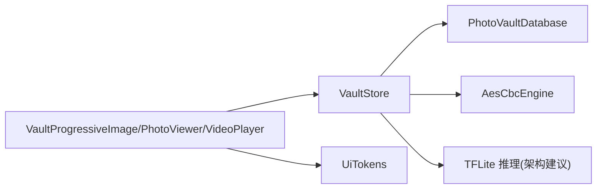

# 图像处理优化

<cite>
**本文引用的文件**
- [android/app/src/main/kotlin/com/xpx/vault/ui/components/VaultProgressiveImage.kt](file://android/app/src/main/kotlin/com/xpx/vault/ui/components/VaultProgressiveImage.kt)
- [android/app/src/main/kotlin/com/xpx/vault/ui/PhotoViewerScreen.kt](file://android/app/src/main/kotlin/com/xpx/vault/ui/PhotoViewerScreen.kt)
- [android/app/src/main/kotlin/com/xpx/vault/ui/VideoPlayerScreen.kt](file://android/app/src/main/kotlin/com/xpx/vault/ui/VideoPlayerScreen.kt)
- [android/app/src/main/kotlin/com/xpx/vault/ui/theme/UiTokens.kt](file://android/app/src/main/kotlin/com/xpx/vault/ui/theme/UiTokens.kt)
- [android/app/src/main/kotlin/com/xpx/vault/ui/vault/VaultStore.kt](file://android/app/src/main/kotlin/com/xpx/vault/ui/vault/VaultStore.kt)
- [android/app/src/main/kotlin/com/xpx/vault/ui/CameraHomeScreen.kt](file://android/app/src/main/kotlin/com/xpx/vault/ui/CameraHomeScreen.kt)
- [android/app/src/main/kotlin/com/xpx/vault/ui/AiHomeScreen.kt](file://android/app/src/main/kotlin/com/xpx/vault/ui/AiHomeScreen.kt)
- [android/core/data/src/main/kotlin/com/xpx/vault/data/crypto/AesCbcEngine.kt](file://android/core/data/src/main/kotlin/com/xpx/vault/data/crypto/AesCbcEngine.kt)
- [android/core/data/src/main/kotlin/com/xpx/vault/data/db/PhotoVaultDatabase.kt](file://android/core/data/src/main/kotlin/com/xpx/vault/data/db/PhotoVaultDatabase.kt)
- [spec/私密相册 App（一期）原生双端架构设计方案.md](file://spec/私密相册 App（一期）原生双端架构设计方案.md)
- [doc/成熟三方库推荐（Android-iOS）.md](file://doc/成熟三方库推荐（Android-iOS）.md)
- [doc/android/11-Firebase监控.md](file://doc/android/11-Firebase监控.md)
- [doc/ios/11-Firebase监控.md](file://doc/ios/11-Firebase监控.md)
</cite>

## 更新摘要
**变更内容**
- 新增固态背景色支持：`VaultProgressiveImage` 组件新增 `loadedBackgroundColor` 参数
- 背景处理优化：替代渐变背景方案，增强视频播放时的视觉一致性
- 颜色匹配改进：`PhotoViewerScreen` 和 `VideoPlayerScreen` 获得更好的颜色匹配和背景处理
- 主题颜色集成：统一使用 `UiColors.Home.bgBottom` 作为背景色
- 占位符渲染逻辑优化：改进了背景颜色处理和性能表现

## 目录
1. [简介](#简介)
2. [项目结构](#项目结构)
3. [核心组件](#核心组件)
4. [架构总览](#架构总览)
5. [详细组件分析](#详细组件分析)
6. [依赖分析](#依赖分析)
7. [性能考虑](#性能考虑)
8. [故障排查指南](#故障排查指南)
9. [结论](#结论)
10. [附录](#附录)

## 简介
本指南面向"AI照片保险库"项目，聚焦图像处理优化实践，围绕以下主题展开：
- 大图解码优化：按需解码、多级缩放与内存预分配
- 图像编码与压缩优化：质量控制、格式选择与压缩参数调优
- TensorFlow Lite 推理优化：模型量化、Delegate 使用与 GPU 加速配置
- 批量图像处理优化：并行处理、流水线设计与资源池管理
- 图像预处理优化：色彩空间转换、尺寸调整与格式标准化
- **新增** 固态背景色支持：通过 `loadedBackgroundColor` 参数实现统一背景处理
- **新增** 占位符渲染逻辑优化：改进背景颜色处理和性能表现
- 性能监控与质量评估：指标定义与落地方法

本指南既提供代码级分析，也给出可操作的优化建议与最佳实践。

## 项目结构
项目采用 Android 应用 + 核心数据模块的分层组织，图像处理相关能力主要分布在 UI 层的图像组件与数据层的存储与加密模块之间。AI 推理与图像处理在架构文档中被明确为"本地离线目标检测 + 图像打码"，并建议统一使用 TensorFlow Lite。

**图表来源**
- [android/app/src/main/kotlin/com/xpx/vault/ui/components/VaultProgressiveImage.kt:1-286](file://android/app/src/main/kotlin/com/xpx/vault/ui/components/VaultProgressiveImage.kt#L1-L286)
- [android/app/src/main/kotlin/com/xpx/vault/ui/PhotoViewerScreen.kt:1-281](file://android/app/src/main/kotlin/com/xpx/vault/ui/PhotoViewerScreen.kt#L1-L281)
- [android/app/src/main/kotlin/com/xpx/vault/ui/VideoPlayerScreen.kt:1-506](file://android/app/src/main/kotlin/com/xpx/vault/ui/VideoPlayerScreen.kt#L1-L506)
- [android/app/src/main/kotlin/com/xpx/vault/ui/theme/UiTokens.kt:1-220](file://android/app/src/main/kotlin/com/xpx/vault/ui/theme/UiTokens.kt#L1-L220)

**章节来源**
- [android/app/src/main/kotlin/com/xpx/vault/ui/components/VaultProgressiveImage.kt:1-286](file://android/app/src/main/kotlin/com/xpx/vault/ui/components/VaultProgressiveImage.kt#L1-L286)
- [android/app/src/main/kotlin/com/xpx/vault/ui/PhotoViewerScreen.kt:1-281](file://android/app/src/main/kotlin/com/xpx/vault/ui/PhotoViewerScreen.kt#L1-L281)
- [android/app/src/main/kotlin/com/xpx/vault/ui/VideoPlayerScreen.kt:1-506](file://android/app/src/main/kotlin/com/xpx/vault/ui/VideoPlayerScreen.kt#L1-L506)
- [android/app/src/main/kotlin/com/xpx/vault/ui/theme/UiTokens.kt:1-220](file://android/app/src/main/kotlin/com/xpx/vault/ui/theme/UiTokens.kt#L1-L220)

## 核心组件
- 渐进式图像加载组件：提供按需解码、两级缩放与高分辨率回退，兼顾首帧速度与最终画质。**新增** 支持固态背景色参数，替代渐变背景方案。
- 图片查看器：结合屏幕尺寸动态选择解码目标，支持手势切换与高质量加载。**优化** 使用统一背景色提升视觉一致性。
- 视频播放器：集成 ExoPlayer 实现视频播放，支持控制面板与进度条。**优化** 背景色与主题颜色完全匹配。
- 保险库存储：负责导入、去重、命名与迁移，支撑批量处理场景。
- 数据库与加密：Room 管理实体，AES-256-CBC 保障资产安全，为批量处理提供稳定的数据通道。

**章节来源**
- [android/app/src/main/kotlin/com/xpx/vault/ui/components/VaultProgressiveImage.kt:50-61](file://android/app/src/main/kotlin/com/xpx/vault/ui/components/VaultProgressiveImage.kt#L50-L61)
- [android/app/src/main/kotlin/com/xpx/vault/ui/PhotoViewerScreen.kt:147-172](file://android/app/src/main/kotlin/com/xpx/vault/ui/PhotoViewerScreen.kt#L147-L172)
- [android/app/src/main/kotlin/com/xpx/vault/ui/VideoPlayerScreen.kt:203-217](file://android/app/src/main/kotlin/com/xpx/vault/ui/VideoPlayerScreen.kt#L203-L217)
- [android/app/src/main/kotlin/com/xpx/vault/ui/vault/VaultStore.kt:39-154](file://android/app/src/main/kotlin/com/xpx/vault/ui/vault/VaultStore.kt#L39-L154)
- [android/core/data/src/main/kotlin/com/xpx/vault/data/db/PhotoVaultDatabase.kt:14-35](file://android/core/data/src/main/kotlin/com/xpx/vault/data/db/PhotoVaultDatabase.kt#L14-L35)
- [android/core/data/src/main/kotlin/com/xpx/vault/data/crypto/AesCbcEngine.kt:12-32](file://android/core/data/src/main/kotlin/com/xpx/vault/data/crypto/AesCbcEngine.kt#L12-L32)

## 架构总览
AI 打码与图像处理在双端统一采用 TensorFlow Lite，推理在后台队列执行，图像效果通过系统级滤镜或像素处理实现。图像管线遵循"按需解码 + 多级缩放 + 缓存"的策略，确保在不同设备上获得一致的性能与体验。**新增** 背景色统一管理机制，提升整体视觉一致性。

**图表来源**
- [spec/私密相册 App（一期）原生双端架构设计方案.md:99-139](file://spec/私密相册 App（一期）原生双端架构设计方案.md#L99-L139)
- [doc/成熟三方库推荐（Android-iOS）.md:59-89](file://doc/成熟三方库推荐（Android-iOS）.md#L59-L89)
- [doc/android/11-Firebase监控.md:10-21](file://doc/android/11-Firebase监控.md#L10-L21)
- [doc/ios/11-Firebase监控.md:10-21](file://doc/ios/11-Firebase监控.md#L10-L21)

## 详细组件分析

### 渐进式图像加载组件（按需解码与多级缩放）
该组件通过两级解码策略提升首帧显示速度与最终画质平衡，**新增** 支持固态背景色参数：
- 首帧：基于目标最大边进行指数倍数降采样，快速生成低分辨率缩略图
- 高质量：在需要时解码原始尺寸，满足大屏浏览需求
- **新增** 背景处理：支持固态背景色替代渐变背景，提升视觉一致性
- **新增** 占位符渲染优化：当使用固态背景色时，不再绘制复杂的占位符图形，直接使用纯色背景

**图表来源**
- [android/app/src/main/kotlin/com/xpx/vault/ui/components/VaultProgressiveImage.kt:126-141](file://android/app/src/main/kotlin/com/xpx/vault/ui/components/VaultProgressiveImage.kt#L126-L141)
- [android/app/src/main/kotlin/com/xpx/vault/ui/PhotoViewerScreen.kt:167-172](file://android/app/src/main/kotlin/com/xpx/vault/ui/PhotoViewerScreen.kt#L167-L172)
- [android/app/src/main/kotlin/com/xpx/vault/ui/VideoPlayerScreen.kt:209-212](file://android/app/src/main/kotlin/com/xpx/vault/ui/VideoPlayerScreen.kt#L209-L212)

**图表来源**
- [android/app/src/main/kotlin/com/xpx/vault/ui/components/VaultProgressiveImage.kt:126-141](file://android/app/src/main/kotlin/com/xpx/vault/ui/components/VaultProgressiveImage.kt#L126-L141)
- [android/app/src/main/kotlin/com/xpx/vault/ui/components/VaultProgressiveImage.kt:218-233](file://android/app/src/main/kotlin/com/xpx/vault/ui/components/VaultProgressiveImage.kt#L218-L233)

**章节来源**
- [android/app/src/main/kotlin/com/xpx/vault/ui/components/VaultProgressiveImage.kt:50-61](file://android/app/src/main/kotlin/com/xpx/vault/ui/components/VaultProgressiveImage.kt#L50-L61)
- [android/app/src/main/kotlin/com/xpx/vault/ui/components/VaultProgressiveImage.kt:126-141](file://android/app/src/main/kotlin/com/xpx/vault/ui/components/VaultProgressiveImage.kt#L126-L141)
- [android/app/src/main/kotlin/com/xpx/vault/ui/components/VaultProgressiveImage.kt:218-233](file://android/app/src/main/kotlin/com/xpx/vault/ui/components/VaultProgressiveImage.kt#L218-L233)

### 图片查看器（手势切换与高质量加载）
图片查看器根据屏幕最大边动态计算高质量解码目标，结合手势滑动实现流畅切换。**优化** 使用统一背景色提升视觉一致性。

**图表来源**
- [android/app/src/main/kotlin/com/xpx/vault/ui/PhotoViewerScreen.kt:87-103](file://android/app/src/main/kotlin/com/xpx/vault/ui/PhotoViewerScreen.kt#L87-L103)
- [android/app/src/main/kotlin/com/xpx/vault/ui/PhotoViewerScreen.kt:147-172](file://android/app/src/main/kotlin/com/xpx/vault/ui/PhotoViewerScreen.kt#L147-L172)
- [android/app/src/main/kotlin/com/xpx/vault/ui/vault/VaultStore.kt:81-84](file://android/app/src/main/kotlin/com/xpx/vault/ui/vault/VaultStore.kt#L81-L84)

**章节来源**
- [android/app/src/main/kotlin/com/xpx/vault/ui/PhotoViewerScreen.kt:46-172](file://android/app/src/main/kotlin/com/xpx/vault/ui/PhotoViewerScreen.kt#L46-L172)
- [android/app/src/main/kotlin/com/xpx/vault/ui/vault/VaultStore.kt:81-84](file://android/app/src/main/kotlin/com/xpx/vault/ui/vault/VaultStore.kt#L81-L84)

### 视频播放器（ExoPlayer 集成）
视频播放器集成 ExoPlayer 实现视频播放，支持控制面板与进度条。**优化** 背景色与主题颜色完全匹配，提升视觉一致性。

**图表来源**
- [android/app/src/main/kotlin/com/xpx/vault/ui/VideoPlayerScreen.kt:85-92](file://android/app/src/main/kotlin/com/xpx/vault/ui/VideoPlayerScreen.kt#L85-L92)
- [android/app/src/main/kotlin/com/xpx/vault/ui/VideoPlayerScreen.kt:203-217](file://android/app/src/main/kotlin/com/xpx/vault/ui/VideoPlayerScreen.kt#L203-L217)

**章节来源**
- [android/app/src/main/kotlin/com/xpx/vault/ui/VideoPlayerScreen.kt:73-217](file://android/app/src/main/kotlin/com/xpx/vault/ui/VideoPlayerScreen.kt#L73-L217)

### 保险库存储与批量导入（去重与命名）
保险库模块负责导入、去重与命名，为批量处理提供稳定的输入源。

**图表来源**
- [android/app/src/main/kotlin/com/xpx/vault/ui/vault/VaultStore.kt:120-154](file://android/app/src/main/kotlin/com/xpx/vault/ui/vault/VaultStore.kt#L120-L154)

**章节来源**
- [android/app/src/main/kotlin/com/xpx/vault/ui/vault/VaultStore.kt:39-154](file://android/app/src/main/kotlin/com/xpx/vault/ui/vault/VaultStore.kt#L39-L154)

### 数据库与加密（批量处理的数据通道）
- Room 数据库承载相册、资产与安全设置等实体，为批量处理提供结构化数据基础
- AES-256-CBC 保障资产安全，适合在批量导入/导出时作为加密通道

**章节来源**
- [android/core/data/src/main/kotlin/com/xpx/vault/data/db/PhotoVaultDatabase.kt:14-35](file://android/core/data/src/main/kotlin/com/xpx/vault/data/db/PhotoVaultDatabase.kt#L14-L35)
- [android/core/data/src/main/kotlin/com/xpx/vault/data/crypto/AesCbcEngine.kt:12-32](file://android/core/data/src/main/kotlin/com/xpx/vault/data/crypto/AesCbcEngine.kt#L12-L32)

## 依赖分析
- UI 组件依赖存储模块进行数据访问与导入
- **新增** UI 组件依赖主题系统获取统一的颜色定义
- 存储模块依赖数据库与加密模块，保证数据完整性与安全性
- AI 推理与图像处理在架构层面与 UI 解耦，通过后台队列执行，避免阻塞主线程

**图表来源**
- [android/app/src/main/kotlin/com/xpx/vault/ui/components/VaultProgressiveImage.kt:1-286](file://android/app/src/main/kotlin/com/xpx/vault/ui/components/VaultProgressiveImage.kt#L1-L286)
- [android/app/src/main/kotlin/com/xpx/vault/ui/PhotoViewerScreen.kt:1-281](file://android/app/src/main/kotlin/com/xpx/vault/ui/PhotoViewerScreen.kt#L1-L281)
- [android/app/src/main/kotlin/com/xpx/vault/ui/VideoPlayerScreen.kt:1-506](file://android/app/src/main/kotlin/com/xpx/vault/ui/VideoPlayerScreen.kt#L1-L506)
- [android/app/src/main/kotlin/com/xpx/vault/ui/theme/UiTokens.kt:1-220](file://android/app/src/main/kotlin/com/xpx/vault/ui/theme/UiTokens.kt#L1-L220)
- [android/app/src/main/kotlin/com/xpx/vault/ui/vault/VaultStore.kt:1-226](file://android/app/src/main/kotlin/com/xpx/vault/ui/vault/VaultStore.kt#L1-L226)
- [android/core/data/src/main/kotlin/com/xpx/vault/data/db/PhotoVaultDatabase.kt:1-35](file://android/core/data/src/main/kotlin/com/xpx/vault/data/db/PhotoVaultDatabase.kt#L1-L35)
- [android/core/data/src/main/kotlin/com/xpx/vault/data/crypto/AesCbcEngine.kt:1-39](file://android/core/data/src/main/kotlin/com/xpx/vault/data/crypto/AesCbcEngine.kt#L1-L39)
- [spec/私密相册 App（一期）原生双端架构设计方案.md:99-139](file://spec/私密相册 App（一期）原生双端架构设计方案.md#L99-L139)

**章节来源**
- [spec/私密相册 App（一期）原生双端架构设计方案.md:99-139](file://spec/私密相册 App（一期）原生双端架构设计方案.md#L99-L139)

## 性能考虑
- 大图解码
  - 使用指数倍降采样策略，避免一次性解码超大图导致 OOM
  - 首帧缩略图优先，随后在需要时加载高质量版本
  - 通过 inJustDecodeBounds 获取尺寸，再按目标最大边计算 inSampleSize
- **新增** 背景处理优化
  - 固态背景色替代渐变背景，减少绘制开销
  - 统一使用主题颜色，避免颜色匹配问题
  - 当使用固态背景色时，不再绘制复杂的占位符图形，直接使用纯色背景，进一步提升渲染性能
  - 减少复杂的渐变绘制操作，提升渲染性能
- 编码与压缩
  - 选择合适的输出格式与质量参数，结合设备与场景动态调整
  - 对批量导入场景，采用分块读取与累计哈希，降低内存峰值
- TensorFlow Lite 推理
  - 优先使用 INT8 量化模型，统一双端部署
  - Android 使用 NNAPI/GPU Delegate，iOS 使用 Metal Delegate
  - 推理在后台队列执行，结果回传主线程刷新 UI
- 批量处理
  - 使用协程与 IO 调度器，避免阻塞主线程
  - 设计流水线：解码 → 预处理 → 推理 → 后处理 → 写入
  - 资源池管理：复用解码器、缓冲区与线程池
- 预处理
  - 统一色彩空间与 EXIF 方向处理
  - 尺寸调整与格式标准化，减少后续处理分支
- 监控与评估
  - 一期暂不集成 Firebase，采用 Logcat/Profiler 与真机回归
  - 可建立轻量日志文件记录关键指标（解码耗时、推理耗时、内存占用）

**章节来源**
- [android/app/src/main/kotlin/com/xpx/vault/ui/components/VaultProgressiveImage.kt:126-141](file://android/app/src/main/kotlin/com/xpx/vault/ui/components/VaultProgressiveImage.kt#L126-L141)
- [android/app/src/main/kotlin/com/xpx/vault/ui/PhotoViewerScreen.kt:167-172](file://android/app/src/main/kotlin/com/xpx/vault/ui/PhotoViewerScreen.kt#L167-L172)
- [android/app/src/main/kotlin/com/xpx/vault/ui/VideoPlayerScreen.kt:209-212](file://android/app/src/main/kotlin/com/xpx/vault/ui/VideoPlayerScreen.kt#L209-L212)
- [android/app/src/main/kotlin/com/xpx/vault/ui/components/VaultProgressiveImage.kt:218-233](file://android/app/src/main/kotlin/com/xpx/vault/ui/components/VaultProgressiveImage.kt#L218-L233)
- [android/app/src/main/kotlin/com/xpx/vault/ui/vault/VaultStore.kt:129-140](file://android/app/src/main/kotlin/com/xpx/vault/ui/vault/VaultStore.kt#L129-L140)
- [doc/成熟三方库推荐（Android-iOS）.md:59-89](file://doc/成熟三方库推荐（Android-iOS）.md#L59-L89)
- [doc/android/11-Firebase监控.md:10-21](file://doc/android/11-Firebase监控.md#L10-L21)
- [doc/ios/11-Firebase监控.md:10-21](file://doc/ios/11-Firebase监控.md#L10-L21)

## 故障排查指南
- 图像加载异常
  - 检查路径有效性与文件是否存在
  - 关注 inJustDecodeBounds 与 inSampleSize 计算逻辑
  - 验证解码失败时的空值返回与 UI 状态
- **新增** 背景色问题
  - 检查 `loadedBackgroundColor` 参数是否正确传递
  - 验证主题颜色定义是否正确
  - 确认固态背景色与渐变背景的切换逻辑
  - 检查占位符渲染逻辑是否正确处理固态背景色场景
- 性能问题
  - 使用 Profiler 观察解码与推理阶段的耗时
  - 检查是否存在频繁的高质量解码与 UI 重建
  - 监控背景绘制对性能的影响
  - 特别关注固态背景色场景下的渲染性能
- 安全与稳定性
  - 导入流程中的哈希计算与去重逻辑
  - AES-256-CBC 加密/解密的输入长度校验与异常捕获
- 监控与日志
  - 依据替代方案收集系统日志与崩溃报告
  - 在工程内保留非敏感诊断接口，便于后续接入

**章节来源**
- [android/app/src/main/kotlin/com/xpx/vault/ui/components/VaultProgressiveImage.kt:85-89](file://android/app/src/main/kotlin/com/xpx/vault/ui/components/VaultProgressiveImage.kt#L85-L89)
- [android/app/src/main/kotlin/com/xpx/vault/ui/vault/VaultStore.kt:129-154](file://android/app/src/main/kotlin/com/xpx/vault/ui/vault/VaultStore.kt#L129-L154)
- [android/core/data/src/main/kotlin/com/xpx/vault/data/crypto/AesCbcEngine.kt:25-32](file://android/core/data/src/main/kotlin/com/xpx/vault/data/crypto/AesCbcEngine.kt#L25-L32)
- [doc/android/11-Firebase监控.md:10-21](file://doc/android/11-Firebase监控.md#L10-L21)
- [doc/ios/11-Firebase监控.md:10-21](file://doc/ios/11-Firebase监控.md#L10-L21)

## 结论
本指南基于现有代码与架构文档，总结了图像处理优化的关键路径：按需解码与多级缩放、批量导入与去重、TFLite 推理与 Delegate 配置、以及性能监控与质量评估。**新增** 的固态背景色支持显著提升了视觉一致性，特别是在视频播放场景中。**新增** 的占位符渲染逻辑优化进一步改善了性能表现，当使用固态背景色时，系统会跳过复杂的占位符图形绘制，直接使用纯色背景，从而减少渲染开销。建议在保持 UI 流畅的同时，通过流水线与资源池管理提升吞吐，并在统一的量化策略下实现双端一致性。

## 附录
- 参考文档
  - 架构总览与 AI 推理选型
  - 成熟三方库推荐（AI 打码与图像处理）
  - Android/iOS 监控替代方案
  - **新增** 主题系统与颜色管理

**章节来源**
- [spec/私密相册 App（一期）原生双端架构设计方案.md:99-139](file://spec/私密相册 App（一期）原生双端架构设计方案.md#L99-L139)
- [doc/成熟三方库推荐（Android-iOS）.md:59-89](file://doc/成熟三方库推荐（Android-iOS）.md#L59-L89)
- [doc/android/11-Firebase监控.md:1-28](file://doc/android/11-Firebase监控.md#L1-L28)
- [doc/ios/11-Firebase监控.md:1-27](file://doc/ios/11-Firebase监控.md#L1-L27)
- [android/app/src/main/kotlin/com/xpx/vault/ui/theme/UiTokens.kt:55-72](file://android/app/src/main/kotlin/com/xpx/vault/ui/theme/UiTokens.kt#L55-L72)