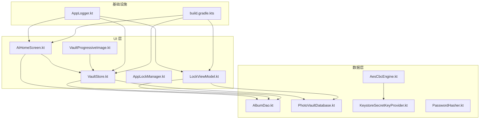
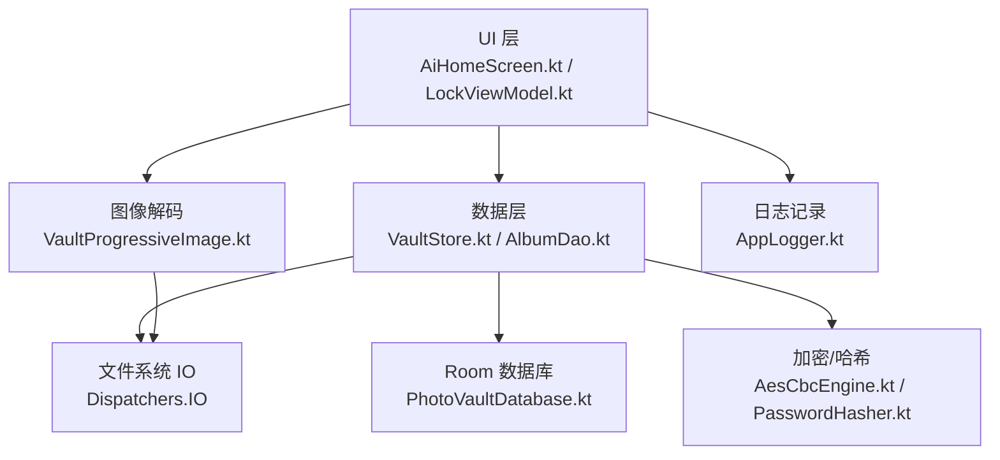
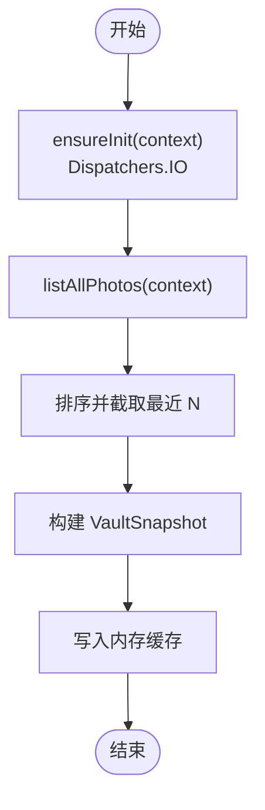
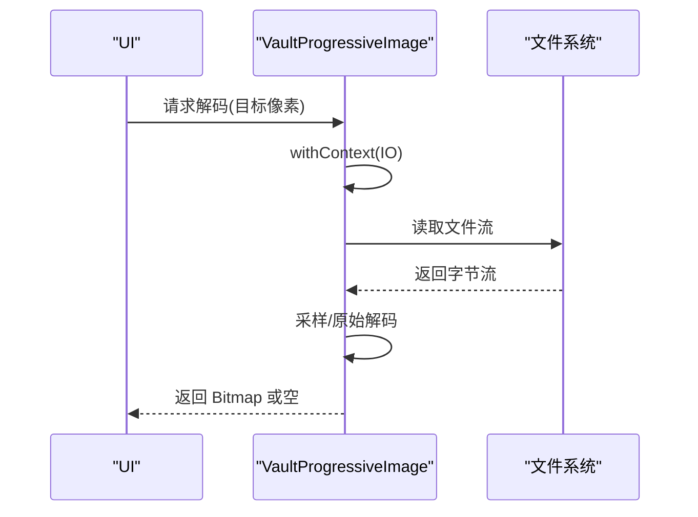
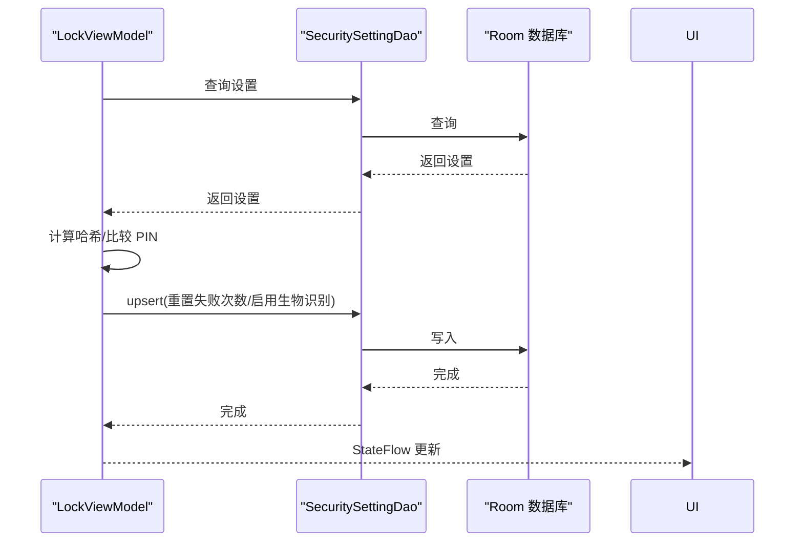
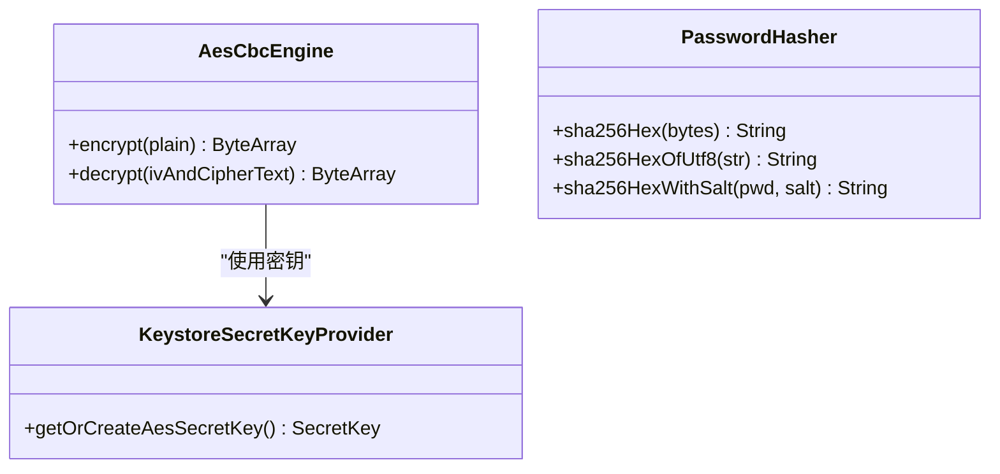
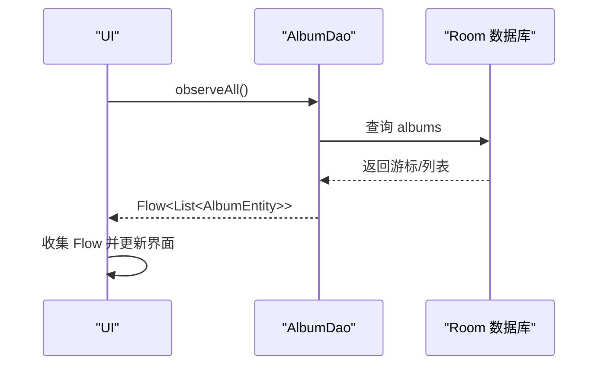
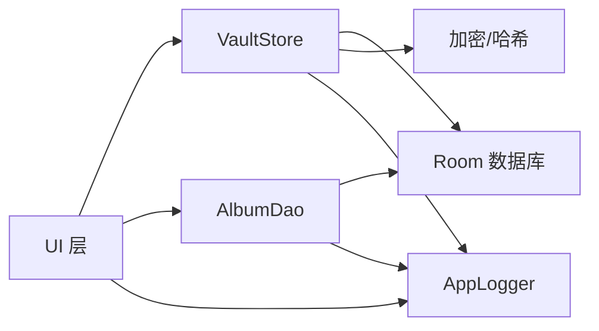

# 异步处理优化

<cite>
**本文引用的文件**
- [AiHomeScreen.kt](file://android/app/src/main/kotlin/com/photovault/app/ui/AiHomeScreen.kt)
- [VaultStore.kt](file://android/app/src/main/kotlin/com/photovault/app/ui/vault/VaultStore.kt)
- [VaultProgressiveImage.kt](file://android/app/src/main/kotlin/com/photovault/app/ui/components/VaultProgressiveImage.kt)
- [CameraPlaceholderScreen.kt](file://android/app/src/main/kotlin/com/photovault/app/ui/CameraPlaceholderScreen.kt)
- [LockViewModel.kt](file://android/app/src/main/kotlin/com/photovault/app/ui/lock/LockViewModel.kt)
- [AppLockManager.kt](file://android/app/src/main/kotlin/com/photovault/app/AppLockManager.kt)
- [AesCbcEngine.kt](file://android/core/data/src/main/kotlin/com/photovault/data/crypto/AesCbcEngine.kt)
- [KeystoreSecretKeyProvider.kt](file://android/core/data/src/main/kotlin/com/photovault/data/crypto/KeystoreSecretKeyProvider.kt)
- [PasswordHasher.kt](file://android/core/data/src/main/kotlin/com/photovault/data/crypto/PasswordHasher.kt)
- [AlbumDao.kt](file://android/core/data/src/main/kotlin/com/photovault/data/db/dao/AlbumDao.kt)
- [PhotoVaultDatabase.kt](file://android/core/data/src/main/kotlin/com/photovault/data/db/PhotoVaultDatabase.kt)
- [AppLogger.kt](file://android/app/src/main/kotlin/com/photovault/app/AppLogger.kt)
- [build.gradle.kts](file://android/app/build.gradle.kts)
</cite>

## 目录
1. [简介](#简介)
2. [项目结构](#项目结构)
3. [核心组件](#核心组件)
4. [架构总览](#架构总览)
5. [详细组件分析](#详细组件分析)
6. [依赖关系分析](#依赖关系分析)
7. [性能考量](#性能考量)
8. [故障排查指南](#故障排查指南)
9. [结论](#结论)
10. [附录](#附录)

## 简介
本指南聚焦于 AI 照片保险库项目中的异步处理优化实践，围绕 Kotlin 协程的使用与优化策略展开，覆盖以下主题：
- Dispatcher 选择与线程池配置建议
- CPU 密集型任务（加密、解码）的异步化与并发控制
- IO 密集型任务（文件读写、Room 数据库、网络请求）的异步化与背压处理
- WorkManager 后台任务管理策略（任务优先级、约束条件、执行策略）
- Flow 与 StateFlow 的使用模式（背压、错误传播、状态管理）
- 异步任务监控与调试技巧

## 项目结构
从异步处理视角，项目主要分为三层：
- UI 层：Compose 屏幕与 ViewModel，负责状态管理与调用数据层接口
- 数据层：Room DAO、实体与加密工具，负责持久化与安全处理
- 核心工具：加密引擎、密码哈希、日志与构建配置

图表来源
- [AiHomeScreen.kt:1-56](file://android/app/src/main/kotlin/com/photovault/app/ui/AiHomeScreen.kt#L1-L56)
- [VaultStore.kt:1-226](file://android/app/src/main/kotlin/com/photovault/app/ui/vault/VaultStore.kt#L1-L226)
- [VaultProgressiveImage.kt](file://android/app/src/main/kotlin/com/photovault/app/ui/components/VaultProgressiveImage.kt)
- [LockViewModel.kt:1-222](file://android/app/src/main/kotlin/com/photovault/app/ui/lock/LockViewModel.kt#L1-L222)
- [AlbumDao.kt:1-18](file://android/core/data/src/main/kotlin/com/photovault/data/db/dao/AlbumDao.kt#L1-L18)
- [PhotoVaultDatabase.kt:1-36](file://android/core/data/src/main/kotlin/com/photovault/data/db/PhotoVaultDatabase.kt#L1-L36)
- [AesCbcEngine.kt:1-40](file://android/core/data/src/main/kotlin/com/photovault/data/crypto/AesCbcEngine.kt#L1-L40)
- [KeystoreSecretKeyProvider.kt:1-42](file://android/core/data/src/main/kotlin/com/photovault/data/crypto/KeystoreSecretKeyProvider.kt#L1-L42)
- [PasswordHasher.kt:1-26](file://android/core/data/src/main/kotlin/com/photovault/data/crypto/PasswordHasher.kt#L1-L26)
- [AppLogger.kt:1-43](file://android/app/src/main/kotlin/com/photovault/app/AppLogger.kt#L1-L43)
- [build.gradle.kts:1-91](file://android/app/build.gradle.kts#L1-L91)

章节来源
- [AiHomeScreen.kt:1-56](file://android/app/src/main/kotlin/com/photovault/app/ui/AiHomeScreen.kt#L1-L56)
- [VaultStore.kt:1-226](file://android/app/src/main/kotlin/com/photovault/app/ui/vault/VaultStore.kt#L1-L226)
- [LockViewModel.kt:1-222](file://android/app/src/main/kotlin/com/photovault/app/ui/lock/LockViewModel.kt#L1-L222)
- [AlbumDao.kt:1-18](file://android/core/data/src/main/kotlin/com/photovault/data/db/dao/AlbumDao.kt#L1-L18)
- [PhotoVaultDatabase.kt:1-36](file://android/core/data/src/main/kotlin/com/photovault/data/db/PhotoVaultDatabase.kt#L1-L36)
- [AesCbcEngine.kt:1-40](file://android/core/data/src/main/kotlin/com/photovault/data/crypto/AesCbcEngine.kt#L1-L40)
- [KeystoreSecretKeyProvider.kt:1-42](file://android/core/data/src/main/kotlin/com/photovault/data/crypto/KeystoreSecretKeyProvider.kt#L1-L42)
- [PasswordHasher.kt:1-26](file://android/core/data/src/main/kotlin/com/photovault/data/crypto/PasswordHasher.kt#L1-L26)
- [AppLogger.kt:1-43](file://android/app/src/main/kotlin/com/photovault/app/AppLogger.kt#L1-L43)
- [build.gradle.kts:1-91](file://android/app/build.gradle.kts#L1-L91)

## 核心组件
- VaultStore：封装私密相册的文件系统读写、导入、搜索与统计，大量使用 IO 密集型操作，统一通过 Dispatchers.IO 执行
- VaultProgressiveImage：图像解码流程（采样解码与原始解码）采用 Dispatchers.IO，避免阻塞主线程
- LockViewModel 与 AppLockManager：使用 StateFlow 管理 UI 状态，结合 ViewModelScope 和协程进行数据库更新与验证
- 加密与哈希：AesCbcEngine、KeystoreSecretKeyProvider、PasswordHasher 提供安全能力，适合在后台线程执行
- Room DAO：AlbumDao 使用 Flow 观察数据变化，支持响应式 UI 更新
- 日志与构建：AppLogger 统一日志输出，build.gradle.kts 定义编译与依赖

章节来源
- [VaultStore.kt:47-164](file://android/app/src/main/kotlin/com/photovault/app/ui/vault/VaultStore.kt#L47-L164)
- [VaultProgressiveImage.kt](file://android/app/src/main/kotlin/com/photovault/app/ui/components/VaultProgressiveImage.kt)
- [LockViewModel.kt:23-196](file://android/app/src/main/kotlin/com/photovault/app/ui/lock/LockViewModel.kt#L23-L196)
- [AppLockManager.kt:1-30](file://android/app/src/main/kotlin/com/photovault/app/AppLockManager.kt#L1-L30)
- [AlbumDao.kt:15-16](file://android/core/data/src/main/kotlin/com/photovault/data/db/dao/AlbumDao.kt#L15-L16)
- [AesCbcEngine.kt:17-32](file://android/core/data/src/main/kotlin/com/photovault/data/crypto/AesCbcEngine.kt#L17-L32)
- [KeystoreSecretKeyProvider.kt:18-35](file://android/core/data/src/main/kotlin/com/photovault/data/crypto/KeystoreSecretKeyProvider.kt#L18-L35)
- [PasswordHasher.kt:9-24](file://android/core/data/src/main/kotlin/com/photovault/data/crypto/PasswordHasher.kt#L9-L24)
- [AppLogger.kt:16-29](file://android/app/src/main/kotlin/com/photovault/app/AppLogger.kt#L16-L29)

## 架构总览
下图展示异步处理在 UI、数据与加密层之间的交互关系。

图表来源
- [AiHomeScreen.kt:1-56](file://android/app/src/main/kotlin/com/photovault/app/ui/AiHomeScreen.kt#L1-L56)
- [VaultStore.kt:47-164](file://android/app/src/main/kotlin/com/photovault/app/ui/vault/VaultStore.kt#L47-L164)
- [VaultProgressiveImage.kt](file://android/app/src/main/kotlin/com/photovault/app/ui/components/VaultProgressiveImage.kt)
- [LockViewModel.kt:23-196](file://android/app/src/main/kotlin/com/photovault/app/ui/lock/LockViewModel.kt#L23-L196)
- [AlbumDao.kt:15-16](file://android/core/data/src/main/kotlin/com/photovault/data/db/dao/AlbumDao.kt#L15-L16)
- [PhotoVaultDatabase.kt:26-35](file://android/core/data/src/main/kotlin/com/photovault/data/db/PhotoVaultDatabase.kt#L26-L35)
- [AesCbcEngine.kt:17-32](file://android/core/data/src/main/kotlin/com/photovault/data/crypto/AesCbcEngine.kt#L17-L32)
- [PasswordHasher.kt:9-24](file://android/core/data/src/main/kotlin/com/photovault/data/crypto/PasswordHasher.kt#L9-L24)
- [AppLogger.kt:16-29](file://android/app/src/main/kotlin/com/photovault/app/AppLogger.kt#L16-L29)

## 详细组件分析

### VaultStore：文件系统 IO 与缓存
- 职责：私密相册的初始化、相册列表、最近照片、导入、搜索与统计
- 异步策略：所有文件系统与 IO 操作统一使用 Dispatchers.IO 包裹，避免阻塞主线程
- 缓存机制：内存缓存快照与按相册缓存照片列表，减少重复 IO
- 关键点：
  - 初始化与迁移：ensureInit(context) 使用 Dispatchers.IO
  - 列表与搜索：listAlbums、listPhotosInAlbum、searchPhotos 使用 Dispatchers.IO
  - 导入流程：importFromPicker 使用 Dispatchers.IO，并进行 SHA-256 哈希去重
  - 性能建议：批量读取与排序尽量在协程中完成；对大目录遍历可考虑分页或懒加载

图表来源
- [VaultStore.kt:47-58](file://android/app/src/main/kotlin/com/photovault/app/ui/vault/VaultStore.kt#L47-L58)
- [VaultStore.kt:166-184](file://android/app/src/main/kotlin/com/photovault/app/ui/vault/VaultStore.kt#L166-L184)

章节来源
- [VaultStore.kt:47-164](file://android/app/src/main/kotlin/com/photovault/app/ui/vault/VaultStore.kt#L47-L164)

### VaultProgressiveImage：图像解码异步化
- 职责：根据目标像素密度进行采样解码或原始解码，避免 OOM
- 异步策略：decodeSampled 与 decodeOriginal 使用 Dispatchers.IO
- 背压与取消：Compose 中应结合 rememberUpdatedState 与 awaitClose 处理取消与重建
- 建议：对高频缩略图场景使用采样解码；对大图预览使用原始解码并限制并发

图表来源
- [VaultProgressiveImage.kt](file://android/app/src/main/kotlin/com/photovault/app/ui/components/VaultProgressiveImage.kt)

章节来源
- [VaultProgressiveImage.kt](file://android/app/src/main/kotlin/com/photovault/app/ui/components/VaultProgressiveImage.kt)

### LockViewModel 与 AppLockManager：状态流与 UI 更新
- 职责：PIN 设置/校验、生物识别状态、失败次数统计与 UI 状态流转
- 异步策略：使用 ViewModelScope 启动协程；StateFlow 管理只读 UI 状态
- 错误传播：PIN 错误时通过状态流向 UI 报错；成功后清空输入并重置提示
- 建议：将耗时的数据库写入与哈希计算放入 Dispatchers.IO；避免在状态流中直接持有上下文

图表来源
- [LockViewModel.kt:23-196](file://android/app/src/main/kotlin/com/photovault/app/ui/lock/LockViewModel.kt#L23-L196)
- [AlbumDao.kt:15-16](file://android/core/data/src/main/kotlin/com/photovault/data/db/dao/AlbumDao.kt#L15-L16)
- [PhotoVaultDatabase.kt:26-35](file://android/core/data/src/main/kotlin/com/photovault/data/db/PhotoVaultDatabase.kt#L26-L35)

章节来源
- [LockViewModel.kt:23-196](file://android/app/src/main/kotlin/com/photovault/app/ui/lock/LockViewModel.kt#L23-L196)
- [AppLockManager.kt:1-30](file://android/app/src/main/kotlin/com/photovault/app/AppLockManager.kt#L1-L30)

### 加密与哈希：CPU 密集型任务的异步化
- AesCbcEngine：AES-CBC 加解密，IV 前置，适合在后台线程执行
- KeystoreSecretKeyProvider：Android Keystore 中生成/读取密钥，避免密钥外泄
- PasswordHasher：SHA-256 哈希，支持带盐值的口令存储
- 建议：将加密/解密与哈希计算放入 Dispatchers.Default 或自定义线程池；避免在主线程执行

图表来源
- [AesCbcEngine.kt:12-32](file://android/core/data/src/main/kotlin/com/photovault/data/crypto/AesCbcEngine.kt#L12-L32)
- [KeystoreSecretKeyProvider.kt:12-35](file://android/core/data/src/main/kotlin/com/photovault/data/crypto/KeystoreSecretKeyProvider.kt#L12-L35)
- [PasswordHasher.kt:6-25](file://android/core/data/src/main/kotlin/com/photovault/data/crypto/PasswordHasher.kt#L6-L25)

章节来源
- [AesCbcEngine.kt:12-32](file://android/core/data/src/main/kotlin/com/photovault/data/crypto/AesCbcEngine.kt#L12-L32)
- [KeystoreSecretKeyProvider.kt:12-35](file://android/core/data/src/main/kotlin/com/photovault/data/crypto/KeystoreSecretKeyProvider.kt#L12-L35)
- [PasswordHasher.kt:6-25](file://android/core/data/src/main/kotlin/com/photovault/data/crypto/PasswordHasher.kt#L6-L25)

### Room 数据库与 Flow：响应式数据观察
- AlbumDao.observeAll 返回 Flow<List<AlbumEntity>>，UI 可直接收集以响应数据变化
- 建议：在 ViewModel 中使用 viewModelScope.launch 收集 Flow；避免在 UI 中直接收集
- 背压处理：Compose 中使用 Lazy 列表或分页加载；Room 查询本身是同步的，但 Flow 收集可在协程中进行

图表来源
- [AlbumDao.kt:15-16](file://android/core/data/src/main/kotlin/com/photovault/data/db/dao/AlbumDao.kt#L15-L16)
- [PhotoVaultDatabase.kt:26-35](file://android/core/data/src/main/kotlin/com/photovault/data/db/PhotoVaultDatabase.kt#L26-L35)

章节来源
- [AlbumDao.kt:15-16](file://android/core/data/src/main/kotlin/com/photovault/data/db/dao/AlbumDao.kt#L15-L16)
- [PhotoVaultDatabase.kt:26-35](file://android/core/data/src/main/kotlin/com/photovault/data/db/PhotoVaultDatabase.kt#L26-L35)

### 相机拍摄与临时文件：IO 密集型任务
- 拍摄流程：reserveCameraTarget(context) 与 captureToVault(...) 均使用 Dispatchers.IO
- 建议：对临时文件写入与最终落盘进行幂等检查；失败回滚与清理

章节来源
- [VaultStore.kt:155-164](file://android/app/src/main/kotlin/com/photovault/app/ui/vault/VaultStore.kt#L155-L164)
- [CameraPlaceholderScreen.kt](file://android/app/src/main/kotlin/com/photovault/app/ui/CameraPlaceholderScreen.kt)

## 依赖关系分析
- UI 依赖数据层接口（VaultStore、AlbumDao），数据层依赖 Room 与加密工具
- 协程作用域：UI 使用 ViewModelScope；数据层使用 withContext(Dispatchers.IO/Default)
- 日志：AppLogger 提供统一日志入口，避免泄露敏感信息

图表来源
- [VaultStore.kt:47-164](file://android/app/src/main/kotlin/com/photovault/app/ui/vault/VaultStore.kt#L47-L164)
- [AlbumDao.kt:15-16](file://android/core/data/src/main/kotlin/com/photovault/data/db/dao/AlbumDao.kt#L15-L16)
- [PhotoVaultDatabase.kt:26-35](file://android/core/data/src/main/kotlin/com/photovault/data/db/PhotoVaultDatabase.kt#L26-L35)
- [AesCbcEngine.kt:17-32](file://android/core/data/src/main/kotlin/com/photovault/data/crypto/AesCbcEngine.kt#L17-L32)
- [PasswordHasher.kt:9-24](file://android/core/data/src/main/kotlin/com/photovault/data/crypto/PasswordHasher.kt#L9-L24)
- [AppLogger.kt:16-29](file://android/app/src/main/kotlin/com/photovault/app/AppLogger.kt#L16-L29)

章节来源
- [VaultStore.kt:47-164](file://android/app/src/main/kotlin/com/photovault/app/ui/vault/VaultStore.kt#L47-L164)
- [AlbumDao.kt:15-16](file://android/core/data/src/main/kotlin/com/photovault/data/db/dao/AlbumDao.kt#L15-L16)
- [PhotoVaultDatabase.kt:26-35](file://android/core/data/src/main/kotlin/com/photovault/data/db/PhotoVaultDatabase.kt#L26-L35)
- [AppLogger.kt:16-29](file://android/app/src/main/kotlin/com/photovault/app/AppLogger.kt#L16-L29)

## 性能考量
- Dispatcher 选择
  - IO 密集型：文件读写、图像解码、数据库访问 → 使用 Dispatchers.IO
  - CPU 密集型：加密/解密、哈希计算 → 使用 Dispatchers.Default 或自定义线程池
- 线程池配置
  - Room 默认使用单线程写入线程；对于高并发写入，可考虑自定义写入线程池
  - 图像解码与加密建议限制并发度，避免 OOM 与 CPU 抖动
- 背压与取消
  - Flow 收集侧使用 take(1) 或 combineLatest 等策略避免重复触发
  - Compose 中使用 DisposableEffect/awaitDispose 管理协程生命周期
- 缓存与懒加载
  - VaultStore 的内存缓存有效降低重复 IO；建议为大列表增加分页与懒加载
- 网络请求优化
  - 当引入网络请求时，使用 OkHttp + Coroutines；对频繁请求进行去抖/合并
- WorkManager 后台任务策略（建议）
  - 任务优先级：低优先级（如定期统计、清理）使用 BACKGROUND
  - 约束条件：仅在电量充足/网络可用时运行；避免在应用前台时抢占资源
  - 执行策略：一次性任务使用 OneTimeWorkRequest；周期性任务使用 PeriodicWorkRequest
  - 错误处理：指数退避 + 最大尝试次数；失败时记录日志并通知用户

## 故障排查指南
- 日志规范
  - 使用 AppLogger.d/e 输出调试与错误信息；避免输出路径、密钥、明文口令
  - 对超长日志进行截断，防止日志系统压力过大
- 常见问题定位
  - UI 卡顿：检查是否在主线程执行了 IO 或 CPU 密集型任务
  - 图像解码失败：确认文件存在与权限；检查采样参数与内存占用
  - 数据库写入异常：检查事务与并发写入；确保在协程中执行
- 调试技巧
  - 使用协程作用域与 Structured Concurrency 明确父子关系
  - 在关键路径添加时间戳日志，评估各阶段耗时
  - 对 Flow 收集使用 distinctUntilChanged 避免无效刷新

章节来源
- [AppLogger.kt:16-29](file://android/app/src/main/kotlin/com/photovault/app/AppLogger.kt#L16-L29)
- [VaultStore.kt:120-154](file://android/app/src/main/kotlin/com/photovault/app/ui/vault/VaultStore.kt#L120-L154)
- [VaultProgressiveImage.kt](file://android/app/src/main/kotlin/com/photovault/app/ui/components/VaultProgressiveImage.kt)

## 结论
本项目在异步处理方面已具备良好基础：UI 层通过 ViewModel 与 StateFlow 管理状态，数据层广泛采用 Dispatchers.IO 与 Flow 实现 IO 与响应式更新，加密与哈希模块适合在后台线程执行。为进一步提升性能与稳定性，建议：
- 明确区分 IO 与 CPU 密集型任务的 Dispatcher
- 对高并发场景限制并发度并引入背压策略
- 在 Room 写入路径引入合理的线程池与批处理
- 引入 WorkManager 管理后台任务，合理设置约束与退避策略
- 完善日志与监控，建立异步任务的可观测性体系

## 附录
- 构建与依赖
  - 编译与目标版本：Java 21、Kotlin JVM 目标 21
  - 依赖：Compose、Lifecycle、Room、Hilt、CameraX、Biometric 等
  - 建议：在生产构建中开启混淆与资源压缩，确保异步相关类不被移除

章节来源
- [build.gradle.kts:50-56](file://android/app/build.gradle.kts#L50-L56)
- [build.gradle.kts:63-90](file://android/app/build.gradle.kts#L63-L90)