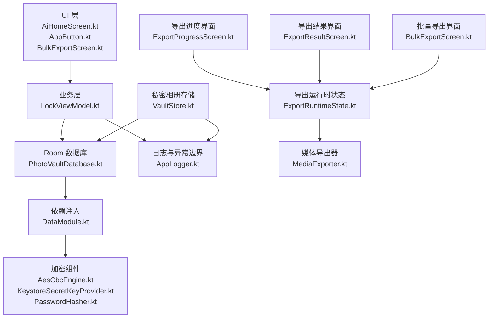
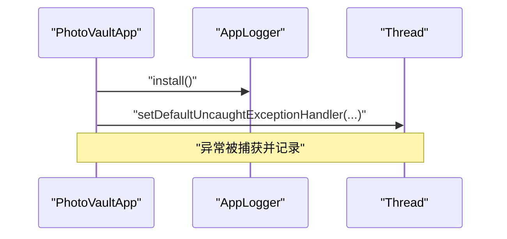
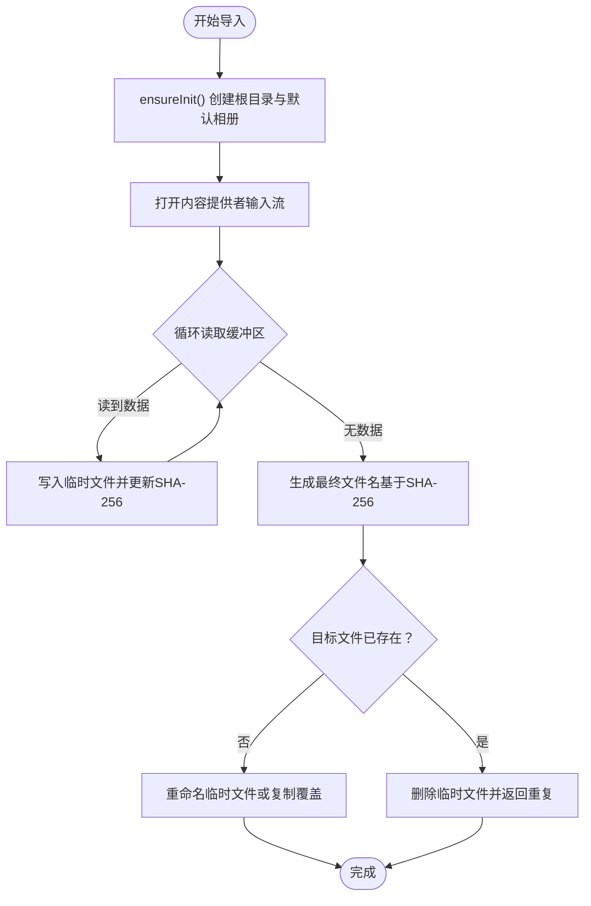
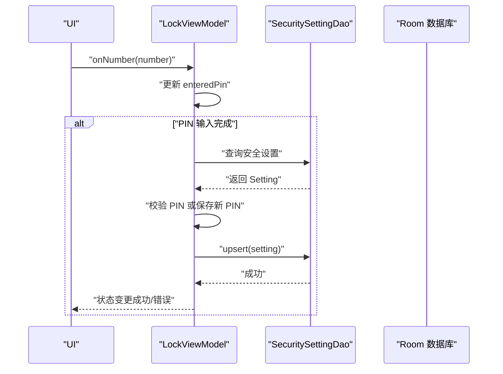
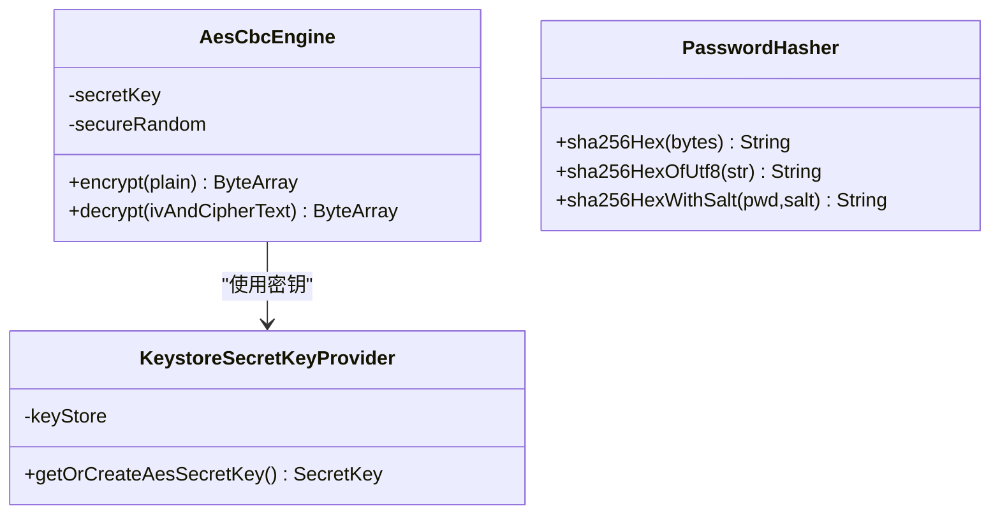
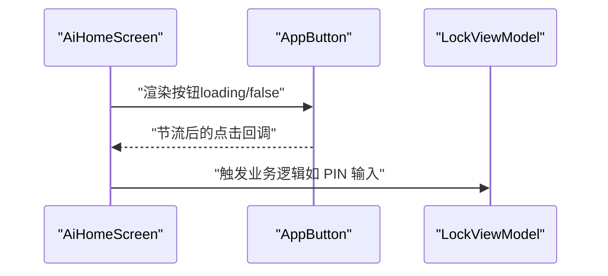
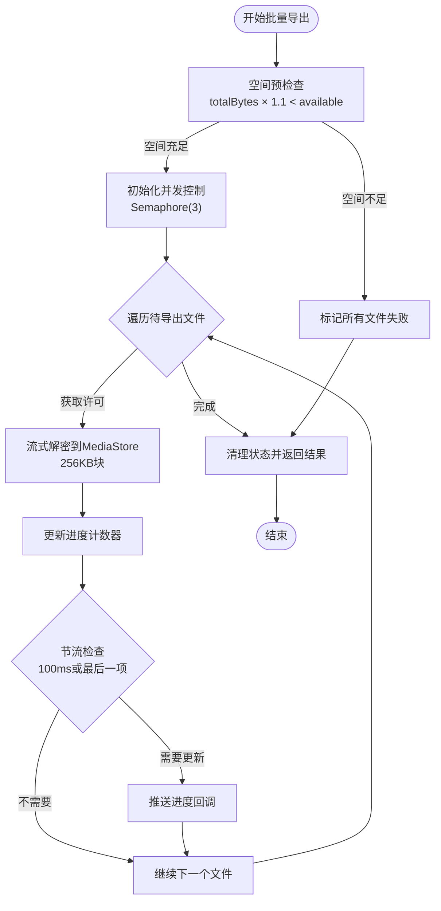
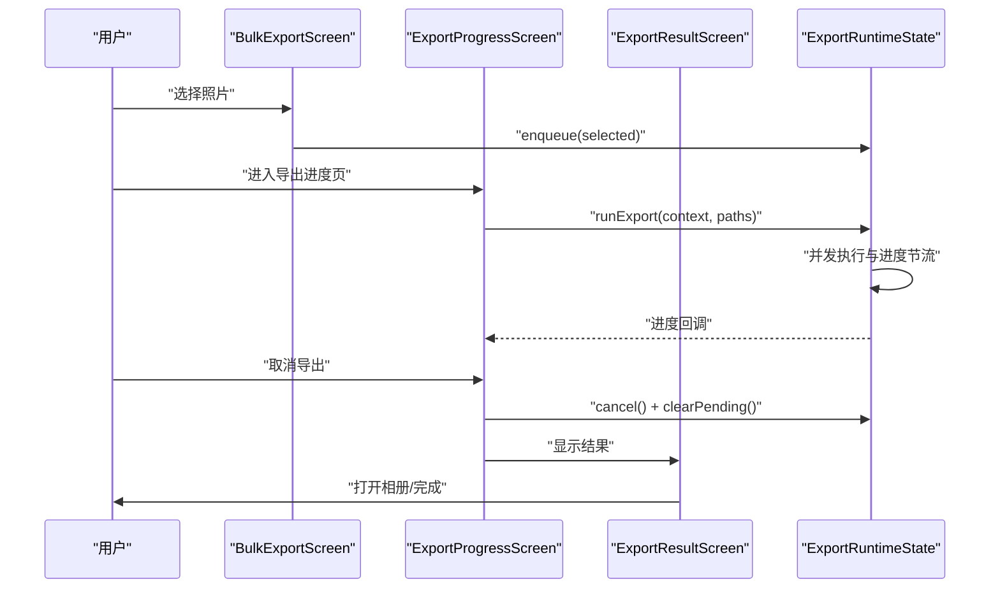
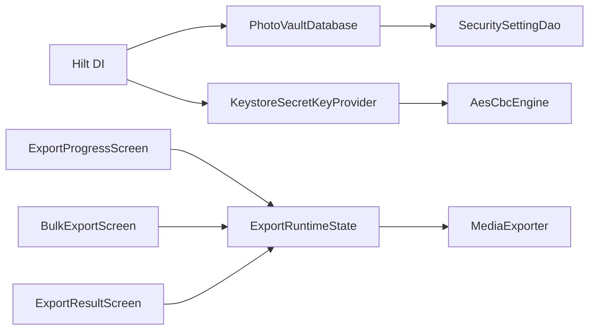

# 性能优化

<cite>
**本文引用的文件**
- [ExportRuntimeState.kt](file://android/app/src/main/kotlin/com/xpx/vault/ui/export/ExportRuntimeState.kt)
- [MediaExporter.kt](file://android/app/src/main/kotlin/com/xpx/vault/ui/export/MediaExporter.kt)
- [ExportProgressScreen.kt](file://android/app/src/main/kotlin/com/xpx/vault/ui/ExportProgressScreen.kt)
- [BulkExportScreen.kt](file://android/app/src/main/kotlin/com/xpx/vault/ui/BulkExportScreen.kt)
- [ExportResultScreen.kt](file://android/app/src/main/kotlin/com/xpx/vault/ui/ExportResultScreen.kt)
- [VaultStore.kt](file://android/app/src/main/kotlin/com/xpx/vault/ui/vault/VaultStore.kt)
- [PhotoVaultApp.kt](file://android/app/src/main/kotlin/com/xpx/vault/ui/PhotoVaultApp.kt)
- [AppLogger.kt](file://android/app/src/main/kotlin/com/xpx/vault/ui/AppLogger.kt)
- [AiHomeScreen.kt](file://android/app/src/main/kotlin/com/xpx/vault/ui/AiHomeScreen.kt)
- [VaultStore.kt](file://android/app/src/main/kotlin/com/xpx/vault/ui/vault/VaultStore.kt)
- [LockViewModel.kt](file://android/app/src/main/kotlin/com/xpx/vault/ui/lock/LockViewModel.kt)
- [PhotoVaultDatabase.kt](file://android/core/data/src/main/kotlin/com/xpx/vault/data/db/PhotoVaultDatabase.kt)
- [DataModule.kt](file://android/core/data/src/main/kotlin/com/xpx/vault/data/di/DataModule.kt)
- [AesCbcEngine.kt](file://android/core/data/src/main/kotlin/com/xpx/vault/data/crypto/AesCbcEngine.kt)
- [KeystoreSecretKeyProvider.kt](file://android/core/data/src/main/kotlin/com/xpx/vault/data/crypto/KeystoreSecretKeyProvider.kt)
- [PasswordHasher.kt](file://android/core/data/src/main/kotlin/com/xpx/vault/data/crypto/PasswordHasher.kt)
- [AppButton.kt](file://android/app/src/main/kotlin/com/xpx/vault/ui/components/AppButton.kt)
- [build.gradle.kts（应用）](file://android/app/build.gradle.kts)
- [06-AI打码.md（iOS 文档）](file://doc/ios/06-AI打码.md)
- [成熟三方库推荐（Android-iOS）.md](file://doc/成熟三方库推荐（Android-iOS）.md)
</cite>

## 更新摘要
**变更内容**
- 新增导出功能性能优化章节，涵盖并发执行控制、空间预检查、进度报告节流等优化措施
- 更新导出流程架构图，展示完整的导出性能优化策略
- 增加MediaExporter的流式解密和高性能文件拷贝优化
- 补充导出进度监控和取消机制的性能考量

## 目录
1. [简介](#简介)
2. [项目结构](#项目结构)
3. [核心组件](#核心组件)
4. [架构总览](#架构总览)
5. [详细组件分析](#详细组件分析)
6. [依赖分析](#依赖分析)
7. [性能考虑](#性能考虑)
8. [故障排查指南](#故障排查指南)
9. [结论](#结论)
10. [附录](#附录)

## 简介
本指南面向性能工程师，围绕"AI照片保险库"项目提供系统性性能优化策略与实践，重点覆盖：
- 内存管理与对象生命周期、内存泄漏预防、垃圾回收优化
- 异步处理（协程、线程池、任务调度）
- IO优化（文件读写、网络请求、数据库查询）
- 缓存机制设计与实现
- 性能监控与分析工具使用
- 面向照片处理的专项优化（图像解码、AI推理加速）
- **新增**：导出功能性能优化（并发控制、空间预检查、进度节流）

## 项目结构
项目采用 Android 应用与核心模块分离的结构，应用层负责 UI、业务交互与日志异常边界，核心数据层负责数据库、加密与依赖注入。

```mermaid
graph TB
subgraph "应用层"
APP["PhotoVaultApp.kt"]
UI["AiHomeScreen.kt<br/>AppButton.kt"]
VM["LockViewModel.kt"]
STORE["VaultStore.kt"]
LOG["AppLogger.kt"]
END
subgraph "核心数据层"
DB["PhotoVaultDatabase.kt"]
DM["DataModule.kt"]
CRYPTO["AesCbcEngine.kt<br/>KeystoreSecretKeyProvider.kt<br/>PasswordHasher.kt"]
END
subgraph "导出功能层"
EXRT["ExportRuntimeState.kt"]
MEDIA["MediaExporter.kt"]
EXPROG["ExportProgressScreen.kt"]
BULK["BulkExportScreen.kt"]
EXRES["ExportResultScreen.kt"]
END
APP --> VM
UI --> VM
VM --> DB
STORE --> DB
STORE --> LOG
DB --> DM
DM --> CRYPTO
EXRT --> MEDIA
EXPROG --> EXRT
BULK --> EXRT
EXRES --> EXRT
```

**图表来源**
- [PhotoVaultApp.kt:1-31](file://android/app/src/main/kotlin/com/xpx/vault/ui/PhotoVaultApp.kt#L1-L31)
- [AiHomeScreen.kt:1-56](file://android/app/src/main/kotlin/com/xpx/vault/ui/AiHomeScreen.kt#L1-L56)
- [AppButton.kt:1-67](file://android/app/src/main/kotlin/com/xpx/vault/ui/components/AppButton.kt#L1-L67)
- [LockViewModel.kt:1-222](file://android/app/src/main/kotlin/com/xpx/vault/ui/lock/LockViewModel.kt#L1-L222)
- [VaultStore.kt:1-226](file://android/app/src/main/kotlin/com/xpx/vault/ui/vault/VaultStore.kt#L1-L226)
- [AppLogger.kt:1-43](file://android/app/src/main/kotlin/com/xpx/vault/ui/AppLogger.kt#L1-L43)
- [PhotoVaultDatabase.kt:1-36](file://android/core/data/src/main/kotlin/com/xpx/vault/data/db/PhotoVaultDatabase.kt#L1-L36)
- [DataModule.kt:1-40](file://android/core/data/src/main/kotlin/com/xpx/vault/data/di/DataModule.kt#L1-L40)
- [AesCbcEngine.kt:1-40](file://android/core/data/src/main/kotlin/com/xpx/vault/data/crypto/AesCbcEngine.kt#L1-L40)
- [KeystoreSecretKeyProvider.kt:1-42](file://android/core/data/src/main/kotlin/com/xpx/vault/data/crypto/KeystoreSecretKeyProvider.kt#L1-L42)
- [PasswordHasher.kt:1-26](file://android/core/data/src/main/kotlin/com/xpx/vault/data/crypto/PasswordHasher.kt#L1-L26)
- [ExportRuntimeState.kt:1-180](file://android/app/src/main/kotlin/com/xpx/vault/ui/export/ExportRuntimeState.kt#L1-L180)
- [MediaExporter.kt:1-232](file://android/app/src/main/kotlin/com/xpx/vault/ui/export/MediaExporter.kt#L1-L232)
- [ExportProgressScreen.kt:1-159](file://android/app/src/main/kotlin/com/xpx/vault/ui/ExportProgressScreen.kt#L1-L159)
- [BulkExportScreen.kt:1-341](file://android/app/src/main/kotlin/com/xpx/vault/ui/BulkExportScreen.kt#L1-L341)
- [ExportResultScreen.kt:1-134](file://android/app/src/main/kotlin/com/xpx/vault/ui/ExportResultScreen.kt#L1-L134)

**章节来源**
- [PhotoVaultApp.kt:1-31](file://android/app/src/main/kotlin/com/xpx/vault/ui/PhotoVaultApp.kt#L1-L31)
- [build.gradle.kts（应用）:1-91](file://android/app/build.gradle.kts#L1-L91)

## 核心组件
- 应用初始化与全局异常边界：在应用启动时安装日志与未捕获异常处理器，避免主线程阻塞与崩溃信息丢失。
- 数据库与依赖注入：通过 Hilt 提供单例数据库实例，Room 作为持久化层。
- 加密与安全：基于 Android Keystore 的 AES 密钥托管与 CBC/PKCS7 加解密。
- UI 与业务：Compose 屏幕与 ViewModel 负责 PIN 码解锁流程；VaultStore 负责私密相册的文件系统读写与缓存。
- **新增**：导出功能性能优化：ExportRuntimeState 提供并发控制、空间预检查、进度节流等优化；MediaExporter 实现流式解密和高性能文件拷贝。

**章节来源**
- [PhotoVaultApp.kt:12-30](file://android/app/src/main/kotlin/com/xpx/vault/ui/PhotoVaultApp.kt#L12-L30)
- [DataModule.kt:18-39](file://android/core/data/src/main/kotlin/com/xpx/vault/data/di/DataModule.kt#L18-L39)
- [PhotoVaultDatabase.kt:14-36](file://android/core/data/src/main/kotlin/com/xpx/vault/data/db/PhotoVaultDatabase.kt#L14-L36)
- [AesCbcEngine.kt:12-39](file://android/core/data/src/main/kotlin/com/xpx/vault/data/crypto/AesCbcEngine.kt#L12-L39)
- [KeystoreSecretKeyProvider.kt:12-35](file://android/core/data/src/main/kotlin/com/xpx/vault/data/crypto/KeystoreSecretKeyProvider.kt#L12-L35)
- [LockViewModel.kt:18-42](file://android/app/src/main/kotlin/com/xpx/vault/ui/lock/LockViewModel.kt#L18-L42)
- [VaultStore.kt:39-107](file://android/app/src/main/kotlin/com/xpx/vault/ui/vault/VaultStore.kt#L39-L107)
- [ExportRuntimeState.kt:61-67](file://android/app/src/main/kotlin/com/xpx/vault/ui/export/ExportRuntimeState.kt#L61-L67)
- [MediaExporter.kt:185-196](file://android/app/src/main/kotlin/com/xpx/vault/ui/export/MediaExporter.kt#L185-L196)

## 架构总览
应用层通过 ViewModel 与数据层交互，数据层通过 Room 访问数据库，并通过 Hilt 注入加密组件。UI 使用 Compose 进行声明式渲染，异步操作集中在协程与 IO 线程池中执行。**新增**：导出功能通过 ExportRuntimeState 统一管理并发、进度和错误处理，MediaExporter 负责具体的文件导出和解密操作。



**图表来源**
- [AiHomeScreen.kt:23-54](file://android/app/src/main/kotlin/com/xpx/vault/ui/AiHomeScreen.kt#L23-L54)
- [AppButton.kt:26-66](file://android/app/src/main/kotlin/com/xpx/vault/ui/components/AppButton.kt#L26-L66)
- [LockViewModel.kt:18-42](file://android/app/src/main/kotlin/com/xpx/vault/ui/lock/LockViewModel.kt#L18-L42)
- [PhotoVaultDatabase.kt:26-28](file://android/core/data/src/main/kotlin/com/xpx/vault/data/db/PhotoVaultDatabase.kt#L26-L28)
- [DataModule.kt:18-39](file://android/core/data/src/main/kotlin/com/xpx/vault/data/di/DataModule.kt#L18-L39)
- [AesCbcEngine.kt:12-39](file://android/core/data/src/main/kotlin/com/xpx/vault/data/crypto/AesCbcEngine.kt#L12-L39)
- [KeystoreSecretKeyProvider.kt:12-35](file://android/core/data/src/main/kotlin/com/xpx/vault/data/crypto/KeystoreSecretKeyProvider.kt#L12-L35)
- [PasswordHasher.kt:6-25](file://android/core/data/src/main/kotlin/com/xpx/vault/data/crypto/PasswordHasher.kt#L6-L25)
- [AppLogger.kt:9-29](file://android/app/src/main/kotlin/com/xpx/vault/ui/AppLogger.kt#L9-L29)
- [VaultStore.kt:39-107](file://android/app/src/main/kotlin/com/xpx/vault/ui/vault/VaultStore.kt#L39-L107)
- [ExportRuntimeState.kt:61-67](file://android/app/src/main/kotlin/com/xpx/vault/ui/export/ExportRuntimeState.kt#L61-L67)
- [MediaExporter.kt:185-196](file://android/app/src/main/kotlin/com/xpx/vault/ui/export/MediaExporter.kt#L185-L196)

## 详细组件分析

### 组件一：应用初始化与异常边界（内存与稳定性）
- 全局未捕获异常处理器：在应用启动时设置默认未捕获异常处理器，记录线程名与异常类型，确保崩溃可追踪。
- 日志裁剪：对过长日志进行截断，避免内存占用与日志溢出风险。
- 建议：结合 BuildConfig 控制日志级别；在 Debug 构建中启用更详细的日志，Release 中保持精简。



**图表来源**
- [PhotoVaultApp.kt:19-29](file://android/app/src/main/kotlin/com/xpx/vault/ui/PhotoVaultApp.kt#L19-L29)
- [AppLogger.kt:16-29](file://android/app/src/main/kotlin/com/xpx/vault/ui/AppLogger.kt#L16-L29)

**章节来源**
- [PhotoVaultApp.kt:12-30](file://android/app/src/main/kotlin/com/xpx/vault/ui/PhotoVaultApp.kt#L12-L30)
- [AppLogger.kt:16-42](file://android/app/src/main/kotlin/com/xpx/vault/ui/AppLogger.kt#L16-L42)

### 组件二：私密相册存储与缓存（内存与IO）
- 缓存策略：内存缓存快照与按相册的列表缓存，避免重复扫描文件系统。
- IO 与缓冲：导入照片时使用固定大小缓冲区进行流拷贝，计算 SHA-256 去重。
- 文件遍历：顶层目录遍历统计总数，注意大库场景下的遍历成本。
- 建议：对频繁访问的相册列表增加 LRU 缓存；对搜索结果限制返回数量；对导入过程增加进度回调与取消支持。



**图表来源**
- [VaultStore.kt:155-197](file://android/app/src/main/kotlin/com/xpx/vault/ui/vault/VaultStore.kt#L155-L197)

**章节来源**
- [VaultStore.kt:39-118](file://android/app/src/main/kotlin/com/xpx/vault/ui/vault/VaultStore.kt#L39-L118)

### 组件三：PIN 码解锁流程（协程与状态管理）
- 状态流：使用 StateFlow 管理 UI 状态，避免内存泄漏。
- 协程作用域：ViewModelScope 执行数据库读写与哈希计算，避免主线程阻塞。
- 建议：PIN 输入长度与错误计数持久化时，合并写入以减少事务次数；对 UI 输入进行节流。



**图表来源**
- [LockViewModel.kt:44-86](file://android/app/src/main/kotlin/com/xpx/vault/ui/lock/LockViewModel.kt#L44-L86)
- [LockViewModel.kt:153-184](file://android/app/src/main/kotlin/com/xpx/vault/ui/lock/LockViewModel.kt#L153-L184)

**章节来源**
- [LockViewModel.kt:18-42](file://android/app/src/main/kotlin/com/xpx/vault/ui/lock/LockViewModel.kt#L18-L42)
- [LockViewModel.kt:153-184](file://android/app/src/main/kotlin/com/xpx/vault/ui/lock/LockViewModel.kt#L153-L184)

### 组件四：加密与密钥管理（CPU 与安全）
- AES-256-CBC + PKCS7：前置 IV，与 Keystore 集成，密钥不可导出。
- 哈希：PIN 存储使用 SHA-256，可配合盐值。
- 建议：在高并发场景下复用 Cipher 实例或使用线程安全的工厂；对大块数据分片处理以降低峰值内存。



**图表来源**
- [AesCbcEngine.kt:12-39](file://android/core/data/src/main/kotlin/com/xpx/vault/data/crypto/AesCbcEngine.kt#L12-L39)
- [KeystoreSecretKeyProvider.kt:12-35](file://android/core/data/src/main/kotlin/com/xpx/vault/data/crypto/KeystoreSecretKeyProvider.kt#L12-L35)
- [PasswordHasher.kt:6-25](file://android/core/data/src/main/kotlin/com/xpx/vault/data/crypto/PasswordHasher.kt#L6-L25)

**章节来源**
- [AesCbcEngine.kt:12-39](file://android/core/data/src/main/kotlin/com/xpx/vault/data/crypto/AesCbcEngine.kt#L12-L39)
- [KeystoreSecretKeyProvider.kt:12-35](file://android/core/data/src/main/kotlin/com/xpx/vault/data/crypto/KeystoreSecretKeyProvider.kt#L12-L35)
- [PasswordHasher.kt:6-25](file://android/core/data/src/main/kotlin/com/xpx/vault/data/crypto/PasswordHasher.kt#L6-L25)

### 组件五：AI 页面与按钮交互（UI 性能与防抖）
- AI 页面当前为空状态，建议在实际实现中采用懒加载与占位图，避免首屏阻塞。
- 按钮组件使用节流点击与加载指示器，提升交互响应与反馈体验。



**图表来源**
- [AiHomeScreen.kt:24-54](file://android/app/src/main/kotlin/com/xpx/vault/ui/AiHomeScreen.kt#L24-L54)
- [AppButton.kt:26-66](file://android/app/src/main/kotlin/com/xpx/vault/ui/components/AppButton.kt#L26-L66)
- [LockViewModel.kt:44-86](file://android/app/src/main/kotlin/com/xpx/vault/ui/lock/LockViewModel.kt#L44-L86)

**章节来源**
- [AiHomeScreen.kt:23-54](file://android/app/src/main/kotlin/com/xpx/vault/ui/AiHomeScreen.kt#L23-L54)
- [AppButton.kt:26-66](file://android/app/src/main/kotlin/com/xpx/vault/ui/components/AppButton.kt#L26-L66)

### 组件六：导出功能性能优化（并发、空间检查、进度节流）
- **并发执行控制**：使用信号量限制最大并发度为3，平衡小图并行化和大视频IO带宽瓶颈。
- **空间预检查**：导出前计算总需求空间并检查可用空间，避免磁盘满导致的失败。
- **进度报告节流**：100ms节流间隔避免频繁触发Compose重组，最后一项必定全量更新。
- **支持取消**：协程取消时停止后续任务，已处理任务不受影响。
- **流式解密**：使用256KB块进行流式解密，避免整段明文载入内存。



**图表来源**
- [ExportRuntimeState.kt:72-153](file://android/app/src/main/kotlin/com/xpx/vault/ui/export/ExportRuntimeState.kt#L72-L153)
- [MediaExporter.kt:189-196](file://android/app/src/main/kotlin/com/xpx/vault/ui/export/MediaExporter.kt#L189-L196)

**章节来源**
- [ExportRuntimeState.kt:61-67](file://android/app/src/main/kotlin/com/xpx/vault/ui/export/ExportRuntimeState.kt#L61-L67)
- [ExportRuntimeState.kt:72-153](file://android/app/src/main/kotlin/com/xpx/vault/ui/export/ExportRuntimeState.kt#L72-L153)
- [MediaExporter.kt:185-196](file://android/app/src/main/kotlin/com/xpx/vault/ui/export/MediaExporter.kt#L185-L196)

### 组件七：导出界面与交互（进度监控与取消）
- **进度监控**：ExportProgressScreen 实时显示完成数量、总数量和当前处理文件名。
- **取消机制**：支持系统返回键拦截和确认对话框，协程取消时清理状态。
- **批量选择**：BulkExportScreen 提供网格选择和过滤功能，支持全选/反选。
- **结果展示**：ExportResultScreen 展示成功/失败统计和一键打开相册功能。



**图表来源**
- [BulkExportScreen.kt:169-177](file://android/app/src/main/kotlin/com/xpx/vault/ui/BulkExportScreen.kt#L169-177)
- [ExportProgressScreen.kt:58-81](file://android/app/src/main/kotlin/com/xpx/vault/ui/ExportProgressScreen.kt#L58-81)
- [ExportResultScreen.kt:38-112](file://android/app/src/main/kotlin/com/xpx/vault/ui/ExportResultScreen.kt#L38-112)

**章节来源**
- [BulkExportScreen.kt:57-179](file://android/app/src/main/kotlin/com/xpx/vault/ui/BulkExportScreen.kt#L57-179)
- [ExportProgressScreen.kt:42-159](file://android/app/src/main/kotlin/com/xpx/vault/ui/ExportProgressScreen.kt#L42-159)
- [ExportResultScreen.kt:37-134](file://android/app/src/main/kotlin/com/xpx/vault/ui/ExportResultScreen.kt#L37-134)

## 依赖分析
- Hilt 提供数据库与加密组件的单例注入，降低重复创建成本。
- Room 数据库通过单例持有，避免多次初始化开销。
- 加密组件与 Keystore 集成，保证密钥安全与跨进程一致性。
- **新增**：导出功能依赖关系清晰分离，ExportRuntimeState 独立管理状态，MediaExporter 专注具体导出逻辑。



**图表来源**
- [DataModule.kt:18-39](file://android/core/data/src/main/kotlin/com/xpx/vault/data/di/DataModule.kt#L18-L39)
- [PhotoVaultDatabase.kt:26-28](file://android/core/data/src/main/kotlin/com/xpx/vault/data/db/PhotoVaultDatabase.kt#L26-L28)
- [KeystoreSecretKeyProvider.kt:12-35](file://android/core/data/src/main/kotlin/com/xpx/vault/data/crypto/KeystoreSecretKeyProvider.kt#L12-L35)
- [AesCbcEngine.kt:12-39](file://android/core/data/src/main/kotlin/com/xpx/vault/data/crypto/AesCbcEngine.kt#L12-L39)
- [ExportRuntimeState.kt:28-59](file://android/app/src/main/kotlin/com/xpx/vault/ui/export/ExportRuntimeState.kt#L28-L59)
- [MediaExporter.kt:28-53](file://android/app/src/main/kotlin/com/xpx/vault/ui/export/MediaExporter.kt#L28-53)

**章节来源**
- [DataModule.kt:18-39](file://android/core/data/src/main/kotlin/com/xpx/vault/data/di/DataModule.kt#L18-L39)
- [PhotoVaultDatabase.kt:26-28](file://android/core/data/src/main/kotlin/com/xpx/vault/data/db/PhotoVaultDatabase.kt#L26-L28)

## 性能考虑

### 内存管理与对象生命周期
- 单例与作用域
  - 使用 Hilt 单例提供数据库与加密组件，避免重复创建。
  - ViewModel 使用 ViewModelScope，生命周期与 UI 绑定，避免泄漏。
- 缓存与去重
  - VaultStore 内存缓存快照与相册列表，减少重复 IO。
  - 导入时使用 SHA-256 去重，避免重复存储。
- **新增**：导出功能内存优化
  - 使用 synchronizedList 避免并发修改问题。
  - AtomicInteger 原子计数器避免锁竞争。
  - 流式解密避免整段明文载入内存。
- 建议
  - 对大对象（如图片）采用弱引用或 LRU 缓存，及时释放不再使用的资源。
  - 避免在 UI 线程中进行任何耗时操作，使用 Dispatchers.IO 或协程作用域。

**章节来源**
- [DataModule.kt:18-39](file://android/core/data/src/main/kotlin/com/xpx/vault/data/di/DataModule.kt#L18-L39)
- [LockViewModel.kt:18-42](file://android/app/src/main/kotlin/com/xpx/vault/ui/lock/LockViewModel.kt#L18-L42)
- [VaultStore.kt:40-58](file://android/app/src/main/kotlin/com/xpx/vault/ui/vault/VaultStore.kt#L40-L58)
- [ExportRuntimeState.kt:96-98](file://android/app/src/main/kotlin/com/xpx/vault/ui/export/ExportRuntimeState.kt#L96-L98)
- [MediaExporter.kt:189-196](file://android/app/src/main/kotlin/com/xpx/vault/ui/export/MediaExporter.kt#L189-L196)

### 异步处理与任务调度
- 协程与 IO 线程池
  - VaultStore 使用 Dispatchers.IO 执行文件系统操作，避免阻塞主线程。
  - LockViewModel 使用 viewModelScope 执行数据库与哈希计算。
  - **新增**：ExportRuntimeState 使用 coroutineScope 和 async 并发执行，Semaphore 控制并发度。
- **新增**：导出功能异步优化
  - 使用 withContext(Dispatchers.IO) 避免主线程阻塞。
  - async + awaitAll 实现批量任务并发执行。
  - ensureActive 支持协程取消。
- 建议
  - 对高频 UI 事件（如滚动、点击）使用节流或去抖。
  - 对批量任务（如导入多张照片）拆分为小批次，插入进度回调与取消支持。

**章节来源**
- [VaultStore.kt:47-154](file://android/app/src/main/kotlin/com/xpx/vault/ui/vault/VaultStore.kt#L47-L154)
- [LockViewModel.kt:18-42](file://android/app/src/main/kotlin/com/xpx/vault/ui/lock/LockViewModel.kt#L18-L42)
- [ExportRuntimeState.kt:102-148](file://android/app/src/main/kotlin/com/xpx/vault/ui/export/ExportRuntimeState.kt#L102-L148)

### IO 优化
- 文件读写
  - 使用固定大小缓冲区进行流拷贝，降低内存峰值。
  - 导入前先写入临时文件，最后原子重命名或复制覆盖，减少竞态。
  - **新增**：MediaExporter 实现高性能文件拷贝，优先使用 FileChannel.transferTo 零拷贝。
- 数据库查询
  - Room 默认单实例，避免重复构建。
  - 对频繁查询建立索引（如按时间排序、名称检索）。
- **新增**：导出功能IO优化
  - 流式解密避免整段明文载入内存。
  - 空间预检查避免磁盘满导致的IO失败。
  - MediaStore Binder 并行化处理大量小图。
- 建议
  - 对大库场景使用分页加载与懒加载。
  - 对导入/导出任务提供后台服务与通知栏进度。

**章节来源**
- [VaultStore.kt:120-154](file://android/app/src/main/kotlin/com/xpx/vault/ui/vault/VaultStore.kt#L120-L154)
- [PhotoVaultDatabase.kt:14-36](file://android/core/data/src/main/kotlin/com/xpx/vault/data/db/PhotoVaultDatabase.kt#L14-L36)
- [MediaExporter.kt:204-230](file://android/app/src/main/kotlin/com/xpx/vault/ui/export/MediaExporter.kt#L204-L230)
- [ExportRuntimeState.kt:77-94](file://android/app/src/main/kotlin/com/xpx/vault/ui/export/ExportRuntimeState.kt#L77-L94)

### 缓存机制设计与实现
- 内存缓存
  - 快照与相册列表缓存，命中率高时直接返回。
- L1/L2 缓存
  - 对热点数据（最近照片、常用相册）设置 TTL 与容量上限。
- **新增**：导出功能缓存策略
  - ExportRuntimeState 缓存最近一次导出结果。
  - VaultStore 内存缓存快照与相册列表。
- 建议
  - 使用 LRU 算法淘汰最久未使用项。
  - 对缓存失效策略（如文件变更、定时刷新）进行统一管理。

**章节来源**
- [VaultStore.kt:40-58](file://android/app/src/main/kotlin/com/xpx/vault/ui/vault/VaultStore.kt#L40-L58)
- [ExportRuntimeState.kt:38-40](file://android/app/src/main/kotlin/com/xpx/vault/ui/export/ExportRuntimeState.kt#L38-L40)

### 性能监控与分析工具
- 日志与异常
  - 使用 AppLogger 记录关键路径与异常，避免敏感信息泄露。
  - 全局未捕获异常处理器确保崩溃可追踪。
- **新增**：导出功能监控
  - 进度节流避免过度重组开销。
  - 空间检查失败时记录详细原因。
  - 导出结果统计便于性能分析。
- 建议
  - 在 Debug 构建中开启更详细的日志与性能埋点。
  - 结合系统 Profiler（CPU/内存/IO）定位热点函数与内存增长。

**章节来源**
- [AppLogger.kt:16-42](file://android/app/src/main/kotlin/com/xpx/vault/ui/AppLogger.kt#L16-L42)
- [PhotoVaultApp.kt:19-29](file://android/app/src/main/kotlin/com/xpx/vault/ui/PhotoVaultApp.kt#L19-L29)
- [ExportRuntimeState.kt:134-144](file://android/app/src/main/kotlin/com/xpx/vault/ui/export/ExportRuntimeState.kt#L134-L144)

### 针对照片处理的专项优化
- 图像解码优化
  - 使用成熟的图片库（如 Android 推荐的 Coil/Glide）进行异步解码与缓存。
  - 对缩略图采用合适的尺寸与色彩空间，避免过度解码。
- AI 推理加速
  - 参考 iOS 文档中的 TensorFlow Lite + Metal Delegate 方案，Android 可采用同等模型与管线。
  - 推理与像素处理在后台线程执行，主线程只做结果刷新。
- **新增**：导出功能专项优化
  - 流式解密避免整段明文载入内存，使用256KB块处理。
  - MediaStore Binder 并行化处理大量小图，最大并发3个。
  - 空间预检查避免磁盘满导致的失败，提高成功率。
  - 进度节流100ms避免频繁重组，提升UI响应性。
- 建议
  - 对 ROI 区域处理采用最小化处理范围。
  - 对模型输入进行批量化与预处理流水线优化。

**章节来源**
- [06-AI打码.md（iOS 文档）:11-22](file://doc/ios/06-AI打码.md#L11-L22)
- [成熟三方库推荐（Android-iOS）.md:59-68](file://doc/成熟三方库推荐（Android-iOS）.md#L59-L68)
- [MediaExporter.kt:185-196](file://android/app/src/main/kotlin/com/xpx/vault/ui/export/MediaExporter.kt#L185-L196)
- [ExportRuntimeState.kt:61-67](file://android/app/src/main/kotlin/com/xpx/vault/ui/export/ExportRuntimeState.kt#L61-L67)

## 故障排查指南
- 崩溃与异常
  - 全局未捕获异常处理器会记录线程名与异常类型，便于定位。
  - 日志裁剪避免超长日志导致的性能问题。
- 导入失败
  - 检查内容提供者输入流是否可打开；确认临时文件写入与重命名流程。
  - 去重失败时检查 SHA-256 计算与文件名生成逻辑。
- PIN 码错误
  - 核对哈希计算与数据库写入；关注错误计数与提示文案。
- **新增**：导出功能故障排查
  - **空间不足**：检查 totalBytes × 1.1 与 availableBytes 比较逻辑。
  - **并发问题**：确认 Semaphore(3) 是否正确释放许可。
  - **进度不更新**：验证节流机制（100ms）和最后一项强制更新。
  - **取消无效**：检查 ensureActive 和协程取消传播。
  - **解密失败**：确认流式解密256KB块是否正确处理EOF。

**章节来源**
- [PhotoVaultApp.kt:19-29](file://android/app/src/main/kotlin/com/xpx/vault/ui/PhotoVaultApp.kt#L19-L29)
- [AppLogger.kt:22-29](file://android/app/src/main/kotlin/com/xpx/vault/ui/AppLogger.kt#L22-L29)
- [VaultStore.kt:120-154](file://android/app/src/main/kotlin/com/xpx/vault/ui/vault/VaultStore.kt#L120-L154)
- [LockViewModel.kt:168-184](file://android/app/src/main/kotlin/com/xpx/vault/ui/lock/LockViewModel.kt#L168-L184)
- [ExportRuntimeState.kt:84-94](file://android/app/src/main/kotlin/com/xpx/vault/ui/export/ExportRuntimeState.kt#L84-L94)
- [ExportRuntimeState.kt:105-114](file://android/app/src/main/kotlin/com/xpx/vault/ui/export/ExportRuntimeState.kt#L105-L114)
- [ExportRuntimeState.kt:134-144](file://android/app/src/main/kotlin/com/xpx/vault/ui/export/ExportRuntimeState.kt#L134-L144)

## 结论
本指南从内存管理、异步处理、IO 优化、缓存设计、监控分析以及照片处理专项优化六个维度，给出了面向"AI照片保险库"的系统性优化策略。**新增**的导出功能性能优化涵盖了并发执行控制、空间预检查、进度报告节流等关键技术，确保在大量照片导出场景下的稳定与高性能。建议在实际落地时结合 Profiler 与日志埋点持续迭代，针对不同设备性能差异进行调优。

## 附录
- 构建与混淆
  - 应用层启用了代码压缩与资源收缩，有助于减小包体与提升冷启动性能。
- 依赖与第三方库
  - 推荐使用成熟的图片加载与 AI 推理库，减少自研成本与风险。
- **新增**：导出功能最佳实践
  - 根据设备性能调整并发度（默认3），低端设备可适当降低。
  - 对于超大文件导出，考虑分批处理避免内存压力。
  - 定期清理导出临时文件，避免磁盘空间浪费。

**章节来源**
- [build.gradle.kts（应用）:37-48](file://android/app/build.gradle.kts#L37-L48)
- [成熟三方库推荐（Android-iOS）.md:9-16](file://doc/成熟三方库推荐（Android-iOS）.md#L9-L16)
- [成熟三方库推荐（Android-iOS）.md:59-68](file://doc/成熟三方库推荐（Android-iOS）.md#L59-L68)
- [ExportRuntimeState.kt:61-67](file://android/app/src/main/kotlin/com/xpx/vault/ui/export/ExportRuntimeState.kt#L61-L67)
- [MediaExporter.kt:204-230](file://android/app/src/main/kotlin/com/xpx/vault/ui/export/MediaExporter.kt#L204-L230)