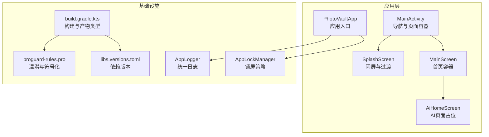
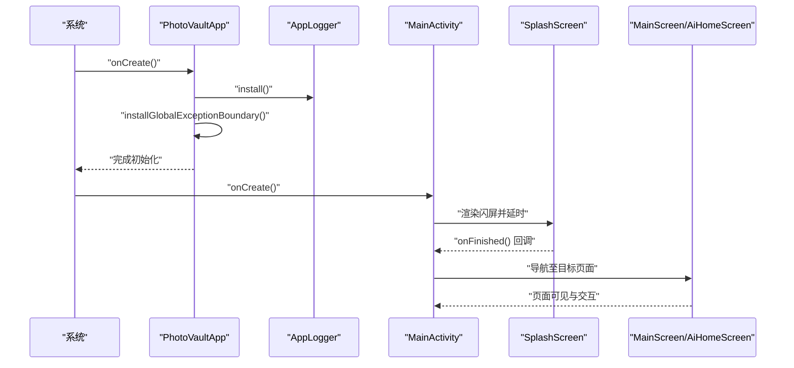
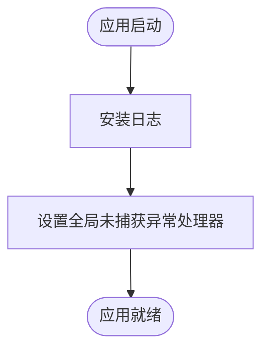
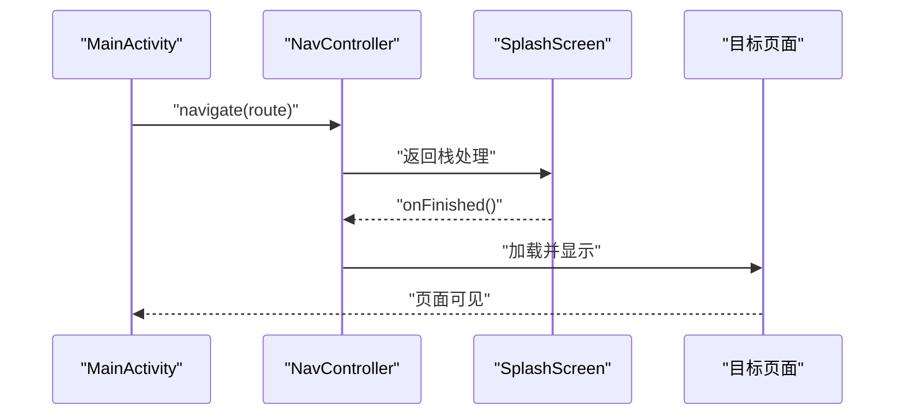
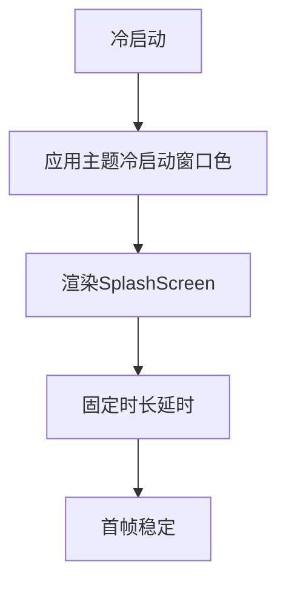
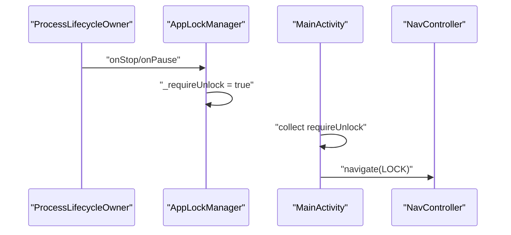
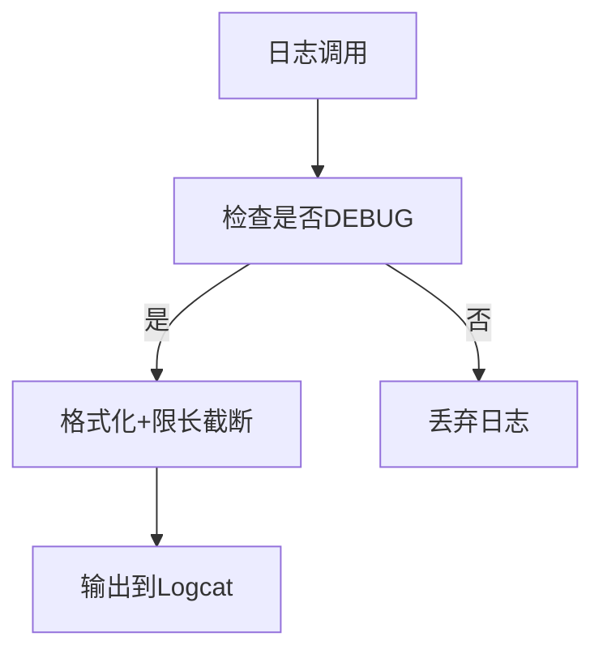
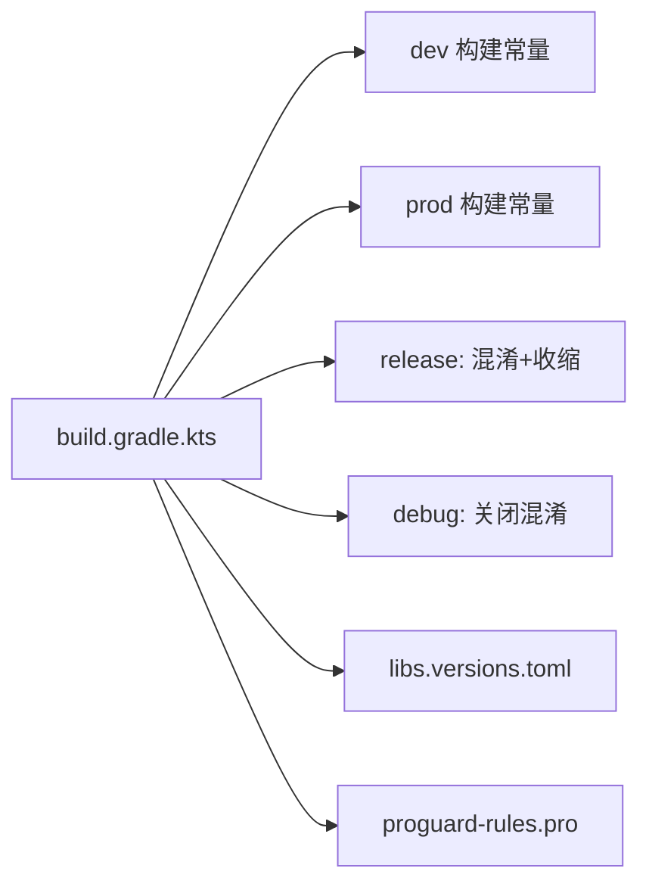

# 性能监控与分析

<cite>
**本文引用的文件**
- [android/app/src/main/kotlin/com/photovault/app/PhotoVaultApp.kt](file://android/app/src/main/kotlin/com/photovault/app/PhotoVaultApp.kt)
- [android/app/src/main/kotlin/com/photovault/app/MainActivity.kt](file://android/app/src/main/kotlin/com/photovault/app/MainActivity.kt)
- [android/app/src/main/kotlin/com/photovault/app/AppLogger.kt](file://android/app/src/main/kotlin/com/photovault/app/AppLogger.kt)
- [android/app/src/main/kotlin/com/photovault/app/AppLockManager.kt](file://android/app/src/main/kotlin/com/photovault/app/AppLockManager.kt)
- [android/app/src/main/kotlin/com/photovault/app/ui/SplashScreen.kt](file://android/app/src/main/kotlin/com/photovault/app/ui/SplashScreen.kt)
- [android/app/src/main/kotlin/com/photovault/app/ui/MainScreen.kt](file://android/app/src/main/kotlin/com/photovault/app/ui/MainScreen.kt)
- [android/app/src/main/kotlin/com/photovault/app/ui/AiHomeScreen.kt](file://android/app/src/main/kotlin/com/photovault/app/ui/AiHomeScreen.kt)
- [android/app/src/main/kotlin/com/photovault/app/ui/lock/LockViewModel.kt](file://android/app/src/main/kotlin/com/photovault/app/ui/lock/LockViewModel.kt)
- [android/app/src/main/res/values/colors.xml](file://android/app/src/main/res/values/colors.xml)
- [android/app/build.gradle.kts](file://android/app/build.gradle.kts)
- [android/app/proguard-rules.pro](file://android/app/proguard-rules.pro)
- [android/gradle/libs.versions.toml](file://android/gradle/libs.versions.toml)
- [doc/android/11-Firebase监控.md](file://doc/android/11-Firebase监控.md)
</cite>

## 目录
1. [简介](#简介)
2. [项目结构](#项目结构)
3. [核心组件](#核心组件)
4. [架构总览](#架构总览)
5. [详细组件分析](#详细组件分析)
6. [依赖分析](#依赖分析)
7. [性能考虑](#性能考虑)
8. [故障排查指南](#故障排查指南)
9. [结论](#结论)
10. [附录](#附录)

## 简介
本指南面向“AI照片保险库”项目的性能监控与分析，聚焦Android端的性能工具使用（Systrace、Perfetto、Android Studio Profiler）、关键性能指标（KPI）定义与监控、APM集成方案（自定义埋点、异常监控、用户体验追踪）、性能数据分析方法（瓶颈识别、趋势分析、回归检测）、生产环境监控策略（采样率、上报与隐私保护），以及问题诊断与解决流程。文档基于仓库现有代码与文档进行提炼，确保可操作性与落地性。

## 项目结构
项目采用多模块结构，Android应用位于 android/app，核心领域与数据模块位于 android/core。应用入口为 PhotoVaultApp，UI导航由 MainActivity 驱动，SplashScreen 负责冷启动窗口与过渡动画，MainScreen 作为首页容器承载多个子页面（如 AI 页面、相机页、设置页等）。

**图表来源**
- [android/app/src/main/kotlin/com/photovault/app/PhotoVaultApp.kt:1-31](file://android/app/src/main/kotlin/com/photovault/app/PhotoVaultApp.kt#L1-L31)
- [android/app/src/main/kotlin/com/photovault/app/MainActivity.kt:1-265](file://android/app/src/main/kotlin/com/photovault/app/MainActivity.kt#L1-L265)
- [android/app/src/main/kotlin/com/photovault/app/ui/SplashScreen.kt:43-90](file://android/app/src/main/kotlin/com/photovault/app/ui/SplashScreen.kt#L43-L90)
- [android/app/src/main/kotlin/com/photovault/app/ui/MainScreen.kt:1-82](file://android/app/src/main/kotlin/com/photovault/app/ui/MainScreen.kt#L1-L82)
- [android/app/src/main/kotlin/com/photovault/app/ui/AiHomeScreen.kt:1-56](file://android/app/src/main/kotlin/com/photovault/app/ui/AiHomeScreen.kt#L1-L56)
- [android/app/src/main/kotlin/com/photovault/app/AppLogger.kt:1-43](file://android/app/src/main/kotlin/com/photovault/app/AppLogger.kt#L1-L43)
- [android/app/src/main/kotlin/com/photovault/app/AppLockManager.kt:1-49](file://android/app/src/main/kotlin/com/photovault/app/AppLockManager.kt#L1-L49)
- [android/app/build.gradle.kts:1-91](file://android/app/build.gradle.kts#L1-L91)
- [android/app/proguard-rules.pro:1-10](file://android/app/proguard-rules.pro#L1-L10)
- [android/gradle/libs.versions.toml:1-64](file://android/gradle/libs.versions.toml#L1-L64)

**章节来源**
- [android/app/src/main/kotlin/com/photovault/app/PhotoVaultApp.kt:1-31](file://android/app/src/main/kotlin/com/photovault/app/PhotoVaultApp.kt#L1-L31)
- [android/app/src/main/kotlin/com/photovault/app/MainActivity.kt:1-265](file://android/app/src/main/kotlin/com/photovault/app/MainActivity.kt#L1-L265)
- [android/app/src/main/kotlin/com/photovault/app/ui/SplashScreen.kt:43-90](file://android/app/src/main/kotlin/com/photovault/app/ui/SplashScreen.kt#L43-L90)
- [android/app/src/main/kotlin/com/photovault/app/ui/MainScreen.kt:1-82](file://android/app/src/main/kotlin/com/photovault/app/ui/MainScreen.kt#L1-L82)
- [android/app/src/main/kotlin/com/photovault/app/ui/AiHomeScreen.kt:1-56](file://android/app/src/main/kotlin/com/photovault/app/ui/AiHomeScreen.kt#L1-L56)
- [android/app/src/main/kotlin/com/photovault/app/AppLogger.kt:1-43](file://android/app/src/main/kotlin/com/photovault/app/AppLogger.kt#L1-L43)
- [android/app/src/main/kotlin/com/photovault/app/AppLockManager.kt:1-49](file://android/app/src/main/kotlin/com/photovault/app/AppLockManager.kt#L1-L49)
- [android/app/build.gradle.kts:1-91](file://android/app/build.gradle.kts#L1-L91)
- [android/app/proguard-rules.pro:1-10](file://android/app/proguard-rules.pro#L1-L10)
- [android/gradle/libs.versions.toml:1-64](file://android/gradle/libs.versions.toml#L1-L64)

## 核心组件
- 应用入口与全局异常边界：PhotoVaultApp 在 Application 阶段安装日志与全局未捕获异常处理器，确保崩溃与异常可被记录与传递。
- 导航与页面容器：MainActivity 使用 Compose Navigation 构建页面栈与路由跳转；MainScreen 作为首页容器，通过 alpha/zIndex 控制多个子页面的可见性与层级。
- 闪屏与冷启动窗口：SplashScreen 提供固定时长的过渡动画与延时，配合主题中的冷启动窗口背景色，减少白屏感知。
- 日志与隐私：AppLogger 提供统一日志入口，限制单行长度并避免敏感信息输出；当前一期不接入第三方APM，依赖Logcat与Play控制台。
- 锁屏策略：AppLockManager 基于进程生命周期在合适时机触发锁屏，避免频繁锁屏影响体验。

**章节来源**
- [android/app/src/main/kotlin/com/photovault/app/PhotoVaultApp.kt:12-30](file://android/app/src/main/kotlin/com/photovault/app/PhotoVaultApp.kt#L12-L30)
- [android/app/src/main/kotlin/com/photovault/app/MainActivity.kt:46-246](file://android/app/src/main/kotlin/com/photovault/app/MainActivity.kt#L46-L246)
- [android/app/src/main/kotlin/com/photovault/app/ui/SplashScreen.kt:43-90](file://android/app/src/main/kotlin/com/photovault/app/ui/SplashScreen.kt#L43-L90)
- [android/app/src/main/res/values/colors.xml:1-5](file://android/app/src/main/res/values/colors.xml#L1-L5)
- [android/app/src/main/kotlin/com/photovault/app/AppLogger.kt:16-29](file://android/app/src/main/kotlin/com/photovault/app/AppLogger.kt#L16-L29)
- [android/app/src/main/kotlin/com/photovault/app/AppLockManager.kt:17-47](file://android/app/src/main/kotlin/com/photovault/app/AppLockManager.kt#L17-L47)

## 架构总览
下图展示从应用启动到页面导航的关键交互路径，以及与性能观测相关的节点（日志、锁屏策略、闪屏过渡）。

**图表来源**
- [android/app/src/main/kotlin/com/photovault/app/PhotoVaultApp.kt:12-30](file://android/app/src/main/kotlin/com/photovault/app/PhotoVaultApp.kt#L12-L30)
- [android/app/src/main/kotlin/com/photovault/app/MainActivity.kt:46-246](file://android/app/src/main/kotlin/com/photovault/app/MainActivity.kt#L46-L246)
- [android/app/src/main/kotlin/com/photovault/app/ui/SplashScreen.kt:43-90](file://android/app/src/main/kotlin/com/photovault/app/ui/SplashScreen.kt#L43-L90)
- [android/app/src/main/kotlin/com/photovault/app/ui/MainScreen.kt:14-80](file://android/app/src/main/kotlin/com/photovault/app/ui/MainScreen.kt#L14-L80)
- [android/app/src/main/kotlin/com/photovault/app/ui/AiHomeScreen.kt:24-54](file://android/app/src/main/kotlin/com/photovault/app/ui/AiHomeScreen.kt#L24-L54)

## 详细组件分析

### 组件A：应用启动与异常边界
- 关键点
  - Application.onCreate 中安装日志与全局未捕获异常处理器，便于崩溃与异常追踪。
  - 通过线程默认异常处理器记录线程名与异常类型，保留前序处理器以便透传。
- 性能意义
  - 早期异常可被快速定位，有助于缩短故障恢复时间；日志限长避免超大日志影响IO。

**图表来源**
- [android/app/src/main/kotlin/com/photovault/app/PhotoVaultApp.kt:12-30](file://android/app/src/main/kotlin/com/photovault/app/PhotoVaultApp.kt#L12-L30)

**章节来源**
- [android/app/src/main/kotlin/com/photovault/app/PhotoVaultApp.kt:12-30](file://android/app/src/main/kotlin/com/photovault/app/PhotoVaultApp.kt#L12-L30)

### 组件B：导航与页面切换延迟
- 关键点
  - MainActivity 使用 NavHost 与 rememberNavController 管理页面栈；页面间跳转通过 navigate 实现。
  - MainScreen 通过 alpha/zIndex 控制多个子页面的可见性，避免重复创建与销毁带来的抖动。
- 性能意义
  - 减少不必要的重组与重建，降低页面切换延迟；合理使用 launchSingleTop 与 restoreState 控制行为。

**图表来源**
- [android/app/src/main/kotlin/com/photovault/app/MainActivity.kt:76-242](file://android/app/src/main/kotlin/com/photovault/app/MainActivity.kt#L76-L242)
- [android/app/src/main/kotlin/com/photovault/app/ui/MainScreen.kt:31-79](file://android/app/src/main/kotlin/com/photovault/app/ui/MainScreen.kt#L31-L79)

**章节来源**
- [android/app/src/main/kotlin/com/photovault/app/MainActivity.kt:76-242](file://android/app/src/main/kotlin/com/photovault/app/MainActivity.kt#L76-L242)
- [android/app/src/main/kotlin/com/photovault/app/ui/MainScreen.kt:31-79](file://android/app/src/main/kotlin/com/photovault/app/ui/MainScreen.kt#L31-L79)

### 组件C：闪屏与冷启动窗口
- 关键点
  - SplashScreen 提供固定时长的过渡动画与延时，避免过早进入UI导致的闪烁。
  - 主题中配置了与闪屏主色一致的冷启动窗口背景色，减少白屏感知。
- 性能意义
  - 冷启动窗口颜色与闪屏一致可提升感知速度；合理的延时保证首帧稳定。

**图表来源**
- [android/app/src/main/kotlin/com/photovault/app/ui/SplashScreen.kt:43-90](file://android/app/src/main/kotlin/com/photovault/app/ui/SplashScreen.kt#L43-L90)
- [android/app/src/main/res/values/colors.xml:3-4](file://android/app/src/main/res/values/colors.xml#L3-L4)

**章节来源**
- [android/app/src/main/kotlin/com/photovault/app/ui/SplashScreen.kt:43-90](file://android/app/src/main/kotlin/com/photovault/app/ui/SplashScreen.kt#L43-L90)
- [android/app/src/main/res/values/colors.xml:3-4](file://android/app/src/main/res/values/colors.xml#L3-L4)

### 组件D：锁屏策略与后台可见性
- 关键点
  - AppLockManager 基于进程生命周期在 onStop/onPause 时触发锁屏需求，避免频繁锁屏。
  - MainActivity 通过收集 requireUnlock 并在合适时机导航至锁屏。
- 性能意义
  - 合理的锁屏策略减少不必要的页面跳转与状态保存，降低后台可见性带来的资源占用。

**图表来源**
- [android/app/src/main/kotlin/com/photovault/app/AppLockManager.kt:37-47](file://android/app/src/main/kotlin/com/photovault/app/AppLockManager.kt#L37-L47)
- [android/app/src/main/kotlin/com/photovault/app/MainActivity.kt:60-74](file://android/app/src/main/kotlin/com/photovault/app/MainActivity.kt#L60-L74)

**章节来源**
- [android/app/src/main/kotlin/com/photovault/app/AppLockManager.kt:37-47](file://android/app/src/main/kotlin/com/photovault/app/AppLockManager.kt#L37-L47)
- [android/app/src/main/kotlin/com/photovault/app/MainActivity.kt:60-74](file://android/app/src/main/kotlin/com/photovault/app/MainActivity.kt#L60-L74)

### 组件E：日志与隐私
- 关键点
  - AppLogger 提供统一日志入口，限制单行最大长度并格式化输出；DEBUG 构建下才输出。
  - 一期不接入第三方APM，依赖Logcat与Play控制台崩溃报告。
- 性能意义
  - 限长与格式化减少日志体积与解析成本；DEBUG开关避免发布版日志噪音。

**图表来源**
- [android/app/src/main/kotlin/com/photovault/app/AppLogger.kt:16-29](file://android/app/src/main/kotlin/com/photovault/app/AppLogger.kt#L16-L29)

**章节来源**
- [android/app/src/main/kotlin/com/photovault/app/AppLogger.kt:16-29](file://android/app/src/main/kotlin/com/photovault/app/AppLogger.kt#L16-L29)
- [doc/android/11-Firebase监控.md:10-13](file://doc/android/11-Firebase监控.md#L10-L13)

## 依赖分析
- 构建与产物类型：release 开启混淆与资源收缩，debug 关闭混淆；flavor 区分 dev/prod 并注入编译常量。
- 依赖版本：Compose、Navigation、Hilt、Room、CameraX、Biometric 等版本在 libs.versions.toml 中集中管理。
- 混淆规则：保留 Hilt/Room/反射相关类，保留源文件与行号信息，便于发布后符号化。

**图表来源**
- [android/app/build.gradle.kts:22-48](file://android/app/build.gradle.kts#L22-L48)
- [android/gradle/libs.versions.toml:1-64](file://android/gradle/libs.versions.toml#L1-L64)
- [android/app/proguard-rules.pro:1-10](file://android/app/proguard-rules.pro#L1-L10)

**章节来源**
- [android/app/build.gradle.kts:22-48](file://android/app/build.gradle.kts#L22-L48)
- [android/gradle/libs.versions.toml:1-64](file://android/gradle/libs.versions.toml#L1-L64)
- [android/app/proguard-rules.pro:1-10](file://android/app/proguard-rules.pro#L1-L10)

## 性能考虑
- 启动时间
  - 冷启动窗口颜色与闪屏一致，减少感知延迟；SplashScreen 固定时长延时保证首帧稳定。
  - 构建类型：release 开启混淆与资源收缩，有助于减小包体与启动开销。
- 页面切换延迟
  - 使用 alpha/zIndex 控制页面可见性，避免频繁重建；合理使用 navigate 的 launchSingleTop 与 restoreState。
- 内存使用峰值
  - 通过 AppLockManager 的生命周期策略减少后台可见性；避免在页面中持有过大的不可回收对象。
- 日志与隐私
  - DEBUG 构建下输出日志，发布版避免日志噪音；日志限长与脱敏，避免敏感信息泄露。

**章节来源**
- [android/app/src/main/kotlin/com/photovault/app/ui/SplashScreen.kt:43-90](file://android/app/src/main/kotlin/com/photovault/app/ui/SplashScreen.kt#L43-L90)
- [android/app/src/main/res/values/colors.xml:3-4](file://android/app/src/main/res/values/colors.xml#L3-L4)
- [android/app/build.gradle.kts:36-48](file://android/app/build.gradle.kts#L36-L48)
- [android/app/src/main/kotlin/com/photovault/app/MainActivity.kt:76-242](file://android/app/src/main/kotlin/com/photovault/app/MainActivity.kt#L76-L242)
- [android/app/src/main/kotlin/com/photovault/app/AppLogger.kt:16-29](file://android/app/src/main/kotlin/com/photovault/app/AppLogger.kt#L16-L29)

## 故障排查指南
- 全局异常边界
  - 若出现未捕获异常，全局处理器会记录线程名与异常类型，便于定位问题来源。
- 日志与脱敏
  - 使用 AppLogger 输出日志，确保不包含敏感信息；DEBUG 构建下查看 Logcat。
- 生产环境崩溃与ANR
  - 依赖 Google Play 控制台提供的崩溃/ANR 报告；必要时自建轻量日志文件（注意不落敏感数据）。
- 锁屏策略
  - 若频繁锁屏影响体验，检查 AppLockManager 的生命周期回调与 MainActivity 的导航逻辑。

**章节来源**
- [android/app/src/main/kotlin/com/photovault/app/PhotoVaultApp.kt:19-29](file://android/app/src/main/kotlin/com/photovault/app/PhotoVaultApp.kt#L19-L29)
- [android/app/src/main/kotlin/com/photovault/app/AppLogger.kt:16-29](file://android/app/src/main/kotlin/com/photovault/app/AppLogger.kt#L16-L29)
- [doc/android/11-Firebase监控.md:10-13](file://doc/android/11-Firebase监控.md#L10-L13)
- [android/app/src/main/kotlin/com/photovault/app/AppLockManager.kt:37-47](file://android/app/src/main/kotlin/com/photovault/app/AppLockManager.kt#L37-L47)
- [android/app/src/main/kotlin/com/photovault/app/MainActivity.kt:60-74](file://android/app/src/main/kotlin/com/photovault/app/MainActivity.kt#L60-L74)

## 结论
本指南基于仓库现有代码与文档，梳理了应用启动、导航、闪屏、日志与锁屏等关键路径的性能要点，并结合构建配置与混淆规则提出优化建议。对于APM集成，当前一期暂不实施第三方SDK，后续可按接口注入方式平滑接入，同时确保隐私合规与数据安全。

## 附录
- Android性能工具使用建议
  - Systrace/Perfetto：采集系统与应用层面的CPU、内存、IO事件，定位卡顿与阻塞点。
  - Android Studio Profiler：监控CPU、内存、网络与能耗，关注主线程耗时与GC频率。
  - Logcat：结合 AppLogger 的标签与限长策略，筛选关键日志进行分析。
- 关键性能指标（KPI）
  - 启动时间：冷启动到首帧稳定的时间；可通过闪屏延时与首帧统计衡量。
  - 页面切换延迟：页面跳转到可见的时延；通过导航与alpha/zIndex策略优化。
  - 内存使用峰值：关注页面栈与缓存对象的峰值；避免大对象驻留。
  - 崩溃与ANR：依赖Play控制台与日志分析，建立阈值与报警机制。
- APM集成方案（建议）
  - 接口注入：通过 AnalyticsService/CrashReporter/PerformanceTracer 等接口注入，避免Domain直连第三方。
  - 自定义埋点：围绕关键路径（启动、页面切换、功能使用）埋点，结合采样率控制数据规模。
  - 异常监控：全局异常边界与日志脱敏，结合崩溃报告进行趋势分析。
  - 用户体验追踪：结合页面可见性与交互时序，评估用户感知质量。
- 生产环境监控策略
  - 采样率控制：对高频事件进行采样，平衡精度与性能。
  - 数据上报：异步批量上报，避免主线程阻塞；失败重试与队列容量控制。
  - 隐私保护：严格脱敏与最小化采集，遵守数据安全与隐私政策。