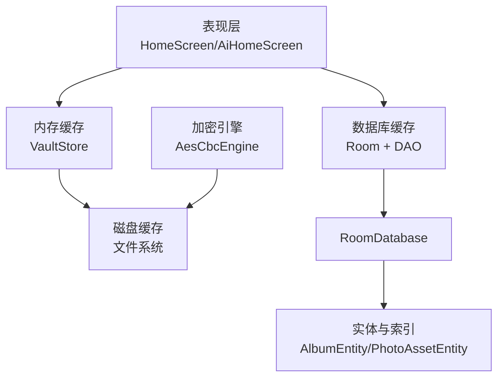
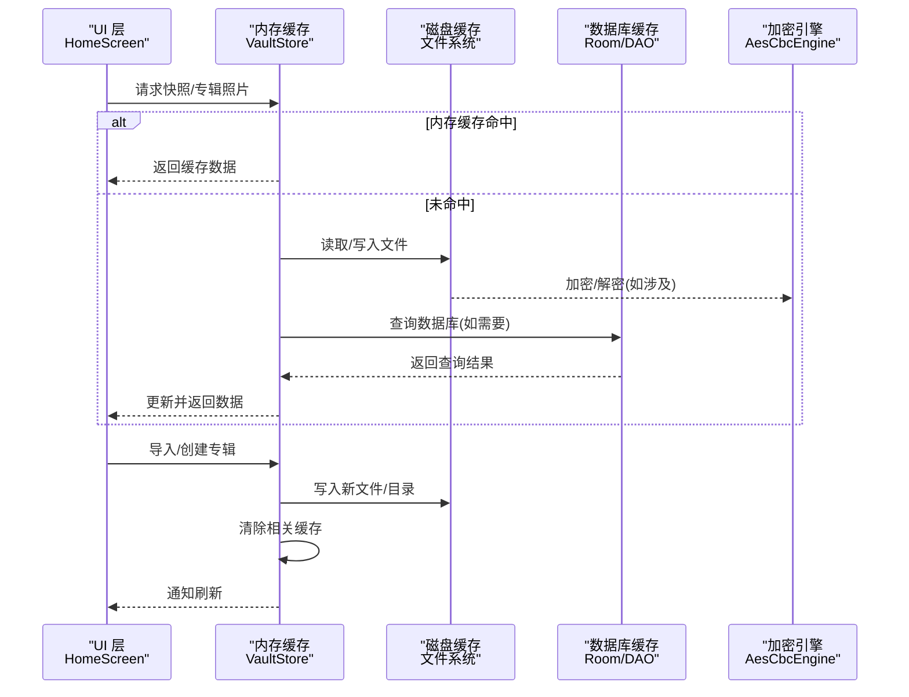
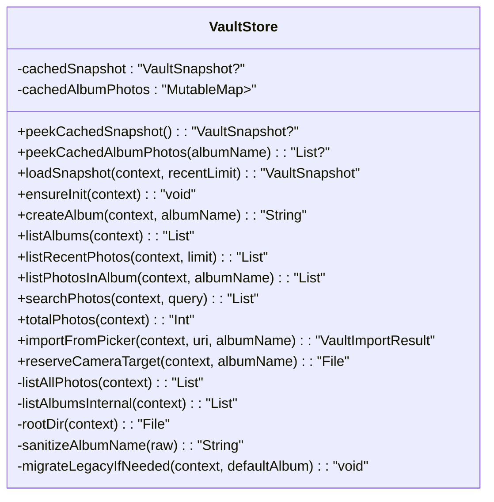
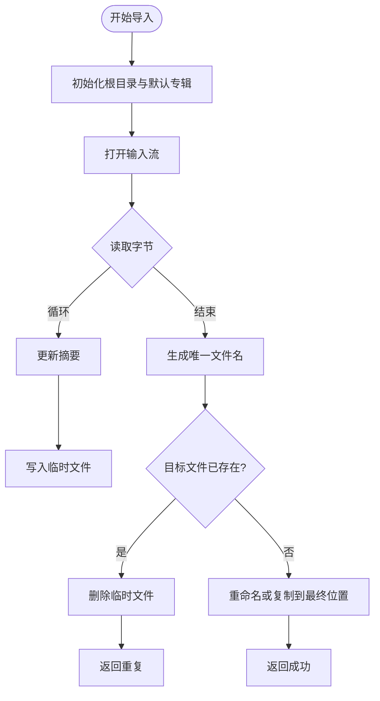
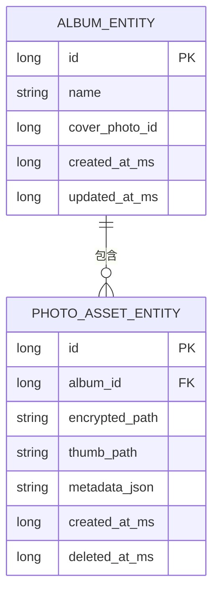
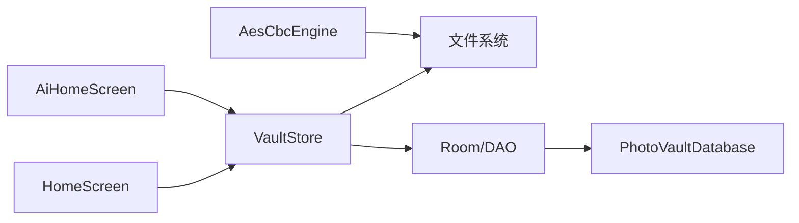

# 缓存策略设计

<cite>
**本文引用的文件**
- [android/app/src/main/kotlin/com/photovault/app/ui/vault/VaultStore.kt](file://android/app/src/main/kotlin/com/photovault/app/ui/vault/VaultStore.kt)
- [android/app/src/main/kotlin/com/photovault/app/ui/HomeScreen.kt](file://android/app/src/main/kotlin/com/photovault/app/ui/HomeScreen.kt)
- [android/app/src/main/kotlin/com/photovault/app/ui/AiHomeScreen.kt](file://android/app/src/main/kotlin/com/photovault/app/ui/AiHomeScreen.kt)
- [android/core/data/src/main/kotlin/com/photovault/data/db/PhotoVaultDatabase.kt](file://android/core/data/src/main/kotlin/com/photovault/data/db/PhotoVaultDatabase.kt)
- [android/core/data/src/main/kotlin/com/photovault/data/db/dao/AlbumDao.kt](file://android/core/data/src/main/kotlin/com/photovault/data/db/dao/AlbumDao.kt)
- [android/core/data/src/main/kotlin/com/photovault/data/db/dao/SecuritySettingDao.kt](file://android/core/data/src/main/kotlin/com/photovault/data/db/dao/SecuritySettingDao.kt)
- [android/core/data/src/main/kotlin/com/photovault/data/db/entity/AlbumEntity.kt](file://android/core/data/src/main/kotlin/com/photovault/data/db/entity/AlbumEntity.kt)
- [android/core/data/src/main/kotlin/com/photovault/data/db/entity/PhotoAssetEntity.kt](file://android/core/data/src/main/kotlin/com/photovault/data/db/entity/PhotoAssetEntity.kt)
- [android/core/data/src/main/kotlin/com/photovault/data/di/DataModule.kt](file://android/core/data/src/main/kotlin/com/photovault/data/di/DataModule.kt)
- [android/core/data/src/main/kotlin/com/photovault/data/crypto/AesCbcEngine.kt](file://android/core/data/src/main/kotlin/com/photovault/data/crypto/AesCbcEngine.kt)
- [android/core/data/src/main/kotlin/com/photovault/data/crypto/KeystoreSecretKeyProvider.kt](file://android/core/data/src/main/kotlin/com/photovault/data/crypto/KeystoreSecretKeyProvider.kt)
- [spec/私密相册 App（一期）原生双端架构设计方案.md](file://spec/私密相册 App（一期）原生双端架构设计方案.md)
</cite>

## 目录
1. [简介](#简介)
2. [项目结构](#项目结构)
3. [核心组件](#核心组件)
4. [架构总览](#架构总览)
5. [详细组件分析](#详细组件分析)
6. [依赖分析](#依赖分析)
7. [性能考量](#性能考量)
8. [故障排查指南](#故障排查指南)
9. [结论](#结论)
10. [附录](#附录)

## 简介
本指南面向“AI照片保险库”项目，围绕多层级缓存架构进行系统化设计，涵盖内存缓存、磁盘缓存与数据库缓存的协同策略，以及针对图片资源、数据库查询结果与AI推理结果的缓存优化方案。同时给出缓存一致性保障机制（更新、失效、并发控制）与性能监控、调优方法，帮助开发者构建稳定、高效、可维护的缓存体系。

## 项目结构
从缓存视角看，项目主要涉及三层：
- 表现层缓存：UI侧对快照与专辑照片的内存缓存
- 数据层缓存：Room数据库查询结果与索引优化
- 存储层缓存：文件系统中的图片与缩略图缓存

图表来源
- [android/app/src/main/kotlin/com/photovault/app/ui/HomeScreen.kt](file://android/app/src/main/kotlin/com/photovault/app/ui/HomeScreen.kt)
- [android/app/src/main/kotlin/com/photovault/app/ui/AiHomeScreen.kt](file://android/app/src/main/kotlin/com/photovault/app/ui/AiHomeScreen.kt)
- [android/app/src/main/kotlin/com/photovault/app/ui/vault/VaultStore.kt](file://android/app/src/main/kotlin/com/photovault/app/ui/vault/VaultStore.kt)
- [android/core/data/src/main/kotlin/com/photovault/data/db/PhotoVaultDatabase.kt](file://android/core/data/src/main/kotlin/com/photovault/data/db/PhotoVaultDatabase.kt)
- [android/core/data/src/main/kotlin/com/photovault/data/db/dao/AlbumDao.kt](file://android/core/data/src/main/kotlin/com/photovault/data/db/dao/AlbumDao.kt)
- [android/core/data/src/main/kotlin/com/photovault/data/db/entity/AlbumEntity.kt](file://android/core/data/src/main/kotlin/com/photovault/data/db/entity/AlbumEntity.kt)
- [android/core/data/src/main/kotlin/com/photovault/data/db/entity/PhotoAssetEntity.kt](file://android/core/data/src/main/kotlin/com/photovault/data/db/entity/PhotoAssetEntity.kt)
- [android/core/data/src/main/kotlin/com/photovault/data/crypto/AesCbcEngine.kt](file://android/core/data/src/main/kotlin/com/photovault/data/crypto/AesCbcEngine.kt)

章节来源
- [android/app/src/main/kotlin/com/photovault/app/ui/HomeScreen.kt](file://android/app/src/main/kotlin/com/photovault/app/ui/HomeScreen.kt)
- [android/app/src/main/kotlin/com/photovault/app/ui/AiHomeScreen.kt](file://android/app/src/main/kotlin/com/photovault/app/ui/AiHomeScreen.kt)
- [android/app/src/main/kotlin/com/photovault/app/ui/vault/VaultStore.kt](file://android/app/src/main/kotlin/com/photovault/app/ui/vault/VaultStore.kt)
- [android/core/data/src/main/kotlin/com/photovault/data/db/PhotoVaultDatabase.kt](file://android/core/data/src/main/kotlin/com/photovault/data/db/PhotoVaultDatabase.kt)
- [android/core/data/src/main/kotlin/com/photovault/data/db/dao/AlbumDao.kt](file://android/core/data/src/main/kotlin/com/photovault/data/db/dao/AlbumDao.kt)
- [android/core/data/src/main/kotlin/com/photovault/data/db/entity/AlbumEntity.kt](file://android/core/data/src/main/kotlin/com/photovault/data/db/entity/AlbumEntity.kt)
- [android/core/data/src/main/kotlin/com/photovault/data/db/entity/PhotoAssetEntity.kt](file://android/core/data/src/main/kotlin/com/photovault/data/db/entity/PhotoAssetEntity.kt)
- [android/core/data/src/main/kotlin/com/photovault/data/crypto/AesCbcEngine.kt](file://android/core/data/src/main/kotlin/com/photovault/data/crypto/AesCbcEngine.kt)

## 核心组件
- VaultStore：负责私密相册的内存缓存与磁盘读写，提供快照、专辑照片、导入等操作的缓存与更新。
- Room数据库与DAO：提供持久化查询缓存与索引加速，结合Flow观察数据变化。
- 加密引擎：为磁盘上的图片与元数据提供安全存储，间接影响缓存命中与IO开销。

章节来源
- [android/app/src/main/kotlin/com/photovault/app/ui/vault/VaultStore.kt](file://android/app/src/main/kotlin/com/photovault/app/ui/vault/VaultStore.kt)
- [android/core/data/src/main/kotlin/com/photovault/data/db/PhotoVaultDatabase.kt](file://android/core/data/src/main/kotlin/com/photovault/data/db/PhotoVaultDatabase.kt)
- [android/core/data/src/main/kotlin/com/photovault/data/db/dao/AlbumDao.kt](file://android/core/data/src/main/kotlin/com/photovault/data/db/dao/AlbumDao.kt)
- [android/core/data/src/main/kotlin/com/photovault/data/crypto/AesCbcEngine.kt](file://android/core/data/src/main/kotlin/com/photovault/data/crypto/AesCbcEngine.kt)

## 架构总览
下图展示了UI、内存缓存、磁盘缓存与数据库之间的交互关系，以及缓存更新与失效的关键节点。

图表来源
- [android/app/src/main/kotlin/com/photovault/app/ui/HomeScreen.kt](file://android/app/src/main/kotlin/com/photovault/app/ui/HomeScreen.kt)
- [android/app/src/main/kotlin/com/photovault/app/ui/vault/VaultStore.kt](file://android/app/src/main/kotlin/com/photovault/app/ui/vault/VaultStore.kt)
- [android/core/data/src/main/kotlin/com/photovault/data/crypto/AesCbcEngine.kt](file://android/core/data/src/main/kotlin/com/photovault/data/crypto/AesCbcEngine.kt)

## 详细组件分析

### 内存缓存：VaultStore
- 快照缓存：保存最近一次聚合快照，避免重复计算与IO。
- 专辑照片缓存：按专辑名缓存照片列表，减少重复遍历文件系统。
- 更新策略：导入、创建专辑、迁移旧目录等操作后，清理或更新相关缓存键，确保一致性。

图表来源
- [android/app/src/main/kotlin/com/photovault/app/ui/vault/VaultStore.kt](file://android/app/src/main/kotlin/com/photovault/app/ui/vault/VaultStore.kt)

章节来源
- [android/app/src/main/kotlin/com/photovault/app/ui/vault/VaultStore.kt](file://android/app/src/main/kotlin/com/photovault/app/ui/vault/VaultStore.kt)

### 磁盘缓存：文件系统与图片资源
- 目录结构：根目录下按专辑名组织图片，支持默认专辑与旧版迁移。
- 缓存策略：
  - 缩略图缓存：UI层在展示封面与网格缩略图时，通过缩略图最大边长参数控制解码尺寸，降低内存占用。
  - 原图缓存：导入与拍摄生成的原图按命名规则存放，避免重复写入与重复计算。
  - 去重策略：基于内容摘要生成唯一文件名，避免重复导入。
- IO优化：批量导入时按批次写入，减少频繁IO与元数据更新。

图表来源
- [android/app/src/main/kotlin/com/photovault/app/ui/vault/VaultStore.kt](file://android/app/src/main/kotlin/com/photovault/app/ui/vault/VaultStore.kt)

章节来源
- [android/app/src/main/kotlin/com/photovault/app/ui/vault/VaultStore.kt](file://android/app/src/main/kotlin/com/photovault/app/ui/vault/VaultStore.kt)

### 数据库查询缓存与索引优化
- 实体与索引：
  - 相册实体：按更新时间建立索引，加速排序与分页。
  - 照片资产实体：按专辑ID与删除时间建立索引，加速查询与归档。
- DAO查询：
  - 使用Flow观察全部相册，实现响应式更新。
  - 查询按索引字段排序，减少排序开销。
- 缓存策略：
  - 列表类查询优先走索引，避免全表扫描。
  - 结合UI生命周期，在页面可见时触发刷新，不可见时停止刷新，降低无效查询。

图表来源
- [android/core/data/src/main/kotlin/com/photovault/data/db/entity/AlbumEntity.kt](file://android/core/data/src/main/kotlin/com/photovault/data/db/entity/AlbumEntity.kt)
- [android/core/data/src/main/kotlin/com/photovault/data/db/entity/PhotoAssetEntity.kt](file://android/core/data/src/main/kotlin/com/photovault/data/db/entity/PhotoAssetEntity.kt)

章节来源
- [android/core/data/src/main/kotlin/com/photovault/data/db/dao/AlbumDao.kt](file://android/core/data/src/main/kotlin/com/photovault/data/db/dao/AlbumDao.kt)
- [android/core/data/src/main/kotlin/com/photovault/data/db/dao/SecuritySettingDao.kt](file://android/core/data/src/main/kotlin/com/photovault/data/db/dao/SecuritySettingDao.kt)
- [android/core/data/src/main/kotlin/com/photovault/data/db/entity/AlbumEntity.kt](file://android/core/data/src/main/kotlin/com/photovault/data/db/entity/AlbumEntity.kt)
- [android/core/data/src/main/kotlin/com/photovault/data/db/entity/PhotoAssetEntity.kt](file://android/core/data/src/main/kotlin/com/photovault/data/db/entity/PhotoAssetEntity.kt)

### AI推理结果缓存方案
- 中间结果缓存：对预处理后的Tensor或中间特征向量进行短期缓存，避免重复计算。
- 模型权重缓存：模型文件常驻磁盘，加载时进行校验与版本管理。
- 计算结果复用：对相同输入（如相同ROI区域、相同分辨率）的结果进行键值缓存，命中则直接复用。
- 线程与队列：推理与图像处理在后台队列执行，完成后回到主线程刷新UI，避免阻塞。

章节来源
- [spec/私密相册 App（一期）原生双端架构设计方案.md](file://spec/私密相册 App（一期）原生双端架构设计方案.md)

### 缓存一致性保证机制
- 缓存更新：导入、创建专辑、删除等操作后，主动清除或更新相关内存缓存键。
- 失效通知：UI通过LaunchedEffect与生命周期监听，在页面恢复时刷新缓存。
- 并发控制：所有磁盘IO在IO调度器执行，避免阻塞主线程；UI层通过协程作用域管理并发任务。

章节来源
- [android/app/src/main/kotlin/com/photovault/app/ui/HomeScreen.kt](file://android/app/src/main/kotlin/com/photovault/app/ui/HomeScreen.kt)
- [android/app/src/main/kotlin/com/photovault/app/ui/vault/VaultStore.kt](file://android/app/src/main/kotlin/com/photovault/app/ui/vault/VaultStore.kt)

## 依赖分析
- VaultStore依赖文件系统与内存缓存容器，承担缓存的读写与失效。
- UI层通过HomeScreen与AiHomeScreen触发缓存读写，并根据生命周期自动刷新。
- 数据库层通过Room与DAO提供查询缓存与索引优化，结合Flow实现响应式更新。
- 加密引擎为磁盘缓存提供安全保障，间接影响缓存IO与命中率。

图表来源
- [android/app/src/main/kotlin/com/photovault/app/ui/HomeScreen.kt](file://android/app/src/main/kotlin/com/photovault/app/ui/HomeScreen.kt)
- [android/app/src/main/kotlin/com/photovault/app/ui/AiHomeScreen.kt](file://android/app/src/main/kotlin/com/photovault/app/ui/AiHomeScreen.kt)
- [android/app/src/main/kotlin/com/photovault/app/ui/vault/VaultStore.kt](file://android/app/src/main/kotlin/com/photovault/app/ui/vault/VaultStore.kt)
- [android/core/data/src/main/kotlin/com/photovault/data/db/PhotoVaultDatabase.kt](file://android/core/data/src/main/kotlin/com/photovault/data/db/PhotoVaultDatabase.kt)
- [android/core/data/src/main/kotlin/com/photovault/data/crypto/AesCbcEngine.kt](file://android/core/data/src/main/kotlin/com/photovault/data/crypto/AesCbcEngine.kt)

章节来源
- [android/app/src/main/kotlin/com/photovault/app/ui/HomeScreen.kt](file://android/app/src/main/kotlin/com/photovault/app/ui/HomeScreen.kt)
- [android/app/src/main/kotlin/com/photovault/app/ui/AiHomeScreen.kt](file://android/app/src/main/kotlin/com/photovault/app/ui/AiHomeScreen.kt)
- [android/app/src/main/kotlin/com/photovault/app/ui/vault/VaultStore.kt](file://android/app/src/main/kotlin/com/photovault/app/ui/vault/VaultStore.kt)
- [android/core/data/src/main/kotlin/com/photovault/data/db/PhotoVaultDatabase.kt](file://android/core/data/src/main/kotlin/com/photovault/data/db/PhotoVaultDatabase.kt)
- [android/core/data/src/main/kotlin/com/photovault/data/crypto/AesCbcEngine.kt](file://android/core/data/src/main/kotlin/com/photovault/data/crypto/AesCbcEngine.kt)

## 性能考量
- 内存缓存命中率：通过快照与专辑列表缓存，减少重复计算与IO。
- 磁盘IO优化：批量导入、去重与按需解码，降低磁盘压力。
- 数据库索引：按更新时间与专辑ID建立索引，提升查询效率。
- 线程模型：IO与UI分离，后台队列执行重任务，避免卡顿。
- 缓存粒度：缩略图按最大边长动态解码，平衡清晰度与内存占用。

章节来源
- [spec/私密相册 App（一期）原生双端架构设计方案.md](file://spec/私密相册 App（一期）原生双端架构设计方案.md)

## 故障排查指南
- 导入失败：检查输入流是否可打开、临时文件写入是否成功、最终文件是否存在。
- 重复导入：确认内容摘要生成与唯一文件名逻辑是否正确。
- 缓存不一致：确认导入后是否调用了缓存清理或更新逻辑。
- 数据库查询异常：检查索引是否存在、查询SQL是否符合索引字段。

章节来源
- [android/app/src/main/kotlin/com/photovault/app/ui/vault/VaultStore.kt](file://android/app/src/main/kotlin/com/photovault/app/ui/vault/VaultStore.kt)
- [android/core/data/src/main/kotlin/com/photovault/data/db/dao/AlbumDao.kt](file://android/core/data/src/main/kotlin/com/photovault/data/db/dao/AlbumDao.kt)

## 结论
本设计以VaultStore为核心，结合文件系统磁盘缓存与Room数据库查询缓存，形成多层级缓存体系。通过内存缓存、索引优化与IO策略，兼顾性能与一致性。AI推理结果缓存方案建议引入中间结果与模型权重缓存，进一步提升离线体验。建议持续监控缓存命中率、查询延迟与IO吞吐，并根据实际数据规模调整缓存策略与索引设计。

## 附录
- 关键实现路径参考：
  - 内存缓存与磁盘导入：[android/app/src/main/kotlin/com/photovault/app/ui/vault/VaultStore.kt](file://android/app/src/main/kotlin/com/photovault/app/ui/vault/VaultStore.kt)
  - UI刷新与生命周期：[android/app/src/main/kotlin/com/photovault/app/ui/HomeScreen.kt](file://android/app/src/main/kotlin/com/photovault/app/ui/HomeScreen.kt)
  - 数据库与DAO：[android/core/data/src/main/kotlin/com/photovault/data/db/PhotoVaultDatabase.kt](file://android/core/data/src/main/kotlin/com/photovault/data/db/PhotoVaultDatabase.kt)、[android/core/data/src/main/kotlin/com/photovault/data/db/dao/AlbumDao.kt](file://android/core/data/src/main/kotlin/com/photovault/data/db/dao/AlbumDao.kt)
  - 加密与密钥：[android/core/data/src/main/kotlin/com/photovault/data/crypto/AesCbcEngine.kt](file://android/core/data/src/main/kotlin/com/photovault/data/crypto/AesCbcEngine.kt)、[android/core/data/src/main/kotlin/com/photovault/data/crypto/KeystoreSecretKeyProvider.kt](file://android/core/data/src/main/kotlin/com/photovault/data/crypto/KeystoreSecretKeyProvider.kt)
  - 架构与性能建议：[spec/私密相册 App（一期）原生双端架构设计方案.md](file://spec/私密相册 App（一期）原生双端架构设计方案.md)