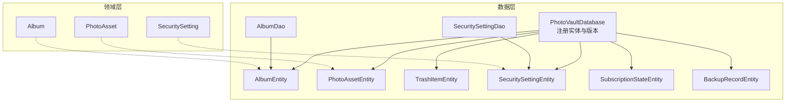
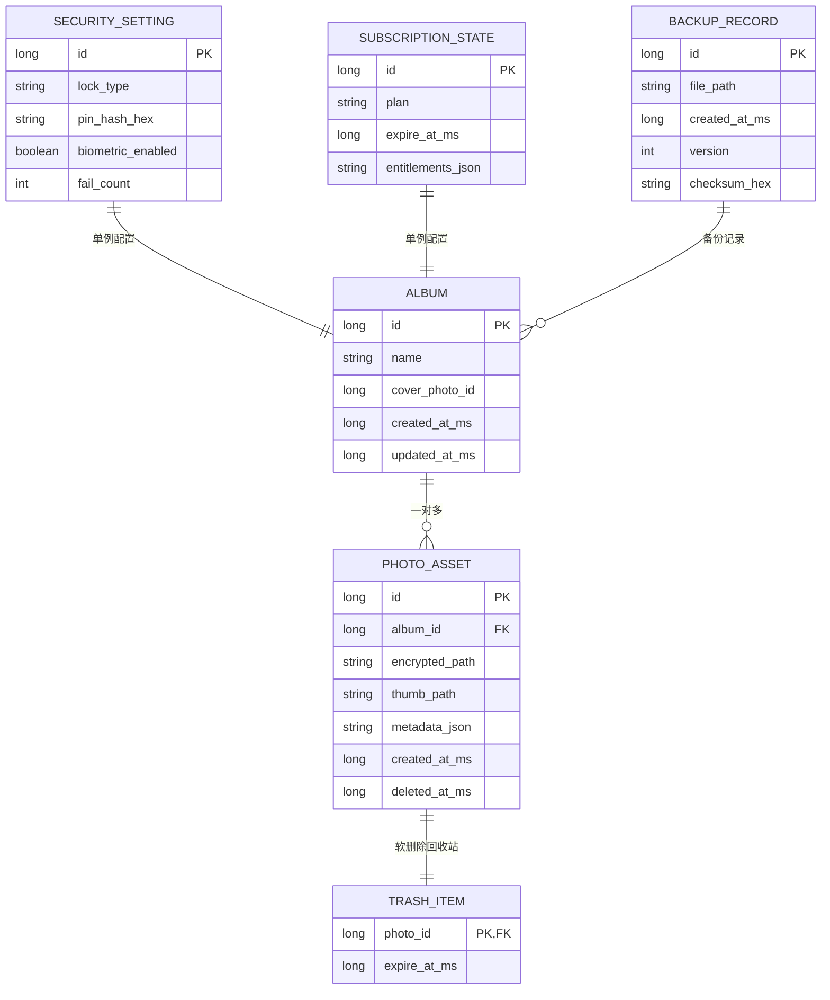
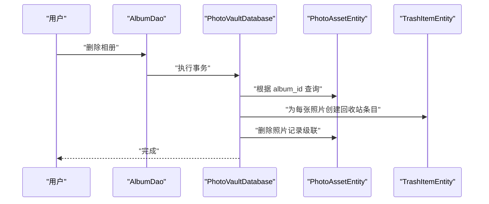
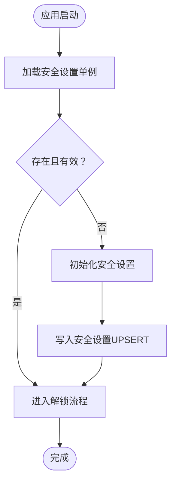
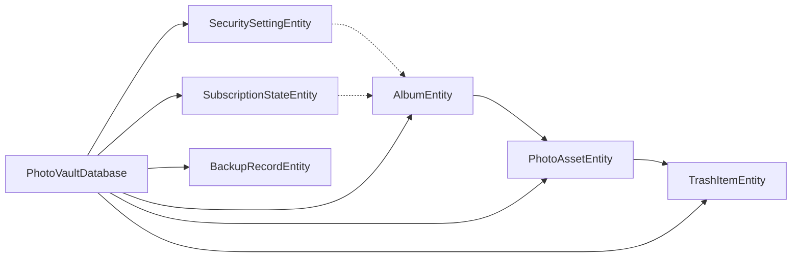

# 实体关系设计

<cite>
**本文引用的文件**
- [AlbumEntity.kt](file://android/core/data/src/main/kotlin/com/photovault/data/db/entity/AlbumEntity.kt)
- [PhotoAssetEntity.kt](file://android/core/data/src/main/kotlin/com/photovault/data/db/entity/PhotoAssetEntity.kt)
- [SecuritySettingEntity.kt](file://android/core/data/src/main/kotlin/com/photovault/data/db/entity/SecuritySettingEntity.kt)
- [BackupRecordEntity.kt](file://android/core/data/src/main/kotlin/com/photovault/data/db/entity/BackupRecordEntity.kt)
- [SubscriptionStateEntity.kt](file://android/core/data/src/main/kotlin/com/photovault/data/db/entity/SubscriptionStateEntity.kt)
- [TrashItemEntity.kt](file://android/core/data/src/main/kotlin/com/photovault/data/db/entity/TrashItemEntity.kt)
- [AlbumDao.kt](file://android/core/data/src/main/kotlin/com/photovault/data/db/dao/AlbumDao.kt)
- [SecuritySettingDao.kt](file://android/core/data/src/main/kotlin/com/photovault/data/db/dao/SecuritySettingDao.kt)
- [PhotoVaultDatabase.kt](file://android/core/data/src/main/kotlin/com/photovault/data/db/PhotoVaultDatabase.kt)
- [Album.kt](file://android/core/domain/src/main/kotlin/com/photovault/domain/model/Album.kt)
- [PhotoAsset.kt](file://android/core/domain/src/main/kotlin/com/photovault/domain/model/PhotoAsset.kt)
- [SecuritySetting.kt](file://android/core/domain/src/main/kotlin/com/photovault/domain/model/SecuritySetting.kt)
- [05-相册管理.md](file://doc/android/05-相册管理.md)
- [03-解锁与安全模块.md](file://doc/android/03-解锁与安全模块.md)
</cite>

## 目录
1. [简介](#简介)
2. [项目结构](#项目结构)
3. [核心组件](#核心组件)
4. [架构总览](#架构总览)
5. [详细组件分析](#详细组件分析)
6. [依赖分析](#依赖分析)
7. [性能考量](#性能考量)
8. [故障排查指南](#故障排查指南)
9. [结论](#结论)
10. [附录](#附录)

## 简介
本文件面向数据库设计者与架构师，系统化梳理 AI 照片保险库项目的实体关系设计。重点覆盖以下方面：
- 实体间的一对一、一对多、多对多关系及其设计动机
- 主键与外键映射、索引与引用完整性约束
- 业务逻辑驱动的实体设计决策（如相册与照片的关联、安全设置与用户状态的关系）
- 实体生命周期管理、级联操作与数据一致性保障
- 提供实体关系图（ERD）与表格关系说明，便于数据库迁移与维护

## 项目结构
本项目采用 Android Room 持久化方案，实体位于数据层，DAO 提供查询接口，数据库类统一注册实体与版本信息。领域模型用于跨层的数据载体。

图表来源
- [PhotoVaultDatabase.kt:14-35](file://android/core/data/src/main/kotlin/com/photovault/data/db/PhotoVaultDatabase.kt#L14-L35)
- [AlbumDao.kt:10-17](file://android/core/data/src/main/kotlin/com/photovault/data/db/dao/AlbumDao.kt#L10-L17)
- [SecuritySettingDao.kt:9-16](file://android/core/data/src/main/kotlin/com/photovault/data/db/dao/SecuritySettingDao.kt#L9-L16)
- [AlbumEntity.kt:8-18](file://android/core/data/src/main/kotlin/com/photovault/data/db/entity/AlbumEntity.kt#L8-L18)
- [PhotoAssetEntity.kt:9-23](file://android/core/data/src/main/kotlin/com/photovault/data/db/entity/PhotoAssetEntity.kt#L9-L23)
- [TrashItemEntity.kt:9-24](file://android/core/data/src/main/kotlin/com/photovault/data/db/entity/TrashItemEntity.kt#L9-L24)
- [SecuritySettingEntity.kt:7-18](file://android/core/data/src/main/kotlin/com/photovault/data/db/entity/SecuritySettingEntity.kt#L7-L18)
- [SubscriptionStateEntity.kt:7-17](file://android/core/data/src/main/kotlin/com/photovault/data/db/entity/SubscriptionStateEntity.kt#L7-L17)
- [BackupRecordEntity.kt:8-18](file://android/core/data/src/main/kotlin/com/photovault/data/db/entity/BackupRecordEntity.kt#L8-L18)

章节来源
- [PhotoVaultDatabase.kt:14-35](file://android/core/data/src/main/kotlin/com/photovault/data/db/PhotoVaultDatabase.kt#L14-L35)
- [AlbumDao.kt:10-17](file://android/core/data/src/main/kotlin/com/photovault/data/db/dao/AlbumDao.kt#L10-L17)
- [SecuritySettingDao.kt:9-16](file://android/core/data/src/main/kotlin/com/photovault/data/db/dao/SecuritySettingDao.kt#L9-L16)

## 核心组件
本节从数据库角度拆解核心实体与关系，并结合领域模型说明其职责边界。

- 相册（AlbumEntity）
  - 主键：自增 id
  - 关联：照片（PhotoAssetEntity）一对多
  - 索引：updated_at_ms
  - 用途：组织与展示照片集合，支持封面图字段

- 照片资产（PhotoAssetEntity）
  - 主键：自增 id
  - 外键：album_id → AlbumEntity.id（级联删除）
  - 索引：album_id、deleted_at_ms
  - 用途：记录加密后的照片路径、缩略图路径、元数据与软删除时间戳

- 回收站条目（TrashItemEntity）
  - 主键：photo_id（复用被删除的照片 id）
  - 外键：photo_id → PhotoAssetEntity.id（级联删除）
  - 索引：expire_at_ms
  - 用途：实现“软删除 + 过期清理”的回收站策略

- 安全设置（SecuritySettingEntity）
  - 主键：固定 id（单例模式）
  - 用途：保存解锁方式、PIN 哈希、生物识别开关与失败计数

- 订阅状态（SubscriptionStateEntity）
  - 主键：固定 id（单例模式）
  - 用途：保存订阅计划、到期时间与权益信息

- 备份记录（BackupRecordEntity）
  - 主键：自增 id
  - 索引：created_at_ms
  - 用途：记录备份文件路径、版本与校验信息

- DAO 接口
  - AlbumDao：插入相册、观察相册列表（按更新时间倒序）
  - SecuritySettingDao：按 id 查询、UPSERT 安全设置

章节来源
- [AlbumEntity.kt:8-18](file://android/core/data/src/main/kotlin/com/photovault/data/db/entity/AlbumEntity.kt#L8-L18)
- [PhotoAssetEntity.kt:9-23](file://android/core/data/src/main/kotlin/com/photovault/data/db/entity/PhotoAssetEntity.kt#L9-L23)
- [TrashItemEntity.kt:9-24](file://android/core/data/src/main/kotlin/com/photovault/data/db/entity/TrashItemEntity.kt#L9-L24)
- [SecuritySettingEntity.kt:7-18](file://android/core/data/src/main/kotlin/com/photovault/data/db/entity/SecuritySettingEntity.kt#L7-L18)
- [SubscriptionStateEntity.kt:7-17](file://android/core/data/src/main/kotlin/com/photovault/data/db/entity/SubscriptionStateEntity.kt#L7-L17)
- [BackupRecordEntity.kt:8-18](file://android/core/data/src/main/kotlin/com/photovault/data/db/entity/BackupRecordEntity.kt#L8-L18)
- [AlbumDao.kt:10-17](file://android/core/data/src/main/kotlin/com/photovault/data/db/dao/AlbumDao.kt#L10-L17)
- [SecuritySettingDao.kt:9-16](file://android/core/data/src/main/kotlin/com/photovault/data/db/dao/SecuritySettingDao.kt#L9-L16)

## 架构总览
下图展示实体关系与关键约束，体现业务驱动的设计取舍。

图表来源
- [AlbumEntity.kt:12-18](file://android/core/data/src/main/kotlin/com/photovault/data/db/entity/AlbumEntity.kt#L12-L18)
- [PhotoAssetEntity.kt:24-32](file://android/core/data/src/main/kotlin/com/photovault/data/db/entity/PhotoAssetEntity.kt#L24-L32)
- [TrashItemEntity.kt:21-24](file://android/core/data/src/main/kotlin/com/photovault/data/db/entity/TrashItemEntity.kt#L21-L24)
- [SecuritySettingEntity.kt:8-18](file://android/core/data/src/main/kotlin/com/photovault/data/db/entity/SecuritySettingEntity.kt#L8-L18)
- [SubscriptionStateEntity.kt:8-17](file://android/core/data/src/main/kotlin/com/photovault/data/db/entity/SubscriptionStateEntity.kt#L8-L17)
- [BackupRecordEntity.kt:12-18](file://android/core/data/src/main/kotlin/com/photovault/data/db/entity/BackupRecordEntity.kt#L12-L18)

## 详细组件分析

### 相册与照片：一对多与软删除回收站
- 设计要点
  - 相册与照片为典型的一对多关系，通过 PhotoAsset.album_id 引用 Album.id
  - 删除策略采用软删除：在 PhotoAsset.deleted_at_ms 字段记录删除时间
  - 回收站条目（TrashItem）以 photo_id 作为主键并复用被删除照片的 id，同时建立外键约束，确保级联删除
- 生命周期与一致性
  - 新建：插入 Album 与 PhotoAsset
  - 更新：修改 Album.updated_at_ms 或 PhotoAsset.metadata_json
  - 删除：写入 PhotoAsset.deleted_at_ms 并创建 TrashItem.expire_at_ms；到期后由后台任务清理
- 级联与约束
  - 删除相册会级联删除其所有照片（PhotoAsset.onDelete=CASCADE）
  - 删除照片会级联删除对应的回收站条目
- 性能与索引
  - Album.updated_at_ms、PhotoAsset.album_id、PhotoAsset.deleted_at_ms、TrashItem.expire_at_ms 均建立索引，支撑常用查询与回收站清理

图表来源
- [AlbumDao.kt:10-17](file://android/core/data/src/main/kotlin/com/photovault/data/db/dao/AlbumDao.kt#L10-L17)
- [PhotoAssetEntity.kt:9-18](file://android/core/data/src/main/kotlin/com/photovault/data/db/entity/PhotoAssetEntity.kt#L9-L18)
- [TrashItemEntity.kt:9-18](file://android/core/data/src/main/kotlin/com/photovault/data/db/entity/TrashItemEntity.kt#L9-L18)

章节来源
- [AlbumEntity.kt:8-18](file://android/core/data/src/main/kotlin/com/photovault/data/db/entity/AlbumEntity.kt#L8-L18)
- [PhotoAssetEntity.kt:9-23](file://android/core/data/src/main/kotlin/com/photovault/data/db/entity/PhotoAssetEntity.kt#L9-L23)
- [TrashItemEntity.kt:9-24](file://android/core/data/src/main/kotlin/com/photovault/data/db/entity/TrashItemEntity.kt#L9-L24)
- [05-相册管理.md:13-25](file://doc/android/05-相册管理.md#L13-L25)

### 安全设置与用户状态：单例实体与业务耦合
- 设计要点
  - 安全设置（SecuritySettingEntity）与订阅状态（SubscriptionStateEntity）均采用固定主键 id=1 的单例模式，避免重复配置
  - 业务上，安全设置影响应用的解锁流程与锁屏行为；订阅状态决定功能权限与到期控制
- 一致性与升级
  - 单例主键确保全局唯一；升级时通过 Room 版本号与迁移脚本维护结构变更
- 与领域模型映射
  - 领域层 SecuritySetting 与实体层 SecuritySettingEntity 字段一一对应，保持跨层一致性

图表来源
- [SecuritySettingDao.kt:11-15](file://android/core/data/src/main/kotlin/com/photovault/data/db/dao/SecuritySettingDao.kt#L11-L15)
- [SecuritySettingEntity.kt:8-18](file://android/core/data/src/main/kotlin/com/photovault/data/db/entity/SecuritySettingEntity.kt#L8-L18)
- [03-解锁与安全模块.md:11-29](file://doc/android/03-解锁与安全模块.md#L11-L29)

章节来源
- [SecuritySettingEntity.kt:7-18](file://android/core/data/src/main/kotlin/com/photovault/data/db/entity/SecuritySettingEntity.kt#L7-L18)
- [SubscriptionStateEntity.kt:7-17](file://android/core/data/src/main/kotlin/com/photovault/data/db/entity/SubscriptionStateEntity.kt#L7-L17)
- [SecuritySettingDao.kt:9-16](file://android/core/data/src/main/kotlin/com/photovault/data/db/dao/SecuritySettingDao.kt#L9-L16)
- [03-解锁与安全模块.md:11-29](file://doc/android/03-解锁与安全模块.md#L11-L29)

### 备份记录：审计与版本追踪
- 设计要点
  - 备份记录（BackupRecordEntity）独立于相册与照片，用于追踪备份文件、版本与校验信息
  - 通过 created_at_ms 索引支持按时间排序查询
- 业务价值
  - 支持用户查看历史备份、进行恢复与比对

章节来源
- [BackupRecordEntity.kt:8-18](file://android/core/data/src/main/kotlin/com/photovault/data/db/entity/BackupRecordEntity.kt#L8-L18)

### 领域模型映射与边界
- 领域模型（domain/model）与数据模型（db/entity）保持清晰边界
  - Album ↔ AlbumEntity
  - PhotoAsset ↔ PhotoAssetEntity
  - SecuritySetting ↔ SecuritySettingEntity
- 领域模型用于跨层传输，数据模型承载数据库结构与约束

章节来源
- [Album.kt:6-12](file://android/core/domain/src/main/kotlin/com/photovault/domain/model/Album.kt#L6-L12)
- [PhotoAsset.kt:6-14](file://android/core/domain/src/main/kotlin/com/photovault/domain/model/PhotoAsset.kt#L6-L14)
- [SecuritySetting.kt:6-12](file://android/core/domain/src/main/kotlin/com/photovault/domain/model/SecuritySetting.kt#L6-L12)

## 依赖分析
- 组件耦合
  - PhotoAssetEntity 依赖 AlbumEntity（外键），形成强依赖
  - TrashItemEntity 依赖 PhotoAssetEntity（外键），形成强依赖
  - SecuritySettingEntity 与 SubscriptionStateEntity 为独立单例配置，不互相依赖
- 外部依赖
  - Room 提供实体、索引、外键与级联删除能力
  - DAO 层承担查询与写入职责，向上提供 Flow/协程接口

图表来源
- [PhotoVaultDatabase.kt:14-25](file://android/core/data/src/main/kotlin/com/photovault/data/db/PhotoVaultDatabase.kt#L14-L25)
- [PhotoAssetEntity.kt:9-18](file://android/core/data/src/main/kotlin/com/photovault/data/db/entity/PhotoAssetEntity.kt#L9-L18)
- [TrashItemEntity.kt:9-17](file://android/core/data/src/main/kotlin/com/photovault/data/db/entity/TrashItemEntity.kt#L9-L17)

章节来源
- [PhotoVaultDatabase.kt:14-35](file://android/core/data/src/main/kotlin/com/photovault/data/db/PhotoVaultDatabase.kt#L14-L35)

## 性能考量
- 索引策略
  - Album.updated_at_ms：支撑相册列表按更新时间排序
  - PhotoAsset.album_id：支撑按相册查询照片
  - PhotoAsset.deleted_at_ms：支撑软删除过滤与回收站查询
  - TrashItem.expire_at_ms：支撑回收站过期清理任务
  - BackupRecord.created_at_ms：支撑备份记录时间线查询
- 级联删除
  - 删除相册自动清理照片与其回收站条目，减少冗余数据与查询复杂度
- 写入策略
  - 安全设置采用 UPSERT，避免重复写入带来的冲突

## 故障排查指南
- 常见问题与定位
  - 外键约束异常：检查 PhotoAsset.album_id 是否指向存在的 Album.id
  - 回收站未清理：确认 TrashItem.expire_at_ms 是否到达预期时间，以及后台清理任务是否运行
  - 安全设置未生效：确认 SecuritySettingDao.getById 查询返回单例 id=1 的记录
- 建议步骤
  - 使用数据库浏览器查看表结构与索引
  - 执行典型查询（按时间排序、按相册分组、按删除状态过滤）
  - 在升级版本时核对 Room 版本号与迁移脚本

章节来源
- [PhotoAssetEntity.kt:9-23](file://android/core/data/src/main/kotlin/com/photovault/data/db/entity/PhotoAssetEntity.kt#L9-L23)
- [TrashItemEntity.kt:9-24](file://android/core/data/src/main/kotlin/com/photovault/data/db/entity/TrashItemEntity.kt#L9-L24)
- [SecuritySettingDao.kt:11-15](file://android/core/data/src/main/kotlin/com/photovault/data/db/dao/SecuritySettingDao.kt#L11-L15)

## 结论
本设计以业务需求为核心，通过明确的主外键关系、单例配置与软删除回收站策略，实现了相册与照片的清晰组织、安全设置与订阅状态的稳定维护，以及备份记录的可追溯性。配合索引与级联删除，兼顾了查询性能与数据一致性。建议在后续版本中持续关注索引命中率与回收站清理效率，并完善迁移脚本与监控告警。

## 附录
- 表格关系说明（简要）
  - AlbumEntity.id → PhotoAssetEntity.album_id（一对多）
  - PhotoAssetEntity.id → TrashItemEntity.photo_id（一对一回收站）
  - SecuritySettingEntity.id（固定=1）与 SubscriptionStateEntity.id（固定=1）为独立单例
  - BackupRecordEntity 与 AlbumEntity 无直接外键，但可通过业务逻辑关联