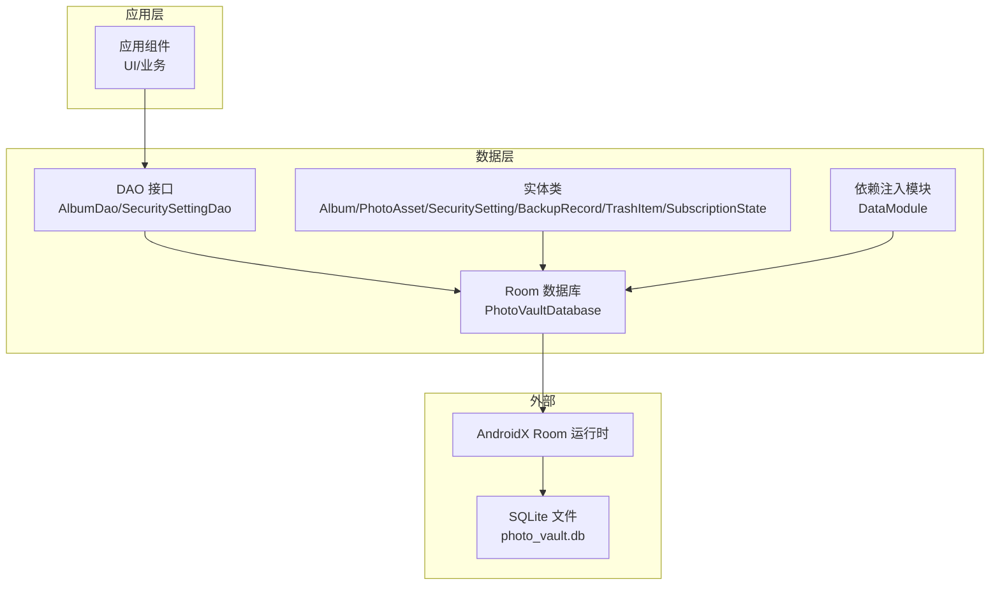
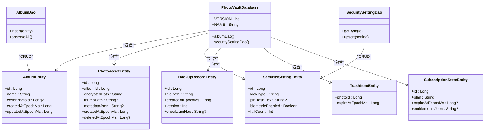
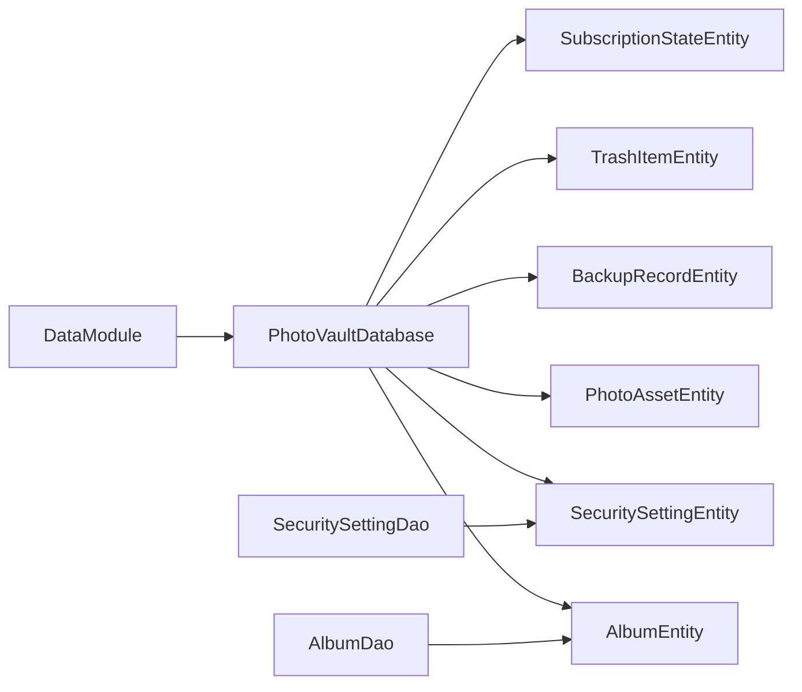
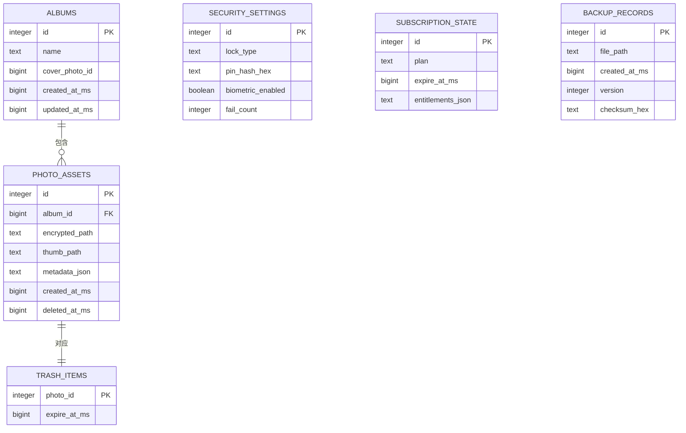
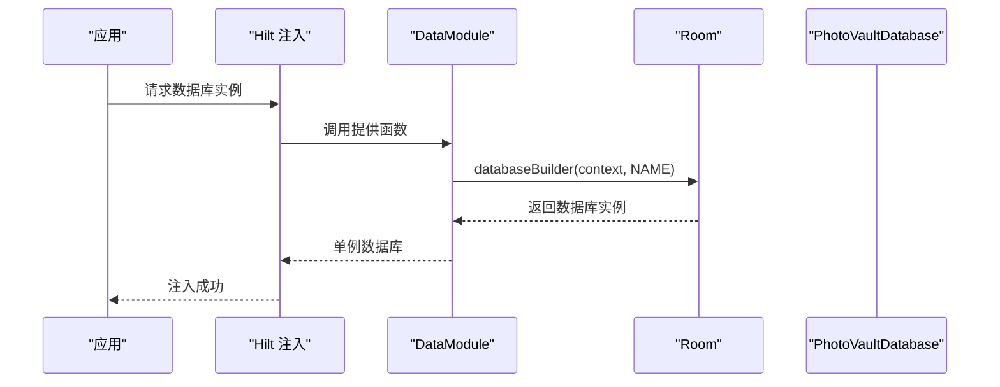
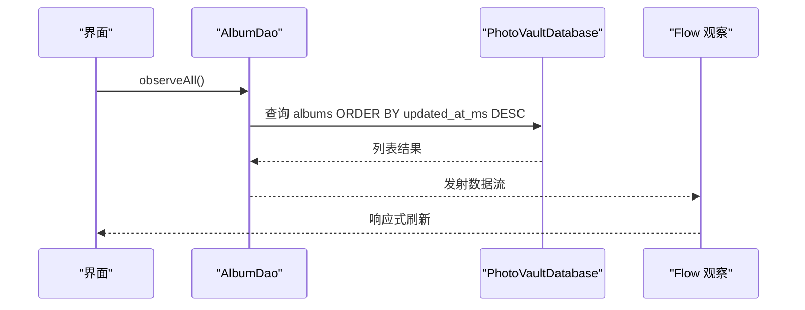
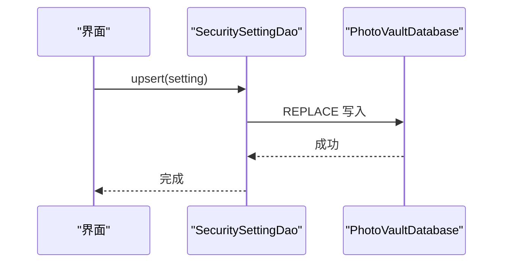

# 数据库模式设计

<cite>
**本文引用的文件**
- [PhotoVaultDatabase.kt](file://android/core/data/src/main/kotlin/com/photovault/data/db/PhotoVaultDatabase.kt)
- [AlbumEntity.kt](file://android/core/data/src/main/kotlin/com/photovault/data/db/entity/AlbumEntity.kt)
- [PhotoAssetEntity.kt](file://android/core/data/src/main/kotlin/com/photovault/data/db/entity/PhotoAssetEntity.kt)
- [SecuritySettingEntity.kt](file://android/core/data/src/main/kotlin/com/photovault/data/db/entity/SecuritySettingEntity.kt)
- [BackupRecordEntity.kt](file://android/core/data/src/main/kotlin/com/photovault/data/db/entity/BackupRecordEntity.kt)
- [TrashItemEntity.kt](file://android/core/data/src/main/kotlin/com/photovault/data/db/entity/TrashItemEntity.kt)
- [SubscriptionStateEntity.kt](file://android/core/data/src/main/kotlin/com/photovault/data/db/entity/SubscriptionStateEntity.kt)
- [AlbumDao.kt](file://android/core/data/src/main/kotlin/com/photovault/data/db/dao/AlbumDao.kt)
- [SecuritySettingDao.kt](file://android/core/data/src/main/kotlin/com/photovault/data/db/dao/SecuritySettingDao.kt)
- [DataModule.kt](file://android/core/data/src/main/kotlin/com/photovault/data/di/DataModule.kt)
- [Album.kt](file://android/core/domain/src/main/kotlin/com/photovault/domain/model/Album.kt)
- [PhotoAsset.kt](file://android/core/domain/src/main/kotlin/com/photovault/domain/model/PhotoAsset.kt)
- [SecuritySetting.kt](file://android/core/domain/src/main/kotlin/com/photovault/domain/model/SecuritySetting.kt)
- [BackupRecord.kt](file://android/core/domain/src/main/kotlin/com/photovault/domain/model/BackupRecord.kt)
</cite>

## 目录
1. [简介](#简介)
2. [项目结构](#项目结构)
3. [核心组件](#核心组件)
4. [架构总览](#架构总览)
5. [详细组件分析](#详细组件分析)
6. [依赖分析](#依赖分析)
7. [性能考量](#性能考量)
8. [故障排查指南](#故障排查指南)
9. [结论](#结论)
10. [附录](#附录)

## 简介
本文件面向AI照片保险库项目的数据库层，系统化梳理Room数据库的配置与初始化流程、各实体表的字段定义与约束、索引策略、版本管理与迁移策略、性能优化、数据完整性与并发控制等关键主题。文档同时提供数据库模式图与关键流程时序图，帮助数据库管理员与开发者快速理解并维护数据库。

## 项目结构
数据库相关代码主要位于android/core/data模块中，采用“按层+按功能”的组织方式：
- 数据库配置与初始化：PhotoVaultDatabase、DataModule
- 实体与DAO：entity与dao包
- 领域模型：domain/model包（用于展示与数据库映射的数据结构）

图表来源
- [PhotoVaultDatabase.kt:14-35](file://android/core/data/src/main/kotlin/com/photovault/data/db/PhotoVaultDatabase.kt#L14-L35)
- [DataModule.kt:18-27](file://android/core/data/src/main/kotlin/com/photovault/data/di/DataModule.kt#L18-L27)

章节来源
- [PhotoVaultDatabase.kt:1-36](file://android/core/data/src/main/kotlin/com/photovault/data/db/PhotoVaultDatabase.kt#L1-L36)
- [DataModule.kt:1-40](file://android/core/data/src/main/kotlin/com/photovault/data/di/DataModule.kt#L1-L40)

## 核心组件
- 数据库配置与版本
  - 数据库名称与版本常量集中于PhotoVaultDatabase伴生对象，当前版本为1。
  - 版本升级提示注释明确指出应在升级时注册Migration并递增版本号。
- 初始化流程
  - 使用Hilt在DataModule中通过Room.databaseBuilder构建单例数据库实例。
- 实体集合
  - 涵盖相册、照片资产、回收站、安全设置、订阅状态、备份记录等核心实体。
- DAO接口
  - 提供相册列表观察与安全设置的查询/写入能力，体现响应式与幂等更新策略。

章节来源
- [PhotoVaultDatabase.kt:14-35](file://android/core/data/src/main/kotlin/com/photovault/data/db/PhotoVaultDatabase.kt#L14-L35)
- [DataModule.kt:18-27](file://android/core/data/src/main/kotlin/com/photovault/data/di/DataModule.kt#L18-L27)
- [AlbumDao.kt:10-17](file://android/core/data/src/main/kotlin/com/photovault/data/db/dao/AlbumDao.kt#L10-L17)
- [SecuritySettingDao.kt:9-16](file://android/core/data/src/main/kotlin/com/photovault/data/db/dao/SecuritySettingDao.kt#L9-L16)

## 架构总览
下图展示数据库层的类关系与依赖：

图表来源
- [PhotoVaultDatabase.kt:14-35](file://android/core/data/src/main/kotlin/com/photovault/data/db/PhotoVaultDatabase.kt#L14-L35)
- [AlbumEntity.kt:8-18](file://android/core/data/src/main/kotlin/com/photovault/data/db/entity/AlbumEntity.kt#L8-L18)
- [PhotoAssetEntity.kt:9-32](file://android/core/data/src/main/kotlin/com/photovault/data/db/entity/PhotoAssetEntity.kt#L9-L32)
- [SecuritySettingEntity.kt:7-18](file://android/core/data/src/main/kotlin/com/photovault/data/db/entity/SecuritySettingEntity.kt#L7-L18)
- [BackupRecordEntity.kt:8-18](file://android/core/data/src/main/kotlin/com/photovault/data/db/entity/BackupRecordEntity.kt#L8-L18)
- [TrashItemEntity.kt:9-24](file://android/core/data/src/main/kotlin/com/photovault/data/db/entity/TrashItemEntity.kt#L9-L24)
- [SubscriptionStateEntity.kt:7-17](file://android/core/data/src/main/kotlin/com/photovault/data/db/entity/SubscriptionStateEntity.kt#L7-L17)
- [AlbumDao.kt:10-17](file://android/core/data/src/main/kotlin/com/photovault/data/db/dao/AlbumDao.kt#L10-L17)
- [SecuritySettingDao.kt:9-16](file://android/core/data/src/main/kotlin/com/photovault/data/db/dao/SecuritySettingDao.kt#L9-L16)

## 详细组件分析

### 数据库配置与初始化
- 配置要点
  - 数据库名称固定为photo_vault.db。
  - 当前版本为1；升级时需在伴生对象处注册Migration并递增版本号。
  - 关闭schema导出，避免在构建产物中暴露数据库结构。
- 初始化流程
  - 通过Hilt在单例作用域内提供Room数据库实例，使用databaseBuilder完成构建。
- 并发与线程
  - Room默认在后台线程执行数据库操作；DAO方法返回Flow用于响应式观察。

章节来源
- [PhotoVaultDatabase.kt:14-35](file://android/core/data/src/main/kotlin/com/photovault/data/db/PhotoVaultDatabase.kt#L14-L35)
- [DataModule.kt:18-27](file://android/core/data/src/main/kotlin/com/photovault/data/di/DataModule.kt#L18-L27)

### 相册表（albums）
- 表设计
  - 主键：自增id。
  - 字段：名称、封面照片id（可空）、创建时间戳、更新时间戳。
- 索引
  - 在updated_at_ms上建立索引，支持按更新时间倒序查询。
- 查询与观察
  - DAO提供按更新时间倒序观察所有相册的能力。

章节来源
- [AlbumEntity.kt:8-18](file://android/core/data/src/main/kotlin/com/photovault/data/db/entity/AlbumEntity.kt#L8-L18)
- [AlbumDao.kt:15-16](file://android/core/data/src/main/kotlin/com/photovault/data/db/dao/AlbumDao.kt#L15-L16)

### 照片资产表（photo_assets）
- 表设计
  - 主键：自增id。
  - 外键：album_id关联albums.id，删除时级联删除。
  - 字段：相册id、加密文件路径、缩略图路径（可空）、元数据JSON（可空）、创建时间戳、删除时间戳（可空）。
- 索引
  - album_id：加速按相册分组查询。
  - deleted_at_ms：加速软删除过滤与回收站逻辑。
- 约束
  - 外键级联删除确保相册删除时照片资产自动清理。

章节来源
- [PhotoAssetEntity.kt:9-32](file://android/core/data/src/main/kotlin/com/photovault/data/db/entity/PhotoAssetEntity.kt#L9-L32)

### 回收站表（trash_items）
- 表设计
  - 主键：photo_id（与photo_assets.id一致），作为回收站项的唯一标识。
  - 字段：过期时间戳expire_at_ms。
- 约束
  - 外键：photo_id引用photo_assets.id，删除时级联删除，保证回收站项与照片资产生命周期一致。
- 索引
  - expire_at_ms：加速过期清理任务。

章节来源
- [TrashItemEntity.kt:9-24](file://android/core/data/src/main/kotlin/com/photovault/data/db/entity/TrashItemEntity.kt#L9-L24)

### 安全设置表（security_settings）
- 表设计
  - 主键：id（单例常量值），确保全局仅有一条安全设置记录。
  - 字段：锁定类型、PIN哈希十六进制（可空）、生物识别开关、失败次数。
- 访问策略
  - DAO提供按id查询与REPLACE写入，实现单例安全设置的幂等更新。

章节来源
- [SecuritySettingEntity.kt:7-18](file://android/core/data/src/main/kotlin/com/photovault/data/db/entity/SecuritySettingEntity.kt#L7-L18)
- [SecuritySettingDao.kt:11-15](file://android/core/data/src/main/kotlin/com/photovault/data/db/dao/SecuritySettingDao.kt#L11-L15)

### 订阅状态表（subscription_state）
- 表设计
  - 主键：id（单例常量值），确保全局仅有一条订阅状态记录。
  - 字段：套餐、到期时间戳（可空）、权限JSON（可空）。
- 访问策略
  - 单例模式，便于全局读取与更新订阅信息。

章节来源
- [SubscriptionStateEntity.kt:7-17](file://android/core/data/src/main/kotlin/com/photovault/data/db/entity/SubscriptionStateEntity.kt#L7-L17)

### 备份记录表（backup_records）
- 表设计
  - 主键：自增id。
  - 字段：文件路径、创建时间戳、版本号、校验和（可空）。
- 索引
  - 在created_at_ms上建立索引，支持按时间排序查看备份历史。
- 用途
  - 记录备份包信息，便于恢复与审计。

章节来源
- [BackupRecordEntity.kt:8-18](file://android/core/data/src/main/kotlin/com/photovault/data/db/entity/BackupRecordEntity.kt#L8-L18)

### 数据库版本管理与迁移策略
- 当前状态
  - 数据库版本为1，尚未实现迁移。
- 升级指引
  - 在PhotoVaultDatabase伴生对象中注册Migration，并递增VERSION。
  - 对于涉及列变更、新增表或删除列的情况，应提供双向迁移脚本。
- 向后兼容性
  - 新增非必填列通常向后兼容；删除列或重命名列需谨慎评估。
  - 建议在迁移前后进行数据一致性校验。

章节来源
- [PhotoVaultDatabase.kt:30-32](file://android/core/data/src/main/kotlin/com/photovault/data/db/PhotoVaultDatabase.kt#L30-L32)

### 数据完整性、事务与并发控制
- 外键约束
  - photo_assets.album_id -> albums.id（CASCADE删除）。
  - trash_items.photo_id -> photo_assets.id（CASCADE删除）。
- 单例约束
  - security_settings与subscription_state通过主键单例保障唯一性。
- 事务与并发
  - Room默认在后台线程执行DAO操作；Flow用于响应式观察，避免主线程阻塞。
  - 写入采用REPLACE/ABORT策略，保证幂等与冲突处理。

章节来源
- [PhotoAssetEntity.kt:11-17](file://android/core/data/src/main/kotlin/com/photovault/data/db/entity/PhotoAssetEntity.kt#L11-L17)
- [TrashItemEntity.kt:11-17](file://android/core/data/src/main/kotlin/com/photovault/data/db/entity/TrashItemEntity.kt#L11-L17)
- [SecuritySettingEntity.kt:9](file://android/core/data/src/main/kotlin/com/photovault/data/db/entity/SecuritySettingEntity.kt#L9)
- [SubscriptionStateEntity.kt:9](file://android/core/data/src/main/kotlin/com/photovault/data/db/entity/SubscriptionStateEntity.kt#L9)
- [AlbumDao.kt:12](file://android/core/data/src/main/kotlin/com/photovault/data/db/dao/AlbumDao.kt#L12)
- [SecuritySettingDao.kt:14](file://android/core/data/src/main/kotlin/com/photovault/data/db/dao/SecuritySettingDao.kt#L14)

## 依赖分析
- 组件耦合
  - PhotoVaultDatabase集中声明实体与版本，DAO通过接口与实体解耦。
  - DataModule集中提供数据库单例，降低全局配置复杂度。
- 外部依赖
  - 依赖AndroidX Room运行时；未发现第三方ORM或数据库框架。
- 可能的循环依赖
  - 实体与DAO无直接循环依赖；通过Room注解与编译期生成代码连接。

图表来源
- [DataModule.kt:18-27](file://android/core/data/src/main/kotlin/com/photovault/data/di/DataModule.kt#L18-L27)
- [PhotoVaultDatabase.kt:14-22](file://android/core/data/src/main/kotlin/com/photovault/data/db/PhotoVaultDatabase.kt#L14-L22)
- [AlbumDao.kt:10-17](file://android/core/data/src/main/kotlin/com/photovault/data/db/dao/AlbumDao.kt#L10-L17)
- [SecuritySettingDao.kt:9-16](file://android/core/data/src/main/kotlin/com/photovault/data/db/dao/SecuritySettingDao.kt#L9-L16)

章节来源
- [DataModule.kt:18-27](file://android/core/data/src/main/kotlin/com/photovault/data/di/DataModule.kt#L18-L27)
- [PhotoVaultDatabase.kt:14-22](file://android/core/data/src/main/kotlin/com/photovault/data/db/PhotoVaultDatabase.kt#L14-L22)

## 性能考量
- 索引策略
  - albums.updated_at_ms：支持相册列表按更新时间排序。
  - photo_assets.album_id：加速按相册分组查询。
  - photo_assets.deleted_at_ms：加速软删除过滤。
  - backup_records.created_at_ms：加速备份历史查询。
  - trash_items.expire_at_ms：加速过期清理。
- 查询优化
  - 使用Flow进行响应式观察，避免频繁轮询。
  - DAO方法采用精确字段查询，减少不必要的列加载。
- 存储空间管理
  - 采用缩略图路径与元数据JSON分离存储，降低主表体积。
  - 删除时间戳支持软删除，便于后续批量清理。
- 并发与事务
  - Room默认后台线程执行；建议在需要时显式开启事务块，保证多步写入原子性。

## 故障排查指南
- 数据库无法打开
  - 检查数据库名称与版本是否正确；确认DataModule已注入且单例可用。
- 升级失败
  - 按照升级指引注册Migration并递增版本号；核对迁移SQL与目标schema。
- 查询异常
  - 确认索引是否存在；检查DAO查询语句与实体字段名是否匹配。
- 数据不一致
  - 检查外键约束与级联删除行为；核对单例表的REPLACE写入逻辑。

章节来源
- [PhotoVaultDatabase.kt:30-32](file://android/core/data/src/main/kotlin/com/photovault/data/db/PhotoVaultDatabase.kt#L30-L32)
- [DataModule.kt:18-27](file://android/core/data/src/main/kotlin/com/photovault/data/di/DataModule.kt#L18-L27)

## 结论
本数据库设计围绕Room实现，采用单例数据库、清晰的实体与DAO分层、合理的索引与外键约束，满足相册管理、照片资产、安全设置、订阅状态与备份记录等核心业务需求。当前版本为1，具备完善的升级指引与向后兼容策略。建议在后续版本中逐步完善迁移脚本、补充更多索引与查询优化，并引入更严格的并发与事务控制以提升稳定性。

## 附录

### 数据库模式图（ER）

图表来源
- [AlbumEntity.kt:12-18](file://android/core/data/src/main/kotlin/com/photovault/data/db/entity/AlbumEntity.kt#L12-L18)
- [PhotoAssetEntity.kt:24-32](file://android/core/data/src/main/kotlin/com/photovault/data/db/entity/PhotoAssetEntity.kt#L24-L32)
- [TrashItemEntity.kt:21-24](file://android/core/data/src/main/kotlin/com/photovault/data/db/entity/TrashItemEntity.kt#L21-L24)
- [SecuritySettingEntity.kt:8-14](file://android/core/data/src/main/kotlin/com/photovault/data/db/entity/SecuritySettingEntity.kt#L8-L14)
- [SubscriptionStateEntity.kt:8-12](file://android/core/data/src/main/kotlin/com/photovault/data/db/entity/SubscriptionStateEntity.kt#L8-L12)
- [BackupRecordEntity.kt:12-18](file://android/core/data/src/main/kotlin/com/photovault/data/db/entity/BackupRecordEntity.kt#L12-L18)

### 关键流程时序图

#### 数据库初始化流程

图表来源
- [DataModule.kt:18-27](file://android/core/data/src/main/kotlin/com/photovault/data/di/DataModule.kt#L18-L27)

#### 相册列表观察流程

图表来源
- [AlbumDao.kt:15-16](file://android/core/data/src/main/kotlin/com/photovault/data/db/dao/AlbumDao.kt#L15-L16)

#### 安全设置写入流程

图表来源
- [SecuritySettingDao.kt:14-15](file://android/core/data/src/main/kotlin/com/photovault/data/db/dao/SecuritySettingDao.kt#L14-L15)