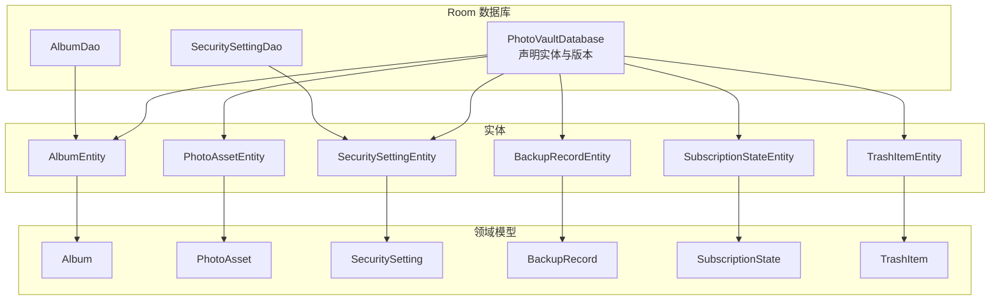
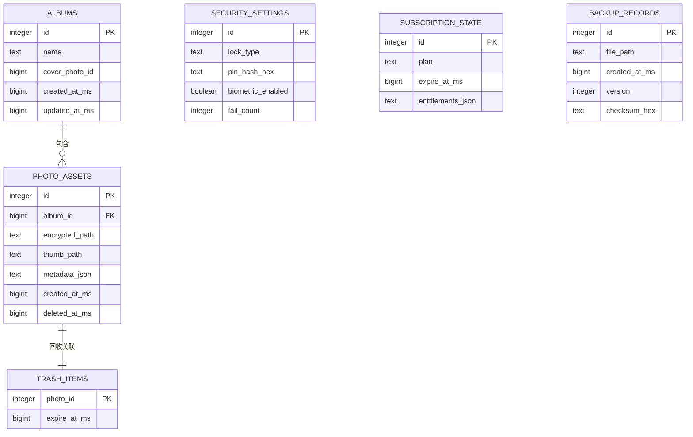
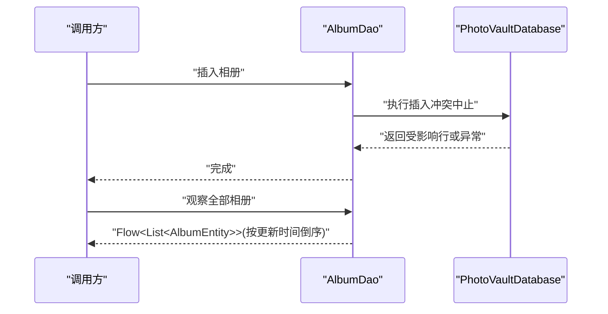
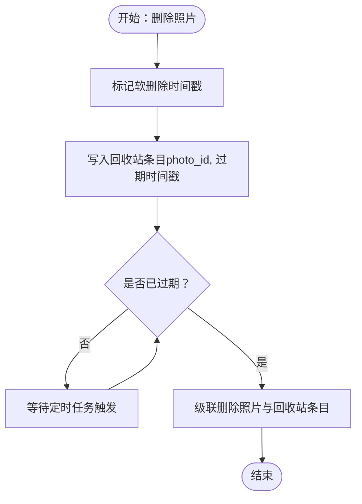
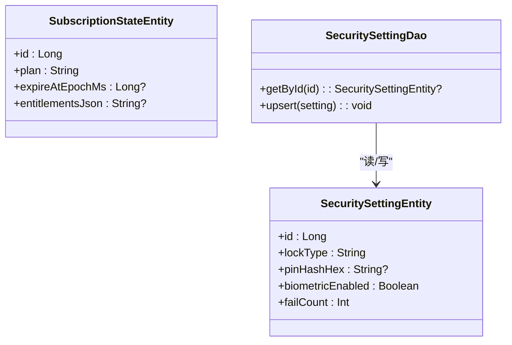
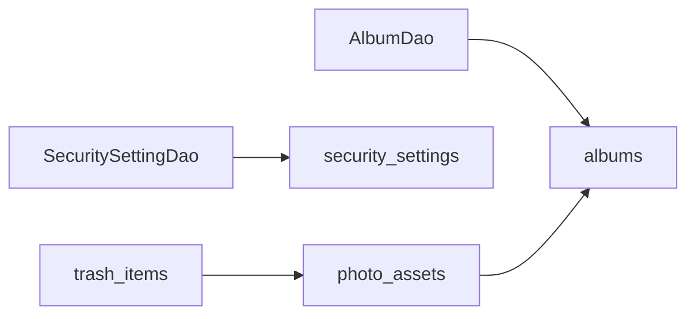

# 数据模型

<cite>
**本文引用的文件**
- [PhotoVaultDatabase.kt](file://android/core/data/src/main/kotlin/com/photovault/data/db/PhotoVaultDatabase.kt)
- [AlbumEntity.kt](file://android/core/data/src/main/kotlin/com/photovault/data/db/entity/AlbumEntity.kt)
- [PhotoAssetEntity.kt](file://android/core/data/src/main/kotlin/com/photovault/data/db/entity/PhotoAssetEntity.kt)
- [TrashItemEntity.kt](file://android/core/data/src/main/kotlin/com/photovault/data/db/entity/TrashItemEntity.kt)
- [SecuritySettingEntity.kt](file://android/core/data/src/main/kotlin/com/photovault/data/db/entity/SecuritySettingEntity.kt)
- [SubscriptionStateEntity.kt](file://android/core/data/src/main/kotlin/com/photovault/data/db/entity/SubscriptionStateEntity.kt)
- [BackupRecordEntity.kt](file://android/core/data/src/main/kotlin/com/photovault/data/db/entity/BackupRecordEntity.kt)
- [AlbumDao.kt](file://android/core/data/src/main/kotlin/com/photovault/data/db/dao/AlbumDao.kt)
- [SecuritySettingDao.kt](file://android/core/data/src/main/kotlin/com/photovault/data/db/dao/SecuritySettingDao.kt)
- [Album.kt](file://android/core/domain/src/main/kotlin/com/photovault/domain/model/Album.kt)
- [PhotoAsset.kt](file://android/core/domain/src/main/kotlin/com/photovault/domain/model/PhotoAsset.kt)
- [SecuritySetting.kt](file://android/core/domain/src/main/kotlin/com/photovault/domain/model/SecuritySetting.kt)
- [BackupRecord.kt](file://android/core/domain/src/main/kotlin/com/photovault/domain/model/BackupRecord.kt)
- [SubscriptionState.kt](file://android/core/domain/src/main/kotlin/com/photovault/domain/model/SubscriptionState.kt)
- [TrashItem.kt](file://android/core/domain/src/main/kotlin/com/photovault/domain/model/TrashItem.kt)
</cite>

## 目录
1. [简介](#简介)
2. [项目结构](#项目结构)
3. [核心组件](#核心组件)
4. [架构总览](#架构总览)
5. [详细组件分析](#详细组件分析)
6. [依赖分析](#依赖分析)
7. [性能考量](#性能考量)
8. [故障排查指南](#故障排查指南)
9. [结论](#结论)
10. [附录](#附录)

## 简介
本文件面向数据库设计者与后端开发者，系统性梳理 AI 照片保险库项目的数据库层数据模型，覆盖实体关系、字段定义与数据类型、主键/外键与索引约束、数据访问模式、缓存策略、性能优化、数据生命周期与归档、迁移与版本管理、以及安全与隐私要求。内容基于 Android Room 的实体与 DAO 定义，并结合领域模型进行说明。

## 项目结构
数据库层采用 Android Room 架构，核心由以下部分组成：
- 数据库类：集中声明实体集合与版本信息
- 实体：定义表结构、索引与外键约束
- DAO：定义查询与写入接口，返回协程 Flow 或挂起函数结果
- 领域模型：与实体一一对应，用于跨层传递与业务处理

图表来源
- [PhotoVaultDatabase.kt:14-35](file://android/core/data/src/main/kotlin/com/photovault/data/db/PhotoVaultDatabase.kt#L14-L35)
- [AlbumDao.kt:10-17](file://android/core/data/src/main/kotlin/com/photovault/data/db/dao/AlbumDao.kt#L10-L17)
- [SecuritySettingDao.kt:9-16](file://android/core/data/src/main/kotlin/com/photovault/data/db/dao/SecuritySettingDao.kt#L9-L16)

章节来源
- [PhotoVaultDatabase.kt:14-35](file://android/core/data/src/main/kotlin/com/photovault/data/db/PhotoVaultDatabase.kt#L14-L35)
- [AlbumDao.kt:10-17](file://android/core/data/src/main/kotlin/com/photovault/data/db/dao/AlbumDao.kt#L10-L17)
- [SecuritySettingDao.kt:9-16](file://android/core/data/src/main/kotlin/com/photovault/data/db/dao/SecuritySettingDao.kt#L9-L16)

## 核心组件
本节从数据库层视角，逐个说明关键实体及其字段、约束与索引设计意图。

- 相册表（albums）
  - 主键：自增 id
  - 字段：名称、封面照片 id（可空）、创建时间戳、更新时间戳
  - 索引：按更新时间倒序排序的复合索引
  - 设计要点：支持“最近更新优先”的相册列表展示

- 照片资产表（photo_assets）
  - 主键：自增 id
  - 外键：album_id 指向 albums.id，删除时级联删除
  - 字段：所属相册 id、加密存储路径、缩略图路径（可空）、元数据 JSON（可空）、创建时间戳、软删除时间戳（可空）
  - 索引：按相册 id 查询、按软删除时间戳过滤
  - 设计要点：支持相册维度检索与回收站/软删除过滤

- 回收站条目表（trash_items）
  - 主键：photo_id（与 photo_assets.id 对应）
  - 外键：photo_id 指向 photo_assets.id，删除时级联删除
  - 字段：到期时间戳
  - 索引：按到期时间戳过滤
  - 设计要点：统一回收站生命周期管理，到期自动清理

- 安全设置表（security_settings）
  - 主键：固定 id（单例），字段包括锁定类型、PIN 哈希（十六进制，可空）、生物识别开关、失败次数
  - 设计要点：单实例配置，避免重复记录；PIN 仅保存哈希，满足最小暴露原则

- 订阅状态表（subscription_state）
  - 主键：固定 id（单例），字段包括套餐、过期时间戳（可空）、权益 JSON（可空）
  - 设计要点：单实例缓存订阅状态，便于离线展示与产品体验

- 备份记录表（backup_records）
  - 主键：自增 id
  - 字段：文件路径、创建时间戳、版本号、校验和（可空）
  - 索引：按创建时间戳排序
  - 设计要点：记录备份产物，支持版本追踪与完整性校验

章节来源
- [AlbumEntity.kt:8-18](file://android/core/data/src/main/kotlin/com/photovault/data/db/entity/AlbumEntity.kt#L8-L18)
- [PhotoAssetEntity.kt:9-32](file://android/core/data/src/main/kotlin/com/photovault/data/db/entity/PhotoAssetEntity.kt#L9-L32)
- [TrashItemEntity.kt:9-24](file://android/core/data/src/main/kotlin/com/photovault/data/db/entity/TrashItemEntity.kt#L9-L24)
- [SecuritySettingEntity.kt:7-18](file://android/core/data/src/main/kotlin/com/photovault/data/db/entity/SecuritySettingEntity.kt#L7-L18)
- [SubscriptionStateEntity.kt:7-17](file://android/core/data/src/main/kotlin/com/photovault/data/db/entity/SubscriptionStateEntity.kt#L7-L17)
- [BackupRecordEntity.kt:8-18](file://android/core/data/src/main/kotlin/com/photovault/data/db/entity/BackupRecordEntity.kt#L8-L18)

## 架构总览
下图展示实体间的关系与约束，体现一对一（单例）与一对多的典型关系。

图表来源
- [AlbumEntity.kt:12-18](file://android/core/data/src/main/kotlin/com/photovault/data/db/entity/AlbumEntity.kt#L12-L18)
- [PhotoAssetEntity.kt:24-32](file://android/core/data/src/main/kotlin/com/photovault/data/db/entity/PhotoAssetEntity.kt#L24-L32)
- [TrashItemEntity.kt:21-24](file://android/core/data/src/main/kotlin/com/photovault/data/db/entity/TrashItemEntity.kt#L21-L24)
- [SecuritySettingEntity.kt:8-14](file://android/core/data/src/main/kotlin/com/photovault/data/db/entity/SecuritySettingEntity.kt#L8-L14)
- [SubscriptionStateEntity.kt:8-12](file://android/core/data/src/main/kotlin/com/photovault/data/db/entity/SubscriptionStateEntity.kt#L8-L12)
- [BackupRecordEntity.kt:12-18](file://android/core/data/src/main/kotlin/com/photovault/data/db/entity/BackupRecordEntity.kt#L12-L18)

## 详细组件分析

### 相册实体与 DAO
- 实体字段与索引
  - 更新时间索引用于“最近使用/编辑”排序
- DAO 行为
  - 插入策略：冲突中止，避免重复
  - 观察全部：返回按更新时间倒序的流式列表

图表来源
- [AlbumDao.kt:12-16](file://android/core/data/src/main/kotlin/com/photovault/data/db/dao/AlbumDao.kt#L12-L16)
- [AlbumEntity.kt:10](file://android/core/data/src/main/kotlin/com/photovault/data/db/entity/AlbumEntity.kt#L10)

章节来源
- [AlbumEntity.kt:8-18](file://android/core/data/src/main/kotlin/com/photovault/data/db/entity/AlbumEntity.kt#L8-L18)
- [AlbumDao.kt:10-17](file://android/core/data/src/main/kotlin/com/photovault/data/db/dao/AlbumDao.kt#L10-L17)

### 照片资产实体与回收站
- 关系与约束
  - 相册到照片：一对多，相册删除级联删除照片
  - 回收站：一对一映射照片 id，过期时间戳索引
- 业务含义
  - 支持软删除与回收站生命周期管理（过期自动清理）

图表来源
- [PhotoAssetEntity.kt:11-17](file://android/core/data/src/main/kotlin/com/photovault/data/db/entity/PhotoAssetEntity.kt#L11-L17)
- [TrashItemEntity.kt:11-17](file://android/core/data/src/main/kotlin/com/photovault/data/db/entity/TrashItemEntity.kt#L11-L17)

章节来源
- [PhotoAssetEntity.kt:9-32](file://android/core/data/src/main/kotlin/com/photovault/data/db/entity/PhotoAssetEntity.kt#L9-L32)
- [TrashItemEntity.kt:9-24](file://android/core/data/src/main/kotlin/com/photovault/data/db/entity/TrashItemEntity.kt#L9-L24)

### 安全设置与订阅状态（单例）
- 设计模式
  - 使用固定主键作为单例占位，通过替换插入保证唯一性
- 安全要点
  - PIN 仅保存哈希，失败次数用于风控
  - 订阅状态用于离线展示，以服务端为准

图表来源
- [SecuritySettingEntity.kt:8-18](file://android/core/data/src/main/kotlin/com/photovault/data/db/entity/SecuritySettingEntity.kt#L8-L18)
- [SubscriptionStateEntity.kt:8-17](file://android/core/data/src/main/kotlin/com/photovault/data/db/entity/SubscriptionStateEntity.kt#L8-L17)
- [SecuritySettingDao.kt:11-15](file://android/core/data/src/main/kotlin/com/photovault/data/db/dao/SecuritySettingDao.kt#L11-L15)

章节来源
- [SecuritySettingEntity.kt:7-18](file://android/core/data/src/main/kotlin/com/photovault/data/db/entity/SecuritySettingEntity.kt#L7-L18)
- [SubscriptionStateEntity.kt:7-17](file://android/core/data/src/main/kotlin/com/photovault/data/db/entity/SubscriptionStateEntity.kt#L7-L17)
- [SecuritySettingDao.kt:9-16](file://android/core/data/src/main/kotlin/com/photovault/data/db/dao/SecuritySettingDao.kt#L9-L16)

### 备份记录与版本追踪
- 字段与用途
  - 文件路径、创建时间、版本号、校验和（可空）
- 索引与排序
  - 按创建时间排序，便于展示最新备份
- 业务意义
  - 支持多版本备份产物管理与完整性校验

章节来源
- [BackupRecordEntity.kt:8-18](file://android/core/data/src/main/kotlin/com/photovault/data/db/entity/BackupRecordEntity.kt#L8-L18)

## 依赖分析
- 组件耦合
  - PhotoAssetEntity 依赖 AlbumEntity（外键）
  - TrashItemEntity 依赖 PhotoAssetEntity（外键）
  - SecuritySettingEntity 与 SubscriptionStateEntity 为独立单例表
- 约束与一致性
  - 级联删除确保相册删除时清理照片与其回收站条目
  - 单例主键约束保证安全与订阅配置唯一性
- 查询路径
  - AlbumDao 提供相册列表观察
  - SecuritySettingDao 提供单例读取与更新

图表来源
- [AlbumDao.kt:15-16](file://android/core/data/src/main/kotlin/com/photovault/data/db/dao/AlbumDao.kt#L15-L16)
- [SecuritySettingDao.kt:12-15](file://android/core/data/src/main/kotlin/com/photovault/data/db/dao/SecuritySettingDao.kt#L12-L15)
- [PhotoAssetEntity.kt:11-17](file://android/core/data/src/main/kotlin/com/photovault/data/db/entity/PhotoAssetEntity.kt#L11-L17)
- [TrashItemEntity.kt:11-17](file://android/core/data/src/main/kotlin/com/photovault/data/db/entity/TrashItemEntity.kt#L11-L17)

章节来源
- [AlbumDao.kt:10-17](file://android/core/data/src/main/kotlin/com/photovault/data/db/dao/AlbumDao.kt#L10-L17)
- [SecuritySettingDao.kt:9-16](file://android/core/data/src/main/kotlin/com/photovault/data/db/dao/SecuritySettingDao.kt#L9-L16)
- [PhotoAssetEntity.kt:9-32](file://android/core/data/src/main/kotlin/com/photovault/data/db/entity/PhotoAssetEntity.kt#L9-L32)
- [TrashItemEntity.kt:9-24](file://android/core/data/src/main/kotlin/com/photovault/data/db/entity/TrashItemEntity.kt#L9-L24)

## 性能考量
- 索引设计
  - albums.updated_at_ms：支持相册列表按更新时间排序
  - photo_assets.album_id：加速相册内照片查询
  - photo_assets.deleted_at_ms：支持软删除过滤
  - trash_items.expire_at_ms：加速回收站过期扫描
  - backup_records.created_at_ms：支持备份列表排序
- 写入策略
  - AlbumDao 插入冲突中止，避免重复插入导致的索引膨胀
  - SecuritySettingDao 使用 REPLACE 策略，保证单例配置幂等更新
- 读取策略
  - AlbumDao 返回 Flow，适合 UI 流式刷新
- I/O 优化建议
  - 批量写入时合并事务
  - 合理拆分查询，避免 SELECT *
  - 控制索引数量，平衡写入与查询性能

## 故障排查指南
- 常见问题与定位
  - 插入相册失败（冲突）：检查是否重复插入相同名称或违反业务约束
  - 安全设置未生效：确认单例 id 是否正确，REPLACE 是否成功
  - 回收站未清理：检查过期时间戳是否到达，是否存在级联删除权限
- 排查步骤
  - 校验实体主键与外键约束
  - 检查索引是否存在且有效
  - 查看 DAO 查询语句与参数绑定
  - 核对数据库版本与迁移脚本（如存在）

章节来源
- [AlbumDao.kt:12-16](file://android/core/data/src/main/kotlin/com/photovault/data/db/dao/AlbumDao.kt#L12-L16)
- [SecuritySettingDao.kt:11-15](file://android/core/data/src/main/kotlin/com/photovault/data/db/dao/SecuritySettingDao.kt#L11-L15)
- [PhotoAssetEntity.kt:11-17](file://android/core/data/src/main/kotlin/com/photovault/data/db/entity/PhotoAssetEntity.kt#L11-L17)
- [TrashItemEntity.kt:11-17](file://android/core/data/src/main/kotlin/com/photovault/data/db/entity/TrashItemEntity.kt#L11-L17)

## 结论
该数据模型围绕“相册—照片—回收站”的核心业务，辅以“安全设置—订阅状态—备份记录”的支撑表，形成清晰的一对多与一对一关系。通过单例表与外键级联删除保障数据一致性，索引设计兼顾查询效率。整体方案适配 Room 的本地持久化能力，满足私密相册的核心功能需求。

## 附录

### 数据模型字段与类型对照
- albums
  - id: 整数（主键，自增）
  - name: 文本
  - cover_photo_id: 整数（可空）
  - created_at_ms: 时间戳（整数）
  - updated_at_ms: 时间戳（整数）
- photo_assets
  - id: 整数（主键，自增）
  - album_id: 整数（外键）
  - encrypted_path: 文本
  - thumb_path: 文本（可空）
  - metadata_json: 文本（可空）
  - created_at_ms: 时间戳（整数）
  - deleted_at_ms: 时间戳（可空）
- trash_items
  - photo_id: 整数（主键，外键）
  - expire_at_ms: 时间戳（整数）
- security_settings
  - id: 整数（主键，固定值）
  - lock_type: 文本
  - pin_hash_hex: 文本（可空）
  - biometric_enabled: 布尔
  - fail_count: 整数
- subscription_state
  - id: 整数（主键，固定值）
  - plan: 文本
  - expire_at_ms: 时间戳（可空）
  - entitlements_json: 文本（可空）
- backup_records
  - id: 整数（主键，自增）
  - file_path: 文本
  - created_at_ms: 时间戳（整数）
  - version: 整数
  - checksum_hex: 文本（可空）

### 示例数据
- albums
  - id=1, name="旅行", cover_photo_id=null, created_at_ms=1700000000000, updated_at_ms=1700000000000
- photo_assets
  - id=101, album_id=1, encrypted_path="/private/enc_abc.jpg", thumb_path="/private/thumb_abc.png", metadata_json="{}", created_at_ms=1700000000000, deleted_at_ms=null
- trash_items
  - photo_id=101, expire_at_ms=1700000000000+30*24*3600*1000
- security_settings
  - id=1, lock_type="PIN", pin_hash_hex="a1b2c3...", biometric_enabled=true, fail_count=0
- subscription_state
  - id=1, plan="premium", expire_at_ms=1700000000000+365*24*3600*1000, entitlements_json="{}"
- backup_records
  - id=1001, file_path="/backups/bundle_v2.zip", created_at_ms=1700000000000, version=2, checksum_hex="deadbeef"

### 数据访问模式与缓存策略
- 访问模式
  - 相册列表：通过 AlbumDao.observeAll 获取 Flow，UI 可响应式刷新
  - 安全设置：通过 SecuritySettingDao.getById 获取单例，upsert 替换更新
- 缓存策略
  - 订阅状态与安全设置作为本地缓存，用于离线体验与快速加载
  - 照片与相册元数据在应用侧缓存，数据库承担持久化与一致性

### 数据生命周期、保留策略与归档
- 生命周期
  - 照片：正常状态、软删除（deleted_at_ms 非空）、进入回收站（trash_items）
  - 回收站：过期时间到达后级联删除
- 保留策略
  - 回收站默认保留 30 天（与产品约定一致）
- 归档
  - 备份记录按版本与时间归档，支持历史版本回溯

### 迁移路径与版本管理
- 当前版本
  - 数据库版本号为 1
- 迁移策略
  - 新增/修改表时，应在数据库类中注册 Migration 并递增版本号
  - 单例表变更需注意 REPLACE 行为与 id 兼容性

章节来源
- [PhotoVaultDatabase.kt:30-34](file://android/core/data/src/main/kotlin/com/photovault/data/db/PhotoVaultDatabase.kt#L30-L34)
- [TrashItem.kt:4-9](file://android/core/domain/src/main/kotlin/com/photovault/domain/model/TrashItem.kt#L4-L9)

### 数据安全、隐私与访问控制
- 安全措施
  - PIN 仅保存哈希，失败次数用于风控
  - 加密文件路径指向应用私有目录，不暴露于系统相册
- 隐私保护
  - 元数据 JSON 仅存储必要字段，避免敏感信息泄露
- 访问控制
  - 数据库文件位于应用私有存储，受系统沙箱保护
  - DAO 层限制直接 SQL 注入风险，优先使用参数化查询