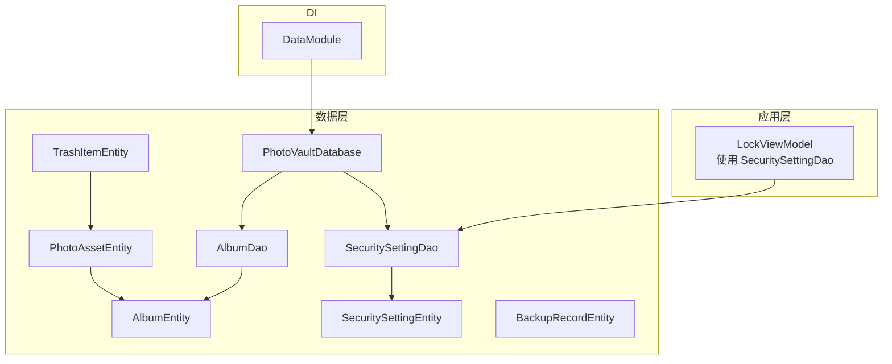
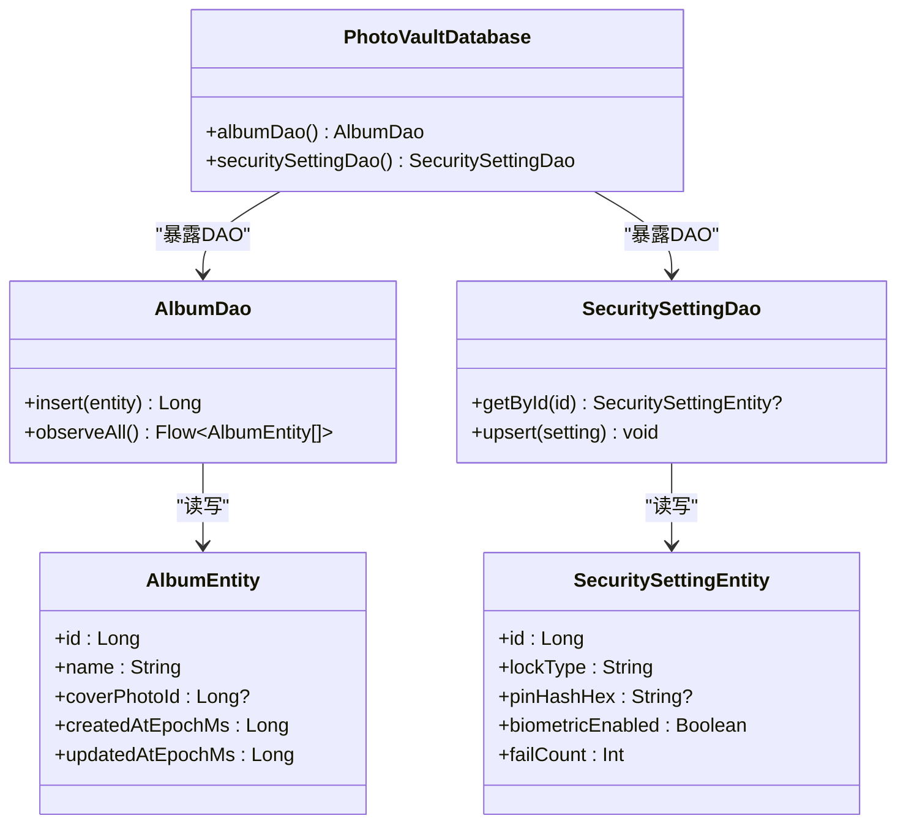
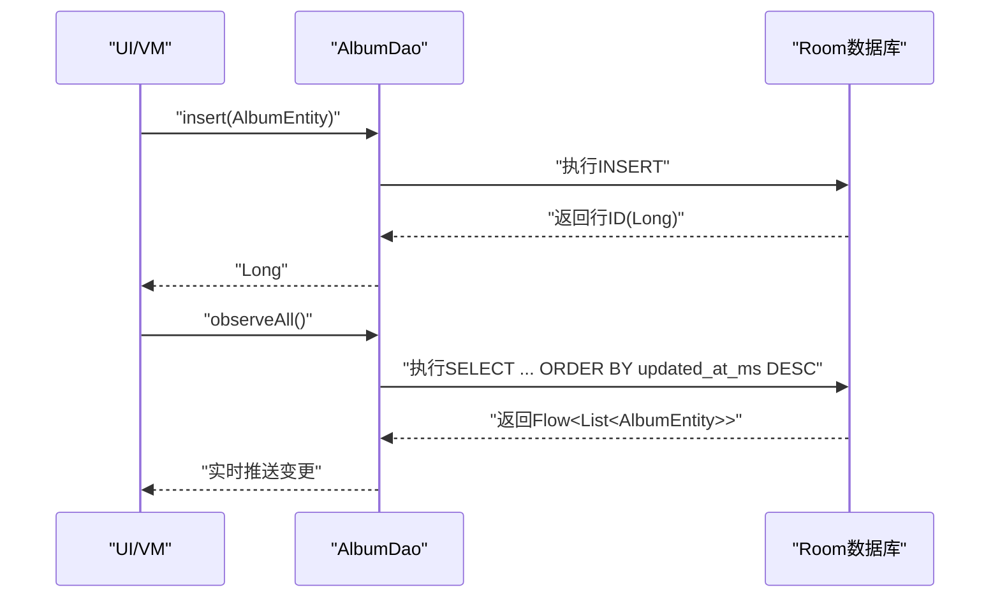
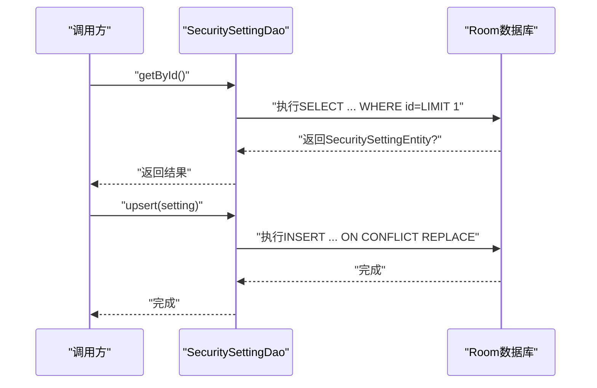
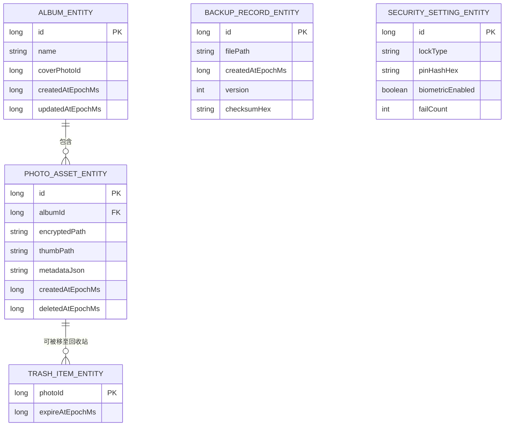
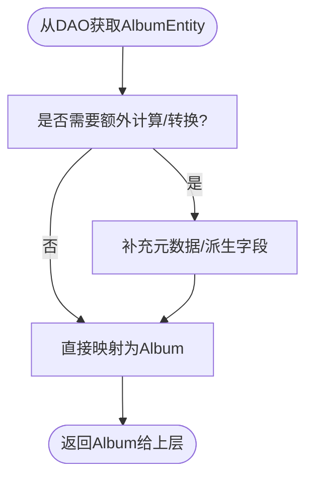
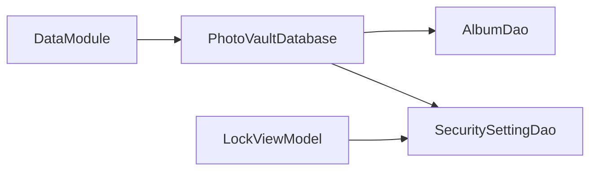

# 数据访问对象(DAO)

<cite>
**本文引用的文件**
- [AlbumDao.kt](file://android/core/data/src/main/kotlin/com/photovault/data/db/dao/AlbumDao.kt)
- [SecuritySettingDao.kt](file://android/core/data/src/main/kotlin/com/photovault/data/db/dao/SecuritySettingDao.kt)
- [PhotoVaultDatabase.kt](file://android/core/data/src/main/kotlin/com/photovault/data/db/PhotoVaultDatabase.kt)
- [AlbumEntity.kt](file://android/core/data/src/main/kotlin/com/photovault/data/db/entity/AlbumEntity.kt)
- [SecuritySettingEntity.kt](file://android/core/data/src/main/kotlin/com/photovault/data/db/entity/SecuritySettingEntity.kt)
- [PhotoAssetEntity.kt](file://android/core/data/src/main/kotlin/com/photovault/data/db/entity/PhotoAssetEntity.kt)
- [BackupRecordEntity.kt](file://android/core/data/src/main/kotlin/com/photovault/data/db/entity/BackupRecordEntity.kt)
- [TrashItemEntity.kt](file://android/core/data/src/main/kotlin/com/photovault/data/db/entity/TrashItemEntity.kt)
- [DataModule.kt](file://android/core/data/src/main/kotlin/com/photovault/data/di/DataModule.kt)
- [Album.kt](file://android/core/domain/src/main/kotlin/com/photovault/domain/model/Album.kt)
- [AlbumDaoRobolectricTest.kt](file://android/core/data/src/test/kotlin/com/photovault/data/db/AlbumDaoRobolectricTest.kt)
- [LockViewModel.kt](file://android/app/src/main/kotlin/com/photovault/app/ui/lock/LockViewModel.kt)
</cite>

## 目录
1. [引言](#引言)
2. [项目结构](#项目结构)
3. [核心组件](#核心组件)
4. [架构总览](#架构总览)
5. [详细组件分析](#详细组件分析)
6. [依赖关系分析](#依赖关系分析)
7. [性能考虑](#性能考虑)
8. [故障排查指南](#故障排查指南)
9. [结论](#结论)
10. [附录](#附录)

## 引言
本文件聚焦于AI照片保险库项目的数据访问层（DAO），系统性阐述DAO模式在Room数据库中的应用，覆盖接口设计原则、方法签名与返回值约定、SQL查询实现细节、异步数据流（Flow）、以及从数据库实体到领域模型的映射策略。同时给出错误处理与性能优化建议，帮助开发者高效、稳定地构建数据访问逻辑。

## 项目结构
数据访问层位于android/core/data模块中，采用“按职责分层”的组织方式：
- 数据库与实体：db包下包含Room数据库类、实体类与DAO接口
- 领域模型：android/core/domain模块提供与业务对齐的领域对象
- 依赖注入：通过Hilt在DataModule中提供数据库实例与加密组件

图表来源
- [PhotoVaultDatabase.kt:26-28](file://android/core/data/src/main/kotlin/com/photovault/data/db/PhotoVaultDatabase.kt#L26-L28)
- [DataModule.kt:18-27](file://android/core/data/src/main/kotlin/com/photovault/data/di/DataModule.kt#L18-L27)
- [LockViewModel.kt:21](file://android/app/src/main/kotlin/com/photovault/app/ui/lock/LockViewModel.kt#L21)

章节来源
- [PhotoVaultDatabase.kt:14-35](file://android/core/data/src/main/kotlin/com/photovault/data/db/PhotoVaultDatabase.kt#L14-L35)
- [DataModule.kt:15-39](file://android/core/data/src/main/kotlin/com/photovault/data/di/DataModule.kt#L15-L39)

## 核心组件
- AlbumDao：提供相册的插入与观察全部相册列表的能力，支持按更新时间倒序排序
- SecuritySettingDao：提供单例安全设置的查询与UPSERT能力
- PhotoVaultDatabase：声明数据库版本、名称、实体集合，并暴露DAO访问入口
- 实体层：AlbumEntity、SecuritySettingEntity、PhotoAssetEntity、BackupRecordEntity、TrashItemEntity等
- 领域模型：Album等，用于UI与业务层消费

章节来源
- [AlbumDao.kt:10-17](file://android/core/data/src/main/kotlin/com/photovault/data/db/dao/AlbumDao.kt#L10-L17)
- [SecuritySettingDao.kt:9-16](file://android/core/data/src/main/kotlin/com/photovault/data/db/dao/SecuritySettingDao.kt#L9-L16)
- [PhotoVaultDatabase.kt:26-34](file://android/core/data/src/main/kotlin/com/photovault/data/db/PhotoVaultDatabase.kt#L26-L34)
- [AlbumEntity.kt:8-18](file://android/core/data/src/main/kotlin/com/photovault/data/db/entity/AlbumEntity.kt#L8-L18)
- [SecuritySettingEntity.kt:7-18](file://android/core/data/src/main/kotlin/com/photovault/data/db/entity/SecuritySettingEntity.kt#L7-L18)
- [PhotoAssetEntity.kt:9-32](file://android/core/data/src/main/kotlin/com/photovault/data/db/entity/PhotoAssetEntity.kt#L9-L32)
- [BackupRecordEntity.kt:8-18](file://android/core/data/src/main/kotlin/com/photovault/data/db/entity/BackupRecordEntity.kt#L8-L18)
- [TrashItemEntity.kt:9-24](file://android/core/data/src/main/kotlin/com/photovault/data/db/entity/TrashItemEntity.kt#L9-L24)
- [Album.kt:6-12](file://android/core/domain/src/main/kotlin/com/photovault/domain/model/Album.kt#L6-L12)

## 架构总览
DAO层遵循Room的声明式SQL与响应式数据流设计：
- DAO接口通过注解声明SQL，Room在编译期生成实现
- 返回类型支持suspend函数（协程阻塞式）、Flow（响应式流）
- 数据库实体与领域模型分离，避免UI层直接依赖持久化结构

图表来源
- [PhotoVaultDatabase.kt:26-28](file://android/core/data/src/main/kotlin/com/photovault/data/db/PhotoVaultDatabase.kt#L26-L28)
- [AlbumDao.kt:12-16](file://android/core/data/src/main/kotlin/com/photovault/data/db/dao/AlbumDao.kt#L12-L16)
- [SecuritySettingDao.kt:11-15](file://android/core/data/src/main/kotlin/com/photovault/data/db/dao/SecuritySettingDao.kt#L11-L15)
- [AlbumEntity.kt:12-18](file://android/core/data/src/main/kotlin/com/photovault/data/db/entity/AlbumEntity.kt#L12-L18)
- [SecuritySettingEntity.kt:8-14](file://android/core/data/src/main/kotlin/com/photovault/data/db/entity/SecuritySettingEntity.kt#L8-L14)

## 详细组件分析

### AlbumDao 组件分析
- 接口职责
  - 插入相册：使用ABORT冲突策略，返回新插入行的主键
  - 观察相册列表：返回按更新时间倒序的实时流
- 方法签名与返回值
  - insert(entity: AlbumEntity): Long
  - observeAll(): Flow<List<AlbumEntity>>
- SQL实现要点
  - 插入：由Room根据@Entity元信息与@Insert注解生成
  - 查询：按updated_at_ms降序排列，索引支持高效排序
- 使用场景
  - 新建相册后获取行ID进行后续关联
  - 在UI侧订阅相册列表变化，自动刷新界面

图表来源
- [AlbumDao.kt:12-16](file://android/core/data/src/main/kotlin/com/photovault/data/db/dao/AlbumDao.kt#L12-L16)
- [AlbumEntity.kt:10](file://android/core/data/src/main/kotlin/com/photovault/data/db/entity/AlbumEntity.kt#L10)

章节来源
- [AlbumDao.kt:10-17](file://android/core/data/src/main/kotlin/com/photovault/data/db/dao/AlbumDao.kt#L10-L17)
- [AlbumEntity.kt:8-18](file://android/core/data/src/main/kotlin/com/photovault/data/db/entity/AlbumEntity.kt#L8-L18)

### SecuritySettingDao 组件分析
- 接口职责
  - 按ID查询：默认使用单例ID，返回单条安全设置或空
  - UPSERT：以REPLACE策略写入或更新
- 方法签名与返回值
  - getById(id: Long = SINGLETON_ID): SecuritySettingEntity?
  - upsert(setting: SecuritySettingEntity): suspend
- SQL实现要点
  - 查询：WHERE id = :id LIMIT 1，确保单例读取
  - 写入：ON CONFLICT REPLACE，保证幂等更新
- 使用场景
  - 应用启动时加载安全配置
  - 修改PIN或生物识别开关后立即落库

图表来源
- [SecuritySettingDao.kt:11-15](file://android/core/data/src/main/kotlin/com/photovault/data/db/dao/SecuritySettingDao.kt#L11-L15)
- [SecuritySettingEntity.kt:15-17](file://android/core/data/src/main/kotlin/com/photovault/data/db/entity/SecuritySettingEntity.kt#L15-L17)

章节来源
- [SecuritySettingDao.kt:9-16](file://android/core/data/src/main/kotlin/com/photovault/data/db/dao/SecuritySettingDao.kt#L9-L16)
- [SecuritySettingEntity.kt:7-18](file://android/core/data/src/main/kotlin/com/photovault/data/db/entity/SecuritySettingEntity.kt#L7-L18)

### PhotoVaultDatabase 与实体关系
- 数据库声明
  - 版本与名称常量
  - 注册实体集合（相册、照片、回收站、安全设置、订阅、备份记录）
  - 暴露DAO访问器
- 实体关系
  - PhotoAssetEntity外键关联AlbumEntity，删除相册时级联删除照片
  - TrashItemEntity外键关联PhotoAssetEntity，过期时间索引支持清理任务
  - 多处索引提升查询性能（如相册更新时间、照片删除时间、备份创建时间）

图表来源
- [PhotoVaultDatabase.kt:14-25](file://android/core/data/src/main/kotlin/com/photovault/data/db/PhotoVaultDatabase.kt#L14-L25)
- [PhotoAssetEntity.kt:9-22](file://android/core/data/src/main/kotlin/com/photovault/data/db/entity/PhotoAssetEntity.kt#L9-L22)
- [TrashItemEntity.kt:9-19](file://android/core/data/src/main/kotlin/com/photovault/data/db/entity/TrashItemEntity.kt#L9-L19)
- [AlbumEntity.kt:8-18](file://android/core/data/src/main/kotlin/com/photovault/data/db/entity/AlbumEntity.kt#L8-L18)
- [BackupRecordEntity.kt:8-18](file://android/core/data/src/main/kotlin/com/photovault/data/db/entity/BackupRecordEntity.kt#L8-L18)
- [SecuritySettingEntity.kt:7-14](file://android/core/data/src/main/kotlin/com/photovault/data/db/entity/SecuritySettingEntity.kt#L7-L14)

章节来源
- [PhotoVaultDatabase.kt:14-35](file://android/core/data/src/main/kotlin/com/photovault/data/db/PhotoVaultDatabase.kt#L14-L35)
- [PhotoAssetEntity.kt:9-32](file://android/core/data/src/main/kotlin/com/photovault/data/db/entity/PhotoAssetEntity.kt#L9-L32)
- [TrashItemEntity.kt:9-24](file://android/core/data/src/main/kotlin/com/photovault/data/db/entity/TrashItemEntity.kt#L9-L24)
- [AlbumEntity.kt:8-18](file://android/core/data/src/main/kotlin/com/photovault/data/db/entity/AlbumEntity.kt#L8-L18)
- [BackupRecordEntity.kt:8-18](file://android/core/data/src/main/kotlin/com/photovault/data/db/entity/BackupRecordEntity.kt#L8-L18)
- [SecuritySettingEntity.kt:7-18](file://android/core/data/src/main/kotlin/com/photovault/data/db/entity/SecuritySettingEntity.kt#L7-L18)

### 数据转换与映射机制
- 数据库实体到领域模型
  - 当前AlbumEntity与领域模型Album字段一一对应，可直接映射
  - 建议在Repository层统一做映射，避免UI层直接依赖Room实体
- 映射流程示意

图表来源
- [AlbumEntity.kt:12-18](file://android/core/data/src/main/kotlin/com/photovault/data/db/entity/AlbumEntity.kt#L12-L18)
- [Album.kt:6-12](file://android/core/domain/src/main/kotlin/com/photovault/domain/model/Album.kt#L6-L12)

章节来源
- [AlbumEntity.kt:12-18](file://android/core/data/src/main/kotlin/com/photovault/data/db/entity/AlbumEntity.kt#L12-L18)
- [Album.kt:6-12](file://android/core/domain/src/main/kotlin/com/photovault/domain/model/Album.kt#L6-L12)

### 异步操作与数据流
- 协程与suspend
  - DAO方法使用suspend关键字，适合在协程作用域中调用
- Flow响应式流
  - observeAll返回Flow<List<AlbumEntity>>，UI可订阅实时数据变更
- LiveData与Flow互操作
  - 可通过转换桥接（例如使用asLiveData）在需要时转为LiveData
- 使用示例参考
  - LockViewModel中直接使用SecuritySettingDao进行读写

章节来源
- [AlbumDao.kt:16](file://android/core/data/src/main/kotlin/com/photovault/data/db/dao/AlbumDao.kt#L16)
- [LockViewModel.kt:21](file://android/app/src/main/kotlin/com/photovault/app/ui/lock/LockViewModel.kt#L21)

## 依赖关系分析
- DI提供数据库实例
  - DataModule通过@Provides提供PhotoVaultDatabase单例
  - 通过Room.databaseBuilder创建，指定数据库名称
- DAO依赖注入
  - ViewModel通过持有数据库实例获取DAO引用
- 外键与索引
  - 外键约束保证参照完整性
  - 索引提升查询与排序性能

图表来源
- [DataModule.kt:18-27](file://android/core/data/src/main/kotlin/com/photovault/data/di/DataModule.kt#L18-L27)
- [PhotoVaultDatabase.kt:26-28](file://android/core/data/src/main/kotlin/com/photovault/data/db/PhotoVaultDatabase.kt#L26-L28)
- [LockViewModel.kt:21](file://android/app/src/main/kotlin/com/photovault/app/ui/lock/LockViewModel.kt#L21)

章节来源
- [DataModule.kt:15-39](file://android/core/data/src/main/kotlin/com/photovault/data/di/DataModule.kt#L15-L39)
- [PhotoVaultDatabase.kt:26-34](file://android/core/data/src/main/kotlin/com/photovault/data/db/PhotoVaultDatabase.kt#L26-L34)
- [LockViewModel.kt:21](file://android/app/src/main/kotlin/com/photovault/app/ui/lock/LockViewModel.kt#L21)

## 性能考虑
- 索引优化
  - 相册按updated_at_ms排序，需保持该列索引以支持高效排序
  - 照片按album_id与deleted_at_ms建立索引，便于分页与软删除过滤
  - 备份记录按created_at_ms建立索引，便于时间线展示
- 外键级联
  - 删除相册时级联删除照片，减少碎片与不一致风险
- 写入策略
  - ABORT冲突策略用于插入相册，避免重复插入导致的脏数据
  - REPLACE冲突策略用于安全设置UPSERT，保证幂等更新
- 查询复杂度
  - 基于索引的查询通常为O(log n) + 扫描结果集，排序成本可控
- 主线程限制
  - 测试中允许主线程查询仅用于单元测试，生产环境应避免在主线程执行耗时数据库操作

章节来源
- [AlbumEntity.kt:10](file://android/core/data/src/main/kotlin/com/photovault/data/db/entity/AlbumEntity.kt#L10)
- [PhotoAssetEntity.kt:19-22](file://android/core/data/src/main/kotlin/com/photovault/data/db/entity/PhotoAssetEntity.kt#L19-L22)
- [BackupRecordEntity.kt:10](file://android/core/data/src/main/kotlin/com/photovault/data/db/entity/BackupRecordEntity.kt#L10)
- [AlbumDao.kt:12](file://android/core/data/src/main/kotlin/com/photovault/data/db/dao/AlbumDao.kt#L12)
- [SecuritySettingDao.kt:14](file://android/core/data/src/main/kotlin/com/photovault/data/db/dao/SecuritySettingDao.kt#L14)
- [AlbumDaoRobolectricTest.kt:27](file://android/core/data/src/test/kotlin/com/photovault/data/db/AlbumDaoRobolectricTest.kt#L27)

## 故障排查指南
- 插入失败或返回异常
  - 检查@Insert冲突策略与实体主键生成策略
  - 确认实体字段非空约束与数据库表结构一致
- 查询无结果
  - 确认WHERE条件与索引列匹配
  - 对于单例读取，确认ID常量与实体定义一致
- Flow不更新
  - 确认查询涉及的表变更触发了Room的变更通知
  - 检查订阅生命周期，避免过早取消订阅
- 单元测试辅助
  - 可使用内存数据库与允许主线程查询的配置快速验证DAO行为

章节来源
- [AlbumDao.kt:12-16](file://android/core/data/src/main/kotlin/com/photovault/data/db/dao/AlbumDao.kt#L12-L16)
- [SecuritySettingDao.kt:11-15](file://android/core/data/src/main/kotlin/com/photovault/data/db/dao/SecuritySettingDao.kt#L11-L15)
- [AlbumDaoRobolectricTest.kt:20-48](file://android/core/data/src/test/kotlin/com/photovault/data/db/AlbumDaoRobolectricTest.kt#L20-L48)

## 结论
DAO层通过Room注解驱动的声明式SQL与Flow响应式流，提供了简洁、强类型的数据库访问能力。结合索引与外键约束，既保证了查询性能也维护了数据一致性。建议在Repository层完成实体到领域模型的映射，并在ViewModel中以协程方式消费Flow，从而获得清晰的职责分离与良好的可测试性。

## 附录
- 最佳实践清单
  - 优先使用Flow进行UI订阅，避免手动轮询
  - 将实体与领域模型分离，Repository负责转换
  - 合理使用索引与外键，避免全表扫描
  - 在协程作用域中调用suspend DAO方法，避免阻塞主线程
  - 对关键写入使用明确的冲突策略（ABORT/REPLACE）
  - 单元测试中使用内存数据库验证DAO行为