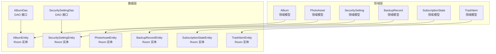
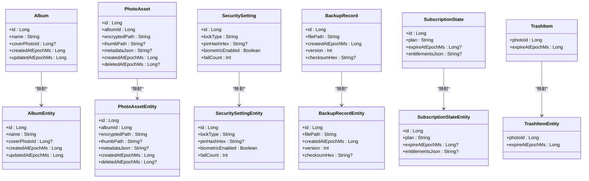
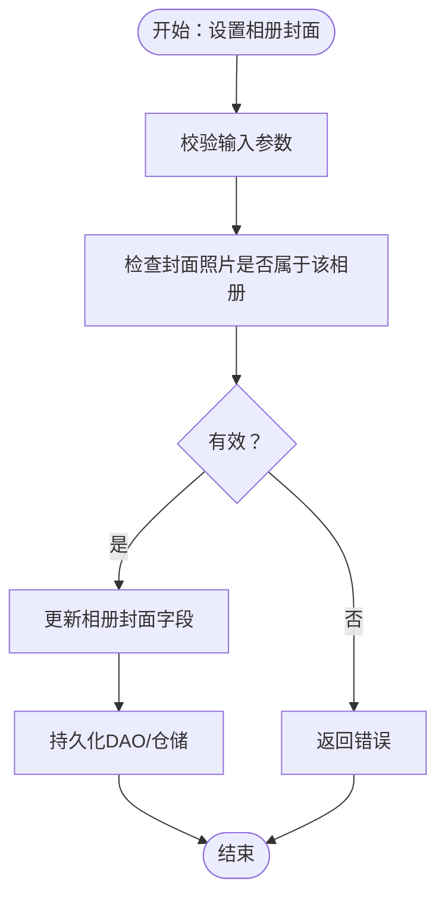
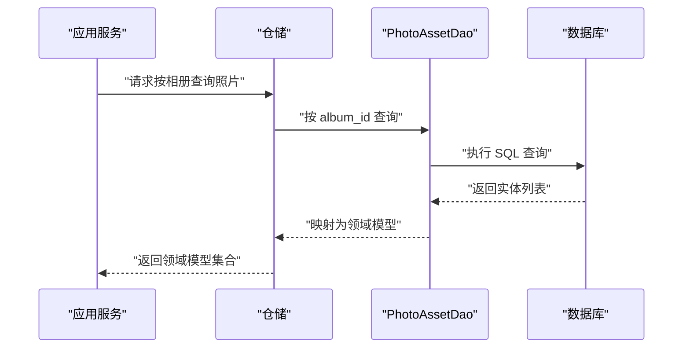
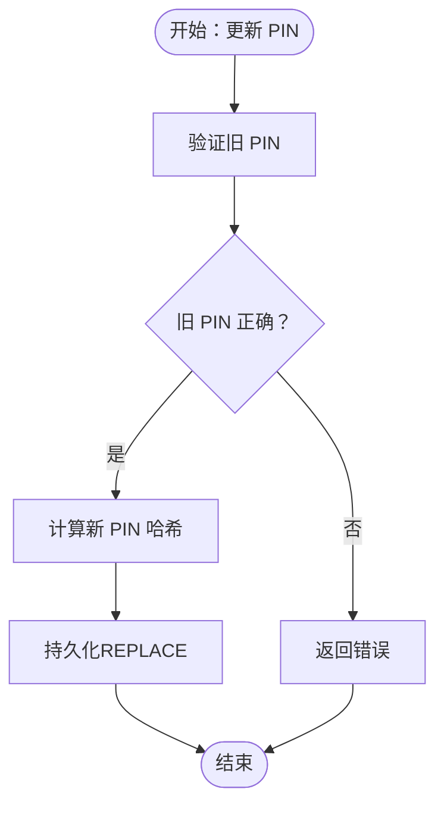
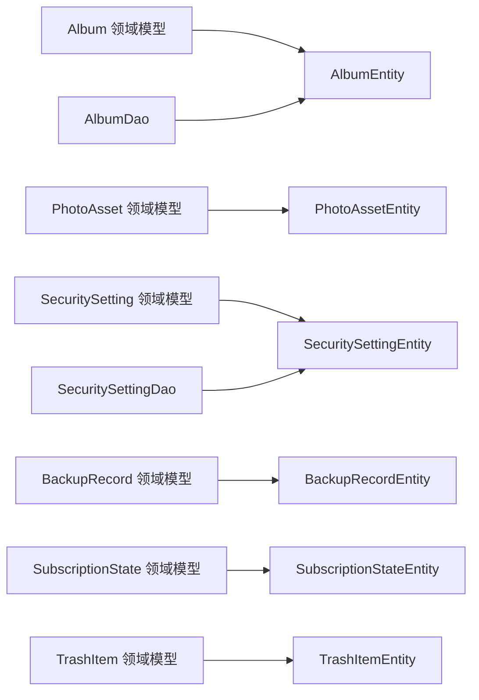

# 领域模型

<cite>
**本文引用的文件**
- [android/core/domain/src/main/kotlin/com/photovault/domain/model/Album.kt](file://android/core/domain/src/main/kotlin/com/photovault/domain/model/Album.kt)
- [android/core/domain/src/main/kotlin/com/photovault/domain/model/PhotoAsset.kt](file://android/core/domain/src/main/kotlin/com/photovault/domain/model/PhotoAsset.kt)
- [android/core/domain/src/main/kotlin/com/photovault/domain/model/SecuritySetting.kt](file://android/core/domain/src/main/kotlin/com/photovault/domain/model/SecuritySetting.kt)
- [android/core/domain/src/main/kotlin/com/photovault/domain/model/BackupRecord.kt](file://android/core/domain/src/main/kotlin/com/photovault/domain/model/BackupRecord.kt)
- [android/core/domain/src/main/kotlin/com/photovault/domain/model/SubscriptionState.kt](file://android/core/domain/src/main/kotlin/com/photovault/domain/model/SubscriptionState.kt)
- [android/core/domain/src/main/kotlin/com/photovault/domain/model/TrashItem.kt](file://android/core/domain/src/main/kotlin/com/photovault/domain/model/TrashItem.kt)
- [android/core/data/src/main/kotlin/com/photovault/data/db/entity/AlbumEntity.kt](file://android/core/data/src/main/kotlin/com/photovault/data/db/entity/AlbumEntity.kt)
- [android/core/data/src/main/kotlin/com/photovault/data/db/entity/PhotoAssetEntity.kt](file://android/core/data/src/main/kotlin/com/photovault/data/db/entity/PhotoAssetEntity.kt)
- [android/core/data/src/main/kotlin/com/photovault/data/db/entity/SecuritySettingEntity.kt](file://android/core/data/src/main/kotlin/com/photovault/data/db/entity/SecuritySettingEntity.kt)
- [android/core/data/src/main/kotlin/com/photovault/data/db/entity/BackupRecordEntity.kt](file://android/core/data/src/main/kotlin/com/photovault/data/db/entity/BackupRecordEntity.kt)
- [android/core/data/src/main/kotlin/com/photovault/data/db/entity/SubscriptionStateEntity.kt](file://android/core/data/src/main/kotlin/com/photovault/data/db/entity/SubscriptionStateEntity.kt)
- [android/core/data/src/main/kotlin/com/photovault/data/db/entity/TrashItemEntity.kt](file://android/core/data/src/main/kotlin/com/photovault/data/db/entity/TrashItemEntity.kt)
- [android/core/data/src/main/kotlin/com/photovault/data/db/dao/AlbumDao.kt](file://android/core/data/src/main/kotlin/com/photovault/data/db/dao/AlbumDao.kt)
- [android/core/data/src/main/kotlin/com/photovault/data/db/dao/SecuritySettingDao.kt](file://android/core/data/src/main/kotlin/com/photovault/data/db/dao/SecuritySettingDao.kt)
</cite>

## 目录
1. [引言](#引言)
2. [项目结构](#项目结构)
3. [核心组件](#核心组件)
4. [架构总览](#架构总览)
5. [详细组件分析](#详细组件分析)
6. [依赖分析](#依赖分析)
7. [性能考虑](#性能考虑)
8. [故障排查指南](#故障排查指南)
9. [结论](#结论)
10. [附录](#附录)

## 引言
本文件面向领域专家与后端开发者，系统梳理 AI 照片保险库项目的领域模型，基于领域驱动设计（DDD）视角，明确各聚合根、值对象与实体的设计原则；阐述属性定义、业务规则与行为方法；给出领域模型与数据库实体的映射关系及数据转换思路；说明状态管理与业务流程；总结不变量与约束条件，并提供测试策略与验证机制建议。

## 项目结构
本项目采用“按层次+按模块”混合组织方式：领域层位于 android/core/domain，数据层位于 android/core/data。领域模型以不可变数据类为主，强调纯领域语义与可测试性；数据层通过 Room 实体与 DAO 提供持久化能力。

图表来源
- [android/core/domain/src/main/kotlin/com/photovault/domain/model/Album.kt:1-13](file://android/core/domain/src/main/kotlin/com/photovault/domain/model/Album.kt#L1-L13)
- [android/core/domain/src/main/kotlin/com/photovault/domain/model/PhotoAsset.kt:1-15](file://android/core/domain/src/main/kotlin/com/photovault/domain/model/PhotoAsset.kt#L1-L15)
- [android/core/domain/src/main/kotlin/com/photovault/domain/model/SecuritySetting.kt:1-13](file://android/core/domain/src/main/kotlin/com/photovault/domain/model/SecuritySetting.kt#L1-L13)
- [android/core/domain/src/main/kotlin/com/photovault/domain/model/BackupRecord.kt:1-13](file://android/core/domain/src/main/kotlin/com/photovault/domain/model/BackupRecord.kt#L1-L13)
- [android/core/domain/src/main/kotlin/com/photovault/domain/model/SubscriptionState.kt:1-12](file://android/core/domain/src/main/kotlin/com/photovault/domain/model/SubscriptionState.kt#L1-L12)
- [android/core/domain/src/main/kotlin/com/photovault/domain/model/TrashItem.kt:1-10](file://android/core/domain/src/main/kotlin/com/photovault/domain/model/TrashItem.kt#L1-L10)
- [android/core/data/src/main/kotlin/com/photovault/data/db/entity/AlbumEntity.kt:1-19](file://android/core/data/src/main/kotlin/com/photovault/data/db/entity/AlbumEntity.kt#L1-L19)
- [android/core/data/src/main/kotlin/com/photovault/data/db/entity/PhotoAssetEntity.kt:1-33](file://android/core/data/src/main/kotlin/com/photovault/data/db/entity/PhotoAssetEntity.kt#L1-L33)
- [android/core/data/src/main/kotlin/com/photovault/data/db/entity/SecuritySettingEntity.kt:1-19](file://android/core/data/src/main/kotlin/com/photovault/data/db/entity/SecuritySettingEntity.kt#L1-L19)
- [android/core/data/src/main/kotlin/com/photovault/data/db/entity/BackupRecordEntity.kt:1-19](file://android/core/data/src/main/kotlin/com/photovault/data/db/entity/BackupRecordEntity.kt#L1-L19)
- [android/core/data/src/main/kotlin/com/photovault/data/db/entity/SubscriptionStateEntity.kt:1-18](file://android/core/data/src/main/kotlin/com/photovault/data/db/entity/SubscriptionStateEntity.kt#L1-L18)
- [android/core/data/src/main/kotlin/com/photovault/data/db/entity/TrashItemEntity.kt:1-25](file://android/core/data/src/main/kotlin/com/photovault/data/db/entity/TrashItemEntity.kt#L1-L25)
- [android/core/data/src/main/kotlin/com/photovault/data/db/dao/AlbumDao.kt:1-18](file://android/core/data/src/main/kotlin/com/photovault/data/db/dao/AlbumDao.kt#L1-L18)
- [android/core/data/src/main/kotlin/com/photovault/data/db/dao/SecuritySettingDao.kt:1-17](file://android/core/data/src/main/kotlin/com/photovault/data/db/dao/SecuritySettingDao.kt#L1-L17)

章节来源
- [android/core/domain/src/main/kotlin/com/photovault/domain/model/Album.kt:1-13](file://android/core/domain/src/main/kotlin/com/photovault/domain/model/Album.kt#L1-L13)
- [android/core/domain/src/main/kotlin/com/photovault/domain/model/PhotoAsset.kt:1-15](file://android/core/domain/src/main/kotlin/com/photovault/domain/model/PhotoAsset.kt#L1-L15)
- [android/core/domain/src/main/kotlin/com/photovault/domain/model/SecuritySetting.kt:1-13](file://android/core/domain/src/main/kotlin/com/photovault/domain/model/SecuritySetting.kt#L1-L13)
- [android/core/domain/src/main/kotlin/com/photovault/domain/model/BackupRecord.kt:1-13](file://android/core/domain/src/main/kotlin/com/photovault/domain/model/BackupRecord.kt#L1-L13)
- [android/core/domain/src/main/kotlin/com/photovault/domain/model/SubscriptionState.kt:1-12](file://android/core/domain/src/main/kotlin/com/photovault/domain/model/SubscriptionState.kt#L1-L12)
- [android/core/domain/src/main/kotlin/com/photovault/domain/model/TrashItem.kt:1-10](file://android/core/domain/src/main/kotlin/com/photovault/domain/model/TrashItem.kt#L1-L10)

## 核心组件
本节从 DDD 角度审视各领域模型，明确其是否为聚合根或值对象，并总结属性、业务规则与行为方法。

- Album（自定义相册）
  - 聚合根。标识相册生命周期与封面选择。
  - 关键属性：名称、封面照片 ID、创建/更新时间戳。
  - 不变量与约束：名称非空；封面照片需属于该相册；更新时间应晚于创建时间。
  - 行为方法：可提供“设置封面”“重命名”等业务操作（由应用服务或仓储接口承载，领域模型保持纯数据）。

- PhotoAsset（私密照片资产）
  - 值对象/实体：作为相册内的资源条目，具备唯一标识与加密存储路径。
  - 关键属性：所属相册 ID、加密文件路径、缩略图路径、元数据 JSON、创建/删除时间戳。
  - 不变量与约束：加密路径必填；删除时间为空表示未删除；与相册存在外键关联。
  - 行为方法：可提供“标记删除”“生成缩略图”等（具体实现由应用服务负责，领域模型保持纯数据）。

- SecuritySetting（安全设置）
  - 值对象/实体：单例配置，保存解锁类型、PIN 哈希、生物识别开关与失败计数。
  - 关键属性：锁类型、PIN 哈希十六进制、生物识别启用、失败次数。
  - 不变量与约束：ID 为单例常量；PIN 可空但启用 PIN 时必须存在有效哈希；失败次数非负。
  - 行为方法：可提供“更新 PIN”“重置失败次数”“切换生物识别”等。

- BackupRecord（备份记录）
  - 值对象/实体：记录一次备份任务的产物信息。
  - 关键属性：文件路径、创建时间、版本号、校验和。
  - 不变量与约束：文件路径唯一；版本号非负；校验和可空但存在时应符合约定格式。
  - 行为方法：可提供“校验完整性”“比较版本”等。

- SubscriptionState（订阅状态）
  - 值对象/实体：单例缓存，保存计划、过期时间与权益 JSON。
  - 关键属性：计划、过期时间、权益 JSON。
  - 不变量与约束：ID 为单例常量；过期时间可空（永久有效）；JSON 结构由外部系统约定。
  - 行为方法：可提供“刷新状态”“判断是否过期”等。

- TrashItem（回收站条目）
  - 值对象/实体：回收站条目，携带过期时间。
  - 关键属性：照片 ID、过期时间。
  - 不变量与约束：照片 ID 对应 PhotoAsset；过期时间应大于当前时间；存在外键关联。
  - 行为方法：可提供“计算剩余天数”“判定是否过期”等。

章节来源
- [android/core/domain/src/main/kotlin/com/photovault/domain/model/Album.kt:1-13](file://android/core/domain/src/main/kotlin/com/photovault/domain/model/Album.kt#L1-L13)
- [android/core/domain/src/main/kotlin/com/photovault/domain/model/PhotoAsset.kt:1-15](file://android/core/domain/src/main/kotlin/com/photovault/domain/model/PhotoAsset.kt#L1-L15)
- [android/core/domain/src/main/kotlin/com/photovault/domain/model/SecuritySetting.kt:1-13](file://android/core/domain/src/main/kotlin/com/photovault/domain/model/SecuritySetting.kt#L1-L13)
- [android/core/domain/src/main/kotlin/com/photovault/domain/model/BackupRecord.kt:1-13](file://android/core/domain/src/main/kotlin/com/photovault/domain/model/BackupRecord.kt#L1-L13)
- [android/core/domain/src/main/kotlin/com/photovault/domain/model/SubscriptionState.kt:1-12](file://android/core/domain/src/main/kotlin/com/photovault/domain/model/SubscriptionState.kt#L1-L12)
- [android/core/domain/src/main/kotlin/com/photovault/domain/model/TrashItem.kt:1-10](file://android/core/domain/src/main/kotlin/com/photovault/domain/model/TrashItem.kt#L1-L10)

## 架构总览
下图展示领域模型与数据库实体的映射关系，以及 DAO 的访问路径。领域模型用于表达业务语义，数据层负责持久化与查询。

图表来源
- [android/core/domain/src/main/kotlin/com/photovault/domain/model/Album.kt:1-13](file://android/core/domain/src/main/kotlin/com/photovault/domain/model/Album.kt#L1-L13)
- [android/core/data/src/main/kotlin/com/photovault/data/db/entity/AlbumEntity.kt:1-19](file://android/core/data/src/main/kotlin/com/photovault/data/db/entity/AlbumEntity.kt#L1-L19)
- [android/core/domain/src/main/kotlin/com/photovault/domain/model/PhotoAsset.kt:1-15](file://android/core/domain/src/main/kotlin/com/photovault/domain/model/PhotoAsset.kt#L1-L15)
- [android/core/data/src/main/kotlin/com/photovault/data/db/entity/PhotoAssetEntity.kt:1-33](file://android/core/data/src/main/kotlin/com/photovault/data/db/entity/PhotoAssetEntity.kt#L1-L33)
- [android/core/domain/src/main/kotlin/com/photovault/domain/model/SecuritySetting.kt:1-13](file://android/core/domain/src/main/kotlin/com/photovault/domain/model/SecuritySetting.kt#L1-L13)
- [android/core/data/src/main/kotlin/com/photovault/data/db/entity/SecuritySettingEntity.kt:1-19](file://android/core/data/src/main/kotlin/com/photovault/data/db/entity/SecuritySettingEntity.kt#L1-L19)
- [android/core/domain/src/main/kotlin/com/photovault/domain/model/BackupRecord.kt:1-13](file://android/core/domain/src/main/kotlin/com/photovault/domain/model/BackupRecord.kt#L1-L13)
- [android/core/data/src/main/kotlin/com/photovault/data/db/entity/BackupRecordEntity.kt:1-19](file://android/core/data/src/main/kotlin/com/photovault/data/db/entity/BackupRecordEntity.kt#L1-L19)
- [android/core/domain/src/main/kotlin/com/photovault/domain/model/SubscriptionState.kt:1-12](file://android/core/domain/src/main/kotlin/com/photovault/domain/model/SubscriptionState.kt#L1-L12)
- [android/core/data/src/main/kotlin/com/photovault/data/db/entity/SubscriptionStateEntity.kt:1-18](file://android/core/data/src/main/kotlin/com/photovault/data/db/entity/SubscriptionStateEntity.kt#L1-L18)
- [android/core/domain/src/main/kotlin/com/photovault/domain/model/TrashItem.kt:1-10](file://android/core/domain/src/main/kotlin/com/photovault/domain/model/TrashItem.kt#L1-L10)
- [android/core/data/src/main/kotlin/com/photovault/data/db/entity/TrashItemEntity.kt:1-25](file://android/core/data/src/main/kotlin/com/photovault/data/db/entity/TrashItemEntity.kt#L1-L25)

## 详细组件分析

### Album（自定义相册）
- 设计要点
  - 聚合根：相册是资源组织的核心边界，封面变更、重命名等均围绕其进行。
  - 属性与约束：名称非空；封面照片 ID 与相册内 PhotoAsset 关联；时间戳更新遵循单调递增。
- 业务规则
  - 设置封面：封面照片必须属于该相册；若为空则清空封面。
  - 重命名：名称长度与字符集限制由上层服务或仓库约束。
- 数据流
  - 读取：通过 DAO 查询并映射到领域模型。
  - 写入：插入/更新时确保时间戳一致性。

图表来源
- [android/core/domain/src/main/kotlin/com/photovault/domain/model/Album.kt:1-13](file://android/core/domain/src/main/kotlin/com/photovault/domain/model/Album.kt#L1-L13)
- [android/core/data/src/main/kotlin/com/photovault/data/db/entity/AlbumEntity.kt:1-19](file://android/core/data/src/main/kotlin/com/photovault/data/db/entity/AlbumEntity.kt#L1-L19)
- [android/core/data/src/main/kotlin/com/photovault/data/db/dao/AlbumDao.kt:1-18](file://android/core/data/src/main/kotlin/com/photovault/data/db/dao/AlbumDao.kt#L1-L18)

章节来源
- [android/core/domain/src/main/kotlin/com/photovault/domain/model/Album.kt:1-13](file://android/core/domain/src/main/kotlin/com/photovault/domain/model/Album.kt#L1-L13)
- [android/core/data/src/main/kotlin/com/photovault/data/db/entity/AlbumEntity.kt:1-19](file://android/core/data/src/main/kotlin/com/photovault/data/db/entity/AlbumEntity.kt#L1-L19)
- [android/core/data/src/main/kotlin/com/photovault/data/db/dao/AlbumDao.kt:1-18](file://android/core/data/src/main/kotlin/com/photovault/data/db/dao/AlbumDao.kt#L1-L18)

### PhotoAsset（私密照片资产）
- 设计要点
  - 实体：具备唯一标识与加密存储路径，支持软删除（deletedAtEpochMs）。
  - 属性与约束：加密路径必填；缩略图与元数据可选；删除时间为空表示未删除。
- 业务规则
  - 删除：标记 deletedAtEpochMs；触发回收站流程。
  - 元数据：JSON 结构由上层解析器处理；不存在时可回退默认视图。
- 数据流
  - 读取：按相册 ID 或删除状态过滤；支持索引优化。
  - 写入：插入时生成唯一 ID；更新时维护时间戳。

图表来源
- [android/core/domain/src/main/kotlin/com/photovault/domain/model/PhotoAsset.kt:1-15](file://android/core/domain/src/main/kotlin/com/photovault/domain/model/PhotoAsset.kt#L1-L15)
- [android/core/data/src/main/kotlin/com/photovault/data/db/entity/PhotoAssetEntity.kt:1-33](file://android/core/data/src/main/kotlin/com/photovault/data/db/entity/PhotoAssetEntity.kt#L1-L33)

章节来源
- [android/core/domain/src/main/kotlin/com/photovault/domain/model/PhotoAsset.kt:1-15](file://android/core/domain/src/main/kotlin/com/photovault/domain/model/PhotoAsset.kt#L1-L15)
- [android/core/data/src/main/kotlin/com/photovault/data/db/entity/PhotoAssetEntity.kt:1-33](file://android/core/data/src/main/kotlin/com/photovault/data/db/entity/PhotoAssetEntity.kt#L1-L33)

### SecuritySetting（安全设置）
- 设计要点
  - 单例实体：ID 为固定常量，仅保存一组安全配置。
  - 属性与约束：PIN 哈希可空；启用生物识别时需保证配置有效。
- 业务规则
  - 更新 PIN：先验证旧 PIN，再写入新哈希。
  - 生物识别：开启前需完成初始化；失败次数超过阈值需锁定。
- 数据流
  - 读取：按单例 ID 查询；DAO 提供便捷访问。
  - 写入：使用 REPLACE 策略避免冲突。

图表来源
- [android/core/domain/src/main/kotlin/com/photovault/domain/model/SecuritySetting.kt:1-13](file://android/core/domain/src/main/kotlin/com/photovault/domain/model/SecuritySetting.kt#L1-L13)
- [android/core/data/src/main/kotlin/com/photovault/data/db/entity/SecuritySettingEntity.kt:1-19](file://android/core/data/src/main/kotlin/com/photovault/data/db/entity/SecuritySettingEntity.kt#L1-L19)
- [android/core/data/src/main/kotlin/com/photovault/data/db/dao/SecuritySettingDao.kt:1-17](file://android/core/data/src/main/kotlin/com/photovault/data/db/dao/SecuritySettingDao.kt#L1-L17)

章节来源
- [android/core/domain/src/main/kotlin/com/photovault/domain/model/SecuritySetting.kt:1-13](file://android/core/domain/src/main/kotlin/com/photovault/domain/model/SecuritySetting.kt#L1-L13)
- [android/core/data/src/main/kotlin/com/photovault/data/db/entity/SecuritySettingEntity.kt:1-19](file://android/core/data/src/main/kotlin/com/photovault/data/db/entity/SecuritySettingEntity.kt#L1-L19)
- [android/core/data/src/main/kotlin/com/photovault/data/db/dao/SecuritySettingDao.kt:1-17](file://android/core/data/src/main/kotlin/com/photovault/data/db/dao/SecuritySettingDao.kt#L1-L17)

### BackupRecord（备份记录）
- 设计要点
  - 实体：记录一次备份任务的产物信息，便于后续校验与比较。
  - 属性与约束：文件路径唯一；版本号非负；校验和可空。
- 业务规则
  - 校验：比较校验和与预期值；版本号用于升级策略。
  - 清理：过期或重复备份可清理历史记录。
- 数据流
  - 读取：按创建时间倒序；支持按版本筛选。
  - 写入：插入新记录；必要时清理旧记录。

章节来源
- [android/core/domain/src/main/kotlin/com/photovault/domain/model/BackupRecord.kt:1-13](file://android/core/domain/src/main/kotlin/com/photovault/domain/model/BackupRecord.kt#L1-L13)
- [android/core/data/src/main/kotlin/com/photovault/data/db/entity/BackupRecordEntity.kt:1-19](file://android/core/data/src/main/kotlin/com/photovault/data/db/entity/BackupRecordEntity.kt#L1-L19)

### SubscriptionState（订阅状态）
- 设计要点
  - 单例实体：ID 为固定常量，缓存外部系统的订阅结果。
  - 属性与约束：过期时间可空；权益 JSON 由外部系统提供。
- 业务规则
  - 刷新：定期从外部系统拉取最新状态；合并本地展示需求。
  - 过期：过期时间小于当前时间视为失效。
- 数据流
  - 读取：按单例 ID 查询；DAO 提供便捷访问。
  - 写入：REPLACE 策略更新缓存。

章节来源
- [android/core/domain/src/main/kotlin/com/photovault/domain/model/SubscriptionState.kt:1-12](file://android/core/domain/src/main/kotlin/com/photovault/domain/model/SubscriptionState.kt#L1-L12)
- [android/core/data/src/main/kotlin/com/photovault/data/db/entity/SubscriptionStateEntity.kt:1-18](file://android/core/data/src/main/kotlin/com/photovault/data/db/entity/SubscriptionStateEntity.kt#L1-L18)

### TrashItem（回收站条目）
- 设计要点
  - 实体：与 PhotoAsset 存在外键关联，携带过期时间。
  - 属性与约束：照片 ID 必须对应已存在的照片；过期时间应大于当前时间。
- 业务规则
  - 过期：过期时间到达后自动清理。
  - 恢复：恢复时移除回收站条目并取消删除标记。
- 数据流
  - 读取：按过期时间索引查询即将过期项。
  - 写入：插入回收站条目；删除时同步清理。

章节来源
- [android/core/domain/src/main/kotlin/com/photovault/domain/model/TrashItem.kt:1-10](file://android/core/domain/src/main/kotlin/com/photovault/domain/model/TrashItem.kt#L1-L10)
- [android/core/data/src/main/kotlin/com/photovault/data/db/entity/TrashItemEntity.kt:1-25](file://android/core/data/src/main/kotlin/com/photovault/data/db/entity/TrashItemEntity.kt#L1-L25)

## 依赖分析
- 映射关系
  - 领域模型与数据库实体一一对应，字段名与类型基本一致，便于自动映射。
  - 外键关系：PhotoAsset -> Album；TrashItem -> PhotoAsset。
- DAO 依赖
  - AlbumDao：提供相册观察与插入。
  - SecuritySettingDao：提供单例读取与 UPSERT。
- 约束与索引
  - AlbumEntity：按更新时间索引。
  - PhotoAssetEntity：按相册 ID 与删除时间索引。
  - TrashItemEntity：按过期时间索引。
  - SecuritySettingEntity/SubscriptionStateEntity：单例主键。

图表来源
- [android/core/domain/src/main/kotlin/com/photovault/domain/model/Album.kt:1-13](file://android/core/domain/src/main/kotlin/com/photovault/domain/model/Album.kt#L1-L13)
- [android/core/data/src/main/kotlin/com/photovault/data/db/entity/AlbumEntity.kt:1-19](file://android/core/data/src/main/kotlin/com/photovault/data/db/entity/AlbumEntity.kt#L1-L19)
- [android/core/domain/src/main/kotlin/com/photovault/domain/model/PhotoAsset.kt:1-15](file://android/core/domain/src/main/kotlin/com/photovault/domain/model/PhotoAsset.kt#L1-L15)
- [android/core/data/src/main/kotlin/com/photovault/data/db/entity/PhotoAssetEntity.kt:1-33](file://android/core/data/src/main/kotlin/com/photovault/data/db/entity/PhotoAssetEntity.kt#L1-L33)
- [android/core/domain/src/main/kotlin/com/photovault/domain/model/SecuritySetting.kt:1-13](file://android/core/domain/src/main/kotlin/com/photovault/domain/model/SecuritySetting.kt#L1-L13)
- [android/core/data/src/main/kotlin/com/photovault/data/db/entity/SecuritySettingEntity.kt:1-19](file://android/core/data/src/main/kotlin/com/photovault/data/db/entity/SecuritySettingEntity.kt#L1-L19)
- [android/core/domain/src/main/kotlin/com/photovault/domain/model/BackupRecord.kt:1-13](file://android/core/domain/src/main/kotlin/com/photovault/domain/model/BackupRecord.kt#L1-L13)
- [android/core/data/src/main/kotlin/com/photovault/data/db/entity/BackupRecordEntity.kt:1-19](file://android/core/data/src/main/kotlin/com/photovault/data/db/entity/BackupRecordEntity.kt#L1-L19)
- [android/core/domain/src/main/kotlin/com/photovault/domain/model/SubscriptionState.kt:1-12](file://android/core/domain/src/main/kotlin/com/photovault/domain/model/SubscriptionState.kt#L1-L12)
- [android/core/data/src/main/kotlin/com/photovault/data/db/entity/SubscriptionStateEntity.kt:1-18](file://android/core/data/src/main/kotlin/com/photovault/data/db/entity/SubscriptionStateEntity.kt#L1-L18)
- [android/core/domain/src/main/kotlin/com/photovault/domain/model/TrashItem.kt:1-10](file://android/core/domain/src/main/kotlin/com/photovault/domain/model/TrashItem.kt#L1-L10)
- [android/core/data/src/main/kotlin/com/photovault/data/db/entity/TrashItemEntity.kt:1-25](file://android/core/data/src/main/kotlin/com/photovault/data/db/entity/TrashItemEntity.kt#L1-L25)
- [android/core/data/src/main/kotlin/com/photovault/data/db/dao/AlbumDao.kt:1-18](file://android/core/data/src/main/kotlin/com/photovault/data/db/dao/AlbumDao.kt#L1-L18)
- [android/core/data/src/main/kotlin/com/photovault/data/db/dao/SecuritySettingDao.kt:1-17](file://android/core/data/src/main/kotlin/com/photovault/data/db/dao/SecuritySettingDao.kt#L1-L17)

章节来源
- [android/core/data/src/main/kotlin/com/photovault/data/db/entity/AlbumEntity.kt:1-19](file://android/core/data/src/main/kotlin/com/photovault/data/db/entity/AlbumEntity.kt#L1-L19)
- [android/core/data/src/main/kotlin/com/photovault/data/db/entity/PhotoAssetEntity.kt:1-33](file://android/core/data/src/main/kotlin/com/photovault/data/db/entity/PhotoAssetEntity.kt#L1-L33)
- [android/core/data/src/main/kotlin/com/photovault/data/db/entity/SecuritySettingEntity.kt:1-19](file://android/core/data/src/main/kotlin/com/photovault/data/db/entity/SecuritySettingEntity.kt#L1-L19)
- [android/core/data/src/main/kotlin/com/photovault/data/db/entity/BackupRecordEntity.kt:1-19](file://android/core/data/src/main/kotlin/com/photovault/data/db/entity/BackupRecordEntity.kt#L1-L19)
- [android/core/data/src/main/kotlin/com/photovault/data/db/entity/SubscriptionStateEntity.kt:1-18](file://android/core/data/src/main/kotlin/com/photovault/data/db/entity/SubscriptionStateEntity.kt#L1-L18)
- [android/core/data/src/main/kotlin/com/photovault/data/db/entity/TrashItemEntity.kt:1-25](file://android/core/data/src/main/kotlin/com/photovault/data/db/entity/TrashItemEntity.kt#L1-L25)
- [android/core/data/src/main/kotlin/com/photovault/data/db/dao/AlbumDao.kt:1-18](file://android/core/data/src/main/kotlin/com/photovault/data/db/dao/AlbumDao.kt#L1-L18)
- [android/core/data/src/main/kotlin/com/photovault/data/db/dao/SecuritySettingDao.kt:1-17](file://android/core/data/src/main/kotlin/com/photovault/data/db/dao/SecuritySettingDao.kt#L1-L17)

## 性能考虑
- 索引策略
  - AlbumEntity：按 updated_at_ms 索引，支持相册列表按更新时间排序。
  - PhotoAssetEntity：按 album_id 与 deleted_at_ms 索引，加速相册内查询与软删除过滤。
  - TrashItemEntity：按 expire_at_ms 索引，便于定时清理即将过期项。
- 单例实体
  - SecuritySettingEntity/SubscriptionStateEntity 使用单例主键，减少查询复杂度。
- 写入策略
  - SecuritySettingDao 使用 REPLACE 策略，避免并发写入冲突。
  - AlbumDao 使用 ABORT 冲突策略，防止重复插入导致的数据不一致。

## 故障排查指南
- 常见问题
  - 相册封面无效：检查封面照片是否属于该相册；确认外键约束满足。
  - 照片无法显示：检查 deletedAtEpochMs 是否为空；确认加密路径是否存在。
  - 安全设置异常：确认 PIN 哈希是否正确；失败次数是否超过阈值。
  - 备份记录校验失败：核对校验和与版本号；确认文件路径正确。
  - 订阅状态过期：检查 expireAtEpochMs 是否小于当前时间。
  - 回收站条目未清理：确认 expireAtEpochMs 是否到达；检查定时任务。
- 排查步骤
  - 核对实体与模型字段映射是否一致。
  - 检查 DAO 查询语句与索引使用情况。
  - 验证单例实体的 ID 常量是否正确。
  - 查看日志与异常堆栈，定位写入/读取失败点。

## 结论
本领域的数据模型以不可变数据类为核心，清晰表达业务语义；通过 Room 实体与 DAO 将领域模型稳定地持久化；外键与索引保障了数据一致性与查询效率。建议在应用服务层补充业务规则与状态机，同时完善单元测试与集成测试，确保领域不变量与约束得到持续验证。

## 附录
- 测试策略与验证机制（建议）
  - 单元测试：针对领域模型的构造与基本断言，验证属性与约束。
  - 集成测试：通过 DAO 与数据库交互，验证映射与索引效果。
  - 状态机测试：对关键业务流程（如删除/恢复、订阅状态变更）进行序列化测试。
  - 性能测试：对高频查询（相册列表、照片检索）进行基准测试与索引优化验证。
- 序列化与转换
  - 领域模型与实体之间采用字段名与类型映射；JSON 字段（如 metadataJson、entitlementsJson）由上层解析器处理。
  - 时间戳统一使用毫秒级 epoch，确保跨平台一致性。