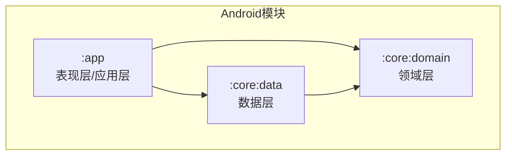
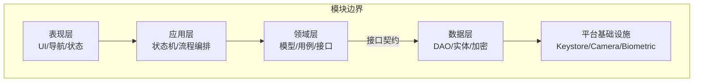
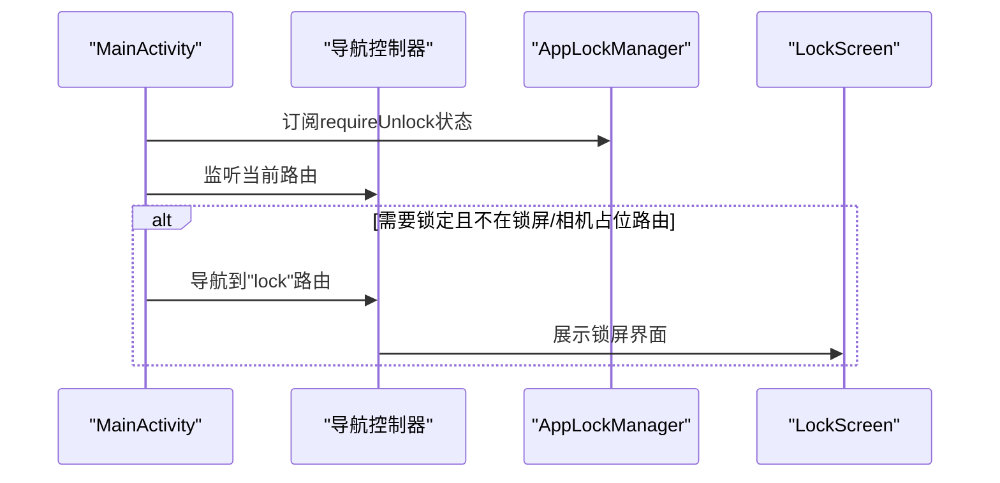
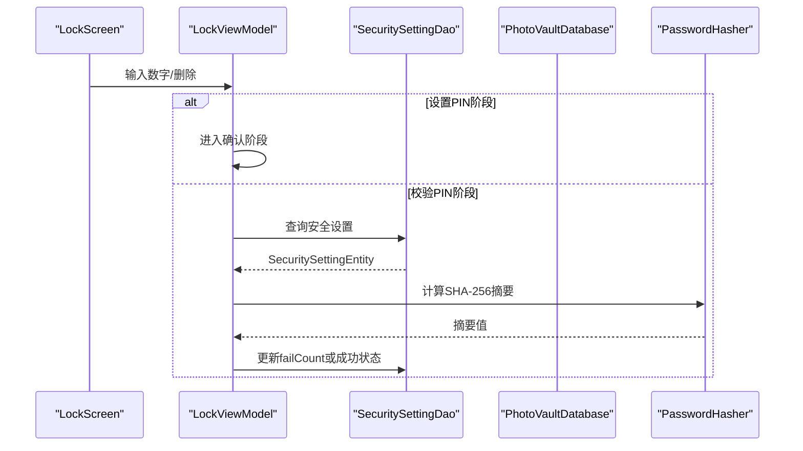
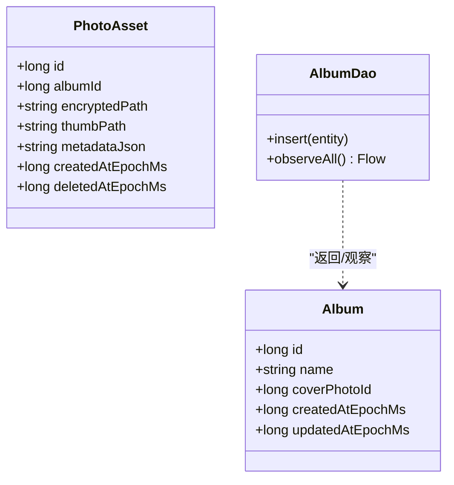
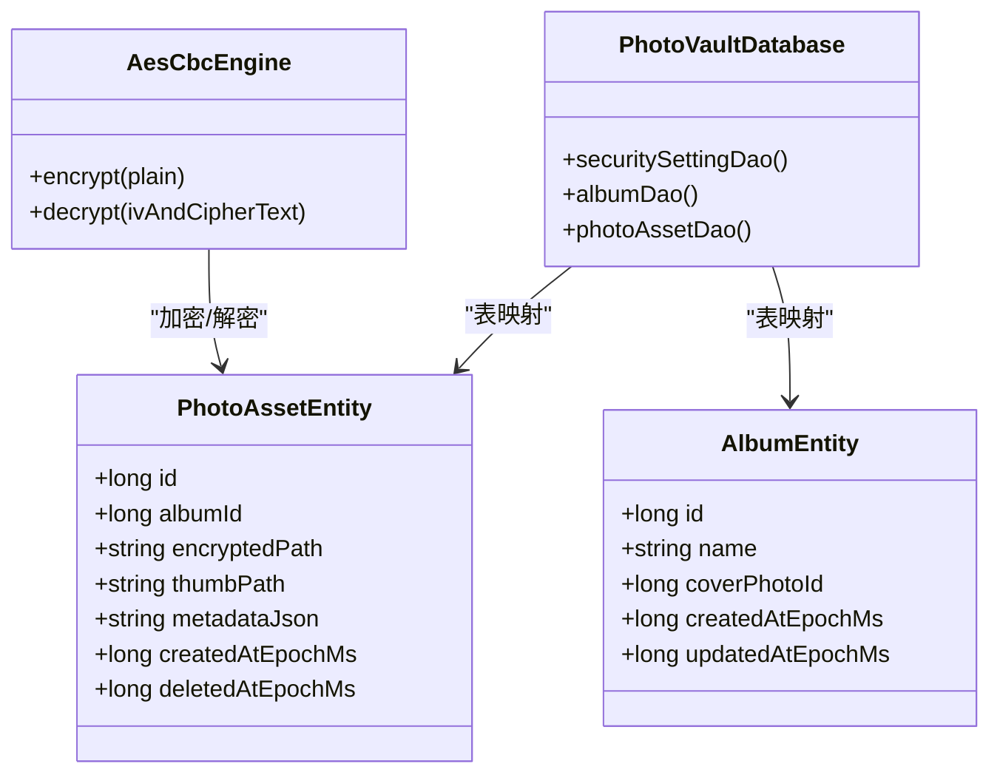
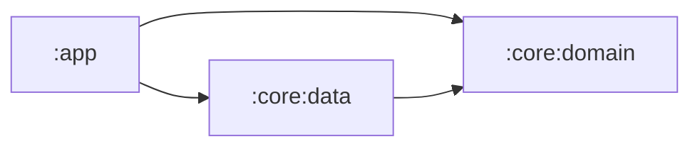

# Clean Architecture分层架构

<cite>
**本文引用的文件**
- [私密相册 App（一期）原生双端架构设计方案.md](file://spec/私密相册%20App（一期）原生双端架构设计方案.md)
- [android/app/src/main/kotlin/com/photovault/app/MainActivity.kt](file://android/app/src/main/kotlin/com/photovault/app/MainActivity.kt)
- [android/app/src/main/kotlin/com/photovault/app/ui/AiHomeScreen.kt](file://android/app/src/main/kotlin/com/photovault/app/ui/AiHomeScreen.kt)
- [android/app/src/main/kotlin/com/photovault/app/ui/vault/VaultStore.kt](file://android/app/src/main/kotlin/com/photovault/app/ui/vault/VaultStore.kt)
- [android/app/src/main/kotlin/com/photovault/app/ui/lock/LockViewModel.kt](file://android/app/src/main/kotlin/com/photovault/app/ui/lock/LockViewModel.kt)
- [android/app/src/main/kotlin/com/photovault/app/AppLockManager.kt](file://android/app/src/main/kotlin/com/photovault/app/AppLockManager.kt)
- [android/core/domain/src/main/kotlin/com/photovault/domain/model/PhotoAsset.kt](file://android/core/domain/src/main/kotlin/com/photovault/domain/model/PhotoAsset.kt)
- [android/core/domain/src/main/kotlin/com/photovault/domain/model/Album.kt](file://android/core/domain/src/main/kotlin/com/photovault/domain/model/Album.kt)
- [android/core/data/src/main/kotlin/com/photovault/data/db/entity/PhotoAssetEntity.kt](file://android/core/data/src/main/kotlin/com/photovault/data/db/entity/PhotoAssetEntity.kt)
- [android/core/data/src/main/kotlin/com/photovault/data/db/entity/AlbumEntity.kt](file://android/core/data/src/main/kotlin/com/photovault/data/db/entity/AlbumEntity.kt)
- [android/core/data/src/main/kotlin/com/photovault/data/db/dao/AlbumDao.kt](file://android/core/data/src/main/kotlin/com/photovault/data/db/dao/AlbumDao.kt)
- [android/core/data/src/main/kotlin/com/photovault/data/crypto/AesCbcEngine.kt](file://android/core/data/src/main/kotlin/com/photovault/data/crypto/AesCbcEngine.kt)
- [android/core/data/src/main/kotlin/com/photovault/data/di/DataModule.kt](file://android/core/data/src/main/kotlin/com/photovault/data/di/DataModule.kt)
- [android/app/build.gradle.kts](file://android/app/build.gradle.kts)
- [android/core/data/build.gradle.kts](file://android/core/data/build.gradle.kts)
- [android/core/domain/build.gradle.kts](file://android/core/domain/build.gradle.kts)
- [android/settings.gradle.kts](file://android/settings.gradle.kts)
</cite>

## 目录
1. [简介](#简介)
2. [项目结构](#项目结构)
3. [核心组件](#核心组件)
4. [架构总览](#架构总览)
5. [详细组件分析](#详细组件分析)
6. [依赖分析](#依赖分析)
7. [性能考虑](#性能考虑)
8. [故障排查指南](#故障排查指南)
9. [结论](#结论)
10. [附录](#附录)

## 简介
本文件面向AI照片保险库项目的Clean Architecture分层架构，基于现有代码库与架构文档，系统阐述五层职责划分与边界定义：表现层(Presentation)、应用层(Application)、领域层(Domain)、数据层(Data)、平台基础设施层(Platform)。重点解释依赖倒置、单一职责与关注点分离三大原则，明确层间依赖方向与数据流向，并通过序列图、类图与流程图展示关键交互与处理逻辑，帮助架构师与开发者建立清晰的分层指导原则。

## 项目结构
项目采用Gradle多模块组织，核心模块包括：
- app：表现层与应用层聚合模块，负责UI、导航、状态管理与应用级流程编排
- core:domain：领域层，包含领域模型与纯业务契约
- core:data：数据层，包含DAO、实体、加密与依赖注入配置

**图表来源**
- [android/settings.gradle.kts:17-20](file://android/settings.gradle.kts#L17-L20)
- [android/app/build.gradle.kts:64-65](file://android/app/build.gradle.kts#L64-L65)
- [android/core/data/build.gradle.kts:32](file://android/core/data/build.gradle.kts#L32)

**章节来源**
- [android/settings.gradle.kts:17-20](file://android/settings.gradle.kts#L17-L20)
- [android/app/build.gradle.kts:64-65](file://android/app/build.gradle.kts#L64-L65)
- [android/core/data/build.gradle.kts:32](file://android/core/data/build.gradle.kts#L32)
- [android/core/domain/build.gradle.kts:1-13](file://android/core/domain/build.gradle.kts#L1-L13)

## 核心组件
- 表现层组件
  - MainActivity：应用入口，负责导航编排、路由与全局状态联动（如解锁状态）
  - 各Screen组件：如AiHomeScreen，承担UI渲染与用户交互
  - VaultStore：应用层数据聚合与缓存，封装私密相册的文件系统读写与导入逻辑
  - LockViewModel：应用层状态机与业务流程编排，负责PIN设置/校验、生物识别联动与持久化
  - AppLockManager：应用层生命周期驱动的全局锁定策略

- 领域层组件
  - PhotoAsset、Album：领域模型，承载业务语义与不变属性
  - 用例/接口：当前代码体现为Repository接口与DAO观察模式，未来可抽象为UseCase

- 数据层组件
  - PhotoAssetEntity、AlbumEntity：Room实体，承载数据库结构
  - AlbumDao：DAO接口，暴露领域模型的查询与观察能力
  - AesCbcEngine：加密引擎，提供对称加解密能力
  - DataModule：Hilt模块，提供数据库、密钥与加密引擎的依赖

- 平台基础设施层
  - Android Keystore、BiometricPrompt、CameraX、WorkManager等作为平台能力的抽象与封装

**章节来源**
- [android/app/src/main/kotlin/com/photovault/app/MainActivity.kt:41-262](file://android/app/src/main/kotlin/com/photovault/app/MainActivity.kt#L41-L262)
- [android/app/src/main/kotlin/com/photovault/app/ui/AiHomeScreen.kt:1-56](file://android/app/src/main/kotlin/com/photovault/app/ui/AiHomeScreen.kt#L1-L56)
- [android/app/src/main/kotlin/com/photovault/app/ui/vault/VaultStore.kt:1-226](file://android/app/src/main/kotlin/com/photovault/app/ui/vault/VaultStore.kt#L1-L226)
- [android/app/src/main/kotlin/com/photovault/app/ui/lock/LockViewModel.kt:1-222](file://android/app/src/main/kotlin/com/photovault/app/ui/lock/LockViewModel.kt#L1-L222)
- [android/app/src/main/kotlin/com/photovault/app/AppLockManager.kt:1-49](file://android/app/src/main/kotlin/com/photovault/app/AppLockManager.kt#L1-L49)
- [android/core/domain/src/main/kotlin/com/photovault/domain/model/PhotoAsset.kt:1-15](file://android/core/domain/src/main/kotlin/com/photovault/domain/model/PhotoAsset.kt#L1-L15)
- [android/core/domain/src/main/kotlin/com/photovault/domain/model/Album.kt:1-13](file://android/core/domain/src/main/kotlin/com/photovault/domain/model/Album.kt#L1-L13)
- [android/core/data/src/main/kotlin/com/photovault/data/db/entity/PhotoAssetEntity.kt:1-33](file://android/core/data/src/main/kotlin/com/photovault/data/db/entity/PhotoAssetEntity.kt#L1-L33)
- [android/core/data/src/main/kotlin/com/photovault/data/db/entity/AlbumEntity.kt:1-19](file://android/core/data/src/main/kotlin/com/photovault/data/db/entity/AlbumEntity.kt#L1-L19)
- [android/core/data/src/main/kotlin/com/photovault/data/db/dao/AlbumDao.kt:1-18](file://android/core/data/src/main/kotlin/com/photovault/data/db/dao/AlbumDao.kt#L1-L18)
- [android/core/data/src/main/kotlin/com/photovault/data/crypto/AesCbcEngine.kt:1-40](file://android/core/data/src/main/kotlin/com/photovault/data/crypto/AesCbcEngine.kt#L1-L40)
- [android/core/data/src/main/kotlin/com/photovault/data/di/DataModule.kt:1-40](file://android/core/data/src/main/kotlin/com/photovault/data/di/DataModule.kt#L1-L40)

## 架构总览
Clean Architecture分层遵循“依赖向内”的原则，层间依赖方向为：表现层 → 应用层 → 领域层 →（接口）← 数据层；数据层依赖平台基础设施层。领域层不依赖数据层的具体实现，确保业务逻辑稳定与可测试。

**图表来源**
- [私密相册 App（一期）原生双端架构设计方案.md:20-55](file://spec/私密相册%20App（一期）原生双端架构设计方案.md#L20-L55)

**章节来源**
- [私密相册 App（一期）原生双端架构设计方案.md:20-55](file://spec/私密相册%20App（一期）原生双端架构设计方案.md#L20-L55)

## 详细组件分析

### 表现层（Presentation）
- 职责
  - UI渲染与用户交互
  - 导航编排与路由管理
  - 全局状态联动（如解锁状态）
- 关键实现
  - MainActivity：基于Navigation Compose进行路由编排，监听AppLockManager的requireUnlock状态，自动跳转到锁屏界面
  - AiHomeScreen：Compose UI组件，负责AI页面的布局与交互
  - VaultStore：应用层数据聚合对象，封装私密相册的文件系统读写、导入与缓存逻辑

**图表来源**
- [android/app/src/main/kotlin/com/photovault/app/MainActivity.kt:46-74](file://android/app/src/main/kotlin/com/photovault/app/MainActivity.kt#L46-L74)
- [android/app/src/main/kotlin/com/photovault/app/AppLockManager.kt:18-48](file://android/app/src/main/kotlin/com/photovault/app/AppLockManager.kt#L18-L48)

**章节来源**
- [android/app/src/main/kotlin/com/photovault/app/MainActivity.kt:41-262](file://android/app/src/main/kotlin/com/photovault/app/MainActivity.kt#L41-L262)
- [android/app/src/main/kotlin/com/photovault/app/ui/AiHomeScreen.kt:1-56](file://android/app/src/main/kotlin/com/photovault/app/ui/AiHomeScreen.kt#L1-L56)
- [android/app/src/main/kotlin/com/photovault/app/ui/vault/VaultStore.kt:1-226](file://android/app/src/main/kotlin/com/photovault/app/ui/vault/VaultStore.kt#L1-L226)
- [android/app/src/main/kotlin/com/photovault/app/AppLockManager.kt:1-49](file://android/app/src/main/kotlin/com/photovault/app/AppLockManager.kt#L1-L49)

### 应用层（Application）
- 职责
  - 会话与导航协调
  - 解锁状态机与生命周期锁定
  - PIN设置/校验与生物识别联动
- 关键实现
  - LockViewModel：封装PIN设置流程、校验与持久化；与SecuritySettingEntity交互；通过PasswordHasher进行口令摘要
  - AppLockManager：基于进程生命周期观察者，根据策略在onPause/onStop时触发锁定

**图表来源**
- [android/app/src/main/kotlin/com/photovault/app/ui/lock/LockViewModel.kt:19-197](file://android/app/src/main/kotlin/com/photovault/app/ui/lock/LockViewModel.kt#L19-L197)
- [android/core/data/src/main/kotlin/com/photovault/data/crypto/AesCbcEngine.kt:12-38](file://android/core/data/src/main/kotlin/com/photovault/data/crypto/AesCbcEngine.kt#L12-L38)

**章节来源**
- [android/app/src/main/kotlin/com/photovault/app/ui/lock/LockViewModel.kt:1-222](file://android/app/src/main/kotlin/com/photovault/app/ui/lock/LockViewModel.kt#L1-L222)
- [android/app/src/main/kotlin/com/photovault/app/AppLockManager.kt:1-49](file://android/app/src/main/kotlin/com/photovault/app/AppLockManager.kt#L1-L49)

### 领域层（Domain）
- 职责
  - 定义领域模型与不变业务语义
  - 抽象用例与Repository接口（当前以DAO观察模式体现）
- 关键实现
  - PhotoAsset、Album：领域模型，承载业务属性
  - AlbumDao.observeAll：以Flow暴露领域模型集合，体现“接口”向内依赖

**图表来源**
- [android/core/domain/src/main/kotlin/com/photovault/domain/model/PhotoAsset.kt:6-14](file://android/core/domain/src/main/kotlin/com/photovault/domain/model/PhotoAsset.kt#L6-L14)
- [android/core/domain/src/main/kotlin/com/photovault/domain/model/Album.kt:6-12](file://android/core/domain/src/main/kotlin/com/photovault/domain/model/Album.kt#L6-L12)
- [android/core/data/src/main/kotlin/com/photovault/data/db/dao/AlbumDao.kt:10-17](file://android/core/data/src/main/kotlin/com/photovault/data/db/dao/AlbumDao.kt#L10-L17)

**章节来源**
- [android/core/domain/src/main/kotlin/com/photovault/domain/model/PhotoAsset.kt:1-15](file://android/core/domain/src/main/kotlin/com/photovault/domain/model/PhotoAsset.kt#L1-L15)
- [android/core/domain/src/main/kotlin/com/photovault/domain/model/Album.kt:1-13](file://android/core/domain/src/main/kotlin/com/photovault/domain/model/Album.kt#L1-L13)
- [android/core/data/src/main/kotlin/com/photovault/data/db/dao/AlbumDao.kt:1-18](file://android/core/data/src/main/kotlin/com/photovault/data/db/dao/AlbumDao.kt#L1-L18)

### 数据层（Data）
- 职责
  - 提供Repository实现、本地数据库、文件仓库、加密管线与DTO映射
- 关键实现
  - PhotoAssetEntity、AlbumEntity：Room实体，承载数据库结构
  - DataModule：提供数据库、Keystore密钥与AesCbcEngine实例
  - AesCbcEngine：对称加解密实现，IV前置，与Keystore密钥结合

**图表来源**
- [android/core/data/src/main/kotlin/com/photovault/data/db/entity/PhotoAssetEntity.kt:24-32](file://android/core/data/src/main/kotlin/com/photovault/data/db/entity/PhotoAssetEntity.kt#L24-L32)
- [android/core/data/src/main/kotlin/com/photovault/data/db/entity/AlbumEntity.kt:12-18](file://android/core/data/src/main/kotlin/com/photovault/data/db/entity/AlbumEntity.kt#L12-L18)
- [android/core/data/src/main/kotlin/com/photovault/data/crypto/AesCbcEngine.kt:12-38](file://android/core/data/src/main/kotlin/com/photovault/data/crypto/AesCbcEngine.kt#L12-L38)
- [android/core/data/src/main/kotlin/com/photovault/data/di/DataModule.kt:18-38](file://android/core/data/src/main/kotlin/com/photovault/data/di/DataModule.kt#L18-L38)

**章节来源**
- [android/core/data/src/main/kotlin/com/photovault/data/db/entity/PhotoAssetEntity.kt:1-33](file://android/core/data/src/main/kotlin/com/photovault/data/db/entity/PhotoAssetEntity.kt#L1-L33)
- [android/core/data/src/main/kotlin/com/photovault/data/db/entity/AlbumEntity.kt:1-19](file://android/core/data/src/main/kotlin/com/photovault/data/db/entity/AlbumEntity.kt#L1-L19)
- [android/core/data/src/main/kotlin/com/photovault/data/crypto/AesCbcEngine.kt:1-40](file://android/core/data/src/main/kotlin/com/photovault/data/crypto/AesCbcEngine.kt#L1-L40)
- [android/core/data/src/main/kotlin/com/photovault/data/di/DataModule.kt:1-40](file://android/core/data/src/main/kotlin/com/photovault/data/di/DataModule.kt#L1-L40)

### 平台基础设施层（Platform）
- 职责
  - 提供系统能力抽象：相册、相机、生物识别、Keychain/Keystore、内购、系统分享、线程池、日志等
- 关键实现
  - DataModule中通过Hilt提供KeystoreSecretKeyProvider与AesCbcEngine，体现平台能力的注入与封装

**章节来源**
- [android/core/data/src/main/kotlin/com/photovault/data/di/DataModule.kt:29-38](file://android/core/data/src/main/kotlin/com/photovault/data/di/DataModule.kt#L29-L38)

## 依赖分析
- 依赖方向
  - 表现层依赖应用层（导航与状态）
  - 应用层依赖领域层（用例/接口）
  - 领域层不依赖数据层具体实现（通过接口约束）
  - 数据层依赖平台基础设施层（Keystore、Room等）
- 模块依赖
  - app依赖core:domain与core:data
  - core:data依赖core:domain

**图表来源**
- [android/app/build.gradle.kts:64-65](file://android/app/build.gradle.kts#L64-L65)
- [android/core/data/build.gradle.kts:32](file://android/core/data/build.gradle.kts#L32)

**章节来源**
- [android/app/build.gradle.kts:64-65](file://android/app/build.gradle.kts#L64-L65)
- [android/core/data/build.gradle.kts:32](file://android/core/data/build.gradle.kts#L32)

## 性能考虑
- 主线程仅做UI渲染与轻逻辑，加密、解码、AI、大批量IO在后台执行器
- 使用Kotlin Coroutines与Flow进行异步与响应式数据流
- Room数据库事务与索引优化，避免每张照片触发全表扫描
- 大图按目标尺寸解码，AI输入tensor尽量复用缓冲区
- 文件导入采用流式读写与去重校验，减少重复存储

**章节来源**
- [私密相册 App（一期）原生双端架构设计方案.md:151-157](file://spec/私密相册%20App（一期）原生双端架构设计方案.md#L151-L157)

## 故障排查指南
- 解锁PIN错误次数过多
  - 现象：输入PIN后提示错误并增加失败计数
  - 排查：检查SecuritySettingEntity的failCount字段是否正确更新；确认PasswordHasher摘要一致性
- 锁屏自动弹出异常
  - 现象：非预期进入锁屏
  - 排查：检查AppLockManager的生命周期回调策略与requireUnlock状态变化
- 私密相册导入重复
  - 现象：导入相同文件返回重复结果
  - 排查：检查VaultStore的SHA-256去重逻辑与文件重命名/覆盖策略

**章节来源**
- [android/app/src/main/kotlin/com/photovault/app/ui/lock/LockViewModel.kt:168-184](file://android/app/src/main/kotlin/com/photovault/app/ui/lock/LockViewModel.kt#L168-L184)
- [android/app/src/main/kotlin/com/photovault/app/AppLockManager.kt:37-47](file://android/app/src/main/kotlin/com/photovault/app/AppLockManager.kt#L37-L47)
- [android/app/src/main/kotlin/com/photovault/app/ui/vault/VaultStore.kt:120-154](file://android/app/src/main/kotlin/com/photovault/app/ui/vault/VaultStore.kt#L120-L154)

## 结论
本项目在Android端已初步实现Clean Architecture的分层边界与依赖方向：表现层负责UI与导航，应用层负责状态机与流程编排，领域层以模型与DAO接口为核心，数据层提供Repository实现与平台能力注入，平台基础设施层提供系统能力抽象。建议后续进一步抽象UseCase与Repository接口，强化领域层的独立性与可测试性，确保业务逻辑不被数据层实现细节污染。

## 附录
- 清单与约定
  - 依赖注入：通过Hilt在DataModule中集中提供数据库、密钥与加密引擎
  - 数据库：Room实体与DAO，配合索引与事务优化
  - 加密：AES-256-CBC（IV前置），与Keystore密钥结合
  - 导航：Navigation Compose路由管理，全局状态联动

**章节来源**
- [android/core/data/src/main/kotlin/com/photovault/data/di/DataModule.kt:18-38](file://android/core/data/src/main/kotlin/com/photovault/data/di/DataModule.kt#L18-L38)
- [android/core/data/src/main/kotlin/com/photovault/data/crypto/AesCbcEngine.kt:12-38](file://android/core/data/src/main/kotlin/com/photovault/data/crypto/AesCbcEngine.kt#L12-L38)
- [android/app/src/main/kotlin/com/photovault/app/MainActivity.kt:76-239](file://android/app/src/main/kotlin/com/photovault/app/MainActivity.kt#L76-L239)