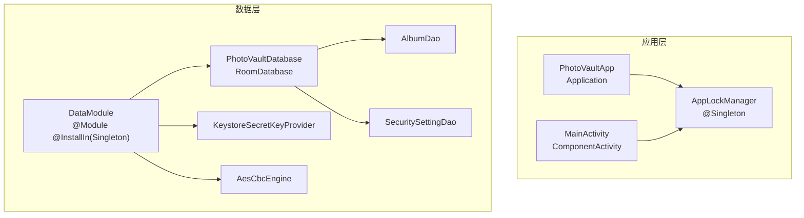
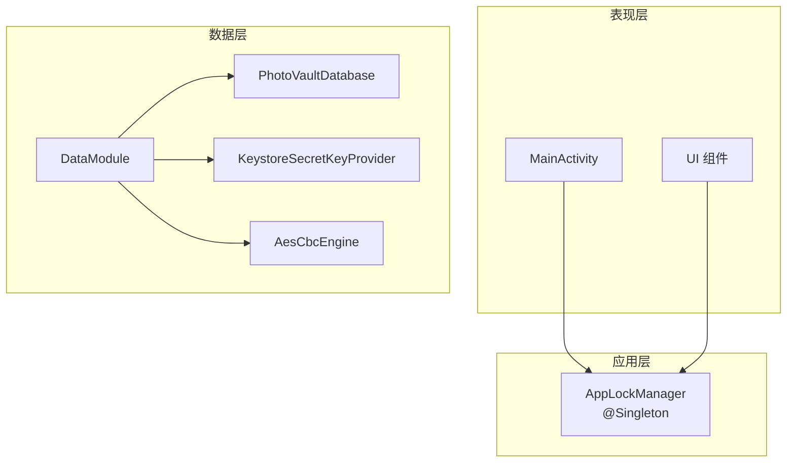
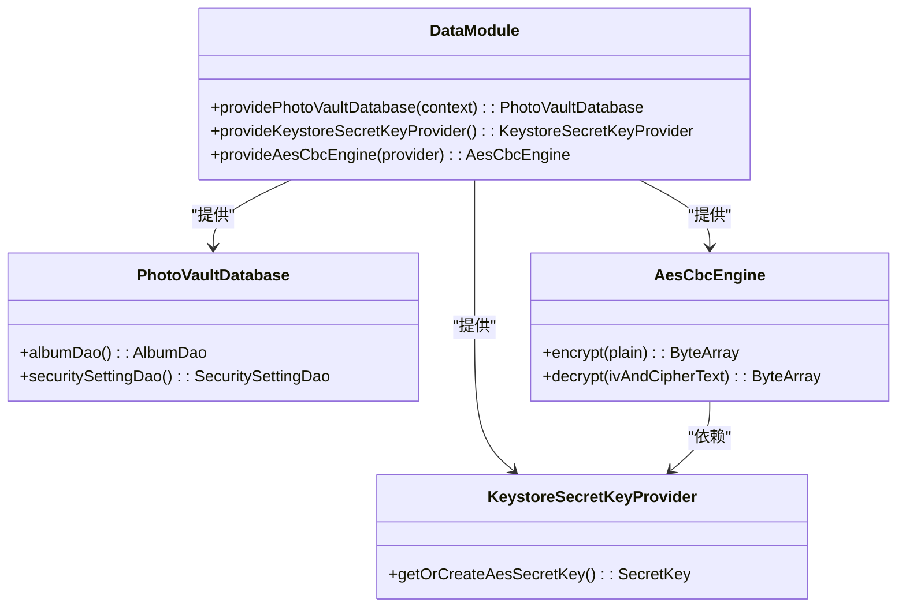
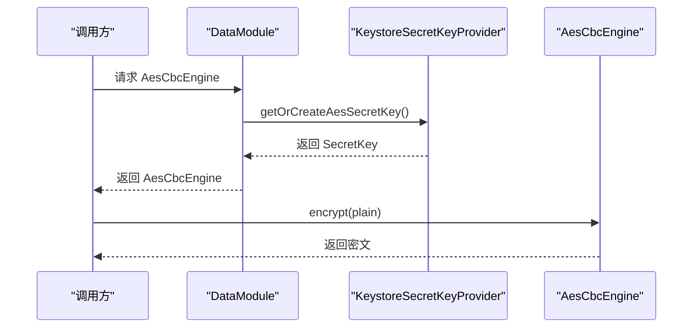
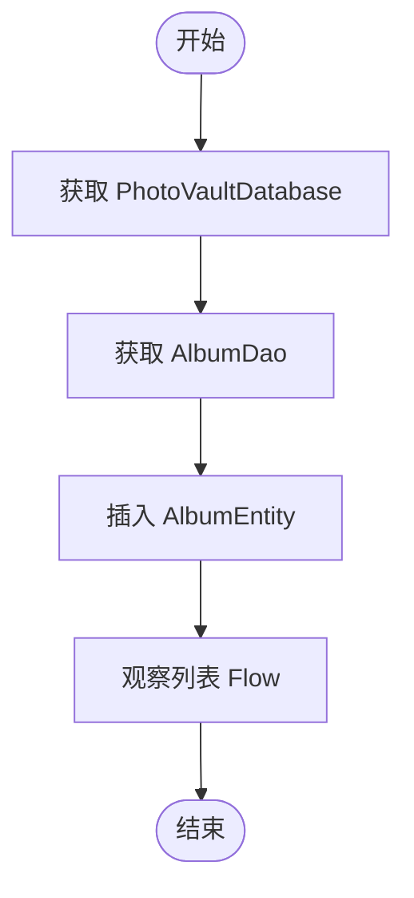
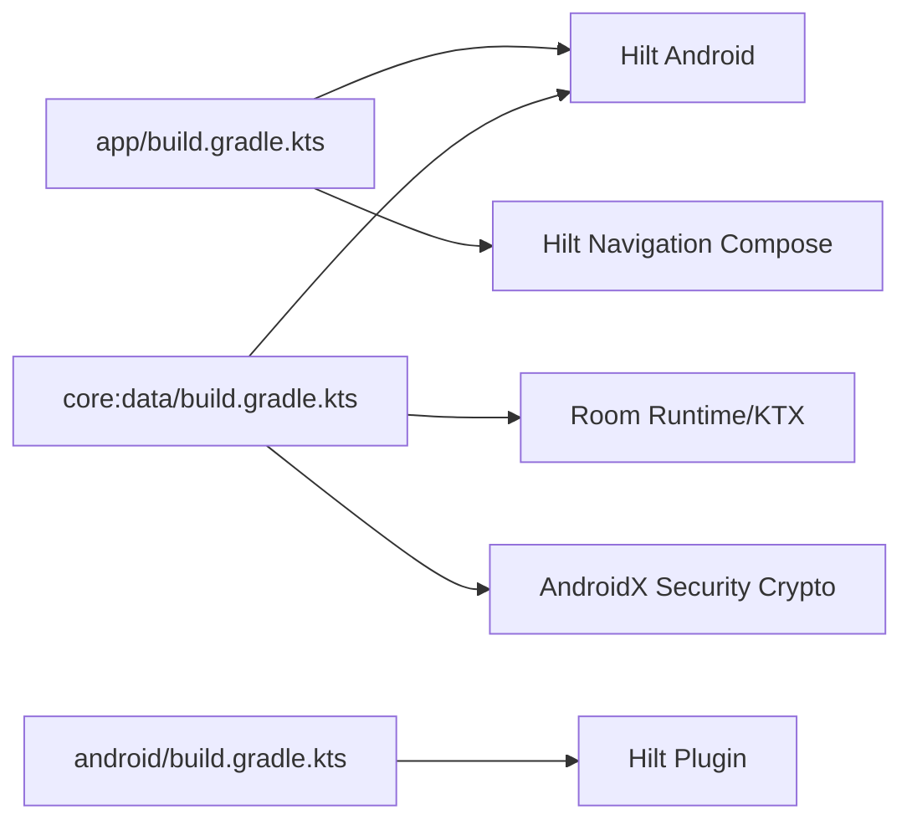

# 依赖注入配置

<cite>
**本文档引用的文件**
- [DataModule.kt](file://android/core/data/src/main/kotlin/com/photovault/data/di/DataModule.kt)
- [PhotoVaultDatabase.kt](file://android/core/data/src/main/kotlin/com/photovault/data/db/PhotoVaultDatabase.kt)
- [AesCbcEngine.kt](file://android/core/data/src/main/kotlin/com/photovault/data/crypto/AesCbcEngine.kt)
- [KeystoreSecretKeyProvider.kt](file://android/core/data/src/main/kotlin/com/photovault/data/crypto/KeystoreSecretKeyProvider.kt)
- [AlbumDao.kt](file://android/core/data/src/main/kotlin/com/photovault/data/db/dao/AlbumDao.kt)
- [PhotoVaultApp.kt](file://android/app/src/main/kotlin/com/photovault/app/PhotoVaultApp.kt)
- [MainActivity.kt](file://android/app/src/main/kotlin/com/photovault/app/MainActivity.kt)
- [AppLockManager.kt](file://android/app/src/main/kotlin/com/photovault/app/AppLockManager.kt)
- [app/build.gradle.kts](file://android/app/build.gradle.kts)
- [core_data_build.gradle.kts](file://android/core/data/build.gradle.kts)
- [android_build.gradle.kts](file://android/build.gradle.kts)
- [proguard-rules.pro](file://android/app/proguard-rules.pro)
</cite>

## 目录
1. [简介](#简介)
2. [项目结构](#项目结构)
3. [核心组件](#核心组件)
4. [架构总览](#架构总览)
5. [详细组件分析](#详细组件分析)
6. [依赖分析](#依赖分析)
7. [性能考虑](#性能考虑)
8. [故障排除指南](#故障排除指南)
9. [结论](#结论)
10. [附录](#附录)

## 简介
本文件聚焦于 AI 照片保险库项目中的依赖注入配置，系统性阐述 Hilt 框架在 Clean Architecture 中的应用方式与最佳实践。重点包括：
- DataModule 的依赖关系与绑定规则
- 如何通过依赖注入实现模块间解耦与可测试性
- 不同层（应用层、数据层、加密层）的注入策略
- 面向接口与面向实现的解耦思路
- 典型错误与排查建议

## 项目结构
本项目采用多模块结构，应用层与数据层分离，配合 Hilt 实现跨模块的依赖注入：
- 应用层（android/app）：负责 UI、生命周期管理、入口点（Application、Activity）
- 数据层（android/core/data）：负责数据库、加密、DAO、实体等基础设施
- 依赖注入集中在数据层的 DataModule，通过 Hilt 提供单例服务

图表来源
- [PhotoVaultApp.kt:1-31](file://android/app/src/main/kotlin/com/photovault/app/PhotoVaultApp.kt#L1-L31)
- [MainActivity.kt:1-262](file://android/app/src/main/kotlin/com/photovault/app/MainActivity.kt#L1-L262)
- [DataModule.kt:1-40](file://android/core/data/src/main/kotlin/com/photovault/data/di/DataModule.kt#L1-L40)
- [PhotoVaultDatabase.kt:1-36](file://android/core/data/src/main/kotlin/com/photovault/data/db/PhotoVaultDatabase.kt#L1-L36)
- [KeystoreSecretKeyProvider.kt:1-42](file://android/core/data/src/main/kotlin/com/photovault/data/crypto/KeystoreSecretKeyProvider.kt#L1-L42)
- [AesCbcEngine.kt:1-40](file://android/core/data/src/main/kotlin/com/photovault/data/crypto/AesCbcEngine.kt#L1-L40)
- [AlbumDao.kt:1-18](file://android/core/data/src/main/kotlin/com/photovault/data/db/dao/AlbumDao.kt#L1-L18)

章节来源
- [PhotoVaultApp.kt:1-31](file://android/app/src/main/kotlin/com/photovault/app/PhotoVaultApp.kt#L1-L31)
- [MainActivity.kt:1-262](file://android/app/src/main/kotlin/com/photovault/app/MainActivity.kt#L1-L262)
- [DataModule.kt:1-40](file://android/core/data/src/main/kotlin/com/photovault/data/di/DataModule.kt#L1-L40)
- [PhotoVaultDatabase.kt:1-36](file://android/core/data/src/main/kotlin/com/photovault/data/db/PhotoVaultDatabase.kt#L1-L36)

## 核心组件
- DataModule：定义数据层的依赖提供者，统一在 Singleton 组件中安装，确保全局唯一实例
- PhotoVaultDatabase：Room 数据库抽象，暴露 DAO 接口
- KeystoreSecretKeyProvider：Android Keystore 密钥提供器，负责主密钥生成与读取
- AesCbcEngine：对称加密封装，依赖 Keystore 提供的 SecretKey
- AppLockManager：应用锁管理器，作为单例注入到应用与活动，用于 UI 锁定逻辑
- PhotoVaultApp：应用入口，标注 @HiltAndroidApp，启用 Hilt 注入
- MainActivity：活动入口，标注 @AndroidEntryPoint，支持注入

章节来源
- [DataModule.kt:15-40](file://android/core/data/src/main/kotlin/com/photovault/data/di/DataModule.kt#L15-L40)
- [PhotoVaultDatabase.kt:14-36](file://android/core/data/src/main/kotlin/com/photovault/data/db/PhotoVaultDatabase.kt#L14-L36)
- [KeystoreSecretKeyProvider.kt:9-42](file://android/core/data/src/main/kotlin/com/photovault/data/crypto/KeystoreSecretKeyProvider.kt#L9-L42)
- [AesCbcEngine.kt:8-40](file://android/core/data/src/main/kotlin/com/photovault/data/crypto/AesCbcEngine.kt#L8-L40)
- [AppLockManager.kt:17-48](file://android/app/src/main/kotlin/com/photovault/app/AppLockManager.kt#L17-L48)
- [PhotoVaultApp.kt:7-17](file://android/app/src/main/kotlin/com/photovault/app/PhotoVaultApp.kt#L7-L17)
- [MainActivity.kt:38-44](file://android/app/src/main/kotlin/com/photovault/app/MainActivity.kt#L38-L44)

## 架构总览
下图展示了 Clean Architecture 中各层与依赖注入的交互关系：
- 表现层（UI 层）：MainActivity、UI 组件通过 @AndroidEntryPoint 注入服务
- 应用层（业务层）：AppLockManager 作为单例服务被 UI 使用
- 数据层（基础设施层）：DataModule 提供数据库、加密引擎等依赖

图表来源
- [MainActivity.kt:38-44](file://android/app/src/main/kotlin/com/photovault/app/MainActivity.kt#L38-L44)
- [AppLockManager.kt:17-48](file://android/app/src/main/kotlin/com/photovault/app/AppLockManager.kt#L17-L48)
- [DataModule.kt:15-40](file://android/core/data/src/main/kotlin/com/photovault/data/di/DataModule.kt#L15-L40)

## 详细组件分析

### DataModule 依赖关系与绑定规则
DataModule 将数据层的基础设施以单例形式提供给整个应用：
- 提供 PhotoVaultDatabase：基于 Room.databaseBuilder 构建数据库实例
- 提供 KeystoreSecretKeyProvider：用于从 Android Keystore 获取或生成主密钥
- 提供 AesCbcEngine：依赖 KeystoreSecretKeyProvider 提供的 SecretKey

图表来源
- [DataModule.kt:18-39](file://android/core/data/src/main/kotlin/com/photovault/data/di/DataModule.kt#L18-L39)
- [PhotoVaultDatabase.kt:26-28](file://android/core/data/src/main/kotlin/com/photovault/data/db/PhotoVaultDatabase.kt#L26-L28)
- [KeystoreSecretKeyProvider.kt:18-35](file://android/core/data/src/main/kotlin/com/photovault/data/crypto/KeystoreSecretKeyProvider.kt#L18-L35)
- [AesCbcEngine.kt:12-32](file://android/core/data/src/main/kotlin/com/photovault/data/crypto/AesCbcEngine.kt#L12-L32)

章节来源
- [DataModule.kt:15-40](file://android/core/data/src/main/kotlin/com/photovault/data/di/DataModule.kt#L15-L40)

### 加密流程序列图
以下序列图展示了从 Keystore 获取密钥到执行加密的完整调用链。

图表来源
- [DataModule.kt:34-39](file://android/core/data/src/main/kotlin/com/photovault/data/di/DataModule.kt#L34-L39)
- [KeystoreSecretKeyProvider.kt:18-35](file://android/core/data/src/main/kotlin/com/photovault/data/crypto/KeystoreSecretKeyProvider.kt#L18-L35)
- [AesCbcEngine.kt:17-23](file://android/core/data/src/main/kotlin/com/photovault/data/crypto/AesCbcEngine.kt#L17-L23)

### 数据库访问流程图
数据库访问通常遵循“先获取 DAO，再执行查询”的模式。以下流程图描述了基于 Room 的典型操作路径。

图表来源
- [PhotoVaultDatabase.kt:26-28](file://android/core/data/src/main/kotlin/com/photovault/data/db/PhotoVaultDatabase.kt#L26-L28)
- [AlbumDao.kt:11-17](file://android/core/data/src/main/kotlin/com/photovault/data/db/dao/AlbumDao.kt#L11-L17)

### Clean Architecture 中的依赖注入作用与优势
- 解耦：上层仅依赖抽象（如 DAO 接口），不关心具体实现，降低模块耦合度
- 可测试：可在测试环境中替换实现（如内存数据库、假加密器），提升单元测试覆盖率
- 生命周期管理：通过 @Singleton 等作用域限定，避免重复创建昂贵对象
- 可维护性：集中式依赖声明（DataModule）便于追踪与修改

## 依赖分析
- 模块依赖
  - 应用层依赖数据层与领域层（通过 implementation 引用）
  - 数据层依赖 Room、Hilt、AndroidX Security 等库
- 编译期依赖
  - 应用层与数据层均启用 KSP 与 Hilt 插件，确保注解处理器正确运行
- 运行时依赖
  - DataModule 在 Singleton 组件中提供全局单例，保证数据库与加密组件在整个应用生命周期内共享

图表来源
- [app/build.gradle.kts:64-86](file://android/app/build.gradle.kts#L64-L86)
- [core_data_build.gradle.kts:31-41](file://android/core/data/build.gradle.kts#L31-L41)
- [android_build.gradle.kts:1-9](file://android/build.gradle.kts#L1-L9)

章节来源
- [app/build.gradle.kts:63-91](file://android/app/build.gradle.kts#L63-L91)
- [core_data_build.gradle.kts:31-48](file://android/core/data/build.gradle.kts#L31-L48)
- [android_build.gradle.kts:1-9](file://android/build.gradle.kts#L1-L9)

## 性能考虑
- 单例复用：数据库与加密组件通过 @Singleton 提供，避免重复初始化带来的开销
- Room 查询：DAO 返回 Flow，避免阻塞主线程；在 UI 层应使用 collectAsState 等协程收集
- ProGuard/Hilt：已配置保留 Hilt 与反射相关类，确保发布包仍可正常注入

## 故障排除指南
- Hilt 未生成代码
  - 确认插件与 KSP 已启用，且编译器参数正确
  - 检查 @HiltAndroidApp 与 @AndroidEntryPoint 是否正确标注
- 注入失败（空指针）
  - 确保被注入类型有 @Inject 构造函数或由 @Module 提供
  - 检查 @InstallIn 范围是否匹配（当前为 SingletonComponent）
- Room 或加密异常
  - 确认数据库版本与迁移策略
  - 检查 Keystore 权限与密钥别名一致性

章节来源
- [proguard-rules.pro:3-9](file://android/app/proguard-rules.pro#L3-L9)
- [PhotoVaultApp.kt:7-17](file://android/app/src/main/kotlin/com/photovault/app/PhotoVaultApp.kt#L7-L17)
- [MainActivity.kt:41-44](file://android/app/src/main/kotlin/com/photovault/app/MainActivity.kt#L41-L44)

## 结论
本项目通过 Hilt 将数据层基础设施集中管理，并在 Singleton 组件中提供全局单例，实现了 Clean Architecture 中的依赖倒置与解耦。DataModule 的设计清晰地表达了“数据库—加密”两条关键依赖链，配合 @AndroidEntryPoint 与 @HiltAndroidApp，使应用层与数据层松耦合、易测试、可维护。

## 附录
- 依赖注入最佳实践
  - 优先使用 @Module 提供复杂依赖，保持构造函数简洁
  - 对外部系统（如数据库、加密）使用 @Singleton，避免重复创建
  - 在 UI 层使用 @AndroidEntryPoint，在 Application 层使用 @HiltAndroidApp
  - 测试环境替换实现，确保隔离与可重复性
- 清单与配置要点
  - 插件：Hilt、KSP、Room、Compose
  - ProGuard：保留 Hilt 与反射相关类
  - 作用域：SingletonComponent 安装 @Module