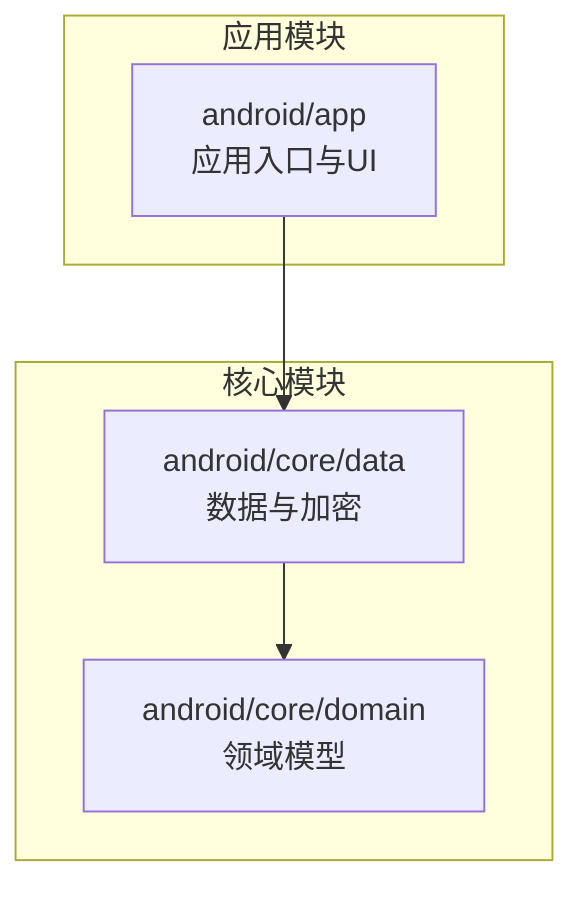
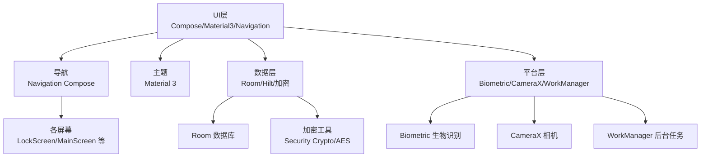
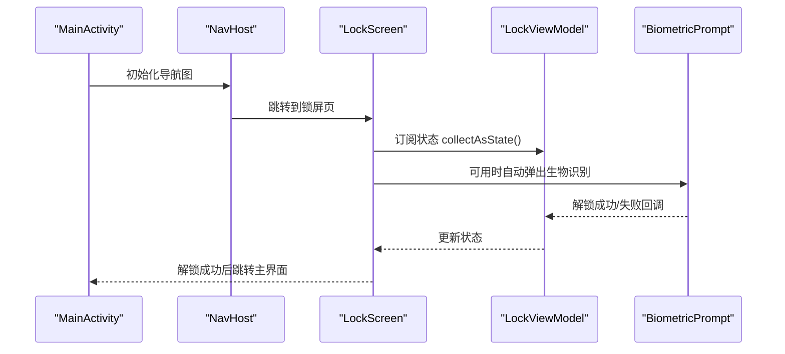
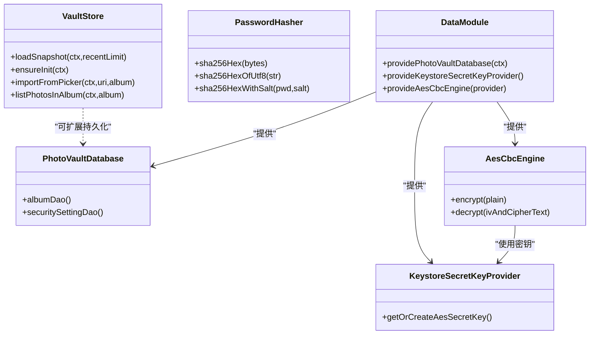
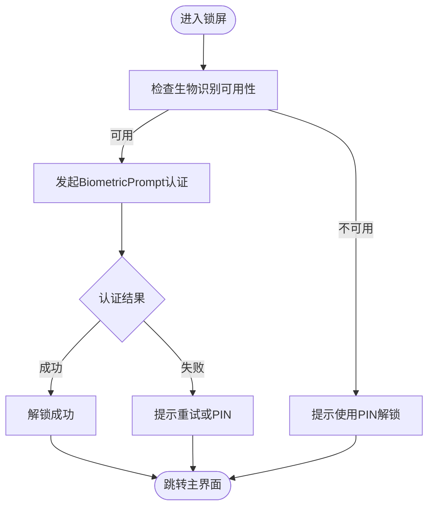
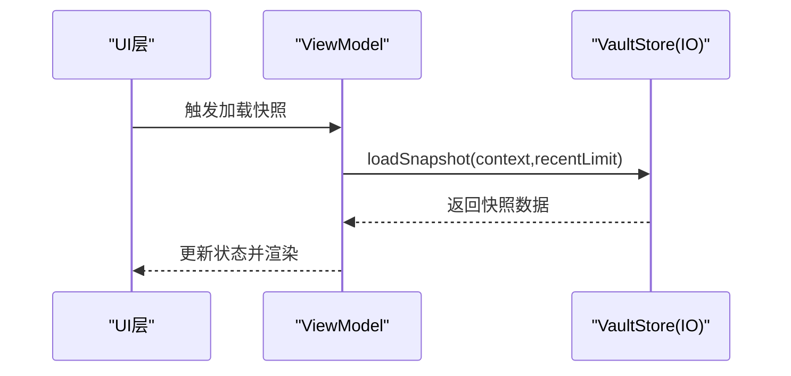
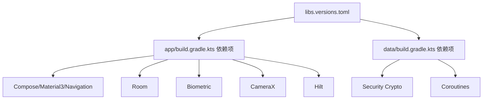

# 技术栈映射

<cite>
**本文引用的文件**
- [android/app/build.gradle.kts](file://android/app/build.gradle.kts)
- [android/core/data/build.gradle.kts](file://android/core/data/build.gradle.kts)
- [android/gradle/libs.versions.toml](file://android/gradle/libs.versions.toml)
- [android/app/src/main/kotlin/com/photovault/app/PhotoVaultApp.kt](file://android/app/src/main/kotlin/com/photovault/app/PhotoVaultApp.kt)
- [android/app/src/main/kotlin/com/photovault/app/MainActivity.kt](file://android/app/src/main/kotlin/com/photovault/app/MainActivity.kt)
- [android/app/src/main/kotlin/com/photovault/app/ui/theme/Theme.kt](file://android/app/src/main/kotlin/com/photovault/app/ui/theme/Theme.kt)
- [android/app/src/main/kotlin/com/photovault/app/ui/components/AppButton.kt](file://android/app/src/main/kotlin/com/photovault/app/ui/components/AppButton.kt)
- [android/app/src/main/kotlin/com/photovault/app/ui/lock/LockScreen.kt](file://android/app/src/main/kotlin/com/photovault/app/ui/lock/LockScreen.kt)
- [android/app/src/main/kotlin/com/photovault/app/ui/vault/VaultStore.kt](file://android/app/src/main/kotlin/com/photovault/app/ui/vault/VaultStore.kt)
- [android/core/data/src/main/kotlin/com/photovault/data/crypto/AesCbcEngine.kt](file://android/core/data/src/main/kotlin/com/photovault/data/crypto/AesCbcEngine.kt)
- [android/core/data/src/main/kotlin/com/photovault/data/crypto/KeystoreSecretKeyProvider.kt](file://android/core/data/src/main/kotlin/com/photovault/data/crypto/KeystoreSecretKeyProvider.kt)
- [android/core/data/src/main/kotlin/com/photovault/data/crypto/PasswordHasher.kt](file://android/core/data/src/main/kotlin/com/photovault/data/crypto/PasswordHasher.kt)
- [android/core/data/src/main/kotlin/com/photovault/data/db/PhotoVaultDatabase.kt](file://android/core/data/src/main/kotlin/com/photovault/data/db/PhotoVaultDatabase.kt)
- [android/core/data/src/main/kotlin/com/photovault/data/di/DataModule.kt](file://android/core/data/src/main/kotlin/com/photovault/data/di/DataModule.kt)
</cite>

## 目录
1. [引言](#引言)
2. [项目结构](#项目结构)
3. [核心组件](#核心组件)
4. [架构总览](#架构总览)
5. [详细组件分析](#详细组件分析)
6. [依赖分析](#依赖分析)
7. [性能考虑](#性能考虑)
8. [故障排查指南](#故障排查指南)
9. [结论](#结论)
10. [附录](#附录)

## 引言
本文件面向AI照片保险库（PhotoVault）Android端，提供完整的技术栈映射与选型说明。重点覆盖UI层（Jetpack Compose、Material 3、Navigation Compose）、数据层（Room数据库、加密库、安全存储）、平台层（CameraX、Biometric、WorkManager等）、异步处理（Kotlin Coroutines、Flow）。同时给出技术栈对比、选型理由以及开发者使用指南与最佳实践。

## 项目结构
Android端采用多模块结构：
- 应用模块：android/app，负责UI、导航、应用生命周期与主题。
- 数据模块：android/core/data，负责数据库、加密、依赖注入。
- 领域模型：android/core/domain，定义业务实体与模型（此处以接口形式存在，便于跨平台复用）。

图表来源
- [android/app/build.gradle.kts:63-90](file://android/app/build.gradle.kts#L63-L90)
- [android/core/data/build.gradle.kts:31-47](file://android/core/data/build.gradle.kts#L31-L47)

章节来源
- [android/app/build.gradle.kts:1-91](file://android/app/build.gradle.kts#L1-L91)
- [android/core/data/build.gradle.kts:1-48](file://android/core/data/build.gradle.kts#L1-L48)
- [android/gradle/libs.versions.toml:1-64](file://android/gradle/libs.versions.toml#L1-L64)

## 核心组件
- UI层：Jetpack Compose + Material 3 + Navigation Compose，提供声明式UI与路由编排。
- 数据层：Room持久化 + Hilt依赖注入 + 加密工具链（AndroidX Security Crypto + 自研对称加密引擎）。
- 平台层：Biometric生物识别、CameraX相机框架、WorkManager后台任务（按需引入）。
- 异步处理：Kotlin Coroutines + Flow，统一协程作用域与响应式流。

章节来源
- [android/app/src/main/kotlin/com/photovault/app/MainActivity.kt:76-242](file://android/app/src/main/kotlin/com/photovault/app/MainActivity.kt#L76-L242)
- [android/app/src/main/kotlin/com/photovault/app/ui/theme/Theme.kt:9-18](file://android/app/src/main/kotlin/com/photovault/app/ui/theme/Theme.kt#L9-L18)
- [android/core/data/build.gradle.kts:34-41](file://android/core/data/build.gradle.kts#L34-L41)
- [android/app/build.gradle.kts:67-86](file://android/app/build.gradle.kts#L67-L86)

## 架构总览
应用采用“UI层-数据层-平台服务”分层，UI层通过Navigation Compose进行路由编排，数据层通过Hilt注入Room数据库与加密组件，平台能力通过Biometric、CameraX等系统服务提供。

图表来源
- [android/app/src/main/kotlin/com/photovault/app/MainActivity.kt:76-242](file://android/app/src/main/kotlin/com/photovault/app/MainActivity.kt#L76-L242)
- [android/app/src/main/kotlin/com/photovault/app/ui/theme/Theme.kt:9-18](file://android/app/src/main/kotlin/com/photovault/app/ui/theme/Theme.kt#L9-L18)
- [android/core/data/src/main/kotlin/com/photovault/data/db/PhotoVaultDatabase.kt:14-35](file://android/core/data/src/main/kotlin/com/photovault/data/db/PhotoVaultDatabase.kt#L14-L35)
- [android/core/data/src/main/kotlin/com/photovault/data/di/DataModule.kt:15-39](file://android/core/data/src/main/kotlin/com/photovault/data/di/DataModule.kt#L15-L39)

## 详细组件分析

### UI层：Jetpack Compose、Material 3、Navigation Compose
- 主题系统：基于Material 3，根据系统深色模式动态切换颜色方案，并通过自定义Typography与UiTokens统一风格。
- 导航：在MainActivity中集中配置NavHost与各路由，包含开屏、锁屏、主界面、搜索、相册、回收站、备份恢复等。
- 锁屏界面：集成BiometricPrompt进行生物识别解锁，支持PIN输入与快速拍照入口，状态通过ViewModel驱动，使用LaunchedEffect与collectAsState响应式更新。
- 组件库：AppButton等基础控件封装了点击反馈、禁用态与加载态，统一按钮变体与尺寸。

图表来源
- [android/app/src/main/kotlin/com/photovault/app/MainActivity.kt:76-144](file://android/app/src/main/kotlin/com/photovault/app/MainActivity.kt#L76-L144)
- [android/app/src/main/kotlin/com/photovault/app/ui/lock/LockScreen.kt:52-123](file://android/app/src/main/kotlin/com/photovault/app/ui/lock/LockScreen.kt#L52-L123)

章节来源
- [android/app/src/main/kotlin/com/photovault/app/MainActivity.kt:76-242](file://android/app/src/main/kotlin/com/photovault/app/MainActivity.kt#L76-L242)
- [android/app/src/main/kotlin/com/photovault/app/ui/theme/Theme.kt:9-18](file://android/app/src/main/kotlin/com/photovault/app/ui/theme/Theme.kt#L9-L18)
- [android/app/src/main/kotlin/com/photovault/app/ui/components/AppButton.kt:26-66](file://android/app/src/main/kotlin/com/photovault/app/ui/components/AppButton.kt#L26-L66)
- [android/app/src/main/kotlin/com/photovault/app/ui/lock/LockScreen.kt:52-228](file://android/app/src/main/kotlin/com/photovault/app/ui/lock/LockScreen.kt#L52-L228)

### 数据层：Room数据库、加密库、安全存储
- Room数据库：定义PhotoVaultDatabase，包含Album、PhotoAsset、TrashItem、SecuritySetting、SubscriptionState、BackupRecord等实体，提供DAO访问接口。
- 依赖注入：DataModule通过Hilt提供数据库实例、Keystore密钥提供器与AES对称加密引擎。
- 加密策略：
  - 对称加密：AesCbcEngine基于AES/CBC/PKCS5Padding，IV前置16字节，密钥来自KeystoreSecretKeyProvider。
  - 主密钥托管：KeystoreSecretKeyProvider在Android Keystore中生成/读取AES密钥，不可导出。
  - 口令哈希：PasswordHasher提供SHA-256口令哈希，支持salt拼接，用于PIN等口令安全存储。
- 安全存储：VaultStore封装私密相册文件系统，使用filesDir下的目录结构保存照片，导入时计算SHA-256去重，迁移旧目录结构。

图表来源
- [android/core/data/src/main/kotlin/com/photovault/data/db/PhotoVaultDatabase.kt:14-35](file://android/core/data/src/main/kotlin/com/photovault/data/db/PhotoVaultDatabase.kt#L14-L35)
- [android/core/data/src/main/kotlin/com/photovault/data/di/DataModule.kt:18-39](file://android/core/data/src/main/kotlin/com/photovault/data/di/DataModule.kt#L18-L39)
- [android/core/data/src/main/kotlin/com/photovault/data/crypto/KeystoreSecretKeyProvider.kt:18-35](file://android/core/data/src/main/kotlin/com/photovault/data/crypto/KeystoreSecretKeyProvider.kt#L18-L35)
- [android/core/data/src/main/kotlin/com/photovault/data/crypto/AesCbcEngine.kt:17-32](file://android/core/data/src/main/kotlin/com/photovault/data/crypto/AesCbcEngine.kt#L17-L32)
- [android/core/data/src/main/kotlin/com/photovault/data/crypto/PasswordHasher.kt:9-24](file://android/core/data/src/main/kotlin/com/photovault/data/crypto/PasswordHasher.kt#L9-L24)
- [android/app/src/main/kotlin/com/photovault/app/ui/vault/VaultStore.kt:39-154](file://android/app/src/main/kotlin/com/photovault/app/ui/vault/VaultStore.kt#L39-L154)

章节来源
- [android/core/data/src/main/kotlin/com/photovault/data/db/PhotoVaultDatabase.kt:14-35](file://android/core/data/src/main/kotlin/com/photovault/data/db/PhotoVaultDatabase.kt#L14-L35)
- [android/core/data/src/main/kotlin/com/photovault/data/di/DataModule.kt:18-39](file://android/core/data/src/main/kotlin/com/photovault/data/di/DataModule.kt#L18-L39)
- [android/core/data/src/main/kotlin/com/photovault/data/crypto/KeystoreSecretKeyProvider.kt:18-35](file://android/core/data/src/main/kotlin/com/photovault/data/crypto/KeystoreSecretKeyProvider.kt#L18-L35)
- [android/core/data/src/main/kotlin/com/photovault/data/crypto/AesCbcEngine.kt:17-32](file://android/core/data/src/main/kotlin/com/photovault/data/crypto/AesCbcEngine.kt#L17-L32)
- [android/core/data/src/main/kotlin/com/photovault/data/crypto/PasswordHasher.kt:9-24](file://android/core/data/src/main/kotlin/com/photovault/data/crypto/PasswordHasher.kt#L9-L24)
- [android/app/src/main/kotlin/com/photovault/app/ui/vault/VaultStore.kt:39-154](file://android/app/src/main/kotlin/com/photovault/app/ui/vault/VaultStore.kt#L39-L154)

### 平台层：CameraX、Biometric、WorkManager
- Biometric：在锁屏界面通过BiometricManager判断可用性，使用BiometricPrompt发起认证，回调处理成功/失败/取消等场景。
- CameraX：在应用构建脚本中声明依赖，用于私密拍照与相机占位页功能（具体实现可在后续迭代中接入）。
- WorkManager：作为后台任务调度的候选方案，适合定时同步、备份/恢复等离线任务（当前仓库未直接使用，但具备集成条件）。

图表来源
- [android/app/src/main/kotlin/com/photovault/app/ui/lock/LockScreen.kt:65-106](file://android/app/src/main/kotlin/com/photovault/app/ui/lock/LockScreen.kt#L65-L106)
- [android/app/src/main/kotlin/com/photovault/app/ui/lock/LockScreen.kt:365-382](file://android/app/src/main/kotlin/com/photovault/app/ui/lock/LockScreen.kt#L365-L382)

章节来源
- [android/app/src/main/kotlin/com/photovault/app/ui/lock/LockScreen.kt:65-106](file://android/app/src/main/kotlin/com/photovault/app/ui/lock/LockScreen.kt#L65-L106)
- [android/app/build.gradle.kts:80-83](file://android/app/build.gradle.kts#L80-L83)

### 异步处理：Kotlin Coroutines、Flow
- 协程作用域：VaultStore在IO线程执行文件系统操作，避免阻塞主线程。
- Flow与State：MainActivity中通过collectAsState与LaunchedEffect响应式地控制导航与锁屏逻辑。
- 依赖注入：Hilt在DataModule中提供单例对象，确保加密与数据库实例在整个应用生命周期内稳定可用。

图表来源
- [android/app/src/main/kotlin/com/photovault/app/ui/vault/VaultStore.kt:47-58](file://android/app/src/main/kotlin/com/photovault/app/ui/vault/VaultStore.kt#L47-L58)
- [android/app/src/main/kotlin/com/photovault/app/MainActivity.kt:56-74](file://android/app/src/main/kotlin/com/photovault/app/MainActivity.kt#L56-L74)

章节来源
- [android/app/src/main/kotlin/com/photovault/app/ui/vault/VaultStore.kt:47-58](file://android/app/src/main/kotlin/com/photovault/app/ui/vault/VaultStore.kt#L47-L58)
- [android/app/src/main/kotlin/com/photovault/app/MainActivity.kt:56-74](file://android/app/src/main/kotlin/com/photovault/app/MainActivity.kt#L56-L74)

## 依赖分析
- 版本管理：libs.versions.toml集中管理各依赖版本，确保Compose、Lifecycle、Room、Biometric、CameraX、Security、Coroutines等版本一致性。
- 应用模块依赖：app模块启用Compose、Hilt、KSP，依赖core:domain与core:data；同时引入Compose UI、Material3、Navigation Compose、Room、Biometric、CameraX、Hilt等。
- 数据模块依赖：data模块引入Room运行时与KTX、KSP编译器、Security Crypto、Hilt及测试依赖。

图表来源
- [android/gradle/libs.versions.toml:23-54](file://android/gradle/libs.versions.toml#L23-L54)
- [android/app/build.gradle.kts:67-89](file://android/app/build.gradle.kts#L67-L89)
- [android/core/data/build.gradle.kts:34-41](file://android/core/data/build.gradle.kts#L34-L41)

章节来源
- [android/gradle/libs.versions.toml:1-64](file://android/gradle/libs.versions.toml#L1-L64)
- [android/app/build.gradle.kts:63-90](file://android/app/build.gradle.kts#L63-L90)
- [android/core/data/build.gradle.kts:31-47](file://android/core/data/build.gradle.kts#L31-L47)

## 性能考虑
- UI渲染：使用Material 3主题与统一的Typography/Token，减少重复样式计算；组件层通过状态收敛与最小化重组提升性能。
- 数据访问：Room数据库结合DAO与查询优化，避免在主线程执行IO；加密与哈希计算尽量在IO线程完成。
- 文件系统：VaultStore对相册列表与最近照片做缓存，降低重复扫描成本；导入时使用流式复制与SHA-256去重，避免重复写入。
- 协程调度：明确区分IO与默认调度器，避免主线程阻塞；合理使用withContext切换上下文。

## 故障排查指南
- 全局异常边界：应用在PhotoVaultApp中设置默认未捕获异常处理器，记录异常并交由前一个处理器处理，便于定位崩溃问题。
- 锁屏与生物识别：若生物识别不可用，应检查系统设置中的录入情况与硬件支持；在回调中区分用户取消与错误类型，避免误判。
- 数据库升级：Room数据库版本从1开始，后续升级需新增Migration并在数据库版本递增时注册。
- 加密与密钥：Keystore密钥不可导出，如遇密钥损坏或迁移，需评估重新初始化流程与数据恢复策略。

章节来源
- [android/app/src/main/kotlin/com/photovault/app/PhotoVaultApp.kt:19-29](file://android/app/src/main/kotlin/com/photovault/app/PhotoVaultApp.kt#L19-L29)
- [android/app/src/main/kotlin/com/photovault/app/ui/lock/LockScreen.kt:81-98](file://android/app/src/main/kotlin/com/photovault/app/ui/lock/LockScreen.kt#L81-L98)
- [android/core/data/src/main/kotlin/com/photovault/data/db/PhotoVaultDatabase.kt:30-34](file://android/core/data/src/main/kotlin/com/photovault/data/db/PhotoVaultDatabase.kt#L30-L34)
- [android/core/data/src/main/kotlin/com/photovault/data/crypto/KeystoreSecretKeyProvider.kt:18-35](file://android/core/data/src/main/kotlin/com/photovault/data/crypto/KeystoreSecretKeyProvider.kt#L18-L35)

## 结论
本项目在Android端采用现代技术栈组合：UI层以Jetpack Compose + Material 3 + Navigation Compose实现声明式与可维护的界面；数据层以Room + Hilt + 加密工具链保障数据安全与可扩展；平台层通过Biometric与CameraX满足安全与相机需求；异步处理以Kotlin Coroutines与Flow统一并发模型。整体架构清晰、职责分离、易于演进。

## 附录
- 开发者使用指南与最佳实践
  - UI层
    - 使用Material 3主题与统一的UiTokens，避免硬编码颜色与尺寸。
    - 将交互反馈（PressFeedback/ThrottledClick）封装在组件中，保持调用简洁。
    - 导航参数使用Uri.encode/decode，避免路径解析问题。
  - 数据层
    - Room查询尽量使用DAO与事务，避免在主线程执行数据库操作。
    - 加密数据的密钥与盐值管理遵循最小暴露原则，避免明文存储。
    - 导入照片时先计算哈希再决定是否写入，减少重复IO。
  - 平台层
    - 生物识别需兼容多种失败场景，提供明确的用户提示与回退方案。
    - 相机相关功能建议延迟接入，确保权限与生命周期管理完善。
  - 异步处理
    - 明确协程作用域与调度器，避免主线程阻塞。
    - 使用Flow与State进行响应式UI更新，避免手动订阅与内存泄漏。