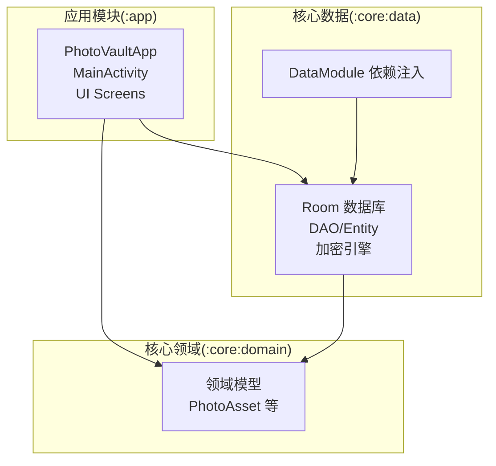
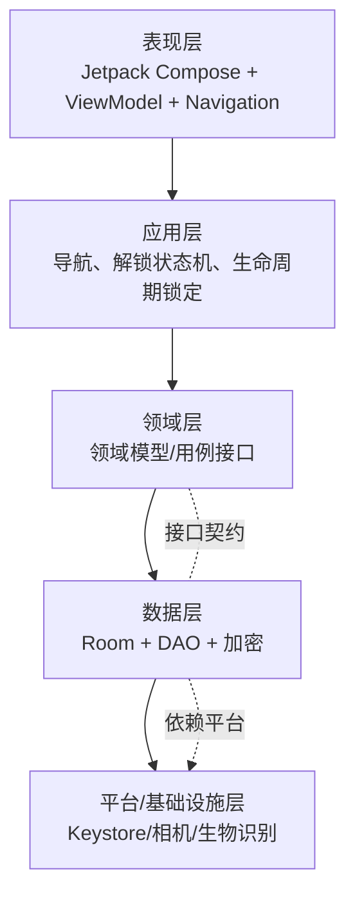
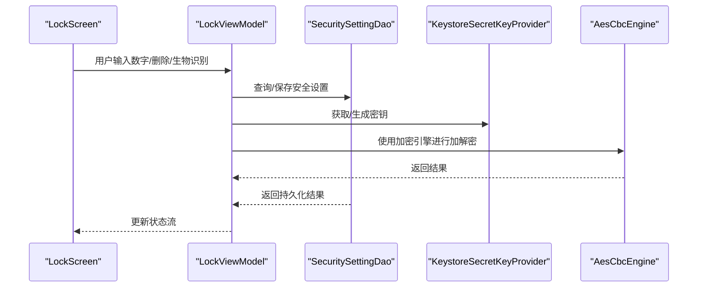
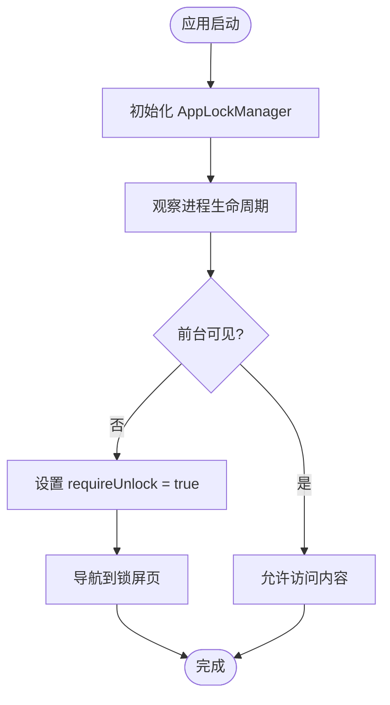
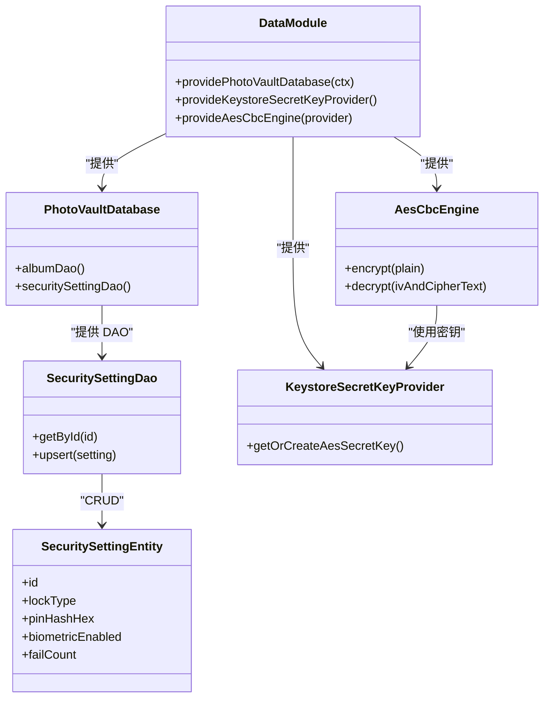
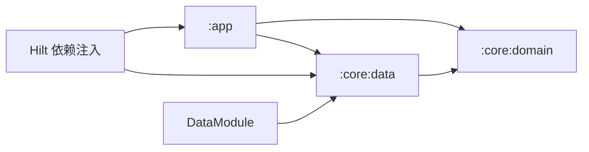

# 架构设计

<cite>
**本文引用的文件**
- [PhotoVaultApp.kt](file://android/app/src/main/kotlin/com/photovault/app/PhotoVaultApp.kt)
- [MainActivity.kt](file://android/app/src/main/kotlin/com/photovault/app/MainActivity.kt)
- [AppLockManager.kt](file://android/app/src/main/kotlin/com/photovault/app/AppLockManager.kt)
- [LockViewModel.kt](file://android/app/src/main/kotlin/com/photovault/app/ui/lock/LockViewModel.kt)
- [LockScreen.kt](file://android/app/src/main/kotlin/com/photovault/app/ui/lock/LockScreen.kt)
- [Theme.kt](file://android/app/src/main/kotlin/com/photovault/app/ui/theme/Theme.kt)
- [AppButton.kt](file://android/app/src/main/kotlin/com/photovault/app/ui/components/AppButton.kt)
- [DataModule.kt](file://android/core/data/src/main/kotlin/com/photovault/data/di/DataModule.kt)
- [PhotoVaultDatabase.kt](file://android/core/data/src/main/kotlin/com/photovault/data/db/PhotoVaultDatabase.kt)
- [SecuritySettingDao.kt](file://android/core/data/src/main/kotlin/com/photovault/data/db/dao/SecuritySettingDao.kt)
- [SecuritySettingEntity.kt](file://android/core/data/src/main/kotlin/com/photovault/data/db/entity/SecuritySettingEntity.kt)
- [AesCbcEngine.kt](file://android/core/data/src/main/kotlin/com/photovault/data/crypto/AesCbcEngine.kt)
- [KeystoreSecretKeyProvider.kt](file://android/core/data/src/main/kotlin/com/photovault/data/crypto/KeystoreSecretKeyProvider.kt)
- [PhotoAsset.kt](file://android/core/domain/src/main/kotlin/com/photovault/domain/model/PhotoAsset.kt)
- [私密相册 App（一期）原生双端架构设计方案.md](file://spec/私密相册 App（一期）原生双端架构设计方案.md)
- [build.gradle.kts（app 模块）](file://android/app/build.gradle.kts)
- [build.gradle.kts（core:data 模块）](file://android/core/data/build.gradle.kts)
- [build.gradle.kts（core:domain 模块）](file://android/core/domain/build.gradle.kts)
</cite>

## 目录
1. [简介](#简介)
2. [项目结构](#项目结构)
3. [核心组件](#核心组件)
4. [架构总览](#架构总览)
5. [详细组件分析](#详细组件分析)
6. [依赖分析](#依赖分析)
7. [性能考虑](#性能考虑)
8. [故障排查指南](#故障排查指南)
9. [结论](#结论)
10. [附录](#附录)

## 简介
本文件面向架构师与高级开发者，系统化阐述“AI照片保险库”项目的 Clean Architecture 分层架构设计与实现要点。项目采用同构分层（Android/iOS），在 Android 端以 Jetpack Compose + ViewModel + Navigation 作为表现层，以 Hilt 作为依赖注入容器，以 Room + 加密管线作为数据层，以领域模型与用例为核心构建业务能力，并将平台差异收敛在平台与基础设施层。

## 项目结构
项目采用模块化组织，核心模块包括：
- 应用模块（:app）：包含 Android 应用入口、UI 层、导航与应用级状态管理
- 核心领域（:core:domain）：纯 Kotlin 模块，承载领域模型与用例契约
- 核心数据（:core:data）：Room 数据库、DAO、实体、加密组件与依赖注入模块

**图表来源**
- [PhotoVaultApp.kt:1-31](file://android/app/src/main/kotlin/com/photovault/app/PhotoVaultApp.kt#L1-L31)
- [MainActivity.kt:1-262](file://android/app/src/main/kotlin/com/photovault/app/MainActivity.kt#L1-L262)
- [build.gradle.kts（app 模块）](file://android/app/build.gradle.kts)
- [build.gradle.kts（core:data 模块）](file://android/core/data/build.gradle.kts)
- [build.gradle.kts（core:domain 模块）](file://android/core/domain/build.gradle.kts)

**章节来源**
- [私密相册 App（一期）原生双端架构设计方案.md:20-54](file://spec/私密相册 App（一期）原生双端架构设计方案.md#L20-L54)
- [PhotoVaultApp.kt:1-31](file://android/app/src/main/kotlin/com/photovault/app/PhotoVaultApp.kt#L1-L31)
- [MainActivity.kt:1-262](file://android/app/src/main/kotlin/com/photovault/app/MainActivity.kt#L1-L262)

## 核心组件
- 表现层（Presentation）
  - 应用入口与全局异常边界：Application 级别安装日志与未捕获异常处理器
  - Activity 与导航：基于 Navigation Compose 的路由与页面跳转
  - UI 组件与主题：统一的主题、按钮组件与反馈机制
  - 锁屏与解锁：LockScreen + LockViewModel + AppLockManager 实现 PIN 设置与生物识别解锁
- 应用层（Application）
  - 应用级状态：AppLockManager 提供全局“是否需要解锁”的状态流
  - 生命周期观察：在前台可见性变化时触发锁定策略
- 领域层（Domain）
  - 领域模型：PhotoAsset 等承载业务语义的数据结构
  - 用例与接口：以接口形式定义数据访问契约，避免上层依赖具体实现
- 数据层（Data）
  - Room 数据库：PhotoVaultDatabase 管理实体与 DAO
  - DAO 与实体：SecuritySettingDao/Entity 管理安全设置
  - 加密管线：KeystoreSecretKeyProvider + AesCbcEngine 提供密钥与加解密能力
  - 依赖注入：DataModule 提供数据库、密钥提供者与加密引擎实例
- 平台与基础设施层（Platform/Infra）
  - Android 生物识别、相机、系统分享、WorkManager 等平台能力在上层以接口或平台模块承接

**章节来源**
- [PhotoVaultApp.kt:12-30](file://android/app/src/main/kotlin/com/photovault/app/PhotoVaultApp.kt#L12-L30)
- [MainActivity.kt:46-243](file://android/app/src/main/kotlin/com/photovault/app/MainActivity.kt#L46-L243)
- [AppLockManager.kt:17-48](file://android/app/src/main/kotlin/com/photovault/app/AppLockManager.kt#L17-L48)
- [LockScreen.kt:52-228](file://android/app/src/main/kotlin/com/photovault/app/ui/lock/LockScreen.kt#L52-L228)
- [LockViewModel.kt:18-197](file://android/app/src/main/kotlin/com/photovault/app/ui/lock/LockViewModel.kt#L18-L197)
- [PhotoVaultDatabase.kt:14-35](file://android/core/data/src/main/kotlin/com/photovault/data/db/PhotoVaultDatabase.kt#L14-L35)
- [SecuritySettingDao.kt:9-16](file://android/core/data/src/main/kotlin/com/photovault/data/db/dao/SecuritySettingDao.kt#L9-L16)
- [SecuritySettingEntity.kt:7-18](file://android/core/data/src/main/kotlin/com/photovault/data/db/entity/SecuritySettingEntity.kt#L7-L18)
- [AesCbcEngine.kt:12-39](file://android/core/data/src/main/kotlin/com/photovault/data/crypto/AesCbcEngine.kt#L12-L39)
- [KeystoreSecretKeyProvider.kt:12-41](file://android/core/data/src/main/kotlin/com/photovault/data/crypto/KeystoreSecretKeyProvider.kt#L12-L41)
- [DataModule.kt:15-39](file://android/core/data/src/main/kotlin/com/photovault/data/di/DataModule.kt#L15-L39)
- [PhotoAsset.kt:6-14](file://android/core/domain/src/main/kotlin/com/photovault/domain/model/PhotoAsset.kt#L6-L14)

## 架构总览
Clean Architecture 分层与依赖方向如下：
- 依赖单向向内：表现层 → 应用层 → 领域层 → 数据层 → 平台层
- 领域层不依赖数据层具体实现，通过接口隔离
- 数据层依赖平台层（如 Room、Keystore、系统 API）

**图表来源**
- [私密相册 App（一期）原生双端架构设计方案.md:20-54](file://spec/私密相册 App（一期）原生双端架构设计方案.md#L20-L54)
- [PhotoVaultDatabase.kt:14-35](file://android/core/data/src/main/kotlin/com/photovault/data/db/PhotoVaultDatabase.kt#L14-L35)
- [AesCbcEngine.kt:12-39](file://android/core/data/src/main/kotlin/com/photovault/data/crypto/AesCbcEngine.kt#L12-L39)
- [KeystoreSecretKeyProvider.kt:12-41](file://android/core/data/src/main/kotlin/com/photovault/data/crypto/KeystoreSecretKeyProvider.kt#L12-L41)

## 详细组件分析

### 表现层（Presentation）
- 应用入口与全局异常边界
  - Application 安装日志与未捕获异常处理器，确保崩溃可追踪
- Activity 与导航
  - 基于 Navigation Compose 的路由表与页面跳转，统一在 MainActivity 中集中管理
  - 通过 AppLockManager 的状态流驱动导航到锁屏页
- UI 组件与主题
  - 主题根据系统深色模式动态切换
  - 自定义按钮组件封装点击节流与加载态
- 锁屏与解锁
  - LockScreen 负责 UI 呈现与用户交互
  - LockViewModel 负责状态机与业务逻辑（PIN 设置/校验、生物识别回调）
  - AppLockManager 提供全局“是否需要解锁”的状态流

**图表来源**
- [LockScreen.kt:52-228](file://android/app/src/main/kotlin/com/photovault/app/ui/lock/LockScreen.kt#L52-L228)
- [LockViewModel.kt:18-197](file://android/app/src/main/kotlin/com/photovault/app/ui/lock/LockViewModel.kt#L18-L197)
- [SecuritySettingDao.kt:9-16](file://android/core/data/src/main/kotlin/com/photovault/data/db/dao/SecuritySettingDao.kt#L9-L16)
- [KeystoreSecretKeyProvider.kt:12-41](file://android/core/data/src/main/kotlin/com/photovault/data/crypto/KeystoreSecretKeyProvider.kt#L12-L41)
- [AesCbcEngine.kt:12-39](file://android/core/data/src/main/kotlin/com/photovault/data/crypto/AesCbcEngine.kt#L12-L39)

**章节来源**
- [PhotoVaultApp.kt:12-30](file://android/app/src/main/kotlin/com/photovault/app/PhotoVaultApp.kt#L12-L30)
- [MainActivity.kt:46-243](file://android/app/src/main/kotlin/com/photovault/app/MainActivity.kt#L46-L243)
- [Theme.kt:9-18](file://android/app/src/main/kotlin/com/photovault/app/ui/theme/Theme.kt#L9-L18)
- [AppButton.kt:26-66](file://android/app/src/main/kotlin/com/photovault/app/ui/components/AppButton.kt#L26-L66)
- [AppLockManager.kt:17-48](file://android/app/src/main/kotlin/com/photovault/app/AppLockManager.kt#L17-L48)
- [LockScreen.kt:52-228](file://android/app/src/main/kotlin/com/photovault/app/ui/lock/LockScreen.kt#L52-L228)
- [LockViewModel.kt:18-197](file://android/app/src/main/kotlin/com/photovault/app/ui/lock/LockViewModel.kt#L18-L197)

### 应用层（Application）
- 应用级状态与生命周期
  - AppLockManager 通过进程生命周期观察器在前台不可见时触发“需要解锁”
  - 与 MainActivity 协作，基于状态流驱动导航到锁屏页
- 设计要点
  - 将“解锁状态机”与“页面导航”解耦，避免 UI 直接感知业务逻辑
  - 通过状态流对外暴露，降低耦合度

**图表来源**
- [AppLockManager.kt:17-48](file://android/app/src/main/kotlin/com/photovault/app/AppLockManager.kt#L17-L48)
- [MainActivity.kt:56-74](file://android/app/src/main/kotlin/com/photovault/app/MainActivity.kt#L56-L74)

**章节来源**
- [AppLockManager.kt:17-48](file://android/app/src/main/kotlin/com/photovault/app/AppLockManager.kt#L17-L48)
- [MainActivity.kt:56-74](file://android/app/src/main/kotlin/com/photovault/app/MainActivity.kt#L56-L74)

### 领域层（Domain）
- 领域模型
  - PhotoAsset 等模型承载业务语义，不包含 UI 与数据访问逻辑
- 用例与接口
  - 以接口形式定义数据访问契约，避免上层依赖具体实现
  - 通过依赖注入在运行期装配具体实现

**章节来源**
- [PhotoAsset.kt:6-14](file://android/core/domain/src/main/kotlin/com/photovault/domain/model/PhotoAsset.kt#L6-L14)
- [私密相册 App（一期）原生双端架构设计方案.md:37-45](file://spec/私密相册 App（一期）原生双端架构设计方案.md#L37-L45)

### 数据层（Data）
- Room 数据库与 DAO
  - PhotoVaultDatabase 管理实体集合与 DAO 访问
  - SecuritySettingDao 提供安全设置的查询与更新
- 加密管线
  - KeystoreSecretKeyProvider 在 Android Keystore 中生成/读取 AES 密钥
  - AesCbcEngine 提供 AES-256-CBC 加解密能力（IV 前置）
- 依赖注入
  - DataModule 提供数据库、密钥提供者与加密引擎的单例实例

**图表来源**
- [PhotoVaultDatabase.kt:14-35](file://android/core/data/src/main/kotlin/com/photovault/data/db/PhotoVaultDatabase.kt#L14-L35)
- [SecuritySettingDao.kt:9-16](file://android/core/data/src/main/kotlin/com/photovault/data/db/dao/SecuritySettingDao.kt#L9-L16)
- [SecuritySettingEntity.kt:7-18](file://android/core/data/src/main/kotlin/com/photovault/data/db/entity/SecuritySettingEntity.kt#L7-L18)
- [KeystoreSecretKeyProvider.kt:12-41](file://android/core/data/src/main/kotlin/com/photovault/data/crypto/KeystoreSecretKeyProvider.kt#L12-L41)
- [AesCbcEngine.kt:12-39](file://android/core/data/src/main/kotlin/com/photovault/data/crypto/AesCbcEngine.kt#L12-L39)
- [DataModule.kt:15-39](file://android/core/data/src/main/kotlin/com/photovault/data/di/DataModule.kt#L15-L39)

**章节来源**
- [PhotoVaultDatabase.kt:14-35](file://android/core/data/src/main/kotlin/com/photovault/data/db/PhotoVaultDatabase.kt#L14-L35)
- [SecuritySettingDao.kt:9-16](file://android/core/data/src/main/kotlin/com/photovault/data/db/dao/SecuritySettingDao.kt#L9-L16)
- [SecuritySettingEntity.kt:7-18](file://android/core/data/src/main/kotlin/com/photovault/data/db/entity/SecuritySettingEntity.kt#L7-L18)
- [KeystoreSecretKeyProvider.kt:12-41](file://android/core/data/src/main/kotlin/com/photovault/data/crypto/KeystoreSecretKeyProvider.kt#L12-L41)
- [AesCbcEngine.kt:12-39](file://android/core/data/src/main/kotlin/com/photovault/data/crypto/AesCbcEngine.kt#L12-L39)
- [DataModule.kt:15-39](file://android/core/data/src/main/kotlin/com/photovault/data/di/DataModule.kt#L15-L39)

### 平台与基础设施层（Platform/Infra）
- Android 生物识别：BiometricPrompt 与系统认证器
- 密钥与安全存储：Android Keystore + Jetpack Security
- 线程与并发：协程与 Dispatchers；加密与 AI 推理在后台执行器
- 日志与异常：Application 级别安装日志与未捕获异常处理器

**章节来源**
- [LockScreen.kt:51-106](file://android/app/src/main/kotlin/com/photovault/app/ui/lock/LockScreen.kt#L51-L106)
- [KeystoreSecretKeyProvider.kt:12-41](file://android/core/data/src/main/kotlin/com/photovault/data/crypto/KeystoreSecretKeyProvider.kt#L12-L41)
- [PhotoVaultApp.kt:19-29](file://android/app/src/main/kotlin/com/photovault/app/PhotoVaultApp.kt#L19-L29)
- [私密相册 App（一期）原生双端架构设计方案.md:115-157](file://spec/私密相册 App（一期）原生双端架构设计方案.md#L115-L157)

## 依赖分析
- 模块依赖
  - :app 依赖 :core:domain 与 :core:data
  - :core:data 依赖 :core:domain
- 依赖注入
  - DataModule 在 SingletonComponent 中提供数据库、密钥与加密引擎
  - Hilt 在应用与视图模型层面注入依赖
- 依赖方向
  - 表现层 → 应用层 → 领域层 → 数据层 → 平台层
  - 领域层不依赖数据层具体实现，通过接口隔离

**图表来源**
- [build.gradle.kts（app 模块）](file://android/app/build.gradle.kts)
- [build.gradle.kts（core:data 模块）](file://android/core/data/build.gradle.kts)
- [build.gradle.kts（core:domain 模块）](file://android/core/domain/build.gradle.kts)
- [DataModule.kt:15-39](file://android/core/data/src/main/kotlin/com/photovault/data/di/DataModule.kt#L15-L39)

**章节来源**
- [私密相册 App（一期）原生双端架构设计方案.md:54-55](file://spec/私密相册 App（一期）原生双端架构设计方案.md#L54-L55)
- [DataModule.kt:15-39](file://android/core/data/src/main/kotlin/com/photovault/data/di/DataModule.kt#L15-L39)

## 性能考虑
- 主线程只做渲染与轻逻辑；加密、解码、AI、大批量 IO 在后台执行器
- Room 批量导入分批提交或单事务；避免每张照片触发全表扫描
- 大图按目标尺寸解码；AI 输入 tensor 尽量复用缓冲区
- 相册列表分页 + 缩略图缓存

**章节来源**
- [私密相册 App（一期）原生双端架构设计方案.md:151-157](file://spec/私密相册 App（一期）原生双端架构设计方案.md#L151-L157)

## 故障排查指南
- 应用启动异常
  - 检查 Application 是否正确安装日志与未捕获异常处理器
- 锁屏状态异常
  - 检查 AppLockManager 的生命周期观察与 requireUnlock 状态流
  - 检查 LockViewModel 的 PIN 设置/校验流程与 DAO 持久化
- 加密相关问题
  - 检查 Keystore 中密钥是否存在与可读
  - 检查 AesCbcEngine 的输入长度与 IV 前置格式
- 数据库问题
  - 检查 PhotoVaultDatabase 的版本与迁移策略
  - 检查 SecuritySettingDao 的查询/更新是否符合预期

**章节来源**
- [PhotoVaultApp.kt:19-29](file://android/app/src/main/kotlin/com/photovault/app/PhotoVaultApp.kt#L19-L29)
- [AppLockManager.kt:17-48](file://android/app/src/main/kotlin/com/photovault/app/AppLockManager.kt#L17-L48)
- [LockViewModel.kt:153-184](file://android/app/src/main/kotlin/com/photovault/app/ui/lock/LockViewModel.kt#L153-L184)
- [KeystoreSecretKeyProvider.kt:18-35](file://android/core/data/src/main/kotlin/com/photovault/data/crypto/KeystoreSecretKeyProvider.kt#L18-L35)
- [AesCbcEngine.kt:17-32](file://android/core/data/src/main/kotlin/com/photovault/data/crypto/AesCbcEngine.kt#L17-L32)
- [PhotoVaultDatabase.kt:30-35](file://android/core/data/src/main/kotlin/com/photovault/data/db/PhotoVaultDatabase.kt#L30-L35)
- [SecuritySettingDao.kt:11-15](file://android/core/data/src/main/kotlin/com/photovault/data/db/dao/SecuritySettingDao.kt#L11-L15)

## 结论
本项目以 Clean Architecture 为核心，结合 MVVM 与 Repository 接口模式，在 Android 端实现了清晰的分层与高内聚低耦合的模块化设计。通过 Hilt 实现依赖注入，通过 Room 与加密管线保障数据安全与性能，通过应用级状态管理与 UI 导航实现一致的用户体验。该架构既满足了本地离线处理、合规安全与精简可落地的要求，也为后续扩展与维护提供了坚实基础。

## 附录
- 设计模式与实践
  - MVVM：Jetpack Compose + ViewModel + StateFlow
  - Repository 接口：领域层通过接口隔离数据层实现
  - 依赖注入：Hilt + DataModule
- 技术决策与约束
  - 本地离线处理、不上传云端、合规安全、精简可落地
  - 一期不接入 Firebase，后续以接口形式注入
  - 双端加密格式、数据库 schema 版本、备份 ZIP 规范文档化

**章节来源**
- [私密相册 App（一期）原生双端架构设计方案.md:7-17](file://spec/私密相册 App（一期）原生双端架构设计方案.md#L7-L17)
- [私密相册 App（一期）原生双端架构设计方案.md:137-147](file://spec/私密相册 App（一期）原生双端架构设计方案.md#L137-L147)