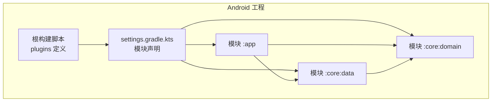
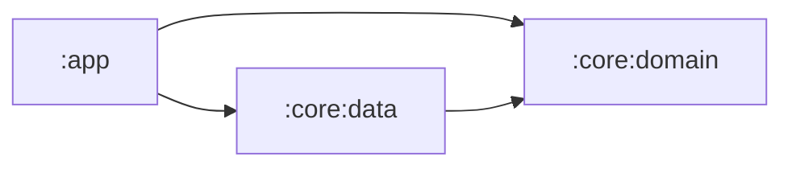
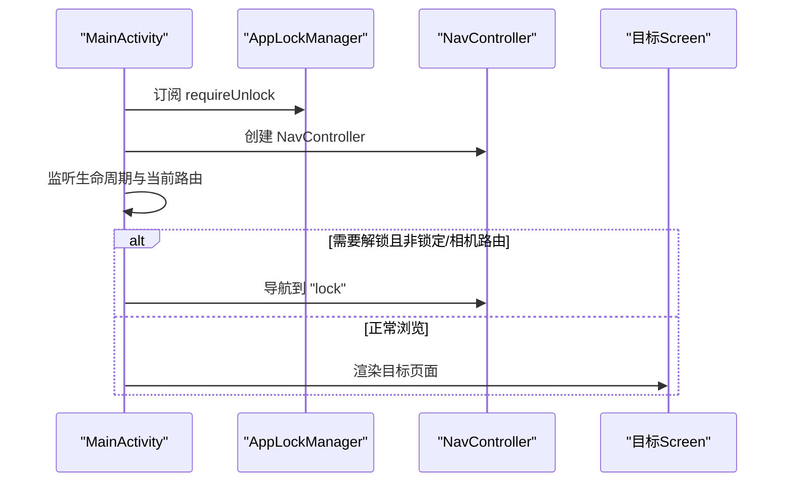
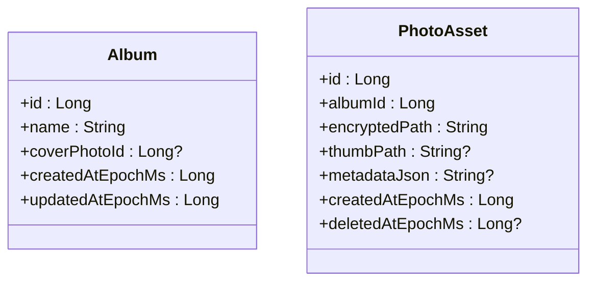
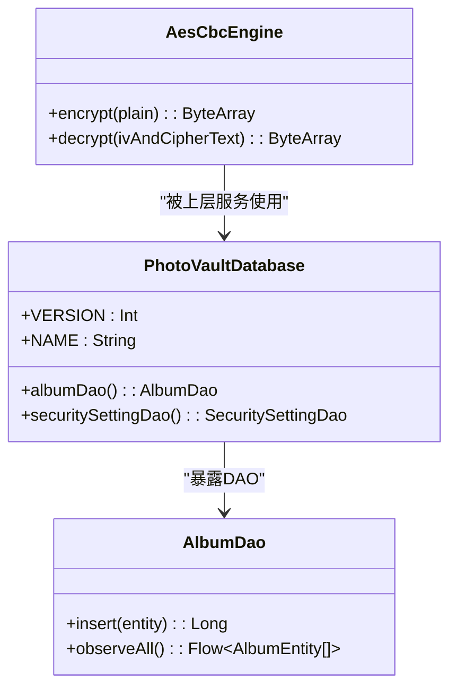
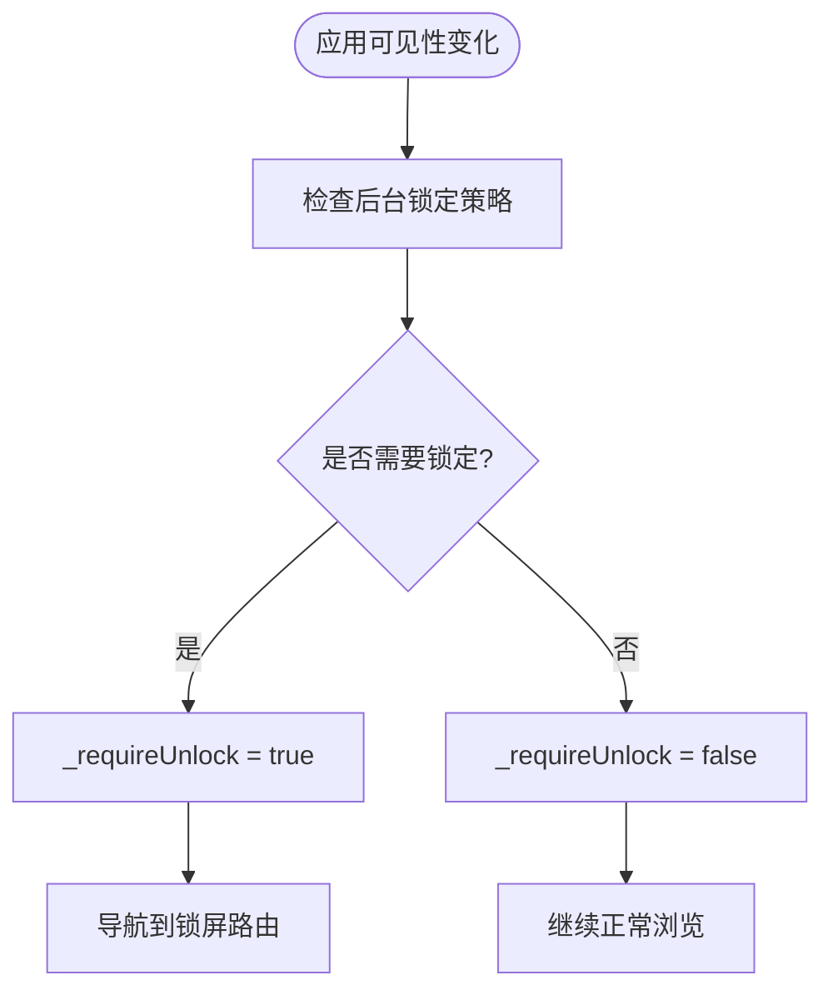
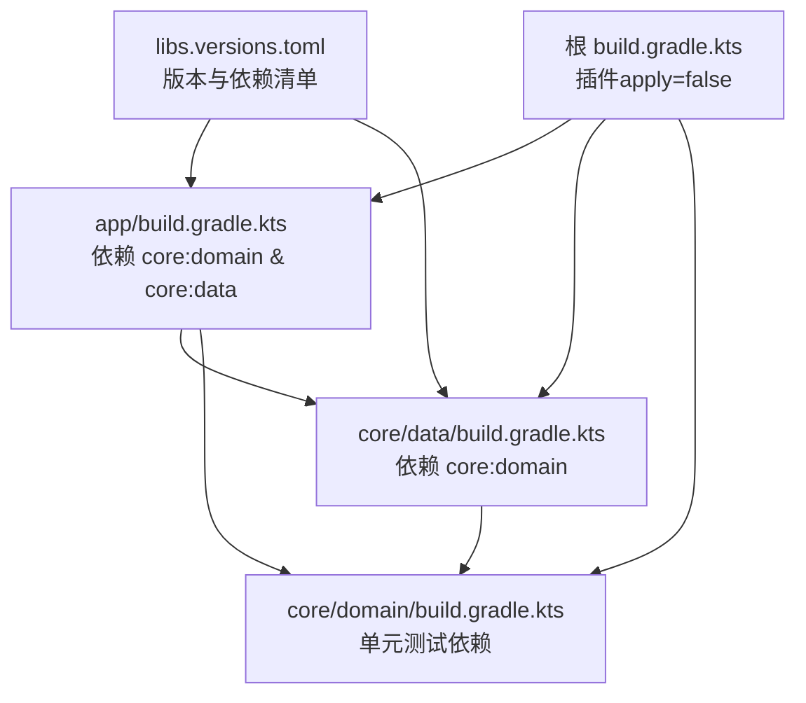

# 模块化架构设计

<cite>
**本文引用的文件**
- [settings.gradle.kts](file://android/settings.gradle.kts)
- [build.gradle.kts](file://android/build.gradle.kts)
- [libs.versions.toml](file://android/gradle/libs.versions.toml)
- [app/build.gradle.kts](file://android/app/build.gradle.kts)
- [core/data/build.gradle.kts](file://android/core/data/build.gradle.kts)
- [core/domain/build.gradle.kts](file://android/core/domain/build.gradle.kts)
- [app/src/main/kotlin/com/photovault/app/MainActivity.kt](file://android/app/src/main/kotlin/com/photovault/app/MainActivity.kt)
- [app/src/main/kotlin/com/photovault/app/AppLockManager.kt](file://android/app/src/main/kotlin/com/photovault/app/AppLockManager.kt)
- [app/src/main/kotlin/com/photovault/app/ui/AiHomeScreen.kt](file://android/app/src/main/kotlin/com/photovault/app/ui/AiHomeScreen.kt)
- [core/data/src/main/kotlin/com/photovault/data/di/DataModule.kt](file://android/core/data/src/main/kotlin/com/photovault/data/di/DataModule.kt)
- [core/data/src/main/kotlin/com/photovault/data/db/PhotoVaultDatabase.kt](file://android/core/data/src/main/kotlin/com/photovault/data/db/PhotoVaultDatabase.kt)
- [core/data/src/main/kotlin/com/photovault/data/db/dao/AlbumDao.kt](file://android/core/data/src/main/kotlin/com/photovault/data/db/dao/AlbumDao.kt)
- [core/data/src/main/kotlin/com/photovault/data/crypto/AesCbcEngine.kt](file://android/core/data/src/main/kotlin/com/photovault/data/crypto/AesCbcEngine.kt)
- [core/domain/src/main/kotlin/com/photovault/domain/model/Album.kt](file://android/core/domain/src/main/kotlin/com/photovault/domain/model/Album.kt)
- [core/domain/src/main/kotlin/com/photovault/domain/model/PhotoAsset.kt](file://android/core/domain/src/main/kotlin/com/photovault/domain/model/PhotoAsset.kt)
</cite>

## 目录
1. [简介](#简介)
2. [项目结构](#项目结构)
3. [核心组件](#核心组件)
4. [架构总览](#架构总览)
5. [详细组件分析](#详细组件分析)
6. [依赖分析](#依赖分析)
7. [性能考虑](#性能考虑)
8. [故障排查指南](#故障排查指南)
9. [结论](#结论)
10. [附录](#附录)

## 简介
本文件面向“AI照片保险库”项目的Android模块化架构，系统阐述模块化设计原则与策略，明确各模块职责与依赖关系，总结模块化带来的优势，并给出接口契约、依赖图、模块结构示例以及按功能模块组织代码的重构建议与最佳实践。目标是帮助团队在保持高内聚、低耦合的同时，提升代码隔离性、编译效率与协作效率。

## 项目结构
Android子工程采用多模块布局，包含应用层与核心领域/数据层：
- 应用层（:app）：负责UI、导航、生命周期接入、业务入口与平台集成。
- 核心领域层（:core:domain）：定义跨模块共享的领域模型与不变契约，确保业务语义稳定。
- 核心数据层（:core:data）：封装数据访问、数据库、加密与基础设施服务，向上提供稳定的领域抽象。

模块在根settings中声明，构建脚本统一在根build中配置插件版本，避免重复配置。

图表来源
- [settings.gradle.kts:17-21](file://android/settings.gradle.kts#L17-L21)
- [build.gradle.kts:1-10](file://android/build.gradle.kts#L1-L10)

章节来源
- [settings.gradle.kts:17-21](file://android/settings.gradle.kts#L17-L21)
- [build.gradle.kts:1-10](file://android/build.gradle.kts#L1-L10)

## 核心组件
- 应用层（:app）
  - 负责应用入口、Compose UI、导航与主题、生命周期观察与锁屏控制等。
  - 通过依赖注入获取领域/数据层能力，不直接持有底层实现细节。
- 领域层（:core:domain）
  - 以不可变数据类承载核心业务实体，如相册、照片资产等，作为跨模块契约。
  - 不引入Android框架或第三方库，保证可测试性与可移植性。
- 数据层（:core:data）
  - 封装Room数据库、DAO、实体与加密引擎，提供稳定的领域抽象。
  - 通过DI模块提供单例服务，供上层使用。

章节来源
- [app/build.gradle.kts:63-90](file://android/app/build.gradle.kts#L63-L90)
- [core/data/build.gradle.kts:31-47](file://android/core/data/build.gradle.kts#L31-L47)
- [core/domain/build.gradle.kts:1-13](file://android/core/domain/build.gradle.kts#L1-L13)

## 架构总览
模块化分层与依赖关系如下：
- :app 依赖 :core:domain 与 :core:data，承担UI与业务入口。
- :core:data 依赖 :core:domain，提供数据与基础设施能力。
- 依赖方向自底向上，避免反向依赖，降低耦合。

图表来源
- [app/build.gradle.kts:64-65](file://android/app/build.gradle.kts#L64-L65)
- [core/data/build.gradle.kts:32](file://android/core/data/build.gradle.kts#L32)

章节来源
- [app/build.gradle.kts:64-65](file://android/app/build.gradle.kts#L64-L65)
- [core/data/build.gradle.kts:32](file://android/core/data/build.gradle.kts#L32)

## 详细组件分析

### 应用层（:app）职责与实现要点
- 入口与导航
  - MainActivity集中管理导航与路由跳转，基于Compose Navigation实现页面流转。
  - 通过状态流驱动锁屏拦截逻辑，保障隐私区域访问安全。
- UI与主题
  - 提供通用UI组件与屏幕，如AI首页占位、相册列表、搜索等。
  - 通过主题与样式常量统一视觉规范。
- 依赖注入
  - 使用Hilt进行模块化依赖注入，MainActivity标注AndroidEntryPoint，注入AppLockManager等服务。

图表来源
- [app/src/main/kotlin/com/photovault/app/MainActivity.kt:46-74](file://android/app/src/main/kotlin/com/photovault/app/MainActivity.kt#L46-L74)
- [app/src/main/kotlin/com/photovault/app/AppLockManager.kt:17-48](file://android/app/src/main/kotlin/com/photovault/app/AppLockManager.kt#L17-L48)

章节来源
- [app/src/main/kotlin/com/photovault/app/MainActivity.kt:46-74](file://android/app/src/main/kotlin/com/photovault/app/MainActivity.kt#L46-L74)
- [app/src/main/kotlin/com/photovault/app/AppLockManager.kt:17-48](file://android/app/src/main/kotlin/com/photovault/app/AppLockManager.kt#L17-L48)
- [app/src/main/kotlin/com/photovault/app/ui/AiHomeScreen.kt:23-54](file://android/app/src/main/kotlin/com/photovault/app/ui/AiHomeScreen.kt#L23-L54)

### 领域层（:core:domain）职责与契约
- 领域模型
  - Album、PhotoAsset等数据类定义清晰的业务实体，字段语义明确，便于跨模块传递与测试。
- 契约稳定性
  - 仅包含纯Kotlin代码，无Android依赖，确保在不同运行环境可复用。

图表来源
- [core/domain/src/main/kotlin/com/photovault/domain/model/Album.kt:6-12](file://android/core/domain/src/main/kotlin/com/photovault/domain/model/Album.kt#L6-L12)
- [core/domain/src/main/kotlin/com/photovault/domain/model/PhotoAsset.kt:6-14](file://android/core/domain/src/main/kotlin/com/photovault/domain/model/PhotoAsset.kt#L6-L14)

章节来源
- [core/domain/src/main/kotlin/com/photovault/domain/model/Album.kt:6-12](file://android/core/domain/src/main/kotlin/com/photovault/domain/model/Album.kt#L6-L12)
- [core/domain/src/main/kotlin/com/photovault/domain/model/PhotoAsset.kt:6-14](file://android/core/domain/src/main/kotlin/com/photovault/domain/model/PhotoAsset.kt#L6-L14)

### 数据层（:core:data）职责与实现要点
- 数据库与DAO
  - PhotoVaultDatabase集中声明实体与版本，暴露DAO用于查询与变更。
  - AlbumDao提供插入与观察相册列表的能力，返回Flow以支持响应式更新。
- 加密与密钥
  - AesCbcEngine基于Android Keystore托管的AES密钥，实现前置IV的CBC加解密。
- DI与单例
  - DataModule提供数据库、密钥提供器与加密引擎的单例绑定，供上层注入使用。

图表来源
- [core/data/src/main/kotlin/com/photovault/data/db/PhotoVaultDatabase.kt:14-35](file://android/core/data/src/main/kotlin/com/photovault/data/db/PhotoVaultDatabase.kt#L14-L35)
- [core/data/src/main/kotlin/com/photovault/data/db/dao/AlbumDao.kt:10-17](file://android/core/data/src/main/kotlin/com/photovault/data/db/dao/AlbumDao.kt#L10-L17)
- [core/data/src/main/kotlin/com/photovault/data/crypto/AesCbcEngine.kt:12-39](file://android/core/data/src/main/kotlin/com/photovault/data/crypto/AesCbcEngine.kt#L12-L39)

章节来源
- [core/data/src/main/kotlin/com/photovault/data/db/PhotoVaultDatabase.kt:14-35](file://android/core/data/src/main/kotlin/com/photovault/data/db/PhotoVaultDatabase.kt#L14-L35)
- [core/data/src/main/kotlin/com/photovault/data/db/dao/AlbumDao.kt:10-17](file://android/core/data/src/main/kotlin/com/photovault/data/db/dao/AlbumDao.kt#L10-L17)
- [core/data/src/main/kotlin/com/photovault/data/crypto/AesCbcEngine.kt:12-39](file://android/core/data/src/main/kotlin/com/photovault/data/crypto/AesCbcEngine.kt#L12-L39)
- [core/data/src/main/kotlin/com/photovault/data/di/DataModule.kt:15-39](file://android/core/data/src/main/kotlin/com/photovault/data/di/DataModule.kt#L15-L39)

### 锁屏与安全流程
- AppLockManager通过生命周期回调判断后台策略，维护requireUnlock状态流。
- MainActivity监听该状态流，在进入非允许路由时自动跳转至锁屏。

图表来源
- [app/src/main/kotlin/com/photovault/app/AppLockManager.kt:37-47](file://android/app/src/main/kotlin/com/photovault/app/AppLockManager.kt#L37-L47)
- [app/src/main/kotlin/com/photovault/app/MainActivity.kt:60-74](file://android/app/src/main/kotlin/com/photovault/app/MainActivity.kt#L60-L74)

章节来源
- [app/src/main/kotlin/com/photovault/app/AppLockManager.kt:37-47](file://android/app/src/main/kotlin/com/photovault/app/AppLockManager.kt#L37-L47)
- [app/src/main/kotlin/com/photovault/app/MainActivity.kt:60-74](file://android/app/src/main/kotlin/com/photovault/app/MainActivity.kt#L60-L74)

## 依赖分析
- 版本与插件管理
  - 根build统一声明插件apply=false，避免重复配置；libs.versions.toml集中管理依赖版本。
- 模块依赖
  - :app 依赖 :core:domain 与 :core:data。
  - :core:data 依赖 :core:domain。
- 运行时依赖
  - :app 引入Compose、Navigation、Room、Hilt、Camera等；:core:data 引入Room、Security Crypto、Coroutines、Hilt。

图表来源
- [libs.versions.toml:1-64](file://android/gradle/libs.versions.toml#L1-L64)
- [build.gradle.kts:1-10](file://android/build.gradle.kts#L1-L10)
- [app/build.gradle.kts:63-90](file://android/app/build.gradle.kts#L63-L90)
- [core/data/build.gradle.kts:31-47](file://android/core/data/build.gradle.kts#L31-L47)
- [core/domain/build.gradle.kts:9-12](file://android/core/domain/build.gradle.kts#L9-L12)

章节来源
- [libs.versions.toml:1-64](file://android/gradle/libs.versions.toml#L1-L64)
- [build.gradle.kts:1-10](file://android/build.gradle.kts#L1-L10)
- [app/build.gradle.kts:63-90](file://android/app/build.gradle.kts#L63-L90)
- [core/data/build.gradle.kts:31-47](file://android/core/data/build.gradle.kts#L31-L47)
- [core/domain/build.gradle.kts:9-12](file://android/core/domain/build.gradle.kts#L9-L12)

## 性能考虑
- 编译性能
  - 模块边界清晰，增量编译与并行构建更高效；减少不必要的跨模块依赖可缩短编译时间。
- 运行时性能
  - Room与Flow结合实现响应式数据更新，避免主线程阻塞；加密操作在数据层完成，避免UI线程负担。
- 资源与体积
  - 通过productFlavors与buildTypes区分环境与构建类型，release启用混淆与资源收缩，减小APK体积。

## 故障排查指南
- 依赖注入问题
  - 确认DataModule提供的数据库、密钥与加密引擎已在Hilt容器中注册；检查AndroidEntryPoint注解是否正确添加到Activity。
- 数据库迁移
  - 当数据库版本升级时，需在PhotoVaultDatabase中注册Migration并递增版本号，避免运行时异常。
- 锁屏逻辑异常
  - 检查AppLockManager的后台策略与生命周期回调时机，确认requireUnlock状态流传播路径。

章节来源
- [core/data/src/main/kotlin/com/photovault/data/di/DataModule.kt:15-39](file://android/core/data/src/main/kotlin/com/photovault/data/di/DataModule.kt#L15-L39)
- [core/data/src/main/kotlin/com/photovault/data/db/PhotoVaultDatabase.kt:30-35](file://android/core/data/src/main/kotlin/com/photovault/data/db/PhotoVaultDatabase.kt#L30-L35)
- [app/src/main/kotlin/com/photovault/app/AppLockManager.kt:17-48](file://android/app/src/main/kotlin/com/photovault/app/AppLockManager.kt#L17-L48)

## 结论
通过将UI、领域与数据分层解耦，本项目实现了良好的模块化架构：UI层专注展示与交互，领域层稳定契约，数据层封装基础设施。模块间依赖自底向上，接口契约清晰，既提升了代码隔离与可测试性，也优化了编译与协作效率。建议在后续迭代中持续坚持模块边界，完善接口契约文档，并逐步引入更多功能模块的独立构建与测试。

## 附录
- 模块化最佳实践
  - 明确职责边界：UI只做展示与路由，业务逻辑下沉到领域层，数据访问收敛到数据层。
  - 接口优先：对外暴露接口与数据类，隐藏实现细节，便于替换与演进。
  - 依赖倒置：上层仅依赖抽象，通过DI注入具体实现。
  - 版本与插件集中管理：统一在根build与libs.versions.toml中维护，减少配置漂移。
  - 可观测与可观测性：为关键流程增加日志与指标，便于定位问题与评估性能。