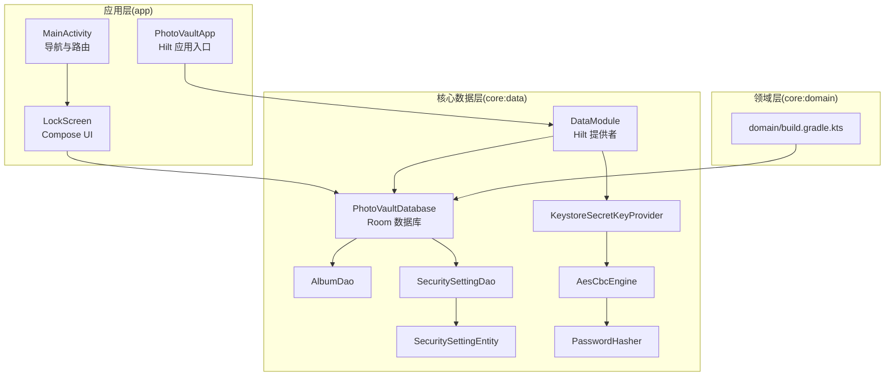
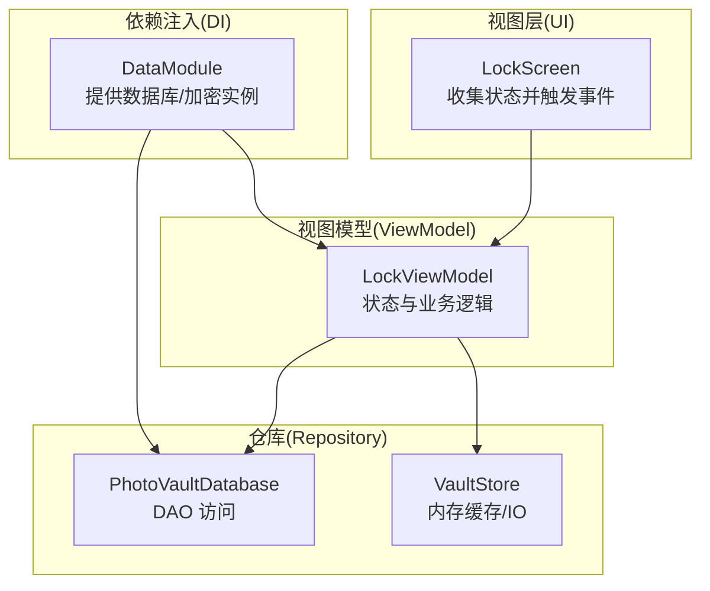
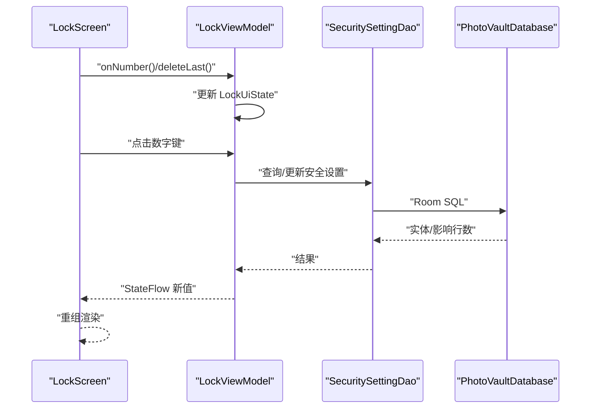
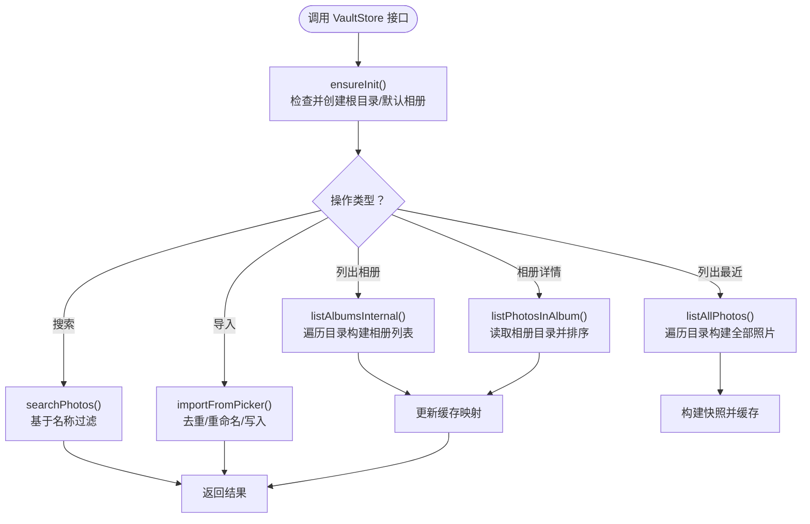
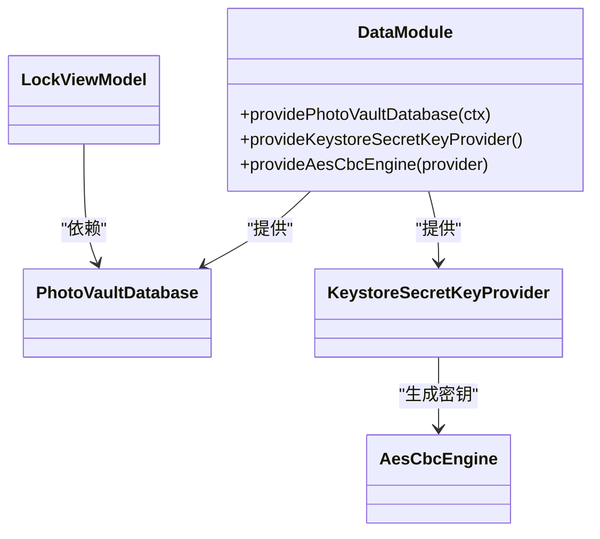
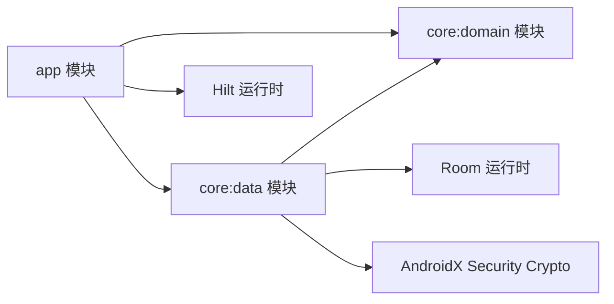

# 设计模式应用

<cite>
**本文引用的文件**
- [LockViewModel.kt](file://android/app/src/main/kotlin/com/photovault/app/ui/lock/LockViewModel.kt)
- [LockScreen.kt](file://android/app/src/main/kotlin/com/photovault/app/ui/lock/LockScreen.kt)
- [VaultStore.kt](file://android/app/src/main/kotlin/com/photovault/app/ui/vault/VaultStore.kt)
- [DataModule.kt](file://android/core/data/src/main/kotlin/com/photovault/data/di/DataModule.kt)
- [PhotoVaultDatabase.kt](file://android/core/data/src/main/kotlin/com/photovault/data/db/PhotoVaultDatabase.kt)
- [AlbumDao.kt](file://android/core/data/src/main/kotlin/com/photovault/data/db/dao/AlbumDao.kt)
- [SecuritySettingDao.kt](file://android/core/data/src/main/kotlin/com/photovault/data/db/dao/SecuritySettingDao.kt)
- [SecuritySettingEntity.kt](file://android/core/data/src/main/kotlin/com/photovault/data/db/entity/SecuritySettingEntity.kt)
- [AesCbcEngine.kt](file://android/core/data/src/main/kotlin/com/photovault/data/crypto/AesCbcEngine.kt)
- [KeystoreSecretKeyProvider.kt](file://android/core/data/src/main/kotlin/com/photovault/data/crypto/KeystoreSecretKeyProvider.kt)
- [PasswordHasher.kt](file://android/core/data/src/main/kotlin/com/photovault/data/crypto/PasswordHasher.kt)
- [MainActivity.kt](file://android/app/src/main/kotlin/com/photovault/app/MainActivity.kt)
- [PhotoVaultApp.kt](file://android/app/src/main/kotlin/com/photovault/app/PhotoVaultApp.kt)
- [AlbumDaoRobolectricTest.kt](file://android/core/data/src/test/kotlin/com/photovault/data/db/AlbumDaoRobolectricTest.kt)
- [domain/build.gradle.kts](file://android/core/domain/build.gradle.kts)
- [data/build.gradle.kts](file://android/core/data/build.gradle.kts)
- [app/build.gradle.kts](file://android/app/build.gradle.kts)
</cite>

## 目录
1. [引言](#引言)
2. [项目结构](#项目结构)
3. [核心组件](#核心组件)
4. [架构总览](#架构总览)
5. [详细组件分析](#详细组件分析)
6. [依赖关系分析](#依赖关系分析)
7. [性能考量](#性能考量)
8. [故障排查指南](#故障排查指南)
9. [结论](#结论)
10. [附录](#附录)

## 引言
本文件围绕 AI 照片保险库（PhotoVault）项目，系统梳理并阐释以下设计模式在实际工程中的落地与价值：
- MVVM 模式在 Jetpack Compose 中的实现与应用
- Repository 模式的原理与数据层实现
- UseCase 模式在领域层的封装与业务逻辑组织
- 依赖注入（DI）在模块化架构中的作用与实践
- 通过具体代码片段路径展示各模式的实际应用
- 设计模式如何提升可维护性与可测试性，并给出选型与应用指导

## 项目结构
项目采用多模块架构，核心模块包括：
- app：UI 层、导航、入口 Activity 与 Compose 屏幕
- core:data：数据层（Room 数据库、DAO、实体、加密工具、DI 模块）
- core:domain：领域模型（纯 Kotlin，无 Android 依赖）

图表来源
- [MainActivity.kt:41-261](file://android/app/src/main/kotlin/com/photovault/app/MainActivity.kt#L41-L261)
- [PhotoVaultApp.kt:7-30](file://android/app/src/main/kotlin/com/photovault/app/PhotoVaultApp.kt#L7-L30)
- [DataModule.kt:15-39](file://android/core/data/src/main/kotlin/com/photovault/data/di/DataModule.kt#L15-L39)
- [PhotoVaultDatabase.kt:14-35](file://android/core/data/src/main/kotlin/com/photovault/data/db/PhotoVaultDatabase.kt#L14-L35)
- [AlbumDao.kt:10-17](file://android/core/data/src/main/kotlin/com/photovault/data/db/dao/AlbumDao.kt#L10-L17)
- [SecuritySettingDao.kt:9-16](file://android/core/data/src/main/kotlin/com/photovault/data/db/dao/SecuritySettingDao.kt#L9-L16)
- [SecuritySettingEntity.kt:7-18](file://android/core/data/src/main/kotlin/com/photovault/data/db/entity/SecuritySettingEntity.kt#L7-L18)
- [AesCbcEngine.kt:8-39](file://android/core/data/src/main/kotlin/com/photovault/data/crypto/AesCbcEngine.kt#L8-L39)
- [KeystoreSecretKeyProvider.kt:9-41](file://android/core/data/src/main/kotlin/com/photovault/data/crypto/KeystoreSecretKeyProvider.kt#L9-L41)
- [PasswordHasher.kt:5-25](file://android/core/data/src/main/kotlin/com/photovault/data/crypto/PasswordHasher.kt#L5-L25)
- [domain/build.gradle.kts:1-13](file://android/core/domain/build.gradle.kts#L1-L13)

章节来源
- [app/build.gradle.kts:63-90](file://android/app/build.gradle.kts#L63-L90)
- [data/build.gradle.kts:31-47](file://android/core/data/build.gradle.kts#L31-L47)
- [domain/build.gradle.kts:1-13](file://android/core/domain/build.gradle.kts#L1-L13)

## 核心组件
本节聚焦于与设计模式直接相关的核心构件及其职责边界。

- 视图模型（ViewModel）与 UI 状态
  - LockViewModel：负责锁屏流程的状态管理、PIN 设置/校验、生物识别集成、与数据库交互
  - VaultStore：负责私密相册的数据访问与缓存策略（内存缓存 + 文件系统 IO）

- 数据层与依赖注入
  - PhotoVaultDatabase：Room 数据库入口，暴露 DAO
  - SecuritySettingDao/AlbumDao：数据访问接口，返回 Flow 或挂起函数
  - DataModule：Hilt 提供者，集中管理数据库、加密引擎与密钥提供器的单例

- 加密与安全
  - KeystoreSecretKeyProvider：Android Keystore 中生成/读取 AES 密钥
  - AesCbcEngine：AES-CBC 加解密（IV 前置）
  - PasswordHasher：口令哈希（SHA-256），用于 PIN 存储

章节来源
- [LockViewModel.kt:18-197](file://android/app/src/main/kotlin/com/photovault/app/ui/lock/LockViewModel.kt#L18-L197)
- [VaultStore.kt:39-224](file://android/app/src/main/kotlin/com/photovault/app/ui/vault/VaultStore.kt#L39-L224)
- [DataModule.kt:15-39](file://android/core/data/src/main/kotlin/com/photovault/data/di/DataModule.kt#L15-L39)
- [PhotoVaultDatabase.kt:14-35](file://android/core/data/src/main/kotlin/com/photovault/data/db/PhotoVaultDatabase.kt#L14-L35)
- [KeystoreSecretKeyProvider.kt:9-41](file://android/core/data/src/main/kotlin/com/photovault/data/crypto/KeystoreSecretKeyProvider.kt#L9-L41)
- [AesCbcEngine.kt:8-39](file://android/core/data/src/main/kotlin/com/photovault/data/crypto/AesCbcEngine.kt#L8-L39)
- [PasswordHasher.kt:5-25](file://android/core/data/src/main/kotlin/com/photovault/data/crypto/PasswordHasher.kt#L5-L25)

## 架构总览
下图展示了 MVVM、Repository 与 DI 的协同关系，以及数据流从 UI 到数据层的路径。

图表来源
- [LockScreen.kt:52-228](file://android/app/src/main/kotlin/com/photovault/app/ui/lock/LockScreen.kt#L52-L228)
- [LockViewModel.kt:18-197](file://android/app/src/main/kotlin/com/photovault/app/ui/lock/LockViewModel.kt#L18-L197)
- [VaultStore.kt:39-224](file://android/app/src/main/kotlin/com/photovault/app/ui/vault/VaultStore.kt#L39-L224)
- [DataModule.kt:15-39](file://android/core/data/src/main/kotlin/com/photovault/data/di/DataModule.kt#L15-L39)
- [PhotoVaultDatabase.kt:14-35](file://android/core/data/src/main/kotlin/com/photovault/data/db/PhotoVaultDatabase.kt#L14-L35)

## 详细组件分析

### MVVM 模式在 Jetpack Compose 中的应用
- 组件职责分离
  - UI（LockScreen）：只负责渲染状态、处理用户交互、调用 ViewModel
  - ViewModel（LockViewModel）：持有 UI 状态 StateFlow，封装业务逻辑（PIN 输入、设置/校验、生物识别回调）
  - Model（数据库/加密）：通过 DataModule 注入，避免 UI 直接依赖

- 状态驱动 UI
  - 使用 StateFlow<LockUiState> 驱动 UI，确保状态变更可观察、可测试
  - UI 通过 collectAsState 收集状态，自动重组

- 生物识别与异步流程
  - ViewModel 内部使用协程与 DAO 调用，保证 UI 线程安全
  - 生物识别回调通过 ViewModel 方法桥接，统一更新状态

图表来源
- [LockScreen.kt:52-228](file://android/app/src/main/kotlin/com/photovault/app/ui/lock/LockScreen.kt#L52-L228)
- [LockViewModel.kt:18-197](file://android/app/src/main/kotlin/com/photovault/app/ui/lock/LockViewModel.kt#L18-L197)
- [SecuritySettingDao.kt:9-16](file://android/core/data/src/main/kotlin/com/photovault/data/db/dao/SecuritySettingDao.kt#L9-L16)
- [PhotoVaultDatabase.kt:14-35](file://android/core/data/src/main/kotlin/com/photovault/data/db/PhotoVaultDatabase.kt#L14-L35)

章节来源
- [LockScreen.kt:52-228](file://android/app/src/main/kotlin/com/photovault/app/ui/lock/LockScreen.kt#L52-L228)
- [LockViewModel.kt:18-197](file://android/app/src/main/kotlin/com/photovault/app/ui/lock/LockViewModel.kt#L18-L197)

### Repository 模式的设计原理与数据层实现
- 设计要点
  - Repository 作为数据源抽象，向上提供稳定的接口，向下屏蔽数据来源差异（数据库、文件系统、网络）
  - 在 PhotoVault 中，VaultStore 承担了“私密相册仓库”的角色，负责：
    - 初始化根目录与默认相册
    - 列表相册与相片
    - 搜索、导入、计数、缓存
  - 数据库侧通过 PhotoVaultDatabase + DAO 提供持久化能力

- 关键实现点
  - VaultStore.peekCachedSnapshot/peekCachedAlbumPhotos 提供内存缓存读取
  - loadSnapshot/listPhotosInAlbum 等方法内部进行 IO 并更新缓存
  - DAO 返回 Flow/List，Repository 将其转换为业务所需的数据结构

图表来源
- [VaultStore.kt:47-113](file://android/app/src/main/kotlin/com/photovault/app/ui/vault/VaultStore.kt#L47-L113)
- [VaultStore.kt:166-203](file://android/app/src/main/kotlin/com/photovault/app/ui/vault/VaultStore.kt#L166-L203)
- [VaultStore.kt:120-154](file://android/app/src/main/kotlin/com/photovault/app/ui/vault/VaultStore.kt#L120-L154)

章节来源
- [VaultStore.kt:39-224](file://android/app/src/main/kotlin/com/photovault/app/ui/vault/VaultStore.kt#L39-L224)
- [PhotoVaultDatabase.kt:14-35](file://android/core/data/src/main/kotlin/com/photovault/data/db/PhotoVaultDatabase.kt#L14-L35)
- [AlbumDao.kt:10-17](file://android/core/data/src/main/kotlin/com/photovault/data/db/dao/AlbumDao.kt#L10-L17)

### UseCase 模式在领域层的应用与业务封装
- UseCase 的定位
  - 将“用例”抽象为独立的业务单元，封装单一职责的业务流程
  - 在 PhotoVault 中，可将“设置 PIN”“校验 PIN”“导入照片”等流程拆分为独立的用例对象，便于复用与测试

- 与现有结构的契合
  - LockViewModel 已承担了部分用例职责（PIN 设置/校验、生物识别）
  - VaultStore 已承担了“相册/照片”用例的仓储职责
  - 建议在领域层（core:domain）引入纯 Kotlin 的用例类，隔离业务规则与 UI/数据实现细节

- 优势
  - 用例可被多个 ViewModel 复用
  - 便于编写单元测试，隔离外部依赖（数据库、IO）

章节来源
- [LockViewModel.kt:18-197](file://android/app/src/main/kotlin/com/photovault/app/ui/lock/LockViewModel.kt#L18-L197)
- [VaultStore.kt:39-224](file://android/app/src/main/kotlin/com/photovault/app/ui/vault/VaultStore.kt#L39-L224)
- [domain/build.gradle.kts:1-13](file://android/core/domain/build.gradle.kts#L1-L13)

### 依赖注入模式在模块化架构中的作用
- Hilt 在本项目中的应用
  - DataModule 提供 PhotoVaultDatabase、KeystoreSecretKeyProvider、AesCbcEngine 单例
  - @AndroidEntryPoint 与 @HiltViewModel 实现 UI 与 ViewModel 的注入
  - 通过 @ApplicationContext 限定上下文，避免内存泄漏

- 作用与收益
  - 解耦：UI 不直接构造数据库/加密实例
  - 可测试：可在测试中替换提供者，注入假实现
  - 可维护：集中配置，便于升级与扩展

图表来源
- [DataModule.kt:15-39](file://android/core/data/src/main/kotlin/com/photovault/data/di/DataModule.kt#L15-L39)
- [PhotoVaultDatabase.kt:14-35](file://android/core/data/src/main/kotlin/com/photovault/data/db/PhotoVaultDatabase.kt#L14-L35)
- [KeystoreSecretKeyProvider.kt:9-41](file://android/core/data/src/main/kotlin/com/photovault/data/crypto/KeystoreSecretKeyProvider.kt#L9-L41)
- [AesCbcEngine.kt:8-39](file://android/core/data/src/main/kotlin/com/photovault/data/crypto/AesCbcEngine.kt#L8-L39)
- [LockViewModel.kt:18-21](file://android/app/src/main/kotlin/com/photovault/app/ui/lock/LockViewModel.kt#L18-L21)

章节来源
- [DataModule.kt:15-39](file://android/core/data/src/main/kotlin/com/photovault/data/di/DataModule.kt#L15-L39)
- [PhotoVaultApp.kt:7-30](file://android/app/src/main/kotlin/com/photovault/app/PhotoVaultApp.kt#L7-L30)
- [MainActivity.kt:41-74](file://android/app/src/main/kotlin/com/photovault/app/MainActivity.kt#L41-L74)

### 具体代码示例路径（展示设计模式应用）
- MVVM（Compose + ViewModel）
  - UI 状态收集与事件触发：[LockScreen.kt:52-228](file://android/app/src/main/kotlin/com/photovault/app/ui/lock/LockScreen.kt#L52-L228)
  - 状态与业务逻辑：[LockViewModel.kt:18-197](file://android/app/src/main/kotlin/com/photovault/app/ui/lock/LockViewModel.kt#L18-L197)

- Repository（数据访问与缓存）
  - 仓库初始化与导入：[VaultStore.kt:60-154](file://android/app/src/main/kotlin/com/photovault/app/ui/vault/VaultStore.kt#L60-L154)
  - 专辑与照片列表：[VaultStore.kt:166-203](file://android/app/src/main/kotlin/com/photovault/app/ui/vault/VaultStore.kt#L166-L203)

- 依赖注入（Hilt）
  - 提供数据库与加密实例：[DataModule.kt:15-39](file://android/core/data/src/main/kotlin/com/photovault/data/di/DataModule.kt#L15-L39)
  - 应用入口与注入：[PhotoVaultApp.kt:7-30](file://android/app/src/main/kotlin/com/photovault/app/PhotoVaultApp.kt#L7-L30)

- 安全与加密
  - AES 加密引擎与密钥提供：[AesCbcEngine.kt:8-39](file://android/core/data/src/main/kotlin/com/photovault/data/crypto/AesCbcEngine.kt#L8-L39)、[KeystoreSecretKeyProvider.kt:9-41](file://android/core/data/src/main/kotlin/com/photovault/data/crypto/KeystoreSecretKeyProvider.kt#L9-L41)
  - PIN 哈希：[PasswordHasher.kt:5-25](file://android/core/data/src/main/kotlin/com/photovault/data/crypto/PasswordHasher.kt#L5-L25)

## 依赖关系分析
- 模块依赖
  - app 依赖 core:domain 与 core:data
  - core:data 依赖 core:domain（模型）
- 组件依赖
  - LockViewModel 依赖 PhotoVaultDatabase 与 PasswordHasher
  - DataModule 依赖 AndroidX Room、Hilt、Android Keystore

图表来源
- [app/build.gradle.kts:63-90](file://android/app/build.gradle.kts#L63-L90)
- [data/build.gradle.kts:31-47](file://android/core/data/build.gradle.kts#L31-L47)
- [domain/build.gradle.kts:1-13](file://android/core/domain/build.gradle.kts#L1-L13)

章节来源
- [app/build.gradle.kts:63-90](file://android/app/build.gradle.kts#L63-L90)
- [data/build.gradle.kts:31-47](file://android/core/data/build.gradle.kts#L31-L47)
- [domain/build.gradle.kts:1-13](file://android/core/domain/build.gradle.kts#L1-L13)

## 性能考量
- IO 与线程
  - VaultStore 所有磁盘 IO 使用 Dispatchers.IO 包裹，避免阻塞主线程
  - LockViewModel 的数据库操作在 viewModelScope 中执行，生命周期安全
- 缓存策略
  - VaultStore 对快照与相册内容进行内存缓存，减少重复 IO
- 数据库观察
  - DAO 返回 Flow，可按需响应数据变化，避免轮询

章节来源
- [VaultStore.kt:47-113](file://android/app/src/main/kotlin/com/photovault/app/ui/vault/VaultStore.kt#L47-L113)
- [LockViewModel.kt:27-42](file://android/app/src/main/kotlin/com/photovault/app/ui/lock/LockViewModel.kt#L27-L42)
- [AlbumDao.kt:15-16](file://android/core/data/src/main/kotlin/com/photovault/data/db/dao/AlbumDao.kt#L15-L16)

## 故障排查指南
- 生物识别不可用
  - UI 侧根据可用性决定是否显示生物识别按钮；若不可用，提示用户改用 PIN
  - 参考：[LockScreen.kt:365-382](file://android/app/src/main/kotlin/com/photovault/app/ui/lock/LockScreen.kt#L365-L382)

- PIN 校验失败
  - ViewModel 会累加失败次数并更新数据库；UI 根据错误信息提示
  - 参考：[LockViewModel.kt:168-184](file://android/app/src/main/kotlin/com/photovault/app/ui/lock/LockViewModel.kt#L168-L184)

- 数据库迁移与测试
  - DAO 插入与查询行为可通过单元测试验证；建议新增迁移测试
  - 参考：[AlbumDaoRobolectricTest.kt:17-49](file://android/core/data/src/test/kotlin/com/photovault/data/db/AlbumDaoRobolectricTest.kt#L17-L49)

- 依赖注入问题
  - 确保 @AndroidEntryPoint 与 @HiltViewModel 正确标注；Hilt 类与注解处理器已启用
  - 参考：[PhotoVaultApp.kt:7-30](file://android/app/src/main/kotlin/com/photovault/app/PhotoVaultApp.kt#L7-L30)、[DataModule.kt:15-39](file://android/core/data/src/main/kotlin/com/photovault/data/di/DataModule.kt#L15-L39)

章节来源
- [LockScreen.kt:365-382](file://android/app/src/main/kotlin/com/photovault/app/ui/lock/LockScreen.kt#L365-L382)
- [LockViewModel.kt:168-184](file://android/app/src/main/kotlin/com/photovault/app/ui/lock/LockViewModel.kt#L168-L184)
- [AlbumDaoRobolectricTest.kt:17-49](file://android/core/data/src/test/kotlin/com/photovault/data/db/AlbumDaoRobolectricTest.kt#L17-L49)
- [PhotoVaultApp.kt:7-30](file://android/app/src/main/kotlin/com/photovault/app/PhotoVaultApp.kt#L7-L30)
- [DataModule.kt:15-39](file://android/core/data/src/main/kotlin/com/photovault/data/di/DataModule.kt#L15-L39)

## 结论
- MVVM 在 Compose 中通过 StateFlow 驱动 UI，结合 Hilt 注入，实现了清晰的职责分离与良好的可测试性
- Repository 模式在 VaultStore 与 DAO 中得到自然体现，有效隔离了数据访问与业务逻辑
- UseCase 模式可在领域层进一步推广，以增强业务规则的封装与复用
- 依赖注入贯穿模块边界，提升了可维护性与可替换性
- 建议持续完善用例层与测试覆盖，以进一步提升架构质量

## 附录
- 设计模式选型与应用指导
  - 优先采用 MVVM 驱动 UI，ViewModel 专注状态与业务，避免在 UI 中直接处理复杂逻辑
  - Repository 抽象数据源，统一对外接口，便于替换与测试
  - UseCase 将业务流程封装为独立单元，提升复用性与可测性
  - 依赖注入集中管理外部依赖，保持模块间低耦合
  - 在数据层使用 Room + DAO，结合 Flow 实现响应式数据流
  - 在安全场景使用 Android Keystore 与标准加密算法，避免自造轮子