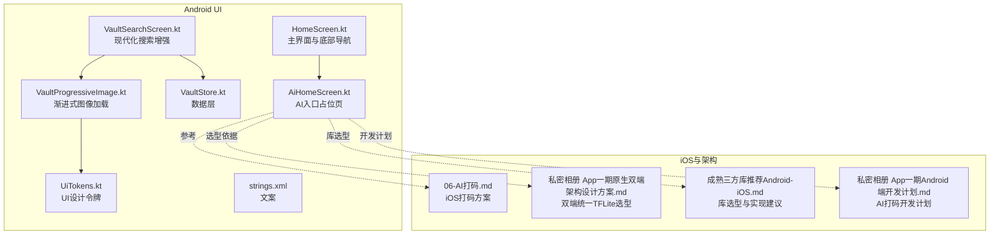
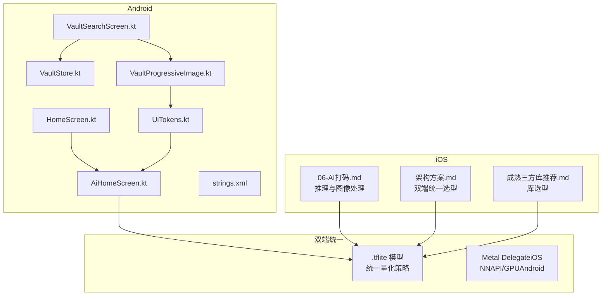
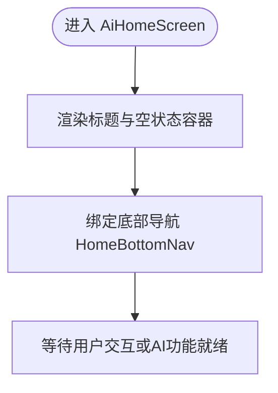
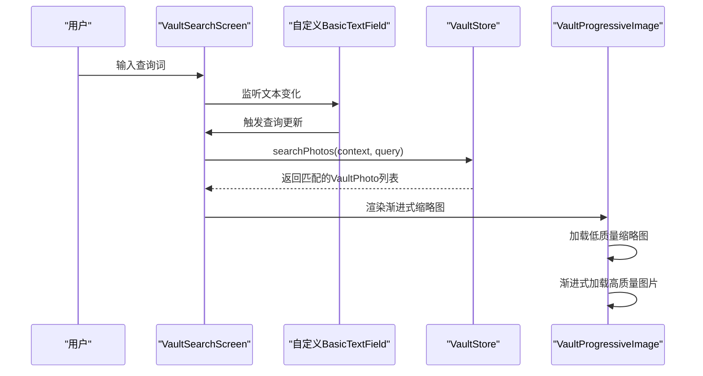
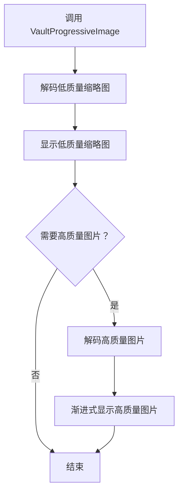
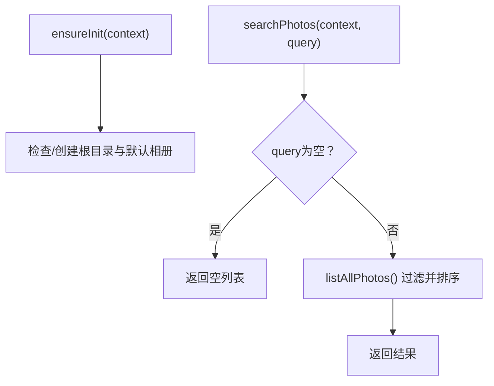
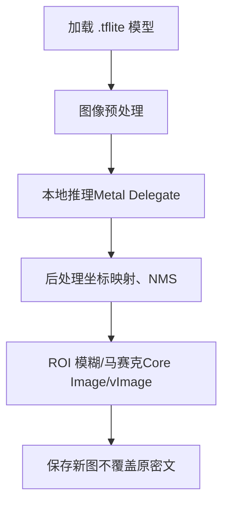
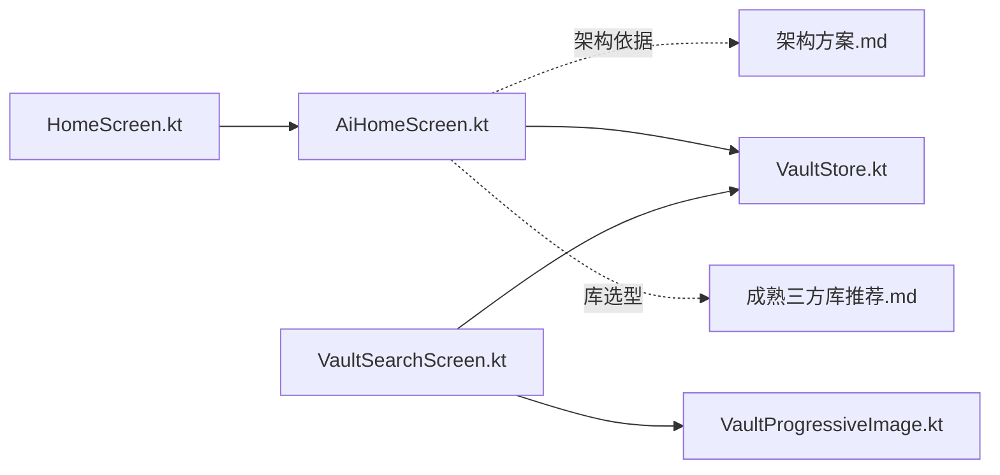

# AI功能系统

<cite>
**本文引用的文件**
- [AiHomeScreen.kt](file://android/app/src/main/kotlin/com/photovault/app/ui/AiHomeScreen.kt)
- [VaultSearchScreen.kt](file://android/app/src/main/kotlin/com/photovault/app/ui/VaultSearchScreen.kt)
- [HomeScreen.kt](file://android/app/src/main/kotlin/com/photovault/app/ui/HomeScreen.kt)
- [VaultStore.kt](file://android/app/src/main/kotlin/com/photovault/app/ui/vault/VaultStore.kt)
- [VaultProgressiveImage.kt](file://android/app/src/main/kotlin/com/photovault/app/ui/components/VaultProgressiveImage.kt)
- [UiTokens.kt](file://android/app/src/main/kotlin/com/photovault/app/ui/theme/UiTokens.kt)
- [strings.xml](file://android/app/src/main/res/values/strings.xml)
- [06-AI打码.md](file://doc/ios/06-AI打码.md)
- [私密相册 App（一期）原生双端架构设计方案.md](file://spec/私密相册 App（一期）原生双端架构设计方案.md)
- [成熟三方库推荐（Android-iOS）.md](file://doc/成熟三方库推荐（Android-iOS）.md)
- [私密相册 App（一期）Android 端开发计划.md](file://doc/私密相册 App（一期）Android 端开发计划.md)
</cite>

## 更新摘要
**变更内容**
- 更新了VaultSearchScreen的现代化改造部分，详细说明自定义BasicTextField的占位符处理机制
- 新增了VaultProgressiveImage组件的性能优化和渐进式加载特性
- 修正了AI功能现状描述，明确当前仍为占位状态
- 完善了搜索界面的视觉样式和用户体验设计说明

## 目录
1. [简介](#简介)
2. [项目结构](#项目结构)
3. [核心组件](#核心组件)
4. [架构总览](#架构总览)
5. [详细组件分析](#详细组件分析)
6. [依赖分析](#依赖分析)
7. [性能考虑](#性能考虑)
8. [故障排查指南](#故障排查指南)
9. [结论](#结论)
10. [附录](#附录)

## 简介
本文件面向AI照片保险库的AI功能系统，聚焦以下目标：
- 解释TensorFlow Lite集成方案与双端一致性策略
- 目标检测模型的应用与智能打码功能实现原理
- AiHomeScreen的AI功能入口与VaultSearchScreen的搜索增强
- AI推理引擎的配置与优化建议
- 本地AI推理的图像预处理与后处理流程
- 性能优化、内存管理与电池消耗控制
- 模型训练、部署与更新的完整流程
- 用户体验设计、错误处理、性能监控与调试方法

当前仓库中Android侧的AI功能仍处于占位阶段，iOS侧提供了完整的AI打码技术方案与库选型建议，可作为Android落地的参考蓝图。

## 项目结构
Android侧与AI功能相关的关键文件与职责如下：
- AiHomeScreen.kt：AI功能入口页面（占位），承载底部导航中的"AI"标签页
- HomeScreen.kt：主界面，包含底部导航与各Tab路由，其中"AI"Tab对应AiHomeScreen
- VaultSearchScreen.kt：保险库搜索页面，展示现代化的搜索输入与结果网格
- VaultStore.kt：保险库数据层，负责照片枚举、搜索等IO操作
- VaultProgressiveImage.kt：渐进式图像加载组件，提供高性能的缩略图显示
- UiTokens.kt：UI设计令牌，定义颜色、尺寸、圆角等视觉样式
- strings.xml：界面文案，包含"AI"相关提示文案
- iOS文档与架构文档：提供TensorFlow Lite双端统一方案、库选型与实现要点

**图表来源**
- [AiHomeScreen.kt:1-56](file://android/app/src/main/kotlin/com/photovault/app/ui/AiHomeScreen.kt#L1-L56)
- [HomeScreen.kt:780-848](file://android/app/src/main/kotlin/com/photovault/app/ui/HomeScreen.kt#L780-L848)
- [VaultSearchScreen.kt:1-135](file://android/app/src/main/kotlin/com/photovault/app/ui/VaultSearchScreen.kt#L1-L135)
- [VaultStore.kt:1-226](file://android/app/src/main/kotlin/com/photovault/app/ui/vault/VaultStore.kt#L1-L226)
- [VaultProgressiveImage.kt:1-90](file://android/app/src/main/kotlin/com/photovault/app/ui/components/VaultProgressiveImage.kt#L1-L90)
- [UiTokens.kt:1-185](file://android/app/src/main/kotlin/com/photovault/app/ui/theme/UiTokens.kt#L1-L185)
- [strings.xml:1-155](file://android/app/src/main/res/values/strings.xml#L1-L155)
- [06-AI打码.md:1-28](file://doc/ios/06-AI打码.md#L1-L28)
- [私密相册 App（一期）原生双端架构设计方案.md:121-139](file://spec/私密相册 App（一期）原生双端架构设计方案.md#L121-L139)
- [成熟三方库推荐（Android-iOS）.md:59-89](file://doc/成熟三方库推荐（Android-iOS）.md#L59-L89)
- [私密相册 App（一期）Android 端开发计划.md:128-141](file://doc/私密相册 App（一期）Android 端开发计划.md#L128-L141)

## 核心组件
- AI入口页（AiHomeScreen）：当前为空状态占位，承载"AI"Tab入口，后续扩展为AI功能主界面
- 底部导航（HomeScreen）：包含"AI"Tab，用于路由到AiHomeScreen
- 搜索增强（VaultSearchScreen + VaultStore）：提供基于文件名的轻量搜索，使用现代化的自定义BasicTextField和VaultProgressiveImage组件
- 渐进式图像加载（VaultProgressiveImage）：优化缩略图加载性能，提供高质量的视觉体验
- UI设计系统（UiTokens）：统一的颜色、尺寸、圆角等视觉样式规范
- 文案支撑（strings.xml）：提供"AI"相关提示文案，如"AI工具暂未启动"等

**章节来源**
- [AiHomeScreen.kt:23-54](file://android/app/src/main/kotlin/com/photovault/app/ui/AiHomeScreen.kt#L23-L54)
- [HomeScreen.kt:841-848](file://android/app/src/main/kotlin/com/photovault/app/ui/HomeScreen.kt#L841-L848)
- [VaultSearchScreen.kt:85-104](file://android/app/src/main/kotlin/com/photovault/app/ui/VaultSearchScreen.kt#L85-L104)
- [VaultProgressiveImage.kt:24-66](file://android/app/src/main/kotlin/com/photovault/app/ui/components/VaultProgressiveImage.kt#L24-L66)
- [UiTokens.kt:55-184](file://android/app/src/main/kotlin/com/photovault/app/ui/theme/UiTokens.kt#L55-L184)
- [strings.xml:19-21](file://android/app/src/main/res/values/strings.xml#L19-L21)

## 架构总览
AI功能系统采用"双端统一TensorFlow Lite"的架构选型，确保Android与iOS共享同一模型产物与量化策略，降低维护成本并保证行为一致性。iOS侧已给出完整的推理与图像处理实现要点，Android侧可据此进行本地推理与图像处理的落地。

**图表来源**
- [AiHomeScreen.kt:23-54](file://android/app/src/main/kotlin/com/photovault/app/ui/AiHomeScreen.kt#L23-L54)
- [HomeScreen.kt:841-848](file://android/app/src/main/kotlin/com/photovault/app/ui/HomeScreen.kt#L841-L848)
- [VaultSearchScreen.kt:85-104](file://android/app/src/main/kotlin/com/photovault/app/ui/VaultSearchScreen.kt#L85-L104)
- [VaultStore.kt:109-113](file://android/app/src/main/kotlin/com/photovault/app/ui/vault/VaultStore.kt#L109-L113)
- [VaultProgressiveImage.kt:24-66](file://android/app/src/main/kotlin/com/photovault/app/ui/components/VaultProgressiveImage.kt#L24-L66)
- [UiTokens.kt:55-184](file://android/app/src/main/kotlin/com/photovault/app/ui/theme/UiTokens.kt#L55-L184)
- [06-AI打码.md:1-28](file://doc/ios/06-AI打码.md#L1-L28)
- [私密相册 App（一期）原生双端架构设计方案.md:121-139](file://spec/私密相册 App（一期）原生双端架构设计方案.md#L121-L139)
- [成熟三方库推荐（Android-iOS）.md:59-89](file://doc/成熟三方库推荐（Android-iOS）.md#L59-L89)

## 详细组件分析

### 组件A：AiHomeScreen（AI入口）
- 职责：作为"AI"Tab的占位页面，提供统一的标题与空状态容器，预留后续AI功能扩展
- 关键点：
  - 使用Compose布局，居中展示"AI页空状态"
  - 通过底部导航HomeBottomNav与HomeTab.AI联动
  - 文案来自strings.xml，支持国际化

**图表来源**
- [AiHomeScreen.kt:23-54](file://android/app/src/main/kotlin/com/photovault/app/ui/AiHomeScreen.kt#L23-L54)
- [HomeScreen.kt:841-848](file://android/app/src/main/kotlin/com/photovault/app/ui/HomeScreen.kt#L841-L848)
- [strings.xml:19-21](file://android/app/src/main/res/values/strings.xml#L19-L21)

**章节来源**
- [AiHomeScreen.kt:23-54](file://android/app/src/main/kotlin/com/photovault/app/ui/AiHomeScreen.kt#L23-L54)
- [HomeScreen.kt:841-848](file://android/app/src/main/kotlin/com/photovault/app/ui/HomeScreen.kt#L841-L848)
- [strings.xml:19-21](file://android/app/src/main/res/values/strings.xml#L19-L21)

### 组件B：VaultSearchScreen（现代化搜索增强）
- 职责：提供基于文件名的轻量搜索，使用现代化的自定义BasicTextField和VaultProgressiveImage组件
- 关键点：
  - 使用自定义BasicTextField实现更好的占位符处理和视觉样式
  - 通过VaultStore.searchPhotos进行搜索
  - 使用VaultProgressiveImage组件展示优化的缩略图网格
  - 支持点击预览和流畅的用户交互

**更新** 该组件已现代化改造，采用自定义BasicTextField替代传统的OutlinedTextField，提供更灵活的占位符处理机制和更好的视觉样式控制。

**图表来源**
- [VaultSearchScreen.kt:52-58](file://android/app/src/main/kotlin/com/photovault/app/ui/VaultSearchScreen.kt#L52-L58)
- [VaultSearchScreen.kt:85-104](file://android/app/src/main/kotlin/com/photovault/app/ui/VaultSearchScreen.kt#L85-L104)
- [VaultSearchScreen.kt:119-129](file://android/app/src/main/kotlin/com/photovault/app/ui/VaultSearchScreen.kt#L119-L129)
- [VaultStore.kt:109-113](file://android/app/src/main/kotlin/com/photovault/app/ui/vault/VaultStore.kt#L109-L113)

**章节来源**
- [VaultSearchScreen.kt:52-58](file://android/app/src/main/kotlin/com/photovault/app/ui/VaultSearchScreen.kt#L52-L58)
- [VaultSearchScreen.kt:85-104](file://android/app/src/main/kotlin/com/photovault/app/ui/VaultSearchScreen.kt#L85-L104)
- [VaultSearchScreen.kt:119-129](file://android/app/src/main/kotlin/com/photovault/app/ui/VaultSearchScreen.kt#L119-L129)
- [VaultStore.kt:109-113](file://android/app/src/main/kotlin/com/photovault/app/ui/vault/VaultStore.kt#L109-L113)

### 组件C：VaultProgressiveImage（渐进式图像加载）
- 职责：提供高性能的渐进式图像加载，优化缩略图显示性能
- 关键点：
  - 先加载低质量缩略图，再渐进式加载高质量图片
  - 支持自定义缩略图最大尺寸和高质量图片加载
  - 使用协程在IO线程处理图像解码，避免阻塞UI线程
  - 提供优雅的加载动画和背景色

**更新** 该组件专门针对搜索结果的缩略图显示进行了优化，提供流畅的渐进式加载体验。

**图表来源**
- [VaultProgressiveImage.kt:36-47](file://android/app/src/main/kotlin/com/photovault/app/ui/components/VaultProgressiveImage.kt#L36-L47)
- [VaultProgressiveImage.kt:68-83](file://android/app/src/main/kotlin/com/photovault/app/ui/components/VaultProgressiveImage.kt#L68-L83)
- [VaultProgressiveImage.kt:85-89](file://android/app/src/main/kotlin/com/photovault/app/ui/components/VaultProgressiveImage.kt#L85-L89)

**章节来源**
- [VaultProgressiveImage.kt:24-66](file://android/app/src/main/kotlin/com/photovault/app/ui/components/VaultProgressiveImage.kt#L24-L66)
- [VaultProgressiveImage.kt:68-89](file://android/app/src/main/kotlin/com/photovault/app/ui/components/VaultProgressiveImage.kt#L68-L89)

### 组件D：VaultStore（数据层）
- 职责：提供保险库数据访问能力，包括快照加载、相册枚举、最近照片、搜索、导入等
- 关键点：
  - ensureInit初始化根目录与默认相册
  - listAllPhotos遍历所有照片
  - searchPhotos基于文件名过滤
  - importFromPicker导入并去重

**图表来源**
- [VaultStore.kt:60-66](file://android/app/src/main/kotlin/com/photovault/app/ui/vault/VaultStore.kt#L60-L66)
- [VaultStore.kt:109-113](file://android/app/src/main/kotlin/com/photovault/app/ui/vault/VaultStore.kt#L109-L113)
- [VaultStore.kt:166-184](file://android/app/src/main/kotlin/com/photovault/app/ui/vault/VaultStore.kt#L166-L184)

**章节来源**
- [VaultStore.kt:60-66](file://android/app/src/main/kotlin/com/photovault/app/ui/vault/VaultStore.kt#L60-L66)
- [VaultStore.kt:109-113](file://android/app/src/main/kotlin/com/photovault/app/ui/vault/VaultStore.kt#L109-L113)
- [VaultStore.kt:166-184](file://android/app/src/main/kotlin/com/photovault/app/ui/vault/VaultStore.kt#L166-L184)

### 组件E：UI设计系统（UiTokens）
- 职责：提供统一的UI设计令牌，确保视觉样式的一致性
- 关键点：
  - UiColors定义主题颜色，包括Home、Button、Dialog等组件的颜色
  - UiRadius定义圆角半径，支持不同组件的圆角需求
  - UiSize定义尺寸规范，包括间距、字体大小、组件尺寸等
  - UiTextSize定义文本大小规范

**更新** 该组件为整个应用提供了统一的视觉设计规范，确保AI功能和其他组件的视觉一致性。

**章节来源**
- [UiTokens.kt:55-73](file://android/app/src/main/kotlin/com/photovault/app/ui/theme/UiTokens.kt#L55-L73)
- [UiTokens.kt:75-91](file://android/app/src/main/kotlin/com/photovault/app/ui/theme/UiTokens.kt#L75-L91)
- [UiTokens.kt:93-162](file://android/app/src/main/kotlin/com/photovault/app/ui/theme/UiTokens.kt#L93-L162)
- [UiTokens.kt:164-184](file://android/app/src/main/kotlin/com/photovault/app/ui/theme/UiTokens.kt#L164-L184)

### 组件F：AI推理与图像处理（iOS参考）
- 职责：提供iOS侧AI打码的技术方案与实现要点，可作为Android落地的参考
- 关键点：
  - 推理：与Android使用同一.tflite模型，iOS采用Metal Delegate
  - 图像效果：Core Image或vImage进行ROI模糊/马赛克
  - 线程：后台队列执行推理与像素处理，主线程刷新界面

**图表来源**
- [06-AI打码.md:9-22](file://doc/ios/06-AI打码.md#L9-L22)
- [私密相册 App（一期）原生双端架构设计方案.md:121-139](file://spec/私密相册 App（一期）原生双端架构设计方案.md#L121-L139)
- [成熟三方库推荐（Android-iOS）.md:59-89](file://doc/成熟三方库推荐（Android-iOS）.md#L59-L89)

**章节来源**
- [06-AI打码.md:1-28](file://doc/ios/06-AI打码.md#L1-L28)
- [私密相册 App（一期）原生双端架构设计方案.md:121-139](file://spec/私密相册 App（一期）原生双端架构设计方案.md#L121-L139)
- [成熟三方库推荐（Android-iOS）.md:59-89](file://doc/成熟三方库推荐（Android-iOS）.md#L59-L89)

## 依赖分析
- 组件耦合与内聚
  - AiHomeScreen与HomeScreen通过HomeTab.AI耦合，保持UI层解耦
  - VaultSearchScreen依赖VaultStore进行数据访问，职责清晰
  - VaultSearchScreen与VaultProgressiveImage形成清晰的数据流
- 外部依赖与集成点
  - TensorFlow Lite作为推理引擎，iOS采用Metal Delegate，Android采用NNAPI/GPU
  - 图像处理库：iOS使用Core Image，Android可使用RenderEffect或第三方模糊库
- 潜在循环依赖
  - 当前UI层与数据层分离良好，未发现循环依赖

**图表来源**
- [HomeScreen.kt:841-848](file://android/app/src/main/kotlin/com/photovault/app/ui/HomeScreen.kt#L841-L848)
- [AiHomeScreen.kt:23-54](file://android/app/src/main/kotlin/com/photovault/app/ui/AiHomeScreen.kt#L23-L54)
- [VaultSearchScreen.kt:85-104](file://android/app/src/main/kotlin/com/photovault/app/ui/VaultSearchScreen.kt#L85-L104)
- [VaultStore.kt:109-113](file://android/app/src/main/kotlin/com/photovault/app/ui/vault/VaultStore.kt#L109-L113)
- [VaultProgressiveImage.kt:24-66](file://android/app/src/main/kotlin/com/photovault/app/ui/components/VaultProgressiveImage.kt#L24-L66)
- [私密相册 App（一期）原生双端架构设计方案.md:121-139](file://spec/私密相册 App（一期）原生双端架构设计方案.md#L121-L139)
- [成熟三方库推荐（Android-iOS）.md:59-89](file://doc/成熟三方库推荐（Android-iOS）.md#L59-L89)

**章节来源**
- [HomeScreen.kt:841-848](file://android/app/src/main/kotlin/com/photovault/app/ui/HomeScreen.kt#L841-L848)
- [AiHomeScreen.kt:23-54](file://android/app/src/main/kotlin/com/photovault/app/ui/AiHomeScreen.kt#L23-L54)
- [VaultSearchScreen.kt:85-104](file://android/app/src/main/kotlin/com/photovault/app/ui/VaultSearchScreen.kt#L85-L104)
- [VaultStore.kt:109-113](file://android/app/src/main/kotlin/com/photovault/app/ui/vault/VaultStore.kt#L109-L113)
- [VaultProgressiveImage.kt:24-66](file://android/app/src/main/kotlin/com/photovault/app/ui/components/VaultProgressiveImage.kt#L24-L66)
- [私密相册 App（一期）原生双端架构设计方案.md:121-139](file://spec/私密相册 App（一期）原生双端架构设计方案.md#L121-L139)
- [成熟三方库推荐（Android-iOS）.md:59-89](file://doc/成熟三方库推荐（Android-iOS）.md#L59-L89)

## 性能考虑
- 推理引擎选择
  - Android：优先使用NNAPI/GPU以提升吞吐与能效
  - iOS：Metal Delegate具备良好性能与能效表现
- 图像处理
  - iOS：Core Image提供系统级模糊/像素化，减少自研开销
  - Android：API 31+可用RenderEffect，低版本可评估第三方模糊库
- 线程与并发
  - 推理与像素处理在后台队列执行，主线程仅负责UI刷新
- 内存管理
  - 预处理与后处理尽量复用缓冲区，避免频繁分配
  - 大图推理前进行尺寸适配与分块处理
- 电池消耗
  - 控制并发数量与批大小，避免长时间高负载
  - 在后台或低优先级场景降低帧率或关闭AI功能
- **更新** 渐进式图像加载优化
  - VaultProgressiveImage组件通过先显示低质量缩略图，再渐进式加载高质量图片，显著提升用户体验
  - 自定义BasicTextField的占位符处理减少了不必要的重绘和布局计算

## 故障排查指南
- 模型加载失败
  - 检查.tflite文件是否正确打包与路径
  - 确认量化策略与输入/输出张量形状一致
- 推理异常
  - 核对输入预处理参数（归一化、尺寸、通道顺序）
  - 检查后处理参数（阈值、NMS、坐标映射）
- 图像处理问题
  - 注意色彩空间与EXIF方向
  - ROI区域裁剪与边界处理
- **更新** 搜索界面问题排查
  - BasicTextField占位符不显示：检查decorationBox回调逻辑和条件判断
  - 图片加载缓慢：验证thumbnailMaxPx参数设置和协程调度
  - 渐进式加载异常：确认LaunchedEffect依赖项和状态管理
- 日志与监控
  - 依赖系统日志（Logcat/OSLog）与真机测试
  - 保留非敏感诊断接口，便于后续接入

**章节来源**
- [06-AI打码.md:19-22](file://doc/ios/06-AI打码.md#L19-L22)
- [私密相册 App（一期）原生双端架构设计方案.md:137-139](file://spec/私密相册 App（一期）原生双端架构设计方案.md#L137-L139)

## 结论
- Android侧AI功能目前处于占位阶段，后续应围绕"双端统一TensorFlow Lite"方案推进
- iOS侧提供了完整的推理与图像处理实现要点，可作为Android落地的参考
- VaultSearchScreen经过现代化改造，使用自定义BasicTextField和VaultProgressiveImage组件，显著提升了用户体验
- VaultStore为AI检索增强提供了良好的数据与界面基础
- 建议尽快完成模型集成、预处理/后处理流水线与图像处理模块，并完善性能与监控体系

## 附录

### A. AI功能开发路线图（Android）
- 第五周：集成INT8 TFLite模型、输入输出tensor与预处理
- 第五周：NMS、坐标映射回原图；ROI模糊/马赛克（RenderEffect/Canvas等）
- 第五周：新图保存策略（不覆盖原密文）、可选入相册或仅分享
- 验收：推理在后台线程；多张连续打码不OOM；与Domain层"每日次数/水印"挂钩

**章节来源**
- [私密相册 App（一期）Android 端开发计划.md:128-141](file://doc/私密相册 App（一期）Android 端开发计划.md#L128-L141)

### B. 双端统一选型与库选型
- 推荐：双端统一使用TensorFlow Lite，维护一种.tflite与同一套量化策略
- Android：TFLite Runtime + Support/Task Vision
- iOS：TFLite Swift 或 Core ML（若单独转换）

**章节来源**
- [私密相册 App（一期）原生双端架构设计方案.md:121-139](file://spec/私密相册 App（一期）原生双端架构设计方案.md#L121-L139)
- [成熟三方库推荐（Android-iOS）.md:59-89](file://doc/成熟三方库推荐（Android-iOS）.md#L59-L89)

### C. 现代化搜索界面技术细节
- **自定义BasicTextField实现**
  - 使用decorationBox回调实现灵活的占位符处理
  - 条件渲染：当query为空时显示占位符，否则显示输入框
  - 统一的视觉样式：继承UiTokens中的颜色和字体规范
- **渐进式图像加载优化**
  - 先加载低质量缩略图（max(128, thumbnailMaxPx)）
  - 再渐进式加载高质量图片（可选）
  - 协程异步处理，避免阻塞UI线程
  - 支持自定义内容比例和圆角处理

**章节来源**
- [VaultSearchScreen.kt:85-104](file://android/app/src/main/kotlin/com/photovault/app/ui/VaultSearchScreen.kt#L85-L104)
- [VaultSearchScreen.kt:119-129](file://android/app/src/main/kotlin/com/photovault/app/ui/VaultSearchScreen.kt#L119-L129)
- [VaultProgressiveImage.kt:36-47](file://android/app/src/main/kotlin/com/photovault/app/ui/components/VaultProgressiveImage.kt#L36-L47)
- [UiTokens.kt:55-184](file://android/app/src/main/kotlin/com/photovault/app/ui/theme/UiTokens.kt#L55-L184)