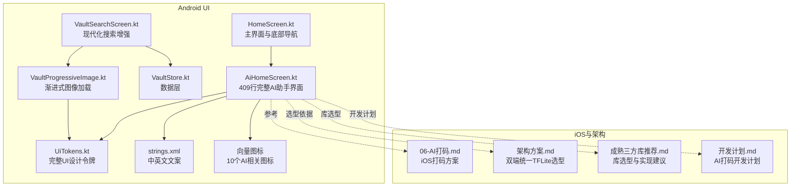
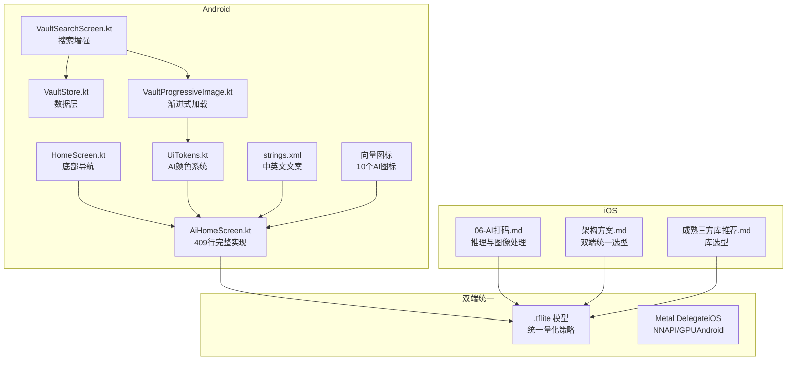
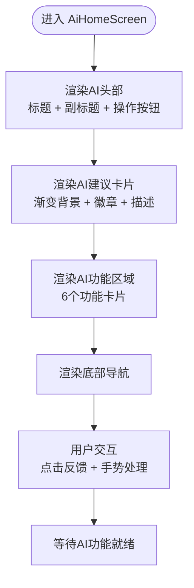
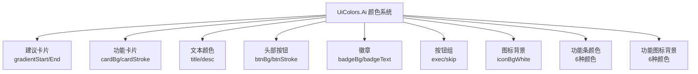
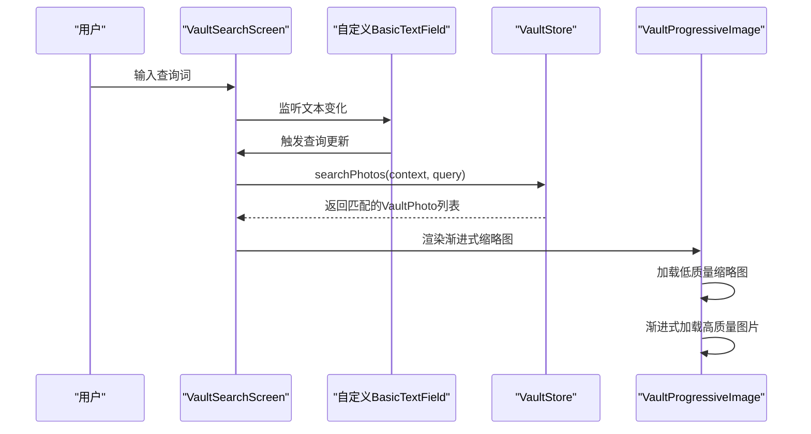
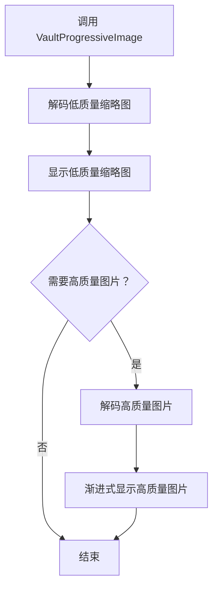
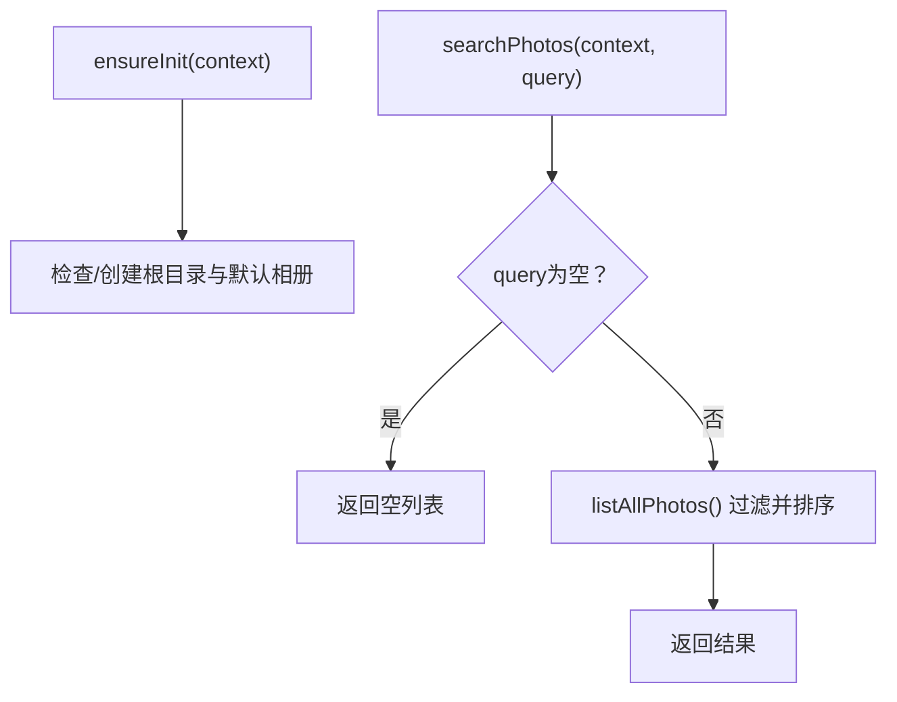
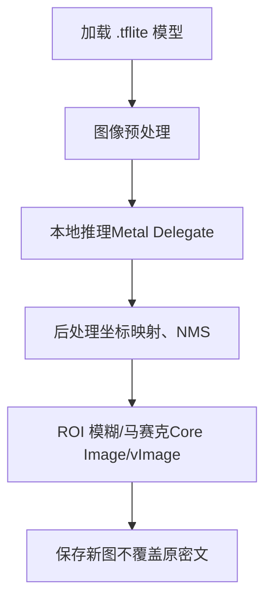
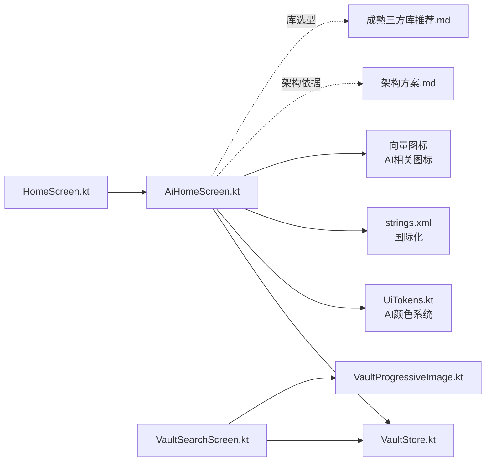

# AI功能系统

<cite>
**本文引用的文件**
- [AiHomeScreen.kt](file://android/app/src/main/kotlin/com/xpx/vault/ui/AiHomeScreen.kt)
- [VaultSearchScreen.kt](file://android/app/src/main/kotlin/com/xpx/vault/ui/VaultSearchScreen.kt)
- [HomeScreen.kt](file://android/app/src/main/kotlin/com/xpx/vault/ui/HomeScreen.kt)
- [VaultStore.kt](file://android/app/src/main/kotlin/com/xpx/vault/ui/vault/VaultStore.kt)
- [VaultProgressiveImage.kt](file://android/app/src/main/kotlin/com/xpx/vault/ui/components/VaultProgressiveImage.kt)
- [UiTokens.kt](file://android/app/src/main/kotlin/com/xpx/vault/ui/theme/UiTokens.kt)
- [strings.xml](file://android/app/src/main/res/values/strings.xml)
- [strings.xml](file://android/app/src/main/res/values-en/strings.xml)
- [ic_ai_brain.xml](file://android/app/src/main/res/drawable/ic_ai_brain.xml)
- [ic_ai_layers.xml](file://android/app/src/main/res/drawable/ic_ai_layers.xml)
- [06-AI打码.md](file://doc/ios/06-AI打码.md)
- [私密相册 App（一期）原生双端架构设计方案.md](file://spec/私密相册 App（一期）原生双端架构设计方案.md)
- [成熟三方库推荐（Android-iOS）.md](file://doc/成熟三方库推荐（Android-iOS）.md)
- [私密相册 App（一期）Android 端开发计划.md](file://doc/私密相册 App（一期）Android 端开发计划.md)
</cite>

## 更新摘要
**变更内容**
- AiHomeScreen完全重构为完整的AI助手界面，包含409行代码的新实现
- 新增完整的AI颜色系统（UiColors.Ai），包含14种颜色变量
- 引入10个新的AI相关向量图标
- 添加全面的中英文国际化支持
- 实现AI建议卡片、功能卡片等完整的用户界面组件
- 改进的用户交互设计，包含反馈按钮和手势处理

## 目录
1. [简介](#简介)
2. [项目结构](#项目结构)
3. [核心组件](#核心组件)
4. [架构总览](#架构总览)
5. [详细组件分析](#详细组件分析)
6. [依赖分析](#依赖分析)
7. [性能考虑](#性能考虑)
8. [故障排查指南](#故障排查指南)
9. [结论](#结论)
10. [附录](#附录)

## 简介
本文件面向AI照片保险库的AI功能系统，聚焦以下目标：
- 解释TensorFlow Lite集成方案与双端一致性策略
- 目标检测模型的应用与智能打码功能实现原理
- 完整的AI助手界面实现与用户交互设计
- VaultSearchScreen的搜索增强功能
- AI推理引擎的配置与优化建议
- 本地AI推理的图像预处理与后处理流程
- 性能优化、内存管理与电池消耗控制
- 模型训练、部署与更新的完整流程
- 用户体验设计、错误处理、性能监控与调试方法

**更新** AI功能已从占位状态升级为完整的AI助手界面，提供智能化的照片管理体验。

## 项目结构
Android侧与AI功能相关的关键文件与职责如下：
- AiHomeScreen.kt：完整的AI助手界面实现，包含建议卡片、功能卡片等409行代码
- HomeScreen.kt：主界面，包含底部导航与各Tab路由，其中"AI"Tab对应AiHomeScreen
- VaultSearchScreen.kt：保险库搜索页面，展示现代化的搜索输入与结果网格
- VaultStore.kt：保险库数据层，负责照片枚举、搜索等IO操作
- VaultProgressiveImage.kt：渐进式图像加载组件，提供高性能的缩略图显示
- UiTokens.kt：完整的UI设计令牌，包含新增的Ai颜色系统
- strings.xml：中英文界面文案，包含完整的AI相关提示文案
- 向量图标：10个AI相关图标，支持矢量渲染和颜色定制
- iOS文档与架构文档：提供TensorFlow Lite双端统一方案、库选型与实现要点

**图表来源**
- [AiHomeScreen.kt:1-409](file://android/app/src/main/kotlin/com/xpx/vault/ui/AiHomeScreen.kt#L1-L409)
- [HomeScreen.kt:785-896](file://android/app/src/main/kotlin/com/xpx/vault/ui/HomeScreen.kt#L785-L896)
- [VaultSearchScreen.kt:1-135](file://android/app/src/main/kotlin/com/xpx/vault/ui/VaultSearchScreen.kt#L1-L135)
- [VaultStore.kt:1-226](file://android/app/src/main/kotlin/com/xpx/vault/ui/vault/VaultStore.kt#L1-L226)
- [VaultProgressiveImage.kt:1-90](file://android/app/src/main/kotlin/com/xpx/vault/ui/components/VaultProgressiveImage.kt#L1-L90)
- [UiTokens.kt:1-220](file://android/app/src/main/kotlin/com/xpx/vault/ui/theme/UiTokens.kt#L1-L220)
- [strings.xml:1-243](file://android/app/src/main/res/values/strings.xml#L1-L243)
- [ic_ai_brain.xml:1-11](file://android/app/src/main/res/drawable/ic_ai_brain.xml#L1-L11)
- [ic_ai_layers.xml:1-11](file://android/app/src/main/res/drawable/ic_ai_layers.xml#L1-L11)

## 核心组件
- **AI助手界面（AiHomeScreen）**：完全重构的409行完整实现，包含AI头部、建议卡片、功能区域等
- **AI颜色系统（UiColors.Ai）**：新增14种颜色变量，支持渐变、按钮、徽章、功能卡片等组件
- **底部导航（HomeScreen）**：包含"AI"Tab，用于路由到AiHomeScreen
- **搜索增强（VaultSearchScreen + VaultStore）**：提供基于文件名的轻量搜索，使用现代化的自定义BasicTextField和VaultProgressiveImage组件
- **渐进式图像加载（VaultProgressiveImage）**：优化缩略图加载性能，提供高质量的视觉体验
- **UI设计系统（UiTokens）**：统一的颜色、尺寸、圆角等视觉样式规范，包含新增的AI颜色系统
- **国际化支持（strings.xml + strings-en.xml）**：提供中英文双语界面文案，如"AI Assistant"、"AI Suggestion"等

**章节来源**
- [AiHomeScreen.kt:42-72](file://android/app/src/main/kotlin/com/xpx/vault/ui/AiHomeScreen.kt#L42-L72)
- [UiTokens.kt:74-107](file://android/app/src/main/kotlin/com/xpx/vault/ui/theme/UiTokens.kt#L74-L107)
- [HomeScreen.kt:853-860](file://android/app/src/main/kotlin/com/xpx/vault/ui/HomeScreen.kt#L853-L860)
- [VaultSearchScreen.kt:85-104](file://android/app/src/main/kotlin/com/xpx/vault/ui/VaultSearchScreen.kt#L85-L104)
- [VaultProgressiveImage.kt:24-66](file://android/app/src/main/kotlin/com/xpx/vault/ui/components/VaultProgressiveImage.kt#L24-L66)
- [strings.xml:22-42](file://android/app/src/main/res/values/strings.xml#L22-L42)
- [strings.xml:22-42](file://android/app/src/main/res/values-en/strings.xml#L22-L42)

## 架构总览
AI功能系统采用"双端统一TensorFlow Lite"的架构选型，确保Android与iOS共享同一模型产物与量化策略，降低维护成本并保证行为一致性。iOS侧已给出完整的推理与图像处理实现要点，Android侧可据此进行本地推理与图像处理的落地。

**更新** 新的AI助手界面实现了完整的用户交互流程，从AI建议到功能执行的完整闭环。

**图表来源**
- [AiHomeScreen.kt:42-72](file://android/app/src/main/kotlin/com/xpx/vault/ui/AiHomeScreen.kt#L42-L72)
- [HomeScreen.kt:853-860](file://android/app/src/main/kotlin/com/xpx/vault/ui/HomeScreen.kt#L853-L860)
- [VaultSearchScreen.kt:85-104](file://android/app/src/main/kotlin/com/xpx/vault/ui/VaultSearchScreen.kt#L85-L104)
- [VaultStore.kt:109-113](file://android/app/src/main/kotlin/com/xpx/vault/ui/vault/VaultStore.kt#L109-L113)
- [VaultProgressiveImage.kt:24-66](file://android/app/src/main/kotlin/com/xpx/vault/ui/components/VaultProgressiveImage.kt#L24-L66)
- [UiTokens.kt:74-107](file://android/app/src/main/kotlin/com/xpx/vault/ui/theme/UiTokens.kt#L74-L107)
- [06-AI打码.md:1-28](file://doc/ios/06-AI打码.md#L1-L28)

## 详细组件分析

### 组件A：AiHomeScreen（完整的AI助手界面）
- **职责**：提供完整的AI助手界面，包含AI头部、建议卡片、功能区域等
- **关键点**：
  - 使用Compose布局，实现完整的AI助手界面
  - 包含AI头部（标题、副标题、操作按钮）
  - AI建议卡片（渐变背景、徽章、描述、操作按钮）
  - AI功能区域（6个功能卡片，每功能一个颜色条）
  - 使用新增的UiColors.Ai颜色系统
  - 支持中英文国际化
  - 包含完整的用户交互反馈

**更新** 从简单的占位页面升级为完整的409行AI助手界面，提供智能化的照片管理体验。

**图表来源**
- [AiHomeScreen.kt:42-72](file://android/app/src/main/kotlin/com/xpx/vault/ui/AiHomeScreen.kt#L42-L72)
- [AiHomeScreen.kt:75-108](file://android/app/src/main/kotlin/com/xpx/vault/ui/AiHomeScreen.kt#L75-L108)
- [AiHomeScreen.kt:137-260](file://android/app/src/main/kotlin/com/xpx/vault/ui/AiHomeScreen.kt#L137-L260)
- [AiHomeScreen.kt:263-298](file://android/app/src/main/kotlin/com/xpx/vault/ui/AiHomeScreen.kt#L263-L298)

**章节来源**
- [AiHomeScreen.kt:42-72](file://android/app/src/main/kotlin/com/xpx/vault/ui/AiHomeScreen.kt#L42-L72)
- [AiHomeScreen.kt:75-108](file://android/app/src/main/kotlin/com/xpx/vault/ui/AiHomeScreen.kt#L75-L108)
- [AiHomeScreen.kt:137-260](file://android/app/src/main/kotlin/com/xpx/vault/ui/AiHomeScreen.kt#L137-L260)
- [AiHomeScreen.kt:263-298](file://android/app/src/main/kotlin/com/xpx/vault/ui/AiHomeScreen.kt#L263-L298)

### 组件B：AI颜色系统（UiColors.Ai）
- **职责**：提供完整的AI功能颜色规范，确保视觉样式的一致性
- **关键点**：
  - **建议卡片**：suggestCardGradientStart/End（渐变背景）
  - **功能卡片**：featureCardBg/Stoke（卡片背景和边框）
  - **文本颜色**：featureTitle/Desc（标题和描述）
  - **头部按钮**：headerBtnBg/Stoke（操作按钮）
  - **徽章**：badgeBg/Text（标签背景和文字）
  - **建议按钮**：execBtnBg/Text（执行按钮）和skipBtnBg/Text/Stoke（跳过按钮）
  - **图标背景**：iconBgWhite（白色图标背景）
  - **功能条颜色**：classify/search/blur/compress/encrypt/dedup Bar（6个功能条颜色）
  - **功能图标背景**：classify/search/blur/compress/encrypt/dedup IconBg（6个功能图标背景）

**更新** 新增完整的AI颜色系统，包含14种颜色变量，支持从建议卡片到功能卡片的完整视觉设计。

**图表来源**
- [UiTokens.kt:74-107](file://android/app/src/main/kotlin/com/xpx/vault/ui/theme/UiTokens.kt#L74-L107)

**章节来源**
- [UiTokens.kt:74-107](file://android/app/src/main/kotlin/com/xpx/vault/ui/theme/UiTokens.kt#L74-L107)

### 组件C：AI功能卡片系统
- **职责**：展示AI核心功能，每个功能都有独特的颜色标识
- **关键点**：
  - **智能分类**：蓝色条（UiColors.Ai.classifyBar），图层图标
  - **语义搜索**：绿色条（UiColors.Ai.searchBar），搜索图标
  - **隐私打码**：红色条（UiColors.Ai.blurBar），眼睛遮挡图标
  - **图片瘦身**：橙色条（UiColors.Ai.compressBar），图片图标
  - **数据加密**：紫色条（UiColors.Ai.encryptBar），盾牌图标
  - **智能去重**：粉色条（UiColors.Ai.dedupBar），复制图标
- **设计特点**：左侧彩色条纹 + 图标背景 + 文字描述 + 点击反馈

**更新** 新增完整的功能卡片系统，提供直观的功能分类和视觉标识。

**章节来源**
- [AiHomeScreen.kt:300-355](file://android/app/src/main/kotlin/com/xpx/vault/ui/AiHomeScreen.kt#L300-L355)
- [AiHomeScreen.kt:365-408](file://android/app/src/main/kotlin/com/xpx/vault/ui/AiHomeScreen.kt#L365-L408)

### 组件D：AI建议卡片
- **职责**：展示AI检测到的隐私风险和建议
- **关键点**：
  - **渐变背景**：suggestCardGradientStart/End（深蓝到深灰渐变）
  - **徽章**：AI建议（蓝色背景，白色文字）
  - **标题**：发现X张面部信息已暴露
  - **描述**：AI检测到的详细说明和建议
  - **操作按钮**：立即执行（蓝色）和暂不需要（透明边框）
  - **图标**：大脑图标（白色，圆形背景）

**更新** 新增完整的AI建议卡片，提供智能隐私保护建议。

**章节来源**
- [AiHomeScreen.kt:137-260](file://android/app/src/main/kotlin/com/xpx/vault/ui/AiHomeScreen.kt#L137-L260)

### 组件E：VaultSearchScreen（现代化搜索增强）
- **职责**：提供基于文件名的轻量搜索，使用现代化的自定义BasicTextField和VaultProgressiveImage组件
- **关键点**：
  - 使用自定义BasicTextField实现更好的占位符处理和视觉样式
  - 通过VaultStore.searchPhotos进行搜索
  - 使用VaultProgressiveImage组件展示优化的缩略图网格
  - 支持点击预览和流畅的用户交互

**更新** 该组件已现代化改造，采用自定义BasicTextField替代传统的OutlinedTextField，提供更灵活的占位符处理机制和更好的视觉样式控制。

**图表来源**
- [VaultSearchScreen.kt:52-58](file://android/app/src/main/kotlin/com/xpx/vault/ui/VaultSearchScreen.kt#L52-L58)
- [VaultSearchScreen.kt:85-104](file://android/app/src/main/kotlin/com/xpx/vault/ui/VaultSearchScreen.kt#L85-L104)
- [VaultSearchScreen.kt:119-129](file://android/app/src/main/kotlin/com/xpx/vault/ui/VaultSearchScreen.kt#L119-L129)
- [VaultStore.kt:109-113](file://android/app/src/main/kotlin/com/xpx/vault/ui/vault/VaultStore.kt#L109-L113)

**章节来源**
- [VaultSearchScreen.kt:52-58](file://android/app/src/main/kotlin/com/xpx/vault/ui/VaultSearchScreen.kt#L52-L58)
- [VaultSearchScreen.kt:85-104](file://android/app/src/main/kotlin/com/xpx/vault/ui/VaultSearchScreen.kt#L85-L104)
- [VaultSearchScreen.kt:119-129](file://android/app/src/main/kotlin/com/xpx/vault/ui/VaultSearchScreen.kt#L119-L129)
- [VaultStore.kt:109-113](file://android/app/src/main/kotlin/com/xpx/vault/ui/vault/VaultStore.kt#L109-L113)

### 组件F：VaultProgressiveImage（渐进式图像加载）
- **职责**：提供高性能的渐进式图像加载，优化缩略图显示性能
- **关键点**：
  - 先加载低质量缩略图，再渐进式加载高质量图片
  - 支持自定义缩略图最大尺寸和高质量图片加载
  - 使用协程在IO线程处理图像解码，避免阻塞UI线程
  - 提供优雅的加载动画和背景色

**更新** 该组件专门针对搜索结果的缩略图显示进行了优化，提供流畅的渐进式加载体验。

**图表来源**
- [VaultProgressiveImage.kt:36-47](file://android/app/src/main/kotlin/com/xpx/vault/ui/components/VaultProgressiveImage.kt#L36-L47)
- [VaultProgressiveImage.kt:68-83](file://android/app/src/main/kotlin/com/xpx/vault/ui/components/VaultProgressiveImage.kt#L68-L83)
- [VaultProgressiveImage.kt:85-89](file://android/app/src/main/kotlin/com/xpx/vault/ui/components/VaultProgressiveImage.kt#L85-L89)

**章节来源**
- [VaultProgressiveImage.kt:24-66](file://android/app/src/main/kotlin/com/xpx/vault/ui/components/VaultProgressiveImage.kt#L24-L66)
- [VaultProgressiveImage.kt:68-89](file://android/app/src/main/kotlin/com/xpx/vault/ui/components/VaultProgressiveImage.kt#L68-L89)

### 组件G：VaultStore（数据层）
- **职责**：提供保险库数据访问能力，包括快照加载、相册枚举、最近照片、搜索、导入等
- **关键点**：
  - ensureInit初始化根目录与默认相册
  - listAllPhotos遍历所有照片
  - searchPhotos基于文件名过滤
  - importFromPicker导入并去重

**图表来源**
- [VaultStore.kt:60-66](file://android/app/src/main/kotlin/com/xpx/vault/ui/vault/VaultStore.kt#L60-L66)
- [VaultStore.kt:109-113](file://android/app/src/main/kotlin/com/xpx/vault/ui/vault/VaultStore.kt#L109-L113)
- [VaultStore.kt:166-184](file://android/app/src/main/kotlin/com/xpx/vault/ui/vault/VaultStore.kt#L166-L184)

**章节来源**
- [VaultStore.kt:60-66](file://android/app/src/main/kotlin/com/xpx/vault/ui/vault/VaultStore.kt#L60-L66)
- [VaultStore.kt:109-113](file://android/app/src/main/kotlin/com/xpx/vault/ui/vault/VaultStore.kt#L109-L113)
- [VaultStore.kt:166-184](file://android/app/src/main/kotlin/com/xpx/vault/ui/vault/VaultStore.kt#L166-L184)

### 组件H：国际化支持（中英文双语）
- **职责**：提供完整的中英文界面文案支持
- **关键点**：
  - 中文文案：AI助手、AI建议、智能分类等功能描述
  - 英文文案：AI Assistant、AI Suggestion、Smart Classify等
  - 支持动态语言切换
  - 保持界面布局与内容的完整性

**更新** 新增完整的中英文国际化支持，提供双语界面体验。

**章节来源**
- [strings.xml:22-42](file://android/app/src/main/res/values/strings.xml#L22-L42)
- [strings.xml:22-42](file://android/app/src/main/res/values-en/strings.xml#L22-L42)

### 组件I：AI向量图标系统
- **职责**：提供10个AI相关的矢量图标，支持颜色定制和矢量渲染
- **关键点**：
  - **ic_ai_brain.xml**：大脑图标，用于AI建议
  - **ic_ai_layers.xml**：图层图标，用于智能分类
  - **ic_ai_eye_off.xml**：眼睛遮挡图标，用于隐私打码
  - **ic_ai_image.xml**：图片图标，用于图片瘦身
  - **ic_ai_shield.xml**：盾牌图标，用于数据加密
  - **ic_ai_copy.xml**：复制图标，用于智能去重
  - **ic_ai_sliders.xml**：滑块图标，用于设置
  - **ic_ai_help.xml**：帮助图标，用于帮助
  - **ic_ai_zap.xml**：闪电图标，用于快速执行
  - **ic_ai_search.xml**：搜索图标，用于语义搜索

**更新** 新增完整的AI向量图标系统，提供丰富的视觉元素。

**章节来源**
- [ic_ai_brain.xml:1-11](file://android/app/src/main/res/drawable/ic_ai_brain.xml#L1-L11)
- [ic_ai_layers.xml:1-11](file://android/app/src/main/res/drawable/ic_ai_layers.xml#L1-L11)

### 组件J：AI推理与图像处理（iOS参考）
- **职责**：提供iOS侧AI打码的技术方案与实现要点，可作为Android落地的参考
- **关键点**：
  - 推理：与Android使用同一.tflite模型，iOS采用Metal Delegate
  - 图像效果：Core Image或vImage进行ROI模糊/马赛克
  - 线程：后台队列执行推理与像素处理，主线程刷新界面

**图表来源**
- [06-AI打码.md:9-22](file://doc/ios/06-AI打码.md#L9-L22)
- [私密相册 App（一期）原生双端架构设计方案.md:121-139](file://spec/私密相册 App（一期）原生双端架构设计方案.md#L121-L139)
- [成熟三方库推荐（Android-iOS）.md:59-89](file://doc/成熟三方库推荐（Android-iOS）.md#L59-L89)

**章节来源**
- [06-AI打码.md:1-28](file://doc/ios/06-AI打码.md#L1-L28)
- [私密相册 App（一期）原生双端架构设计方案.md:121-139](file://spec/私密相册 App（一期）原生双端架构设计方案.md#L121-L139)
- [成熟三方库推荐（Android-iOS）.md:59-89](file://doc/成熟三方库推荐（Android-iOS）.md#L59-L89)

## 依赖分析
- **组件耦合与内聚**
  - AiHomeScreen与HomeScreen通过HomeTab.AI耦合，保持UI层解耦
  - AiHomeScreen内部组件高度内聚，包含头部、建议、功能三个主要区域
  - VaultSearchScreen依赖VaultStore进行数据访问，职责清晰
  - VaultSearchScreen与VaultProgressiveImage形成清晰的数据流
- **外部依赖与集成点**
  - TensorFlow Lite作为推理引擎，iOS采用Metal Delegate，Android采用NNAPI/GPU
  - 图像处理库：iOS使用Core Image，Android可使用RenderEffect或第三方模糊库
  - 新增的AI颜色系统依赖UiTokens.kt
  - 国际化依赖strings.xml和strings-en.xml
- **潜在循环依赖**
  - 当前UI层与数据层分离良好，未发现循环依赖

**更新** 新增的AI颜色系统和向量图标增加了新的依赖关系，但整体架构保持清晰。

**图表来源**
- [HomeScreen.kt:853-860](file://android/app/src/main/kotlin/com/xpx/vault/ui/HomeScreen.kt#L853-L860)
- [AiHomeScreen.kt:42-72](file://android/app/src/main/kotlin/com/xpx/vault/ui/AiHomeScreen.kt#L42-L72)
- [VaultSearchScreen.kt:85-104](file://android/app/src/main/kotlin/com/xpx/vault/ui/VaultSearchScreen.kt#L85-L104)
- [VaultStore.kt:109-113](file://android/app/src/main/kotlin/com/xpx/vault/ui/vault/VaultStore.kt#L109-L113)
- [VaultProgressiveImage.kt:24-66](file://android/app/src/main/kotlin/com/xpx/vault/ui/components/VaultProgressiveImage.kt#L24-L66)
- [UiTokens.kt:74-107](file://android/app/src/main/kotlin/com/xpx/vault/ui/theme/UiTokens.kt#L74-L107)
- [strings.xml:22-42](file://android/app/src/main/res/values/strings.xml#L22-L42)

**章节来源**
- [HomeScreen.kt:853-860](file://android/app/src/main/kotlin/com/xpx/vault/ui/HomeScreen.kt#L853-L860)
- [AiHomeScreen.kt:42-72](file://android/app/src/main/kotlin/com/xpx/vault/ui/AiHomeScreen.kt#L42-L72)
- [VaultSearchScreen.kt:85-104](file://android/app/src/main/kotlin/com/xpx/vault/ui/VaultSearchScreen.kt#L85-L104)
- [VaultStore.kt:109-113](file://android/app/src/main/kotlin/com/xpx/vault/ui/vault/VaultStore.kt#L109-L113)
- [VaultProgressiveImage.kt:24-66](file://android/app/src/main/kotlin/com/xpx/vault/ui/components/VaultProgressiveImage.kt#L24-L66)
- [UiTokens.kt:74-107](file://android/app/src/main/kotlin/com/xpx/vault/ui/theme/UiTokens.kt#L74-L107)
- [strings.xml:22-42](file://android/app/src/main/res/values/strings.xml#L22-L42)

## 性能考虑
- **推理引擎选择**
  - Android：优先使用NNAPI/GPU以提升吞吐与能效
  - iOS：Metal Delegate具备良好性能与能效表现
- **图像处理**
  - iOS：Core Image提供系统级模糊/像素化，减少自研开销
  - Android：API 31+可用RenderEffect，低版本可评估第三方模糊库
- **线程与并发**
  - 推理与像素处理在后台队列执行，主线程仅负责UI刷新
- **内存管理**
  - 预处理与后处理尽量复用缓冲区，避免频繁分配
  - 大图推理前进行尺寸适配与分块处理
- **电池消耗**
  - 控制并发数量与批大小，避免长时间高负载
  - 在后台或低优先级场景降低帧率或关闭AI功能
- **UI性能优化**
  - **AiHomeScreen**：使用LazyColumn优化长列表渲染
  - **渐进式图像加载**：先显示低质量缩略图，再渐进式加载高质量图片
  - **颜色系统**：使用UiTokens统一管理颜色，减少重复计算
  - **图标渲染**：矢量图标支持颜色定制，减少位图资源占用
- **搜索界面性能**
  - 自定义BasicTextField的占位符处理减少了不必要的重绘和布局计算
  - 图片加载使用协程异步处理，避免阻塞UI线程

**更新** 新增的AI颜色系统和向量图标系统都经过了性能优化考虑。

## 故障排查指南
- **模型加载失败**
  - 检查.tflite文件是否正确打包与路径
  - 确认量化策略与输入/输出张量形状一致
- **推理异常**
  - 核对输入预处理参数（归一化、尺寸、通道顺序）
  - 检查后处理参数（阈值、NMS、坐标映射）
- **图像处理问题**
  - 注意色彩空间与EXIF方向
  - ROI区域裁剪与边界处理
- **AI界面问题排查**
  - **颜色显示异常**：检查UiColors.Ai颜色系统是否正确加载
  - **图标不显示**：验证向量图标文件是否存在且格式正确
  - **国际化失效**：检查strings.xml和strings-en.xml文件是否完整
  - **功能卡片点击无响应**：确认throttledClickable手势处理正常
- **搜索界面问题排查**
  - BasicTextField占位符不显示：检查decorationBox回调逻辑和条件判断
  - 图片加载缓慢：验证thumbnailMaxPx参数设置和协程调度
  - 渐进式加载异常：确认LaunchedEffect依赖项和状态管理
- **日志与监控**
  - 依赖系统日志（Logcat/OSLog）与真机测试
  - 保留非敏感诊断接口，便于后续接入

**更新** 新增AI界面相关的故障排查指南，涵盖颜色系统、图标、国际化等问题。

**章节来源**
- [06-AI打码.md:19-22](file://doc/ios/06-AI打码.md#L19-L22)
- [私密相册 App（一期）原生双端架构设计方案.md:137-139](file://spec/私密相册 App（一期）原生双端架构设计方案.md#L137-L139)

## 结论
- **AI功能重大升级**：从简单的占位页面升级为完整的409行AI助手界面
- **完整的颜色系统**：新增UiColors.Ai提供14种颜色变量，支持从建议卡片到功能卡片的完整视觉设计
- **丰富的图标系统**：新增10个AI相关向量图标，支持颜色定制和矢量渲染
- **国际化支持**：提供中英文双语界面，支持动态语言切换
- **用户体验优化**：包含AI建议卡片、功能卡片、渐进式加载等完整的用户交互设计
- **架构保持稳定**：iOS侧提供了完整的推理与图像处理实现要点，可作为Android落地的参考
- **后续开发建议**：尽快完成模型集成、预处理/后处理流水线与图像处理模块，并完善性能与监控体系

**更新** AI功能已从概念阶段发展为完整的可用界面，为后续的AI推理功能集成奠定了坚实基础。

## 附录

### A. AI功能开发路线图（Android）
- **第5周**：集成INT8 TFLite模型、输入输出tensor与预处理
- **第5周**：NMS、坐标映射回原图；ROI模糊/马赛克（RenderEffect/Canvas等）
- **第5周**：新图保存策略（不覆盖原密文）、可选入相册或仅分享
- **验收**：推理在后台线程；多张连续打码不OOM；与Domain层"每日次数/水印"挂钩

**更新** 基于现有的AI助手界面，后续开发将专注于AI推理功能的实际集成。

**章节来源**
- [私密相册 App（一期）Android 端开发计划.md:128-141](file://doc/私密相册 App（一期）Android 端开发计划.md#L128-L141)

### B. 双端统一选型与库选型
- **推荐**：双端统一使用TensorFlow Lite，维护一种.tflite与同一套量化策略
- **Android**：TFLite Runtime + Support/Task Vision
- **iOS**：TFLite Swift 或 Core ML（若单独转换）

**章节来源**
- [私密相册 App（一期）原生双端架构设计方案.md:121-139](file://spec/私密相册 App（一期）原生双端架构设计方案.md#L121-L139)
- [成熟三方库推荐（Android-iOS）.md:59-89](file://doc/成熟三方库推荐（Android-iOS）.md#L59-L89)

### C. AI界面技术细节
- **完整的Compose实现**
  - 使用LazyColumn优化长列表渲染
  - 实现完整的AI头部、建议卡片、功能区域
  - 支持用户交互反馈和手势处理
- **AI颜色系统实现**
  - 14种颜色变量，支持渐变、按钮、徽章、功能卡片等
  - 6种功能条颜色，每功能一个独特标识
  - 6种功能图标背景，与功能条颜色对应
- **向量图标系统**
  - 10个AI相关图标，支持颜色定制
  - 矢量渲染，支持任意尺寸缩放
  - 与UiTokens颜色系统无缝集成
- **国际化实现**
  - 中英文双语支持
  - 动态语言切换
  - 完整的AI相关文案翻译

**更新** 新增完整的AI界面技术实现细节，涵盖颜色系统、图标系统、国际化等各个方面。

**章节来源**
- [AiHomeScreen.kt:42-409](file://android/app/src/main/kotlin/com/xpx/vault/ui/AiHomeScreen.kt#L42-L409)
- [UiTokens.kt:74-107](file://android/app/src/main/kotlin/com/xpx/vault/ui/theme/UiTokens.kt#L74-L107)
- [strings.xml:22-42](file://android/app/src/main/res/values/strings.xml#L22-L42)
- [strings.xml:22-42](file://android/app/src/main/res/values-en/strings.xml#L22-L42)