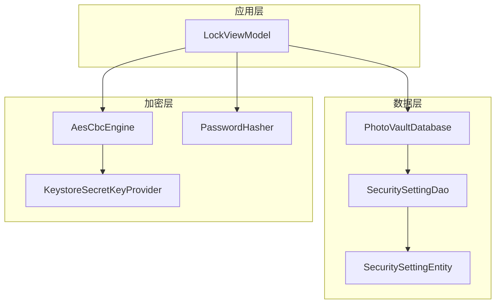
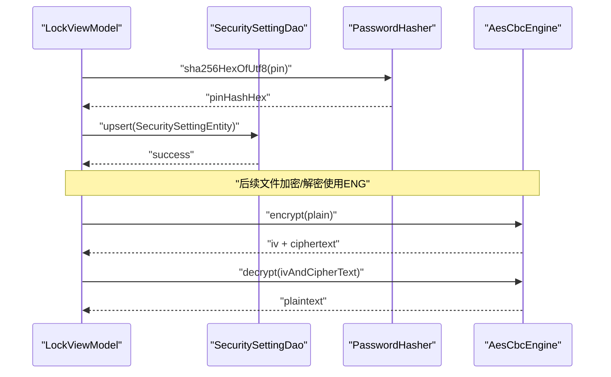
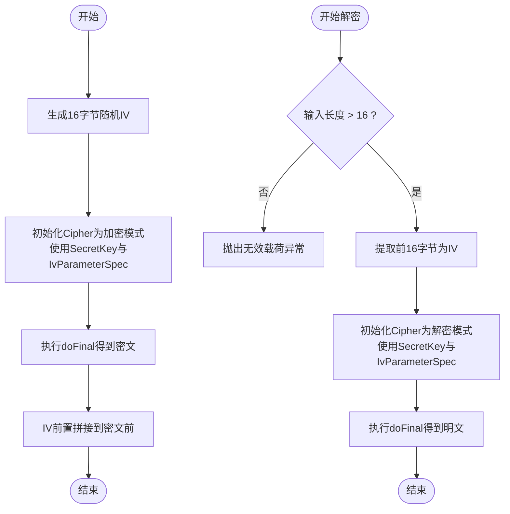
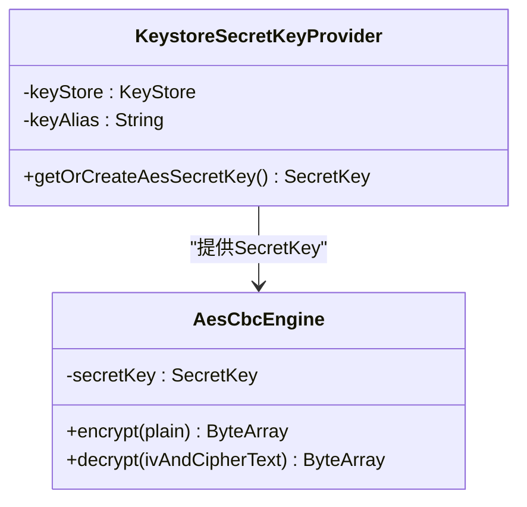
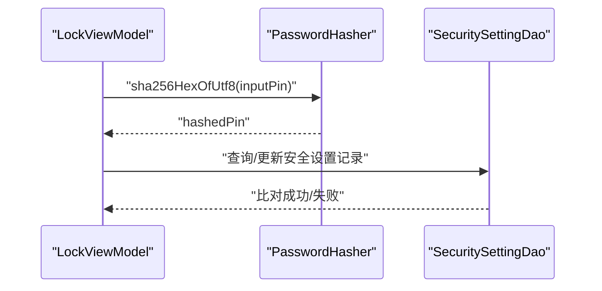
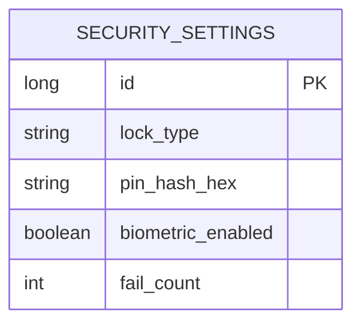
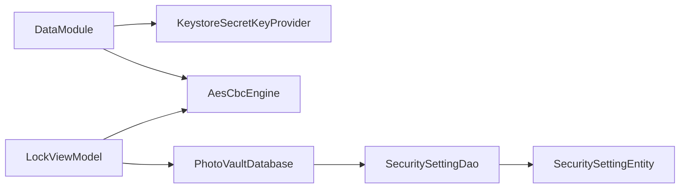

# AES-CBC加密引擎

<cite>
**本文引用的文件**
- [AesCbcEngine.kt](file://android/core/data/src/main/kotlin/com/photovault/data/crypto/AesCbcEngine.kt)
- [KeystoreSecretKeyProvider.kt](file://android/core/data/src/main/kotlin/com/photovault/data/crypto/KeystoreSecretKeyProvider.kt)
- [PasswordHasher.kt](file://android/core/data/src/main/kotlin/com/photovault/data/crypto/PasswordHasher.kt)
- [AesCbcEngineTest.kt](file://android/core/data/src/test/kotlin/com/photovault/data/crypto/AesCbcEngineTest.kt)
- [PasswordHasherTest.kt](file://android/core/data/src/test/kotlin/com/photovault/data/crypto/PasswordHasherTest.kt)
- [DataModule.kt](file://android/core/data/src/main/kotlin/com/photovault/data/di/DataModule.kt)
- [PhotoVaultDatabase.kt](file://android/core/data/src/main/kotlin/com/photovault/data/db/PhotoVaultDatabase.kt)
- [SecuritySettingEntity.kt](file://android/core/data/src/main/kotlin/com/photovault/data/db/entity/SecuritySettingEntity.kt)
- [SecuritySettingDao.kt](file://android/core/data/src/main/kotlin/com/photovault/data/db/dao/SecuritySettingDao.kt)
- [LockViewModel.kt](file://android/app/src/main/kotlin/com/photovault/app/ui/lock/LockViewModel.kt)
</cite>

## 目录
1. [简介](#简介)
2. [项目结构](#项目结构)
3. [核心组件](#核心组件)
4. [架构总览](#架构总览)
5. [详细组件分析](#详细组件分析)
6. [依赖关系分析](#依赖关系分析)
7. [性能考量](#性能考量)
8. [故障排查指南](#故障排查指南)
9. [结论](#结论)
10. [附录](#附录)

## 简介
本文件面向AES-256-CBC加密引擎的实现与使用，基于仓库中现有的Android端加密模块，系统阐述以下内容：
- AES-256-CBC加密算法的实现原理与数据格式约定
- 初始化向量（IV）生成策略与前置存储方式
- PKCS7填充模式在JVM/Android平台上的映射与行为
- 对称加密与解密流程、错误处理与异常管理
- 密钥长度选择、加密模式配置、数据块处理机制
- 性能优化、内存管理、并发安全与线程模型
- 安全最佳实践、常见陷阱与调试方法
- 与Android Keystore的集成方式、密钥派生与参数配置
- 实际使用场景：文件加密、数据解密、完整性校验、随机数生成

## 项目结构
本加密引擎位于android/core/data/crypto目录下，采用按功能域划分的模块化组织方式：
- 加密核心：AesCbcEngine.kt
- 密钥管理：KeystoreSecretKeyProvider.kt
- 口令哈希：PasswordHasher.kt
- 依赖注入：DataModule.kt
- 数据持久化：PhotoVaultDatabase.kt、SecuritySettingEntity.kt、SecuritySettingDao.kt
- 应用层使用：LockViewModel.kt（PIN解锁流程中使用口令哈希）

图表来源
- [DataModule.kt:34-38](file://android/core/data/src/main/kotlin/com/photovault/data/di/DataModule.kt#L34-L38)
- [AesCbcEngine.kt:12-32](file://android/core/data/src/main/kotlin/com/photovault/data/crypto/AesCbcEngine.kt#L12-L32)
- [KeystoreSecretKeyProvider.kt:12-35](file://android/core/data/src/main/kotlin/com/photovault/data/crypto/KeystoreSecretKeyProvider.kt#L12-L35)
- [PasswordHasher.kt:6-25](file://android/core/data/src/main/kotlin/com/photovault/data/crypto/PasswordHasher.kt#L6-L25)
- [PhotoVaultDatabase.kt:14-35](file://android/core/data/src/main/kotlin/com/photovault/data/db/PhotoVaultDatabase.kt#L14-L35)
- [SecuritySettingEntity.kt:7-18](file://android/core/data/src/main/kotlin/com/photovault/data/db/entity/SecuritySettingEntity.kt#L7-L18)
- [SecuritySettingDao.kt:9-16](file://android/core/data/src/main/kotlin/com/photovault/data/db/dao/SecuritySettingDao.kt#L9-L16)
- [LockViewModel.kt:18-221](file://android/app/src/main/kotlin/com/photovault/app/ui/lock/LockViewModel.kt#L18-L221)

章节来源
- [DataModule.kt:15-39](file://android/core/data/src/main/kotlin/com/photovault/data/di/DataModule.kt#L15-L39)
- [PhotoVaultDatabase.kt:14-35](file://android/core/data/src/main/kotlin/com/photovault/data/db/PhotoVaultDatabase.kt#L14-L35)

## 核心组件
- AesCbcEngine：提供AES-256-CBC加密与解密能力，IV前置16字节，使用PKCS5Padding（与PKCS7等价）
- KeystoreSecretKeyProvider：在Android Keystore中生成或读取AES-256密钥，密钥材料不可导出
- PasswordHasher：提供SHA-256口令哈希与带salt的哈希计算，用于PIN等口令存储
- DataModule：通过Hilt提供数据库、密钥提供器与加密引擎实例
- LockViewModel：在PIN解锁流程中使用PasswordHasher进行口令校验

章节来源
- [AesCbcEngine.kt:8-39](file://android/core/data/src/main/kotlin/com/photovault/data/crypto/AesCbcEngine.kt#L8-L39)
- [KeystoreSecretKeyProvider.kt:9-41](file://android/core/data/src/main/kotlin/com/photovault/data/crypto/KeystoreSecretKeyProvider.kt#L9-L41)
- [PasswordHasher.kt:5-25](file://android/core/data/src/main/kotlin/com/photovault/data/crypto/PasswordHasher.kt#L5-L25)
- [DataModule.kt:29-38](file://android/core/data/src/main/kotlin/com/photovault/data/di/DataModule.kt#L29-L38)
- [LockViewModel.kt:153-184](file://android/app/src/main/kotlin/com/photovault/app/ui/lock/LockViewModel.kt#L153-L184)

## 架构总览
加密引擎在应用中的调用链路如下：
- 应用层（如LockViewModel）通过依赖注入获取AesCbcEngine实例
- AesCbcEngine内部持有由KeystoreSecretKeyProvider提供的SecretKey
- 加密时生成随机IV，前置拼接后返回；解密时从输入前16字节提取IV并解密
- 口令哈希用于PIN等口令存储与校验，不直接参与文件加密

图表来源
- [LockViewModel.kt:153-184](file://android/app/src/main/kotlin/com/photovault/app/ui/lock/LockViewModel.kt#L153-L184)
- [PasswordHasher.kt:14-15](file://android/core/data/src/main/kotlin/com/photovault/data/crypto/PasswordHasher.kt#L14-L15)
- [AesCbcEngine.kt:17-32](file://android/core/data/src/main/kotlin/com/photovault/data/crypto/AesCbcEngine.kt#L17-L32)

## 详细组件分析

### AES-256-CBC加密引擎（AesCbcEngine）
- 算法与填充
  - 使用“AES/CBC/PKCS5Padding”变换，PKCS5Padding在JVM/Android上与PKCS7等价
  - 密钥长度为256位（由KeystoreSecretKeyProvider生成）
- IV生成与存储
  - 每次加密生成16字节随机IV，使用SecureRandom
  - 将IV前置拼接到密文前，形成统一的密文格式
- 加密流程
  - 生成IV → 获取Cipher实例 → 初始化为加密模式（含IV参数）→ 执行doFinal → 返回“IV + 密文”
- 解密流程
  - 输入长度校验 → 提取前16字节为IV → 初始化Cipher为解密模式（含IV）→ 执行doFinal → 返回明文
- 错误处理
  - 解密输入长度小于IV长度时抛出异常，提示无效载荷
- 并发与线程安全
  - Cipher实例非线程安全，但当前实现每次调用都新建Cipher，避免共享状态
  - SecureRandom为线程安全的伪随机生成器

图表来源
- [AesCbcEngine.kt:17-32](file://android/core/data/src/main/kotlin/com/photovault/data/crypto/AesCbcEngine.kt#L17-L32)

章节来源
- [AesCbcEngine.kt:8-39](file://android/core/data/src/main/kotlin/com/photovault/data/crypto/AesCbcEngine.kt#L8-L39)

### Android Keystore密钥提供器（KeystoreSecretKeyProvider）
- 功能
  - 若指定别名存在则读取现有密钥；否则在Android Keystore中生成新的AES-256密钥
  - 密钥用途为加密与解密，启用CBC模式与PKCS7填充
  - 密钥材料不可导出，增强安全性
- 参数配置
  - 别名：默认“photo_vault_master_aes”
  - 密钥大小：256位
  - 用户认证：未启用
- 依赖注入
  - 通过DataModule提供单例实例，并注入到AesCbcEngine

图表来源
- [KeystoreSecretKeyProvider.kt:12-35](file://android/core/data/src/main/kotlin/com/photovault/data/crypto/KeystoreSecretKeyProvider.kt#L12-L35)
- [AesCbcEngine.kt:12-14](file://android/core/data/src/main/kotlin/com/photovault/data/crypto/AesCbcEngine.kt#L12-L14)

章节来源
- [KeystoreSecretKeyProvider.kt:9-41](file://android/core/data/src/main/kotlin/com/photovault/data/crypto/KeystoreSecretKeyProvider.kt#L9-L41)
- [DataModule.kt:30-38](file://android/core/data/src/main/kotlin/com/photovault/data/di/DataModule.kt#L30-L38)

### 口令哈希（PasswordHasher）
- 功能
  - 提供SHA-256字节数组与UTF-8字符串的十六进制哈希
  - 支持“salt || password”的组合哈希，用于PIN等口令存储
- 应用场景
  - LockViewModel中对用户输入的PIN进行哈希后与数据库中存储的哈希值比对
- 注意
  - 该模块不参与文件加密/解密流程，仅用于口令存储与校验

图表来源
- [PasswordHasher.kt:9-24](file://android/core/data/src/main/kotlin/com/photovault/data/crypto/PasswordHasher.kt#L9-L24)
- [LockViewModel.kt:153-184](file://android/app/src/main/kotlin/com/photovault/app/ui/lock/LockViewModel.kt#L153-L184)

章节来源
- [PasswordHasher.kt:5-25](file://android/core/data/src/main/kotlin/com/photovault/data/crypto/PasswordHasher.kt#L5-L25)
- [LockViewModel.kt:153-184](file://android/app/src/main/kotlin/com/photovault/app/ui/lock/LockViewModel.kt#L153-L184)

### 数据持久化与PIN存储
- 数据库与实体
  - PhotoVaultDatabase定义了数据库版本与实体列表
  - SecuritySettingEntity保存锁类型、PIN哈希、生物识别开关与失败次数
  - SecuritySettingDao提供按ID查询与替换式插入
- PIN设置与校验流程
  - 设置PIN时先进行哈希，再写入数据库
  - 解锁时对输入PIN进行哈希并与存储值比较

图表来源
- [SecuritySettingEntity.kt:7-18](file://android/core/data/src/main/kotlin/com/photovault/data/db/entity/SecuritySettingEntity.kt#L7-L18)

章节来源
- [PhotoVaultDatabase.kt:14-35](file://android/core/data/src/main/kotlin/com/photovault/data/db/PhotoVaultDatabase.kt#L14-L35)
- [SecuritySettingEntity.kt:7-18](file://android/core/data/src/main/kotlin/com/photovault/data/db/entity/SecuritySettingEntity.kt#L7-L18)
- [SecuritySettingDao.kt:9-16](file://android/core/data/src/main/kotlin/com/photovault/data/db/dao/SecuritySettingDao.kt#L9-L16)
- [LockViewModel.kt:153-184](file://android/app/src/main/kotlin/com/photovault/app/ui/lock/LockViewModel.kt#L153-L184)

## 依赖关系分析
- 组件耦合
  - AesCbcEngine依赖SecretKey（来自KeystoreSecretKeyProvider）
  - DataModule负责提供密钥提供器与加密引擎实例，确保单例生命周期
  - LockViewModel通过依赖注入获取AesCbcEngine与数据库访问能力
- 外部依赖
  - Android Keystore、Javax Crypto Cipher、Room数据库
- 潜在风险
  - Cipher实例非线程安全，但当前实现每次调用新建Cipher，避免共享状态
  - IV长度固定为16字节，需确保输入输出格式一致

图表来源
- [DataModule.kt:29-38](file://android/core/data/src/main/kotlin/com/photovault/data/di/DataModule.kt#L29-L38)
- [AesCbcEngine.kt:12-14](file://android/core/data/src/main/kotlin/com/photovault/data/crypto/AesCbcEngine.kt#L12-L14)
- [LockViewModel.kt:18-221](file://android/app/src/main/kotlin/com/photovault/app/ui/lock/LockViewModel.kt#L18-L221)

章节来源
- [DataModule.kt:15-39](file://android/core/data/src/main/kotlin/com/photovault/data/di/DataModule.kt#L15-L39)

## 性能考量
- 随机数生成
  - 使用SecureRandom生成IV，性能开销低且满足加密强度要求
- Cipher实例
  - 每次调用新建Cipher，避免跨线程共享带来的同步成本
- 内存管理
  - 明文与密文均为ByteArray，建议在大对象处理时及时释放引用，避免内存泄漏
- 并发安全
  - 当前实现无全局共享状态；若未来改为共享Cipher实例，需引入同步或线程局部存储
- I/O与批处理
  - 文件加密建议分块处理，结合缓冲区减少峰值内存占用

## 故障排查指南
- 常见错误与定位
  - 解密输入长度不足：检查是否正确拼接IV与密文，或是否截断了数据
  - 密钥不匹配：确认使用的密钥别名与Keystore中一致，且未被系统清理
  - 填充异常：确认加密端与解密端使用相同的填充模式（PKCS5Padding）
- 单元测试参考
  - 加密解密往返测试：验证round-trip正确性
  - 口令哈希确定性测试：验证相同输入产生相同哈希
- 调试建议
  - 记录IV与密文长度，便于问题复现
  - 在关键路径打印日志（注意避免泄露敏感信息）

章节来源
- [AesCbcEngineTest.kt:7-18](file://android/core/data/src/test/kotlin/com/photovault/data/crypto/AesCbcEngineTest.kt#L7-L18)
- [PasswordHasherTest.kt:6-23](file://android/core/data/src/test/kotlin/com/photovault/data/crypto/PasswordHasherTest.kt#L6-L23)

## 结论
本AES-CBC加密引擎在Android平台上实现了安全、简洁的对称加密方案：
- 采用AES-256-CBC与PKCS7填充，IV前置16字节，兼容既有协议
- 密钥托管于Android Keystore，密钥材料不可导出，提升安全性
- 通过Hilt实现依赖注入，确保单例与可测试性
- 在PIN等口令场景中使用SHA-256哈希，避免明文存储
- 建议在生产环境中进一步完善完整性校验（如HMAC）、密钥轮换与迁移策略，并持续进行安全审计与渗透测试。

## 附录

### 使用示例（代码片段路径）
- 文件加密（加密引擎）
  - [AesCbcEngine.encrypt:17-23](file://android/core/data/src/main/kotlin/com/photovault/data/crypto/AesCbcEngine.kt#L17-L23)
- 文件解密（加密引擎）
  - [AesCbcEngine.decrypt:25-32](file://android/core/data/src/main/kotlin/com/photovault/data/crypto/AesCbcEngine.kt#L25-L32)
- 随机数生成（IV）
  - [SecureRandom使用:15-18](file://android/core/data/src/main/kotlin/com/photovault/data/crypto/AesCbcEngine.kt#L15-L18)
- 口令哈希（PIN）
  - [PasswordHasher.sha256HexOfUtf8:14-15](file://android/core/data/src/main/kotlin/com/photovault/data/crypto/PasswordHasher.kt#L14-L15)
  - [LockViewModel中PIN存储与校验:153-184](file://android/app/src/main/kotlin/com/photovault/app/ui/lock/LockViewModel.kt#L153-L184)

### 安全最佳实践
- 严格遵循IV唯一性与随机性要求，避免IV重复
- 对密文与IV进行统一序列化与传输，避免截断或拼接错误
- 在应用层避免明文日志输出，仅记录必要诊断信息
- 定期轮换主密钥，保留迁移与回滚策略
- 引入完整性校验（如HMAC-SHA256）以检测篡改

### 常见加密陷阱
- 忘记IV前置或长度不一致导致解密失败
- 共享Cipher实例引发竞态条件
- 明文口令直接存储或日志泄露
- 使用弱随机源或固定IV

### 调试与单元测试方法
- 单元测试
  - 加密解密往返测试：[AesCbcEngineTest:7-18](file://android/core/data/src/test/kotlin/com/photovault/data/crypto/AesCbcEngineTest.kt#L7-L18)
  - 口令哈希确定性测试：[PasswordHasherTest:6-23](file://android/core/data/src/test/kotlin/com/photovault/data/crypto/PasswordHasherTest.kt#L6-L23)
- 集成测试
  - 在LockViewModel中模拟PIN设置与解锁流程，验证哈希一致性与数据库交互