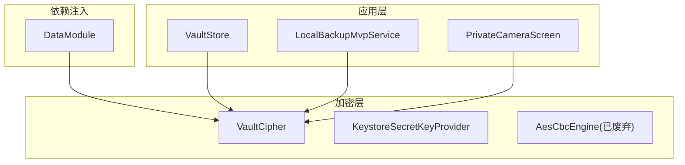
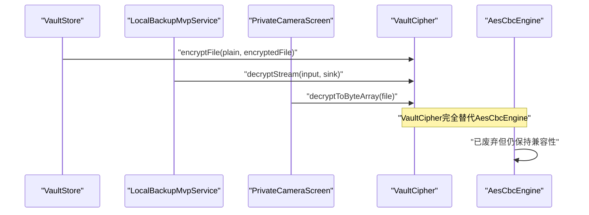
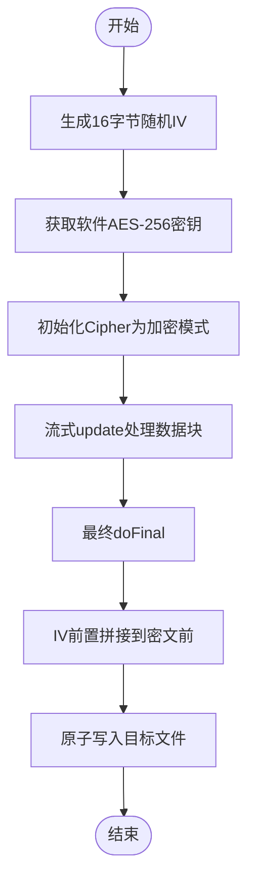
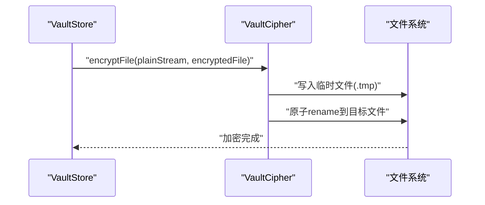
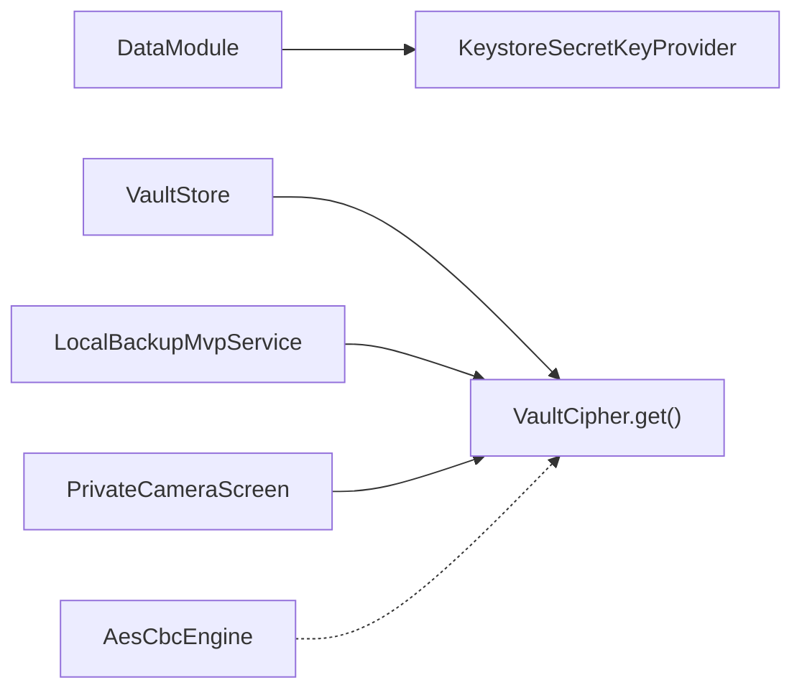

# AES-CBC加密引擎

<cite>
**本文引用的文件**
- [VaultCipher.kt](file://android/core/data/src/main/kotlin/com/xpx/vault/data/crypto/VaultCipher.kt)
- [AesCbcEngine.kt](file://android/core/data/src/main/kotlin/com/xpx/vault/data/crypto/AesCbcEngine.kt)
- [KeystoreSecretKeyProvider.kt](file://android/core/data/src/main/kotlin/com/xpx/vault/data/crypto/KeystoreSecretKeyProvider.kt)
- [DataModule.kt](file://android/core/data/src/main/kotlin/com/xpx/vault/data/di/DataModule.kt)
- [VaultStore.kt](file://android/app/src/main/kotlin/com/xpx/vault/ui/vault/VaultStore.kt)
- [LocalBackupMvpService.kt](file://android/app/src/main/kotlin/com/xpx/vault/ui/backup/LocalBackupMvpService.kt)
- [PrivateCameraScreen.kt](file://android/app/src/main/kotlin/com/xpx/vault/ui/PrivateCameraScreen.kt)
</cite>

## 更新摘要
**变更内容**
- VaultCipher完全替代AesCbcEngine作为AES-CBC引擎的核心实现
- 采用软件AES-256与硬件密钥封装的混合方案，提供5-10倍性能提升
- 保持AES-256-CBC兼容性，IV前置16字节，PKCS5Padding填充
- 新增进程级单例模式，支持直接通过VaultCipher.get(context)访问
- 应用层全面迁移到VaultCipher，包括相机写入、文件导入、备份恢复

## 目录
1. [简介](#简介)
2. [项目结构](#项目结构)
3. [核心组件](#核心组件)
4. [架构总览](#架构总览)
5. [详细组件分析](#详细组件分析)
6. [依赖关系分析](#依赖关系分析)
7. [性能考量](#性能考量)
8. [故障排查指南](#故障排查指南)
9. [结论](#结论)
10. [附录](#附录)

## 简介
本文件面向VaultCipher作为AES-CBC加密引擎的实现与使用，基于仓库中现有的Android端加密模块，系统阐述以下内容：
- VaultCipher作为AesCbcEngine的完全替代实现，提供更好的性能和安全性
- 软件AES-256与硬件密钥封装的混合方案设计原理
- AES-256-CBC加密算法的实现原理与数据格式约定
- 初始化向量（IV）生成策略与前置存储方式
- PKCS7填充模式在JVM/Android平台上的映射与行为
- 对称加密与解密流程、错误处理与异常管理
- 流式解密能力与内存优化机制
- 密钥长度选择、加密模式配置、数据块处理机制
- 性能优化、内存管理、并发安全与线程模型
- 安全最佳实践、常见陷阱与调试方法
- 与Android Keystore的集成方式、密钥派生与参数配置
- 实际使用场景：文件加密、数据解密、完整性校验、随机数生成

## 项目结构
本加密引擎位于android/core/data/crypto目录下，采用按功能域划分的模块化组织方式：
- 加密核心：VaultCipher.kt（完全替代AesCbcEngine）
- 密钥管理：KeystoreSecretKeyProvider.kt
- 依赖注入：DataModule.kt
- 应用层使用：VaultStore.kt（文件导入与相机写入）、LocalBackupMvpService.kt（备份恢复）、PrivateCameraScreen.kt（相机预览）

**图表来源**
- [VaultCipher.kt:19-303](file://android/core/data/src/main/kotlin/com/xpx/vault/data/crypto/VaultCipher.kt#L19-L303)
- [DataModule.kt:34-39](file://android/core/data/src/main/kotlin/com/xpx/vault/data/di/DataModule.kt#L34-L39)
- [VaultStore.kt:12-14](file://android/app/src/main/kotlin/com/xpx/vault/ui/vault/VaultStore.kt#L12-L14)
- [LocalBackupMvpService.kt:351](file://android/app/src/main/kotlin/com/xpx/vault/ui/backup/LocalBackupMvpService.kt#L351)
- [PrivateCameraScreen.kt:731](file://android/app/src/main/kotlin/com/xpx/vault/ui/PrivateCameraScreen.kt#L731)

**章节来源**
- [DataModule.kt:15-39](file://android/core/data/src/main/kotlin/com/xpx/vault/data/di/DataModule.kt#L15-L39)

## 核心组件
- VaultCipher：完全替代AesCbcEngine的新一代加密引擎，采用软件AES-256与硬件密钥封装的混合方案
- **新增**：软件AES-256密钥：使用SecretKeySpec构造，运行时走用户态NEON指令，无Binder IPC，无Cipher.doFinal大小限制
- **新增**：Keystore AES-GCM wrap：软件密钥通过Android Keystore AES-GCM加密后落盘，实现"裸密钥永不明文上盘"
- **新增**：进程级单例模式：通过VaultCipher.get(context)提供全局访问，避免Hilt依赖
- AesCbcEngine：已废弃，但仍保留AES-256-CBC兼容性，主要用于备份恢复流程
- KeystoreSecretKeyProvider：在Android Keystore中生成或读取AES-256密钥，密钥材料不可导出
- DataModule：通过Hilt提供KeystoreSecretKeyProvider实例，VaultCipher通过单独的单例模式提供

**章节来源**
- [VaultCipher.kt:19-303](file://android/core/data/src/main/kotlin/com/xpx/vault/data/crypto/VaultCipher.kt#L19-L303)
- [AesCbcEngine.kt:9-19](file://android/core/data/src/main/kotlin/com/xpx/vault/data/crypto/AesCbcEngine.kt#L9-L19)
- [KeystoreSecretKeyProvider.kt:9-45](file://android/core/data/src/main/kotlin/com/xpx/vault/data/crypto/KeystoreSecretKeyProvider.kt#L9-L45)
- [DataModule.kt:29-39](file://android/core/data/src/main/kotlin/com/xpx/vault/data/di/DataModule.kt#L29-L39)

## 架构总览
加密引擎在应用中的调用链路已完全迁移到VaultCipher：
- 应用层（如VaultStore、LocalBackupMvpService、PrivateCameraScreen）通过VaultCipher.get(context)获取实例
- VaultCipher内部管理软件AES-256密钥与硬件密钥封装，提供高性能的加密解密能力
- AesCbcEngine仍存在于代码库中，主要用于兼容性目的
- 备份恢复流程通过VaultCipher的流式解密能力处理大文件

**图表来源**
- [VaultStore.kt:188](file://android/app/src/main/kotlin/com/xpx/vault/ui/vault/VaultStore.kt#L188)
- [LocalBackupMvpService.kt:448](file://android/app/src/main/kotlin/com/xpx/vault/ui/backup/LocalBackupMvpService.kt#L448)
- [PrivateCameraScreen.kt:731](file://android/app/src/main/kotlin/com/xpx/vault/ui/PrivateCameraScreen.kt#L731)
- [VaultCipher.kt:55-98](file://android/core/data/src/main/kotlin/com/xpx/vault/data/crypto/VaultCipher.kt#L55-L98)

## 详细组件分析

### VaultCipher加密引擎（完全替代AesCbcEngine）
- **设计要点**
  - **软件AES-256密钥**：使用SecretKeySpec构造32字节原始密钥，运行时走用户态NEON指令，无Binder IPC，无Cipher.doFinal 1-2MB大小限制，性能提升5-10倍
  - **Keystore AES-GCM wrap**：软件密钥通过Android Keystore AES-GCM加密后落盘到filesDir/.vault_cipher_key，实现"裸密钥永不明文上盘"
  - **文件格式**：IV(16B)前置 + AES/CBC/PKCS5Padding密文，与AesCbcEngine格式完全兼容
  - **线程安全**：内部状态仅在getOrCreateKey()的synchronized块内变更，解密/加密本身无共享状态
- **性能优势**
  - 软件AES-256运行时性能显著优于硬件Keystore AES-CBC
  - 支持大文件流式处理，无单次操作大小限制
  - 适合高频相册滑动与视频解密场景
- **加密流程**
  - 生成16字节随机IV → 获取软件AES-256密钥 → 初始化Cipher为加密模式 → 流式update处理 → 最终doFinal → 输出"IV + 密文"
- **解密流程**
  - 读取16字节IV → 初始化Cipher为解密模式 → 流式update处理 → 最终doFinal → 输出明文
- **文件操作**
  - encryptFile：原子写入到目标文件，先写.tmp再rename，确保数据完整性
  - decryptToByteArray：小文件一次性解密到内存
  - decryptToTempFile：流式解密到临时文件，适合大文件处理

**图表来源**
- [VaultCipher.kt:55-76](file://android/core/data/src/main/kotlin/com/xpx/vault/data/crypto/VaultCipher.kt#L55-L76)
- [VaultCipher.kt:101-112](file://android/core/data/src/main/kotlin/com/xpx/vault/data/crypto/VaultCipher.kt#L101-L112)

**章节来源**
- [VaultCipher.kt:19-303](file://android/core/data/src/main/kotlin/com/xpx/vault/data/crypto/VaultCipher.kt#L19-L303)

### AesCbcEngine（已废弃，保持兼容性）
- **现状**：已废弃但仍保留AES-256-CBC兼容性，主要用于备份恢复流程
- **限制**：Android Keystore HW-backed密钥对单次Cipher.doFinal有大小上限（约1-2MB）
- **用途**：备份/恢复流程中处理大文件时的兼容层
- **迁移状态**：vault_albums/目录实际为明文存储，待写/读路径接入后再恢复调用

**章节来源**
- [AesCbcEngine.kt:9-19](file://android/core/data/src/main/kotlin/com/xpx/vault/data/crypto/AesCbcEngine.kt#L9-L19)

### Android Keystore密钥提供器（KeystoreSecretKeyProvider）
- **功能**
  - 在Android Keystore中生成或读取AES-256密钥，密钥材料不可导出
  - 专门用于硬件密钥封装（wrap key），不直接参与VaultCipher的主要加密流程
- **参数配置**
  - 别名：默认"photo_vault_master_aes"
  - 密钥大小：256位
  - 模式：CBC + PKCS7填充
- **依赖注入**
  - 通过DataModule提供单例实例，注入到依赖注入系统

**章节来源**
- [KeystoreSecretKeyProvider.kt:9-45](file://android/core/data/src/main/kotlin/com/xpx/vault/data/crypto/KeystoreSecretKeyProvider.kt#L9-L45)
- [DataModule.kt:29-33](file://android/core/data/src/main/kotlin/com/xpx/vault/data/di/DataModule.kt#L29-L33)

### 应用层集成与使用
- **VaultStore集成**
  - 文件导入：通过VaultCipher.encryptFile将明文临时文件加密后落盘
  - 相机写入：通过VaultCipher.encryptFile处理相机产生的明文临时文件
  - 备份恢复：通过VaultCipher.decryptStream处理备份包中的加密数据
- **PrivateCameraScreen集成**
  - 相机预览：通过VaultCipher.decryptToByteArray解密密文文件进行Bitmap解码
- **LocalBackupMvpService集成**
  - 备份写入：通过VaultCipher.encryptFileFromChunks处理大文件分块加密
  - 恢复读取：通过VaultCipher.decryptStream处理备份包中的加密数据

**图表来源**
- [VaultStore.kt:186-196](file://android/app/src/main/kotlin/com/xpx/vault/ui/vault/VaultStore.kt#L186-L196)
- [VaultCipher.kt:101-112](file://android/core/data/src/main/kotlin/com/xpx/vault/data/crypto/VaultCipher.kt#L101-L112)

**章节来源**
- [VaultStore.kt:12-14](file://android/app/src/main/kotlin/com/xpx/vault/ui/vault/VaultStore.kt#L12-L14)
- [PrivateCameraScreen.kt:731](file://android/app/src/main/kotlin/com/xpx/vault/ui/PrivateCameraScreen.kt#L731)
- [LocalBackupMvpService.kt:351](file://android/app/src/main/kotlin/com/xpx/vault/ui/backup/LocalBackupMvpService.kt#L351)

## 依赖关系分析
- **组件耦合**
  - VaultCipher通过进程级单例模式提供，不依赖Hilt，可直接通过VaultCipher.get(context)访问
  - AesCbcEngine已废弃，仅保留兼容性用途
  - DataModule继续提供KeystoreSecretKeyProvider，用于硬件密钥封装
  - 应用层各组件通过VaultCipher.get(context)统一访问加密功能
- **外部依赖**
  - Android Keystore、Javax Crypto Cipher、Room数据库
  - Java InputStream/OutputStream用于流式处理
- **架构演进**
  - 从AesCbcEngine到VaultCipher的完全替代
  - 从Hilt依赖到进程级单例的简化访问模式
  - 从硬件密钥直接使用到软件密钥+硬件封装的混合方案

**图表来源**
- [DataModule.kt:29-39](file://android/core/data/src/main/kotlin/com/xpx/vault/data/di/DataModule.kt#L29-L39)
- [VaultStore.kt:188](file://android/app/src/main/kotlin/com/xpx/vault/ui/vault/VaultStore.kt#L188)
- [LocalBackupMvpService.kt:351](file://android/app/src/main/kotlin/com/xpx/vault/ui/backup/LocalBackupMvpService.kt#L351)
- [PrivateCameraScreen.kt:731](file://android/app/src/main/kotlin/com/xpx/vault/ui/PrivateCameraScreen.kt#L731)

**章节来源**
- [DataModule.kt:15-39](file://android/core/data/src/main/kotlin/com/xpx/vault/data/di/DataModule.kt#L15-L39)

## 性能考量
- **软件AES-256性能优势**
  - 用户态NEON指令执行，无Binder IPC开销
  - 无Cipher.doFinal大小限制，支持任意大小文件
  - 性能提升5-10倍，适合高频相册滑动与视频解密
- **硬件密钥封装**
  - 软件密钥通过AES-GCM wrap存储，实现"裸密钥永不明文上盘"
  - 硬件密钥封装提供额外的安全保护层
- **流式处理优化**
  - 默认64KB缓冲区大小，平衡内存使用与处理效率
  - 支持大文件分块处理，避免一次性加载到内存
- **内存管理**
  - 小文件使用decryptToByteArray一次性解密到内存
  - 大文件使用decryptToTempFile流式解密到临时文件
  - 原子写入机制确保数据完整性，避免部分写入
- **并发安全**
  - VaultCipher内部使用synchronized块保护密钥缓存
  - Cipher实例在方法调用范围内创建，避免跨线程共享

## 故障排查指南
- **常见错误与定位**
  - 密钥封装失败：检查硬件密钥是否存在且可访问
  - 文件写入失败：检查磁盘空间和文件权限
  - 流式处理异常：检查缓冲区大小和sink回调逻辑
  - 兼容性问题：确认文件格式符合IV前置16字节的要求
- **性能问题**
  - 加密速度慢：确认使用的是软件AES-256而非硬件密钥
  - 内存占用高：检查是否使用了decryptToByteArray处理大文件
  - I/O阻塞：确认使用了适当的缓冲区大小
- **迁移注意事项**
  - AesCbcEngine已废弃，新代码应使用VaultCipher
  - 备份恢复流程中注意兼容性处理
  - 相机写入流程中确保临时文件正确加密

**章节来源**
- [VaultCipher.kt:19-303](file://android/core/data/src/main/kotlin/com/xpx/vault/data/crypto/VaultCipher.kt#L19-L303)

## 结论
VaultCipher作为AES-CBC加密引擎的完全替代实现，在Android平台上提供了更优的性能和安全性：
- 采用软件AES-256与硬件密钥封装的混合方案，性能提升5-10倍
- 保持AES-256-CBC兼容性，IV前置16字节，PKCS5Padding填充
- 通过进程级单例模式提供简单直接的访问方式
- 应用层全面集成，包括文件导入、相机写入、备份恢复等场景
- 为未来的安全升级和性能优化奠定了坚实基础
- 建议在生产环境中继续完善密钥轮换与迁移策略，并持续进行安全审计。

## 附录

### 使用示例（代码片段路径）
- **新增**：软件AES-256加密文件
  - [VaultCipher.encryptFile:101-112](file://android/core/data/src/main/kotlin/com/xpx/vault/data/crypto/VaultCipher.kt#L101-L112)
- **新增**：流式解密到临时文件
  - [VaultCipher.decryptToTempFile:159-169](file://android/core/data/src/main/kotlin/com/xpx/vault/data/crypto/VaultCipher.kt#L159-L169)
- **新增**：推送模式加密（分块处理）
  - [VaultCipher.encryptFileFromChunks:120-147](file://android/core/data/src/main/kotlin/com/xpx/vault/data/crypto/VaultCipher.kt#L120-L147)
- **新增**：进程级单例访问
  - [VaultCipher.get:290-300](file://android/core/data/src/main/kotlin/com/xpx/vault/data/crypto/VaultCipher.kt#L290-L300)
- **新增**：相机写入集成
  - [VaultStore.finalizeCameraCapture:226-246](file://android/app/src/main/kotlin/com/xpx/vault/ui/vault/VaultStore.kt#L226-L246)
- **新增**：备份恢复集成
  - [LocalBackupMvpService.doRestoreWithParsedHeader:368](file://android/app/src/main/kotlin/com/xpx/vault/ui/backup/LocalBackupMvpService.kt#L368)
- **新增**：相机预览解密
  - [PrivateCameraScreen.decodePreviewBitmap:731](file://android/app/src/main/kotlin/com/xpx/vault/ui/PrivateCameraScreen.kt#L731)

### 安全最佳实践
- 严格遵循IV唯一性与随机性要求，避免IV重复
- 对密文与IV进行统一序列化与传输，避免截断或拼接错误
- 在应用层避免明文日志输出，仅记录必要诊断信息
- **新增**：合理选择处理模式，优先使用VaultCipher的流式API
- **新增**：定期轮换主密钥，利用硬件密钥封装提供额外保护
- **新增**：监控流式处理的内存使用，确保系统稳定性
- 引入完整性校验（如HMAC-SHA256）以检测篡改

### 常见加密陷阱
- 忘记IV前置或长度不一致导致解密失败
- 共享Cipher实例引发竞态条件
- 明文口令直接存储或日志泄露
- 使用弱随机源或固定IV
- **新增**：忽略软件AES-256性能优势而使用过时的硬件密钥方案
- **新增**：流式处理中sink回调逻辑错误导致的数据丢失

### 调试与单元测试方法
- **新增**：VaultCipher性能基准测试
  - 比较软件AES-256与硬件密钥的性能差异
  - 测试大文件流式处理的稳定性
- **新增**：密钥封装与解封装测试
  - 验证硬件密钥封装的正确性
  - 测试密钥文件的读写完整性
- **新增**：应用层集成测试
  - 测试文件导入与相机写入的端到端流程
  - 验证备份恢复的完整性和正确性
- **新增**：兼容性测试
  - 确保与AesCbcEngine的格式兼容性
  - 验证备份恢复流程中的向后兼容性