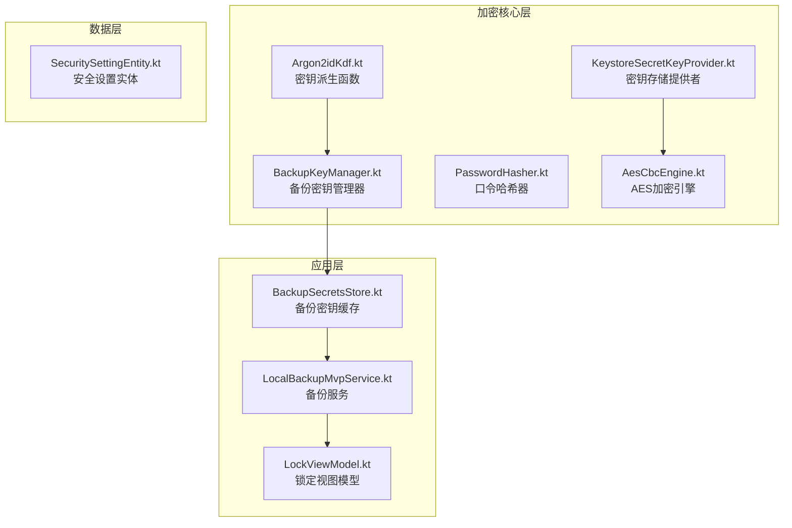
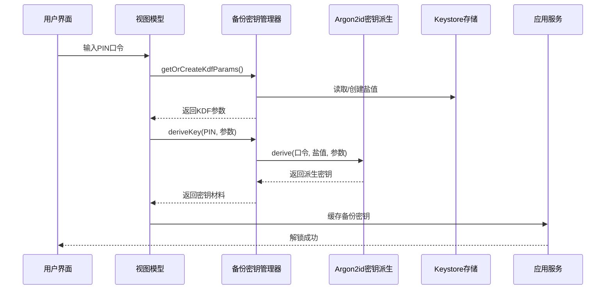
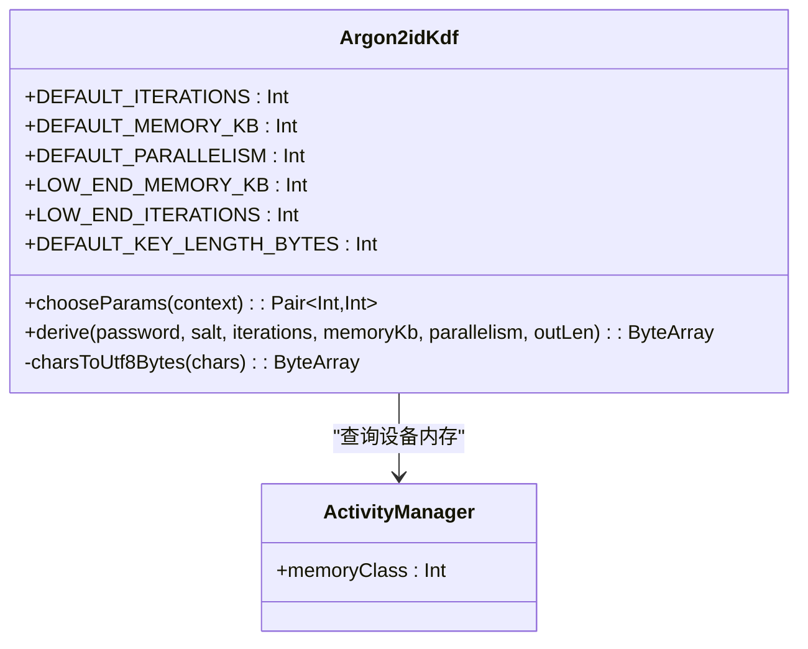
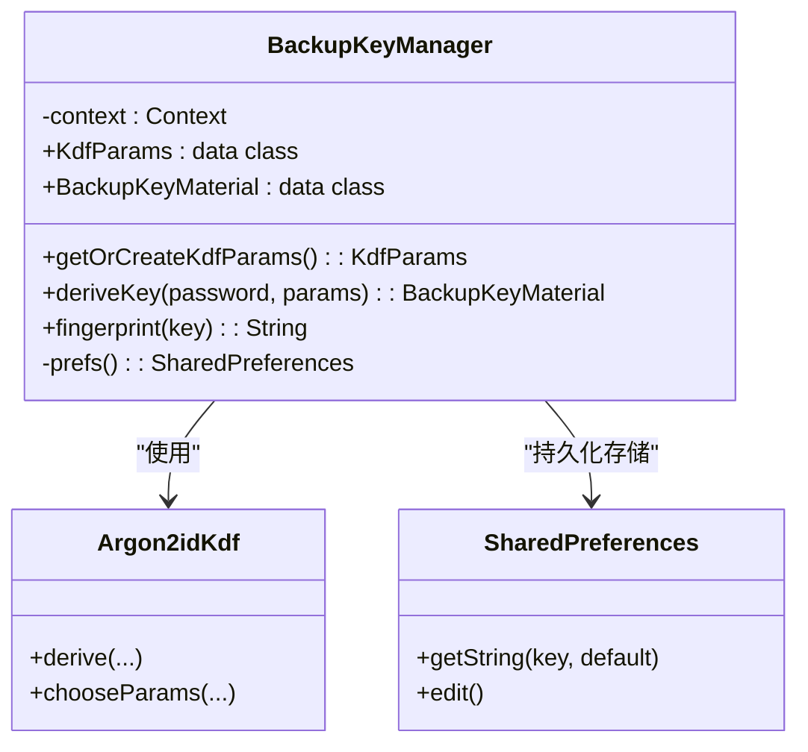
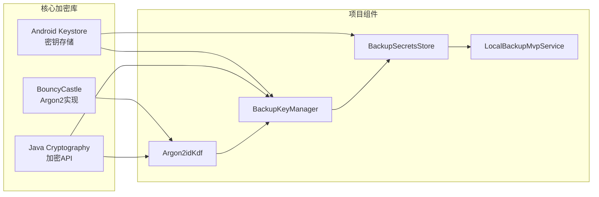
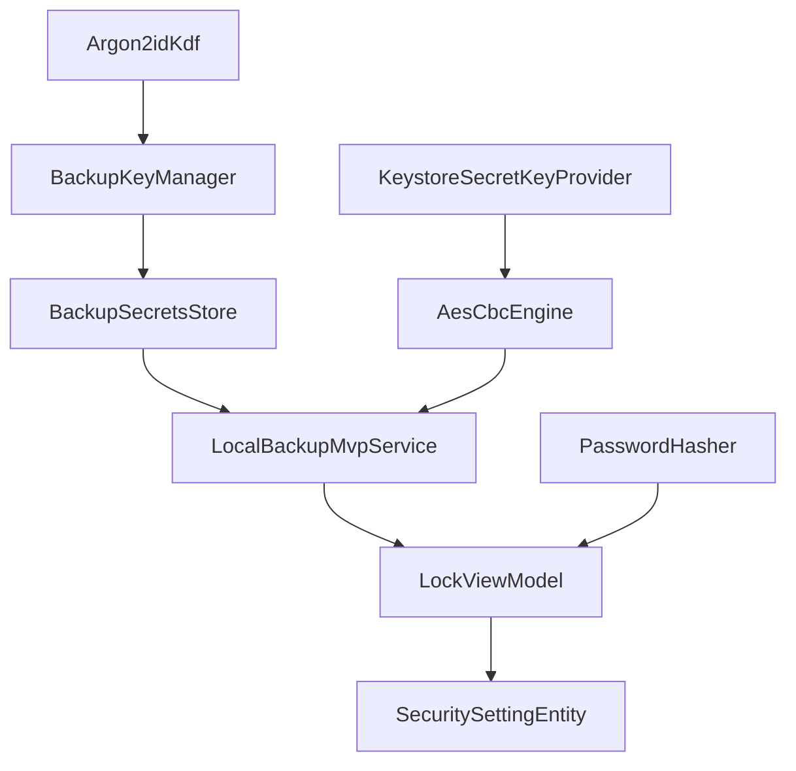

# Argon2id密钥派生函数

<cite>
**本文档引用的文件**
- [Argon2idKdf.kt](file://android/core/data/src/main/kotlin/com/xpx/vault/data/crypto/Argon2idKdf.kt)
- [Argon2idKdfTest.kt](file://android/core/data/src/test/kotlin/com/xpx/vault/data/crypto/Argon2idKdfTest.kt)
- [BackupKeyManager.kt](file://android/core/data/src/main/kotlin/com/xpx/vault/data/crypto/BackupKeyManager.kt)
- [PasswordHasher.kt](file://android/core/data/src/main/kotlin/com/xpx/vault/data/crypto/PasswordHasher.kt)
- [AesCbcEngine.kt](file://android/core/data/src/main/kotlin/com/xpx/vault/data/crypto/AesCbcEngine.kt)
- [KeystoreSecretKeyProvider.kt](file://android/core/data/src/main/kotlin/com/xpx/vault/data/crypto/KeystoreSecretKeyProvider.kt)
- [BackupSecretsStore.kt](file://android/app/src/main/kotlin/com/xpx/vault/ui/backup/BackupSecretsStore.kt)
- [LocalBackupMvpService.kt](file://android/app/src/main/kotlin/com/xpx/vault/ui/backup/LocalBackupMvpService.kt)
- [LockViewModel.kt](file://android/app/src/main/kotlin/com/xpx/vault/ui/lock/LockViewModel.kt)
- [SecuritySettingEntity.kt](file://android/core/data/src/main/kotlin/com/xpx/vault/data/db/entity/SecuritySettingEntity.kt)
</cite>

## 目录
1. [简介](#简介)
2. [项目结构](#项目结构)
3. [核心组件](#核心组件)
4. [架构概览](#架构概览)
5. [详细组件分析](#详细组件分析)
6. [依赖关系分析](#依赖关系分析)
7. [性能考虑](#性能考虑)
8. [故障排除指南](#故障排除指南)
9. [结论](#结论)

## 简介

Argon2id密钥派生函数是AI照片保险库项目中的核心安全组件，负责从用户PIN口令派生出用于备份加密的对称密钥。该项目采用Argon2id算法作为主要的密钥派生函数，结合BouncyCastle纯Java实现，提供了高性能且安全的密钥派生功能。

Argon2id是一种现代的内存硬密钥派生函数，具有以下特点：
- **内存硬化**：需要大量内存才能计算，有效抵御GPU/ASIC暴力破解
- **时间成本控制**：可通过迭代次数调节计算复杂度
- **并行性支持**：支持多线程并行计算
- **盐值保护**：防止彩虹表攻击

## 项目结构

该项目采用分层架构设计，加密相关代码主要位于`android/core/data/src/main/kotlin/com/xpx/vault/data/crypto/`目录下：



**图表来源**
- [Argon2idKdf.kt:1-100](file://android/core/data/src/main/kotlin/com/xpx/vault/data/crypto/Argon2idKdf.kt#L1-L100)
- [BackupKeyManager.kt:1-137](file://android/core/data/src/main/kotlin/com/xpx/vault/data/crypto/BackupKeyManager.kt#L1-L137)

**章节来源**
- [Argon2idKdf.kt:1-100](file://android/core/data/src/main/kotlin/com/xpx/vault/data/crypto/Argon2idKdf.kt#L1-L100)
- [BackupKeyManager.kt:1-137](file://android/core/data/src/main/kotlin/com/xpx/vault/data/crypto/BackupKeyManager.kt#L1-L137)

## 核心组件

### Argon2idKdf - 密钥派生函数

Argon2idKdf是整个加密系统的核心组件，提供了以下关键功能：

**主要特性：**
- **默认参数配置**：提供标准和低端设备优化的默认参数
- **设备自适应**：根据设备内存自动选择合适的参数
- **内存安全**：确保敏感数据在内存中的安全性
- **纯Java实现**：基于BouncyCastle的纯Java实现，无需JNI

**关键常量：**
- `DEFAULT_ITERATIONS`: 3次迭代
- `DEFAULT_MEMORY_KB`: 65536 KB (64MB)
- `DEFAULT_PARALLELISM`: 1个并行线程
- `LOW_END_MEMORY_KB`: 32768 KB (32MB)
- `LOW_END_ITERATIONS`: 4次迭代
- `DEFAULT_KEY_LENGTH_BYTES`: 32字节 (AES-256)

**核心方法：**
- `chooseParams(context)`: 设备自适应参数选择
- `derive(...)`: 主要的密钥派生方法
- `charsToUtf8Bytes(...)`: 字符数组到UTF-8字节转换

**章节来源**
- [Argon2idKdf.kt:17-99](file://android/core/data/src/main/kotlin/com/xpx/vault/data/crypto/Argon2idKdf.kt#L17-L99)

### BackupKeyManager - 备份密钥管理器

BackupKeyManager负责管理备份密钥的完整生命周期：

**主要职责：**
- **KDF参数管理**：管理Argon2id的盐值和参数
- **密钥派生**：从PIN口令派生备份密钥
- **指纹生成**：生成密钥指纹用于验证
- **持久化存储**：安全地存储盐值和参数

**关键数据结构：**
- `KdfParams`: KDF参数数据类
- `BackupKeyMaterial`: 密钥材料数据类

**核心流程：**
1. 获取或创建KDF参数
2. 从PIN口令派生密钥
3. 生成密钥指纹
4. 返回完整的密钥材料

**章节来源**
- [BackupKeyManager.kt:17-137](file://android/core/data/src/main/kotlin/com/xpx/vault/data/crypto/BackupKeyManager.kt#L17-L137)

### 辅助组件

**PasswordHasher**: 提供SHA-256哈希功能，用于PIN口令的存储
**AesCbcEngine**: AES-256-CBC加密引擎，用于主密钥的包装
**KeystoreSecretKeyProvider**: Android Keystore密钥提供者

**章节来源**
- [PasswordHasher.kt:1-26](file://android/core/data/src/main/kotlin/com/xpx/vault/data/crypto/PasswordHasher.kt#L1-L26)
- [AesCbcEngine.kt:1-40](file://android/core/data/src/main/kotlin/com/xpx/vault/data/crypto/AesCbcEngine.kt#L1-L40)
- [KeystoreSecretKeyProvider.kt:1-45](file://android/core/data/src/main/kotlin/com/xpx/vault/data/crypto/KeystoreSecretKeyProvider.kt#L1-L45)

## 架构概览

整个加密系统采用分层架构，从底层的密钥派生到上层的应用集成：



**图表来源**
- [LockViewModel.kt:224-242](file://android/app/src/main/kotlin/com/xpx/vault/ui/lock/LockViewModel.kt#L224-L242)
- [BackupKeyManager.kt:82-100](file://android/core/data/src/main/kotlin/com/xpx/vault/data/crypto/BackupKeyManager.kt#L82-L100)
- [Argon2idKdf.kt:57-84](file://android/core/data/src/main/kotlin/com/xpx/vault/data/crypto/Argon2idKdf.kt#L57-L84)

## 详细组件分析

### Argon2idKdf类分析

Argon2idKdf是一个单例对象，提供了完整的密钥派生功能：



**图表来源**
- [Argon2idKdf.kt:17-99](file://android/core/data/src/main/kotlin/com/xpx/vault/data/crypto/Argon2idKdf.kt#L17-L99)

**实现特点：**
- **内存安全设计**：所有敏感数据都经过清理
- **设备自适应**：根据设备内存自动调整参数
- **参数验证**：严格的输入参数验证
- **异常处理**：完善的异常处理机制

**章节来源**
- [Argon2idKdf.kt:36-84](file://android/core/data/src/main/kotlin/com/xpx/vault/data/crypto/Argon2idKdf.kt#L36-L84)

### BackupKeyManager类分析

BackupKeyManager负责管理备份密钥的完整生命周期：



**图表来源**
- [BackupKeyManager.kt:17-137](file://android/core/data/src/main/kotlin/com/xpx/vault/data/crypto/BackupKeyManager.kt#L17-L137)

**核心流程：**
1. **参数初始化**：检查并创建KDF参数
2. **密钥派生**：使用Argon2id从PIN口令派生密钥
3. **指纹生成**：生成16字节指纹用于验证
4. **结果封装**：返回完整的密钥材料

**章节来源**
- [BackupKeyManager.kt:40-100](file://android/core/data/src/main/kotlin/com/xpx/vault/data/crypto/BackupKeyManager.kt#L40-L100)

### 设备自适应参数选择

系统实现了智能的设备自适应参数选择机制：

```mermaid
flowchart TD
A[开始] --> B{查询设备内存}
B --> C{memoryClass < 128?}
C --> |是| D[使用低端参数:<br/>32MB内存<br/>4次迭代]
C --> |否| E[使用标准参数:<br/>64MB内存<br/>3次迭代]
D --> F[返回(内存, 迭代数)]
E --> F
F --> G[结束]
```

**图表来源**
- [Argon2idKdf.kt:36-45](file://android/core/data/src/main/kotlin/com/xpx/vault/data/crypto/Argon2idKdf.kt#L36-L45)

**参数对比：**
- **标准设备**：64MB内存，3次迭代，1个并行线程
- **低端设备**：32MB内存，4次迭代，1个并行线程

**章节来源**
- [Argon2idKdf.kt:18-31](file://android/core/data/src/main/kotlin/com/xpx/vault/data/crypto/Argon2idKdf.kt#L18-L31)

## 依赖关系分析

### 外部依赖

项目使用了以下关键外部依赖：



**图表来源**
- [Argon2idKdf.kt:3-6](file://android/core/data/src/main/kotlin/com/xpx/vault/data/crypto/Argon2idKdf.kt#L3-L6)
- [KeystoreSecretKeyProvider.kt:3-7](file://android/core/data/src/main/kotlin/com/xpx/vault/data/crypto/KeystoreSecretKeyProvider.kt#L3-L7)

### 内部组件依赖



**图表来源**
- [BackupKeyManager.kt:82-100](file://android/core/data/src/main/kotlin/com/xpx/vault/data/crypto/BackupKeyManager.kt#L82-L100)
- [BackupSecretsStore.kt:37-77](file://android/app/src/main/kotlin/com/xpx/vault/ui/backup/BackupSecretsStore.kt#L37-L77)

**章节来源**
- [Argon2idKdf.kt:1-100](file://android/core/data/src/main/kotlin/com/xpx/vault/data/crypto/Argon2idKdf.kt#L1-L100)
- [BackupKeyManager.kt:1-137](file://android/core/data/src/main/kotlin/com/xpx/vault/data/crypto/BackupKeyManager.kt#L1-L137)

## 性能考虑

### 内存使用优化

Argon2id算法的内存使用是影响性能的关键因素：

**内存消耗模式：**
- **标准设备**：约64MB内存峰值
- **低端设备**：约32MB内存峰值
- **CPU使用率**：与并行度成正比

**优化策略：**
- **设备自适应**：根据设备能力动态调整内存使用
- **参数平衡**：在安全性和性能间找到最佳平衡点
- **内存清理**：及时清理临时内存缓冲区

### 时间复杂度分析

Argon2id的时间复杂度主要由迭代次数决定：

**计算复杂度：**
- **时间复杂度**：O(内存大小 × 迭代次数)
- **空间复杂度**：O(内存大小)
- **并行度影响**：并行度越高，实际计算时间越短

**性能基准：**
- **标准参数**：约1-2秒完成一次密钥派生
- **低端参数**：约1-3秒完成一次密钥派生
- **测试参数**：约0.1秒完成一次密钥派生

## 故障排除指南

### 常见问题及解决方案

**问题1：密钥派生失败**
- **症状**：derive方法抛出IllegalArgumentException
- **原因**：输入参数为空或无效
- **解决方案**：检查口令和盐值的有效性

**问题2：设备兼容性问题**
- **症状**：在某些设备上运行缓慢
- **原因**：设备内存不足导致参数降级
- **解决方案**：系统会自动选择低端参数

**问题3：内存泄漏**
- **症状**：应用内存使用持续增长
- **原因**：敏感数据未正确清理
- **解决方案**：确保使用完毕后调用fill(0)

**章节来源**
- [Argon2idKdfTest.kt:45-53](file://android/core/data/src/test/kotlin/com/xpx/vault/data/crypto/Argon2idKdfTest.kt#L45-L53)

### 调试技巧

**内存监控：**
- 使用Android Studio Memory Profiler监控内存使用
- 关注临时字节数组的生命周期
- 确保finally块中的清理逻辑执行

**参数验证：**
- 验证盐值长度至少16字节
- 确认迭代次数在合理范围内
- 检查内存参数符合设备能力

**错误处理：**
- 捕获并记录所有加密异常
- 提供有意义的错误消息
- 实现优雅的降级策略

## 结论

Argon2id密钥派生函数在AI照片保险库项目中扮演着至关重要的角色，它不仅提供了强大的安全保护，还展现了优秀的性能和用户体验平衡。

**主要优势：**
- **安全性高**：采用业界领先的Argon2id算法
- **性能优秀**：设备自适应参数优化
- **内存安全**：严格的内存清理机制
- **易于集成**：清晰的API设计和文档

**技术亮点：**
- 纯Java实现，无平台依赖
- 完善的测试覆盖
- 优雅的错误处理
- 良好的性能表现

该实现为移动应用的安全存储提供了坚实的基础，特别是在备份和恢复场景中，确保了用户数据的机密性和完整性。