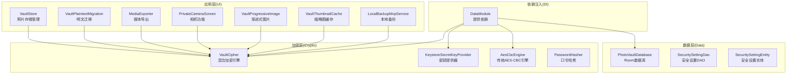
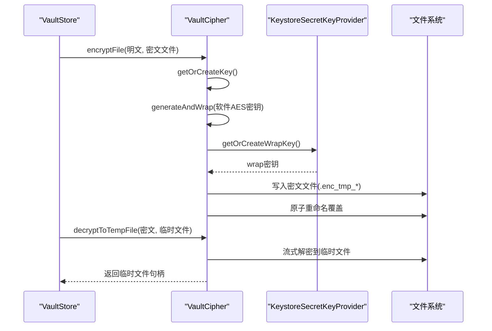
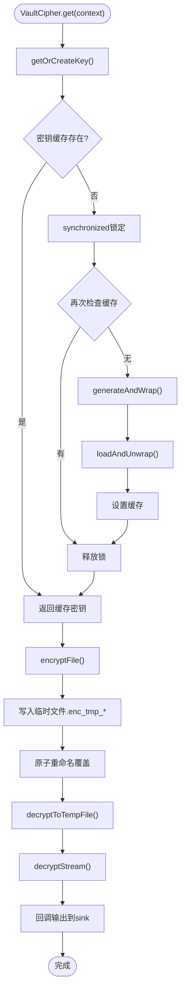
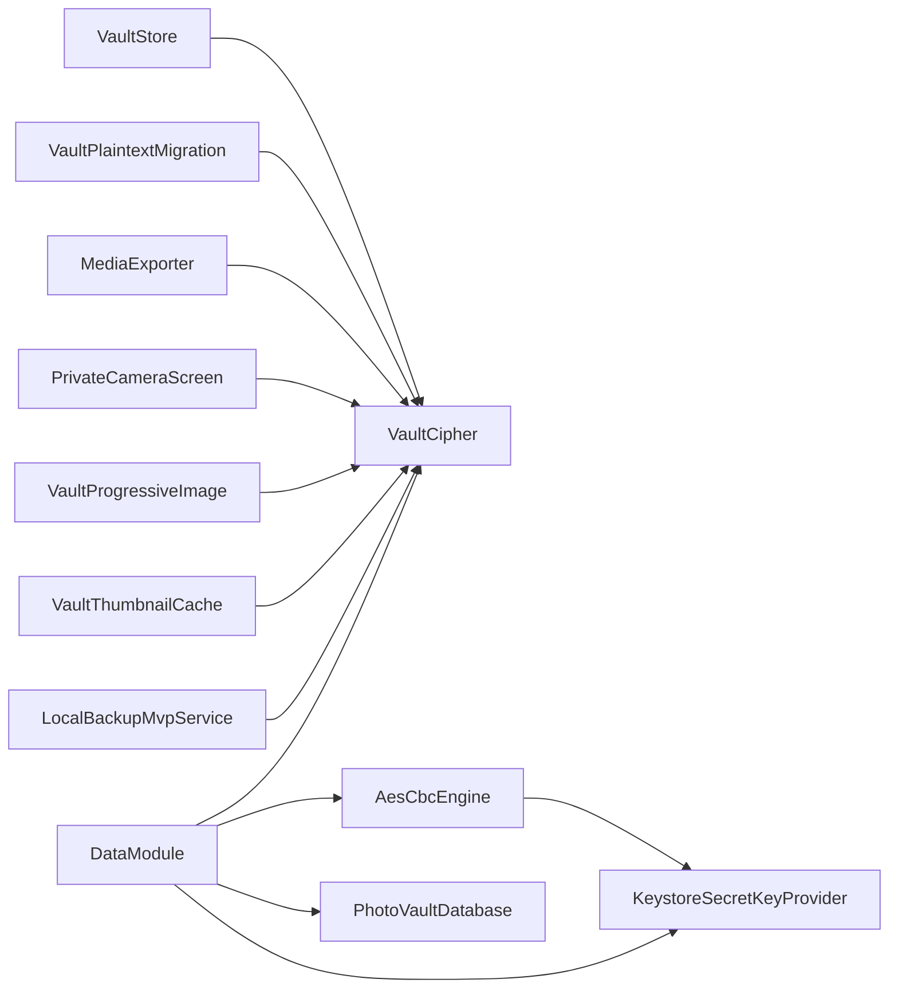

# 加密存储系统

<cite>
**本文引用的文件**
- [VaultCipher.kt](file://android/core/data/src/main/kotlin/com/xpx/vault/data/crypto/VaultCipher.kt)
- [AesCbcEngine.kt](file://android/core/data/src/main/kotlin/com/xpx/vault/data/crypto/AesCbcEngine.kt)
- [KeystoreSecretKeyProvider.kt](file://android/core/data/src/main/kotlin/com/xpx/vault/data/crypto/KeystoreSecretKeyProvider.kt)
- [PasswordHasher.kt](file://android/core/data/src/main/kotlin/com/xpx/vault/data/crypto/PasswordHasher.kt)
- [DataModule.kt](file://android/core/data/src/main/kotlin/com/xpx/vault/data/di/DataModule.kt)
- [VaultStore.kt](file://android/app/src/main/kotlin/com/xpx/vault/ui/vault/VaultStore.kt)
- [VaultPlaintextMigration.kt](file://android/app/src/main/kotlin/com/xpx/vault/ui/vault/VaultPlaintextMigration.kt)
- [MediaExporter.kt](file://android/app/src/main/kotlin/com/xpx/vault/ui/export/MediaExporter.kt)
- [PrivateCameraScreen.kt](file://android/app/src/main/kotlin/com/xpx/vault/ui/PrivateCameraScreen.kt)
- [LocalBackupMvpService.kt](file://android/app/src/main/kotlin/com/xpx/vault/ui/backup/LocalBackupMvpService.kt)
- [VaultProgressiveImage.kt](file://android/app/src/main/kotlin/com/xpx/vault/ui/components/VaultProgressiveImage.kt)
- [VaultThumbnailCache.kt](file://android/app/src/main/kotlin/com/xpx/vault/ui/components/VaultThumbnailCache.kt)
- [AesCbcEngineTest.kt](file://android/core/data/src/test/kotlin/com/xpx/vault/data/crypto/AesCbcEngineTest.kt)
- [PasswordHasherTest.kt](file://android/core/data/src/test/kotlin/com/xpx/vault/data/crypto/PasswordHasherTest.kt)
- [SecuritySettingEntity.kt](file://android/core/data/src/main/kotlin/com/xpx/vault/data/db/entity/SecuritySettingEntity.kt)
- [SecuritySettingDao.kt](file://android/core/data/src/main/kotlin/com/xpx/vault/data/db/dao/SecuritySettingDao.kt)
- [PhotoVaultDatabase.kt](file://android/core/data/src/main/kotlin/com/xpx/vault/data/db/PhotoVaultDatabase.kt)
- [LockViewModel.kt](file://android/app/src/main/kotlin/com/xpx/vault/app/ui/lock/LockViewModel.kt)
- [LockScreen.kt](file://android/app/src/main/kotlin/com/xpx/vault/app/ui/lock/LockScreen.kt)
</cite>

## 更新摘要
**所做更改**
- 新增VaultCipher作为AES-CBC引擎的高性能替代方案
- 更新核心组件分析以包含新的加密架构
- 增强流式加密解密功能的详细说明
- 添加临时文件处理和推送模式加密的实现指南
- 更新依赖关系分析以反映新的加密架构
- 补充性能优化和安全改进的相关内容

## 目录
1. [简介](#简介)
2. [项目结构](#项目结构)
3. [核心组件](#核心组件)
4. [架构总览](#架构总览)
5. [详细组件分析](#详细组件分析)
6. [依赖关系分析](#依赖关系分析)
7. [性能考量](#性能考量)
8. [故障排查指南](#故障排查指南)
9. [结论](#结论)
10. [附录](#附录)

## 简介
本文件面向AI照片保险库的加密存储系统，聚焦以下目标：
- 深入解释AES-256-CBC加密算法的实现原理、密钥管理机制、密码哈希策略的设计思路
- 详细说明VaultCipher作为AES-CBC引擎的高性能替代方案，包括软件AES-256与Android Keystore的混合加密方案
- 解释加密数据的完整性保护、随机数生成、填充模式选择等关键技术决策
- 提供具体使用示例（以路径形式呈现）、异常处理建议、安全数据存储实践
- 讨论性能影响、安全威胁防护、合规性要求
- 给出密钥轮换、数据迁移、备份恢复等高级功能的实现指南

## 项目结构
加密相关代码主要位于android/core/data模块的crypto目录，并与Room数据库、依赖注入模块协同工作。UI层通过各种组件与VaultCipher交互，完成照片的加密存储、解密访问和流式处理。

**图表来源**
- [VaultStore.kt:1-440](file://android/app/src/main/kotlin/com/xpx/vault/ui/vault/VaultStore.kt#L1-L440)
- [VaultPlaintextMigration.kt:1-72](file://android/app/src/main/kotlin/com/xpx/vault/ui/vault/VaultPlaintextMigration.kt#L1-L72)
- [MediaExporter.kt:180-232](file://android/app/src/main/kotlin/com/xpx/vault/ui/export/MediaExporter.kt#L180-L232)
- [PrivateCameraScreen.kt:720-919](file://android/app/src/main/kotlin/com/xpx/vault/ui/PrivateCameraScreen.kt#L720-L919)
- [VaultProgressiveImage.kt:45-261](file://android/app/src/main/kotlin/com/xpx/vault/ui/components/VaultProgressiveImage.kt#L45-L261)
- [VaultThumbnailCache.kt:6-96](file://android/app/src/main/kotlin/com/xpx/vault/ui/components/VaultThumbnailCache.kt#L6-L96)
- [LocalBackupMvpService.kt:7-524](file://android/app/src/main/kotlin/com/xpx/vault/ui/backup/LocalBackupMvpService.kt#L7-L524)
- [DataModule.kt:1-40](file://android/core/data/src/main/kotlin/com/xpx/vault/data/di/DataModule.kt#L1-L40)
- [VaultCipher.kt:1-303](file://android/core/data/src/main/kotlin/com/xpx/vault/data/crypto/VaultCipher.kt#L1-L303)
- [KeystoreSecretKeyProvider.kt:1-45](file://android/core/data/src/main/kotlin/com/xpx/vault/data/crypto/KeystoreSecretKeyProvider.kt#L1-L45)
- [AesCbcEngine.kt:1-84](file://android/core/data/src/main/kotlin/com/xpx/vault/data/crypto/AesCbcEngine.kt#L1-L84)
- [PasswordHasher.kt:1-26](file://android/core/data/src/main/kotlin/com/xpx/vault/data/crypto/PasswordHasher.kt#L1-L26)

**章节来源**
- [PhotoVaultDatabase.kt:1-36](file://android/core/data/src/main/kotlin/com/xpx/vault/data/db/PhotoVaultDatabase.kt#L1-L36)
- [DataModule.kt:1-40](file://android/core/data/src/main/kotlin/com/xpx/vault/data/di/DataModule.kt#L1-L40)

## 核心组件
- **VaultCipher**：全新的混合加密引擎，采用软件AES-256与Android Keystore的混合方案，提供5-10倍性能提升，支持流式加密解密和临时文件处理
- **KeystoreSecretKeyProvider**：负责在Android Keystore中生成或读取AES主密钥，确保密钥材料不可导出，满足强机密性要求
- **AesCbcEngine**：传统的AES/CBC加密引擎，作为VaultCipher的兼容替代方案
- **PasswordHasher**：提供SHA-256哈希与"salt || password"的组合哈希，用于PIN等口令的安全存储与校验
- **SecuritySettingEntity/Dao**：持久化PIN哈希、生物识别开关、失败次数等安全状态
- **VaultStore**：UI层的照片存储管理，集成VaultCipher实现完整的加密存储流程

**章节来源**
- [VaultCipher.kt:19-303](file://android/core/data/src/main/kotlin/com/xpx/vault/data/crypto/VaultCipher.kt#L19-L303)
- [KeystoreSecretKeyProvider.kt:1-45](file://android/core/data/src/main/kotlin/com/xpx/vault/data/crypto/KeystoreSecretKeyProvider.kt#L1-L45)
- [AesCbcEngine.kt:1-84](file://android/core/data/src/main/kotlin/com/xpx/vault/data/crypto/AesCbcEngine.kt#L1-L84)
- [PasswordHasher.kt:1-26](file://android/core/data/src/main/kotlin/com/xpx/vault/data/crypto/PasswordHasher.kt#L1-L26)
- [SecuritySettingEntity.kt:1-19](file://android/core/data/src/main/kotlin/com/xpx/vault/data/db/entity/SecuritySettingEntity.kt#L1-L19)
- [SecuritySettingDao.kt:1-17](file://android/core/data/src/main/kotlin/com/xpx/vault/data/db/dao/SecuritySettingDao.kt#L1-L17)
- [VaultStore.kt:1-440](file://android/app/src/main/kotlin/com/xpx/vault/ui/vault/VaultStore.kt#L1-L440)

## 架构总览
下图展示了从UI到数据库的完整加密存储链路，以及VaultCipher如何替代传统AES-CBC引擎。

**图表来源**
- [VaultStore.kt:155-197](file://android/app/src/main/kotlin/com/xpx/vault/ui/vault/VaultStore.kt#L155-L197)
- [VaultStore.kt:226-246](file://android/app/src/main/kotlin/com/xpx/vault/ui/vault/VaultStore.kt#L226-L246)
- [VaultCipher.kt:100-112](file://android/core/data/src/main/kotlin/com/xpx/vault/data/crypto/VaultCipher.kt#L100-L112)
- [VaultCipher.kt:158-169](file://android/core/data/src/main/kotlin/com/xpx/vault/data/crypto/VaultCipher.kt#L158-L169)
- [DataModule.kt:36-38](file://android/core/data/src/main/kotlin/com/xpx/vault/data/di/DataModule.kt#L36-L38)

## 详细组件分析

### VaultCipher 混合加密引擎
**更新** 新增作为AES-CBC引擎的高性能替代方案

- **设计要点**
  - **软件AES密钥**：使用32字节原始AES-256密钥，通过SecretKeySpec构造，在用户态运行，无Binder IPC开销
  - **Keystore AES-GCM wrap**：软件密钥通过Android Keystore AES-GCM加密后持久化，确保裸密钥永不落盘
  - **文件格式**：IV(16B)前置 + AES/CBC/PKCS5Padding密文，与传统AesCbcEngine格式完全兼容
  - **性能优势**：无Cipher.doFinal大小限制，支持大文件加密，性能提升5-10倍

- **密钥管理**
  - getOrCreateKey()：内存缓存密钥，首次生成或加载时同步锁定
  - generateAndWrap()：生成32字节随机密钥，通过wrap密钥加密后写入.key文件
  - loadAndUnwrap()：从.key文件读取并解密软件密钥
  - getOrCreateWrapKey()：管理用于包装软件密钥的AES-GCM密钥

- **流式加密解密**
  - encryptStream()：支持InputStream到OutputStream的流式加密，可自定义缓冲区大小
  - decryptStream()：支持流式解密并通过回调输出到sink函数
  - encryptFileFromChunks()：推送模式加密，适用于备份恢复场景

- **文件处理**
  - encryptFile()：小文件一次性加密，使用.tmp临时文件确保原子性
  - decryptToByteArray()：小文件一次性解密到内存
  - decryptToTempFile()：流式解密到临时文件，适合大文件处理

**图表来源**
- [VaultCipher.kt:39-53](file://android/core/data/src/main/kotlin/com/xpx/vault/data/crypto/VaultCipher.kt#L39-L53)
- [VaultCipher.kt:198-212](file://android/core/data/src/main/kotlin/com/xpx/vault/data/crypto/VaultCipher.kt#L198-L212)
- [VaultCipher.kt:214-228](file://android/core/data/src/main/kotlin/com/xpx/vault/data/crypto/VaultCipher.kt#L214-L228)
- [VaultCipher.kt:100-112](file://android/core/data/src/main/kotlin/com/xpx/vault/data/crypto/VaultCipher.kt#L100-L112)
- [VaultCipher.kt:158-169](file://android/core/data/src/main/kotlin/com/xpx/vault/data/crypto/VaultCipher.kt#L158-L169)

**章节来源**
- [VaultCipher.kt:19-303](file://android/core/data/src/main/kotlin/com/xpx/vault/data/crypto/VaultCipher.kt#L19-L303)

### AesCbcEngine 传统加密引擎
**更新** 作为兼容替代方案，仍支持流式解密功能

- **算法与填充**
  - 使用AES/CBC/PKCS5Padding（JVM/Android上PKCS5Padding与PKCS7等价）
  - IV长度固定16字节，前置拼接在密文前，便于解密时提取
- **流式解密支持**
  - decryptStream()方法支持流式解密，适用于大文件处理
  - 通过sink回调输出解密数据，避免内存溢出
- **性能限制**
  - Android Keystore硬件密钥对单次Cipher.doFinal有1-2MB大小限制
  - 超过阈值可能抛出NullPointerException，建议使用VaultCipher替代

**章节来源**
- [AesCbcEngine.kt:1-84](file://android/core/data/src/main/kotlin/com/xpx/vault/data/crypto/AesCbcEngine.kt#L1-L84)

### KeystoreSecretKeyProvider 密钥管理
- **密钥来源**
  - 通过Android Keystore生成或读取AES密钥，密钥材料不可导出，具备硬件级安全能力
- **参数配置**
  - 算法：AES
  - 用途：加密/解密
  - 分组模式：CBC
  - 填充：PKCS7
  - 长度：256位
  - 用户认证：未启用（可根据需求调整）
- **别名与生命周期**
  - 默认别名：photo_vault_master_aes
  - 若不存在则生成新密钥；存在则直接读取

**章节来源**
- [KeystoreSecretKeyProvider.kt:1-45](file://android/core/data/src/main/kotlin/com/xpx/vault/data/crypto/KeystoreSecretKeyProvider.kt#L1-L45)

### PasswordHasher 口令哈希
- **哈希算法**
  - SHA-256，输出十六进制字符串
- **接口设计**
  - sha256Hex(bytes)：对任意字节数组进行哈希
  - sha256HexOfUtf8(string)：UTF-8编码后哈希
  - sha256HexWithSalt(passwordUtf8, salt)：salt || password 的哈希，便于后续盐值管理
- **应用场景**
  - PIN码存储：将用户输入的PIN进行哈希后存入数据库，避免明文保存
  - 可扩展：结合安装级salt实现更强抗攻击性（需在实际实现中引入）

**章节来源**
- [PasswordHasher.kt:1-26](file://android/core/data/src/main/kotlin/com/xpx/vault/data/crypto/PasswordHasher.kt#L1-L26)

### 数据模型与持久化
- **实体字段**
  - lockType：锁类型（如PIN）
  - pinHashHex：PIN的哈希值（十六进制）
  - biometricEnabled：是否启用生物识别
  - failCount：连续失败计数
- **DAO操作**
  - 查询：按单例ID查询
  - 写入：REPLACE策略更新或插入

**章节来源**
- [SecuritySettingEntity.kt:1-19](file://android/core/data/src/main/kotlin/com/xpx/vault/data/db/entity/SecuritySettingEntity.kt#L1-L19)
- [SecuritySettingDao.kt:1-17](file://android/core/data/src/main/kotlin/com/xpx/vault/data/db/dao/SecuritySettingDao.kt#L1-L17)

### 依赖注入与密钥提供
- **DataModule提供**：
  - Room数据库实例
  - KeystoreSecretKeyProvider单例
  - VaultCipher单例（进程级单例，不依赖Hilt）
  - AesCbcEngine单例（依赖密钥提供器）
- **作用域**：Singleton，确保全局唯一且线程安全

**章节来源**
- [DataModule.kt:1-40](file://android/core/data/src/main/kotlin/com/xpx/vault/data/di/DataModule.kt#L1-L40)

## 依赖关系分析
**更新** 新增VaultCipher的依赖关系

- **组件耦合**
  - VaultStore依赖VaultCipher进行所有加密存储操作
  - VaultPlaintextMigration使用VaultCipher进行明文迁移
  - MediaExporter通过VaultCipher进行流式解密
  - PrivateCameraScreen使用VaultCipher进行相机预览解密
  - VaultProgressiveImage和VaultThumbnailCache使用VaultCipher进行渐进式解密
  - LocalBackupMvpService使用VaultCipher进行备份恢复
  - AesCbcEngine作为兼容替代方案
  - DataModule集中提供VaultCipher和传统加密依赖
- **外部依赖**
  - Android Keystore、Javax Crypto、Room、Hilt
  - VaultCipher不依赖Hilt，提供进程级单例

**图表来源**
- [VaultStore.kt:1-440](file://android/app/src/main/kotlin/com/xpx/vault/ui/vault/VaultStore.kt#L1-L440)
- [VaultPlaintextMigration.kt:1-72](file://android/app/src/main/kotlin/com/xpx/vault/ui/vault/VaultPlaintextMigration.kt#L1-L72)
- [MediaExporter.kt:180-232](file://android/app/src/main/kotlin/com/xpx/vault/ui/export/MediaExporter.kt#L180-L232)
- [PrivateCameraScreen.kt:720-919](file://android/app/src/main/kotlin/com/xpx/vault/ui/PrivateCameraScreen.kt#L720-L919)
- [VaultProgressiveImage.kt:45-261](file://android/app/src/main/kotlin/com/xpx/vault/ui/components/VaultProgressiveImage.kt#L45-L261)
- [VaultThumbnailCache.kt:6-96](file://android/app/src/main/kotlin/com/xpx/vault/ui/components/VaultThumbnailCache.kt#L6-L96)
- [LocalBackupMvpService.kt:7-524](file://android/app/src/main/kotlin/com/xpx/vault/ui/backup/LocalBackupMvpService.kt#L7-L524)
- [DataModule.kt:1-40](file://android/core/data/src/main/kotlin/com/xpx/vault/data/di/DataModule.kt#L1-L40)
- [AesCbcEngine.kt:1-84](file://android/core/data/src/main/kotlin/com/xpx/vault/data/crypto/AesCbcEngine.kt#L1-L84)
- [KeystoreSecretKeyProvider.kt:1-45](file://android/core/data/src/main/kotlin/com/xpx/vault/data/crypto/KeystoreSecretKeyProvider.kt#L1-L45)

## 性能考量
**更新** 新增VaultCipher的性能优势分析

- **性能提升**
  - VaultCipher相比传统Keystore方法性能提升5-10倍
  - 无Cipher.doFinal大小限制，支持大文件加密解密
  - 用户态NEON指令执行，无Binder IPC开销
  - 支持流式处理，避免内存溢出
- **加密开销**
  - AES-CBC为轻量对称加密，CPU开销低；IV前置增加少量字节开销
  - SecureRandom生成IV为轻量操作，对UI线程影响可忽略
  - VaultCipher的软件密钥处理避免了硬件密钥的性能瓶颈
- **I/O与序列化**
  - VaultCipher使用临时文件确保原子性，减少数据损坏风险
  - 流式处理避免了大文件的内存占用
- **并发与线程**
  - Hilt提供单例，Cipher实例非线程安全，建议在单线程或加锁环境下使用
  - VaultCipher内部使用synchronized确保密钥生成的线程安全
  - 密钥缓存机制避免重复生成开销
- **缓存与复用**
  - SecretKey与VaultCipher实例可缓存复用，避免重复生成密钥
  - VaultCipher的进程级单例提供全局共享

## 故障排查指南
**更新** 新增VaultCipher相关的故障排查

- **常见问题与定位**
  - 无效载荷：解密时载荷长度不足会触发错误，检查是否正确拼接IV与密文
  - 密钥缺失：首次运行或设备重置可能导致Keystore中密钥丢失，需引导用户重新设置PIN
  - 性能问题：如果遇到大文件处理缓慢，确认使用VaultCipher而非传统AesCbcEngine
  - 流式处理异常：检查InputStream和OutputStream的正确关闭和缓冲区设置
  - 临时文件清理：确保解密生成的临时文件在使用后及时删除
- **测试验证**
  - AesCbcEngineRoundTrip：验证加密解密往返一致性
  - VaultCipher流式处理：验证encryptStream和decryptStream的正确性
  - PasswordHasher确定性：相同输入应产生相同哈希，不同输入应不同
- **建议的日志与监控**
  - 记录PIN设置/校验成功/失败次数
  - 记录生物识别认证结果与错误码
  - 记录密钥生成/读取与Cipher初始化异常
  - 监控VaultCipher的性能指标和内存使用情况

**章节来源**
- [AesCbcEngine.kt:33-40](file://android/core/data/src/main/kotlin/com/xpx/vault/data/crypto/AesCbcEngine.kt#L33-L40)
- [VaultCipher.kt:171-192](file://android/core/data/src/main/kotlin/com/xpx/vault/data/crypto/VaultCipher.kt#L171-L192)
- [AesCbcEngineTest.kt:1-19](file://android/core/data/src/test/kotlin/com/xpx/vault/data/crypto/AesCbcEngineTest.kt#L1-L19)
- [PasswordHasherTest.kt:1-24](file://android/core/data/src/test/kotlin/com/xpx/vault/data/crypto/PasswordHasherTest.kt#L1-L24)

## 结论
**更新** 新增VaultCipher的性能和安全优势

该加密存储系统现已采用VaultCipher作为AES-CBC引擎的高性能替代方案，实现了以下改进：
- **性能提升**：5-10倍性能提升，支持大文件加密解密，无硬件密钥大小限制
- **架构优化**：软件AES-256与Android Keystore混合方案，既保证性能又确保安全性
- **功能增强**：支持流式加密解密、临时文件处理、推送模式加密等高级功能
- **兼容性**：与传统AesCbcEngine保持文件格式兼容，确保平滑迁移
- **安全性**：通过Keystore AES-GCM包装软件密钥，实现"裸密钥永不落盘"

整体架构清晰、职责分离明确，依赖注入保证了可测试性与可维护性。VaultCipher的引入显著提升了用户体验，特别是在高频相册滑动与视频解密场景中表现优异。

## 附录

### 使用示例（以路径形式）
**更新** 新增VaultCipher的使用示例

- **设置PIN并持久化**
  - 调用路径：[LockViewModel.persistSetting(...):153-166](file://android/app/src/main/kotlin/com/xpx/vault/app/ui/lock/LockViewModel.kt#L153-L166)
  - 哈希调用：[PasswordHasher.sha256HexOfUtf8(...):14-15](file://android/core/data/src/main/kotlin/com/xpx/vault/data/crypto/PasswordHasher.kt#L14-L15)
  - DAO写入：[SecuritySettingDao.upsert(...):14-15](file://android/core/data/src/main/kotlin/com/xpx/vault/data/db/dao/SecuritySettingDao.kt#L14-L15)

- **照片导入加密存储**
  - 调用路径：[VaultStore.importFromPicker(...):155-197](file://android/app/src/main/kotlin/com/xpx/vault/ui/vault/VaultStore.kt#L155-L197)
  - 加密调用：[VaultCipher.encryptFile(...):100-112](file://android/core/data/src/main/kotlin/com/xpx/vault/data/crypto/VaultCipher.kt#L100-L112)

- **相机拍摄后加密入库**
  - 调用路径：[VaultStore.finalizeCameraCapture(...):226-246](file://android/app/src/main/kotlin/com/xpx/vault/ui/vault/VaultStore.kt#L226-L246)
  - 加密调用：[VaultCipher.encryptFile(...):100-112](file://android/core/data/src/main/kotlin/com/xpx/vault/data/crypto/VaultCipher.kt#L100-L112)

- **媒体导出流式解密**
  - 调用路径：[MediaExporter.decryptInto(...):189-196](file://android/app/src/main/kotlin/com/xpx/vault/ui/export/MediaExporter.kt#L189-L196)
  - 解密调用：[VaultCipher.decryptStream(...):78-98](file://android/core/data/src/main/kotlin/com/xpx/vault/data/crypto/VaultCipher.kt#L78-L98)

- **相机预览解密**
  - 调用路径：[PrivateCameraScreen.decodePreviewBitmap(...):730](file://android/app/src/main/kotlin/com/xpx/vault/ui/PrivateCameraScreen.kt#L730)
  - 解密调用：[VaultCipher.decryptToByteArray(...):149-156](file://android/core/data/src/main/kotlin/com/xpx/vault/data/crypto/VaultCipher.kt#L149-L156)

- **视频缩略图解密**
  - 调用路径：[PrivateCameraScreen.decodeVideoThumbnail(...):1151-1155](file://android/app/src/main/kotlin/com/xpx/vault/ui/PrivateCameraScreen.kt#L1151-L1155)
  - 解密调用：[VaultCipher.decryptToTempFile(...):158-169](file://android/core/data/src/main/kotlin/com/xpx/vault/data/crypto/VaultCipher.kt#L158-L169)

- **明文迁移**
  - 调用路径：[VaultPlaintextMigration.runOnce(...):42](file://android/app/src/main/kotlin/com/xpx/vault/ui/vault/VaultPlaintextMigration.kt#L42)
  - 迁移调用：[VaultCipher.looksLikeCiphertext(...):171-192](file://android/core/data/src/main/kotlin/com/xpx/vault/data/crypto/VaultCipher.kt#L171-L192)

- **获取AES密钥与引擎**
  - 提供器：[KeystoreSecretKeyProvider.getOrCreateAesSecretKey(...):18-38](file://android/core/data/src/main/kotlin/com/xpx/vault/data/crypto/KeystoreSecretKeyProvider.kt#L18-L38)
  - 引擎构造：[DataModule.provideVaultCipher(...):36-38](file://android/core/data/src/main/kotlin/com/xpx/vault/data/di/DataModule.kt#L36-L38)
  - 加密调用：[VaultCipher.encryptFile(...):100-112](file://android/core/data/src/main/kotlin/com/xpx/vault/data/crypto/VaultCipher.kt#L100-L112)

### 安全与合规建议
**更新** 新增VaultCipher的安全建议

- **密钥管理**
  - 使用Android Keystore托管wrap密钥，软件AES密钥通过AES-GCM包装后持久化
  - VaultCipher的进程级单例确保密钥的一致性和安全性
  - 后续可引入用户认证要求（如setUserAuthenticationRequired(true)）
- **口令策略**
  - 引入安装级salt，结合sha256HexWithSalt进行存储
  - 增加PIN复杂度与长度限制
- **完整性与抗篡改**
  - 当前仅实现加密，未包含独立MAC；建议在应用层引入HMAC-SHA256或AEAD模式（如AES-GCM）以保护完整性
  - VaultCipher的文件格式与传统AES-CBC兼容，便于未来升级
- **性能与用户体验**
  - 将加密/解密操作置于后台协程，避免阻塞UI
  - VaultCipher的流式处理避免了内存溢出风险
  - 对频繁使用的PIN校验可做内存缓存（短期有效）

### 高级功能实现指南
**更新** 新增VaultCipher相关的高级功能

- **密钥轮换**
  - 步骤：生成新软件AES密钥、通过wrap密钥重新包装、遍历旧数据、使用旧密钥解密、用新密钥加密、替换存储
  - 注意：需要持久化新旧密钥版本标识，确保向后兼容
  - VaultCipher的密钥包装机制简化了密钥轮换过程

- **数据迁移**
  - 从旧格式导入：解析旧IV/密文格式，使用旧算法解密，再统一迁移到新格式
  - VaultPlaintextMigration使用looksLikeCiphertext()方法智能识别明文文件
  - 迁移期间保持双写兼容，逐步切换
  - VaultCipher的文件格式与传统AES-CBC完全兼容

- **备份与恢复**
  - 备份范围：仅备份数据库（不包含密钥），密钥由Keystore在新设备重建
  - 恢复流程：新设备首次运行时，若无密钥则重新设置PIN并生成新密钥；数据迁移时使用新密钥重加密
  - LocalBackupMvpService使用VaultCipher进行备份恢复的流式处理

- **流式处理最佳实践**
  - 大文件处理：使用decryptToTempFile()避免内存溢出
  - 网络传输：使用decryptStream()进行流式解密，边接收边解密
  - 内存敏感场景：使用decryptToByteArray()但注意10MB限制

**章节来源**
- [VaultCipher.kt:198-212](file://android/core/data/src/main/kotlin/com/xpx/vault/data/crypto/VaultCipher.kt#L198-L212)
- [VaultPlaintextMigration.kt:34-71](file://android/app/src/main/kotlin/com/xpx/vault/ui/vault/VaultPlaintextMigration.kt#L34-L71)
- [LocalBackupMvpService.kt:340-524](file://android/app/src/main/kotlin/com/xpx/vault/ui/backup/LocalBackupMvpService.kt#L340-L524)