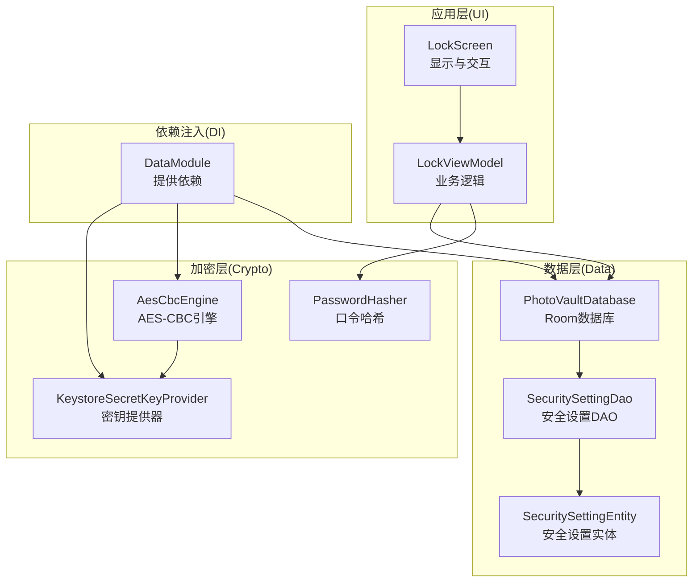
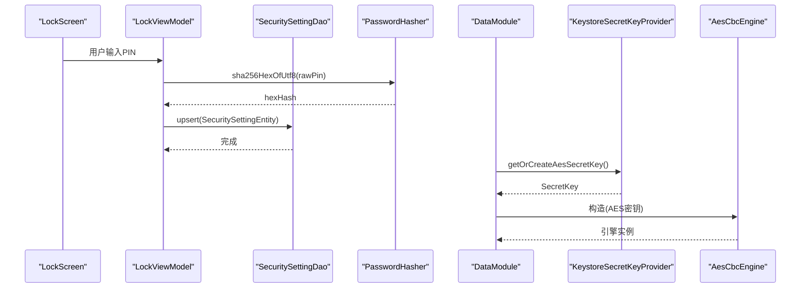
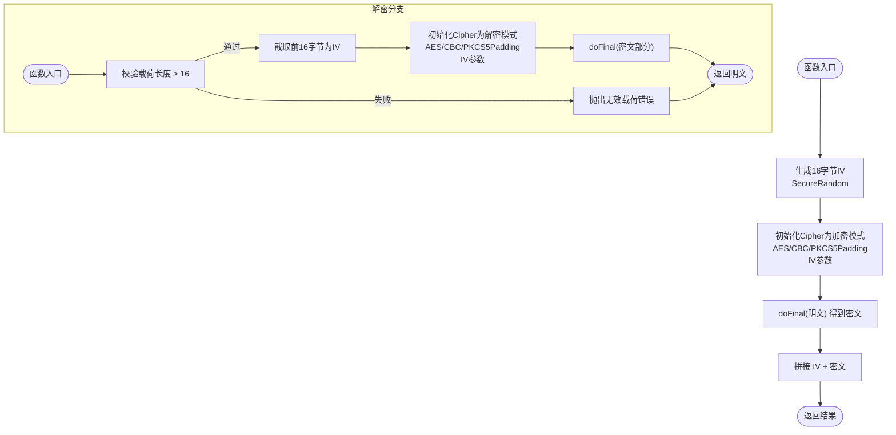
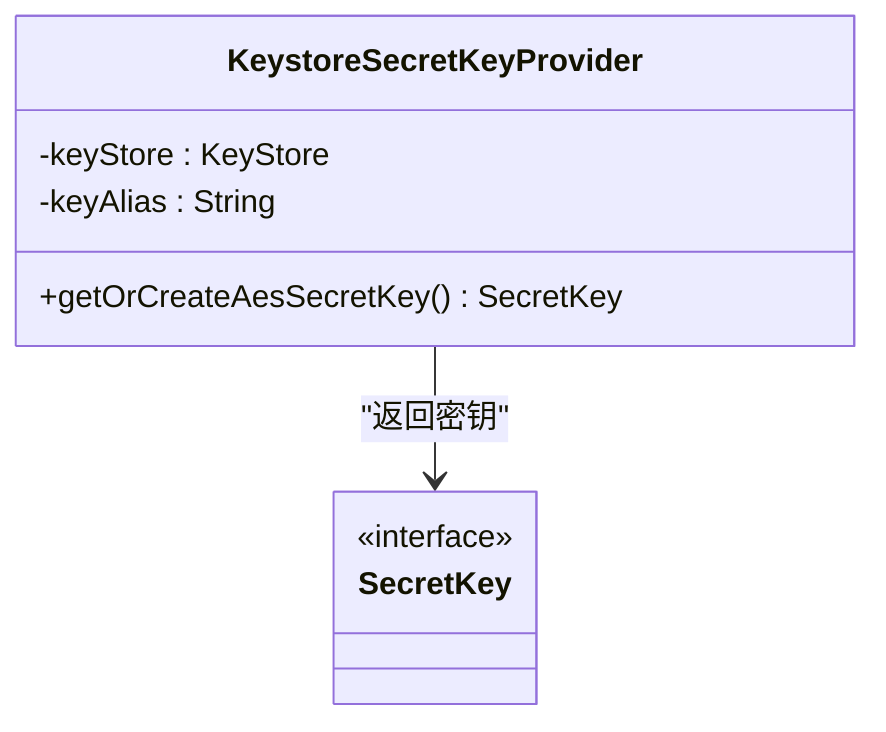
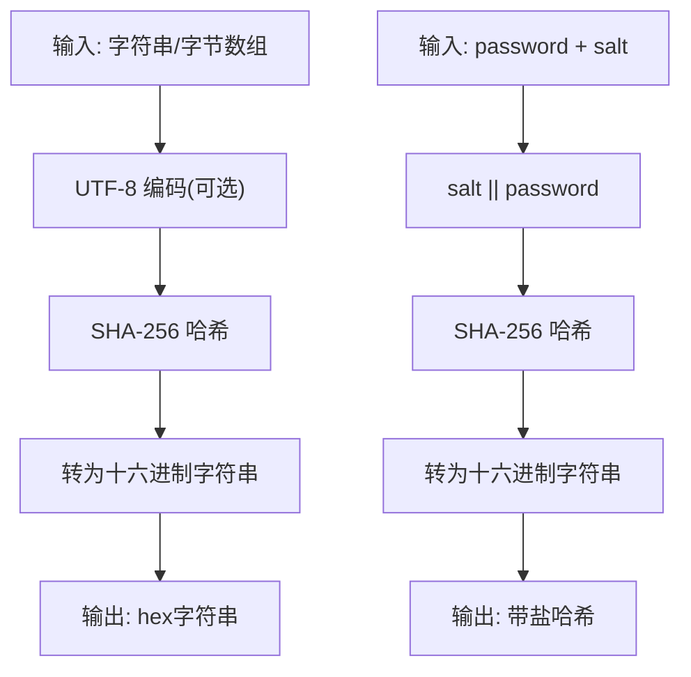
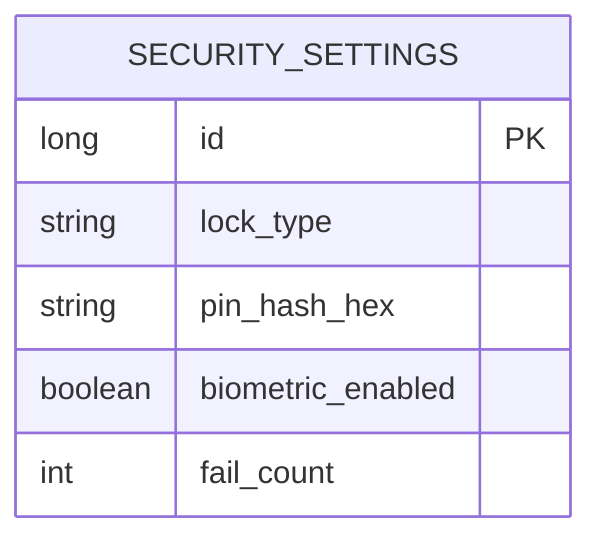
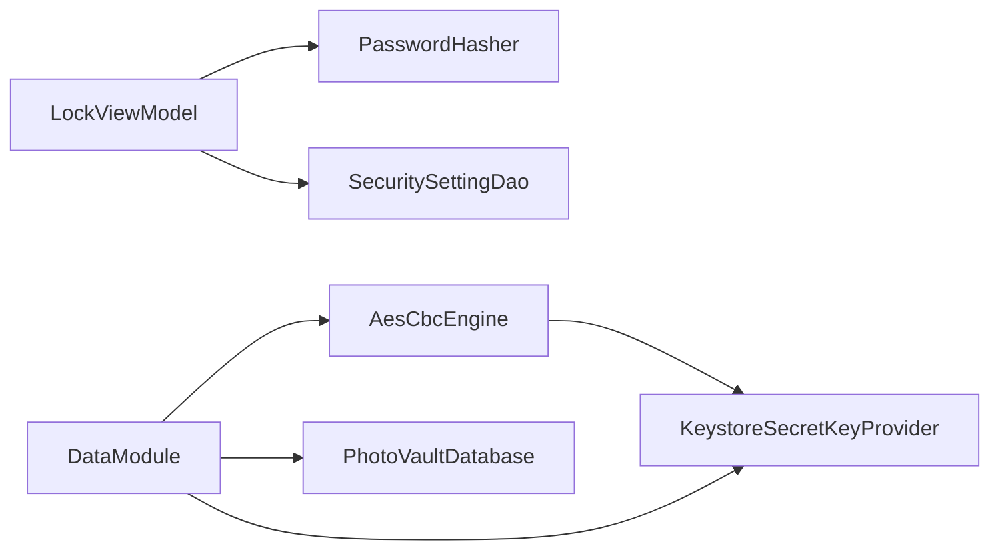

# 加密存储系统

<cite>
**本文引用的文件**
- [AesCbcEngine.kt](file://android/core/data/src/main/kotlin/com/photovault/data/crypto/AesCbcEngine.kt)
- [KeystoreSecretKeyProvider.kt](file://android/core/data/src/main/kotlin/com/photovault/data/crypto/KeystoreSecretKeyProvider.kt)
- [PasswordHasher.kt](file://android/core/data/src/main/kotlin/com/photovault/data/crypto/PasswordHasher.kt)
- [AesCbcEngineTest.kt](file://android/core/data/src/test/kotlin/com/photovault/data/crypto/AesCbcEngineTest.kt)
- [PasswordHasherTest.kt](file://android/core/data/src/test/kotlin/com/photovault/data/crypto/PasswordHasherTest.kt)
- [SecuritySettingEntity.kt](file://android/core/data/src/main/kotlin/com/photovault/data/db/entity/SecuritySettingEntity.kt)
- [SecuritySettingDao.kt](file://android/core/data/src/main/kotlin/com/photovault/data/db/dao/SecuritySettingDao.kt)
- [PhotoVaultDatabase.kt](file://android/core/data/src/main/kotlin/com/photovault/data/db/PhotoVaultDatabase.kt)
- [DataModule.kt](file://android/core/data/src/main/kotlin/com/photovault/data/di/DataModule.kt)
- [LockViewModel.kt](file://android/app/src/main/kotlin/com/photovault/app/ui/lock/LockViewModel.kt)
- [LockScreen.kt](file://android/app/src/main/kotlin/com/photovault/app/ui/lock/LockScreen.kt)
</cite>

## 目录
1. [简介](#简介)
2. [项目结构](#项目结构)
3. [核心组件](#核心组件)
4. [架构总览](#架构总览)
5. [详细组件分析](#详细组件分析)
6. [依赖关系分析](#依赖关系分析)
7. [性能考量](#性能考量)
8. [故障排查指南](#故障排查指南)
9. [结论](#结论)
10. [附录](#附录)

## 简介
本文件面向AI照片保险库的加密存储系统，聚焦以下目标：
- 深入解释AES-256-CBC加密算法的实现原理、密钥管理机制、密码哈希策略的设计思路
- 详细说明AesCbcEngine的加密解密流程、KeystoreSecretKeyProvider的安全密钥存储方案、PasswordHasher的密码安全处理
- 解释加密数据的完整性保护、随机数生成、填充模式选择等关键技术决策
- 提供具体使用示例（以路径形式呈现）、异常处理建议、安全数据存储实践
- 讨论性能影响、安全威胁防护、合规性要求
- 给出密钥轮换、数据迁移、备份恢复等高级功能的实现指南

## 项目结构
加密相关代码主要位于android/core/data模块的crypto目录，并与Room数据库、依赖注入模块协同工作。UI层通过LockViewModel与数据库交互，完成PIN码的设置与校验。

图表来源
- [LockScreen.kt:1-414](file://android/app/src/main/kotlin/com/photovault/app/ui/lock/LockScreen.kt#L1-L414)
- [LockViewModel.kt:1-222](file://android/app/src/main/kotlin/com/photovault/app/ui/lock/LockViewModel.kt#L1-L222)
- [PhotoVaultDatabase.kt:1-36](file://android/core/data/src/main/kotlin/com/photovault/data/db/PhotoVaultDatabase.kt#L1-L36)
- [SecuritySettingDao.kt:1-17](file://android/core/data/src/main/kotlin/com/photovault/data/db/dao/SecuritySettingDao.kt#L1-L17)
- [SecuritySettingEntity.kt:1-19](file://android/core/data/src/main/kotlin/com/photovault/data/db/entity/SecuritySettingEntity.kt#L1-L19)
- [KeystoreSecretKeyProvider.kt:1-42](file://android/core/data/src/main/kotlin/com/photovault/data/crypto/KeystoreSecretKeyProvider.kt#L1-L42)
- [AesCbcEngine.kt:1-40](file://android/core/data/src/main/kotlin/com/photovault/data/crypto/AesCbcEngine.kt#L1-L40)
- [PasswordHasher.kt:1-26](file://android/core/data/src/main/kotlin/com/photovault/data/crypto/PasswordHasher.kt#L1-L26)
- [DataModule.kt:1-40](file://android/core/data/src/main/kotlin/com/photovault/data/di/DataModule.kt#L1-L40)

章节来源
- [PhotoVaultDatabase.kt:1-36](file://android/core/data/src/main/kotlin/com/photovault/data/db/PhotoVaultDatabase.kt#L1-L36)
- [DataModule.kt:1-40](file://android/core/data/src/main/kotlin/com/photovault/data/di/DataModule.kt#L1-L40)

## 核心组件
- KeystoreSecretKeyProvider：负责在Android Keystore中生成或读取AES主密钥，确保密钥材料不可导出，满足强机密性要求。
- AesCbcEngine：基于AES/CBC/PKCS5Padding（等价于PKCS7）实现对称加密，IV前置16字节，使用SecureRandom生成IV。
- PasswordHasher：提供SHA-256哈希与“salt || password”的组合哈希，用于PIN等口令的安全存储与校验。
- SecuritySettingEntity/Dao：持久化PIN哈希、生物识别开关、失败次数等安全状态。
- LockViewModel/LockScreen：UI侧PIN设置与解锁流程，调用PasswordHasher进行哈希计算与比对。

章节来源
- [KeystoreSecretKeyProvider.kt:1-42](file://android/core/data/src/main/kotlin/com/photovault/data/crypto/KeystoreSecretKeyProvider.kt#L1-L42)
- [AesCbcEngine.kt:1-40](file://android/core/data/src/main/kotlin/com/photovault/data/crypto/AesCbcEngine.kt#L1-L40)
- [PasswordHasher.kt:1-26](file://android/core/data/src/main/kotlin/com/photovault/data/crypto/PasswordHasher.kt#L1-L26)
- [SecuritySettingEntity.kt:1-19](file://android/core/data/src/main/kotlin/com/photovault/data/db/entity/SecuritySettingEntity.kt#L1-L19)
- [SecuritySettingDao.kt:1-17](file://android/core/data/src/main/kotlin/com/photovault/data/db/dao/SecuritySettingDao.kt#L1-L17)
- [LockViewModel.kt:1-222](file://android/app/src/main/kotlin/com/photovault/app/ui/lock/LockViewModel.kt#L1-L222)
- [LockScreen.kt:1-414](file://android/app/src/main/kotlin/com/photovault/app/ui/lock/LockScreen.kt#L1-L414)

## 架构总览
下图展示了从UI到数据库的完整加密存储链路，以及依赖注入如何提供密钥与引擎实例。

图表来源
- [LockScreen.kt:1-414](file://android/app/src/main/kotlin/com/photovault/app/ui/lock/LockScreen.kt#L1-L414)
- [LockViewModel.kt:1-222](file://android/app/src/main/kotlin/com/photovault/app/ui/lock/LockViewModel.kt#L1-L222)
- [SecuritySettingDao.kt:1-17](file://android/core/data/src/main/kotlin/com/photovault/data/db/dao/SecuritySettingDao.kt#L1-L17)
- [PasswordHasher.kt:1-26](file://android/core/data/src/main/kotlin/com/photovault/data/crypto/PasswordHasher.kt#L1-L26)
- [DataModule.kt:1-40](file://android/core/data/src/main/kotlin/com/photovault/data/di/DataModule.kt#L1-L40)
- [KeystoreSecretKeyProvider.kt:1-42](file://android/core/data/src/main/kotlin/com/photovault/data/crypto/KeystoreSecretKeyProvider.kt#L1-L42)
- [AesCbcEngine.kt:1-40](file://android/core/data/src/main/kotlin/com/photovault/data/crypto/AesCbcEngine.kt#L1-L40)

## 详细组件分析

### AesCbcEngine 加密引擎
- 算法与填充
  - 使用AES/CBC/PKCS5Padding（JVM/Android上PKCS5Padding与PKCS7等价）
  - IV长度固定16字节，前置拼接在密文前，便于解密时提取
- 随机数与IV
  - 使用SecureRandom生成每条消息的IV，确保相同明文多次加密得到不同密文
- 加密流程
  - 生成16字节IV
  - 初始化Cipher为加密模式，传入IV参数
  - 对明文执行doFinal，得到密文
  - 返回IV + 密文
- 解密流程
  - 校验载荷长度 > IV长度
  - 截取前16字节作为IV
  - 初始化Cipher为解密模式，传入IV参数
  - 对剩余字节执行doFinal，返回明文

图表来源
- [AesCbcEngine.kt:17-32](file://android/core/data/src/main/kotlin/com/photovault/data/crypto/AesCbcEngine.kt#L17-L32)

章节来源
- [AesCbcEngine.kt:1-40](file://android/core/data/src/main/kotlin/com/photovault/data/crypto/AesCbcEngine.kt#L1-L40)
- [AesCbcEngineTest.kt:1-19](file://android/core/data/src/test/kotlin/com/photovault/data/crypto/AesCbcEngineTest.kt#L1-L19)

### KeystoreSecretKeyProvider 密钥管理
- 密钥来源
  - 通过Android Keystore生成或读取AES密钥，密钥材料不可导出，具备硬件级安全能力
- 参数配置
  - 算法：AES
  - 用途：加密/解密
  - 分组模式：CBC
  - 填充：PKCS7
  - 长度：256位
  - 用户认证：未启用（可根据需求调整）
- 别名与生命周期
  - 默认别名：photo_vault_master_aes
  - 若不存在则生成新密钥；存在则直接读取

图表来源
- [KeystoreSecretKeyProvider.kt:12-35](file://android/core/data/src/main/kotlin/com/photovault/data/crypto/KeystoreSecretKeyProvider.kt#L12-L35)

章节来源
- [KeystoreSecretKeyProvider.kt:1-42](file://android/core/data/src/main/kotlin/com/photovault/data/crypto/KeystoreSecretKeyProvider.kt#L1-L42)
- [DataModule.kt:29-38](file://android/core/data/src/main/kotlin/com/photovault/data/di/DataModule.kt#L29-L38)

### PasswordHasher 口令哈希
- 哈希算法
  - SHA-256，输出十六进制字符串
- 接口设计
  - sha256Hex(bytes)：对任意字节数组进行哈希
  - sha256HexOfUtf8(string)：UTF-8编码后哈希
  - sha256HexWithSalt(passwordUtf8, salt)：salt || password 的哈希，便于后续盐值管理
- 应用场景
  - PIN码存储：将用户输入的PIN进行哈希后存入数据库，避免明文保存
  - 可扩展：结合安装级salt实现更强抗攻击性（需在实际实现中引入）

图表来源
- [PasswordHasher.kt:9-24](file://android/core/data/src/main/kotlin/com/photovault/data/crypto/PasswordHasher.kt#L9-L24)

章节来源
- [PasswordHasher.kt:1-26](file://android/core/data/src/main/kotlin/com/photovault/data/crypto/PasswordHasher.kt#L1-L26)
- [PasswordHasherTest.kt:1-24](file://android/core/data/src/test/kotlin/com/photovault/data/crypto/PasswordHasherTest.kt#L1-L24)
- [LockViewModel.kt:153-166](file://android/app/src/main/kotlin/com/photovault/app/ui/lock/LockViewModel.kt#L153-L166)

### 数据模型与持久化
- 实体字段
  - lockType：锁类型（如PIN）
  - pinHashHex：PIN的哈希值（十六进制）
  - biometricEnabled：是否启用生物识别
  - failCount：连续失败计数
- DAO操作
  - 查询：按单例ID查询
  - 写入：REPLACE策略更新或插入

图表来源
- [SecuritySettingEntity.kt:8-14](file://android/core/data/src/main/kotlin/com/photovault/data/db/entity/SecuritySettingEntity.kt#L8-L14)
- [SecuritySettingDao.kt:11-15](file://android/core/data/src/main/kotlin/com/photovault/data/db/dao/SecuritySettingDao.kt#L11-L15)

章节来源
- [SecuritySettingEntity.kt:1-19](file://android/core/data/src/main/kotlin/com/photovault/data/db/entity/SecuritySettingEntity.kt#L1-L19)
- [SecuritySettingDao.kt:1-17](file://android/core/data/src/main/kotlin/com/photovault/data/db/dao/SecuritySettingDao.kt#L1-L17)

### 依赖注入与密钥提供
- DataModule提供：
  - Room数据库实例
  - KeystoreSecretKeyProvider单例
  - AesCbcEngine单例（依赖密钥提供器）
- 作用域：Singleton，确保全局唯一且线程安全

章节来源
- [DataModule.kt:1-40](file://android/core/data/src/main/kotlin/com/photovault/data/di/DataModule.kt#L1-L40)

## 依赖关系分析
- 组件耦合
  - LockViewModel依赖PasswordHasher与SecuritySettingDao
  - AesCbcEngine依赖KeystoreSecretKeyProvider提供的SecretKey
  - DataModule集中提供上述依赖，降低跨层耦合
- 外部依赖
  - Android Keystore、Javax Crypto、Room、Hilt

图表来源
- [LockViewModel.kt:1-222](file://android/app/src/main/kotlin/com/photovault/app/ui/lock/LockViewModel.kt#L1-L222)
- [DataModule.kt:1-40](file://android/core/data/src/main/kotlin/com/photovault/data/di/DataModule.kt#L1-L40)
- [AesCbcEngine.kt:1-40](file://android/core/data/src/main/kotlin/com/photovault/data/crypto/AesCbcEngine.kt#L1-L40)
- [KeystoreSecretKeyProvider.kt:1-42](file://android/core/data/src/main/kotlin/com/photovault/data/crypto/KeystoreSecretKeyProvider.kt#L1-L42)

## 性能考量
- 加密开销
  - AES-CBC为轻量对称加密，CPU开销低；IV前置增加少量字节开销
  - SecureRandom生成IV为轻量操作，对UI线程影响可忽略
- I/O与序列化
  - Room写入PIN哈希为小对象，性能影响极小
- 并发与线程
  - Hilt提供单例，Cipher实例非线程安全，建议在单线程或加锁环境下使用
- 缓存与复用
  - SecretKey与AesCbcEngine实例可缓存复用，避免重复生成密钥

[本节为通用性能讨论，无需特定文件来源]

## 故障排查指南
- 常见问题与定位
  - 无效载荷：解密时载荷长度不足会触发错误，检查是否正确拼接IV与密文
  - 密钥缺失：首次运行或设备重置可能导致Keystore中密钥丢失，需引导用户重新设置PIN
  - 生物识别失败：UI层已捕获错误码并提示，可在日志中查看具体错误信息
- 测试验证
  - AesCbcEngineRoundTrip：验证加密解密往返一致性
  - PasswordHasher确定性：相同输入应产生相同哈希，不同输入应不同
- 建议的日志与监控
  - 记录PIN设置/校验成功/失败次数
  - 记录生物识别认证结果与错误码
  - 记录密钥生成/读取与Cipher初始化异常

章节来源
- [AesCbcEngine.kt:25-32](file://android/core/data/src/main/kotlin/com/photovault/data/crypto/AesCbcEngine.kt#L25-L32)
- [AesCbcEngineTest.kt:1-19](file://android/core/data/src/test/kotlin/com/photovault/data/crypto/AesCbcEngineTest.kt#L1-L19)
- [PasswordHasherTest.kt:1-24](file://android/core/data/src/test/kotlin/com/photovault/data/crypto/PasswordHasherTest.kt#L1-L24)
- [LockScreen.kt:71-106](file://android/app/src/main/kotlin/com/photovault/app/ui/lock/LockScreen.kt#L71-L106)

## 结论
该加密存储系统采用AES-256-CBC与Android Keystore相结合的方式，实现了高安全性的本地密钥托管与对称加密。PIN码通过SHA-256哈希存储，避免明文泄露风险。整体架构清晰、职责分离明确，依赖注入保证了可测试性与可维护性。建议在生产环境中进一步引入安装级salt与密钥轮换策略，以增强长期安全性。

[本节为总结，无需特定文件来源]

## 附录

### 使用示例（以路径形式）
- 设置PIN并持久化
  - 调用路径：[LockViewModel.persistSetting(...):153-166](file://android/app/src/main/kotlin/com/photovault/app/ui/lock/LockViewModel.kt#L153-L166)
  - 哈希调用：[PasswordHasher.sha256HexOfUtf8(...):14-15](file://android/core/data/src/main/kotlin/com/photovault/data/crypto/PasswordHasher.kt#L14-L15)
  - DAO写入：[SecuritySettingDao.upsert(...):14-15](file://android/core/data/src/main/kotlin/com/photovault/data/db/dao/SecuritySettingDao.kt#L14-L15)
- 解锁校验
  - 调用路径：[LockViewModel.verifyUnlockPin(...):168-184](file://android/app/src/main/kotlin/com/photovault/app/ui/lock/LockViewModel.kt#L168-L184)
  - 哈希调用：[PasswordHasher.sha256HexOfUtf8(...):14-15](file://android/core/data/src/main/kotlin/com/photovault/data/crypto/PasswordHasher.kt#L14-L15)
  - DAO读取：[SecuritySettingDao.getById(...):11-12](file://android/core/data/src/main/kotlin/com/photovault/data/db/dao/SecuritySettingDao.kt#L11-L12)
- 获取AES密钥与引擎
  - 提供器：[KeystoreSecretKeyProvider.getOrCreateAesSecretKey(...):18-35](file://android/core/data/src/main/kotlin/com/photovault/data/crypto/KeystoreSecretKeyProvider.kt#L18-L35)
  - 引擎构造：[DataModule.provideAesCbcEngine(...):34-38](file://android/core/data/src/main/kotlin/com/photovault/data/di/DataModule.kt#L34-L38)
  - 加解密：[AesCbcEngine.encrypt(...):17-23](file://android/core/data/src/main/kotlin/com/photovault/data/crypto/AesCbcEngine.kt#L17-L23)、[AesCbcEngine.decrypt(...):25-32](file://android/core/data/src/main/kotlin/com/photovault/data/crypto/AesCbcEngine.kt#L25-L32)

### 安全与合规建议
- 密钥管理
  - 使用Android Keystore托管主密钥，避免密钥材料导出
  - 后续可引入用户认证要求（如setUserAuthenticationRequired(true)）
- 口令策略
  - 引入安装级salt，结合sha256HexWithSalt进行存储
  - 增加PIN复杂度与长度限制
- 完整性与抗篡改
  - 当前仅实现加密，未包含独立MAC；建议在应用层引入HMAC-SHA256或AEAD模式（如AES-GCM）以保护完整性
- 性能与用户体验
  - 将加密/解密操作置于后台协程，避免阻塞UI
  - 对频繁使用的PIN校验可做内存缓存（短期有效）

### 高级功能实现指南
- 密钥轮换
  - 步骤：生成新密钥、遍历旧数据、使用旧密钥解密、用新密钥加密、替换存储
  - 注意：需要持久化新旧密钥版本标识，确保向后兼容
- 数据迁移
  - 从旧格式导入：解析旧IV/密文格式，使用旧算法解密，再统一迁移到新格式
  - 迁移期间保持双写兼容，逐步切换
- 备份与恢复
  - 备份范围：仅备份数据库（不包含密钥），密钥由Keystore在新设备重建
  - 恢复流程：新设备首次运行时，若无密钥则重新设置PIN并生成新密钥；数据迁移时使用新密钥重加密

[本节为概念性指导，无需特定文件来源]