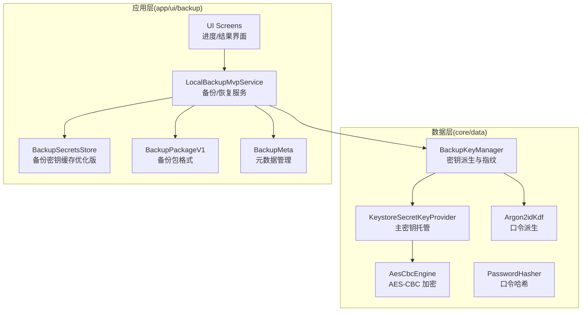
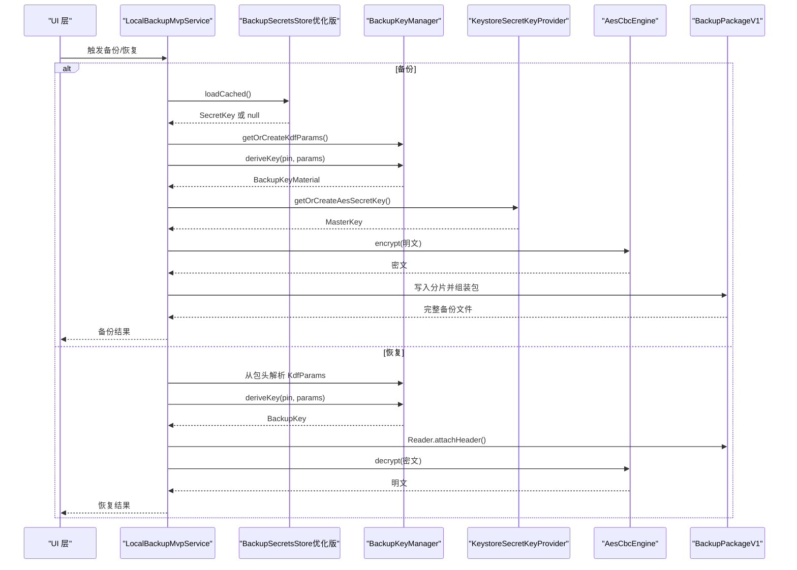
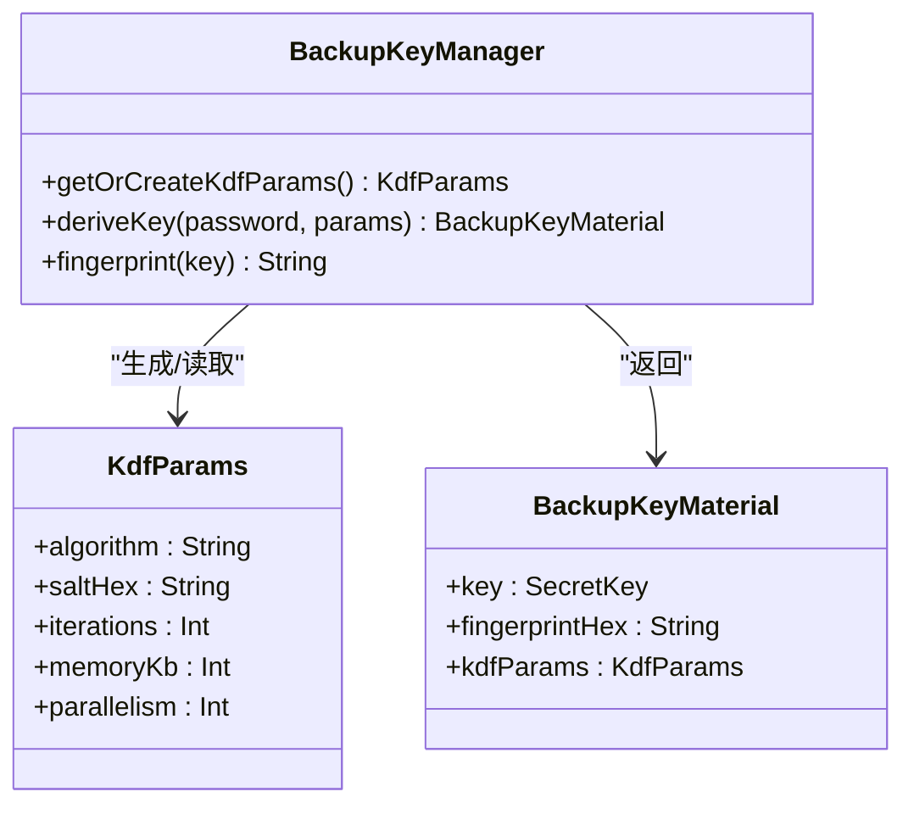
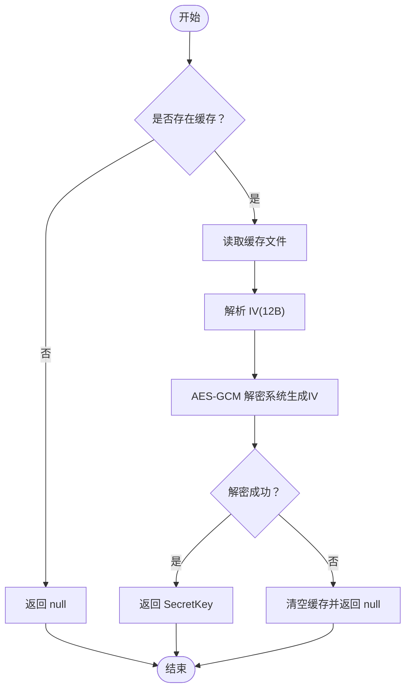
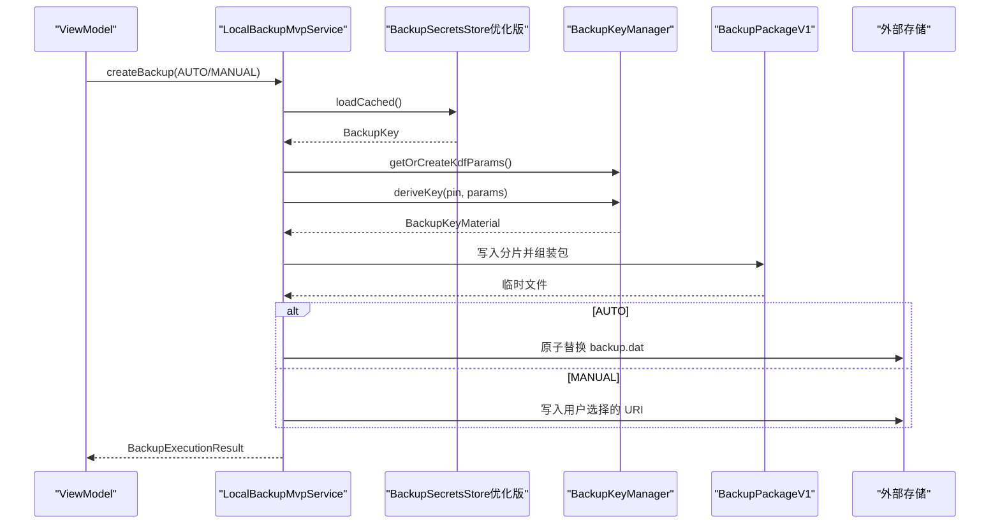
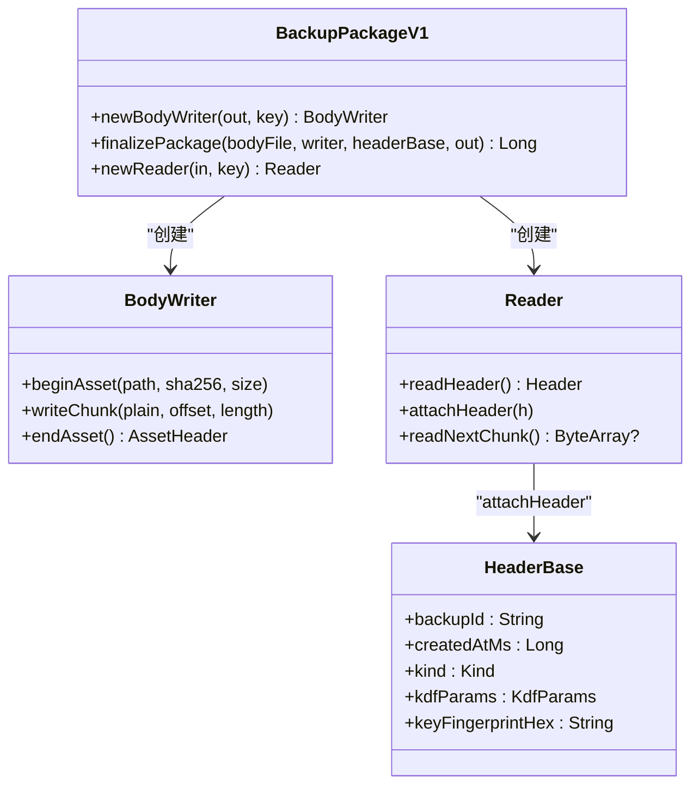
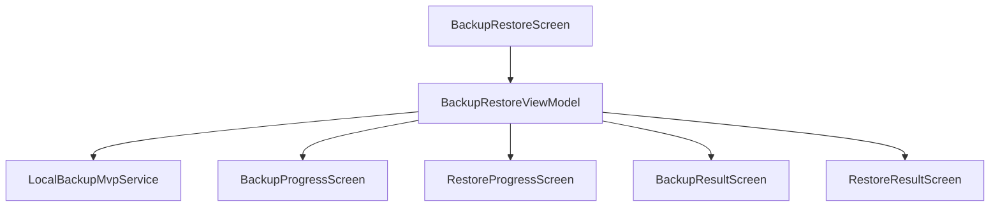
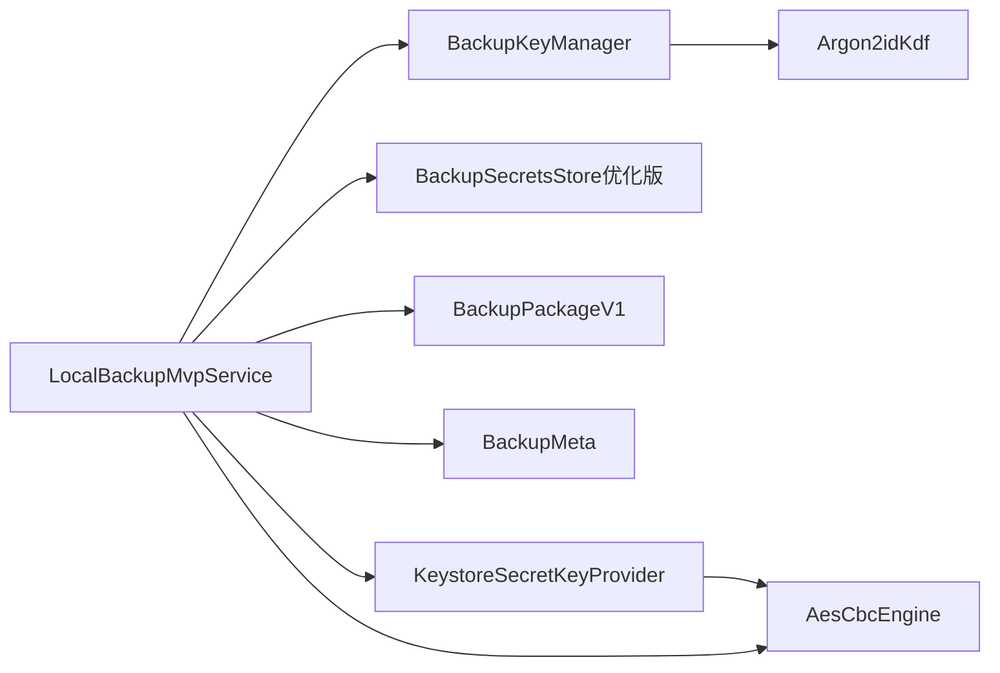

# 备份密钥管理器

<cite>
**本文档引用的文件**
- [BackupKeyManager.kt](file://android/core/data/src/main/kotlin/com/xpx/vault/data/crypto/BackupKeyManager.kt)
- [KeystoreSecretKeyProvider.kt](file://android/core/data/src/main/kotlin/com/xpx/vault/data/crypto/KeystoreSecretKeyProvider.kt)
- [AesCbcEngine.kt](file://android/core/data/src/main/kotlin/com/xpx/vault/data/crypto/AesCbcEngine.kt)
- [Argon2idKdf.kt](file://android/core/data/src/main/kotlin/com/xpx/vault/data/crypto/Argon2idKdf.kt)
- [PasswordHasher.kt](file://android/core/data/src/main/kotlin/com/xpx/vault/data/crypto/PasswordHasher.kt)
- [BackupSecretsStore.kt](file://android/app/src/main/kotlin/com/xpx/vault/ui/backup/BackupSecretsStore.kt)
- [LocalBackupMvpService.kt](file://android/app/src/main/kotlin/com/xpx/vault/ui/backup/LocalBackupMvpService.kt)
- [BackupPackageV1.kt](file://android/app/src/main/kotlin/com/xpx/vault/ui/backup/BackupPackageV1.kt)
- [BackupMeta.kt](file://android/app/src/main/kotlin/com/xpx/vault/ui/backup/BackupMeta.kt)
- [BackupRestoreScreen.kt](file://android/app/src/main/kotlin/com/xpx/vault/ui/BackupRestoreScreen.kt)
- [BackupProgressScreen.kt](file://android/app/src/main/kotlin/com/xpx/vault/ui/BackupProgressScreen.kt)
- [RestoreProgressScreen.kt](file://android/app/src/main/kotlin/com/xpx/vault/ui/RestoreProgressScreen.kt)
- [BackupResultScreen.kt](file://android/app/src/main/kotlin/com/xpx/vault/ui/BackupResultScreen.kt)
- [RestoreResultScreen.kt](file://android/app/src/main/kotlin/com/xpx/vault/ui/RestoreResultScreen.kt)
</cite>

## 更新摘要
**变更内容**
- 更新了备份密钥缓存组件的实现细节，重点反映了Android Keystore AES-GCM要求的优化
- 新增了关于随机化加密和IV生成机制的技术说明
- 完善了缓存文件格式和安全机制的描述

## 目录
1. [简介](#简介)
2. [项目结构](#项目结构)
3. [核心组件](#核心组件)
4. [架构总览](#架构总览)
5. [详细组件分析](#详细组件分析)
6. [依赖关系分析](#依赖关系分析)
7. [性能考虑](#性能考虑)
8. [故障排除指南](#故障排除指南)
9. [结论](#结论)

## 简介
本文件系统性阐述备份密钥管理器的设计与实现，涵盖密钥派生、缓存、备份包格式、UI 交互以及错误处理。备份密钥管理器采用双密钥架构：Vault 主密钥（Keystore 托管）用于日常加解密，备份密钥（Argon2id 派生）仅用于备份包加解密。通过密钥指纹（HMAC-SHA256 截断）判断备份密码是否变更，确保自动备份的增量策略与恢复流程的安全性。

**更新** 本版本特别关注了BackupSecretsStore.kt中针对Android Keystore AES-GCM要求的优化实现，消除了手动GCMParameterSpec参数导致的备份密钥文件写入问题。

## 项目结构
备份密钥相关代码主要分布在两个层次：
- 数据层（core/data）：提供密钥派生、主密钥托管、对称加密引擎与口令哈希等基础能力。
- 应用层（app/ui/backup）：封装备份/恢复服务、备份包格式、密钥缓存与 UI 层交互。

**图表来源**
- [BackupKeyManager.kt:17-137](file://android/core/data/src/main/kotlin/com/xpx/vault/data/crypto/BackupKeyManager.kt#L17-L137)
- [KeystoreSecretKeyProvider.kt:12-45](file://android/core/data/src/main/kotlin/com/xpx/vault/data/crypto/KeystoreSecretKeyProvider.kt#L12-L45)
- [AesCbcEngine.kt:12-40](file://android/core/data/src/main/kotlin/com/xpx/vault/data/crypto/AesCbcEngine.kt#L12-L40)
- [Argon2idKdf.kt:17-100](file://android/core/data/src/main/kotlin/com/xpx/vault/data/crypto/Argon2idKdf.kt#L17-L100)
- [PasswordHasher.kt:6-26](file://android/core/data/src/main/kotlin/com/xpx/vault/data/crypto/PasswordHasher.kt#L6-L26)
- [BackupSecretsStore.kt:15-119](file://android/app/src/main/kotlin/com/xpx/vault/ui/backup/BackupSecretsStore.kt#L15-L119)
- [LocalBackupMvpService.kt:37-657](file://android/app/src/main/kotlin/com/xpx/vault/ui/backup/LocalBackupMvpService.kt#L37-L657)
- [BackupPackageV1.kt:47-403](file://android/app/src/main/kotlin/com/xpx/vault/ui/backup/BackupPackageV1.kt#L47-L403)
- [BackupMeta.kt:26-194](file://android/app/src/main/kotlin/com/xpx/vault/ui/backup/BackupMeta.kt#L26-L194)

**章节来源**
- [BackupKeyManager.kt:17-137](file://android/core/data/src/main/kotlin/com/xpx/vault/data/crypto/BackupKeyManager.kt#L17-L137)
- [LocalBackupMvpService.kt:37-657](file://android/app/src/main/kotlin/com/xpx/vault/ui/backup/LocalBackupMvpService.kt#L37-L657)

## 核心组件
- 备份密钥管理器（BackupKeyManager）
  - 通过 Argon2id 从 PIN 口令 + 设备盐派生 AES-256 备份密钥。
  - 计算 keyFingerprint = HMAC-SHA256(backupKey, "aivault.fp.v1")[:16]，用于判断备份密码是否变更。
  - 首次安装时随机生成 32 字节盐值，持久化在 EncryptedSharedPreferences。
  - 导出的 KdfParams 仅包含参数，不包含任何密钥/口令字节，可安全写入备份包头。
- 主密钥提供者（KeystoreSecretKeyProvider）
  - 在 Android Keystore 中生成/读取 AES-256 CBC 密钥，私钥材料不可导出。
- 对称加密引擎（AesCbcEngine）
  - AES-256-CBC + PKCS7，IV 前置（16 字节），与一期产品「照片 AES-256-CBC」约定一致。
- 口令散列（PasswordHasher）
  - SHA-256，用于 PIN 等口令存储（配合安装级 salt）。
- 备份密钥缓存（BackupSecretsStore）
  - **优化** 使用 Android Keystore 中独立的 AES-GCM 包裹密钥，将 BackupKey 材料缓存到私有目录。
  - **新增** 遵循 Android Keystore 的随机化加密要求，IV 由系统自动生成而非手动指定。
  - **改进** 缓存文件格式为 `[IV(12B)] [cipherText || tag]`，确保与 Keystore 要求兼容。
  - Worker 无法弹解锁页，启动时读取缓存即可快速获得可用的 BackupKey。
- 备份包格式（BackupPackageV1）
  - v1 备份包读写器，支持 AUTO/MANUAL 共用。
  - 包结构：MAGIC + VERSION + HEADER_LEN + HEADER_JSON + BODY（GCM 分片）+ TRAILER（SHA-256）。
- 备份元数据（BackupMeta）
  - 私有目录中的 backup_meta.json 读写器，维护 AUTO 元信息与 MANUAL 历史。
- 备份/恢复服务（LocalBackupMvpService）
  - 统一的备份/恢复入口，区分 AUTO/MANUAL，支持增量/全量策略。
  - 通过密钥指纹决定 FULL/INCREMENTAL，确保密码变更时强制全量备份。

**更新** 备份密钥缓存组件经过重大优化，解决了Android Keystore AES-GCM要求的问题，消除了手动GCMParameterSpec参数导致的备份密钥文件写入问题。

**章节来源**
- [BackupKeyManager.kt:21-108](file://android/core/data/src/main/kotlin/com/xpx/vault/data/crypto/BackupKeyManager.kt#L21-L108)
- [KeystoreSecretKeyProvider.kt:18-38](file://android/core/data/src/main/kotlin/com/xpx/vault/data/crypto/KeystoreSecretKeyProvider.kt#L18-L38)
- [AesCbcEngine.kt:17-32](file://android/core/data/src/main/kotlin/com/xpx/vault/data/crypto/AesCbcEngine.kt#L17-L32)
- [PasswordHasher.kt:9-24](file://android/core/data/src/main/kotlin/com/xpx/vault/data/crypto/PasswordHasher.kt#L9-L24)
- [BackupSecretsStore.kt:15-119](file://android/app/src/main/kotlin/com/xpx/vault/ui/backup/BackupSecretsStore.kt#L15-L119)
- [BackupPackageV1.kt:47-103](file://android/app/src/main/kotlin/com/xpx/vault/ui/backup/BackupPackageV1.kt#L47-L103)
- [BackupMeta.kt:58-113](file://android/app/src/main/kotlin/com/xpx/vault/ui/backup/BackupMeta.kt#L58-L113)
- [LocalBackupMvpService.kt:69-169](file://android/app/src/main/kotlin/com/xpx/vault/ui/backup/LocalBackupMvpService.kt#L69-L169)

## 架构总览
备份密钥管理器贯穿数据层与应用层，形成清晰的职责分离与安全边界：

**图表来源**
- [LocalBackupMvpService.kt:46-270](file://android/app/src/main/kotlin/com/xpx/vault/ui/backup/LocalBackupMvpService.kt#L46-L270)
- [BackupSecretsStore.kt:61-79](file://android/app/src/main/kotlin/com/xpx/vault/ui/backup/BackupSecretsStore.kt#L61-L79)
- [BackupKeyManager.kt:82-100](file://android/core/data/src/main/kotlin/com/xpx/vault/data/crypto/BackupKeyManager.kt#L82-L100)
- [KeystoreSecretKeyProvider.kt:18-38](file://android/core/data/src/main/kotlin/com/xpx/vault/data/crypto/KeystoreSecretKeyProvider.kt#L18-L38)
- [AesCbcEngine.kt:17-32](file://android/core/data/src/main/kotlin/com/xpx/vault/data/crypto/AesCbcEngine.kt#L17-L32)
- [BackupPackageV1.kt:227-297](file://android/app/src/main/kotlin/com/xpx/vault/ui/backup/BackupPackageV1.kt#L227-L297)

## 详细组件分析

### 备份密钥管理器（BackupKeyManager）
- KdfParams：包含算法、盐值、迭代次数、内存与并行度，用于备份包头明文写出。
- BackupKeyMaterial：包含密钥、指纹与参数，供写入包头。
- getOrCreateKdfParams：首次安装随机生成 32 字节盐值并持久化；根据设备内存自适应选择参数。
- deriveKey：使用 Argon2id 从口令派生 32 字节密钥，立即清零本地副本。
- fingerprint：基于 HMAC-SHA256 的 16 字节指纹，用于判断密码是否变更。

**图表来源**
- [BackupKeyManager.kt:21-108](file://android/core/data/src/main/kotlin/com/xpx/vault/data/crypto/BackupKeyManager.kt#L21-L108)

**章节来源**
- [BackupKeyManager.kt:40-108](file://android/core/data/src/main/kotlin/com/xpx/vault/data/crypto/BackupKeyManager.kt#L40-L108)

### 备份密钥缓存（BackupSecretsStore）
**更新** 备份密钥缓存组件经过重大优化，解决了Android Keystore AES-GCM要求的问题：

- **随机化加密要求**：遵循 Android Keystore 的 AES-GCM 要求，必须使用 randomizedEncryption，IV 必须由系统生成，不能通过 GCMParameterSpec 传入调用方 IV。
- **包裹密钥机制**：使用 Android Keystore 中独立的 AES-GCM 包裹密钥，将 BackupKey 材料缓存到私有目录。
- **缓存文件格式**：`[IV(12B)] [cipherText || tag]`，其中 IV 由系统自动生成，cipherText 为加密后的密钥材料，tag 为128位验证标签。
- **安全实现**：在缓存写入过程中，IV 通过 Cipher.iv 获取并验证长度为12字节，确保符合 GCM 要求。
- **错误处理**：解密失败时自动清空缓存文件，防止损坏数据影响后续操作。
- **生命周期管理**：提供 clear 和 destroy 方法，支持清空缓存文件或连同包裹密钥一起销毁。

**图表来源**
- [BackupSecretsStore.kt:61-79](file://android/app/src/main/kotlin/com/xpx/vault/ui/backup/BackupSecretsStore.kt#L61-L79)

**章节来源**
- [BackupSecretsStore.kt:15-119](file://android/app/src/main/kotlin/com/xpx/vault/ui/backup/BackupSecretsStore.kt#L15-L119)

### 备份/恢复服务（LocalBackupMvpService）
- createBackup：统一入口，区分 AUTO/MANUAL，计算空间需求，写入临时文件并原子替换外部文件。
- restoreFromAutoPackage/restoreFromManualFile：先读包头获取 KdfParams 与指纹，派生备份密钥并校验指纹，再顺序读取分片并用主密钥重加密落地。
- 增量策略：通过密钥指纹与上次备份指纹对比决定 FULL/INCREMENTAL。

**图表来源**
- [LocalBackupMvpService.kt:46-270](file://android/app/src/main/kotlin/com/xpx/vault/ui/backup/LocalBackupMvpService.kt#L46-L270)
- [BackupPackageV1.kt:183-222](file://android/app/src/main/kotlin/com/xpx/vault/ui/backup/BackupPackageV1.kt#L183-L222)

**章节来源**
- [LocalBackupMvpService.kt:69-169](file://android/app/src/main/kotlin/com/xpx/vault/ui/backup/LocalBackupMvpService.kt#L69-L169)
- [LocalBackupMvpService.kt:292-394](file://android/app/src/main/kotlin/com/xpx/vault/ui/backup/LocalBackupMvpService.kt#L292-L394)

### 备份包格式（BackupPackageV1）
- HeaderBase：包含备份 ID、时间戳、类型、KDF 参数、密钥指纹与加密套件。
- BodyWriter：按 CHUNK_MAX_PLAIN_BYTES 分片，使用 AES-256-GCM（12 字节 IV + 16 字节 Tag）加密。
- Reader：attachHeader 支持已解析 Header 的注入，避免重复读取 Header。

**图表来源**
- [BackupPackageV1.kt:111-177](file://android/app/src/main/kotlin/com/xpx/vault/ui/backup/BackupPackageV1.kt#L111-L177)
- [BackupPackageV1.kt:227-297](file://android/app/src/main/kotlin/com/xpx/vault/ui/backup/BackupPackageV1.kt#L227-L297)
- [BackupPackageV1.kt:306-372](file://android/app/src/main/kotlin/com/xpx/vault/ui/backup/BackupPackageV1.kt#L306-L372)

**章节来源**
- [BackupPackageV1.kt:47-103](file://android/app/src/main/kotlin/com/xpx/vault/ui/backup/BackupPackageV1.kt#L47-L103)
- [BackupPackageV1.kt:183-222](file://android/app/src/main/kotlin/com/xpx/vault/ui/backup/BackupPackageV1.kt#L183-L222)

### UI 层集成
- 备份/恢复页面：展示授权状态、自动备份最近一次信息、手动备份/恢复入口与历史记录。
- 进度/结果页面：显示备份/恢复进度与结果统计。
- ViewModel：协调权限检查、SAF 授权、PIN 输入与结果反馈。

**图表来源**
- [BackupRestoreScreen.kt:87-269](file://android/app/src/main/kotlin/com/xpx/vault/ui/BackupRestoreScreen.kt#L87-L269)
- [BackupProgressScreen.kt:40-125](file://android/app/src/main/kotlin/com/xpx/vault/ui/BackupProgressScreen.kt#L40-L125)
- [RestoreProgressScreen.kt:40-127](file://android/app/src/main/kotlin/com/xpx/vault/ui/RestoreProgressScreen.kt#L40-L127)
- [BackupResultScreen.kt:32-142](file://android/app/src/main/kotlin/com/xpx/vault/ui/BackupResultScreen.kt#L32-L142)
- [RestoreResultScreen.kt:32-127](file://android/app/src/main/kotlin/com/xpx/vault/ui/RestoreResultScreen.kt#L32-L127)

**章节来源**
- [BackupRestoreScreen.kt:87-269](file://android/app/src/main/kotlin/com/xpx/vault/ui/BackupRestoreScreen.kt#L87-L269)

## 依赖关系分析
- 组件耦合
  - BackupKeyManager 与 Argon2idKdf 强耦合，负责 KDF 参数与密钥派生。
  - LocalBackupMvpService 依赖 BackupKeyManager、BackupSecretsStore、BackupPackageV1、BackupMeta。
  - AesCbcEngine 依赖 KeystoreSecretKeyProvider，用于日常加解密。
- 外部依赖
  - Android Keystore：提供硬件级安全存储与密钥生成，支持 AES-GCM 随机化加密。
  - BouncyCastle：Argon2id 实现。
  - ContentResolver：外部备份目录写入与读取。

**图表来源**
- [LocalBackupMvpService.kt:37-657](file://android/app/src/main/kotlin/com/xpx/vault/ui/backup/LocalBackupMvpService.kt#L37-L657)
- [BackupKeyManager.kt:17-137](file://android/core/data/src/main/kotlin/com/xpx/vault/data/crypto/BackupKeyManager.kt#L17-L137)
- [BackupSecretsStore.kt:15-119](file://android/app/src/main/kotlin/com/xpx/vault/ui/backup/BackupSecretsStore.kt#L15-L119)
- [BackupPackageV1.kt:47-403](file://android/app/src/main/kotlin/com/xpx/vault/ui/backup/BackupPackageV1.kt#L47-L403)
- [BackupMeta.kt:26-194](file://android/app/src/main/kotlin/com/xpx/vault/ui/backup/BackupMeta.kt#L26-L194)

**章节来源**
- [LocalBackupMvpService.kt:37-657](file://android/app/src/main/kotlin/com/xpx/vault/ui/backup/LocalBackupMvpService.kt#L37-L657)

## 性能考虑
- KDF 参数自适应：根据设备内存自动选择参数，兼顾安全性与性能。
- 分片写入：备份包按 1MB 明文上限分片，降低内存峰值与 I/O 压力。
- 增量备份：通过密钥指纹判断密码变更，未变更时执行增量备份，减少数据传输与写入。
- 空间预估：备份前估算临时文件所需空间，避免磁盘不足导致失败。
- **优化** 备份密钥缓存采用系统自动生成的随机IV，避免手动IV生成的额外开销。

## 故障排除指南
- 备份密钥未缓存
  - 现象：提示"备份密钥尚未缓存，请先解锁后再试。"
  - 处理：先进行一次解锁操作以缓存备份密钥，或确认 BackupSecretsStore.cache 已被调用。
- 密码不正确
  - 现象：恢复时提示"密码不正确，请重试。"
  - 处理：核对输入的 6位密码，确保与创建备份时一致；确认 KdfParams 与指纹匹配。
- 外部目录未授权
  - 现象：自动备份提示"未授权外部备份目录，无法写入。"
  - 处理：在设置页选择并授权 Documents/AIVault 目录。
- 磁盘空间不足
  - 现象：提示"本机磁盘空间不足，无法生成备份临时文件。"
  - 处理：清理设备存储空间或移除不必要的文件。
- **新增** 缓存损坏
  - 现象：加载缓存失败并自动清空。
  - 处理：重新解锁以重建缓存；如需彻底重置，调用 destroy 清除包裹密钥。
- **新增** Android Keystore 错误
  - 现象：出现 InvalidAlgorithmParameterException 或类似的 Keystore 相关异常。
  - 处理：确认使用的是优化后的缓存方法，确保 IV 由系统自动生成而非手动指定。

**更新** 新增了针对Android Keystore AES-GCM要求的故障排除指导。

**章节来源**
- [LocalBackupMvpService.kt:74-76](file://android/app/src/main/kotlin/com/xpx/vault/ui/backup/LocalBackupMvpService.kt#L74-L76)
- [LocalBackupMvpService.kt:329-332](file://android/app/src/main/kotlin/com/xpx/vault/ui/backup/LocalBackupMvpService.kt#L329-L332)
- [BackupSecretsStore.kt:75-79](file://android/app/src/main/kotlin/com/xpx/vault/ui/backup/BackupSecretsStore.kt#L75-L79)

## 结论
备份密钥管理器通过双密钥架构与严格的密钥指纹机制，实现了安全、可靠且高效的备份与恢复流程。数据层提供强健的密钥派生与主密钥托管能力，应用层以服务化方式封装备份/恢复逻辑，并通过 UI 层提供直观的操作体验。

**更新** 本版本特别强调了BackupSecretsStore.kt的优化实现，该优化解决了Android Keystore AES-GCM要求的关键问题，消除了手动GCMParameterSpec参数导致的备份密钥文件写入问题，确保了与Keystore安全机制的完全兼容性。整体设计在安全性、性能与可用性之间取得良好平衡，适合生产环境长期使用。