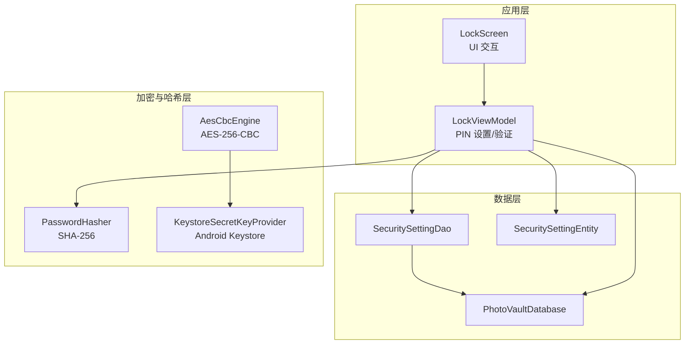
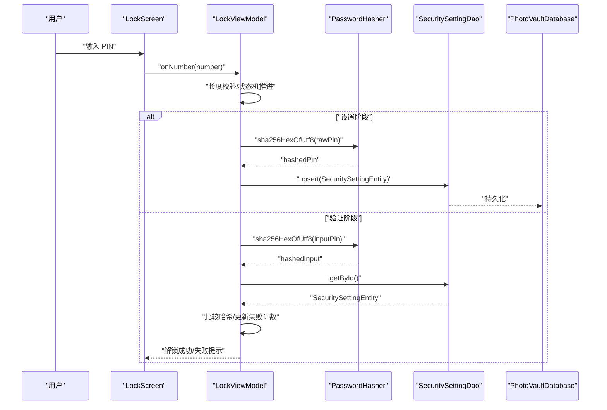
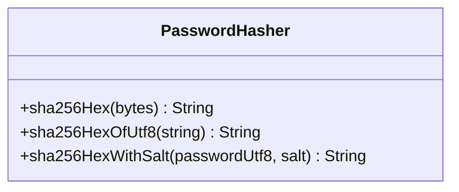
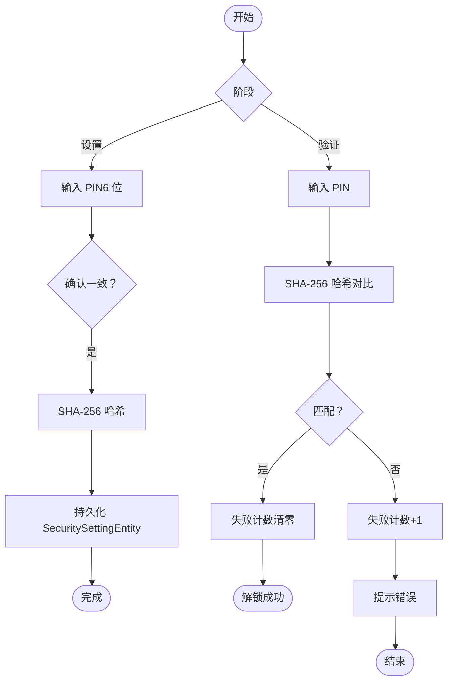
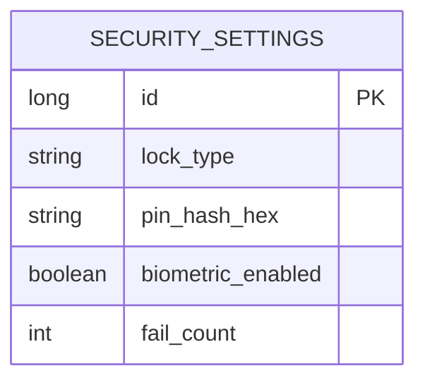
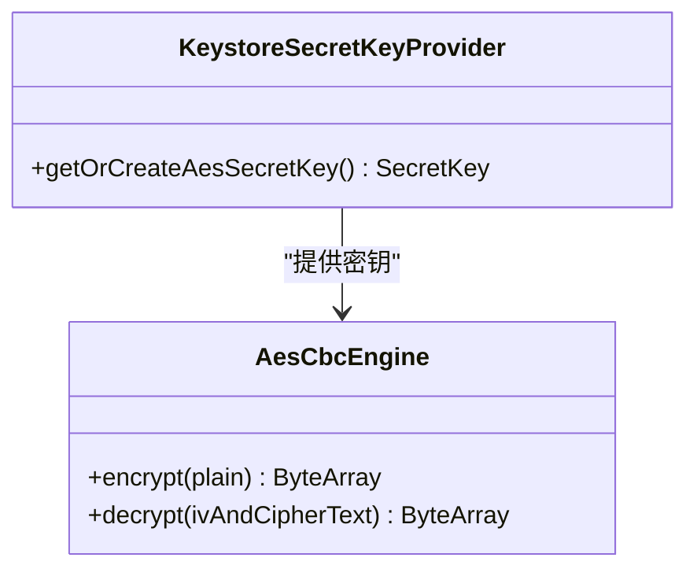
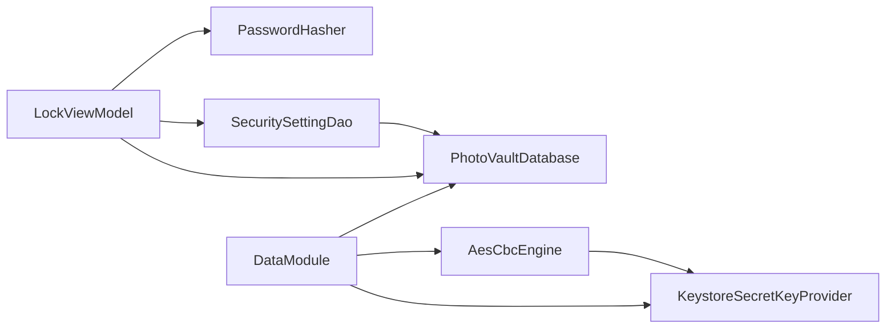

# 密码哈希器

<cite>
**本文引用的文件**
- [PasswordHasher.kt](file://android/core/data/src/main/kotlin/com/photovault/data/crypto/PasswordHasher.kt)
- [PasswordHasherTest.kt](file://android/core/data/src/test/kotlin/com/photovault/data/crypto/PasswordHasherTest.kt)
- [AesCbcEngine.kt](file://android/core/data/src/main/kotlin/com/photovault/data/crypto/AesCbcEngine.kt)
- [KeystoreSecretKeyProvider.kt](file://android/core/data/src/main/kotlin/com/photovault/data/crypto/KeystoreSecretKeyProvider.kt)
- [SecuritySettingEntity.kt](file://android/core/data/src/main/kotlin/com/photovault/data/db/entity/SecuritySettingEntity.kt)
- [SecuritySettingDao.kt](file://android/core/data/src/main/kotlin/com/photovault/data/db/dao/SecuritySettingDao.kt)
- [PhotoVaultDatabase.kt](file://android/core/data/src/main/kotlin/com/photovault/data/db/PhotoVaultDatabase.kt)
- [LockViewModel.kt](file://android/app/src/main/kotlin/com/photovault/app/ui/lock/LockViewModel.kt)
- [LockScreen.kt](file://android/app/src/main/kotlin/com/photovault/app/ui/lock/LockScreen.kt)
- [DataModule.kt](file://android/core/data/src/main/kotlin/com/photovault/data/di/DataModule.kt)
</cite>

## 目录
1. [简介](#简介)
2. [项目结构](#项目结构)
3. [核心组件](#核心组件)
4. [架构总览](#架构总览)
5. [详细组件分析](#详细组件分析)
6. [依赖关系分析](#依赖关系分析)
7. [性能考量](#性能考量)
8. [故障排查指南](#故障排查指南)
9. [结论](#结论)
10. [附录](#附录)

## 简介
本文件面向“密码哈希器”的技术文档，聚焦于应用中 PIN 码的安全存储与验证流程。当前实现采用 SHA-256 对明文 PIN 进行哈希，并结合设备级存储与数据库持久化完成安全闭环。文档将从架构、数据流、处理逻辑、集成点、错误处理与性能特性等方面进行系统化阐述，并给出安全威胁模型、合规性要求、最佳实践、性能优化建议、调试与安全测试方法以及密码策略配置选项。

## 项目结构
围绕密码哈希与 PIN 管理的关键目录与文件如下：
- 加密与哈希层：PasswordHasher（SHA-256）、AesCbcEngine（对称加密）、KeystoreSecretKeyProvider（密钥托管）
- 数据层：SecuritySettingEntity（安全设置实体）、SecuritySettingDao（DAO）、PhotoVaultDatabase（Room 数据库）
- 应用层：LockViewModel（PIN 设置与验证）、LockScreen（UI 交互）

图表来源
- [LockViewModel.kt:1-222](file://android/app/src/main/kotlin/com/photovault/app/ui/lock/LockViewModel.kt#L1-L222)
- [LockScreen.kt:1-414](file://android/app/src/main/kotlin/com/photovault/app/ui/lock/LockScreen.kt#L1-L414)
- [SecuritySettingDao.kt:1-17](file://android/core/data/src/main/kotlin/com/photovault/data/db/dao/SecuritySettingDao.kt#L1-L17)
- [PhotoVaultDatabase.kt:1-36](file://android/core/data/src/main/kotlin/com/photovault/data/db/PhotoVaultDatabase.kt#L1-L36)
- [SecuritySettingEntity.kt:1-19](file://android/core/data/src/main/kotlin/com/photovault/data/db/entity/SecuritySettingEntity.kt#L1-L19)
- [PasswordHasher.kt:1-26](file://android/core/data/src/main/kotlin/com/photovault/data/crypto/PasswordHasher.kt#L1-L26)
- [AesCbcEngine.kt:1-40](file://android/core/data/src/main/kotlin/com/photovault/data/crypto/AesCbcEngine.kt#L1-L40)
- [KeystoreSecretKeyProvider.kt:1-42](file://android/core/data/src/main/kotlin/com/photovault/data/crypto/KeystoreSecretKeyProvider.kt#L1-L42)

章节来源
- [LockViewModel.kt:1-222](file://android/app/src/main/kotlin/com/photovault/app/ui/lock/LockViewModel.kt#L1-L222)
- [LockScreen.kt:1-414](file://android/app/src/main/kotlin/com/photovault/app/ui/lock/LockScreen.kt#L1-L414)
- [SecuritySettingDao.kt:1-17](file://android/core/data/src/main/kotlin/com/photovault/data/db/dao/SecuritySettingDao.kt#L1-L17)
- [PhotoVaultDatabase.kt:1-36](file://android/core/data/src/main/kotlin/com/photovault/data/db/PhotoVaultDatabase.kt#L1-L36)
- [SecuritySettingEntity.kt:1-19](file://android/core/data/src/main/kotlin/com/photovault/data/db/entity/SecuritySettingEntity.kt#L1-L19)
- [PasswordHasher.kt:1-26](file://android/core/data/src/main/kotlin/com/photovault/data/crypto/PasswordHasher.kt#L1-L26)
- [AesCbcEngine.kt:1-40](file://android/core/data/src/main/kotlin/com/photovault/data/crypto/AesCbcEngine.kt#L1-L40)
- [KeystoreSecretKeyProvider.kt:1-42](file://android/core/data/src/main/kotlin/com/photovault/data/crypto/KeystoreSecretKeyProvider.kt#L1-L42)

## 核心组件
- PasswordHasher：提供 SHA-256 哈希能力，支持对字节数组与 UTF-8 字符串进行哈希，并提供“带盐”哈希接口（当前用于 PIN 存储场景）
- SecuritySettingEntity：持久化安全设置，包括锁类型、PIN 哈希、生物识别开关、失败计数
- SecuritySettingDao：提供按 ID 查询与替换式插入（REPLACE）写入
- PhotoVaultDatabase：Room 数据库入口，声明实体与版本
- LockViewModel：PIN 设置与验证的核心业务逻辑，负责调用哈希器、访问数据库、更新失败计数
- LockScreen：PIN 输入 UI、生物识别提示与交互
- AesCbcEngine 与 KeystoreSecretKeyProvider：对称加密与密钥托管，用于其他敏感数据保护（与 PIN 哈希互补）

章节来源
- [PasswordHasher.kt:1-26](file://android/core/data/src/main/kotlin/com/photovault/data/crypto/PasswordHasher.kt#L1-L26)
- [SecuritySettingEntity.kt:1-19](file://android/core/data/src/main/kotlin/com/photovault/data/db/entity/SecuritySettingEntity.kt#L1-L19)
- [SecuritySettingDao.kt:1-17](file://android/core/data/src/main/kotlin/com/photovault/data/db/dao/SecuritySettingDao.kt#L1-L17)
- [PhotoVaultDatabase.kt:1-36](file://android/core/data/src/main/kotlin/com/photovault/data/db/PhotoVaultDatabase.kt#L1-L36)
- [LockViewModel.kt:1-222](file://android/app/src/main/kotlin/com/photovault/app/ui/lock/LockViewModel.kt#L1-L222)
- [LockScreen.kt:1-414](file://android/app/src/main/kotlin/com/photovault/app/ui/lock/LockScreen.kt#L1-L414)
- [AesCbcEngine.kt:1-40](file://android/core/data/src/main/kotlin/com/photovault/data/crypto/AesCbcEngine.kt#L1-L40)
- [KeystoreSecretKeyProvider.kt:1-42](file://android/core/data/src/main/kotlin/com/photovault/data/crypto/KeystoreSecretKeyProvider.kt#L1-L42)

## 架构总览
PIN 码安全处理的端到端流程：
- 设置阶段：用户输入 PIN，前端校验长度，后端计算 SHA-256 并持久化
- 验证阶段：用户输入 PIN，后端计算 SHA-256 后与数据库中的哈希比对，成功则清零失败计数，失败则累加失败计数
- 生物识别：作为替代解锁方式，成功后同样清零失败计数
- 其他敏感数据：通过 AES-256-CBC 与 Android Keystore 托管密钥进行加密存储

图表来源
- [LockScreen.kt:1-414](file://android/app/src/main/kotlin/com/photovault/app/ui/lock/LockScreen.kt#L1-L414)
- [LockViewModel.kt:1-222](file://android/app/src/main/kotlin/com/photovault/app/ui/lock/LockViewModel.kt#L1-L222)
- [PasswordHasher.kt:1-26](file://android/core/data/src/main/kotlin/com/photovault/data/crypto/PasswordHasher.kt#L1-L26)
- [SecuritySettingDao.kt:1-17](file://android/core/data/src/main/kotlin/com/photovault/data/db/dao/SecuritySettingDao.kt#L1-L17)
- [PhotoVaultDatabase.kt:1-36](file://android/core/data/src/main/kotlin/com/photovault/data/db/PhotoVaultDatabase.kt#L1-L36)

## 详细组件分析

### 组件一：PasswordHasher（SHA-256 哈希器）
- 职责：提供 SHA-256 哈希能力，支持字节数组与 UTF-8 字符串输入；提供“带盐”哈希接口（当前用于 PIN 场景）
- 关键点：
  - 使用标准 MessageDigest 计算哈希
  - 输出十六进制字符串
  - “带盐”接口通过拼接盐与密码字节进行哈希
- 复杂度：O(n) 时间，O(n) 额外空间（n 为输入长度）
- 安全性：SHA-256 适合固定长度 PIN 的哈希存储；若需更强抗碰撞与抗暴力破解能力，建议迁移到 PBKDF2 或 Argon2

图表来源
- [PasswordHasher.kt:1-26](file://android/core/data/src/main/kotlin/com/photovault/data/crypto/PasswordHasher.kt#L1-L26)

章节来源
- [PasswordHasher.kt:1-26](file://android/core/data/src/main/kotlin/com/photovault/data/crypto/PasswordHasher.kt#L1-L26)
- [PasswordHasherTest.kt:1-24](file://android/core/data/src/test/kotlin/com/photovault/data/crypto/PasswordHasherTest.kt#L1-L24)

### 组件二：PIN 设置与验证流程（LockViewModel）
- 设置流程：
  - 用户输入 6 位 PIN，前端校验长度
  - 后端计算 SHA-256 并持久化到 SecuritySettingEntity
- 验证流程：
  - 用户输入 PIN，计算 SHA-256 后与数据库中哈希比对
  - 成功：清零失败计数，解锁成功
  - 失败：失败计数 +1，提示错误
- 生物识别：
  - 成功：清零失败计数，解锁成功
  - 失败：显示错误信息

图表来源
- [LockViewModel.kt:1-222](file://android/app/src/main/kotlin/com/photovault/app/ui/lock/LockViewModel.kt#L1-L222)
- [SecuritySettingEntity.kt:1-19](file://android/core/data/src/main/kotlin/com/photovault/data/db/entity/SecuritySettingEntity.kt#L1-L19)

章节来源
- [LockViewModel.kt:1-222](file://android/app/src/main/kotlin/com/photovault/app/ui/lock/LockViewModel.kt#L1-L222)
- [LockScreen.kt:1-414](file://android/app/src/main/kotlin/com/photovault/app/ui/lock/LockScreen.kt#L1-L414)

### 组件三：数据持久化（SecuritySettingEntity/Dao/Database）
- SecuritySettingEntity：包含锁类型、PIN 哈希、生物识别开关、失败计数等字段
- SecuritySettingDao：按 ID 查询与 REPLACE 写入
- PhotoVaultDatabase：声明实体与版本

图表来源
- [SecuritySettingEntity.kt:1-19](file://android/core/data/src/main/kotlin/com/photovault/data/db/entity/SecuritySettingEntity.kt#L1-L19)
- [SecuritySettingDao.kt:1-17](file://android/core/data/src/main/kotlin/com/photovault/data/db/dao/SecuritySettingDao.kt#L1-L17)
- [PhotoVaultDatabase.kt:1-36](file://android/core/data/src/main/kotlin/com/photovault/data/db/PhotoVaultDatabase.kt#L1-L36)

章节来源
- [SecuritySettingEntity.kt:1-19](file://android/core/data/src/main/kotlin/com/photovault/data/db/entity/SecuritySettingEntity.kt#L1-L19)
- [SecuritySettingDao.kt:1-17](file://android/core/data/src/main/kotlin/com/photovault/data/db/dao/SecuritySettingDao.kt#L1-L17)
- [PhotoVaultDatabase.kt:1-36](file://android/core/data/src/main/kotlin/com/photovault/data/db/PhotoVaultDatabase.kt#L1-L36)

### 组件四：对称加密与密钥托管（AesCbcEngine/KeystoreSecretKeyProvider）
- KeystoreSecretKeyProvider：在 Android Keystore 中生成/读取 AES-256 密钥，密钥材料不可导出
- AesCbcEngine：基于 AES-256-CBC + PKCS5Padding，IV 前置 16 字节，提供加密与解密

图表来源
- [KeystoreSecretKeyProvider.kt:1-42](file://android/core/data/src/main/kotlin/com/photovault/data/crypto/KeystoreSecretKeyProvider.kt#L1-L42)
- [AesCbcEngine.kt:1-40](file://android/core/data/src/main/kotlin/com/photovault/data/crypto/AesCbcEngine.kt#L1-L40)

章节来源
- [KeystoreSecretKeyProvider.kt:1-42](file://android/core/data/src/main/kotlin/com/photovault/data/crypto/KeystoreSecretKeyProvider.kt#L1-L42)
- [AesCbcEngine.kt:1-40](file://android/core/data/src/main/kotlin/com/photovault/data/crypto/AesCbcEngine.kt#L1-L40)

## 依赖关系分析
- 应用层依赖数据层与加密层
- 数据层通过 Room 访问数据库
- 加密层通过 Android Keystore 提供密钥，用于非 PIN 的敏感数据保护
- DI 模块提供数据库与加密组件单例

图表来源
- [LockViewModel.kt:1-222](file://android/app/src/main/kotlin/com/photovault/app/ui/lock/LockViewModel.kt#L1-L222)
- [SecuritySettingDao.kt:1-17](file://android/core/data/src/main/kotlin/com/photovault/data/db/dao/SecuritySettingDao.kt#L1-L17)
- [PhotoVaultDatabase.kt:1-36](file://android/core/data/src/main/kotlin/com/photovault/data/db/PhotoVaultDatabase.kt#L1-L36)
- [AesCbcEngine.kt:1-40](file://android/core/data/src/main/kotlin/com/photovault/data/crypto/AesCbcEngine.kt#L1-L40)
- [KeystoreSecretKeyProvider.kt:1-42](file://android/core/data/src/main/kotlin/com/photovault/data/crypto/KeystoreSecretKeyProvider.kt#L1-L42)
- [DataModule.kt:1-40](file://android/core/data/src/main/kotlin/com/photovault/data/di/DataModule.kt#L1-L40)

章节来源
- [DataModule.kt:1-40](file://android/core/data/src/main/kotlin/com/photovault/data/di/DataModule.kt#L1-L40)

## 性能考量
- 哈希计算：SHA-256 为常数时间复杂度 O(n)，对 6 位 PIN 开销极低，可忽略不计
- 数据库写入：REPLACE 写入在单条记录上开销很小
- UI 响应：PIN 输入与状态切换为轻量操作，整体延迟主要受 UI 渲染影响
- 建议：
  - PIN 验证路径避免额外 IO，直接内存比对
  - 若未来引入 PBKDF2，建议在后台线程执行，避免阻塞主线程
  - 对于大量用户场景，可考虑缓存最近一次 PIN 哈希以减少重复计算

## 故障排查指南
- 哈希不一致：
  - 检查输入编码是否统一（UTF-8）
  - 确认是否在设置与验证阶段使用相同哈希函数
- 数据库异常：
  - 确认 SecuritySettingEntity 的 id 是否为单例 ID
  - 检查 REPLACE 写入是否覆盖旧记录
- 生物识别失败：
  - 检查系统生物识别可用性与授权状态
  - 确认回调错误码与消息
- 测试验证：
  - 使用单元测试验证已知向量与确定性输出
  - 验证设置与验证流程的边界条件（空 PIN、长度不符、连续失败）

章节来源
- [PasswordHasherTest.kt:1-24](file://android/core/data/src/test/kotlin/com/photovault/data/crypto/PasswordHasherTest.kt#L1-L24)
- [LockScreen.kt:1-414](file://android/app/src/main/kotlin/com/photovault/app/ui/lock/LockScreen.kt#L1-L414)
- [LockViewModel.kt:1-222](file://android/app/src/main/kotlin/com/photovault/app/ui/lock/LockViewModel.kt#L1-L222)

## 结论
当前实现以 SHA-256 对 6 位 PIN 进行哈希存储，结合数据库持久化与失败计数控制，满足基本安全需求。若要提升抗暴力破解与抗碰撞能力，建议迁移到 PBKDF2 或 Argon2，并引入随机盐与可调迭代次数。同时，PIN 仅用于快速解锁，其他敏感数据应采用 AES-256-CBC 与 Keystore 密钥托管进行加密存储。

## 附录

### 安全威胁模型与防护
- 威胁类型：
  - 明文泄露：PIN 仅以哈希形式存储，避免明文泄露
  - 暴力破解：失败计数限制与短 PIN 长度降低暴力破解收益
  - 哈希碰撞：SHA-256 抗碰撞能力有限，建议迁移到 PBKDF2/Argon2
  - 彩虹表攻击：当前未使用随机盐，存在彩虹表风险；建议引入随机盐
  - 侧信道攻击：PIN 验证应常量时间比较，避免分支差异暴露信息
- 防护措施：
  - 引入随机盐与 PBKDF2/Argon2
  - 常量时间哈希比较
  - 限制失败尝试次数并引入冷却时间
  - 对敏感数据使用 AES-256-CBC + Keystore 密钥托管

### 合规性要求
- 数据最小化：仅存储必要的 PIN 哈希与失败计数
- 加密存储：敏感数据使用 AES-256-CBC + Keystore 密钥托管
- 用户同意：在设置 PIN 时明确告知数据本地存储与隐私政策
- 安全审计：定期评估哈希算法与迭代参数，确保符合最新安全标准

### 最佳实践
- 密钥管理：使用 Android Keystore 生成与托管密钥，密钥材料不可导出
- 哈希策略：采用 PBKDF2/Argon2，随机盐，可调迭代次数与内存成本
- 输入校验：严格校验 PIN 长度与字符集，避免越界与注入
- 错误处理：统一错误码与提示，避免泄露内部状态
- 日志与监控：记录失败尝试但不记录明文 PIN，定期审计

### 性能优化建议
- 后台线程：PBKDF2/Argon2 在后台线程执行，避免阻塞 UI
- 缓存策略：缓存最近一次 PIN 哈希，减少重复计算
- 数据库优化：使用单条记录 REPLACE 写入，避免多余索引

### 调试与安全测试方法
- 单元测试：验证已知向量与确定性输出
- 边界测试：空输入、超长输入、特殊字符
- 安全测试：暴力破解模拟、彩虹表攻击验证、侧信道检测
- 日志审计：记录失败尝试与错误码，便于追踪与分析

### 密码策略配置选项（建议）
- PIN 长度：6 位（当前实现）
- 哈希算法：PBKDF2/Argon2（建议）
- 盐长度：至少 16 字节（随机）
- 迭代次数：根据设备性能调整，保证足够成本
- 冷却时间：连续失败后引入冷却时间
- 失败上限：连续失败 N 次后锁定账户并要求更高强度验证