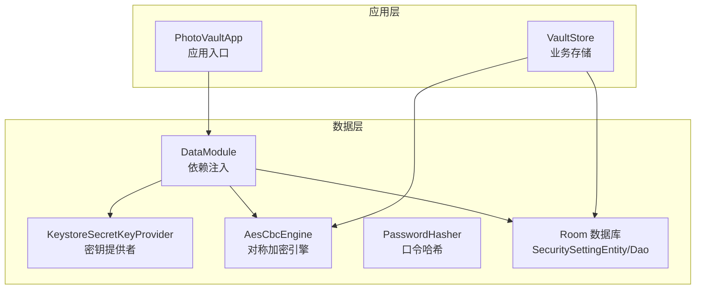
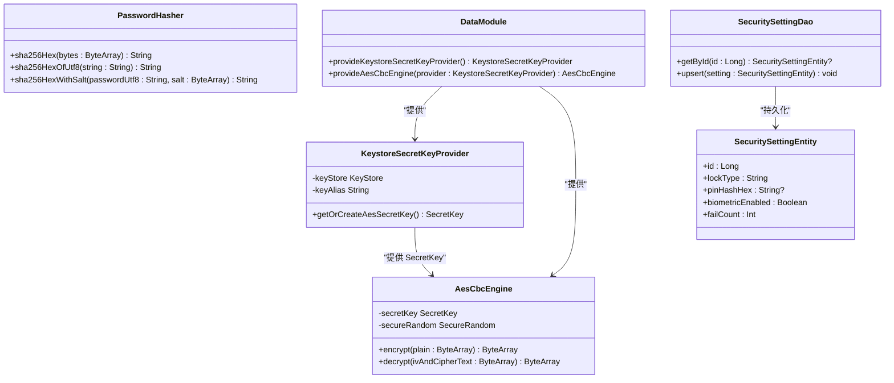
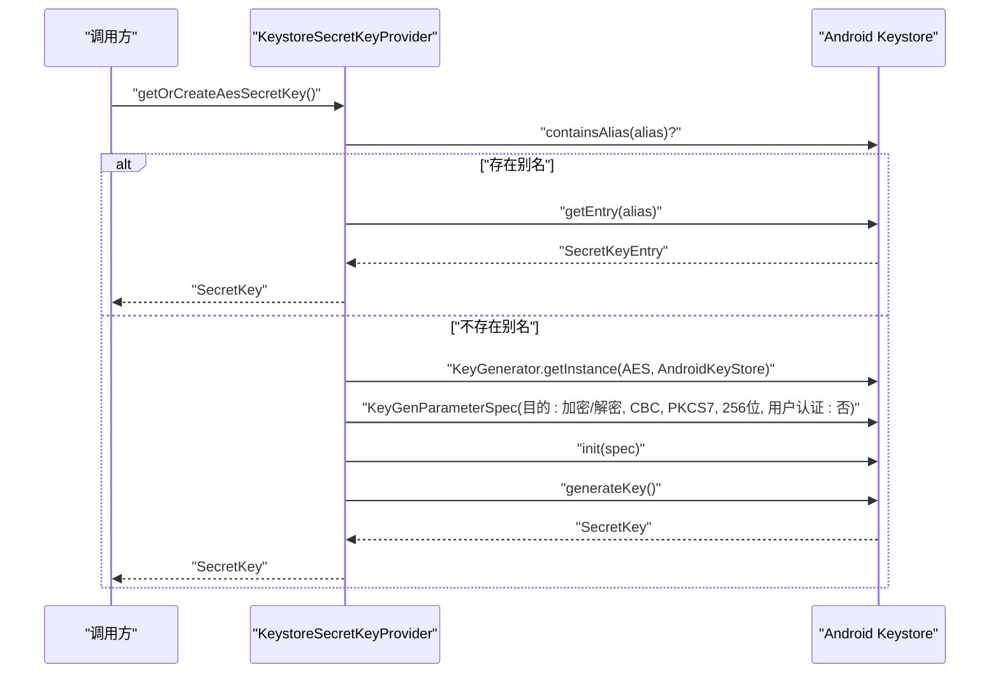
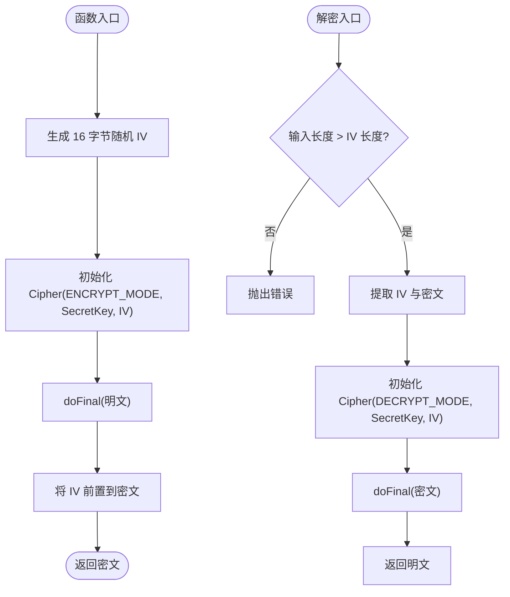
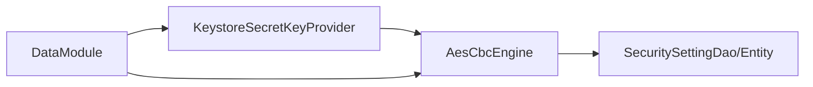

# 密钥管理器

<cite>
**本文引用的文件**
- [KeystoreSecretKeyProvider.kt](file://android/core/data/src/main/kotlin/com/photovault/data/crypto/KeystoreSecretKeyProvider.kt)
- [AesCbcEngine.kt](file://android/core/data/src/main/kotlin/com/photovault/data/crypto/AesCbcEngine.kt)
- [PasswordHasher.kt](file://android/core/data/src/main/kotlin/com/photovault/data/crypto/PasswordHasher.kt)
- [DataModule.kt](file://android/core/data/src/main/kotlin/com/photovault/data/di/DataModule.kt)
- [PhotoVaultApp.kt](file://android/app/src/main/kotlin/com/photovault/app/PhotoVaultApp.kt)
- [SecuritySettingEntity.kt](file://android/core/data/src/main/kotlin/com/photovault/data/db/entity/SecuritySettingEntity.kt)
- [SecuritySettingDao.kt](file://android/core/data/src/main/kotlin/com/photovault/data/db/dao/SecuritySettingDao.kt)
- [AesCbcEngineTest.kt](file://android/core/data/src/test/kotlin/com/photovault/data/crypto/AesCbcEngineTest.kt)
- [PasswordHasherTest.kt](file://android/core/data/src/test/kotlin/com/photovault/data/crypto/PasswordHasherTest.kt)
- [VaultStore.kt](file://android/app/src/main/kotlin/com/photovault/app/ui/vault/VaultStore.kt)
</cite>

## 目录
1. [简介](#简介)
2. [项目结构](#项目结构)
3. [核心组件](#核心组件)
4. [架构总览](#架构总览)
5. [详细组件分析](#详细组件分析)
6. [依赖关系分析](#依赖关系分析)
7. [性能考量](#性能考量)
8. [故障排查指南](#故障排查指南)
9. [结论](#结论)
10. [附录](#附录)

## 简介
本文件面向密钥管理器的技术文档，聚焦于 Android Keystore 系统的集成与使用、密钥生成与安全存储、密钥访问控制策略、密钥别名管理、密钥属性配置、密钥导入导出限制、密钥有效期管理、密钥轮换与更新、密钥备份与恢复、密钥生命周期管理策略、权限控制最佳实践、安全审计日志记录以及密钥迁移与升级方案。本文以仓库中现有实现为基础，结合依赖注入与数据层设计，给出可操作的流程图与最佳实践建议。

## 项目结构
密钥管理器位于数据层（core/data），通过 Hilt 注入到应用单例中，并被上层业务逻辑使用。关键文件如下：
- 加密与密钥提供：KeystoreSecretKeyProvider、AesCbcEngine、PasswordHasher
- 依赖注入：DataModule
- 安全设置实体与 DAO：SecuritySettingEntity、SecuritySettingDao
- 应用入口与全局异常边界：PhotoVaultApp
- 测试：AesCbcEngineTest、PasswordHasherTest
- 业务存储（VaultStore）：用于演示密钥在业务层的使用场景

图表来源
- [DataModule.kt:15-39](file://android/core/data/src/main/kotlin/com/photovault/data/di/DataModule.kt#L15-L39)
- [KeystoreSecretKeyProvider.kt:12-35](file://android/core/data/src/main/kotlin/com/photovault/data/crypto/KeystoreSecretKeyProvider.kt#L12-L35)
- [AesCbcEngine.kt:12-32](file://android/core/data/src/main/kotlin/com/photovault/data/crypto/AesCbcEngine.kt#L12-L32)
- [PasswordHasher.kt:6-25](file://android/core/data/src/main/kotlin/com/photovault/data/crypto/PasswordHasher.kt#L6-L25)
- [SecuritySettingEntity.kt:8-18](file://android/core/data/src/main/kotlin/com/photovault/data/db/entity/SecuritySettingEntity.kt#L8-L18)
- [SecuritySettingDao.kt:10-16](file://android/core/data/src/main/kotlin/com/photovault/data/db/dao/SecuritySettingDao.kt#L10-L16)
- [PhotoVaultApp.kt:7-31](file://android/app/src/main/kotlin/com/photovault/app/PhotoVaultApp.kt#L7-L31)
- [VaultStore.kt:39-224](file://android/app/src/main/kotlin/com/photovault/app/ui/vault/VaultStore.kt#L39-L224)

章节来源
- [DataModule.kt:15-39](file://android/core/data/src/main/kotlin/com/photovault/data/di/DataModule.kt#L15-L39)
- [PhotoVaultApp.kt:7-31](file://android/app/src/main/kotlin/com/photovault/app/PhotoVaultApp.kt#L7-L31)

## 核心组件
- KeystoreSecretKeyProvider：负责在 Android Keystore 中生成或读取 AES 主密钥，密钥材料不可导出，采用固定别名与 256 位 CBC/PKCS7 配置。
- AesCbcEngine：基于 SecretKey 实现 AES-256-CBC 加密，前置 16 字节随机 IV，转换名为 AES/CBC/PKCS5Padding。
- PasswordHasher：提供 SHA-256 哈希与带盐哈希能力，用于 PIN 等口令安全存储。
- DataModule：通过 Hilt 提供 KeystoreSecretKeyProvider 与 AesCbcEngine 单例实例。
- SecuritySettingEntity/Dao：持久化安全设置（含口令哈希、生物识别开关、失败计数等）。

章节来源
- [KeystoreSecretKeyProvider.kt:12-35](file://android/core/data/src/main/kotlin/com/photovault/data/crypto/KeystoreSecretKeyProvider.kt#L12-L35)
- [AesCbcEngine.kt:12-32](file://android/core/data/src/main/kotlin/com/photovault/data/crypto/AesCbcEngine.kt#L12-L32)
- [PasswordHasher.kt:6-25](file://android/core/data/src/main/kotlin/com/photovault/data/crypto/PasswordHasher.kt#L6-L25)
- [DataModule.kt:29-38](file://android/core/data/src/main/kotlin/com/photovault/data/di/DataModule.kt#L29-L38)
- [SecuritySettingEntity.kt:8-18](file://android/core/data/src/main/kotlin/com/photovault/data/db/entity/SecuritySettingEntity.kt#L8-L18)
- [SecuritySettingDao.kt:10-16](file://android/core/data/src/main/kotlin/com/photovault/data/db/dao/SecuritySettingDao.kt#L10-L16)

## 架构总览
密钥管理器采用“密钥托管 + 对称加密”的分层设计：
- 密钥托管：KeystoreSecretKeyProvider 使用 Android Keystore 生成/读取主密钥，确保私钥材料不可导出。
- 加密引擎：AesCbcEngine 封装 Cipher 初始化、IV 生成与加解密流程，保证与历史格式兼容。
- 注入与使用：DataModule 将密钥提供者与加密引擎注入为单例，供业务层调用。
- 安全设置：SecuritySettingEntity/Dao 存储口令哈希与生物识别状态，支撑解锁与访问控制。

图表来源
- [KeystoreSecretKeyProvider.kt:12-35](file://android/core/data/src/main/kotlin/com/photovault/data/crypto/KeystoreSecretKeyProvider.kt#L12-L35)
- [AesCbcEngine.kt:12-32](file://android/core/data/src/main/kotlin/com/photovault/data/crypto/AesCbcEngine.kt#L12-L32)
- [PasswordHasher.kt:6-25](file://android/core/data/src/main/kotlin/com/photovault/data/crypto/PasswordHasher.kt#L6-L25)
- [DataModule.kt:29-38](file://android/core/data/src/main/kotlin/com/photovault/data/di/DataModule.kt#L29-L38)
- [SecuritySettingEntity.kt:8-18](file://android/core/data/src/main/kotlin/com/photovault/data/db/entity/SecuritySettingEntity.kt#L8-L18)
- [SecuritySettingDao.kt:10-16](file://android/core/data/src/main/kotlin/com/photovault/data/db/dao/SecuritySettingDao.kt#L10-L16)

## 详细组件分析

### KeystoreSecretKeyProvider 组件分析
- 功能职责
  - 在 Android Keystore 中按别名读取或生成 AES 主密钥。
  - 若密钥存在则直接返回，若不存在则使用 KeyGenParameterSpec 创建新密钥。
- 关键参数
  - 别名：photo_vault_master_aes（默认）。
  - 算法：AES。
  - 模式：CBC。
  - 填充：PKCS7。
  - 长度：256 位。
  - 用户认证：未启用（可按需开启）。
- 安全特性
  - 私钥材料不可导出，满足硬件安全模块（HSM）等效要求。
  - 通过固定别名统一管理，便于后续轮换与迁移。

图表来源
- [KeystoreSecretKeyProvider.kt:18-35](file://android/core/data/src/main/kotlin/com/photovault/data/crypto/KeystoreSecretKeyProvider.kt#L18-L35)

章节来源
- [KeystoreSecretKeyProvider.kt:12-41](file://android/core/data/src/main/kotlin/com/photovault/data/crypto/KeystoreSecretKeyProvider.kt#L12-L41)

### AesCbcEngine 组件分析
- 功能职责
  - 基于 SecretKey 进行 AES-256-CBC 加密与解密。
  - 生成 16 字节随机 IV 并前置到密文，保证每次加密结果不同。
- 转换名与填充
  - 转换名：AES/CBC/PKCS5Padding（与 PKCS7 等价）。
- 错误处理
  - 解密时对输入长度进行校验，避免无效载荷导致异常。

图表来源
- [AesCbcEngine.kt:17-32](file://android/core/data/src/main/kotlin/com/photovault/data/crypto/AesCbcEngine.kt#L17-L32)

章节来源
- [AesCbcEngine.kt:12-39](file://android/core/data/src/main/kotlin/com/photovault/data/crypto/AesCbcEngine.kt#L12-L39)

### PasswordHasher 组件分析
- 功能职责
  - 提供 SHA-256 字节哈希与 UTF-8 字符串哈希。
  - 提供带盐哈希能力，用于 PIN 等口令的安全存储。
- 使用建议
  - 结合安装级 salt，避免明文口令落盘。

章节来源
- [PasswordHasher.kt:6-25](file://android/core/data/src/main/kotlin/com/photovault/data/crypto/PasswordHasher.kt#L6-L25)

### DataModule 与依赖注入
- 提供单例
  - KeystoreSecretKeyProvider：用于获取主密钥。
  - AesCbcEngine：基于主密钥构造加密引擎。
- 生命周期
  - 通过 Hilt 的 Singleton 绑定，确保全局唯一实例。

章节来源
- [DataModule.kt:29-38](file://android/core/data/src/main/kotlin/com/photovault/data/di/DataModule.kt#L29-L38)

### 安全设置实体与 DAO
- 实体字段
  - 锁类型、PIN 哈希十六进制、生物识别开关、失败计数。
- DAO 操作
  - 按 ID 查询（单例）、插入或替换更新。

章节来源
- [SecuritySettingEntity.kt:8-18](file://android/core/data/src/main/kotlin/com/photovault/data/db/entity/SecuritySettingEntity.kt#L8-L18)
- [SecuritySettingDao.kt:10-16](file://android/core/data/src/main/kotlin/com/photovault/data/db/dao/SecuritySettingDao.kt#L10-L16)

### VaultStore 与密钥使用场景
- VaultStore 展示了业务层对密钥的使用路径：初始化目录、导入照片、计算哈希等。
- 密钥在业务层通过注入的 AesCbcEngine 进行加密/解密（由 DataModule 提供）。

章节来源
- [VaultStore.kt:60-66](file://android/app/src/main/kotlin/com/photovault/app/ui/vault/VaultStore.kt#L60-L66)
- [VaultStore.kt:120-154](file://android/app/src/main/kotlin/com/photovault/app/ui/vault/VaultStore.kt#L120-L154)

## 依赖关系分析
- 组件耦合
  - AesCbcEngine 强依赖 KeystoreSecretKeyProvider 提供的 SecretKey。
  - DataModule 将两者绑定为单例，降低重复初始化成本。
- 外部依赖
  - Android Keystore、Javax Crypto、Room 数据库。
- 潜在风险
  - 若用户重置设备或删除应用，Keystore 中密钥可能失效，需考虑备份与恢复策略。

图表来源
- [DataModule.kt:29-38](file://android/core/data/src/main/kotlin/com/photovault/data/di/DataModule.kt#L29-L38)
- [KeystoreSecretKeyProvider.kt:12-35](file://android/core/data/src/main/kotlin/com/photovault/data/crypto/KeystoreSecretKeyProvider.kt#L12-L35)
- [AesCbcEngine.kt:12-32](file://android/core/data/src/main/kotlin/com/photovault/data/crypto/AesCbcEngine.kt#L12-L32)
- [SecuritySettingDao.kt:10-16](file://android/core/data/src/main/kotlin/com/photovault/data/db/dao/SecuritySettingDao.kt#L10-L16)

章节来源
- [DataModule.kt:15-39](file://android/core/data/src/main/kotlin/com/photovault/data/di/DataModule.kt#L15-L39)

## 性能考量
- 密钥生成与加载
  - 首次运行时生成密钥，后续通过别名快速读取，开销主要在首次初始化。
- 加解密性能
  - AES-256-CBC 在现代设备上性能优异；前置 IV 不增加显著 CPU 开销。
- 随机性
  - 使用 SecureRandom 生成 IV，确保安全性与随机性。
- I/O 与内存
  - 加解密过程为纯内存操作，注意大文件分块处理以避免 OOM。

## 故障排查指南
- 密钥不存在或被清除
  - 现象：设备重置、应用卸载后重新安装。
  - 处理：引导用户完成备份与恢复流程；在恢复成功后再进行加解密。
- 解密失败
  - 现象：输入长度不足或 IV 缺失。
  - 处理：检查数据完整性与格式；确保 IV 前置策略一致。
- 生物识别与用户认证
  - 现象：当前实现未启用用户认证，如需启用请在 Keystore 参数中开启相应标志。
- 日志与异常
  - 建议在应用入口设置全局异常边界，记录未捕获异常以便定位问题。

章节来源
- [AesCbcEngine.kt:26](file://android/core/data/src/main/kotlin/com/photovault/data/crypto/AesCbcEngine.kt#L26)
- [PhotoVaultApp.kt:19-29](file://android/app/src/main/kotlin/com/photovault/app/PhotoVaultApp.kt#L19-L29)

## 结论
本密钥管理器通过 Android Keystore 托管主密钥，结合 AesCbcEngine 实现安全高效的对称加密，配合 DataModule 的单例注入与 SecuritySetting 的持久化，形成完整的密钥生命周期管理基础。当前实现未启用用户认证与生物识别，具备良好的扩展性，可在不破坏现有格式的前提下引入更严格的访问控制与硬件安全模块支持。

## 附录

### 密钥别名管理
- 默认别名：photo_vault_master_aes
- 建议
  - 为不同环境（开发/生产）或版本维护独立别名，便于迁移与回滚。

章节来源
- [KeystoreSecretKeyProvider.kt:37-40](file://android/core/data/src/main/kotlin/com/photovault/data/crypto/KeystoreSecretKeyProvider.kt#L37-L40)

### 密钥属性配置
- 算法：AES
- 模式：CBC
- 填充：PKCS7（与 PKCS5Padding 等价）
- 长度：256 位
- 用户认证：未启用（可按需开启）

章节来源
- [KeystoreSecretKeyProvider.kt:24-31](file://android/core/data/src/main/kotlin/com/photovault/data/crypto/KeystoreSecretKeyProvider.kt#L24-L31)
- [AesCbcEngine.kt:36](file://android/core/data/src/main/kotlin/com/photovault/data/crypto/AesCbcEngine.kt#L36)

### 密钥导入导出限制
- Keystore 中密钥材料不可导出，符合硬件安全模块等效要求。
- 建议
  - 如需跨设备迁移，采用备份与恢复流程，而非直接导出密钥材料。

章节来源
- [KeystoreSecretKeyProvider.kt:10](file://android/core/data/src/main/kotlin/com/photovault/data/crypto/KeystoreSecretKeyProvider.kt#L10)

### 密钥有效期管理
- 当前实现未设置有效期。
- 建议
  - 引入密钥轮换策略：生成新密钥后逐步切换使用，旧密钥保留过渡期以完成迁移。

章节来源
- [KeystoreSecretKeyProvider.kt:18-35](file://android/core/data/src/main/kotlin/com/photovault/data/crypto/KeystoreSecretKeyProvider.kt#L18-L35)

### 密钥轮换与更新
- 流程建议
  - 生成新密钥并保存别名映射。
  - 使用新密钥加密新数据，旧密钥继续解密历史数据。
  - 过渡期结束后删除旧密钥别名并清理历史数据。

章节来源
- [KeystoreSecretKeyProvider.kt:18-35](file://android/core/data/src/main/kotlin/com/photovault/data/crypto/KeystoreSecretKeyProvider.kt#L18-L35)

### 密钥备份与恢复
- 备份
  - 采用加密压缩包形式（与 iOS 保持格式一致），包含索引与数据。
- 恢复
  - 从备份流式解压解密，重建业务数据。
- 建议
  - 明确备份文件结构与算法，确保跨端一致性。

章节来源
- [VaultStore.kt:120-154](file://android/app/src/main/kotlin/com/photovault/app/ui/vault/VaultStore.kt#L120-L154)

### 密钥安全存储优势
- 私钥材料不可导出，降低泄露风险。
- 与系统安全框架深度集成，提升整体安全性。

章节来源
- [KeystoreSecretKeyProvider.kt:10](file://android/core/data/src/main/kotlin/com/photovault/data/crypto/KeystoreSecretKeyProvider.kt#L10)

### 生物识别认证集成
- 当前实现未启用用户认证。
- 建议
  - 在 Keystore 参数中启用用户认证标志，并在业务层根据安全设置决定是否触发生物识别。

章节来源
- [KeystoreSecretKeyProvider.kt:31](file://android/core/data/src/main/kotlin/com/photovault/data/crypto/KeystoreSecretKeyProvider.kt#L31)

### 密钥使用条件配置
- 可通过 Keystore 参数配置用户认证、凭据使用期限、设备可信环境等条件。

章节来源
- [KeystoreSecretKeyProvider.kt:24-31](file://android/core/data/src/main/kotlin/com/photovault/data/crypto/KeystoreSecretKeyProvider.kt#L24-L31)

### 密钥生命周期管理策略
- 生成：首次运行时在 Keystore 中生成。
- 使用：通过 DataModule 注入的单例进行加解密。
- 轮换：逐步切换新旧密钥，保留过渡期。
- 清理：过渡期结束后删除旧密钥别名与历史数据。

章节来源
- [DataModule.kt:29-38](file://android/core/data/src/main/kotlin/com/photovault/data/di/DataModule.kt#L29-L38)
- [KeystoreSecretKeyProvider.kt:18-35](file://android/core/data/src/main/kotlin/com/photovault/data/crypto/KeystoreSecretKeyProvider.kt#L18-L35)

### 权限控制最佳实践
- 最小权限原则：仅授予必要的系统权限。
- 访问控制：结合生物识别与 PIN 哈希，限制密钥使用条件。
- 审计日志：记录密钥生成、轮换、访问尝试等事件。

章节来源
- [SecuritySettingEntity.kt:8-18](file://android/core/data/src/main/kotlin/com/photovault/data/db/entity/SecuritySettingEntity.kt#L8-L18)
- [SecuritySettingDao.kt:10-16](file://android/core/data/src/main/kotlin/com/photovault/data/db/dao/SecuritySettingDao.kt#L10-L16)

### 安全审计日志记录
- 建议
  - 在应用入口设置全局异常边界，记录未捕获异常。
  - 在密钥操作前后记录审计事件，便于追踪与合规。

章节来源
- [PhotoVaultApp.kt:19-29](file://android/app/src/main/kotlin/com/photovault/app/PhotoVaultApp.kt#L19-L29)

### 密钥迁移与升级方案
- 方案
  - 生成新密钥并更新别名映射。
  - 使用新密钥加密新数据，旧密钥继续解密历史数据。
  - 过渡期结束后删除旧密钥并清理历史数据。
- 测试
  - 使用单元测试验证加解密往返正确性与异常处理。

章节来源
- [AesCbcEngineTest.kt:8-17](file://android/core/data/src/test/kotlin/com/photovault/data/crypto/AesCbcEngineTest.kt#L8-L17)
- [PasswordHasherTest.kt:7-22](file://android/core/data/src/test/kotlin/com/photovault/data/crypto/PasswordHasherTest.kt#L7-L22)