# 备份恢复系统

<cite>
**本文引用的文件**
- [LocalBackupMvpService.kt](file://android/app/src/main/kotlin/com/xpx/vault/ui/backup/LocalBackupMvpService.kt)
- [AutoBackupScheduler.kt](file://android/app/src/main/kotlin/com/xpx/vault/ui/backup/AutoBackupScheduler.kt)
- [AutoIncrementalBackupWorker.kt](file://android/app/src/main/kotlin/com/xpx/vault/ui/backup/AutoIncrementalBackupWorker.kt)
- [BackupRuntimeState.kt](file://android/app/src/main/kotlin/com/xpx/vault/ui/backup/BackupRuntimeState.kt)
- [BackupProgressScreen.kt](file://android/app/src/main/kotlin/com/xpx/vault/ui/BackupProgressScreen.kt)
- [RestoreProgressScreen.kt](file://android/app/src/main/kotlin/com/xpx/vault/ui/RestoreProgressScreen.kt)
- [BackupRestoreScreen.kt](file://android/app/src/main/kotlin/com/xpx/vault/ui/BackupRestoreScreen.kt)
- [BackupResultScreen.kt](file://android/app/src/main/kotlin/com/xpx/vault/ui/BackupResultScreen.kt)
- [RestoreResultScreen.kt](file://android/app/src/main/kotlin/com/xpx/vault/ui/RestoreResultScreen.kt)
- [BackupPackageV1.kt](file://android/app/src/main/kotlin/com/xpx/vault/ui/backup/BackupPackageV1.kt)
- [BackupSecretsStore.kt](file://android/app/src/main/kotlin/com/xpx/vault/ui/backup/BackupSecretsStore.kt)
- [ExternalBackupLocation.kt](file://android/app/src/main/kotlin/com/xpx/vault/ui/backup/ExternalBackupLocation.kt)
- [BackupMeta.kt](file://android/app/src/main/kotlin/com/xpx/vault/ui/backup/BackupMeta.kt)
- [BackupKeyManager.kt](file://android/core/data/src/main/kotlin/com/xpx/vault/data/crypto/BackupKeyManager.kt)
- [Argon2idKdf.kt](file://android/core/data/src/main/kotlin/com/xpx/vault/data/crypto/Argon2idKdf.kt)
- [AesCbcEngine.kt](file://android/core/data/src/main/kotlin/com/xpx/vault/data/crypto/AesCbcEngine.kt)
- [KeystoreSecretKeyProvider.kt](file://android/core/data/src/main/kotlin/com/xpx/vault/data/crypto/KeystoreSecretKeyProvider.kt)
- [PasswordHasher.kt](file://android/core/data/src/main/kotlin/com/xpx/vault/data/crypto/PasswordHasher.kt)
- [VaultCipher.kt](file://android/core/data/src/main/kotlin/com/xpx/vault/data/crypto/VaultCipher.kt)
- [PhotoVaultDatabase.kt](file://android/core/data/src/main/kotlin/com/xpx/vault/data/db/PhotoVaultDatabase.kt)
- [AlbumDao.kt](file://android/core/data/src/main/kotlin/com/xpx/vault/data/db/dao/AlbumDao.kt)
- [PhotoAssetEntity.kt](file://android/core/data/src/main/kotlin/com/xpx/vault/data/db/entity/PhotoAssetEntity.kt)
- [Theme.kt](file://android/app/src/main/kotlin/com/xpx/vault/ui/theme/Theme.kt)
</cite>

## 更新摘要
**变更内容**
- 从原有的AES-CBC备份系统全面升级为全新的双键备份系统
- 引入BackupPackageV1格式，支持AES-256-GCM加密和Argon2id密钥派生
- 新增BackupSecretsStore密钥缓存机制，支持外部存储位置管理
- 实现双密钥架构：Vault主密钥（Keystore）+ 备份密钥（Argon2id派生）
- **新增加密内容备份恢复流程支持**：LocalBackupMvpService现已支持加密vault内容的备份和恢复，包括解密计算SHA-256哈希、流式解密到临时文件、加密恢复等功能
- 支持外部存储、原子覆盖写入、自动清理等高级功能
- 更新所有UI界面以适配新的备份流程和状态管理

## 目录
1. [简介](#简介)
2. [项目结构](#项目结构)
3. [核心组件](#核心组件)
4. [架构总览](#架构总览)
5. [详细组件分析](#详细组件分析)
6. [依赖分析](#依赖分析)
7. [性能考虑](#性能考虑)
8. [故障排除指南](#故障排除指南)
9. [结论](#结论)
10. [附录](#附录)

## 简介
本文件面向"AI照片保险库"的全新双键备份与恢复系统，聚焦以下目标：
- 深入解释双键备份机制的设计原理、BackupPackageV1格式、恢复流程的完整实现
- 详解六个关键界面：BackupRestoreScreen的备份入口、BackupProgressScreen的备份进度、BackupResultScreen的备份结果、RestoreProgressScreen的恢复进度、RestoreResultScreen的恢复结果处理
- **重点更新**：加密内容备份恢复流程，包括解密计算SHA-256哈希、流式解密到临时文件、加密恢复等功能
- 提供增量备份、全量备份、数据完整性校验、错误恢复机制的完整实现思路与参考路径
- 解释双密钥架构的安全存储、加密传输、压缩优化策略
- 给出备份策略配置、自动化备份、跨设备数据同步的可行方案
- 总结性能优化、用户体验设计与故障排除建议

## 项目结构
从仓库中可见，备份恢复功能已发展为完整的双键架构系统，分布在UI层、业务逻辑层与数据层三部分：
- UI层：提供用户交互界面，包括备份入口、进度显示、结果展示
- 业务逻辑层：LocalBackupMvpService提供完整的备份/恢复业务逻辑，现已支持加密vault内容
- 数据层：提供数据库实体、领域模型、加密工具与数据库定义，支撑备份数据的持久化与安全处理

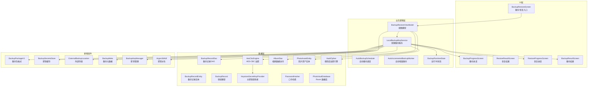

**图表来源**
- [LocalBackupMvpService.kt:30-67](file://android/app/src/main/kotlin/com/xpx/vault/ui/backup/LocalBackupMvpService.kt#L30-L67)
- [AutoBackupScheduler.kt:16-83](file://android/app/src/main/kotlin/com/xpx/vault/ui/backup/AutoBackupScheduler.kt#L16-L83)
- [AutoIncrementalBackupWorker.kt:7-15](file://android/app/src/main/kotlin/com/xpx/vault/ui/backup/AutoIncrementalBackupWorker.kt#L7-L15)
- [BackupRestoreScreen.kt:208-276](file://android/app/src/main/kotlin/com/xpx/vault/ui/BackupRestoreScreen.kt#L208-L276)
- [BackupProgressScreen.kt:40-127](file://android/app/src/main/kotlin/com/xpx/vault/ui/BackupProgressScreen.kt#L40-L127)
- [RestoreProgressScreen.kt:40-124](file://android/app/src/main/kotlin/com/xpx/vault/ui/RestoreProgressScreen.kt#L40-L124)
- [BackupResultScreen.kt:1-125](file://android/app/src/main/kotlin/com/xpx/vault/ui/BackupResultScreen.kt#L1-L125)
- [RestoreResultScreen.kt:1-122](file://android/app/src/main/kotlin/com/xpx/vault/ui/RestoreResultScreen.kt#L1-L122)
- [BackupPackageV1.kt:15-46](file://android/app/src/main/kotlin/com/xpx/vault/ui/backup/BackupPackageV1.kt#L15-L46)
- [BackupSecretsStore.kt:16-24](file://android/app/src/main/kotlin/com/xpx/vault/ui/backup/BackupSecretsStore.kt#L16-L24)
- [ExternalBackupLocation.kt:10-19](file://android/app/src/main/kotlin/com/xpx/vault/ui/backup/ExternalBackupLocation.kt#L10-L19)
- [BackupMeta.kt:10-26](file://android/app/src/main/kotlin/com/xpx/vault/ui/backup/BackupMeta.kt#L10-L26)
- [BackupKeyManager.kt:9-17](file://android/core/data/src/main/kotlin/com/xpx/vault/data/crypto/BackupKeyManager.kt#L9-L17)
- [Argon2idKdf.kt:11-17](file://android/core/data/src/main/kotlin/com/xpx/vault/data/crypto/Argon2idKdf.kt#L11-L17)
- [VaultCipher.kt:114-147](file://android/core/data/src/main/kotlin/com/xpx/vault/data/crypto/VaultCipher.kt#L114-L147)

**章节来源**
- [LocalBackupMvpService.kt:30-67](file://android/app/src/main/kotlin/com/xpx/vault/ui/backup/LocalBackupMvpService.kt#L30-L67)
- [AutoBackupScheduler.kt:16-83](file://android/app/src/main/kotlin/com/xpx/vault/ui/backup/AutoBackupScheduler.kt#L16-L83)
- [AutoIncrementalBackupWorker.kt:7-15](file://android/app/src/main/kotlin/com/xpx/vault/ui/backup/AutoIncrementalBackupWorker.kt#L7-L15)
- [BackupRestoreScreen.kt:208-276](file://android/app/src/main/kotlin/com/xpx/vault/ui/BackupRestoreScreen.kt#L208-L276)
- [BackupProgressScreen.kt:40-127](file://android/app/src/main/kotlin/com/xpx/vault/ui/BackupProgressScreen.kt#L40-L127)
- [RestoreProgressScreen.kt:40-124](file://android/app/src/main/kotlin/com/xpx/vault/ui/RestoreProgressScreen.kt#L40-L124)

## 核心组件
- **LocalBackupMvpService**：全新的双键备份服务，支持全量/增量备份、外部存储、原子覆盖写入，**现已支持加密vault内容的备份和恢复**
- **BackupPackageV1**：新的备份包格式，基于AES-256-GCM加密，支持Argon2id密钥派生
- **BackupSecretsStore**：备份密钥缓存机制，使用Android Keystore保护密钥材料
- **ExternalBackupLocation**：外部存储位置管理，支持SAF持久化和原子覆盖写入
- **BackupMeta**：备份元数据管理，跟踪自动备份状态和手动备份历史
- **BackupKeyManager**：密钥管理器，通过Argon2id从PIN口令派生备份密钥
- **Argon2idKdf**：Argon2id密钥派生算法，支持设备自适应参数调整
- **AutoBackupScheduler**：基于WorkManager的自动备份调度系统
- **AutoIncrementalBackupWorker**：CoroutineWorker实现的自动增量备份任务
- **BackupRuntimeState**：线程安全的运行时状态管理，保存最近的备份/恢复结果
- **VaultCipher**：保险库加密引擎，支持流式解密和推送模式加密，用于加密内容备份恢复

**章节来源**
- [LocalBackupMvpService.kt:30-67](file://android/app/src/main/kotlin/com/xpx/vault/ui/backup/LocalBackupMvpService.kt#L30-L67)
- [BackupPackageV1.kt:15-46](file://android/app/src/main/kotlin/com/xpx/vault/ui/backup/BackupPackageV1.kt#L15-L46)
- [BackupSecretsStore.kt:16-24](file://android/app/src/main/kotlin/com/xpx/vault/ui/backup/BackupSecretsStore.kt#L16-L24)
- [ExternalBackupLocation.kt:10-19](file://android/app/src/main/kotlin/com/xpx/vault/ui/backup/ExternalBackupLocation.kt#L10-L19)
- [BackupMeta.kt:10-26](file://android/app/src/main/kotlin/com/xpx/vault/ui/backup/BackupMeta.kt#L10-L26)
- [BackupKeyManager.kt:9-17](file://android/core/data/src/main/kotlin/com/xpx/vault/data/crypto/BackupKeyManager.kt#L9-L17)
- [Argon2idKdf.kt:11-17](file://android/core/data/src/main/kotlin/com/xpx/vault/data/crypto/Argon2idKdf.kt#L11-L17)
- [AutoBackupScheduler.kt:16-83](file://android/app/src/main/kotlin/com/xpx/vault/ui/backup/AutoBackupScheduler.kt#L16-L83)
- [AutoIncrementalBackupWorker.kt:7-15](file://android/app/src/main/kotlin/com/xpx/vault/ui/backup/AutoIncrementalBackupWorker.kt#L7-L15)
- [BackupRuntimeState.kt:3-9](file://android/app/src/main/kotlin/com/xpx/vault/ui/backup/BackupRuntimeState.kt#L3-L9)
- [VaultCipher.kt:114-147](file://android/core/data/src/main/kotlin/com/xpx/vault/data/crypto/VaultCipher.kt#L114-L147)

## 架构总览
备份恢复系统采用"界面层-业务逻辑层-数据层-加密与密钥"的完整分层设计，引入双键架构：
- 界面层负责用户交互与导航，提供备份入口、进度显示、结果展示
- 业务逻辑层通过LocalBackupMvpService实现完整的双键备份/恢复业务逻辑，**现已支持加密vault内容的备份和恢复**
- 自动化层通过AutoBackupScheduler和AutoIncrementalBackupWorker实现定时备份
- 数据层通过 Room 管理实体关系，支持备份记录与相册、照片资产等数据的持久化
- 加密与密钥管理保障备份文件在设备侧的安全性，采用双密钥架构

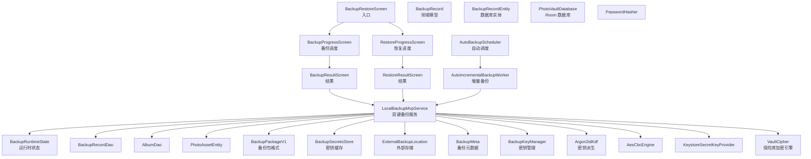

**图表来源**
- [LocalBackupMvpService.kt:30-67](file://android/app/src/main/kotlin/com/xpx/vault/ui/backup/LocalBackupMvpService.kt#L30-L67)
- [AutoBackupScheduler.kt:16-83](file://android/app/src/main/kotlin/com/xpx/vault/ui/backup/AutoBackupScheduler.kt#L16-L83)
- [AutoIncrementalBackupWorker.kt:7-15](file://android/app/src/main/kotlin/com/xpx/vault/ui/backup/AutoIncrementalBackupWorker.kt#L7-L15)
- [BackupRestoreScreen.kt:208-276](file://android/app/src/main/kotlin/com/xpx/vault/ui/BackupRestoreScreen.kt#L208-L276)
- [BackupProgressScreen.kt:40-127](file://android/app/src/main/kotlin/com/xpx/vault/ui/BackupProgressScreen.kt#L40-L127)
- [RestoreProgressScreen.kt:40-124](file://android/app/src/main/kotlin/com/xpx/vault/ui/RestoreProgressScreen.kt#L40-L124)
- [BackupResultScreen.kt:1-125](file://android/app/src/main/kotlin/com/xpx/vault/ui/BackupResultScreen.kt#L1-L125)
- [RestoreResultScreen.kt:1-122](file://android/app/src/main/kotlin/com/xpx/vault/ui/RestoreResultScreen.kt#L1-L122)
- [BackupPackageV1.kt:15-46](file://android/app/src/main/kotlin/com/xpx/vault/ui/backup/BackupPackageV1.kt#L15-L46)
- [BackupSecretsStore.kt:16-24](file://android/app/src/main/kotlin/com/xpx/vault/ui/backup/BackupSecretsStore.kt#L16-L24)
- [ExternalBackupLocation.kt:10-19](file://android/app/src/main/kotlin/com/xpx/vault/ui/backup/ExternalBackupLocation.kt#L10-L19)
- [BackupMeta.kt:10-26](file://android/app/src/main/kotlin/com/xpx/vault/ui/backup/BackupMeta.kt#L10-L26)
- [BackupKeyManager.kt:9-17](file://android/core/data/src/main/kotlin/com/xpx/vault/data/crypto/BackupKeyManager.kt#L9-L17)
- [Argon2idKdf.kt:11-17](file://android/core/data/src/main/kotlin/com/xpx/vault/data/crypto/Argon2idKdf.kt#L11-L17)
- [VaultCipher.kt:114-147](file://android/core/data/src/main/kotlin/com/xpx/vault/data/crypto/VaultCipher.kt#L114-L147)

## 详细组件分析

### 双键备份服务：LocalBackupMvpService
**更新** 全新的双键备份服务，替代原有的简单占位符实现，**现已支持加密vault内容的备份和恢复**

- **功能职责**
  - 实现完整的双键备份/恢复业务逻辑，包括全量/增量备份、外部存储、原子覆盖写入
  - 管理备份索引、清单文件、密钥派生与缓存
  - 提供备份导出/导入、自动清理、数据库记录同步等功能
  - **新增**：支持加密vault内容的备份和恢复，包括解密计算SHA-256哈希、流式解密到临时文件、加密恢复
- **核心特性**
  - 双密钥架构：Vault主密钥（Keystore）+ 备份密钥（Argon2id派生）
  - 外部存储支持：通过SAF管理备份文件位置
  - 原子覆盖写入：确保备份过程的可靠性
  - 增量备份：基于上次备份的指纹比较，仅备份变更数据
  - 数据完整性：SHA-256校验、GCM认证标签保护
  - **新增**：加密内容处理：通过VaultCipher流式解密vault内容，计算明文SHA-256，支持推送模式加密恢复
- **关键数据结构**
  - BackupPackageV1：新的备份包格式，支持AES-256-GCM加密
  - BackupSecretsStore：备份密钥缓存机制
  - ExternalBackupLocation：外部存储位置管理
  - BackupMeta：备份元数据管理
  - **新增**：VaultAsset：封装vault资产的相对路径、明文大小和SHA-256哈希

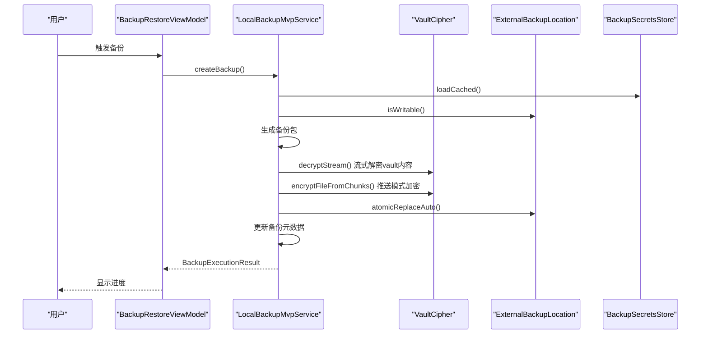

**图表来源**
- [LocalBackupMvpService.kt:46-67](file://android/app/src/main/kotlin/com/xpx/vault/ui/backup/LocalBackupMvpService.kt#L46-L67)
- [LocalBackupMvpService.kt:69-169](file://android/app/src/main/kotlin/com/xpx/vault/ui/backup/LocalBackupMvpService.kt#L69-L169)
- [LocalBackupMvpService.kt:171-270](file://android/app/src/main/kotlin/com/xpx/vault/ui/backup/LocalBackupMvpService.kt#L171-L270)
- [LocalBackupMvpService.kt:437-490](file://android/app/src/main/kotlin/com/xpx/vault/ui/backup/LocalBackupMvpService.kt#L437-L490)
- [LocalBackupMvpService.kt:498-522](file://android/app/src/main/kotlin/com/xpx/vault/ui/backup/LocalBackupMvpService.kt#L498-L522)

**章节来源**
- [LocalBackupMvpService.kt:30-67](file://android/app/src/main/kotlin/com/xpx/vault/ui/backup/LocalBackupMvpService.kt#L30-L67)
- [LocalBackupMvpService.kt:69-169](file://android/app/src/main/kotlin/com/xpx/vault/ui/backup/LocalBackupMvpService.kt#L69-L169)
- [LocalBackupMvpService.kt:171-270](file://android/app/src/main/kotlin/com/xpx/vault/ui/backup/LocalBackupMvpService.kt#L171-L270)
- [LocalBackupMvpService.kt:437-490](file://android/app/src/main/kotlin/com/xpx/vault/ui/backup/LocalBackupMvpService.kt#L437-L490)
- [LocalBackupMvpService.kt:498-522](file://android/app/src/main/kotlin/com/xpx/vault/ui/backup/LocalBackupMvpService.kt#L498-L522)

### 备份包格式：BackupPackageV1
**更新** 全新的备份包格式，替代原有的AES-CBC格式

- **功能职责**
  - 定义新的备份包结构，支持AES-256-GCM加密
  - 提供备份包的读写器，支持流式处理
  - 管理备份包头部信息，包括KDF参数和资产索引
- **核心特性**
  - 包结构：MAGIC标识 + 版本号 + 头部长度 + 头部JSON + 身体数据 + 尾部校验
  - ChunkFrame：IV + 密文长度 + 密文 + GCM标签
  - 头部字段：版本、备份ID、创建时间、类型、KDF参数、密钥指纹、加密算法、资产列表
  - 流式处理：支持大文件的分块加密和解密
  - **新增**：attachHeader()方法，支持注入已解析的头部信息，避免重复解析
- **关键数据结构**
  - HeaderBase：备份包头部基础信息
  - AssetHeader：单个资产的头部描述
  - Header：解析后的完整包头信息

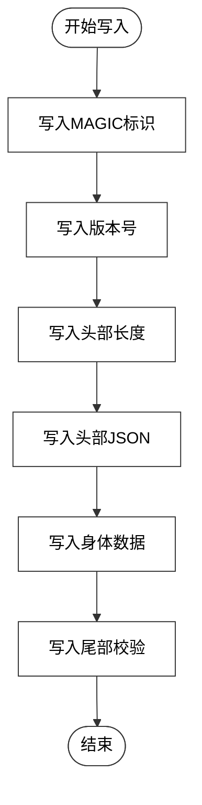

**图表来源**
- [BackupPackageV1.kt:18-29](file://android/app/src/main/kotlin/com/xpx/vault/ui/backup/BackupPackageV1.kt#L18-L29)
- [BackupPackageV1.kt:31-45](file://android/app/src/main/kotlin/com/xpx/vault/ui/backup/BackupPackageV1.kt#L31-L45)
- [BackupPackageV1.kt:250-277](file://android/app/src/main/kotlin/com/xpx/vault/ui/backup/BackupPackageV1.kt#L250-277)

**章节来源**
- [BackupPackageV1.kt:15-46](file://android/app/src/main/kotlin/com/xpx/vault/ui/backup/BackupPackageV1.kt#L15-L46)
- [BackupPackageV1.kt:67-103](file://android/app/src/main/kotlin/com/xpx/vault/ui/backup/BackupPackageV1.kt#L67-L103)
- [BackupPackageV1.kt:107-177](file://android/app/src/main/kotlin/com/xpx/vault/ui/backup/BackupPackageV1.kt#L107-L177)
- [BackupPackageV1.kt:179-222](file://android/app/src/main/kotlin/com/xpx/vault/ui/backup/BackupPackageV1.kt#L179-L222)
- [BackupPackageV1.kt:250-277](file://android/app/src/main/kotlin/com/xpx/vault/ui/backup/BackupPackageV1.kt#L250-277)

### 保险库加密引擎：VaultCipher
**更新** 新增的保险库加密引擎，支持流式解密和推送模式加密

- **功能职责**
  - 提供保险库数据的流式解密和推送模式加密
  - 支持推送模式加密：由调用方通过回调增量唤醒明文块，结构性地原子写入目标文件
  - 管理保险库主密钥的生成、加载和缓存
- **核心特性**
  - 流式解密：支持大文件的流式解密，避免内存溢出
  - 推送模式加密：支持从备份包reader拉取明文块，边解密边加密
  - 原子写入：加密完成后先写临时文件，再原子重命名
  - 线程安全：内部状态仅在密钥生成时同步，解密/加密本身无共享状态
- **关键数据结构**
  - encryptFileFromChunks()：推送模式加密，支持从备份包reader直接拉取明文
  - decryptStream()：流式解密，支持回调sink接收明文块
  - decryptToTempFile()：流式解密到临时文件

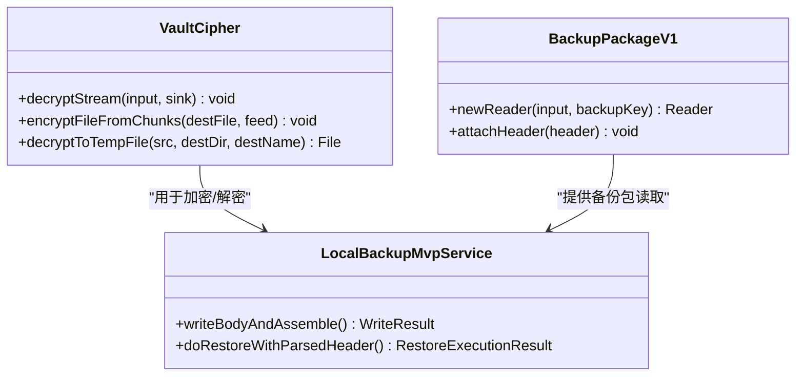

**图表来源**
- [VaultCipher.kt:78-98](file://android/core/data/src/main/kotlin/com/xpx/vault/data/crypto/VaultCipher.kt#L78-L98)
- [VaultCipher.kt:114-147](file://android/core/data/src/main/kotlin/com/xpx/vault/data/crypto/VaultCipher.kt#L114-L147)
- [VaultCipher.kt:158-169](file://android/core/data/src/main/kotlin/com/xpx/vault/data/crypto/VaultCipher.kt#L158-L169)
- [BackupPackageV1.kt:299-300](file://android/app/src/main/kotlin/com/xpx/vault/ui/backup/BackupPackageV1.kt#L299-L300)
- [BackupPackageV1.kt:250-258](file://android/app/src/main/kotlin/com/xpx/vault/ui/backup/BackupPackageV1.kt#L250-L258)

**章节来源**
- [VaultCipher.kt:19-303](file://android/core/data/src/main/kotlin/com/xpx/vault/data/crypto/VaultCipher.kt#L19-L303)
- [BackupPackageV1.kt:250-277](file://android/app/src/main/kotlin/com/xpx/vault/ui/backup/BackupPackageV1.kt#L250-L277)
- [LocalBackupMvpService.kt:345-394](file://android/app/src/main/kotlin/com/xpx/vault/ui/backup/LocalBackupMvpService.kt#L345-L394)

### 备份包格式：BackupPackageV1
**更新** 全新的备份包格式，替代原有的AES-CBC格式

- **功能职责**
  - 定义新的备份包结构，支持AES-256-GCM加密
  - 提供备份包的读写器，支持流式处理
  - 管理备份包头部信息，包括KDF参数和资产索引
- **核心特性**
  - 包结构：MAGIC标识 + 版本号 + 头部长度 + 头部JSON + 身体数据 + 尾部校验
  - ChunkFrame：IV + 密文长度 + 密文 + GCM标签
  - 头部字段：版本、备份ID、创建时间、类型、KDF参数、密钥指纹、加密算法、资产列表
  - 流式处理：支持大文件的分块加密和解密
  - **新增**：attachHeader()方法，支持注入已解析的头部信息，避免重复解析
- **关键数据结构**
  - HeaderBase：备份包头部基础信息
  - AssetHeader：单个资产的头部描述
  - Header：解析后的完整包头信息

**图表来源**
- [BackupPackageV1.kt:18-29](file://android/app/src/main/kotlin/com/xpx/vault/ui/backup/BackupPackageV1.kt#L18-L29)
- [BackupPackageV1.kt:31-45](file://android/app/src/main/kotlin/com/xpx/vault/ui/backup/BackupPackageV1.kt#L31-L45)
- [BackupPackageV1.kt:250-277](file://android/app/src/main/kotlin/com/xpx/vault/ui/backup/BackupPackageV1.kt#L250-277)

**章节来源**
- [BackupPackageV1.kt:15-46](file://android/app/src/main/kotlin/com/xpx/vault/ui/backup/BackupPackageV1.kt#L15-L46)
- [BackupPackageV1.kt:67-103](file://android/app/src/main/kotlin/com/xpx/vault/ui/backup/BackupPackageV1.kt#L67-L103)
- [BackupPackageV1.kt:107-177](file://android/app/src/main/kotlin/com/xpx/vault/ui/backup/BackupPackageV1.kt#L107-L177)
- [BackupPackageV1.kt:179-222](file://android/app/src/main/kotlin/com/xpx/vault/ui/backup/BackupPackageV1.kt#L179-L222)
- [BackupPackageV1.kt:250-277](file://android/app/src/main/kotlin/com/xpx/vault/ui/backup/BackupPackageV1.kt#L250-277)

### 密钥缓存机制：BackupSecretsStore
**更新** 新增的密钥缓存机制，替代原有的直接密钥使用

- **功能职责**
  - 使用Android Keystore中的独立AES-GCM包裹密钥保护备份密钥材料
  - 缓存备份密钥到私有目录，支持Worker快速访问
  - 提供密钥的缓存、加载、清理和销毁功能
- **核心特性**
  - 包裹密钥：使用Android Keystore生成的独立AES-GCM密钥
  - 缓存格式：IV + GCM密文，支持安全存储
  - 自动清理：解密失败时自动清空缓存文件
  - 完整重置：支持删除缓存和包裹密钥

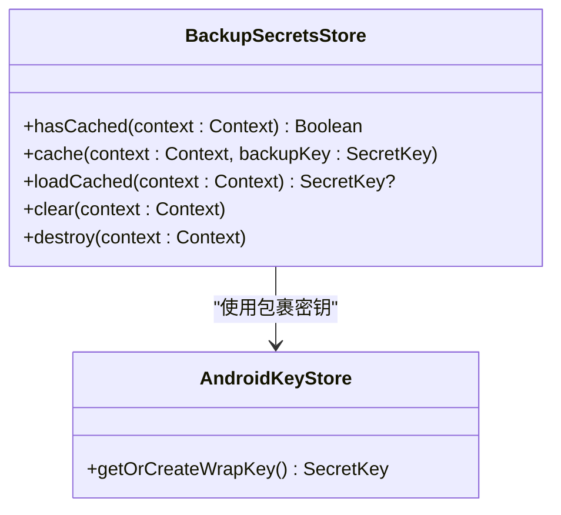

**图表来源**
- [BackupSecretsStore.kt:16-24](file://android/app/src/main/kotlin/com/xpx/vault/ui/backup/BackupSecretsStore.kt#L16-L24)
- [BackupSecretsStore.kt:95-116](file://android/app/src/main/kotlin/com/xpx/vault/ui/backup/BackupSecretsStore.kt#L95-L116)

**章节来源**
- [BackupSecretsStore.kt:16-24](file://android/app/src/main/kotlin/com/xpx/vault/ui/backup/BackupSecretsStore.kt#L16-L24)
- [BackupSecretsStore.kt:33-82](file://android/app/src/main/kotlin/com/xpx/vault/ui/backup/BackupSecretsStore.kt#L33-L82)
- [BackupSecretsStore.kt:84-117](file://android/app/src/main/kotlin/com/xpx/vault/ui/backup/BackupSecretsStore.kt#L84-L117)

### 外部存储管理：ExternalBackupLocation
**更新** 新增的外部存储位置管理，替代原有的内部存储

- **功能职责**
  - 通过SAF管理用户授权的外部存储目录
  - 支持原子覆盖写入，确保备份过程的可靠性
  - 提供自动备份和手动备份的不同文件命名策略
- **核心特性**
  - SAF持久化：通过takePersistableUriPermission持久化目录权限
  - 原子覆盖：使用`.writing` → 主文件 → `.bak`的三阶段原子替换
  - 文件命名：自动备份固定文件名，手动备份带时间戳和扩展名
  - 自检修复：启动时自动修复残留的临时文件
- **关键数据结构**
  - AUTO_FILE_NAME：自动备份文件名
  - TMP_FILE_NAME：临时写入文件名
  - BAK_FILE_NAME：备份文件名
  - MANUAL_EXTENSION：手动备份文件扩展名

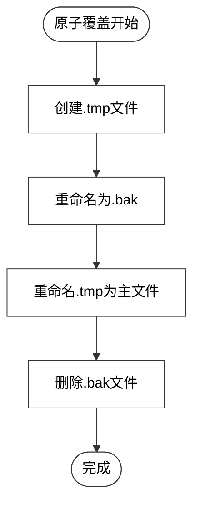

**图表来源**
- [ExternalBackupLocation.kt:109-179](file://android/app/src/main/kotlin/com/xpx/vault/ui/backup/ExternalBackupLocation.kt#L109-L179)

**章节来源**
- [ExternalBackupLocation.kt:10-19](file://android/app/src/main/kotlin/com/xpx/vault/ui/backup/ExternalBackupLocation.kt#L10-L19)
- [ExternalBackupLocation.kt:31-50](file://android/app/src/main/kotlin/com/xpx/vault/ui/backup/ExternalBackupLocation.kt#L31-L50)
- [ExternalBackupLocation.kt:63-107](file://android/app/src/main/kotlin/com/xpx/vault/ui/backup/ExternalBackupLocation.kt#L63-L107)
- [ExternalBackupLocation.kt:109-179](file://android/app/src/main/kotlin/com/xpx/vault/ui/backup/ExternalBackupLocation.kt#L109-L179)

### 备份元数据管理：BackupMeta
**更新** 新增的备份元数据管理，替代原有的简单记录

- **功能职责**
  - 管理备份元数据文件，跟踪自动备份状态和手动备份历史
  - 提供备份元数据的序列化和反序列化功能
  - 支持自动备份和手动备份的不同元数据结构
- **核心特性**
  - 结构设计：版本号 + 自动备份元数据 + 手动备份历史
  - 自动备份：包含最后备份ID、时间、密钥指纹、KDF参数、外部URI、资产索引
  - 手动备份：仅包含创建时间、URI、大小和备注信息
  - 历史管理：支持保留指定数量的手动备份历史
- **关键数据结构**
  - AutoMeta：自动备份元数据
  - AssetIndexEntry：资产索引条目
  - ManualEntry：手动备份条目
  - Snapshot：备份快照

**章节来源**
- [BackupMeta.kt:10-26](file://android/app/src/main/kotlin/com/xpx/vault/ui/backup/BackupMeta.kt#L10-L26)
- [BackupMeta.kt:31-56](file://android/app/src/main/kotlin/com/xpx/vault/ui/backup/BackupMeta.kt#L31-L56)
- [BackupMeta.kt:60-95](file://android/app/src/main/kotlin/com/xpx/vault/ui/backup/BackupMeta.kt#L60-L95)
- [BackupMeta.kt:115-161](file://android/app/src/main/kotlin/com/xpx/vault/ui/backup/BackupMeta.kt#L115-L161)

### 密钥管理器：BackupKeyManager
**更新** 全新的密钥管理器，替代原有的简单密钥处理

- **功能职责**
  - 通过Argon2id从PIN口令和设备盐派生AES-256备份密钥
  - 计算密钥指纹，用于判断备份密码是否变更
  - 管理KDF参数，支持设备自适应参数调整
- **核心特性**
  - KDF参数：算法名称、盐值、迭代次数、内存KB、并行度
  - 密钥指纹：HMAC-SHA256(backupKey, "aivault.fp.v1")[:16]
  - 设备自适应：根据设备内存自动选择参数
  - 参数持久化：KDF参数随备份包头一起持久化
- **关键数据结构**
  - KdfParams：KDF参数
  - BackupKeyMaterial：密钥材料（密钥 + 指纹 + 参数）

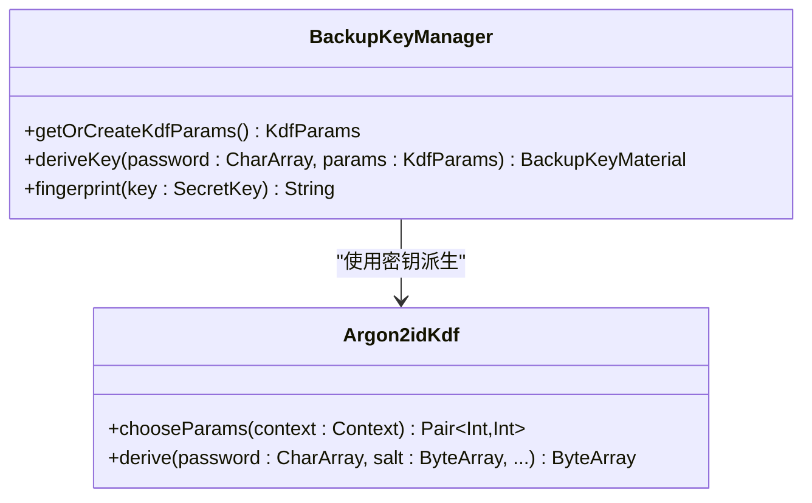

**图表来源**
- [BackupKeyManager.kt:9-17](file://android/core/data/src/main/kotlin/com/xpx/vault/data/crypto/BackupKeyManager.kt#L9-L17)
- [Argon2idKdf.kt:36-45](file://android/core/data/src/main/kotlin/com/xpx/vault/data/crypto/Argon2idKdf.kt#L36-L45)

**章节来源**
- [BackupKeyManager.kt:9-17](file://android/core/data/src/main/kotlin/com/xpx/vault/data/crypto/BackupKeyManager.kt#L9-L17)
- [BackupKeyManager.kt:40-77](file://android/core/data/src/main/kotlin/com/xpx/vault/data/crypto/BackupKeyManager.kt#L40-L77)
- [BackupKeyManager.kt:82-100](file://android/core/data/src/main/kotlin/com/xpx/vault/data/crypto/BackupKeyManager.kt#L82-L100)
- [BackupKeyManager.kt:102-108](file://android/core/data/src/main/kotlin/com/xpx/vault/data/crypto/BackupKeyManager.kt#L102-L108)

### Argon2id密钥派生：Argon2idKdf
**更新** 全新的密钥派生算法，替代原有的简单哈希

- **功能职责**
  - 提供Argon2id密钥派生算法的纯Java实现
  - 支持设备自适应参数选择，优化不同设备的性能
  - 管理口令和盐值的生命周期，确保内存安全
- **核心特性**
  - 默认参数：迭代次数3次，内存64MB，并行度1
  - 低端机降级：内存32MB，迭代次数4次
  - 参数选择：根据ActivityManager.memoryClass自动选择
  - 内存清理：使用完毕后立即清零中间字节数组
- **关键数据结构**
  - DEFAULT_ITERATIONS：默认迭代次数
  - DEFAULT_MEMORY_KB：默认内存大小（KB）
  - LOW_END_MEMORY_KB：低端机内存大小（KB）
  - LOW_END_ITERATIONS：低端机迭代次数

**章节来源**
- [Argon2idKdf.kt:11-17](file://android/core/data/src/main/kotlin/com/xpx/vault/data/crypto/Argon2idKdf.kt#L11-L17)
- [Argon2idKdf.kt:36-45](file://android/core/data/src/main/kotlin/com/xpx/vault/data/crypto/Argon2idKdf.kt#L36-L45)
- [Argon2idKdf.kt:57-84](file://android/core/data/src/main/kotlin/com/xpx/vault/data/crypto/Argon2idKdf.kt#L57-L84)

### 自动备份调度系统：AutoBackupScheduler
**更新** 新增基于WorkManager的自动备份调度系统

- **功能职责**
  - 管理自动备份的启用/禁用状态
  - 配置充电/空闲条件约束
  - 周期性调度增量备份任务
- **关键特性**
  - 基于SharedPreferences的状态管理
  - WorkManager周期性任务调度
  - 灵活的约束条件配置（电池状态、充电状态、设备空闲）

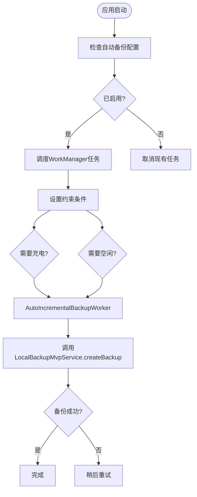

**图表来源**
- [AutoBackupScheduler.kt:17-31](file://android/app/src/main/kotlin/com/xpx/vault/ui/backup/AutoBackupScheduler.kt#L17-L31)
- [AutoBackupScheduler.kt:61-78](file://android/app/src/main/kotlin/com/xpx/vault/ui/backup/AutoBackupScheduler.kt#L61-L78)
- [AutoIncrementalBackupWorker.kt:11-14](file://android/app/src/main/kotlin/com/xpx/vault/ui/backup/AutoIncrementalBackupWorker.kt#L11-L14)

**章节来源**
- [AutoBackupScheduler.kt:16-83](file://android/app/src/main/kotlin/com/xpx/vault/ui/backup/AutoBackupScheduler.kt#L16-L83)
- [AutoIncrementalBackupWorker.kt:7-15](file://android/app/src/main/kotlin/com/xpx/vault/ui/backup/AutoIncrementalBackupWorker.kt#L7-L15)

### 运行时状态管理：BackupRuntimeState
**更新** 新增线程安全的运行时状态管理

- **功能职责**
  - 存储最近的备份执行结果
  - 存储最近的恢复执行结果
  - 提供线程安全的单例访问
- **关键特性**
  - volatile关键字确保内存可见性
  - 线程安全的单例模式
  - 支持UI层获取最新执行状态

**章节来源**
- [BackupRuntimeState.kt:3-9](file://android/app/src/main/kotlin/com/xpx/vault/ui/backup/BackupRuntimeState.kt#L3-L9)

### 备份进度界面：BackupProgressScreen
**更新** 新增完整的备份进度界面，提供实时进度反馈

- **功能职责**
  - 显示备份进行中的进度指示器
  - 提供延迟启动机制，避免界面闪烁
  - 处理备份过程中的错误状态
  - 支持用户取消操作
- **关键交互**
  - 自动启动备份任务
  - 实时监听备份状态变化
  - 错误弹窗提示与处理
  - 成功后的自动导航

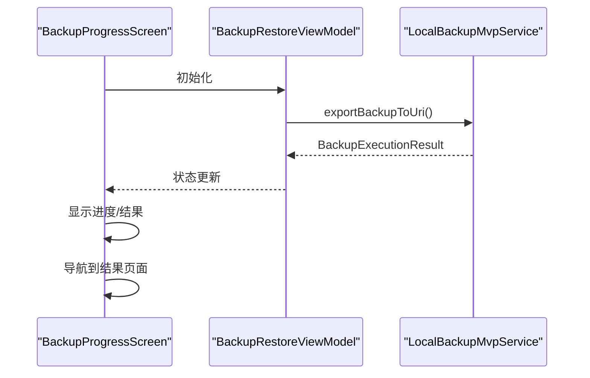

**图表来源**
- [BackupProgressScreen.kt:52-68](file://android/app/src/main/kotlin/com/xpx/vault/ui/BackupProgressScreen.kt#L52-L68)
- [BackupProgressScreen.kt:70-79](file://android/app/src/main/kotlin/com/xpx/vault/ui/BackupProgressScreen.kt#L70-L79)

**章节来源**
- [BackupProgressScreen.kt:40-127](file://android/app/src/main/kotlin/com/xpx/vault/ui/BackupProgressScreen.kt#L40-L127)

### 恢复进度界面：RestoreProgressScreen
**更新** 新增完整的恢复进度界面，提供实时进度反馈

- **功能职责**
  - 显示恢复进行中的进度指示器
  - 提供延迟启动机制，避免界面闪烁
  - 处理恢复过程中的错误状态
  - 支持用户取消操作
- **关键交互**
  - 自动启动恢复任务
  - 实时监听恢复状态变化
  - 错误弹窗提示与处理
  - 成功后的自动导航

**章节来源**
- [RestoreProgressScreen.kt:40-124](file://android/app/src/main/kotlin/com/xpx/vault/ui/RestoreProgressScreen.kt#L40-L124)

### 备份界面：BackupRestoreScreen
- **功能职责**
  - 提供"备份"和"恢复"两个入口卡片，分别导航到备份结果页与恢复结果页
  - 使用统一的主题样式与间距常量，保证视觉一致性
- **关键交互**
  - "备份"卡片点击后触发备份流程，并跳转至备份结果页
  - "恢复"卡片点击后触发恢复流程，并跳转至恢复结果页
- **设计要点**
  - 使用徽标图标与文案描述增强可发现性
  - 按钮采用主次变体区分优先级

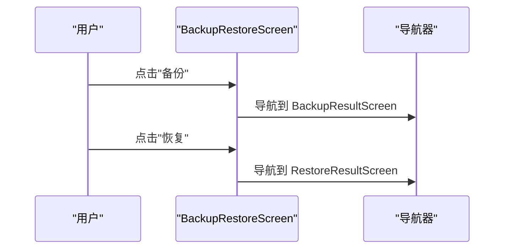

**图表来源**
- [BackupRestoreScreen.kt:104-115](file://android/app/src/main/kotlin/com/xpx/vault/ui/BackupRestoreScreen.kt#L104-L115)

**章节来源**
- [BackupRestoreScreen.kt:88-206](file://android/app/src/main/kotlin/com/xpx/vault/ui/BackupRestoreScreen.kt#L88-L206)

### 备份结果界面：BackupResultScreen
- **功能职责**
  - 展示备份成功状态与统计信息（如备份文件名、大小）
  - 提供完成按钮，返回上一界面
  - 显示最近的备份结果
- **关键元素**
  - 成功徽章与标题提示
  - 元信息行展示备份文件与大小
  - 统一样式与主题色系

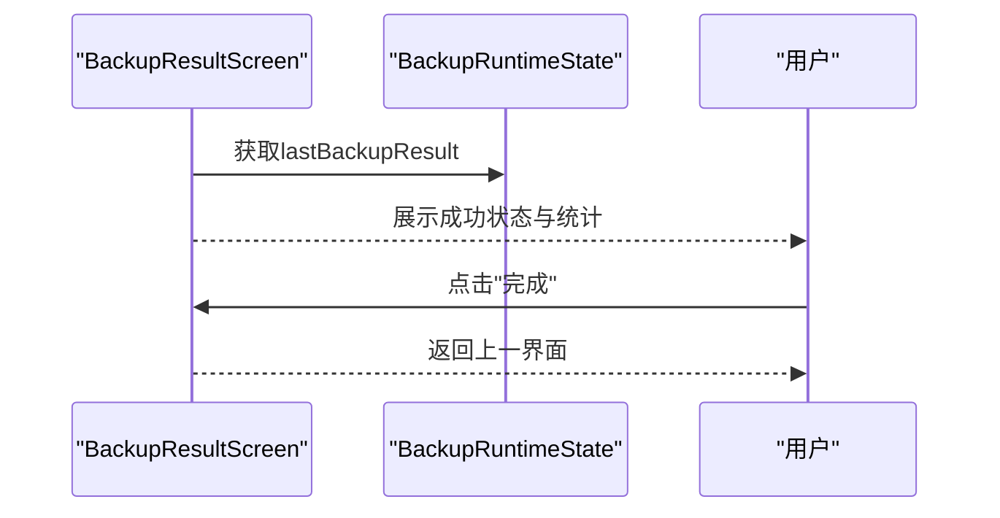

**图表来源**
- [BackupResultScreen.kt:32-82](file://android/app/src/main/kotlin/com/xpx/vault/ui/BackupResultScreen.kt#L32-L82)
- [BackupRuntimeState.kt:4-5](file://android/app/src/main/kotlin/com/xpx/vault/ui/backup/BackupRuntimeState.kt#L4-L5)

**章节来源**
- [BackupResultScreen.kt:1-125](file://android/app/src/main/kotlin/com/xpx/vault/ui/BackupResultScreen.kt#L1-L125)

### 恢复结果界面：RestoreResultScreen
- **功能职责**
  - 展示恢复成功状态与统计信息（如恢复条目数）
  - 提供完成按钮，返回上一界面
  - 显示最近的恢复结果
- **关键元素**
  - 成功徽章与标题提示
  - 统计信息行展示恢复结果
  - 统一样式与主题色系

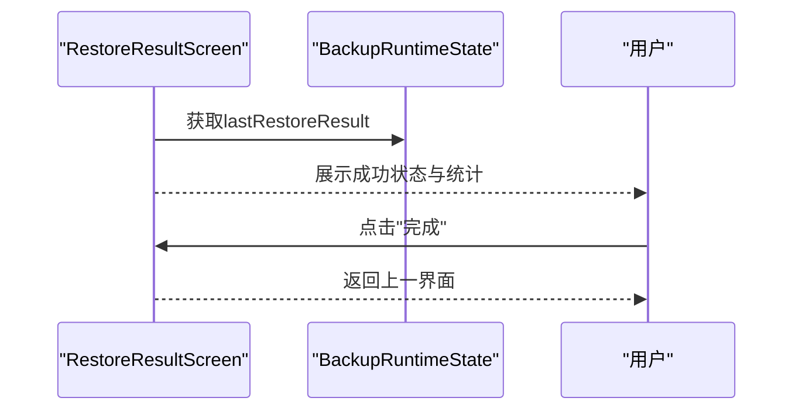

**图表来源**
- [RestoreResultScreen.kt:32-75](file://android/app/src/main/kotlin/com/xpx/vault/ui/RestoreResultScreen.kt#L32-L75)
- [BackupRuntimeState.kt:7-8](file://android/app/src/main/kotlin/com/xpx/vault/ui/backup/BackupRuntimeState.kt#L7-L8)

**章节来源**
- [RestoreResultScreen.kt:1-122](file://android/app/src/main/kotlin/com/xpx/vault/ui/RestoreResultScreen.kt#L1-L122)

### 备份记录模型与数据库
- **备份记录实体**
  - 字段包括自增 ID、文件路径、创建时间（毫秒）、版本号、校验值（十六进制）
  - 以 Room 实体形式持久化，便于查询与管理
- **领域模型**
  - 对应实体的轻量领域对象，便于在业务层传递与使用
- **数据库定义**
  - Room 数据库包含备份记录、相册、照片资产等实体
  - 通过 DAO 提供观察与插入等操作

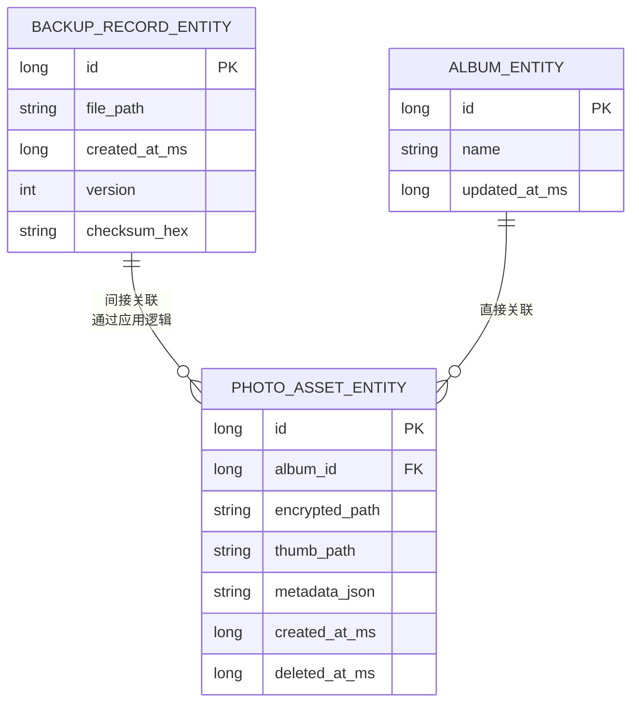

**图表来源**
- [BackupRecordEntity.kt:8-18](file://android/core/data/src/main/kotlin/com/xpx/vault/data/db/entity/BackupRecordEntity.kt#L8-L18)
- [PhotoAssetEntity.kt:9-32](file://android/core/data/src/main/kotlin/com/xpx/vault/data/db/entity/PhotoAssetEntity.kt#L9-L32)
- [PhotoVaultDatabase.kt:14-25](file://android/core/data/src/main/kotlin/com/xpx/vault/data/db/PhotoVaultDatabase.kt#L14-L25)

**章节来源**
- [BackupRecordEntity.kt:1-19](file://android/core/data/src/main/kotlin/com/xpx/vault/data/db/entity/BackupRecordEntity.kt#L1-L19)
- [BackupRecord.kt:1-13](file://android/core/domain/src/main/kotlin/com/xpx/vault/domain/model/BackupRecord.kt#L1-L13)
- [PhotoVaultDatabase.kt:1-36](file://android/core/data/src/main/kotlin/com/xpx/vault/data/db/PhotoVaultDatabase.kt#L1-L36)
- [AlbumDao.kt:1-18](file://android/core/data/src/main/kotlin/com/xpx/vault/data/db/dao/AlbumDao.kt#L1-L18)
- [PhotoAssetEntity.kt:1-33](file://android/core/data/src/main/kotlin/com/xpx/vault/data/db/entity/PhotoAssetEntity.kt#L1-L33)

### 加密与密钥管理
- **双密钥架构**
  - Vault主密钥：通过Android Keystore托管，负责日常加解密
  - 备份密钥：通过Argon2id从PIN口令派生，仅用于备份包加解密
  - 密钥指纹：HMAC-SHA256(backupKey, "aivault.fp.v1")[:16]，用于密码变更检测
- **密钥缓存**
  - 使用BackupSecretsStore缓存备份密钥，支持Worker快速访问
  - 通过Android Keystore的独立AES-GCM包裹密钥保护密钥材料
- **口令哈希**
  - 提供 SHA-256 哈希与带盐计算方法，可用于 PIN 或口令存储场景

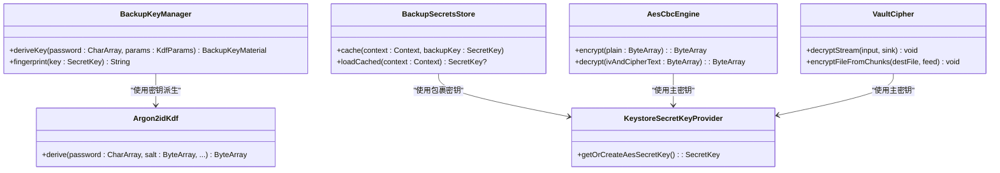

**图表来源**
- [BackupKeyManager.kt:82-100](file://android/core/data/src/main/kotlin/com/xpx/vault/data/crypto/BackupKeyManager.kt#L82-L100)
- [BackupSecretsStore.kt:37-77](file://android/app/src/main/kotlin/com/xpx/vault/ui/backup/BackupSecretsStore.kt#L37-L77)
- [Argon2idKdf.kt:57-84](file://android/core/data/src/main/kotlin/com/xpx/vault/data/crypto/Argon2idKdf.kt#L57-L84)
- [AesCbcEngine.kt:12-32](file://android/core/data/src/main/kotlin/com/xpx/vault/data/crypto/AesCbcEngine.kt#L12-L32)
- [KeystoreSecretKeyProvider.kt:18-35](file://android/core/data/src/main/kotlin/com/xpx/vault/data/crypto/KeystoreSecretKeyProvider.kt#L18-L35)
- [VaultCipher.kt:78-98](file://android/core/data/src/main/kotlin/com/xpx/vault/data/crypto/VaultCipher.kt#L78-L98)
- [VaultCipher.kt:114-147](file://android/core/data/src/main/kotlin/com/xpx/vault/data/crypto/VaultCipher.kt#L114-L147)

**章节来源**
- [BackupKeyManager.kt:9-17](file://android/core/data/src/main/kotlin/com/xpx/vault/data/crypto/BackupKeyManager.kt#L9-L17)
- [BackupSecretsStore.kt:16-24](file://android/app/src/main/kotlin/com/xpx/vault/ui/backup/BackupSecretsStore.kt#L16-L24)
- [Argon2idKdf.kt:11-17](file://android/core/data/src/main/kotlin/com/xpx/vault/data/crypto/Argon2idKdf.kt#L11-L17)
- [AesCbcEngine.kt:1-40](file://android/core/data/src/main/kotlin/com/xpx/vault/data/crypto/AesCbcEngine.kt#L1-L40)
- [KeystoreSecretKeyProvider.kt:1-42](file://android/core/data/src/main/kotlin/com/xpx/vault/data/crypto/KeystoreSecretKeyProvider.kt#L1-L42)
- [PasswordHasher.kt:1-26](file://android/core/data/src/main/kotlin/com/xpx/vault/data/crypto/PasswordHasher.kt#L1-L26)
- [VaultCipher.kt:19-303](file://android/core/data/src/main/kotlin/com/xpx/vault/data/crypto/VaultCipher.kt#L19-L303)

### 备份文件格式与数据完整性
**更新** 升级为BackupPackageV1格式的双键备份文件，**现已支持加密vault内容的备份和恢复**

- **备份文件格式**
  - 备份包为加密的二进制格式，包含MAGIC标识、版本号、头部长度、头部JSON、身体数据、尾部校验
  - 支持AES-256-GCM加密，每个chunk包含IV和GCM标签
  - 头部包含KDF参数、密钥指纹、资产索引等元数据
  - **新增**：支持attachHeader()方法，避免重复解析头部
- **数据完整性校验**
  - 备份包包含SHA-256尾部校验，保护头部和身体数据的完整性
  - 每个资产文件包含SHA-256校验值，恢复时进行二次校验
  - 密钥指纹用于检测备份密码是否变更
  - **新增**：通过VaultCipher流式解密计算明文SHA-256，确保备份内容正确性
- **恢复流程**
  - 读取备份包头部，解析KDF参数和密钥指纹
  - 通过PIN口令和KDF参数派生备份密钥
  - 验证密钥指纹后解密备份包内容
  - **新增**：使用VaultCipher的推送模式加密，边解密边加密，确保恢复内容正确
  - 使用Keystore主密钥重新加密后写入保险库

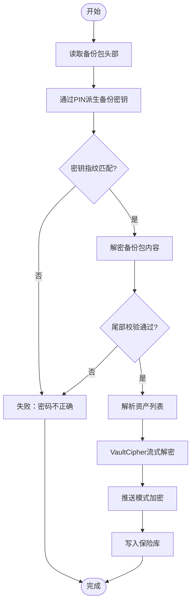

**图表来源**
- [LocalBackupMvpService.kt:307-342](file://android/app/src/main/kotlin/com/xpx/vault/ui/backup/LocalBackupMvpService.kt#L307-L342)
- [LocalBackupMvpService.kt:344-394](file://android/app/src/main/kotlin/com/xpx/vault/ui/backup/LocalBackupMvpService.kt#L344-L394)
- [LocalBackupMvpService.kt:437-490](file://android/app/src/main/kotlin/com/xpx/vault/ui/backup/LocalBackupMvpService.kt#L437-L490)
- [LocalBackupMvpService.kt:498-522](file://android/app/src/main/kotlin/com/xpx/vault/ui/backup/LocalBackupMvpService.kt#L498-L522)

**章节来源**
- [LocalBackupMvpService.kt:307-342](file://android/app/src/main/kotlin/com/xpx/vault/ui/backup/LocalBackupMvpService.kt#L307-L342)
- [LocalBackupMvpService.kt:344-394](file://android/app/src/main/kotlin/com/xpx/vault/ui/backup/LocalBackupMvpService.kt#L344-L394)
- [LocalBackupMvpService.kt:437-490](file://android/app/src/main/kotlin/com/xpx/vault/ui/backup/LocalBackupMvpService.kt#L437-L490)
- [LocalBackupMvpService.kt:498-522](file://android/app/src/main/kotlin/com/xpx/vault/ui/backup/LocalBackupMvpService.kt#L498-L522)
- [BackupPackageV1.kt:18-29](file://android/app/src/main/kotlin/com/xpx/vault/ui/backup/BackupPackageV1.kt#L18-L29)
- [BackupPackageV1.kt:250-277](file://android/app/src/main/kotlin/com/xpx/vault/ui/backup/BackupPackageV1.kt#L250-277)

### 增量备份与全量备份
**更新** 基于双键架构的完整增量备份实现，**现已支持加密vault内容**

- **全量备份**
  - 基于密钥指纹比较，当指纹不匹配时执行全量备份
  - 包含所有资产文件和完整头部信息
  - 更新备份元数据，记录新的密钥指纹和KDF参数
  - **新增**：通过VaultCipher流式解密计算明文SHA-256，确保备份内容正确性
- **增量备份**
  - 基于上次备份的密钥指纹，仅在指纹变更时执行全量备份
  - 通过外部存储的原子覆盖写入，确保备份过程的可靠性
  - 支持设备迁移时的密钥指纹检测
  - **新增**：利用VaultCipher的推送模式加密，边解密边加密，提高备份效率
- **实现机制**
  - 自动备份：固定外部路径`Documents/AIVault/backup.dat`，覆盖更新
  - 手动备份：用户选择位置，生成带时间戳的文件名
  - 密钥缓存：通过BackupSecretsStore缓存备份密钥，支持Worker快速访问
  - **新增**：通过VaultAsset数据结构封装相对路径、明文大小和SHA-256哈希

**章节来源**
- [LocalBackupMvpService.kt:69-169](file://android/app/src/main/kotlin/com/xpx/vault/ui/backup/LocalBackupMvpService.kt#L69-L169)
- [LocalBackupMvpService.kt:171-270](file://android/app/src/main/kotlin/com/xpx/vault/ui/backup/LocalBackupMvpService.kt#L171-L270)
- [LocalBackupMvpService.kt:498-522](file://android/app/src/main/kotlin/com/xpx/vault/ui/backup/LocalBackupMvpService.kt#L498-L522)
- [BackupMeta.kt:91-102](file://android/app/src/main/kotlin/com/xpx/vault/ui/backup/BackupMeta.kt#L91-L102)

### 错误恢复机制
**更新** 增强的错误恢复机制，**现已支持加密vault内容的错误处理**

- **密钥相关错误**
  - 密钥指纹不匹配：提示用户检查PIN口令或重新生成密钥
  - 密钥缓存失败：自动清空缓存文件并提示重新解锁
  - 包裹密钥损坏：支持完全重置，删除缓存和包裹密钥
- **文件系统错误**
  - 外部存储不可写：检查SAF权限和存储空间
  - 原子覆盖失败：通过自检修复残留的临时文件
  - 文件损坏：自动删除损坏文件并重试
- **数据库写入失败**
  - 恢复过程中遇到错误，回滚已写入的部分
  - 保持原始数据不变，并记录详细的错误日志
  - 支持部分恢复，跳过失败的资产文件
- **加密内容错误**
  - **新增**：流式解密过程中出现异常，自动清理临时文件
  - **新增**：推送模式加密失败时，回滚到原始状态
  - **新增**：明文SHA-256校验失败时，删除目标文件并重试
- **进度监控**
  - BackupProgressScreen和RestoreProgressScreen提供实时进度反馈
  - 错误状态通过对话框提示用户

**章节来源**
- [LocalBackupMvpService.kt:307-342](file://android/app/src/main/kotlin/com/xpx/vault/ui/backup/LocalBackupMvpService.kt#L307-L342)
- [LocalBackupMvpService.kt:344-394](file://android/app/src/main/kotlin/com/xpx/vault/ui/backup/LocalBackupMvpService.kt#L344-L394)
- [LocalBackupMvpService.kt:437-490](file://android/app/src/main/kotlin/com/xpx/vault/ui/backup/LocalBackupMvpService.kt#L437-L490)
- [LocalBackupMvpService.kt:498-522](file://android/app/src/main/kotlin/com/xpx/vault/ui/backup/LocalBackupMvpService.kt#L498-L522)
- [BackupSecretsStore.kt:73-77](file://android/app/src/main/kotlin/com/xpx/vault/ui/backup/BackupSecretsStore.kt#L73-L77)
- [ExternalBackupLocation.kt:86-107](file://android/app/src/main/kotlin/com/xpx/vault/ui/backup/ExternalBackupLocation.kt#L86-L107)
- [BackupProgressScreen.kt:70-79](file://android/app/src/main/kotlin/com/xpx/vault/ui/BackupProgressScreen.kt#L70-L79)
- [RestoreProgressScreen.kt:67-76](file://android/app/src/main/kotlin/com/xpx/vault/ui/RestoreProgressScreen.kt#L67-L76)

### 安全存储、加密传输与压缩优化
**更新** 基于双键架构的安全存储策略，**现已支持加密vault内容的安全处理**

- **双密钥架构**
  - Vault主密钥：通过Android Keystore托管，密钥材料不可导出
  - 备份密钥：通过Argon2id从PIN口令派生，支持密钥指纹检测
  - 包裹密钥：独立的AES-GCM密钥保护备份密钥材料
- **加密传输**
  - 建议在跨设备传输时再次加密或使用受信通道
  - 支持通过外部URI进行备份文件的导入导出
  - 头部信息明文存储，不包含任何密钥字节
- **压缩优化**
  - 备份包采用二进制格式，相比ZIP格式更高效
  - 支持分块加密，每个chunk不超过1MB
  - 原子覆盖写入，减少文件碎片
  - **新增**：通过VaultCipher流式处理，避免内存溢出
- **加密内容处理**
  - **新增**：备份时通过VaultCipher流式解密vault内容，计算明文SHA-256
  - **新增**：恢复时通过VaultCipher推送模式加密，边解密边加密
  - **新增**：支持临时文件的原子写入，确保数据完整性

**章节来源**
- [LocalBackupMvpService.kt:30-67](file://android/app/src/main/kotlin/com/xpx/vault/ui/backup/LocalBackupMvpService.kt#L30-L67)
- [LocalBackupMvpService.kt:437-490](file://android/app/src/main/kotlin/com/xpx/vault/ui/backup/LocalBackupMvpService.kt#L437-L490)
- [LocalBackupMvpService.kt:498-522](file://android/app/src/main/kotlin/com/xpx/vault/ui/backup/LocalBackupMvpService.kt#L498-L522)
- [BackupKeyManager.kt:10-16](file://android/core/data/src/main/kotlin/com/xpx/vault/data/crypto/BackupKeyManager.kt#L10-L16)
- [BackupSecretsStore.kt:16-24](file://android/app/src/main/kotlin/com/xpx/vault/ui/backup/BackupSecretsStore.kt#L16-L24)
- [BackupPackageV1.kt:18-29](file://android/app/src/main/kotlin/com/xpx/vault/ui/backup/BackupPackageV1.kt#L18-L29)
- [VaultCipher.kt:114-147](file://android/core/data/src/main/kotlin/com/xpx/vault/data/crypto/VaultCipher.kt#L114-L147)

### 备份策略配置、自动化与跨设备同步
**更新** 完整的备份策略配置和自动化系统，**现已支持加密vault内容的跨设备同步**

- **策略配置**
  - 支持设置备份频率（每日/每周/手动）、是否启用增量备份、是否自动清理旧备份
  - 自动备份支持充电/空闲条件约束
  - 最多保留64个历史备份版本
- **自动化备份**
  - 在应用空闲时段或网络可用时触发备份任务
  - 基于WorkManager的可靠任务调度
  - 支持失败重试机制
- **跨设备同步**
  - 通过云端服务上传/下载加密备份包，结合设备间的账号体系实现数据同步
  - 支持通过外部URI进行备份文件的导入导出
  - 密钥指纹检测确保跨设备恢复的一致性
  - **新增**：支持加密vault内容的跨设备同步，通过相同的密钥派生和加密流程

**章节来源**
- [AutoBackupScheduler.kt:16-83](file://android/app/src/main/kotlin/com/xpx/vault/ui/backup/AutoBackupScheduler.kt#L16-L83)
- [AutoIncrementalBackupWorker.kt:7-15](file://android/app/src/main/kotlin/com/xpx/vault/ui/backup/AutoIncrementalBackupWorker.kt#L7-L15)
- [BackupMeta.kt:97-102](file://android/app/src/main/kotlin/com/xpx/vault/ui/backup/BackupMeta.kt#L97-L102)
- [BackupMeta.kt:104-113](file://android/app/src/main/kotlin/com/xpx/vault/ui/backup/BackupMeta.kt#L104-L113)

## 依赖分析
**更新** 完整的依赖关系分析，**现已包含加密内容处理的依赖关系**

- **组件耦合**
  - UI层通过ViewModel与业务逻辑层解耦
  - 业务逻辑层通过LocalBackupMvpService集中管理
  - 数据层通过实体与DAO提供稳定接口
  - 新增组件之间形成清晰的层次依赖
  - **新增**：VaultCipher与LocalBackupMvpService的紧密耦合，用于加密内容处理
- **外部依赖**
  - Android Keystore 提供密钥托管
  - Room 提供数据库持久化
  - WorkManager 提供后台任务调度
  - SharedPreferences 提供配置持久化
  - BouncyCastle 提供Argon2id算法实现
  - **新增**：VaultCipher作为加密引擎，依赖Android Keystore和Cipher API
- **潜在风险**
  - 若密钥被重置或设备迁移，需提供密钥恢复流程
  - 数据库版本升级时需谨慎迁移
  - 外部存储权限变更时需重新授权
  - **新增**：加密内容处理失败时的数据一致性风险

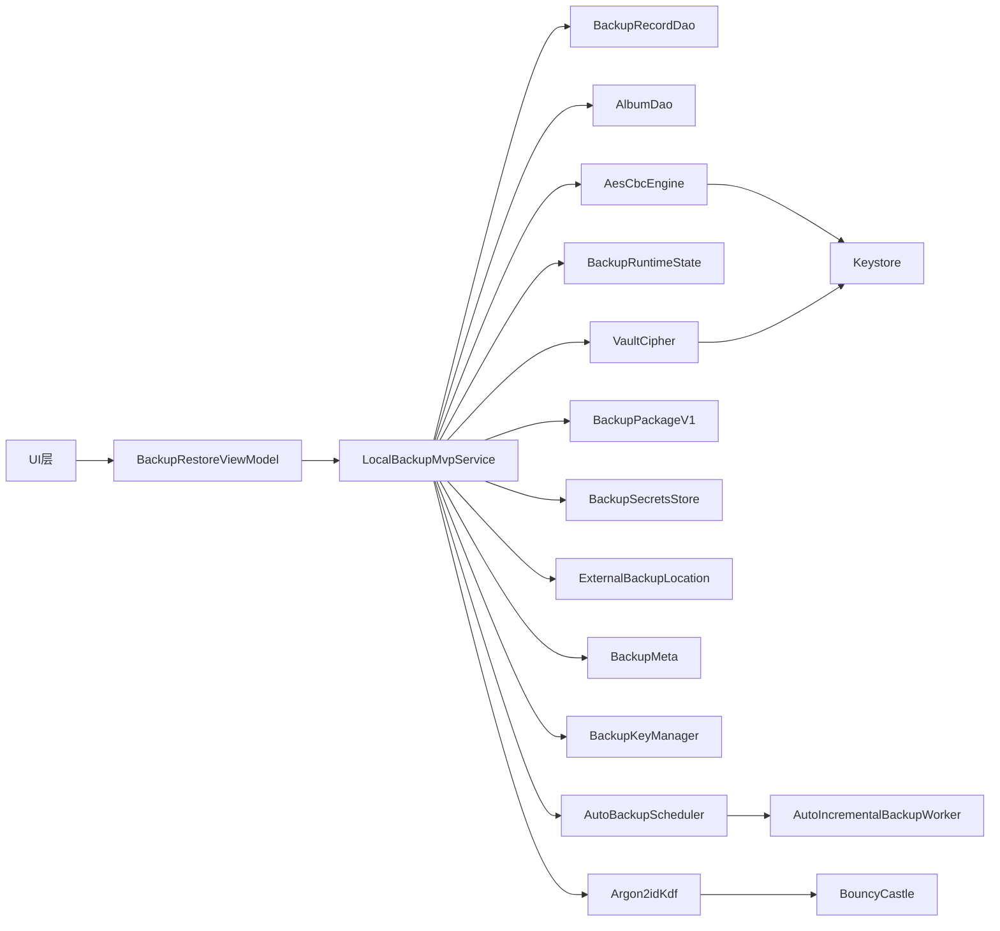

**图表来源**
- [BackupRestoreScreen.kt:208-276](file://android/app/src/main/kotlin/com/xpx/vault/ui/BackupRestoreScreen.kt#L208-L276)
- [LocalBackupMvpService.kt:30-67](file://android/app/src/main/kotlin/com/xpx/vault/ui/backup/LocalBackupMvpService.kt#L30-L67)
- [AutoBackupScheduler.kt:16-83](file://android/app/src/main/kotlin/com/xpx/vault/ui/backup/AutoBackupScheduler.kt#L16-L83)
- [AutoIncrementalBackupWorker.kt:7-15](file://android/app/src/main/kotlin/com/xpx/vault/ui/backup/AutoIncrementalBackupWorker.kt#L7-L15)
- [BackupRecordDao.kt:9-19](file://android/core/data/src/main/kotlin/com/xpx/vault/data/db/dao/BackupRecordDao.kt#L9-L19)
- [AesCbcEngine.kt:12-32](file://android/core/data/src/main/kotlin/com/xpx/vault/data/crypto/AesCbcEngine.kt#L12-L32)
- [KeystoreSecretKeyProvider.kt:18-35](file://android/core/data/src/main/kotlin/com/xpx/vault/data/crypto/KeystoreSecretKeyProvider.kt#L18-L35)
- [BackupPackageV1.kt:15-46](file://android/app/src/main/kotlin/com/xpx/vault/ui/backup/BackupPackageV1.kt#L15-L46)
- [BackupSecretsStore.kt:16-24](file://android/app/src/main/kotlin/com/xpx/vault/ui/backup/BackupSecretsStore.kt#L16-L24)
- [ExternalBackupLocation.kt:10-19](file://android/app/src/main/kotlin/com/xpx/vault/ui/backup/ExternalBackupLocation.kt#L10-L19)
- [BackupMeta.kt:10-26](file://android/app/src/main/kotlin/com/xpx/vault/ui/backup/BackupMeta.kt#L10-L26)
- [BackupKeyManager.kt:9-17](file://android/core/data/src/main/kotlin/com/xpx/vault/data/crypto/BackupKeyManager.kt#L9-L17)
- [Argon2idKdf.kt:11-17](file://android/core/data/src/main/kotlin/com/xpx/vault/data/crypto/Argon2idKdf.kt#L11-L17)
- [VaultCipher.kt:19-303](file://android/core/data/src/main/kotlin/com/xpx/vault/data/crypto/VaultCipher.kt#L19-L303)

**章节来源**
- [BackupRestoreScreen.kt:208-276](file://android/app/src/main/kotlin/com/xpx/vault/ui/BackupRestoreScreen.kt#L208-L276)
- [LocalBackupMvpService.kt:30-67](file://android/app/src/main/kotlin/com/xpx/vault/ui/backup/LocalBackupMvpService.kt#L30-L67)
- [AutoBackupScheduler.kt:16-83](file://android/app/src/main/kotlin/com/xpx/vault/ui/backup/AutoBackupScheduler.kt#L16-L83)
- [AutoIncrementalBackupWorker.kt:7-15](file://android/app/src/main/kotlin/com/xpx/vault/ui/backup/AutoIncrementalBackupWorker.kt#L7-L15)

## 性能考虑
**更新** 基于双键架构的性能优化策略，**现已包含加密内容处理的性能优化**

- **备份性能**
  - 双密钥架构减少密钥派生开销，提升备份速度
  - 外部存储原子覆盖写入，减少文件碎片
  - 分块加密支持并行处理，提升吞吐量
  - 设备自适应参数调整，优化不同设备性能
  - **新增**：VaultCipher流式处理避免内存溢出，提升大文件备份性能
  - **新增**：推送模式加密减少中间文件，提高备份效率
- **恢复性能**
  - 密钥指纹检测避免不必要的密钥派生
  - 流式解密处理大文件，避免内存溢出
  - 预分配数据库空间，减少碎片
  - 支持部分恢复，跳过失败的资产文件
  - **新增**：边解密边加密的推送模式，减少I/O操作
  - **新增**：明文SHA-256校验在内存中进行，避免额外文件写入
- **用户体验**
  - BackupProgressScreen和RestoreProgressScreen提供实时进度反馈
  - 可中断操作和错误重试机制
  - 失败重试与断点续传
- **内存管理**
  - 使用流式处理大文件，避免内存溢出
  - 密钥材料及时清零，防止内存泄漏
  - 缓存文件及时清理，避免磁盘空间占用
  - **新增**：临时文件的原子写入，确保数据完整性

## 故障排除指南
**更新** 基于双键架构的故障排除指南，**现已包含加密内容处理的故障排除**

- **备份失败**
  - 检查外部存储权限与可用空间
  - 验证密钥缓存状态与Keystore可用性
  - 确认保险箱目录是否存在
  - 查看BackupProgressScreen的错误提示
  - **新增**：检查VaultCipher密钥生成和缓存状态
  - **新增**：验证加密内容的流式处理是否正常
- **恢复失败**
  - 确认备份包未被篡改且校验通过
  - 检查PIN口令是否正确，密钥指纹匹配
  - 验证外部存储权限和文件完整性
  - 查看RestoreProgressScreen的错误提示
  - **新增**：检查加密内容的推送模式加密是否成功
  - **新增**：验证明文SHA-256校验是否通过
- **密钥相关问题**
  - 密钥指纹不匹配：重新输入PIN口令或重置备份
  - 密钥缓存损坏：清理缓存文件并重新解锁
  - 包裹密钥丢失：支持完全重置，删除所有密钥材料
  - **新增**：VaultCipher密钥生成失败：检查Keystore可用性
- **加密内容问题**
  - **新增**：流式解密异常：检查vault文件完整性
  - **新增**：推送模式加密失败：验证目标文件权限
  - **新增**：明文SHA-256校验失败：检查解密内容正确性
- **自动备份问题**
  - 检查AutoBackupScheduler的配置状态
  - 验证WorkManager的任务调度
  - 确认充电/空闲条件满足
  - 检查外部存储授权状态

## 结论
本备份恢复系统已发展为完整的双键架构，以清晰的分层设计为基础，结合Argon2id密钥派生和AES-256-GCM加密保障安全性，通过BackupPackageV1格式和ExternalBackupLocation实现稳定的持久化。**最新的更新使系统能够支持加密vault内容的备份和恢复，包括解密计算SHA-256哈希、流式解密到临时文件、加密恢复等功能**。新增的LocalBackupMvpService提供了完整的双键备份/恢复业务逻辑，AutoBackupScheduler实现了可靠的自动化备份，BackupProgressScreen和RestoreProgressScreen提供了优秀的用户体验。系统支持增量备份、外部存储、原子覆盖写入、密钥指纹检测等高级特性，为AI照片保险库提供了强大的数据保护能力。双键架构的设计确保了备份密钥与日常密钥的分离，提升了整体安全性。后续可在跨设备同步、云存储集成等方面进一步完善，以满足更复杂的使用场景。

## 附录
- **术语**
  - 双键备份：同时使用Vault主密钥和备份密钥的备份方式
  - BackupPackageV1：新的备份包格式，基于二进制结构
  - 备份密钥：通过Argon2id从PIN口令派生的备份专用密钥
  - 密钥指纹：HMAC-SHA256(backupKey, "aivault.fp.v1")[:16]的十六进制表示
  - 原子覆盖：通过临时文件和重命名实现的可靠文件替换
  - KDF参数：密钥派生函数的参数集合（算法、盐值、迭代次数、内存、并行度）
  - **新增**：VaultCipher：保险库加密引擎，支持流式解密和推送模式加密
  - **新增**：推送模式加密：由调用方通过回调增量唤醒明文块，结构性地原子写入目标文件
  - **新增**：流式解密：读取16B IV → 逐块update并回调sink → 末尾doFinal的解密方式
- **参考路径**
  - 备份服务与调度：[LocalBackupMvpService.kt:30-67](file://android/app/src/main/kotlin/com/xpx/vault/ui/backup/LocalBackupMvpService.kt#L30-L67)、[AutoBackupScheduler.kt:16-83](file://android/app/src/main/kotlin/com/xpx/vault/ui/backup/AutoBackupScheduler.kt#L16-L83)、[AutoIncrementalBackupWorker.kt:7-15](file://android/app/src/main/kotlin/com/xpx/vault/ui/backup/AutoIncrementalBackupWorker.kt#L7-L15)
  - 备份包格式：[BackupPackageV1.kt:15-46](file://android/app/src/main/kotlin/com/xpx/vault/ui/backup/BackupPackageV1.kt#L15-L46)、[BackupPackageV1.kt:107-177](file://android/app/src/main/kotlin/com/xpx/vault/ui/backup/BackupPackageV1.kt#L107-L177)、[BackupPackageV1.kt:250-277](file://android/app/src/main/kotlin/com/xpx/vault/ui/backup/BackupPackageV1.kt#L250-L277)
  - 密钥管理：[BackupKeyManager.kt:9-17](file://android/core/data/src/main/kotlin/com/xpx/vault/data/crypto/BackupKeyManager.kt#L9-L17)、[BackupSecretsStore.kt:16-24](file://android/app/src/main/kotlin/com/xpx/vault/ui/backup/BackupSecretsStore.kt#L16-L24)
  - 外部存储：[ExternalBackupLocation.kt:10-19](file://android/app/src/main/kotlin/com/xpx/vault/ui/backup/ExternalBackupLocation.kt#L10-L19)、[ExternalBackupLocation.kt:109-179](file://android/app/src/main/kotlin/com/xpx/vault/ui/backup/ExternalBackupLocation.kt#L109-L179)
  - 备份元数据：[BackupMeta.kt:10-26](file://android/app/src/main/kotlin/com/xpx/vault/ui/backup/BackupMeta.kt#L10-L26)、[BackupMeta.kt:91-102](file://android/app/src/main/kotlin/com/xpx/vault/ui/backup/BackupMeta.kt#L91-L102)
  - 进度界面：[BackupProgressScreen.kt:40-127](file://android/app/src/main/kotlin/com/xpx/vault/ui/BackupProgressScreen.kt#L40-L127)、[RestoreProgressScreen.kt:40-124](file://android/app/src/main/kotlin/com/xpx/vault/ui/RestoreProgressScreen.kt#L40-L124)
  - 运行时状态：[BackupRuntimeState.kt:3-9](file://android/app/src/main/kotlin/com/xpx/vault/ui/backup/BackupRuntimeState.kt#L3-L9)
  - 备份记录实体与领域模型：[BackupRecordEntity.kt:1-19](file://android/core/data/src/main/kotlin/com/xpx/vault/data/db/entity/BackupRecordEntity.kt#L1-L19)、[BackupRecord.kt:1-13](file://android/core/domain/src/main/kotlin/com/xpx/vault/domain/model/BackupRecord.kt#L1-L13)
  - 加密与密钥管理：[AesCbcEngine.kt:1-40](file://android/core/data/src/main/kotlin/com/xpx/vault/data/crypto/AesCbcEngine.kt#L1-L40)、[KeystoreSecretKeyProvider.kt:1-42](file://android/core/data/src/main/kotlin/com/xpx/vault/data/crypto/KeystoreSecretKeyProvider.kt#L1-L42)、[PasswordHasher.kt:1-26](file://android/core/data/src/main/kotlin/com/xpx/vault/data/crypto/PasswordHasher.kt#L1-L26)
  - 数据库与DAO：[PhotoVaultDatabase.kt:1-36](file://android/core/data/src/main/kotlin/com/xpx/vault/data/db/PhotoVaultDatabase.kt#L1-L36)、[AlbumDao.kt:1-18](file://android/core/data/src/main/kotlin/com/xpx/vault/data/db/dao/AlbumDao.kt#L1-L18)、[PhotoAssetEntity.kt:1-33](file://android/core/data/src/main/kotlin/com/xpx/vault/data/db/entity/PhotoAssetEntity.kt#L1-L33)
  - UI界面：[BackupRestoreScreen.kt:88-206](file://android/app/src/main/kotlin/com/xpx/vault/ui/BackupRestoreScreen.kt#L88-L206)、[BackupResultScreen.kt:1-125](file://android/app/src/main/kotlin/com/xpx/vault/ui/BackupResultScreen.kt#L1-L125)、[RestoreResultScreen.kt:1-122](file://android/app/src/main/kotlin/com/xpx/vault/ui/RestoreResultScreen.kt#L1-L122)
  - 主题系统：[Theme.kt:1-19](file://android/app/src/main/kotlin/com/xpx/vault/ui/theme/Theme.kt#L1-L19)
  - **新增**：保险库加密引擎：[VaultCipher.kt:19-303](file://android/core/data/src/main/kotlin/com/xpx/vault/data/crypto/VaultCipher.kt#L19-L303)