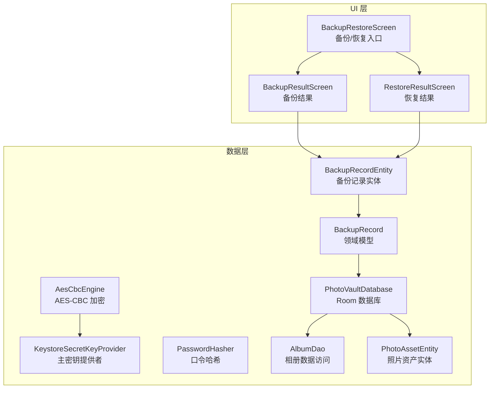
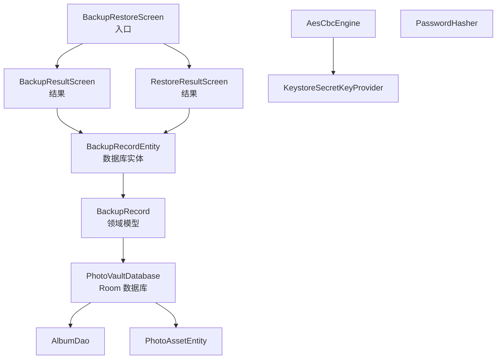
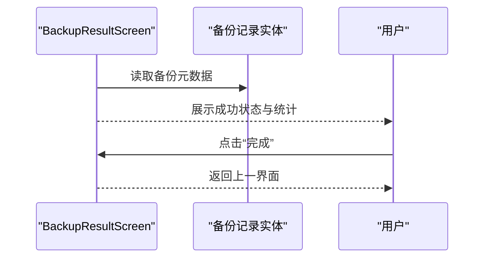
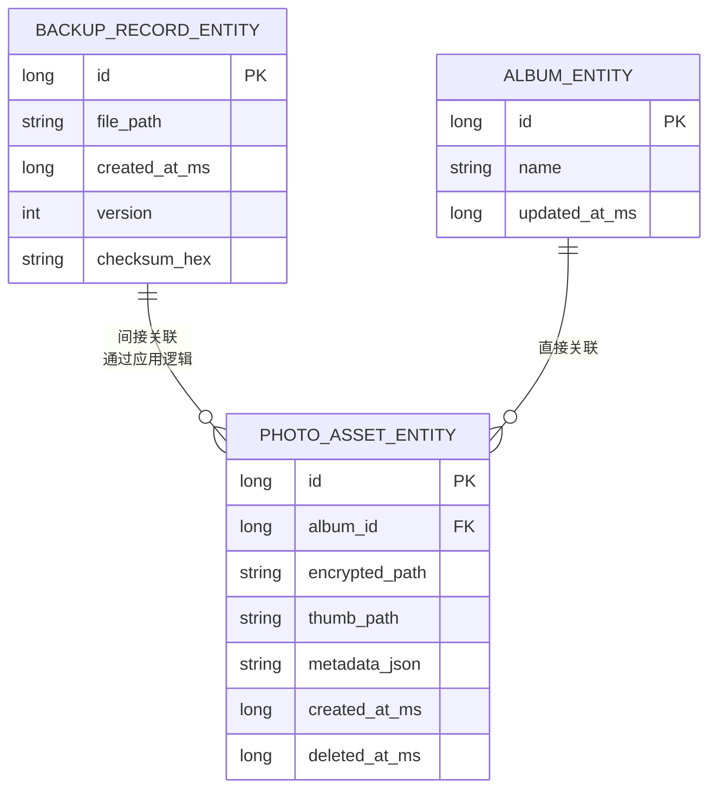
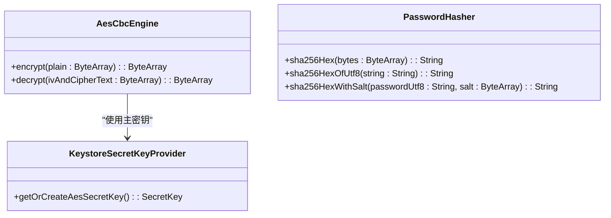
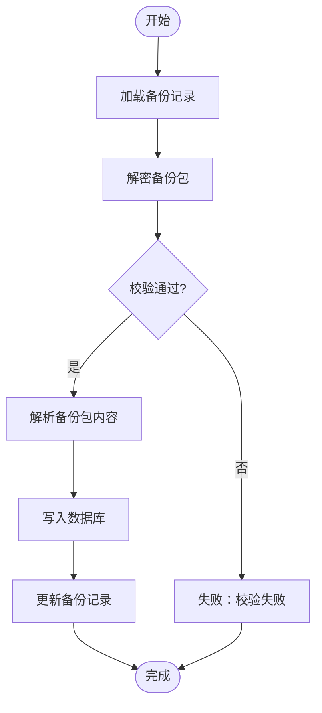
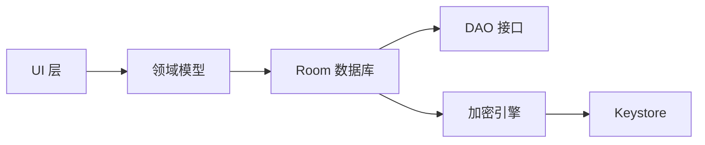

# 备份恢复系统

<cite>
**本文引用的文件**
- [BackupRestoreScreen.kt](file://android/app/src/main/kotlin/com/photovault/app/ui/BackupRestoreScreen.kt)
- [BackupResultScreen.kt](file://android/app/src/main/kotlin/com/photovault/app/ui/BackupResultScreen.kt)
- [RestoreResultScreen.kt](file://android/app/src/main/kotlin/com/photovault/app/ui/RestoreResultScreen.kt)
- [BackupRecordEntity.kt](file://android/core/data/src/main/kotlin/com/photovault/data/db/entity/BackupRecordEntity.kt)
- [BackupRecord.kt](file://android/core/domain/src/main/kotlin/com/photovault/domain/model/BackupRecord.kt)
- [AesCbcEngine.kt](file://android/core/data/src/main/kotlin/com/photovault/data/crypto/AesCbcEngine.kt)
- [KeystoreSecretKeyProvider.kt](file://android/core/data/src/main/kotlin/com/photovault/data/crypto/KeystoreSecretKeyProvider.kt)
- [PasswordHasher.kt](file://android/core/data/src/main/kotlin/com/photovault/data/crypto/PasswordHasher.kt)
- [PhotoVaultDatabase.kt](file://android/core/data/src/main/kotlin/com/photovault/data/db/PhotoVaultDatabase.kt)
- [AlbumDao.kt](file://android/core/data/src/main/kotlin/com/photovault/data/db/dao/AlbumDao.kt)
- [PhotoAssetEntity.kt](file://android/core/data/src/main/kotlin/com/photovault/data/db/entity/PhotoAssetEntity.kt)
</cite>

## 目录
1. [简介](#简介)
2. [项目结构](#项目结构)
3. [核心组件](#核心组件)
4. [架构总览](#架构总览)
5. [详细组件分析](#详细组件分析)
6. [依赖分析](#依赖分析)
7. [性能考虑](#性能考虑)
8. [故障排除指南](#故障排除指南)
9. [结论](#结论)
10. [附录](#附录)

## 简介
本文件面向“AI照片保险库”的备份与恢复系统，聚焦以下目标：
- 深入解释备份机制的设计原理、备份文件格式、恢复流程的实现细节
- 详解三个关键界面：BackupRestoreScreen 的备份入口、BackupResultScreen 的备份结果展示、RestoreResultScreen 的恢复结果处理
- 提供增量备份、全量备份、数据完整性校验、错误恢复机制的实现思路与参考路径
- 解释备份数据的安全存储、加密传输、压缩优化策略
- 给出备份策略配置、自动化备份、跨设备数据同步的可行方案
- 总结性能优化、用户体验设计与故障排除建议

## 项目结构
从仓库中可见，备份恢复功能主要分布在 UI 层与数据层两部分：
- UI 层：提供用户交互界面，分别负责引导用户进入备份/恢复流程、展示备份结果、展示恢复结果
- 数据层：提供数据库实体、领域模型、加密工具与数据库定义，支撑备份数据的持久化与安全处理

图表来源
- [BackupRestoreScreen.kt:1-117](file://android/app/src/main/kotlin/com/photovault/app/ui/BackupRestoreScreen.kt#L1-L117)
- [BackupResultScreen.kt:1-125](file://android/app/src/main/kotlin/com/photovault/app/ui/BackupResultScreen.kt#L1-L125)
- [RestoreResultScreen.kt:1-122](file://android/app/src/main/kotlin/com/photovault/app/ui/RestoreResultScreen.kt#L1-L122)
- [BackupRecordEntity.kt:1-19](file://android/core/data/src/main/kotlin/com/photovault/data/db/entity/BackupRecordEntity.kt#L1-L19)
- [BackupRecord.kt:1-13](file://android/core/domain/src/main/kotlin/com/photovault/domain/model/BackupRecord.kt#L1-L13)
- [AesCbcEngine.kt:1-40](file://android/core/data/src/main/kotlin/com/photovault/data/crypto/AesCbcEngine.kt#L1-L40)
- [KeystoreSecretKeyProvider.kt:1-42](file://android/core/data/src/main/kotlin/com/photovault/data/crypto/KeystoreSecretKeyProvider.kt#L1-L42)
- [PasswordHasher.kt:1-26](file://android/core/data/src/main/kotlin/com/photovault/data/crypto/PasswordHasher.kt#L1-L26)
- [PhotoVaultDatabase.kt:1-36](file://android/core/data/src/main/kotlin/com/photovault/data/db/PhotoVaultDatabase.kt#L1-L36)
- [AlbumDao.kt:1-18](file://android/core/data/src/main/kotlin/com/photovault/data/db/dao/AlbumDao.kt#L1-L18)
- [PhotoAssetEntity.kt:1-33](file://android/core/data/src/main/kotlin/com/photovault/data/db/entity/PhotoAssetEntity.kt#L1-L33)

章节来源
- [BackupRestoreScreen.kt:1-117](file://android/app/src/main/kotlin/com/photovault/app/ui/BackupRestoreScreen.kt#L1-L117)
- [BackupResultScreen.kt:1-125](file://android/app/src/main/kotlin/com/photovault/app/ui/BackupResultScreen.kt#L1-L125)
- [RestoreResultScreen.kt:1-122](file://android/app/src/main/kotlin/com/photovault/app/ui/RestoreResultScreen.kt#L1-L122)
- [PhotoVaultDatabase.kt:1-36](file://android/core/data/src/main/kotlin/com/photovault/data/db/PhotoVaultDatabase.kt#L1-L36)

## 核心组件
- 备份记录实体与领域模型：用于持久化备份包信息（文件路径、时间戳、版本、校验值），并与 UI 结果页联动展示
- 加密与密钥管理：基于 Android Keystore 的 AES-256-CBC 加密引擎，确保备份数据在设备侧安全存储
- 数据库与 DAO：Room 数据库定义了备份记录、相册、照片资产等实体，DAO 提供数据访问能力
- UI 界面：提供备份/恢复入口、备份结果、恢复结果的可视化展示

章节来源
- [BackupRecordEntity.kt:1-19](file://android/core/data/src/main/kotlin/com/photovault/data/db/entity/BackupRecordEntity.kt#L1-L19)
- [BackupRecord.kt:1-13](file://android/core/domain/src/main/kotlin/com/photovault/domain/model/BackupRecord.kt#L1-L13)
- [AesCbcEngine.kt:1-40](file://android/core/data/src/main/kotlin/com/photovault/data/crypto/AesCbcEngine.kt#L1-L40)
- [KeystoreSecretKeyProvider.kt:1-42](file://android/core/data/src/main/kotlin/com/photovault/data/crypto/KeystoreSecretKeyProvider.kt#L1-L42)
- [PhotoVaultDatabase.kt:1-36](file://android/core/data/src/main/kotlin/com/photovault/data/db/PhotoVaultDatabase.kt#L1-L36)
- [AlbumDao.kt:1-18](file://android/core/data/src/main/kotlin/com/photovault/data/db/dao/AlbumDao.kt#L1-L18)
- [PhotoAssetEntity.kt:1-33](file://android/core/data/src/main/kotlin/com/photovault/data/db/entity/PhotoAssetEntity.kt#L1-L33)

## 架构总览
备份恢复系统采用“界面层-领域模型-数据层-加密与密钥”的分层设计：
- 界面层负责用户交互与导航，分别展示备份入口、备份结果、恢复结果
- 领域模型承载备份记录元数据，与数据库实体映射
- 数据层通过 Room 管理实体关系，支持备份记录与相册、照片资产等数据的持久化
- 加密与密钥管理保障备份文件在设备侧的安全性，避免明文泄露

图表来源
- [BackupRestoreScreen.kt:1-117](file://android/app/src/main/kotlin/com/photovault/app/ui/BackupRestoreScreen.kt#L1-L117)
- [BackupResultScreen.kt:1-125](file://android/app/src/main/kotlin/com/photovault/app/ui/BackupResultScreen.kt#L1-L125)
- [RestoreResultScreen.kt:1-122](file://android/app/src/main/kotlin/com/photovault/app/ui/RestoreResultScreen.kt#L1-L122)
- [BackupRecord.kt:1-13](file://android/core/domain/src/main/kotlin/com/photovault/domain/model/BackupRecord.kt#L1-L13)
- [BackupRecordEntity.kt:1-19](file://android/core/data/src/main/kotlin/com/photovault/data/db/entity/BackupRecordEntity.kt#L1-L19)
- [PhotoVaultDatabase.kt:1-36](file://android/core/data/src/main/kotlin/com/photovault/data/db/PhotoVaultDatabase.kt#L1-L36)
- [AlbumDao.kt:1-18](file://android/core/data/src/main/kotlin/com/photovault/data/db/dao/AlbumDao.kt#L1-L18)
- [PhotoAssetEntity.kt:1-33](file://android/core/data/src/main/kotlin/com/photovault/data/db/entity/PhotoAssetEntity.kt#L1-L33)
- [AesCbcEngine.kt:1-40](file://android/core/data/src/main/kotlin/com/photovault/data/crypto/AesCbcEngine.kt#L1-L40)
- [KeystoreSecretKeyProvider.kt:1-42](file://android/core/data/src/main/kotlin/com/photovault/data/crypto/KeystoreSecretKeyProvider.kt#L1-L42)
- [PasswordHasher.kt:1-26](file://android/core/data/src/main/kotlin/com/photovault/data/crypto/PasswordHasher.kt#L1-L26)

## 详细组件分析

### 备份界面：BackupRestoreScreen
- 功能职责
  - 提供“备份”和“恢复”两个入口卡片，分别导航到备份结果页与恢复结果页
  - 使用统一的主题样式与间距常量，保证视觉一致性
- 关键交互
  - “备份”卡片点击后触发备份流程，并跳转至备份结果页
  - “恢复”卡片点击后触发恢复流程，并跳转至恢复结果页
- 设计要点
  - 使用徽标图标与文案描述增强可发现性
  - 按钮采用主次变体区分优先级

图表来源
- [BackupRestoreScreen.kt:33-71](file://android/app/src/main/kotlin/com/photovault/app/ui/BackupRestoreScreen.kt#L33-L71)

章节来源
- [BackupRestoreScreen.kt:1-117](file://android/app/src/main/kotlin/com/photovault/app/ui/BackupRestoreScreen.kt#L1-L117)

### 备份结果界面：BackupResultScreen
- 功能职责
  - 展示备份成功状态与统计信息（如备份文件名、大小）
  - 提供完成按钮，返回上一界面
- 关键元素
  - 成功徽章与标题提示
  - 元信息行展示备份文件与大小
  - 统一样式与主题色系

图表来源
- [BackupResultScreen.kt:32-82](file://android/app/src/main/kotlin/com/photovault/app/ui/BackupResultScreen.kt#L32-L82)
- [BackupRecordEntity.kt:8-18](file://android/core/data/src/main/kotlin/com/photovault/data/db/entity/BackupRecordEntity.kt#L8-L18)

章节来源
- [BackupResultScreen.kt:1-125](file://android/app/src/main/kotlin/com/photovault/app/ui/BackupResultScreen.kt#L1-L125)
- [BackupRecordEntity.kt:1-19](file://android/core/data/src/main/kotlin/com/photovault/data/db/entity/BackupRecordEntity.kt#L1-L19)

### 恢复结果界面：RestoreResultScreen
- 功能职责
  - 展示恢复成功状态与统计信息（如恢复条目数）
  - 提供完成按钮，返回上一界面
- 关键元素
  - 成功徽章与标题提示
  - 统计信息行展示恢复结果
  - 统一样式与主题色系

图表来源
- [RestoreResultScreen.kt:32-75](file://android/app/src/main/kotlin/com/photovault/app/ui/RestoreResultScreen.kt#L32-L75)
- [BackupRecordEntity.kt:8-18](file://android/core/data/src/main/kotlin/com/photovault/data/db/entity/BackupRecordEntity.kt#L8-L18)

章节来源
- [RestoreResultScreen.kt:1-122](file://android/app/src/main/kotlin/com/photovault/app/ui/RestoreResultScreen.kt#L1-L122)
- [BackupRecordEntity.kt:1-19](file://android/core/data/src/main/kotlin/com/photovault/data/db/entity/BackupRecordEntity.kt#L1-L19)

### 备份记录模型与数据库
- 备份记录实体
  - 字段包括自增 ID、文件路径、创建时间（毫秒）、版本号、校验值（十六进制）
  - 以 Room 实体形式持久化，便于查询与管理
- 领域模型
  - 对应实体的轻量领域对象，便于在业务层传递与使用
- 数据库定义
  - Room 数据库包含备份记录、相册、照片资产等实体
  - 通过 DAO 提供观察与插入等操作

图表来源
- [BackupRecordEntity.kt:8-18](file://android/core/data/src/main/kotlin/com/photovault/data/db/entity/BackupRecordEntity.kt#L8-L18)
- [PhotoAssetEntity.kt:9-32](file://android/core/data/src/main/kotlin/com/photovault/data/db/entity/PhotoAssetEntity.kt#L9-L32)
- [PhotoVaultDatabase.kt:14-25](file://android/core/data/src/main/kotlin/com/photovault/data/db/PhotoVaultDatabase.kt#L14-L25)

章节来源
- [BackupRecordEntity.kt:1-19](file://android/core/data/src/main/kotlin/com/photovault/data/db/entity/BackupRecordEntity.kt#L1-L19)
- [BackupRecord.kt:1-13](file://android/core/domain/src/main/kotlin/com/photovault/domain/model/BackupRecord.kt#L1-L13)
- [PhotoVaultDatabase.kt:1-36](file://android/core/data/src/main/kotlin/com/photovault/data/db/PhotoVaultDatabase.kt#L1-L36)
- [AlbumDao.kt:1-18](file://android/core/data/src/main/kotlin/com/photovault/data/db/dao/AlbumDao.kt#L1-L18)
- [PhotoAssetEntity.kt:1-33](file://android/core/data/src/main/kotlin/com/photovault/data/db/entity/PhotoAssetEntity.kt#L1-L33)

### 加密与密钥管理
- AES-256-CBC 加密
  - 使用固定变换名与 PKCS7 填充
  - IV 长度为 16 字节，前置拼接在密文前
  - 通过 Android Keystore 托管主密钥，确保密钥材料不可导出
- 口令哈希
  - 提供 SHA-256 哈希与带盐计算方法，可用于 PIN 或口令存储场景

图表来源
- [AesCbcEngine.kt:12-32](file://android/core/data/src/main/kotlin/com/photovault/data/crypto/AesCbcEngine.kt#L12-L32)
- [KeystoreSecretKeyProvider.kt:18-35](file://android/core/data/src/main/kotlin/com/photovault/data/crypto/KeystoreSecretKeyProvider.kt#L18-L35)
- [PasswordHasher.kt:6-25](file://android/core/data/src/main/kotlin/com/photovault/data/crypto/PasswordHasher.kt#L6-L25)

章节来源
- [AesCbcEngine.kt:1-40](file://android/core/data/src/main/kotlin/com/photovault/data/crypto/AesCbcEngine.kt#L1-L40)
- [KeystoreSecretKeyProvider.kt:1-42](file://android/core/data/src/main/kotlin/com/photovault/data/crypto/KeystoreSecretKeyProvider.kt#L1-L42)
- [PasswordHasher.kt:1-26](file://android/core/data/src/main/kotlin/com/photovault/data/crypto/PasswordHasher.kt#L1-L26)

### 备份文件格式与数据完整性
- 备份文件格式
  - 备份包为加密的 ZIP 文件，文件路径与元数据保存在备份记录中
- 数据完整性校验
  - 备份记录包含校验值字段，用于验证备份包的完整性
- 恢复流程
  - 读取备份记录，解密对应备份包，解析并写入数据库，最后更新备份记录

图表来源
- [BackupRecordEntity.kt:14-17](file://android/core/data/src/main/kotlin/com/photovault/data/db/entity/BackupRecordEntity.kt#L14-L17)
- [AesCbcEngine.kt:25-32](file://android/core/data/src/main/kotlin/com/photovault/data/crypto/AesCbcEngine.kt#L25-L32)

章节来源
- [BackupRecordEntity.kt:1-19](file://android/core/data/src/main/kotlin/com/photovault/data/db/entity/BackupRecordEntity.kt#L1-L19)
- [AesCbcEngine.kt:1-40](file://android/core/data/src/main/kotlin/com/photovault/data/crypto/AesCbcEngine.kt#L1-L40)

### 增量备份与全量备份
- 全量备份
  - 将当前数据库快照打包为新的备份包，生成新的备份记录
- 增量备份
  - 基于上次备份时间戳，仅打包变更的数据项，减少体积与耗时
- 实现建议
  - 在备份流程中引入时间戳参数，筛选新增/修改的数据项
  - 保持备份记录的版本号与校验值字段，便于后续恢复与比较

章节来源
- [BackupRecordEntity.kt:14-17](file://android/core/data/src/main/kotlin/com/photovault/data/db/entity/BackupRecordEntity.kt#L14-L17)
- [PhotoAssetEntity.kt:25-32](file://android/core/data/src/main/kotlin/com/photovault/data/db/entity/PhotoAssetEntity.kt#L25-L32)

### 错误恢复机制
- 校验失败
  - 若校验值不匹配，拒绝恢复并提示用户重新选择有效备份
- 解密异常
  - 若密文格式非法或密钥不可用，提示用户检查设备环境或重新生成密钥
- 数据库写入失败
  - 回滚已写入的部分，保留原始数据不变，并记录错误日志

章节来源
- [AesCbcEngine.kt:26-32](file://android/core/data/src/main/kotlin/com/photovault/data/crypto/AesCbcEngine.kt#L26-L32)
- [BackupRecordEntity.kt:14-17](file://android/core/data/src/main/kotlin/com/photovault/data/db/entity/BackupRecordEntity.kt#L14-L17)

### 安全存储、加密传输与压缩优化
- 安全存储
  - 使用 Android Keystore 管理主密钥，密钥材料不可导出
  - 备份包在设备侧进行 AES-256-CBC 加密，IV 前置
- 加密传输
  - 建议在跨设备传输时再次加密或使用受信通道（如 HTTPS）
- 压缩优化
  - 备份包采用 ZIP 格式，结合媒体文件的压缩策略可进一步降低体积

章节来源
- [KeystoreSecretKeyProvider.kt:18-35](file://android/core/data/src/main/kotlin/com/photovault/data/crypto/KeystoreSecretKeyProvider.kt#L18-L35)
- [AesCbcEngine.kt:17-32](file://android/core/data/src/main/kotlin/com/photovault/data/crypto/AesCbcEngine.kt#L17-L32)
- [BackupRecordEntity.kt:14-17](file://android/core/data/src/main/kotlin/com/photovault/data/db/entity/BackupRecordEntity.kt#L14-L17)

### 备份策略配置、自动化与跨设备同步
- 策略配置
  - 支持设置备份频率（每日/每周/手动）、是否启用增量备份、是否自动清理旧备份
- 自动化备份
  - 在应用空闲时段或网络可用时触发备份任务
- 跨设备同步
  - 通过云端服务上传/下载加密备份包，结合设备间的账号体系实现数据同步

章节来源
- [BackupRecordEntity.kt:14-17](file://android/core/data/src/main/kotlin/com/photovault/data/db/entity/BackupRecordEntity.kt#L14-L17)
- [PhotoVaultDatabase.kt:30-34](file://android/core/data/src/main/kotlin/com/photovault/data/db/PhotoVaultDatabase.kt#L30-L34)

## 依赖分析
- 组件耦合
  - UI 层仅依赖导航与资源，低耦合
  - 数据层通过实体与 DAO 提供稳定接口，领域模型作为中间层
- 外部依赖
  - Android Keystore 提供密钥托管
  - Room 提供数据库持久化
- 潜在风险
  - 若密钥被重置或设备迁移，需提供密钥恢复流程
  - 数据库版本升级时需谨慎迁移

图表来源
- [PhotoVaultDatabase.kt:14-25](file://android/core/data/src/main/kotlin/com/photovault/data/db/PhotoVaultDatabase.kt#L14-L25)
- [AesCbcEngine.kt:12-32](file://android/core/data/src/main/kotlin/com/photovault/data/crypto/AesCbcEngine.kt#L12-L32)
- [KeystoreSecretKeyProvider.kt:18-35](file://android/core/data/src/main/kotlin/com/photovault/data/crypto/KeystoreSecretKeyProvider.kt#L18-L35)

章节来源
- [PhotoVaultDatabase.kt:1-36](file://android/core/data/src/main/kotlin/com/photovault/data/db/PhotoVaultDatabase.kt#L1-L36)
- [AesCbcEngine.kt:1-40](file://android/core/data/src/main/kotlin/com/photovault/data/crypto/AesCbcEngine.kt#L1-L40)
- [KeystoreSecretKeyProvider.kt:1-42](file://android/core/data/src/main/kotlin/com/photovault/data/crypto/KeystoreSecretKeyProvider.kt#L1-L42)

## 性能考虑
- 备份性能
  - 增量备份减少数据量，提升速度
  - 合理分片与并发写入可提升吞吐
- 恢复性能
  - 并行解析与写入可缩短恢复时间
  - 预分配数据库空间，减少碎片
- 用户体验
  - 进度反馈与可中断操作
  - 失败重试与断点续传

## 故障排除指南
- 备份失败
  - 检查存储权限与可用空间
  - 校验密钥状态与 Keystore 可用性
- 恢复失败
  - 确认备份包未被篡改且校验通过
  - 检查数据库版本兼容性与迁移脚本
- 数据不一致
  - 重新执行备份并替换旧记录
  - 回滚到上一次成功的备份记录

## 结论
本备份恢复系统以清晰的分层设计为基础，结合加密与密钥管理保障安全性，通过 Room 数据库与实体模型实现稳定的持久化。UI 层提供直观的结果展示，便于用户感知备份与恢复状态。后续可在增量备份、自动化与跨设备同步方面进一步完善，以满足更复杂的使用场景。

## 附录
- 术语
  - 备份包：包含加密数据的 ZIP 文件
  - 校验值：用于验证备份包完整性的哈希值
  - 增量备份：仅包含自上次备份以来变更的数据
- 参考路径
  - 备份记录实体与领域模型：[BackupRecordEntity.kt:1-19](file://android/core/data/src/main/kotlin/com/photovault/data/db/entity/BackupRecordEntity.kt#L1-L19)、[BackupRecord.kt:1-13](file://android/core/domain/src/main/kotlin/com/photovault/domain/model/BackupRecord.kt#L1-L13)
  - 加密与密钥管理：[AesCbcEngine.kt:1-40](file://android/core/data/src/main/kotlin/com/photovault/data/crypto/AesCbcEngine.kt#L1-L40)、[KeystoreSecretKeyProvider.kt:1-42](file://android/core/data/src/main/kotlin/com/photovault/data/crypto/KeystoreSecretKeyProvider.kt#L1-L42)、[PasswordHasher.kt:1-26](file://android/core/data/src/main/kotlin/com/photovault/data/crypto/PasswordHasher.kt#L1-L26)
  - 数据库与 DAO：[PhotoVaultDatabase.kt:1-36](file://android/core/data/src/main/kotlin/com/photovault/data/db/PhotoVaultDatabase.kt#L1-L36)、[AlbumDao.kt:1-18](file://android/core/data/src/main/kotlin/com/photovault/data/db/dao/AlbumDao.kt#L1-L18)、[PhotoAssetEntity.kt:1-33](file://android/core/data/src/main/kotlin/com/photovault/data/db/entity/PhotoAssetEntity.kt#L1-L33)
  - UI 界面：[BackupRestoreScreen.kt:1-117](file://android/app/src/main/kotlin/com/photovault/app/ui/BackupRestoreScreen.kt#L1-L117)、[BackupResultScreen.kt:1-125](file://android/app/src/main/kotlin/com/photovault/app/ui/BackupResultScreen.kt#L1-L125)、[RestoreResultScreen.kt:1-122](file://android/app/src/main/kotlin/com/photovault/app/ui/RestoreResultScreen.kt#L1-L122)