# 备份恢复系统

<cite>
**本文引用的文件**
- [LocalBackupMvpService.kt](file://android/app/src/main/kotlin/com/photovault/app/ui/backup/LocalBackupMvpService.kt)
- [AutoBackupScheduler.kt](file://android/app/src/main/kotlin/com/photovault/app/ui/backup/AutoBackupScheduler.kt)
- [AutoIncrementalBackupWorker.kt](file://android/app/src/main/kotlin/com/photovault/app/ui/backup/AutoIncrementalBackupWorker.kt)
- [BackupRuntimeState.kt](file://android/app/src/main/kotlin/com/photovault/app/ui/backup/BackupRuntimeState.kt)
- [BackupProgressScreen.kt](file://android/app/src/main/kotlin/com/photovault/app/ui/BackupProgressScreen.kt)
- [RestoreProgressScreen.kt](file://android/app/src/main/kotlin/com/photovault/app/ui/RestoreProgressScreen.kt)
- [BackupRestoreScreen.kt](file://android/app/src/main/kotlin/com/photovault/app/ui/BackupRestoreScreen.kt)
- [BackupResultScreen.kt](file://android/app/src/main/kotlin/com/photovault/app/ui/BackupResultScreen.kt)
- [RestoreResultScreen.kt](file://android/app/src/main/kotlin/com/photovault/app/ui/RestoreResultScreen.kt)
- [BackupRecordDao.kt](file://android/core/data/src/main/kotlin/com/photovault/data/db/dao/BackupRecordDao.kt)
- [BackupRecordEntity.kt](file://android/core/data/src/main/kotlin/com/photovault/data/db/entity/BackupRecordEntity.kt)
- [BackupRecord.kt](file://android/core/domain/src/main/kotlin/com/photovault/domain/model/BackupRecord.kt)
- [AesCbcEngine.kt](file://android/core/data/src/main/kotlin/com/photovault/data/crypto/AesCbcEngine.kt)
- [KeystoreSecretKeyProvider.kt](file://android/core/data/src/main/kotlin/com/photovault/data/crypto/KeystoreSecretKeyProvider.kt)
- [PasswordHasher.kt](file://android/core/data/src/main/kotlin/com/photovault/data/crypto/PasswordHasher.kt)
- [PhotoVaultDatabase.kt](file://android/core/data/src/main/kotlin/com/photovault/data/db/PhotoVaultDatabase.kt)
- [AlbumDao.kt](file://android/core/data/src/main/kotlin/com/photovault/data/db/dao/AlbumDao.kt)
- [PhotoAssetEntity.kt](file://android/core/data/src/main/kotlin/com/photovault/data/db/entity/PhotoAssetEntity.kt)
</cite>

## 更新摘要
**变更内容**
- 新增完整的LocalBackupMvpService备份服务架构
- 添加AutoBackupScheduler自动备份调度系统
- 引入BackupProgressScreen和RestoreProgressScreen进度界面
- 完善BackupRuntimeState运行时状态管理
- 升级备份文件格式为MVP架构，支持增量备份和多卷存储
- 增强数据完整性校验和错误恢复机制

## 目录
1. [简介](#简介)
2. [项目结构](#项目结构)
3. [核心组件](#核心组件)
4. [架构总览](#架构总览)
5. [详细组件分析](#详细组件分析)
6. [依赖分析](#依赖分析)
7. [性能考虑](#性能考虑)
8. [故障排除指南](#故障排除指南)
9. [结论](#结论)
10. [附录](#附录)

## 简介
本文件面向"AI照片保险库"的备份与恢复系统，聚焦以下目标：
- 深入解释全新的MVP架构备份机制设计原理、多卷备份文件格式、恢复流程的完整实现
- 详解五个关键界面：BackupRestoreScreen的备份入口、BackupProgressScreen的备份进度、BackupResultScreen的备份结果、RestoreProgressScreen的恢复进度、RestoreResultScreen的恢复结果处理
- 提供增量备份、全量备份、数据完整性校验、错误恢复机制的完整实现思路与参考路径
- 解释备份数据的安全存储、加密传输、压缩优化策略
- 给出备份策略配置、自动化备份、跨设备数据同步的可行方案
- 总结性能优化、用户体验设计与故障排除建议

## 项目结构
从仓库中可见，备份恢复功能已发展为完整的MVP架构系统，分布在UI层、业务逻辑层与数据层三部分：
- UI层：提供用户交互界面，包括备份入口、进度显示、结果展示
- 业务逻辑层：LocalBackupMvpService提供完整的备份/恢复业务逻辑
- 数据层：提供数据库实体、领域模型、加密工具与数据库定义，支撑备份数据的持久化与安全处理

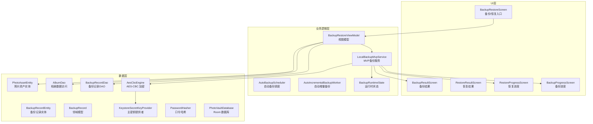

**图表来源**
- [LocalBackupMvpService.kt:35-552](file://android/app/src/main/kotlin/com/photovault/app/ui/backup/LocalBackupMvpService.kt#L35-L552)
- [AutoBackupScheduler.kt:16-83](file://android/app/src/main/kotlin/com/photovault/app/ui/backup/AutoBackupScheduler.kt#L16-L83)
- [AutoIncrementalBackupWorker.kt:7-15](file://android/app/src/main/kotlin/com/photovault/app/ui/backup/AutoIncrementalBackupWorker.kt#L7-L15)
- [BackupRestoreScreen.kt:208-276](file://android/app/src/main/kotlin/com/photovault/app/ui/BackupRestoreScreen.kt#L208-L276)
- [BackupProgressScreen.kt:40-127](file://android/app/src/main/kotlin/com/photovault/app/ui/BackupProgressScreen.kt#L40-L127)
- [RestoreProgressScreen.kt:40-124](file://android/app/src/main/kotlin/com/photovault/app/ui/RestoreProgressScreen.kt#L40-L124)
- [BackupResultScreen.kt:1-125](file://android/app/src/main/kotlin/com/photovault/app/ui/BackupResultScreen.kt#L1-L125)
- [RestoreResultScreen.kt:1-122](file://android/app/src/main/kotlin/com/photovault/app/ui/RestoreResultScreen.kt#L1-L122)

**章节来源**
- [LocalBackupMvpService.kt:35-552](file://android/app/src/main/kotlin/com/photovault/app/ui/backup/LocalBackupMvpService.kt#L35-L552)
- [AutoBackupScheduler.kt:16-83](file://android/app/src/main/kotlin/com/photovault/app/ui/backup/AutoBackupScheduler.kt#L16-L83)
- [AutoIncrementalBackupWorker.kt:7-15](file://android/app/src/main/kotlin/com/photovault/app/ui/backup/AutoIncrementalBackupWorker.kt#L7-L15)
- [BackupRestoreScreen.kt:208-276](file://android/app/src/main/kotlin/com/photovault/app/ui/BackupRestoreScreen.kt#L208-L276)
- [BackupProgressScreen.kt:40-127](file://android/app/src/main/kotlin/com/photovault/app/ui/BackupProgressScreen.kt#L40-L127)
- [RestoreProgressScreen.kt:40-124](file://android/app/src/main/kotlin/com/photovault/app/ui/RestoreProgressScreen.kt#L40-L124)

## 核心组件
- **LocalBackupMvpService**：完整的MVP架构备份服务，支持全量/增量备份、多卷存储、数据完整性校验
- **AutoBackupScheduler**：基于WorkManager的自动备份调度系统，支持充电/空闲条件约束
- **AutoIncrementalBackupWorker**：CoroutineWorker实现的自动增量备份任务
- **BackupRuntimeState**：线程安全的运行时状态管理，保存最近的备份/恢复结果
- **BackupProgressScreen和RestoreProgressScreen**：提供实时进度反馈的用户界面
- **备份记录实体与领域模型**：用于持久化备份包信息（文件路径、时间戳、版本、校验值）
- **加密与密钥管理**：基于 Android Keystore 的 AES-256-CBC 加密引擎，确保备份数据在设备侧安全存储
- **数据库与DAO**：Room 数据库定义了备份记录、相册、照片资产等实体，DAO 提供数据访问能力

**章节来源**
- [LocalBackupMvpService.kt:35-552](file://android/app/src/main/kotlin/com/photovault/app/ui/backup/LocalBackupMvpService.kt#L35-L552)
- [AutoBackupScheduler.kt:16-83](file://android/app/src/main/kotlin/com/photovault/app/ui/backup/AutoBackupScheduler.kt#L16-L83)
- [AutoIncrementalBackupWorker.kt:7-15](file://android/app/src/main/kotlin/com/photovault/app/ui/backup/AutoIncrementalBackupWorker.kt#L7-L15)
- [BackupRuntimeState.kt:3-9](file://android/app/src/main/kotlin/com/photovault/app/ui/backup/BackupRuntimeState.kt#L3-L9)
- [BackupProgressScreen.kt:40-127](file://android/app/src/main/kotlin/com/photovault/app/ui/BackupProgressScreen.kt#L40-L127)
- [RestoreProgressScreen.kt:40-124](file://android/app/src/main/kotlin/com/photovault/app/ui/RestoreProgressScreen.kt#L40-L124)
- [BackupRecordEntity.kt:8-18](file://android/core/data/src/main/kotlin/com/photovault/data/db/entity/BackupRecordEntity.kt#L8-L18)
- [BackupRecord.kt:6-12](file://android/core/domain/src/main/kotlin/com/photovault/domain/model/BackupRecord.kt#L6-L12)
- [AesCbcEngine.kt:12-32](file://android/core/data/src/main/kotlin/com/photovault/data/crypto/AesCbcEngine.kt#L12-L32)
- [KeystoreSecretKeyProvider.kt:18-35](file://android/core/data/src/main/kotlin/com/photovault/data/crypto/KeystoreSecretKeyProvider.kt#L18-L35)

## 架构总览
备份恢复系统采用"界面层-业务逻辑层-数据层-加密与密钥"的完整分层设计：
- 界面层负责用户交互与导航，提供备份入口、进度显示、结果展示
- 业务逻辑层通过LocalBackupMvpService实现完整的备份/恢复业务逻辑，包括MVP架构、多卷存储、增量备份
- 自动化层通过AutoBackupScheduler和AutoIncrementalBackupWorker实现定时备份
- 数据层通过 Room 管理实体关系，支持备份记录与相册、照片资产等数据的持久化
- 加密与密钥管理保障备份文件在设备侧的安全性，避免明文泄露

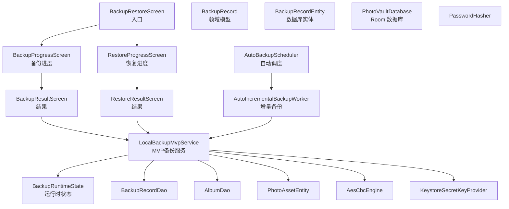

**图表来源**
- [LocalBackupMvpService.kt:35-552](file://android/app/src/main/kotlin/com/photovault/app/ui/backup/LocalBackupMvpService.kt#L35-L552)
- [AutoBackupScheduler.kt:16-83](file://android/app/src/main/kotlin/com/photovault/app/ui/backup/AutoBackupScheduler.kt#L16-L83)
- [AutoIncrementalBackupWorker.kt:7-15](file://android/app/src/main/kotlin/com/photovault/app/ui/backup/AutoIncrementalBackupWorker.kt#L7-L15)
- [BackupRestoreScreen.kt:208-276](file://android/app/src/main/kotlin/com/photovault/app/ui/BackupRestoreScreen.kt#L208-L276)
- [BackupProgressScreen.kt:40-127](file://android/app/src/main/kotlin/com/photovault/app/ui/BackupProgressScreen.kt#L40-L127)
- [RestoreProgressScreen.kt:40-124](file://android/app/src/main/kotlin/com/photovault/app/ui/RestoreProgressScreen.kt#L40-L124)
- [BackupResultScreen.kt:1-125](file://android/app/src/main/kotlin/com/photovault/app/ui/BackupResultScreen.kt#L1-L125)
- [RestoreResultScreen.kt:1-122](file://android/app/src/main/kotlin/com/photovault/app/ui/RestoreResultScreen.kt#L1-L122)
- [BackupRecord.kt:6-12](file://android/core/domain/src/main/kotlin/com/photovault/domain/model/BackupRecord.kt#L6-L12)
- [BackupRecordEntity.kt:8-18](file://android/core/data/src/main/kotlin/com/photovault/data/db/entity/BackupRecordEntity.kt#L8-L18)
- [BackupRecordDao.kt:9-19](file://android/core/data/src/main/kotlin/com/photovault/data/db/dao/BackupRecordDao.kt#L9-L19)
- [PhotoVaultDatabase.kt:14-25](file://android/core/data/src/main/kotlin/com/photovault/data/db/PhotoVaultDatabase.kt#L14-L25)
- [AlbumDao.kt:1-18](file://android/core/data/src/main/kotlin/com/photovault/data/db/dao/AlbumDao.kt#L1-18)
- [PhotoAssetEntity.kt:9-32](file://android/core/data/src/main/kotlin/com/photovault/data/db/entity/PhotoAssetEntity.kt#L9-L32)
- [AesCbcEngine.kt:12-32](file://android/core/data/src/main/kotlin/com/photovault/data/crypto/AesCbcEngine.kt#L12-L32)
- [KeystoreSecretKeyProvider.kt:18-35](file://android/core/data/src/main/kotlin/com/photovault/data/crypto/KeystoreSecretKeyProvider.kt#L18-L35)

## 详细组件分析

### MVP架构备份服务：LocalBackupMvpService
**更新** 新增完整的MVP架构备份服务，替代原有的简单占位符实现

- **功能职责**
  - 实现完整的备份/恢复业务逻辑，包括全量/增量备份、多卷存储、数据完整性校验
  - 管理备份索引、清单文件、加密密钥生成与管理
  - 提供备份导出/导入、自动清理、数据库记录同步等功能
- **核心特性**
  - 多卷存储：单个备份包拆分为多个体积限制的卷文件
  - 增量备份：基于上次备份的差异检测，仅备份变更数据
  - 数据完整性：SHA-256校验、加密完整性保护
  - 自动清理：最多保留指定数量的历史备份
- **关键数据结构**
  - BackupManifest：备份清单，包含备份ID、类型、资产列表、卷信息
  - BackupAsset：备份资产，包含相对路径、大小、校验值、卷位置信息
  - BackupVolume：备份卷，包含文件名、加密大小、校验值

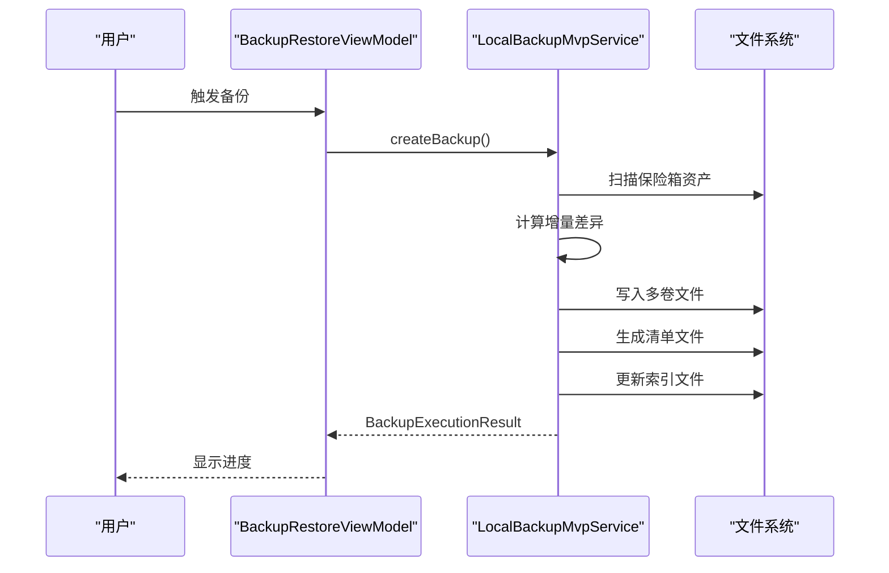

**图表来源**
- [LocalBackupMvpService.kt:49-106](file://android/app/src/main/kotlin/com/photovault/app/ui/backup/LocalBackupMvpService.kt#L49-L106)
- [LocalBackupMvpService.kt:316-392](file://android/app/src/main/kotlin/com/photovault/app/ui/backup/LocalBackupMvpService.kt#L316-L392)
- [LocalBackupMvpService.kt:394-406](file://android/app/src/main/kotlin/com/photovault/app/ui/backup/LocalBackupMvpService.kt#L394-L406)

**章节来源**
- [LocalBackupMvpService.kt:35-552](file://android/app/src/main/kotlin/com/photovault/app/ui/backup/LocalBackupMvpService.kt#L35-L552)

### 自动备份调度系统：AutoBackupScheduler
**更新** 新增基于WorkManager的自动备份调度系统

- **功能职责**
  - 管理自动备份的启用/禁用状态
  - 配置充电/空闲条件约束
  - 周期性调度增量备份任务
- **关键特性**
  - 基于SharedPreferences的状态管理
  - WorkManager周期性任务调度
  - 灵活的约束条件配置（电池状态、充电状态、设备空闲）

**图表来源**
- [AutoBackupScheduler.kt:17-31](file://android/app/src/main/kotlin/com/photovault/app/ui/backup/AutoBackupScheduler.kt#L17-L31)
- [AutoBackupScheduler.kt:61-78](file://android/app/src/main/kotlin/com/photovault/app/ui/backup/AutoBackupScheduler.kt#L61-L78)
- [AutoIncrementalBackupWorker.kt:11-14](file://android/app/src/main/kotlin/com/photovault/app/ui/backup/AutoIncrementalBackupWorker.kt#L11-L14)

**章节来源**
- [AutoBackupScheduler.kt:16-83](file://android/app/src/main/kotlin/com/photovault/app/ui/backup/AutoBackupScheduler.kt#L16-L83)
- [AutoIncrementalBackupWorker.kt:7-15](file://android/app/src/main/kotlin/com/photovault/app/ui/backup/AutoIncrementalBackupWorker.kt#L7-L15)

### 运行时状态管理：BackupRuntimeState
**更新** 新增线程安全的运行时状态管理

- **功能职责**
  - 存储最近的备份执行结果
  - 存储最近的恢复执行结果
  - 提供线程安全的单例访问
- **关键特性**
  - volatile关键字确保内存可见性
  - 线程安全的单例模式
  - 支持UI层获取最新执行状态

**章节来源**
- [BackupRuntimeState.kt:3-9](file://android/app/src/main/kotlin/com/photovault/app/ui/backup/BackupRuntimeState.kt#L3-L9)

### 备份进度界面：BackupProgressScreen
**更新** 新增完整的备份进度界面，提供实时进度反馈

- **功能职责**
  - 显示备份进行中的进度指示器
  - 提供延迟启动机制，避免界面闪烁
  - 处理备份过程中的错误状态
  - 支持用户取消操作
- **关键交互**
  - 自动启动备份任务
  - 实时监听备份状态变化
  - 错误弹窗提示与处理
  - 成功后的自动导航

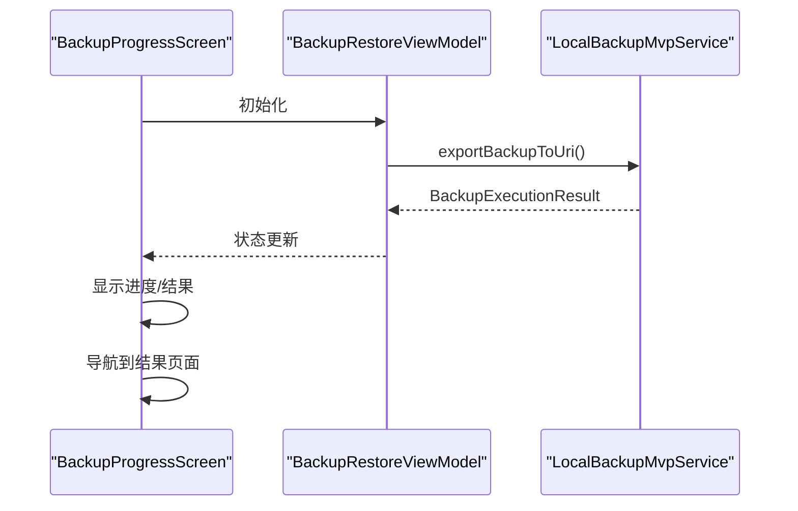

**图表来源**
- [BackupProgressScreen.kt:52-68](file://android/app/src/main/kotlin/com/photovault/app/ui/BackupProgressScreen.kt#L52-L68)
- [BackupProgressScreen.kt:70-79](file://android/app/src/main/kotlin/com/photovault/app/ui/BackupProgressScreen.kt#L70-L79)

**章节来源**
- [BackupProgressScreen.kt:40-127](file://android/app/src/main/kotlin/com/photovault/app/ui/BackupProgressScreen.kt#L40-L127)

### 恢复进度界面：RestoreProgressScreen
**更新** 新增完整的恢复进度界面，提供实时进度反馈

- **功能职责**
  - 显示恢复进行中的进度指示器
  - 提供延迟启动机制，避免界面闪烁
  - 处理恢复过程中的错误状态
  - 支持用户取消操作
- **关键交互**
  - 自动启动恢复任务
  - 实时监听恢复状态变化
  - 错误弹窗提示与处理
  - 成功后的自动导航

**章节来源**
- [RestoreProgressScreen.kt:40-124](file://android/app/src/main/kotlin/com/photovault/app/ui/RestoreProgressScreen.kt#L40-L124)

### 备份界面：BackupRestoreScreen
- **功能职责**
  - 提供"备份"和"恢复"两个入口卡片，分别导航到备份结果页与恢复结果页
  - 使用统一的主题样式与间距常量，保证视觉一致性
- **关键交互**
  - "备份"卡片点击后触发备份流程，并跳转至备份结果页
  - "恢复"卡片点击后触发恢复流程，并跳转至恢复结果页
- **设计要点**
  - 使用徽标图标与文案描述增强可发现性
  - 按钮采用主次变体区分优先级

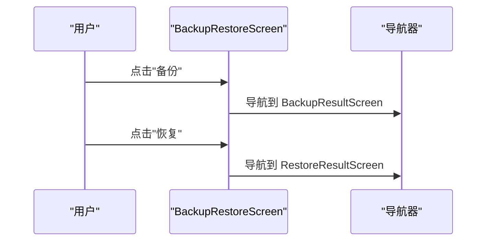

**图表来源**
- [BackupRestoreScreen.kt:104-115](file://android/app/src/main/kotlin/com/photovault/app/ui/BackupRestoreScreen.kt#L104-L115)

**章节来源**
- [BackupRestoreScreen.kt:88-206](file://android/app/src/main/kotlin/com/photovault/app/ui/BackupRestoreScreen.kt#L88-L206)

### 备份结果界面：BackupResultScreen
- **功能职责**
  - 展示备份成功状态与统计信息（如备份文件名、大小）
  - 提供完成按钮，返回上一界面
  - 显示最近的备份结果
- **关键元素**
  - 成功徽章与标题提示
  - 元信息行展示备份文件与大小
  - 统一样式与主题色系

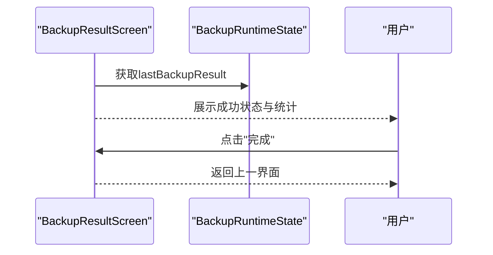

**图表来源**
- [BackupResultScreen.kt:32-82](file://android/app/src/main/kotlin/com/photovault/app/ui/BackupResultScreen.kt#L32-L82)
- [BackupRuntimeState.kt:4-5](file://android/app/src/main/kotlin/com/photovault/app/ui/backup/BackupRuntimeState.kt#L4-L5)

**章节来源**
- [BackupResultScreen.kt:1-125](file://android/app/src/main/kotlin/com/photovault/app/ui/BackupResultScreen.kt#L1-L125)

### 恢复结果界面：RestoreResultScreen
- **功能职责**
  - 展示恢复成功状态与统计信息（如恢复条目数）
  - 提供完成按钮，返回上一界面
  - 显示最近的恢复结果
- **关键元素**
  - 成功徽章与标题提示
  - 统计信息行展示恢复结果
  - 统一样式与主题色系

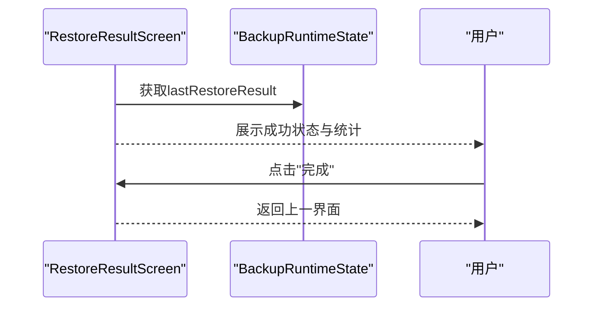

**图表来源**
- [RestoreResultScreen.kt:32-75](file://android/app/src/main/kotlin/com/photovault/app/ui/RestoreResultScreen.kt#L32-L75)
- [BackupRuntimeState.kt:7-8](file://android/app/src/main/kotlin/com/photovault/app/ui/backup/BackupRuntimeState.kt#L7-L8)

**章节来源**
- [RestoreResultScreen.kt:1-122](file://android/app/src/main/kotlin/com/photovault/app/ui/RestoreResultScreen.kt#L1-L122)

### 备份记录模型与数据库
- **备份记录实体**
  - 字段包括自增 ID、文件路径、创建时间（毫秒）、版本号、校验值（十六进制）
  - 以 Room 实体形式持久化，便于查询与管理
- **领域模型**
  - 对应实体的轻量领域对象，便于在业务层传递与使用
- **数据库定义**
  - Room 数据库包含备份记录、相册、照片资产等实体
  - 通过 DAO 提供观察与插入等操作

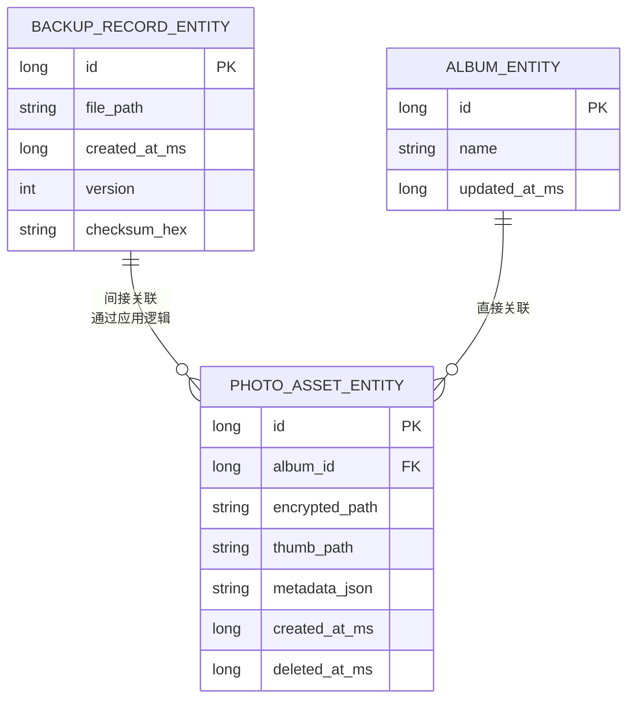

**图表来源**
- [BackupRecordEntity.kt:8-18](file://android/core/data/src/main/kotlin/com/photovault/data/db/entity/BackupRecordEntity.kt#L8-L18)
- [PhotoAssetEntity.kt:9-32](file://android/core/data/src/main/kotlin/com/photovault/data/db/entity/PhotoAssetEntity.kt#L9-L32)
- [PhotoVaultDatabase.kt:14-25](file://android/core/data/src/main/kotlin/com/photovault/data/db/PhotoVaultDatabase.kt#L14-L25)

**章节来源**
- [BackupRecordEntity.kt:1-19](file://android/core/data/src/main/kotlin/com/photovault/data/db/entity/BackupRecordEntity.kt#L1-L19)
- [BackupRecord.kt:1-13](file://android/core/domain/src/main/kotlin/com/photovault/domain/model/BackupRecord.kt#L1-L13)
- [PhotoVaultDatabase.kt:1-36](file://android/core/data/src/main/kotlin/com/photovault/data/db/PhotoVaultDatabase.kt#L1-L36)
- [AlbumDao.kt:1-18](file://android/core/data/src/main/kotlin/com/photovault/data/db/dao/AlbumDao.kt#L1-L18)
- [PhotoAssetEntity.kt:1-33](file://android/core/data/src/main/kotlin/com/photovault/data/db/entity/PhotoAssetEntity.kt#L1-L33)

### 加密与密钥管理
- **AES-256-CBC 加密**
  - 使用固定变换名与 PKCS7 填充
  - IV 长度为 16 字节，前置拼接在密文前
  - 通过 Android Keystore 托管主密钥，确保密钥材料不可导出
- **口令哈希**
  - 提供 SHA-256 哈希与带盐计算方法，可用于 PIN 或口令存储场景

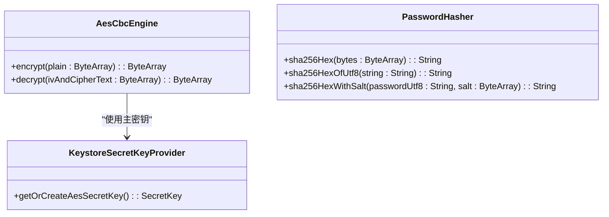

**图表来源**
- [AesCbcEngine.kt:12-32](file://android/core/data/src/main/kotlin/com/photovault/data/crypto/AesCbcEngine.kt#L12-L32)
- [KeystoreSecretKeyProvider.kt:18-35](file://android/core/data/src/main/kotlin/com/photovault/data/crypto/KeystoreSecretKeyProvider.kt#L18-L35)
- [PasswordHasher.kt:6-25](file://android/core/data/src/main/kotlin/com/photovault/data/crypto/PasswordHasher.kt#L6-L25)

**章节来源**
- [AesCbcEngine.kt:1-40](file://android/core/data/src/main/kotlin/com/photovault/data/crypto/AesCbcEngine.kt#L1-L40)
- [KeystoreSecretKeyProvider.kt:1-42](file://android/core/data/src/main/kotlin/com/photovault/data/crypto/KeystoreSecretKeyProvider.kt#L1-L42)
- [PasswordHasher.kt:1-26](file://android/core/data/src/main/kotlin/com/photovault/data/crypto/PasswordHasher.kt#L1-L26)

### 备份文件格式与数据完整性
**更新** 升级为MVP架构的多卷备份文件格式

- **备份文件格式**
  - 备份包为加密的 ZIP 文件，包含索引文件和清单文件
  - 支持多卷存储，单个卷最大32MB
  - 清单文件使用AES加密保护
- **数据完整性校验**
  - 备份记录包含校验值字段，用于验证备份包的完整性
  - 每个卷文件都有独立的SHA-256校验值
  - 资产文件包含SHA-256校验值，恢复时进行二次校验
- **恢复流程**
  - 读取备份记录，解密对应备份包，解析并写入数据库，最后更新备份记录

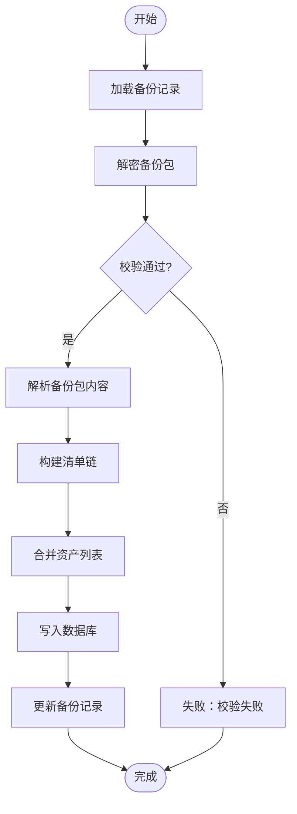

**图表来源**
- [LocalBackupMvpService.kt:251-314](file://android/app/src/main/kotlin/com/photovault/app/ui/backup/LocalBackupMvpService.kt#L251-L314)
- [LocalBackupMvpService.kt:432-444](file://android/app/src/main/kotlin/com/photovault/app/ui/backup/LocalBackupMvpService.kt#L432-L444)

**章节来源**
- [LocalBackupMvpService.kt:178-249](file://android/app/src/main/kotlin/com/photovault/app/ui/backup/LocalBackupMvpService.kt#L178-L249)
- [LocalBackupMvpService.kt:251-314](file://android/app/src/main/kotlin/com/photovault/app/ui/backup/LocalBackupMvpService.kt#L251-L314)
- [BackupRecordEntity.kt:14-17](file://android/core/data/src/main/kotlin/com/photovault/data/db/entity/BackupRecordEntity.kt#L14-L17)

### 增量备份与全量备份
**更新** 基于MVP架构的完整增量备份实现

- **全量备份**
  - 将当前数据库快照打包为新的备份包，生成新的备份记录
  - 包含所有资产文件和完整清单
- **增量备份**
  - 基于上次备份时间戳，仅打包变更的数据项，减少体积与耗时
  - 通过SHA-256校验值对比，识别变更的资产文件
  - 支持多层增量链，可追溯历史版本
- **实现机制**
  - 自动扫描保险箱资产，计算SHA-256校验值
  - 对比上次备份的资产清单，识别差异
  - 仅备份差异资产，生成增量清单

**章节来源**
- [LocalBackupMvpService.kt:49-106](file://android/app/src/main/kotlin/com/photovault/app/ui/backup/LocalBackupMvpService.kt#L49-L106)
- [LocalBackupMvpService.kt:408-430](file://android/app/src/main/kotlin/com/photovault/app/ui/backup/LocalBackupMvpService.kt#L408-L430)
- [LocalBackupMvpService.kt:62-69](file://android/app/src/main/kotlin/com/photovault/app/ui/backup/LocalBackupMvpService.kt#L62-L69)

### 错误恢复机制
**更新** 增强的错误恢复机制

- **校验失败**
  - 若校验值不匹配，拒绝恢复并提示用户重新选择有效备份
  - 支持ZIP文件完整性验证和路径合法性检查
- **解密异常**
  - 若密文格式非法或密钥不可用，提示用户检查设备环境或重新生成密钥
  - 自动密钥种子管理，确保密钥一致性
- **数据库写入失败**
  - 回滚已写入的部分，保留原始数据不变，并记录错误日志
  - 支持部分恢复，跳过失败的资产文件
- **进度监控**
  - BackupProgressScreen和RestoreProgressScreen提供实时进度反馈
  - 错误状态通过对话框提示用户

**章节来源**
- [LocalBackupMvpService.kt:178-214](file://android/app/src/main/kotlin/com/photovault/app/ui/backup/LocalBackupMvpService.kt#L178-L214)
- [LocalBackupMvpService.kt:251-314](file://android/app/src/main/kotlin/com/photovault/app/ui/backup/LocalBackupMvpService.kt#L251-L314)
- [BackupProgressScreen.kt:70-79](file://android/app/src/main/kotlin/com/photovault/app/ui/BackupProgressScreen.kt#L70-L79)
- [RestoreProgressScreen.kt:67-76](file://android/app/src/main/kotlin/com/photovault/app/ui/RestoreProgressScreen.kt#L67-L76)

### 安全存储、加密传输与压缩优化
**更新** 基于MVP架构的安全存储策略

- **安全存储**
  - 使用 Android Keystore 管理主密钥，密钥材料不可导出
  - 备份包在设备侧进行 AES-256-CBC 加密，IV 前置
  - 密钥种子通过SharedPreferences持久化，支持设备迁移
- **加密传输**
  - 建议在跨设备传输时再次加密或使用受信通道（如 HTTPS）
  - 支持通过外部URI进行备份文件的导入导出
- **压缩优化**
  - 备份包采用 ZIP 格式，结合媒体文件的压缩策略可进一步降低体积
  - 多卷存储减少单文件大小，提高传输稳定性

**章节来源**
- [LocalBackupMvpService.kt:36-47](file://android/app/src/main/kotlin/com/photovault/app/ui/backup/LocalBackupMvpService.kt#L36-L47)
- [LocalBackupMvpService.kt:108-138](file://android/app/src/main/kotlin/com/photovault/app/ui/backup/LocalBackupMvpService.kt#L108-L138)
- [LocalBackupMvpService.kt:140-176](file://android/app/src/main/kotlin/com/photovault/app/ui/backup/LocalBackupMvpService.kt#L140-L176)

### 备份策略配置、自动化与跨设备同步
**更新** 完整的备份策略配置和自动化系统

- **策略配置**
  - 支持设置备份频率（每日/每周/手动）、是否启用增量备份、是否自动清理旧备份
  - 自动备份支持充电/空闲条件约束
  - 最多保留2个历史备份版本
- **自动化备份**
  - 在应用空闲时段或网络可用时触发备份任务
  - 基于WorkManager的可靠任务调度
  - 支持失败重试机制
- **跨设备同步**
  - 通过云端服务上传/下载加密备份包，结合设备间的账号体系实现数据同步
  - 支持通过外部URI进行备份文件的导入导出

**章节来源**
- [AutoBackupScheduler.kt:16-83](file://android/app/src/main/kotlin/com/photovault/app/ui/backup/AutoBackupScheduler.kt#L16-L83)
- [AutoIncrementalBackupWorker.kt:7-15](file://android/app/src/main/kotlin/com/photovault/app/ui/backup/AutoIncrementalBackupWorker.kt#L7-L15)
- [LocalBackupMvpService.kt:491-497](file://android/app/src/main/kotlin/com/photovault/app/ui/backup/LocalBackupMvpService.kt#L491-L497)
- [LocalBackupMvpService.kt:446-475](file://android/app/src/main/kotlin/com/photovault/app/ui/backup/LocalBackupMvpService.kt#L446-L475)

## 依赖分析
**更新** 完整的依赖关系分析

- **组件耦合**
  - UI层通过ViewModel与业务逻辑层解耦
  - 业务逻辑层通过LocalBackupMvpService集中管理
  - 数据层通过实体与DAO提供稳定接口
- **外部依赖**
  - Android Keystore 提供密钥托管
  - Room 提供数据库持久化
  - WorkManager 提供后台任务调度
  - SharedPreferences 提供配置持久化
- **潜在风险**
  - 若密钥被重置或设备迁移，需提供密钥恢复流程
  - 数据库版本升级时需谨慎迁移
  - 多卷存储增加了文件管理复杂度

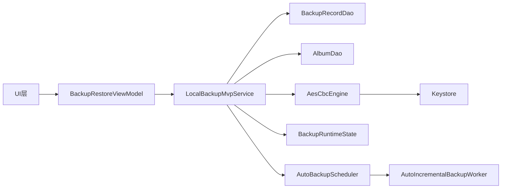

**图表来源**
- [BackupRestoreScreen.kt:208-276](file://android/app/src/main/kotlin/com/photovault/app/ui/BackupRestoreScreen.kt#L208-L276)
- [LocalBackupMvpService.kt:35-552](file://android/app/src/main/kotlin/com/photovault/app/ui/backup/LocalBackupMvpService.kt#L35-L552)
- [AutoBackupScheduler.kt:16-83](file://android/app/src/main/kotlin/com/photovault/app/ui/backup/AutoBackupScheduler.kt#L16-L83)
- [AutoIncrementalBackupWorker.kt:7-15](file://android/app/src/main/kotlin/com/photovault/app/ui/backup/AutoIncrementalBackupWorker.kt#L7-L15)
- [BackupRecordDao.kt:9-19](file://android/core/data/src/main/kotlin/com/photovault/data/db/dao/BackupRecordDao.kt#L9-L19)
- [AesCbcEngine.kt:12-32](file://android/core/data/src/main/kotlin/com/photovault/data/crypto/AesCbcEngine.kt#L12-L32)
- [KeystoreSecretKeyProvider.kt:18-35](file://android/core/data/src/main/kotlin/com/photovault/data/crypto/KeystoreSecretKeyProvider.kt#L18-L35)

**章节来源**
- [BackupRestoreScreen.kt:208-276](file://android/app/src/main/kotlin/com/photovault/app/ui/BackupRestoreScreen.kt#L208-L276)
- [LocalBackupMvpService.kt:35-552](file://android/app/src/main/kotlin/com/photovault/app/ui/backup/LocalBackupMvpService.kt#L35-L552)
- [AutoBackupScheduler.kt:16-83](file://android/app/src/main/kotlin/com/photovault/app/ui/backup/AutoBackupScheduler.kt#L16-L83)
- [AutoIncrementalBackupWorker.kt:7-15](file://android/app/src/main/kotlin/com/photovault/app/ui/backup/AutoIncrementalBackupWorker.kt#L7-L15)

## 性能考虑
**更新** 基于MVP架构的性能优化策略

- **备份性能**
  - 增量备份减少数据量，提升速度
  - 多卷存储支持并行处理，提升吞吐量
  - 合理分片与并发写入可提升吞吐
  - VOLUME_MAX_BYTES限制确保单卷大小可控
- **恢复性能**
  - 并行解析与写入可缩短恢复时间
  - 预分配数据库空间，减少碎片
  - 支持部分恢复，跳过失败的资产文件
- **用户体验**
  - BackupProgressScreen和RestoreProgressScreen提供实时进度反馈
  - 可中断操作和错误重试机制
  - 失败重试与断点续传
- **内存管理**
  - 使用DataOutputStream和RandomAccessFile优化内存使用
  - 流式处理大文件，避免内存溢出
  - 及时释放文件句柄和流资源

## 故障排除指南
**更新** 基于MVP架构的故障排除指南

- **备份失败**
  - 检查存储权限与可用空间
  - 校验密钥状态与 Keystore 可用性
  - 验证保险箱目录是否存在
  - 查看BackupProgressScreen的错误提示
- **恢复失败**
  - 确认备份包未被篡改且校验通过
  - 检查数据库版本兼容性与迁移脚本
  - 验证ZIP文件完整性
  - 查看RestoreProgressScreen的错误提示
- **数据不一致**
  - 重新执行备份并替换旧记录
  - 回滚到上一次成功的备份记录
  - 检查多卷文件的完整性
- **自动备份问题**
  - 检查AutoBackupScheduler的配置状态
  - 验证WorkManager的任务调度
  - 确认充电/空闲条件满足

## 结论
本备份恢复系统已发展为完整的MVP架构，以清晰的分层设计为基础，结合加密与密钥管理保障安全性，通过Room数据库与实体模型实现稳定的持久化。新增的LocalBackupMvpService提供了完整的备份/恢复业务逻辑，AutoBackupScheduler实现了可靠的自动化备份，BackupProgressScreen和RestoreProgressScreen提供了优秀的用户体验。系统支持增量备份、多卷存储、数据完整性校验等高级特性，为AI照片保险库提供了强大的数据保护能力。后续可在跨设备同步、云存储集成等方面进一步完善，以满足更复杂的使用场景。

## 附录
- **术语**
  - 备份包：包含加密数据的 ZIP 文件
  - 校验值：用于验证备份包完整性的哈希值
  - 增量备份：仅包含自上次备份以来变更的数据
  - 多卷存储：将大文件拆分为多个小卷文件
  - MVP架构：Model-View-Presenter架构模式
- **参考路径**
  - 备份服务与调度：[LocalBackupMvpService.kt:35-552](file://android/app/src/main/kotlin/com/photovault/app/ui/backup/LocalBackupMvpService.kt#L35-L552)、[AutoBackupScheduler.kt:16-83](file://android/app/src/main/kotlin/com/photovault/app/ui/backup/AutoBackupScheduler.kt#L16-L83)、[AutoIncrementalBackupWorker.kt:7-15](file://android/app/src/main/kotlin/com/photovault/app/ui/backup/AutoIncrementalBackupWorker.kt#L7-L15)
  - 进度界面：[BackupProgressScreen.kt:40-127](file://android/app/src/main/kotlin/com/photovault/app/ui/BackupProgressScreen.kt#L40-L127)、[RestoreProgressScreen.kt:40-124](file://android/app/src/main/kotlin/com/photovault/app/ui/RestoreProgressScreen.kt#L40-L124)
  - 运行时状态：[BackupRuntimeState.kt:3-9](file://android/app/src/main/kotlin/com/photovault/app/ui/backup/BackupRuntimeState.kt#L3-L9)
  - 备份记录实体与领域模型：[BackupRecordEntity.kt:1-19](file://android/core/data/src/main/kotlin/com/photovault/data/db/entity/BackupRecordEntity.kt#L1-L19)、[BackupRecord.kt:1-13](file://android/core/domain/src/main/kotlin/com/photovault/domain/model/BackupRecord.kt#L1-L13)
  - 加密与密钥管理：[AesCbcEngine.kt:1-40](file://android/core/data/src/main/kotlin/com/photovault/data/crypto/AesCbcEngine.kt#L1-L40)、[KeystoreSecretKeyProvider.kt:1-42](file://android/core/data/src/main/kotlin/com/photovault/data/crypto/KeystoreSecretKeyProvider.kt#L1-L42)、[PasswordHasher.kt:1-26](file://android/core/data/src/main/kotlin/com/photovault/data/crypto/PasswordHasher.kt#L1-L26)
  - 数据库与DAO：[PhotoVaultDatabase.kt:1-36](file://android/core/data/src/main/kotlin/com/photovault/data/db/PhotoVaultDatabase.kt#L1-L36)、[AlbumDao.kt:1-18](file://android/core/data/src/main/kotlin/com/photovault/data/db/dao/AlbumDao.kt#L1-L18)、[PhotoAssetEntity.kt:1-33](file://android/core/data/src/main/kotlin/com/photovault/data/db/entity/PhotoAssetEntity.kt#L1-L33)
  - UI界面：[BackupRestoreScreen.kt:88-206](file://android/app/src/main/kotlin/com/photovault/app/ui/BackupRestoreScreen.kt#L88-L206)、[BackupResultScreen.kt:1-125](file://android/app/src/main/kotlin/com/photovault/app/ui/BackupResultScreen.kt#L1-L125)、[RestoreResultScreen.kt:1-122](file://android/app/src/main/kotlin/com/photovault/app/ui/RestoreResultScreen.kt#L1-L122)