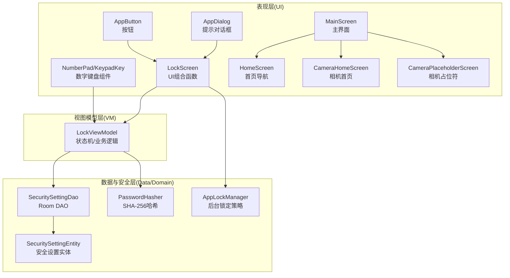
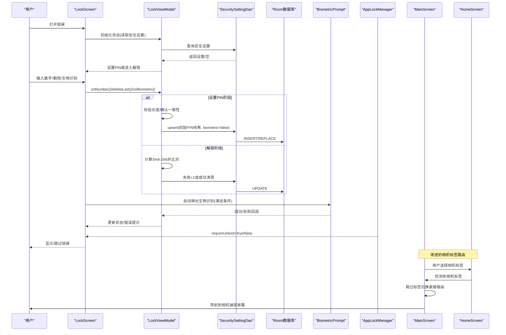
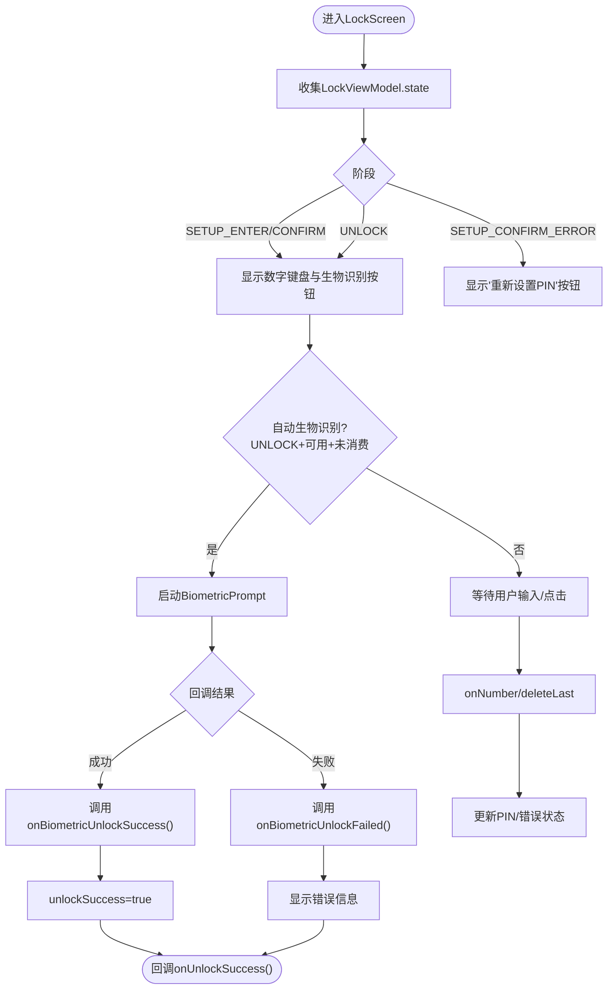
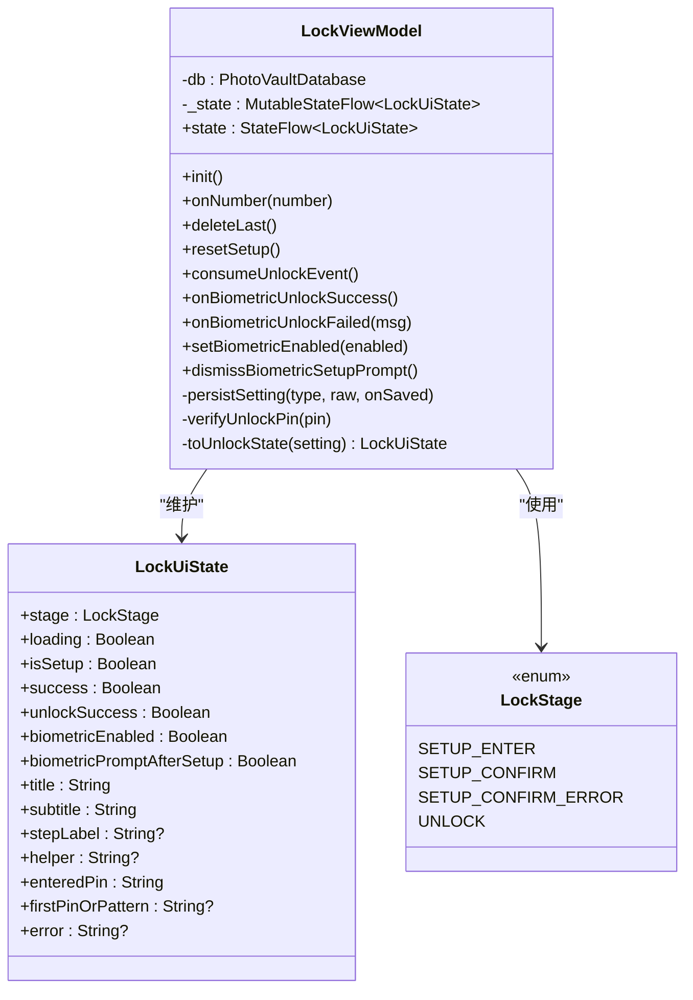
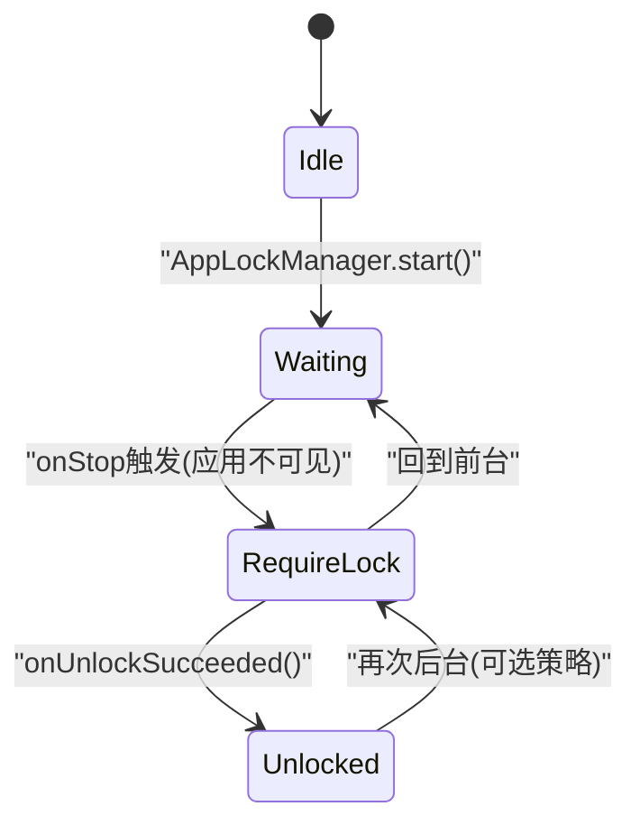
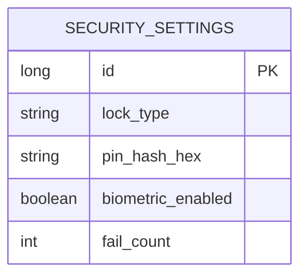
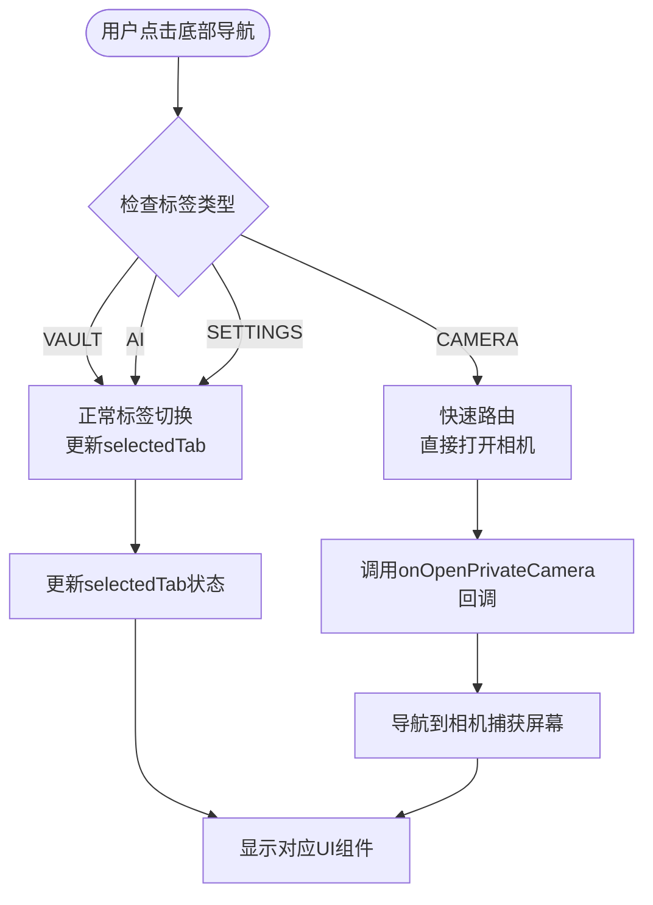
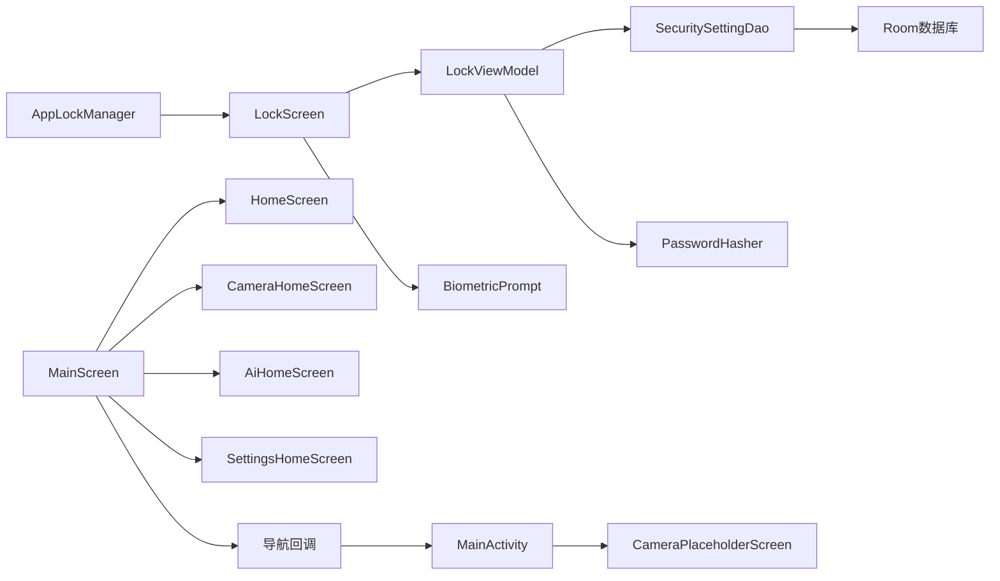

# 安全解锁系统

<cite>
**本文引用的文件**
- [android/app/src/main/kotlin/com/photovault/app/ui/lock/LockScreen.kt](file://android/app/src/main/kotlin/com/photovault/app/ui/lock/LockScreen.kt)
- [android/app/src/main/kotlin/com/photovault/app/ui/lock/LockViewModel.kt](file://android/app/src/main/kotlin/com/photovault/app/ui/lock/LockViewModel.kt)
- [android/app/src/main/kotlin/com/photovault/app/AppLockManager.kt](file://android/app/src/main/kotlin/com/photovault/app/AppLockManager.kt)
- [android/core/data/src/main/kotlin/com/photovault/data/db/entity/SecuritySettingEntity.kt](file://android/core/data/src/main/kotlin/com/photovault/data/db/entity/SecuritySettingEntity.kt)
- [android/core/data/src/main/kotlin/com/photovault/data/crypto/PasswordHasher.kt](file://android/core/data/src/main/kotlin/com/photovault/data/crypto/PasswordHasher.kt)
- [android/core/data/src/main/kotlin/com/photovault/data/db/dao/SecuritySettingDao.kt](file://android/core/data/src/main/kotlin/com/photovault/data/db/dao/SecuritySettingDao.kt)
- [doc/android/03-解锁与安全模块.md](file://doc/android/03-解锁与安全模块.md)
- [android/app/src/main/kotlin/com/photovault/app/ui/components/AppButton.kt](file://android/app/src/main/kotlin/com/photovault/app/ui/components/AppButton.kt)
- [android/app/src/main/kotlin/com/photovault/app/ui/components/AppDialog.kt](file://android/app/src/main/kotlin/com/photovault/app/ui/components/AppDialog.kt)
- [android/app/src/main/kotlin/com/photovault/app/ui/theme/UiTokens.kt](file://android/app/src/main/kotlin/com/photovault/app/ui/theme/UiTokens.kt)
- [android/app/src/main/kotlin/com/photovault/app/ui/feedback/PressFeedback.kt](file://android/app/src/main/kotlin/com/photovault/app/ui/feedback/PressFeedback.kt)
- [android/app/src/main/kotlin/com/photovault/app/ui/feedback/ThrottledClick.kt](file://android/app/src/main/kotlin/com/photovault/app/ui/feedback/ThrottledClick.kt)
- [android/app/src/main/kotlin/com/photovault/app/MainActivity.kt](file://android/app/src/main/kotlin/com/photovault/app/MainActivity.kt)
- [android/app/src/main/kotlin/com/photovault/app/ui/MainScreen.kt](file://android/app/src/main/kotlin/com/photovault/app/ui/MainScreen.kt)
- [android/app/src/main/kotlin/com/photovault/app/ui/HomeScreen.kt](file://android/app/src/main/kotlin/com/photovault/app/ui/HomeScreen.kt)
- [android/app/src/main/kotlin/com/photovault/app/ui/CameraHomeScreen.kt](file://android/app/src/main/kotlin/com/photovault/app/ui/CameraHomeScreen.kt)
- [android/app/src/main/kotlin/com/photovault/app/ui/CameraPlaceholderScreen.kt](file://android/app/src/main/kotlin/com/photovault/app/ui/CameraPlaceholderScreen.kt)
</cite>

## 更新摘要
**变更内容**
- 更新了MainActivity中的相机标签路由逻辑，改进了用户选择相机标签时的导航体验
- 增强了MainScreen中相机标签的处理机制，确保用户能够直接访问隐私相机功能
- 完善了相机标签路由到捕获屏幕的用户流程

## 目录
1. [简介](#简介)
2. [项目结构](#项目结构)
3. [核心组件](#核心组件)
4. [架构总览](#架构总览)
5. [详细组件分析](#详细组件分析)
6. [依赖关系分析](#依赖关系分析)
7. [性能考量](#性能考量)
8. [故障排除指南](#故障排除指南)
9. [结论](#结论)
10. [附录](#附录)

## 简介
本文件面向AI照片保险库的安全解锁系统，围绕PIN码解锁机制、生物识别认证流程、安全状态管理策略进行深入解析。内容覆盖LockScreen的UI组件设计、LockViewModel的状态管理逻辑、AppLockManager的锁管理功能，并解释PIN码输入界面、数字键盘组件、生物识别提示对话框的实现原理。同时给出安全状态转换、错误处理机制、自动生物识别提示等特性说明，提供可操作的集成与自定义建议，包含安全性考虑、最佳实践与故障排除指南。

**更新** 本次更新重点关注相机标签路由的改进，确保用户选择相机标签时能够立即路由到捕获屏幕，优化用户体验流程。

## 项目结构
安全解锁系统主要由三层构成：
- 表现层（UI层）：LockScreen负责呈现PIN码输入、生物识别提示、成功提示与错误信息；配套数字键盘与按键反馈组件。
- 视图模型层（VM层）：LockViewModel管理解锁/设置PIN流程的状态机、PIN校验与持久化、生物识别开关与提示状态。
- 数据与安全层（Data/Domain）：SecuritySettingEntity与SecuritySettingDao负责安全配置的持久化；PasswordHasher提供PIN哈希算法；AppLockManager负责应用后台锁定策略。

**图表来源**
- [android/app/src/main/kotlin/com/photovault/app/ui/lock/LockScreen.kt](file://android/app/src/main/kotlin/com/photovault/app/ui/lock/LockScreen.kt)
- [android/app/src/main/kotlin/com/photovault/app/ui/lock/LockViewModel.kt](file://android/app/src/main/kotlin/com/photovault/app/ui/lock/LockViewModel.kt)
- [android/app/src/main/kotlin/com/photovault/app/ui/MainScreen.kt](file://android/app/src/main/kotlin/com/photovault/app/ui/MainScreen.kt)
- [android/app/src/main/kotlin/com/photovault/app/ui/HomeScreen.kt](file://android/app/src/main/kotlin/com/photovault/app/ui/HomeScreen.kt)
- [android/app/src/main/kotlin/com/photovault/app/ui/CameraHomeScreen.kt](file://android/app/src/main/kotlin/com/photovault/app/ui/CameraHomeScreen.kt)
- [android/app/src/main/kotlin/com/photovault/app/ui/CameraPlaceholderScreen.kt](file://android/app/src/main/kotlin/com/photovault/app/ui/CameraPlaceholderScreen.kt)
- [android/core/data/src/main/kotlin/com/photovault/data/db/dao/SecuritySettingDao.kt](file://android/core/data/src/main/kotlin/com/photovault/data/db/dao/SecuritySettingDao.kt)
- [android/core/data/src/main/kotlin/com/photovault/data/db/entity/SecuritySettingEntity.kt](file://android/core/data/src/main/kotlin/com/photovault/data/db/entity/SecuritySettingEntity.kt)
- [android/core/data/src/main/kotlin/com/photovault/data/crypto/PasswordHasher.kt](file://android/core/data/src/main/kotlin/com/photovault/data/crypto/PasswordHasher.kt)
- [android/app/src/main/kotlin/com/photovault/app/AppLockManager.kt](file://android/app/src/main/kotlin/com/photovault/app/AppLockManager.kt)

**章节来源**
- [android/app/src/main/kotlin/com/photovault/app/ui/lock/LockScreen.kt](file://android/app/src/main/kotlin/com/photovault/app/ui/lock/LockScreen.kt)
- [android/app/src/main/kotlin/com/photovault/app/ui/lock/LockViewModel.kt](file://android/app/src/main/kotlin/com/photovault/app/ui/lock/LockViewModel.kt)
- [android/app/src/main/kotlin/com/photovault/app/ui/MainScreen.kt](file://android/app/src/main/kotlin/com/photovault/app/ui/MainScreen.kt)
- [android/app/src/main/kotlin/com/photovault/app/ui/HomeScreen.kt](file://android/app/src/main/kotlin/com/photovault/app/ui/HomeScreen.kt)
- [android/app/src/main/kotlin/com/photovault/app/ui/CameraHomeScreen.kt](file://android/app/src/main/kotlin/com/photovault/app/ui/CameraHomeScreen.kt)
- [android/app/src/main/kotlin/com/photovault/app/ui/CameraPlaceholderScreen.kt](file://android/app/src/main/kotlin/com/photovault/app/ui/CameraPlaceholderScreen.kt)
- [android/core/data/src/main/kotlin/com/photovault/data/db/dao/SecuritySettingDao.kt](file://android/core/data/src/main/kotlin/com/photovault/data/db/dao/SecuritySettingDao.kt)
- [android/core/data/src/main/kotlin/com/photovault/data/db/entity/SecuritySettingEntity.kt](file://android/core/data/src/main/kotlin/com/photovault/data/db/entity/SecuritySettingEntity.kt)
- [android/core/data/src/main/kotlin/com/photovault/data/crypto/PasswordHasher.kt](file://android/core/data/src/main/kotlin/com/photovault/data/crypto/PasswordHasher.kt)
- [android/app/src/main/kotlin/com/photovault/app/AppLockManager.kt](file://android/app/src/main/kotlin/com/photovault/app/AppLockManager.kt)

## 核心组件
- LockScreen：Compose UI入口，负责渲染标题/副标题/步骤标签、PIN点阵指示、错误与成功提示、数字键盘与生物识别按钮、设置后的生物识别提示对话框。
- LockViewModel：状态机与业务逻辑核心，管理设置PIN与解锁两个阶段，处理PIN输入、确认、校验、错误计数与重置，以及生物识别启用与成功/失败回调。
- AppLockManager：应用生命周期观察者，基于ON_STOP策略控制是否需要显示锁屏；对外暴露requireUnlock状态流。
- SecuritySettingEntity/Dao：持久化安全设置（锁类型、PIN哈希、生物识别开关、失败次数），单例ID保证唯一记录。
- PasswordHasher：提供SHA-256哈希与带盐哈希工具，用于PIN安全存储。
- UI组件：AppButton、AppDialog、数字键盘与按键反馈组件，统一视觉与交互体验。
- **新增** MainScreen：主界面容器，管理底部导航标签切换，包含相机标签的特殊路由处理。
- **新增** HomeScreen/CameraHomeScreen：首页和相机首页组件，支持底部导航和标签切换。
- **新增** CameraPlaceholderScreen：相机占位符屏幕，提供隐私相机功能的捕获界面。

**章节来源**
- [android/app/src/main/kotlin/com/photovault/app/ui/lock/LockScreen.kt](file://android/app/src/main/kotlin/com/photovault/app/ui/lock/LockScreen.kt)
- [android/app/src/main/kotlin/com/photovault/app/ui/lock/LockViewModel.kt](file://android/app/src/main/kotlin/com/photovault/app/ui/lock/LockViewModel.kt)
- [android/app/src/main/kotlin/com/photovault/app/AppLockManager.kt](file://android/app/src/main/kotlin/com/photovault/app/AppLockManager.kt)
- [android/core/data/src/main/kotlin/com/photovault/data/db/entity/SecuritySettingEntity.kt](file://android/core/data/src/main/kotlin/com/photovault/data/db/entity/SecuritySettingEntity.kt)
- [android/core/data/src/main/kotlin/com/photovault/data/crypto/PasswordHasher.kt](file://android/core/data/src/main/kotlin/com/photovault/data/crypto/PasswordHasher.kt)
- [android/core/data/src/main/kotlin/com/photovault/data/db/dao/SecuritySettingDao.kt](file://android/core/data/src/main/kotlin/com/photovault/data/db/dao/SecuritySettingDao.kt)
- [android/app/src/main/kotlin/com/photovault/app/ui/components/AppButton.kt](file://android/app/src/main/kotlin/com/photovault/app/ui/components/AppButton.kt)
- [android/app/src/main/kotlin/com/photovault/app/ui/components/AppDialog.kt](file://android/app/src/main/kotlin/com/photovault/app/ui/components/AppDialog.kt)
- [android/app/src/main/kotlin/com/photovault/app/ui/theme/UiTokens.kt](file://android/app/src/main/kotlin/com/photovault/app/ui/theme/UiTokens.kt)
- [android/app/src/main/kotlin/com/photovault/app/ui/feedback/PressFeedback.kt](file://android/app/src/main/kotlin/com/photovault/app/ui/feedback/PressFeedback.kt)
- [android/app/src/main/kotlin/com/photovault/app/ui/feedback/ThrottledClick.kt](file://android/app/src/main/kotlin/com/photovault/app/ui/feedback/ThrottledClick.kt)
- [android/app/src/main/kotlin/com/photovault/app/ui/MainScreen.kt](file://android/app/src/main/kotlin/com/photovault/app/ui/MainScreen.kt)
- [android/app/src/main/kotlin/com/photovault/app/ui/HomeScreen.kt](file://android/app/src/main/kotlin/com/photovault/app/ui/HomeScreen.kt)
- [android/app/src/main/kotlin/com/photovault/app/ui/CameraHomeScreen.kt](file://android/app/src/main/kotlin/com/photovault/app/ui/CameraHomeScreen.kt)
- [android/app/src/main/kotlin/com/photovault/app/ui/CameraPlaceholderScreen.kt](file://android/app/src/main/kotlin/com/photovault/app/ui/CameraPlaceholderScreen.kt)

## 架构总览
下图展示了从用户交互到数据持久化的整体流程，包括PIN设置/解锁、生物识别自动弹窗、错误处理与后台锁定策略，以及相机标签路由的改进。

**图表来源**
- [android/app/src/main/kotlin/com/photovault/app/ui/lock/LockScreen.kt](file://android/app/src/main/kotlin/com/photovault/app/ui/lock/LockScreen.kt)
- [android/app/src/main/kotlin/com/photovault/app/ui/lock/LockViewModel.kt](file://android/app/src/main/kotlin/com/photovault/app/ui/lock/LockViewModel.kt)
- [android/core/data/src/main/kotlin/com/photovault/data/db/dao/SecuritySettingDao.kt](file://android/core/data/src/main/kotlin/com/photovault/data/db/dao/SecuritySettingDao.kt)
- [android/core/data/src/main/kotlin/com/photovault/data/db/entity/SecuritySettingEntity.kt](file://android/core/data/src/main/kotlin/com/photovault/data/db/entity/SecuritySettingEntity.kt)
- [android/app/src/main/kotlin/com/photovault/app/AppLockManager.kt](file://android/app/src/main/kotlin/com/photovault/app/AppLockManager.kt)
- [android/app/src/main/kotlin/com/photovault/app/ui/MainScreen.kt](file://android/app/src/main/kotlin/com/photovault/app/ui/MainScreen.kt)
- [android/app/src/main/kotlin/com/photovault/app/ui/HomeScreen.kt](file://android/app/src/main/kotlin/com/photovault/app/ui/HomeScreen.kt)

## 详细组件分析

### LockScreen：UI与交互
- 组成部分
  - 标题/副标题/步骤标签：根据阶段动态显示。
  - PIN点阵指示：6个圆点表示已输入长度，错误态高亮。
  - 数字键盘：3×3数字键 + 📷快捷拍照键 + 0 + ⌫删除键；支持生物识别按钮。
  - 生物识别自动弹窗：首次设置完成后提示是否开启生物识别。
  - 成功页：展示PIN设置成功与安全提示卡片。
- 关键行为
  - 自动生物识别：当处于UNLOCK阶段且生物识别可用且未消费过自动提示时触发一次BiometricPrompt。
  - 错误提示：错误信息以带边框背景块显示，支持"重新设置PIN"按钮。
  - 生物识别可用性检测：封装resolveBiometricAvailability，返回可用性与提示消息。
  - 与ViewModel交互：onNumber/deleteLast/onBiometricUnlockSuccess/onBiometricUnlockFailed等。

**图表来源**
- [android/app/src/main/kotlin/com/photovault/app/ui/lock/LockScreen.kt](file://android/app/src/main/kotlin/com/photovault/app/ui/lock/LockScreen.kt)
- [android/app/src/main/kotlin/com/photovault/app/ui/lock/LockViewModel.kt](file://android/app/src/main/kotlin/com/photovault/app/ui/lock/LockViewModel.kt)

**章节来源**
- [android/app/src/main/kotlin/com/photovault/app/ui/lock/LockScreen.kt](file://android/app/src/main/kotlin/com/photovault/app/ui/lock/LockScreen.kt)
- [android/app/src/main/kotlin/com/photovault/app/ui/theme/UiTokens.kt](file://android/app/src/main/kotlin/com/photovault/app/ui/theme/UiTokens.kt)
- [android/app/src/main/kotlin/com/photovault/app/ui/components/AppButton.kt](file://android/app/src/main/kotlin/com/photovault/app/ui/components/AppButton.kt)
- [android/app/src/main/kotlin/com/photovault/app/ui/components/AppDialog.kt](file://android/app/src/main/kotlin/com/photovault/app/ui/components/AppDialog.kt)
- [android/app/src/main/kotlin/com/photovault/app/ui/feedback/PressFeedback.kt](file://android/app/src/main/kotlin/com/photovault/app/ui/feedback/PressFeedback.kt)
- [android/app/src/main/kotlin/com/photovault/app/ui/feedback/ThrottledClick.kt](file://android/app/src/main/kotlin/com/photovault/app/ui/feedback/ThrottledClick.kt)

### LockViewModel：状态机与业务逻辑
- 状态机
  - 阶段枚举：SETUP_ENTER、SETUP_CONFIRM、SETUP_CONFIRM_ERROR、UNLOCK。
  - UI状态：stage、loading、isSetup、success、unlockSuccess、biometricEnabled、biometricPromptAfterSetup、title/subtitle/stepLabel、helper、enteredPin、firstPinOrPattern、error。
- 主要流程
  - 初始化：读取安全设置，若为空则进入设置PIN流程，否则进入解锁流程。
  - 设置PIN：输入6位后进入确认阶段；确认一致持久化，否则进入错误阶段。
  - 解锁：输入6位后计算SHA-256与存储值比对；错误则failCount+1，成功则清零。
  - 生物识别：成功时清零失败计数并标记解锁成功；失败时记录错误消息。
  - 生物识别开关：设置biometricEnabled并清除提示标志。
- 数据持久化
  - 使用PasswordHasher对原始PIN做SHA-256哈希，存储于SecuritySettingEntity。
  - 通过SecuritySettingDao.upsert完成插入或替换。

**图表来源**
- [android/app/src/main/kotlin/com/photovault/app/ui/lock/LockViewModel.kt](file://android/app/src/main/kotlin/com/photovault/app/ui/lock/LockViewModel.kt)

**章节来源**
- [android/app/src/main/kotlin/com/photovault/app/ui/lock/LockViewModel.kt](file://android/app/src/main/kotlin/com/photovault/app/ui/lock/LockViewModel.kt)
- [android/core/data/src/main/kotlin/com/photovault/data/crypto/PasswordHasher.kt](file://android/core/data/src/main/kotlin/com/photovault/data/crypto/PasswordHasher.kt)
- [android/core/data/src/main/kotlin/com/photovault/data/db/dao/SecuritySettingDao.kt](file://android/core/data/src/main/kotlin/com/photovault/data/db/dao/SecuritySettingDao.kt)
- [android/core/data/src/main/kotlin/com/photovault/data/db/entity/SecuritySettingEntity.kt](file://android/core/data/src/main/kotlin/com/photovault/data/db/entity/SecuritySettingEntity.kt)

### AppLockManager：后台锁定策略
- 策略
  - 使用ON_STOP策略：应用进程不可见时触发requireUnlock=true，回到前台时保持锁屏需求直到onUnlockSucceeded被调用。
- 关键接口
  - start：注册生命周期观察者。
  - onUnlockSucceeded：解锁成功后将requireUnlock置为false，不再强制锁屏。
  - 生命周期回调：onPause/onStop分别对应不同策略分支（本实现采用ON_STOP）。

**图表来源**
- [android/app/src/main/kotlin/com/photovault/app/AppLockManager.kt](file://android/app/src/main/kotlin/com/photovault/app/AppLockManager.kt)

**章节来源**
- [android/app/src/main/kotlin/com/photovault/app/AppLockManager.kt](file://android/app/src/main/kotlin/com/photovault/app/AppLockManager.kt)

### 数据模型与持久化
- SecuritySettingEntity
  - 单例ID，字段包含锁类型、PIN哈希、生物识别开关、失败次数。
- SecuritySettingDao
  - getById：按单例ID查询。
  - upsert：插入或替换安全设置。
- PasswordHasher
  - 提供SHA-256与带盐哈希方法，用于PIN安全存储。

**图表来源**
- [android/core/data/src/main/kotlin/com/photovault/data/db/entity/SecuritySettingEntity.kt](file://android/core/data/src/main/kotlin/com/photovault/data/db/entity/SecuritySettingEntity.kt)
- [android/core/data/src/main/kotlin/com/photovault/data/db/dao/SecuritySettingDao.kt](file://android/core/data/src/main/kotlin/com/photovault/data/db/dao/SecuritySettingDao.kt)

**章节来源**
- [android/core/data/src/main/kotlin/com/photovault/data/db/entity/SecuritySettingEntity.kt](file://android/core/data/src/main/kotlin/com/photovault/data/db/entity/SecuritySettingEntity.kt)
- [android/core/data/src/main/kotlin/com/photovault/data/db/dao/SecuritySettingDao.kt](file://android/core/data/src/main/kotlin/com/photovault/data/db/dao/SecuritySettingDao.kt)
- [android/core/data/src/main/kotlin/com/photovault/data/crypto/PasswordHasher.kt](file://android/core/data/src/main/kotlin/com/photovault/data/crypto/PasswordHasher.kt)

### UI组件与主题
- 数字键盘与按键反馈
  - NumberPad：组织3×3数字键与功能键，支持点击节流与按下反馈。
  - KeypadKey：圆形按键，支持额外高亮与点击节流。
  - PressFeedback/ThrottledClick：统一的按下缩放与点击去抖逻辑。
- 对话框与按钮
  - AppDialog：统一的确认/取消对话框样式与按钮变体。
  - AppButton：支持主/次/危险三种变体与加载态。
- 主题与配色
  - UiTokens集中定义锁屏主题色板、圆角、尺寸与字号，确保视觉一致性。

**章节来源**
- [android/app/src/main/kotlin/com/photovault/app/ui/lock/LockScreen.kt](file://android/app/src/main/kotlin/com/photovault/app/ui/lock/LockScreen.kt)
- [android/app/src/main/kotlin/com/photovault/app/ui/components/AppButton.kt](file://android/app/src/main/kotlin/com/photovault/app/ui/components/AppButton.kt)
- [android/app/src/main/kotlin/com/photovault/app/ui/components/AppDialog.kt](file://android/app/src/main/kotlin/com/photovault/app/ui/components/AppDialog.kt)
- [android/app/src/main/kotlin/com/photovault/app/ui/theme/UiTokens.kt](file://android/app/src/main/kotlin/com/photovault/app/ui/theme/UiTokens.kt)
- [android/app/src/main/kotlin/com/photovault/app/ui/feedback/PressFeedback.kt](file://android/app/src/main/kotlin/com/photovault/app/ui/feedback/PressFeedback.kt)
- [android/app/src/main/kotlin/com/photovault/app/ui/feedback/ThrottledClick.kt](file://android/app/src/main/kotlin/com/photovault/app/ui/feedback/ThrottledClick.kt)

### **新增** MainScreen：主界面导航与相机标签路由
- 功能概述
  - 作为应用主界面容器，管理底部导航标签切换。
  - 包含四个主要标签：保险库、相机、AI、设置。
  - 特殊处理相机标签的路由逻辑，确保用户选择相机标签时立即路由到捕获屏幕。
- 关键实现
  - 使用rememberSaveable状态管理当前选中的标签。
  - onSelectTab回调函数中实现相机标签的特殊处理逻辑。
  - 相机标签选择时直接调用onOpenPrivateCamera，跳过标签切换过程。
  - 其他标签正常切换并更新selectedTab状态。
- 与导航系统的集成
  - 通过onOpenPrivateCamera回调与MainActivity的导航系统集成。
  - 与HomeScreen、CameraHomeScreen、AiHomeScreen、SettingsHomeScreen协同工作。
  - 支持底部导航栏的显示/隐藏控制。

**图表来源**
- [android/app/src/main/kotlin/com/photovault/app/ui/MainScreen.kt](file://android/app/src/main/kotlin/com/photovault/app/ui/MainScreen.kt)
- [android/app/src/main/kotlin/com/photovault/app/ui/HomeScreen.kt](file://android/app/src/main/kotlin/com/photovault/app/ui/HomeScreen.kt)

**章节来源**
- [android/app/src/main/kotlin/com/photovault/app/ui/MainScreen.kt](file://android/app/src/main/kotlin/com/photovault/app/ui/MainScreen.kt)
- [android/app/src/main/kotlin/com/photovault/app/ui/HomeScreen.kt](file://android/app/src/main/kotlin/com/photovault/app/ui/HomeScreen.kt)

### **新增** HomeScreen与CameraHomeScreen：标签导航系统
- HomeScreen（保险库标签）
  - 主要内容区域，包含相册列表、最近照片等。
  - 底部导航栏显示所有标签选项。
  - 当selectedTab为VAULT时显示底部导航。
- CameraHomeScreen（相机标签）
  - 相机功能的专门页面，当前实现为占位符状态。
  - 底部导航栏显示所有标签选项。
  - 当selectedTab为CAMERA时显示底部导航。
- 标签切换机制
  - 通过HomeBottomNav组件实现标签切换。
  - homeTabs()函数定义所有标签及其图标、文本资源。
  - HomeNavTab数据类包含标签类型、图标资源、文本资源等信息。

**章节来源**
- [android/app/src/main/kotlin/com/photovault/app/ui/HomeScreen.kt](file://android/app/src/main/kotlin/com/photovault/app/ui/HomeScreen.kt)
- [android/app/src/main/kotlin/com/photovault/app/ui/CameraHomeScreen.kt](file://android/app/src/main/kotlin/com/photovault/app/ui/CameraHomeScreen.kt)

### **新增** CameraPlaceholderScreen：相机捕获界面
- 功能概述
  - 提供隐私相机功能的捕获界面。
  - 实现相机权限检查、预览显示、拍照功能。
  - 支持前后摄像头切换、闪光灯控制。
- 关键特性
  - 相机权限检查与请求。
  - CameraX框架集成，实现实时预览。
  - 拍照并保存到保险库的功能。
  - 用户友好的界面反馈和错误提示。
- 与导航系统的集成
  - 通过onBack回调返回上一个屏幕。
  - 与MainScreen的相机标签路由配合使用。

**章节来源**
- [android/app/src/main/kotlin/com/photovault/app/ui/CameraPlaceholderScreen.kt](file://android/app/src/main/kotlin/com/photovault/app/ui/CameraPlaceholderScreen.kt)

## 依赖关系分析
- UI层依赖VM层的状态流与事件回调；VM层依赖DAO与PasswordHasher；DAO依赖Room数据库；AppLockManager独立于UI但影响锁屏显示。
- **新增** MainScreen依赖HomeScreen、CameraHomeScreen、AiHomeScreen、SettingsHomeScreen组件。
- **新增** MainActivity中的相机标签路由逻辑依赖MainScreen的onOpenPrivateCamera回调。
- 关键耦合点
  - LockScreen与LockViewModel：通过collectAsState与回调函数交互。
  - LockViewModel与SecuritySettingDao：通过协程异步读写安全设置。
  - LockScreen与BiometricPrompt：通过系统API进行生物识别认证。
  - AppLockManager与UI：通过requireUnlock状态流控制锁屏显示。
  - **新增** MainScreen与各子屏幕：通过selectedTab状态和onOpenTab回调协调。
  - **新增** MainActivity与MainScreen：通过导航回调实现相机标签路由。

**图表来源**
- [android/app/src/main/kotlin/com/photovault/app/ui/lock/LockScreen.kt](file://android/app/src/main/kotlin/com/photovault/app/ui/lock/LockScreen.kt)
- [android/app/src/main/kotlin/com/photovault/app/ui/lock/LockViewModel.kt](file://android/app/src/main/kotlin/com/photovault/app/ui/lock/LockViewModel.kt)
- [android/core/data/src/main/kotlin/com/photovault/data/db/dao/SecuritySettingDao.kt](file://android/core/data/src/main/kotlin/com/photovault/data/db/dao/SecuritySettingDao.kt)
- [android/core/data/src/main/kotlin/com/photovault/data/crypto/PasswordHasher.kt](file://android/core/data/src/main/kotlin/com/photovault/data/crypto/PasswordHasher.kt)
- [android/app/src/main/kotlin/com/photovault/app/AppLockManager.kt](file://android/app/src/main/kotlin/com/photovault/app/AppLockManager.kt)
- [android/app/src/main/kotlin/com/photovault/app/ui/MainScreen.kt](file://android/app/src/main/kotlin/com/photovault/app/ui/MainScreen.kt)
- [android/app/src/main/kotlin/com/photovault/app/ui/HomeScreen.kt](file://android/app/src/main/kotlin/com/photovault/app/ui/HomeScreen.kt)
- [android/app/src/main/kotlin/com/photovault/app/ui/CameraHomeScreen.kt](file://android/app/src/main/kotlin/com/photovault/app/ui/CameraHomeScreen.kt)
- [android/app/src/main/kotlin/com/photovault/app/MainActivity.kt](file://android/app/src/main/kotlin/com/photovault/app/MainActivity.kt)
- [android/app/src/main/kotlin/com/photovault/app/ui/CameraPlaceholderScreen.kt](file://android/app/src/main/kotlin/com/photovault/app/ui/CameraPlaceholderScreen.kt)

**章节来源**
- [android/app/src/main/kotlin/com/photovault/app/ui/lock/LockScreen.kt](file://android/app/src/main/kotlin/com/photovault/app/ui/lock/LockScreen.kt)
- [android/app/src/main/kotlin/com/photovault/app/ui/lock/LockViewModel.kt](file://android/app/src/main/kotlin/com/photovault/app/ui/lock/LockViewModel.kt)
- [android/core/data/src/main/kotlin/com/photovault/data/db/dao/SecuritySettingDao.kt](file://android/core/data/src/main/kotlin/com/photovault/data/db/dao/SecuritySettingDao.kt)
- [android/core/data/src/main/kotlin/com/photovault/data/crypto/PasswordHasher.kt](file://android/core/data/src/main/kotlin/com/photovault/data/crypto/PasswordHasher.kt)
- [android/app/src/main/kotlin/com/photovault/app/AppLockManager.kt](file://android/app/src/main/kotlin/com/photovault/app/AppLockManager.kt)
- [android/app/src/main/kotlin/com/photovault/app/ui/MainScreen.kt](file://android/app/src/main/kotlin/com/photovault/app/ui/MainScreen.kt)
- [android/app/src/main/kotlin/com/photovault/app/ui/HomeScreen.kt](file://android/app/src/main/kotlin/com/photovault/app/ui/HomeScreen.kt)
- [android/app/src/main/kotlin/com/photovault/app/ui/CameraHomeScreen.kt](file://android/app/src/main/kotlin/com/photovault/app/ui/CameraHomeScreen.kt)
- [android/app/src/main/kotlin/com/photovault/app/MainActivity.kt](file://android/app/src/main/kotlin/com/photovault/app/MainActivity.kt)
- [android/app/src/main/kotlin/com/photovault/app/ui/CameraPlaceholderScreen.kt](file://android/app/src/main/kotlin/com/photovault/app/ui/CameraPlaceholderScreen.kt)

## 性能考量
- UI渲染
  - 使用LaunchedEffect监听状态变化，避免不必要的重组；仅在UNLOCK阶段且生物识别可用时触发一次自动弹窗，防止重复弹窗。
  - **新增** MainScreen使用rememberSaveable优化标签状态管理，避免频繁重建。
  - **新增** 各子屏幕组件通过alpha和zIndex属性实现平滑的标签切换动画。
- 数据访问
  - DAO查询与upsert均在协程中执行，避免阻塞主线程；单例ID查询减少IO开销。
- 生物识别
  - 仅在满足条件时初始化BiometricPrompt，减少系统资源占用。
- 交互体验
  - 按键点击节流与按下反馈优化触控体验，降低重复提交风险。
  - **新增** 相机标签路由优化，减少不必要的导航延迟。

## 故障排除指南
- 生物识别不可用
  - 现象：无法启动生物识别或提示硬件不可用。
  - 排查：检查设备是否录入生物特征、硬件是否支持、系统版本兼容性。
  - 处理：使用PIN解锁作为回退路径；在UI中显示具体不可用原因。
- PIN错误过多
  - 现象：连续错误导致失败计数增加，错误提示包含累计次数。
  - 排查：确认用户输入是否正确；检查键盘布局与输入法干扰。
  - 处理：引导用户重试；必要时提供"忘记PIN"的重置流程（如存在主密码）。
- 自动生物识别未触发
  - 现象：进入UNLOCK阶段未弹出生物识别。
  - 排查：确认biometricEnabled为true、设备生物识别可用、且未消费过自动提示。
  - 处理：允许用户手动点击生物识别按钮；检查生命周期状态。
- 锁屏不显示
  - 现象：应用回到前台后未显示锁屏。
  - 排查：确认AppLockManager策略与生命周期回调；检查onUnlockSucceeded是否被调用。
  - 处理：确保解锁成功后调用onUnlockSucceeded；核对requireUnlock状态流。
- **新增** 相机标签路由问题
  - 现象：用户选择相机标签后没有立即路由到捕获屏幕。
  - 排查：检查MainScreen的onSelectTab回调逻辑；确认onOpenPrivateCamera回调是否正确传递到MainActivity。
  - 处理：验证导航回调链路；确保CameraPlaceholderScreen正确处理onBack回调。

**章节来源**
- [android/app/src/main/kotlin/com/photovault/app/ui/lock/LockScreen.kt](file://android/app/src/main/kotlin/com/photovault/app/ui/lock/LockScreen.kt)
- [android/app/src/main/kotlin/com/photovault/app/ui/lock/LockViewModel.kt](file://android/app/src/main/kotlin/com/photovault/app/ui/lock/LockViewModel.kt)
- [android/app/src/main/kotlin/com/photovault/app/AppLockManager.kt](file://android/app/src/main/kotlin/com/photovault/app/AppLockManager.kt)
- [android/app/src/main/kotlin/com/photovault/app/ui/MainScreen.kt](file://android/app/src/main/kotlin/com/photovault/app/ui/MainScreen.kt)
- [android/app/src/main/kotlin/com/photovault/app/MainActivity.kt](file://android/app/src/main/kotlin/com/photovault/app/MainActivity.kt)

## 结论
该安全解锁系统以清晰的分层设计实现了PIN码与生物识别双重保护：UI层提供直观易用的输入与提示，VM层以状态机管理完整流程并保障数据安全，数据层通过哈希与单例记录确保PIN安全存储，后台锁定策略通过生命周期观察实现合理的锁屏时机。**新增的相机标签路由优化进一步提升了用户体验，确保用户能够快速访问隐私相机功能。** 系统具备良好的扩展性与可维护性，适合在生产环境中部署与迭代。

## 附录
- 集成与自定义建议
  - 在宿主Activity中使用LockScreen作为根UI，并传入onUnlockSuccess回调。
  - 通过AppLockManager.start在应用启动时注册生命周期观察者，并在解锁成功后调用onUnlockSucceeded。
  - 如需自定义生物识别提示文案或按钮行为，可在LockScreen中调整BiometricPrompt.PromptInfo构建参数。
  - 若需支持主密码重置PIN，可在LockViewModel中扩展"忘记PIN"流程并与主密码验证服务对接。
  - **新增** 如需修改相机标签路由行为，可以在MainScreen的onSelectTab回调中调整逻辑。
- 安全性考虑
  - PIN仅存储哈希，不保存明文；建议结合安装级salt进一步增强抗彩虹表能力（当前实现提供带盐方法）。
  - 生物识别失败时必须回退到PIN解锁，确保用户可继续访问。
  - 失败计数达到阈值后应有临时锁定策略（如文档所述），防止暴力破解。
  - **新增** 相机标签路由优化不应影响安全策略，确保所有导航都经过适当的安全检查。
- 最佳实践
  - UI交互采用节流与反馈，提升稳定性与体验。
  - 将主题与交互统一收敛到UiTokens与反馈组件，便于维护。
  - 对关键状态（如requireUnlock、biometricPromptAfterSetup）进行细粒度控制，避免重复触发。
  - **新增** 标签切换逻辑应保持简洁高效，避免不必要的状态更新和UI重建。
  - **新增** 相机标签路由应优先考虑用户体验，减少导航层级和延迟。

**章节来源**
- [doc/android/03-解锁与安全模块.md](file://doc/android/03-解锁与安全模块.md)
- [android/app/src/main/kotlin/com/photovault/app/ui/lock/LockScreen.kt](file://android/app/src/main/kotlin/com/photovault/app/ui/lock/LockScreen.kt)
- [android/app/src/main/kotlin/com/photovault/app/ui/lock/LockViewModel.kt](file://android/app/src/main/kotlin/com/photovault/app/ui/lock/LockViewModel.kt)
- [android/app/src/main/kotlin/com/photovault/app/AppLockManager.kt](file://android/app/src/main/kotlin/com/photovault/app/AppLockManager.kt)
- [android/core/data/src/main/kotlin/com/photovault/data/crypto/PasswordHasher.kt](file://android/core/data/src/main/kotlin/com/photovault/data/crypto/PasswordHasher.kt)
- [android/app/src/main/kotlin/com/photovault/app/ui/MainScreen.kt](file://android/app/src/main/kotlin/com/photovault/app/ui/MainScreen.kt)
- [android/app/src/main/kotlin/com/photovault/app/MainActivity.kt](file://android/app/src/main/kotlin/com/photovault/app/MainActivity.kt)