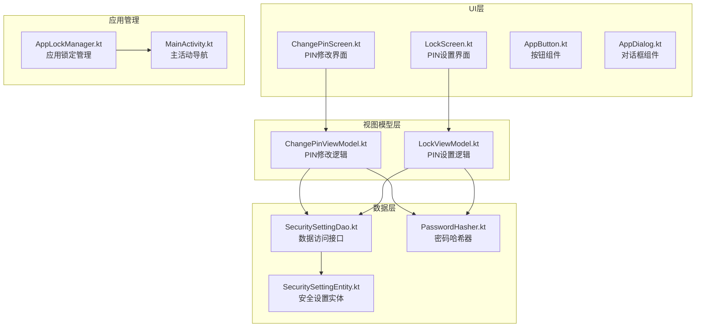
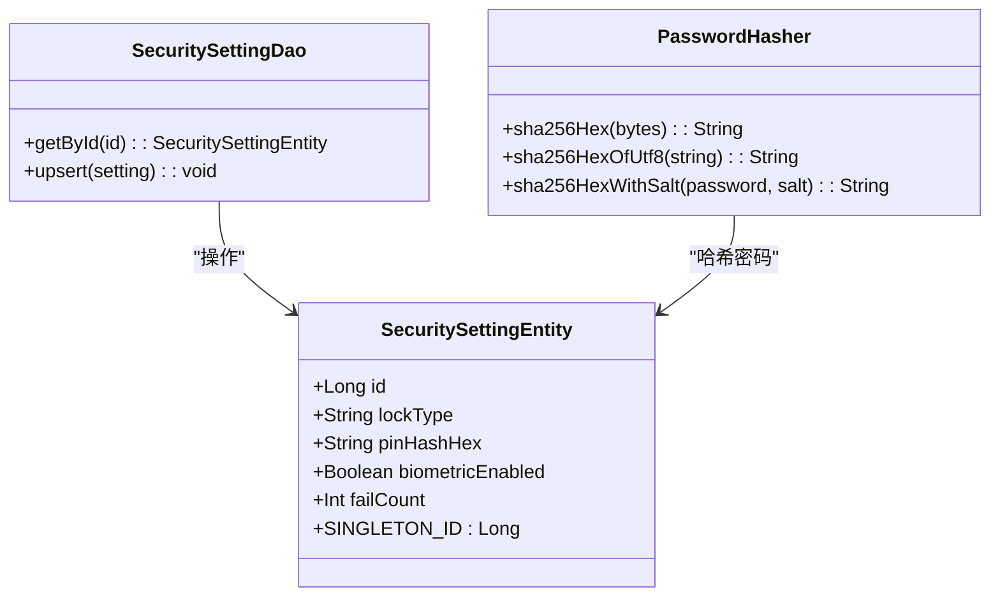
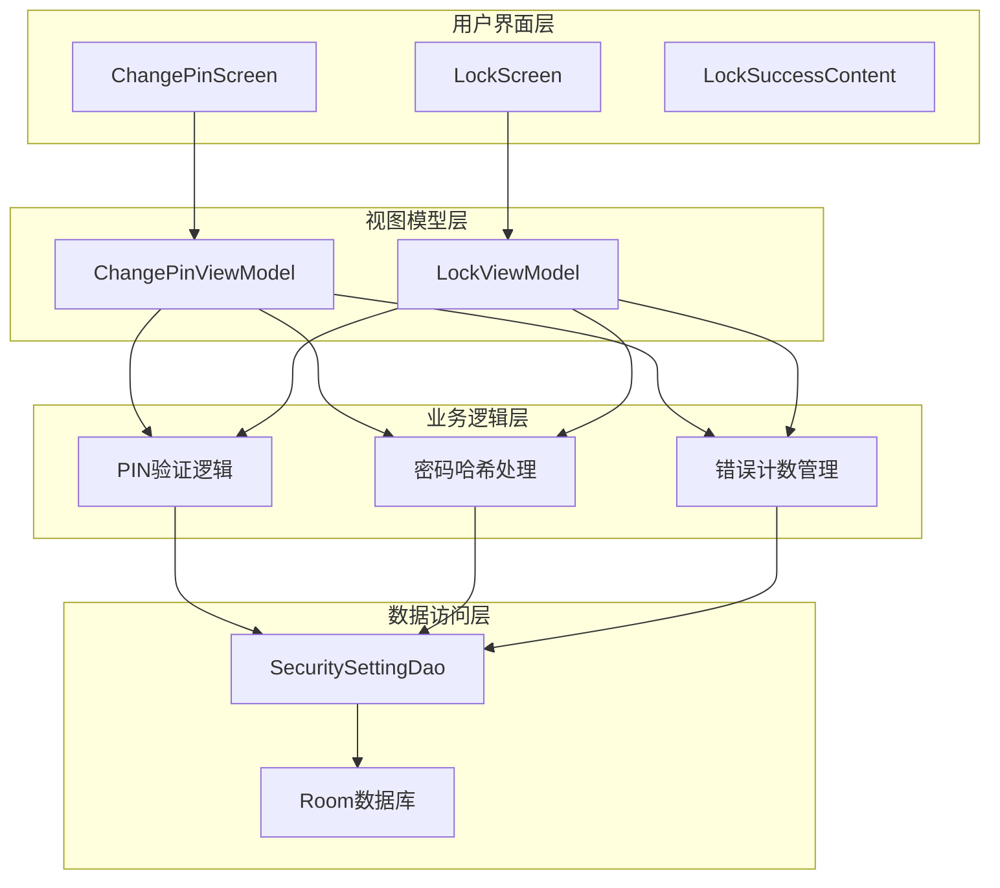
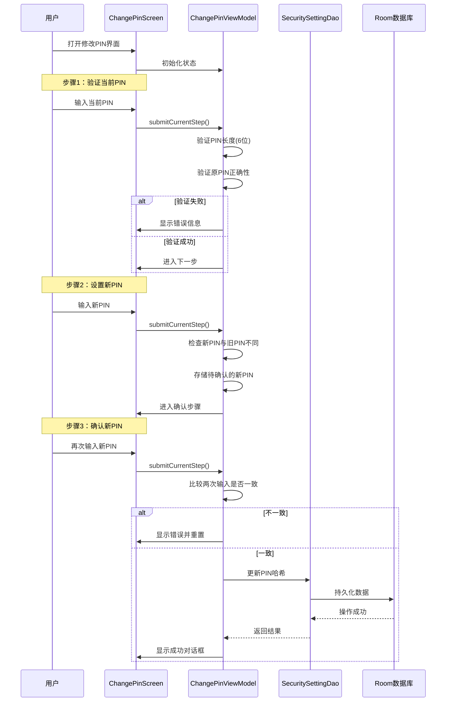
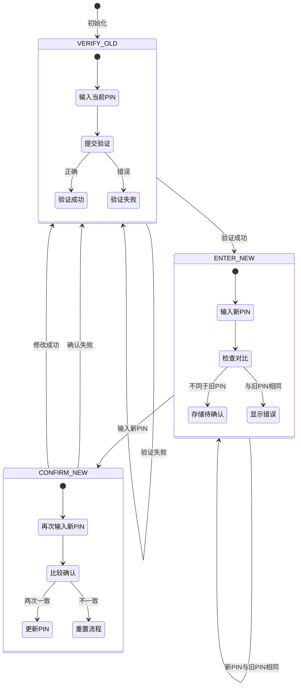
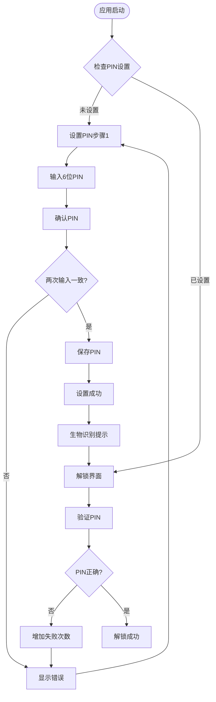
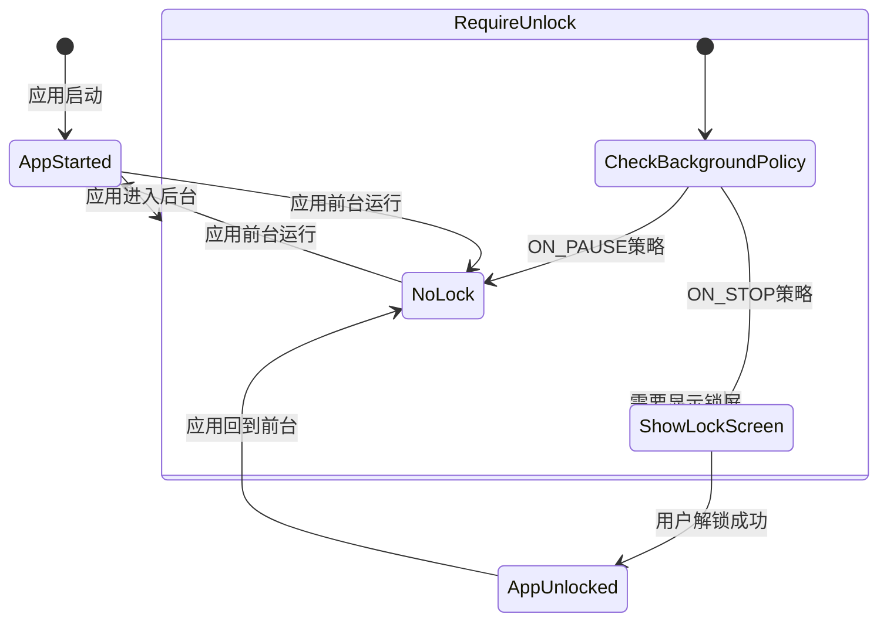
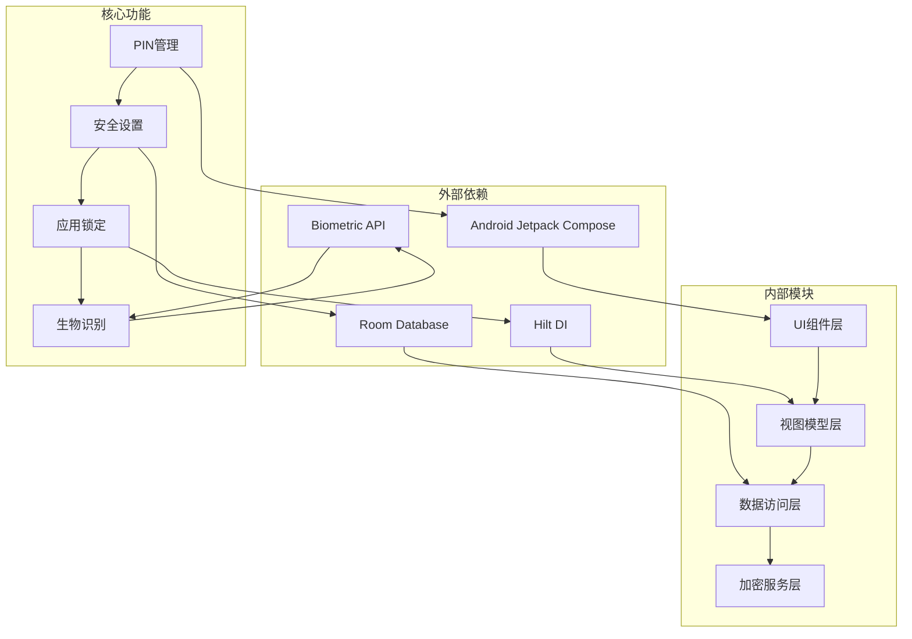
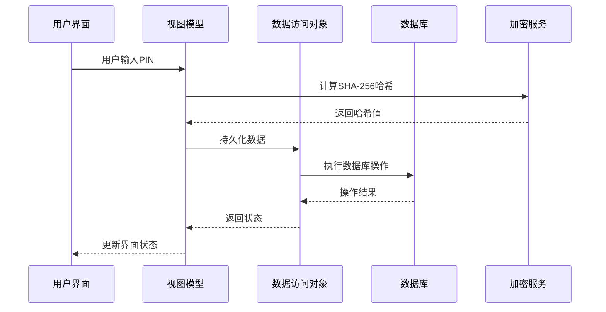

# PIN管理界面

<cite>
**本文档引用的文件**
- [ChangePinScreen.kt](file://android/app/src/main/kotlin/com/photovault/app/ui/ChangePinScreen.kt)
- [LockScreen.kt](file://android/app/src/main/kotlin/com/photovault/app/ui/lock/LockScreen.kt)
- [LockViewModel.kt](file://android/app/src/main/kotlin/com/photovault/app/ui/lock/LockViewModel.kt)
- [AppLockManager.kt](file://android/app/src/main/kotlin/com/photovault/app/AppLockManager.kt)
- [SecuritySettingEntity.kt](file://android/core/data/src/main/kotlin/com/photovault/data/db/entity/SecuritySettingEntity.kt)
- [SecuritySettingDao.kt](file://android/core/data/src/main/kotlin/com/photovault/data/db/dao/SecuritySettingDao.kt)
- [PasswordHasher.kt](file://android/core/data/src/main/kotlin/com/photovault/data/crypto/PasswordHasher.kt)
- [strings.xml](file://android/app/src/main/res/values/strings.xml)
- [strings.xml(en)](file://android/app/src/main/res/values-en/strings.xml)
- [Theme.kt](file://android/app/src/main/kotlin/com/photovault/app/ui/theme/Theme.kt)
- [UiTokens.kt](file://android/app/src/main/kotlin/com/photovault/app/ui/theme/UiTokens.kt)
- [AppButton.kt](file://android/app/src/main/kotlin/com/photovault/app/ui/components/AppButton.kt)
- [AppDialog.kt](file://android/app/src/main/kotlin/com/photovault/app/ui/components/AppDialog.kt)
- [MainActivity.kt](file://android/app/src/main/kotlin/com/photovault/app/MainActivity.kt)
</cite>

## 目录
1. [简介](#简介)
2. [项目结构](#项目结构)
3. [核心组件](#核心组件)
4. [架构概览](#架构概览)
5. [详细组件分析](#详细组件分析)
6. [依赖关系分析](#依赖关系分析)
7. [性能考虑](#性能考虑)
8. [故障排除指南](#故障排除指南)
9. [结论](#结论)

## 简介

PIN管理界面是AI照片保险箱应用中重要的安全功能模块，负责管理用户的PIN码设置、验证和修改。该模块采用现代Android开发技术栈，包括Jetpack Compose UI框架、MVVM架构模式、Room数据库持久化和Hilt依赖注入。

本系统提供完整的PIN管理功能，包括：
- 6位数字PIN码设置
- 原PIN验证机制
- 新PIN设置和确认
- 密码哈希存储
- 生物识别解锁集成
- 错误计数和安全锁定

## 项目结构

PIN管理功能分布在以下关键目录中：

**图表来源**
- [ChangePinScreen.kt:1-345](file://android/app/src/main/kotlin/com/photovault/app/ui/ChangePinScreen.kt#L1-L345)
- [LockScreen.kt:1-414](file://android/app/src/main/kotlin/com/photovault/app/ui/lock/LockScreen.kt#L1-L414)
- [SecuritySettingEntity.kt:1-19](file://android/core/data/src/main/kotlin/com/photovault/data/db/entity/SecuritySettingEntity.kt#L1-L19)

**章节来源**
- [ChangePinScreen.kt:1-345](file://android/app/src/main/kotlin/com/photovault/app/ui/ChangePinScreen.kt#L1-L345)
- [LockScreen.kt:1-414](file://android/app/src/main/kotlin/com/photovault/app/ui/lock/LockScreen.kt#L1-L414)
- [MainActivity.kt:1-355](file://android/app/src/main/kotlin/com/photovault/app/MainActivity.kt#L1-L355)

## 核心组件

### PIN管理核心组件

系统包含三个主要的PIN管理组件：

1. **ChangePinScreen**: 负责PIN修改的用户界面
2. **LockScreen**: 负责PIN设置和验证的用户界面  
3. **AppLockManager**: 管理应用的锁定状态

### 数据模型

**图表来源**
- [SecuritySettingEntity.kt:1-19](file://android/core/data/src/main/kotlin/com/photovault/data/db/entity/SecuritySettingEntity.kt#L1-L19)
- [SecuritySettingDao.kt:1-17](file://android/core/data/src/main/kotlin/com/photovault/data/db/dao/SecuritySettingDao.kt#L1-L17)
- [PasswordHasher.kt:1-26](file://android/core/data/src/main/kotlin/com/photovault/data/crypto/PasswordHasher.kt#L1-L26)

**章节来源**
- [SecuritySettingEntity.kt:1-19](file://android/core/data/src/main/kotlin/com/photovault/data/db/entity/SecuritySettingEntity.kt#L1-L19)
- [SecuritySettingDao.kt:1-17](file://android/core/data/src/main/kotlin/com/photovault/data/db/dao/SecuritySettingDao.kt#L1-L17)
- [PasswordHasher.kt:1-26](file://android/core/data/src/main/kotlin/com/photovault/data/crypto/PasswordHasher.kt#L1-L26)

## 架构概览

PIN管理系统的整体架构采用MVVM模式，实现了清晰的关注点分离：

**图表来源**
- [ChangePinViewModel.kt:191-306](file://android/app/src/main/kotlin/com/photovault/app/ui/ChangePinScreen.kt#L191-L306)
- [LockViewModel.kt:18-197](file://android/app/src/main/kotlin/com/photovault/app/ui/lock/LockViewModel.kt#L18-L197)

## 详细组件分析

### ChangePinScreen 组件分析

ChangePinScreen实现了完整的PIN修改流程，包含三个阶段的用户交互：

#### 三步修改流程

**图表来源**
- [ChangePinScreen.kt:217-305](file://android/app/src/main/kotlin/com/photovault/app/ui/ChangePinScreen.kt#L217-L305)
- [ChangePinViewModel.kt:239-305](file://android/app/src/main/kotlin/com/photovault/app/ui/ChangePinScreen.kt#L239-L305)

#### UI状态管理

ChangePinScreen使用Compose的状态管理机制，实现了响应式的用户界面：

**图表来源**
- [ChangePinScreen.kt:308-344](file://android/app/src/main/kotlin/com/photovault/app/ui/ChangePinScreen.kt#L308-L344)

**章节来源**
- [ChangePinScreen.kt:55-189](file://android/app/src/main/kotlin/com/photovault/app/ui/ChangePinScreen.kt#L55-L189)
- [ChangePinScreen.kt:191-306](file://android/app/src/main/kotlin/com/photovault/app/ui/ChangePinScreen.kt#L191-L306)

### LockScreen 组件分析

LockScreen负责首次设置PIN码和日常解锁验证：

#### PIN设置流程

**图表来源**
- [LockScreen.kt:108-228](file://android/app/src/main/kotlin/com/photovault/app/ui/lock/LockScreen.kt#L108-L228)
- [LockViewModel.kt:44-86](file://android/app/src/main/kotlin/com/photovault/app/ui/lock/LockViewModel.kt#L44-L86)

#### 生物识别集成

系统集成了Android生物识别功能，提供多种认证方式：

- **指纹识别**：BIOMETRIC_STRONG
- **面部识别**：BIOMETRIC_STRONG  
- **设备凭证**：DEVICE_CREDENTIAL
- **弱生物识别**：BIOMETRIC_WEAK

**章节来源**
- [LockScreen.kt:52-228](file://android/app/src/main/kotlin/com/photovault/app/ui/lock/LockScreen.kt#L52-L228)
- [LockViewModel.kt:18-197](file://android/app/src/main/kotlin/com/photovault/app/ui/lock/LockViewModel.kt#L18-L197)

### AppLockManager 组件分析

AppLockManager管理应用的锁定状态，实现后台自动锁定功能：

#### 锁定策略

**图表来源**
- [AppLockManager.kt:17-49](file://android/app/src/main/kotlin/com/photovault/app/AppLockManager.kt#L17-L49)

**章节来源**
- [AppLockManager.kt:17-49](file://android/app/src/main/kotlin/com/photovault/app/AppLockManager.kt#L17-L49)

## 依赖关系分析

PIN管理系统的关键依赖关系如下：

**图表来源**
- [MainActivity.kt:47-355](file://android/app/src/main/kotlin/com/photovault/app/MainActivity.kt#L47-L355)
- [ChangePinViewModel.kt:191-306](file://android/app/src/main/kotlin/com/photovault/app/ui/ChangePinScreen.kt#L191-L306)

### 数据流分析

**图表来源**
- [PasswordHasher.kt:9-24](file://android/core/data/src/main/kotlin/com/photovault/data/crypto/PasswordHasher.kt#L9-L24)
- [SecuritySettingDao.kt:14-15](file://android/core/data/src/main/kotlin/com/photovault/data/db/dao/SecuritySettingDao.kt#L14-L15)

**章节来源**
- [MainActivity.kt:47-355](file://android/app/src/main/kotlin/com/photovault/app/MainActivity.kt#L47-L355)
- [PasswordHasher.kt:1-26](file://android/core/data/src/main/kotlin/com/photovault/data/crypto/PasswordHasher.kt#L1-L26)

## 性能考虑

### UI性能优化

1. **Compose状态管理**：使用`remember`和`mutableStateOf`优化状态更新
2. **懒加载组件**：只在需要时创建和销毁UI组件
3. **内存管理**：及时释放不必要的UI资源

### 数据访问优化

1. **异步操作**：所有数据库操作都在协程中异步执行
2. **状态流**：使用StateFlow避免不必要的UI重建
3. **缓存策略**：本地缓存安全设置避免频繁数据库查询

### 安全性能

1. **哈希计算**：使用SHA-256算法确保密码安全存储
2. **错误计数**：防止暴力破解攻击
3. **加密存储**：PIN哈希值本地存储，不传输到云端

## 故障排除指南

### 常见问题及解决方案

#### PIN修改失败

**问题症状**：修改PIN时出现"PIN修改失败，请稍后重试"错误

**可能原因**：
1. 数据库写入失败
2. 网络异常（如果涉及云端同步）
3. 设备存储空间不足

**解决步骤**：
1. 检查设备存储空间
2. 重启应用后重试
3. 清除应用缓存数据
4. 如问题持续，联系技术支持

#### PIN验证失败

**问题症状**：输入PIN后显示"原PIN验证失败，请重试"

**可能原因**：
1. 输入的PIN码不正确
2. 设备时间设置不正确
3. 应用数据损坏

**解决步骤**：
1. 确认输入的PIN码完全正确
2. 检查设备时间和日期设置
3. 重新设置PIN码
4. 如问题持续，重置应用数据

#### 生物识别不可用

**问题症状**：生物识别选项不可用或无法使用

**可能原因**：
1. 设备不支持生物识别功能
2. 系统设置中未启用生物识别
3. 指纹或面部数据未录入

**解决步骤**：
1. 检查设备生物识别硬件支持
2. 在系统设置中启用生物识别功能
3. 录入指纹或面部数据
4. 重新尝试生物识别解锁

**章节来源**
- [ChangePinScreen.kt:235-305](file://android/app/src/main/kotlin/com/photovault/app/ui/ChangePinScreen.kt#L235-L305)
- [LockScreen.kt:360-382](file://android/app/src/main/kotlin/com/photovault/app/ui/lock/LockScreen.kt#L360-L382)

## 结论

PIN管理界面是AI照片保险箱应用的核心安全功能，采用了现代化的Android开发技术和最佳实践。系统具有以下特点：

### 技术优势

1. **架构清晰**：采用MVVM模式，职责分离明确
2. **用户体验**：流畅的三步式PIN修改流程
3. **安全性强**：SHA-256哈希存储，错误计数防护
4. **扩展性好**：模块化设计，易于功能扩展

### 功能完整性

- 支持6位数字PIN码
- 完整的设置、验证、修改流程
- 生物识别解锁集成
- 错误计数和安全锁定
- 多语言支持

### 改进建议

1. **增强错误处理**：添加更详细的错误信息和重试机制
2. **用户体验优化**：添加PIN码强度指示器
3. **安全增强**：考虑添加安装级salt提高安全性
4. **功能扩展**：支持多种解锁方式组合

该PIN管理界面为用户提供了安全可靠的隐私保护机制，是整个应用安全体系的重要组成部分。