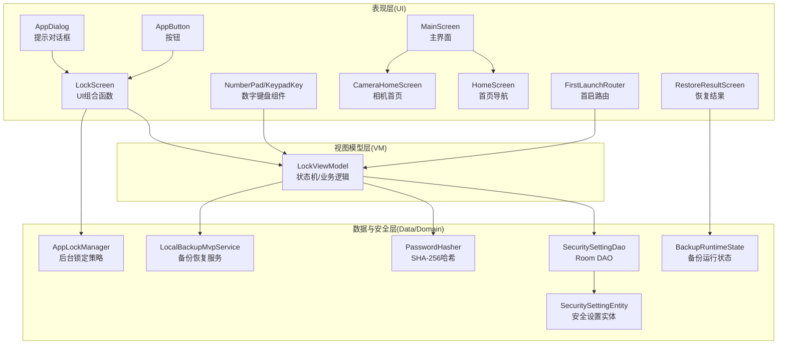
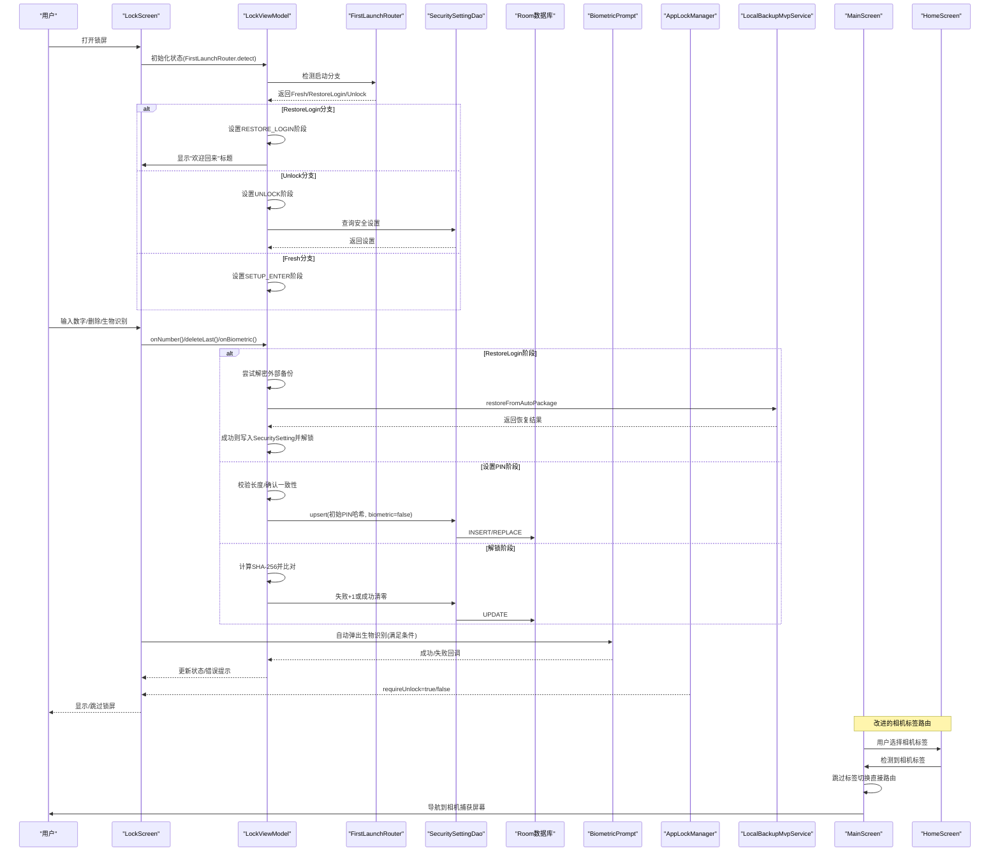
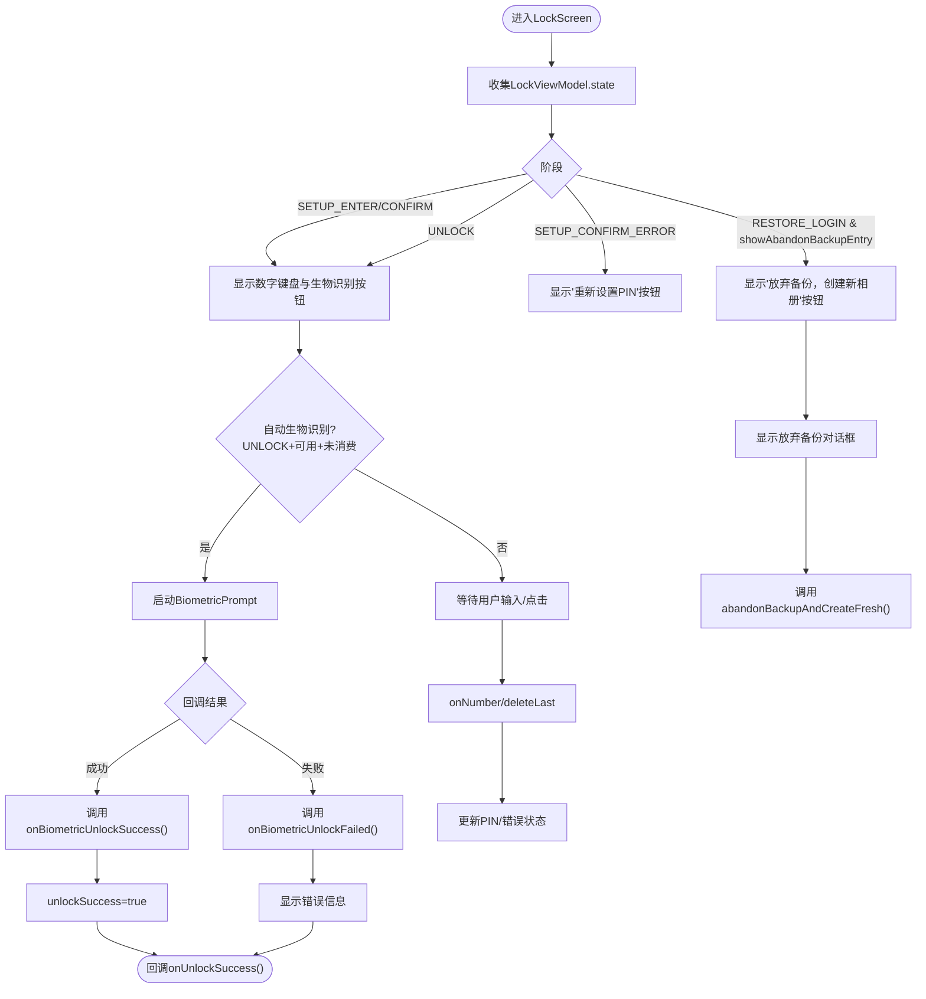
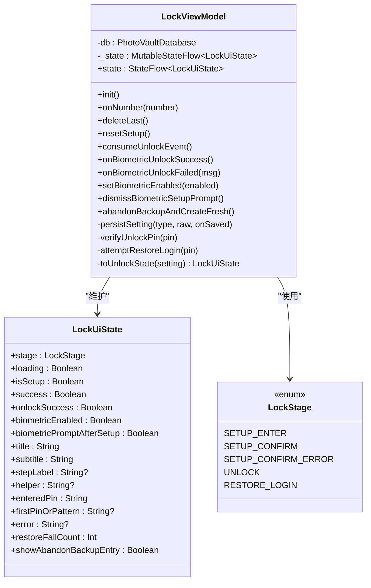
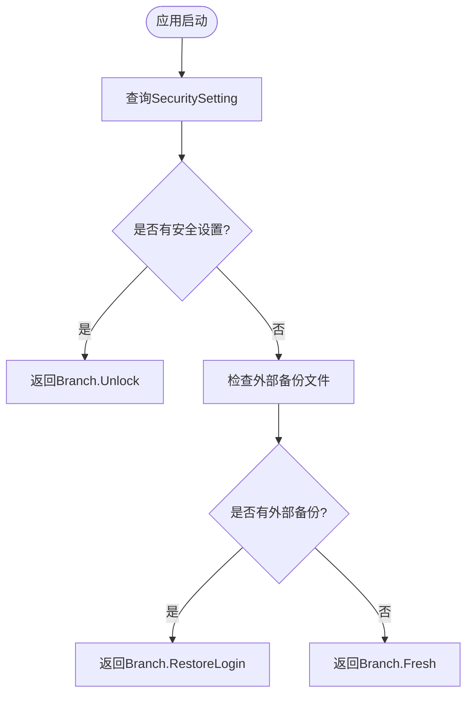
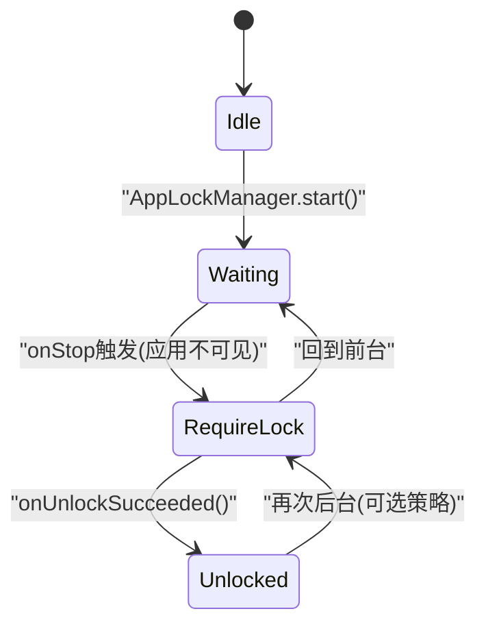
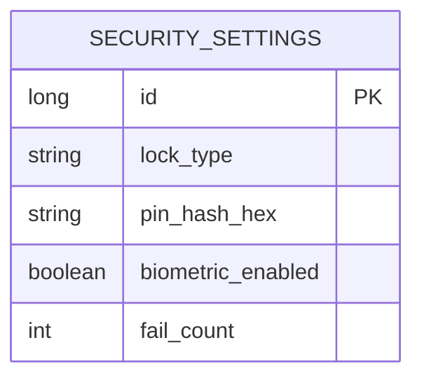
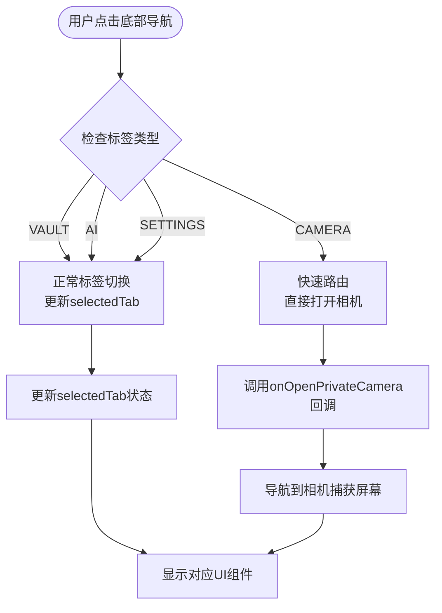
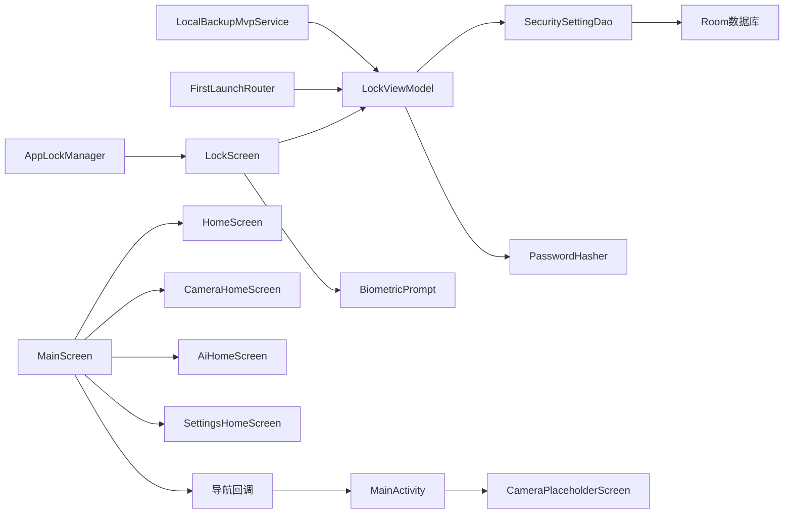

# 安全解锁系统

<cite>
**本文档引用的文件**
- [android/app/src/main/kotlin/com/xpx/vault/ui/lock/LockScreen.kt](file://android/app/src/main/kotlin/com/xpx/vault/ui/lock/LockScreen.kt)
- [android/app/src/main/kotlin/com/xpx/vault/ui/lock/LockViewModel.kt](file://android/app/src/main/kotlin/com/xpx/vault/ui/lock/LockViewModel.kt)
- [android/app/src/main/kotlin/com/xpx/vault/AppLockManager.kt](file://android/app/src/main/kotlin/com/xpx/vault/AppLockManager.kt)
- [android/core/data/src/main/kotlin/com/xpx/vault/data/db/entity/SecuritySettingEntity.kt](file://android/core/data/src/main/kotlin/com/xpx/vault/data/db/entity/SecuritySettingEntity.kt)
- [android/core/data/src/main/kotlin/com/xpx/vault/data/crypto/PasswordHasher.kt](file://android/core/data/src/main/kotlin/com/xpx/vault/data/crypto/PasswordHasher.kt)
- [android/core/data/src/main/kotlin/com/xpx/vault/data/db/dao/SecuritySettingDao.kt](file://android/core/data/src/main/kotlin/com/xpx/vault/data/db/dao/SecuritySettingDao.kt)
- [android/app/src/main/kotlin/com/xpx/vault/ui/theme/Theme.kt](file://android/app/src/main/kotlin/com/xpx/vault/ui/theme/Theme.kt)
- [android/app/src/main/kotlin/com/xpx/vault/ui/MainScreen.kt](file://android/app/src/main/kotlin/com/xpx/vault/ui/MainScreen.kt)
- [android/app/src/main/kotlin/com/xpx/vault/ui/HomeScreen.kt](file://android/app/src/main/kotlin/com/xpx/vault/ui/HomeScreen.kt)
- [android/app/src/main/kotlin/com/xpx/vault/ui/CameraHomeScreen.kt](file://android/app/src/main/kotlin/com/xpx/vault/ui/CameraHomeScreen.kt)
- [android/app/src/main/kotlin/com/xpx/vault/ui/components/AppButton.kt](file://android/app/src/main/kotlin/com/xpx/vault/ui/components/AppButton.kt)
- [android/app/src/main/kotlin/com/xpx/vault/ui/components/AppDialog.kt](file://android/app/src/main/kotlin/com/xpx/vault/ui/components/AppDialog.kt)
- [android/app/src/main/kotlin/com/xpx/vault/ui/theme/UiTokens.kt](file://android/app/src/main/kotlin/com/xpx/vault/ui/theme/UiTokens.kt)
- [android/app/src/main/kotlin/com/xpx/vault/ui/feedback/PressFeedback.kt](file://android/app/src/main/kotlin/com/xpx/vault/ui/feedback/PressFeedback.kt)
- [android/app/src/main/kotlin/com/xpx/vault/ui/feedback/ThrottledClick.kt](file://android/app/src/main/kotlin/com/xpx/vault/ui/feedback/ThrottledClick.kt)
- [android/app/src/main/kotlin/com/xpx/vault/MainActivity.kt](file://android/app/src/main/kotlin/com/xpx/vault/MainActivity.kt)
- [android/app/src/main/kotlin/com/xpx/vault/ui/setup/FirstLaunchRouter.kt](file://android/app/src/main/kotlin/com/xpx/vault/ui/setup/FirstLaunchRouter.kt)
- [android/app/src/main/kotlin/com/xpx/vault/ui/backup/LocalBackupMvpService.kt](file://android/app/src/main/kotlin/com/xpx/vault/ui/backup/LocalBackupMvpService.kt)
- [android/app/src/main/kotlin/com/xpx/vault/ui/RestoreResultScreen.kt](file://android/app/src/main/kotlin/com/xpx/vault/ui/RestoreResultScreen.kt)
- [android/app/src/main/kotlin/com/xpx/vault/ui/backup/BackupRuntimeState.kt](file://android/app/src/main/kotlin/com/xpx/vault/ui/backup/BackupRuntimeState.kt)
</cite>

## 更新摘要
**变更内容**
- 新增RESTORE_LOGIN阶段，支持通过外部备份进行恢复登录
- 更新FirstLaunchRouter以支持三种启动分支：Fresh、RestoreLogin、Unlock
- 增强LockViewModel以处理备份恢复登录流程
- 添加放弃备份功能，允许用户创建全新相册
- 更新LockScreen以支持RESTORE_LOGIN阶段的UI交互

## 目录
1. [简介](#简介)
2. [项目结构](#项目结构)
3. [核心组件](#核心组件)
4. [架构总览](#架构总览)
5. [详细组件分析](#详细组件分析)
6. [依赖关系分析](#依赖关系分析)
7. [性能考量](#性能考量)
8. [故障排除指南](#故障排除指南)
9. [结论](#结论)
10. [附录](#附录)

## 简介
本文件面向AI照片保险库的安全解锁系统，围绕PIN码解锁机制、生物识别认证流程、安全状态管理策略进行深入解析。内容覆盖LockScreen的UI组件设计、LockViewModel的状态管理逻辑、AppLockManager的锁管理功能，并解释PIN码输入界面、数字键盘组件、生物识别提示对话框的实现原理。同时给出安全状态转换、错误处理机制、自动生物识别提示等特性说明，提供可操作的集成与自定义建议，包含安全性考虑、最佳实践与故障排除指南。

**更新** 本次更新新增了RESTORE_LOGIN阶段，支持通过外部备份进行恢复登录功能，增强了系统的备份恢复能力，为用户提供更灵活的数据迁移和恢复选项。

## 项目结构
安全解锁系统主要由三层构成：
- 表现层（UI层）：LockScreen负责呈现PIN码输入、生物识别提示、成功提示与错误信息；配套数字键盘与按键反馈组件。
- 视图模型层（VM层）：LockViewModel管理解锁/设置PIN流程的状态机、PIN校验与持久化、生物识别开关与提示状态，新增RESTORE_LOGIN阶段处理。
- 数据与安全层（Data/Domain）：SecuritySettingEntity与SecuritySettingDao负责安全配置的持久化；PasswordHasher提供PIN哈希算法；AppLockManager负责应用后台锁定策略。

**图表来源**
- [android/app/src/main/kotlin/com/xpx/vault/ui/lock/LockScreen.kt](file://android/app/src/main/kotlin/com/xpx/vault/ui/lock/LockScreen.kt)
- [android/app/src/main/kotlin/com/xpx/vault/ui/lock/LockViewModel.kt](file://android/app/src/main/kotlin/com/xpx/vault/ui/lock/LockViewModel.kt)
- [android/app/src/main/kotlin/com/xpx/vault/ui/MainScreen.kt](file://android/app/src/main/kotlin/com/xpx/vault/ui/MainScreen.kt)
- [android/app/src/main/kotlin/com/xpx/vault/ui/HomeScreen.kt](file://android/app/src/main/kotlin/com/xpx/vault/ui/HomeScreen.kt)
- [android/app/src/main/kotlin/com/xpx/vault/ui/CameraHomeScreen.kt](file://android/app/src/main/kotlin/com/xpx/vault/ui/CameraHomeScreen.kt)
- [android/app/src/main/kotlin/com/xpx/vault/ui/setup/FirstLaunchRouter.kt](file://android/app/src/main/kotlin/com/xpx/vault/ui/setup/FirstLaunchRouter.kt)
- [android/app/src/main/kotlin/com/xpx/vault/ui/RestoreResultScreen.kt](file://android/app/src/main/kotlin/com/xpx/vault/ui/RestoreResultScreen.kt)
- [android/core/data/src/main/kotlin/com/xpx/vault/data/db/dao/SecuritySettingDao.kt](file://android/core/data/src/main/kotlin/com/xpx/vault/data/db/dao/SecuritySettingDao.kt)
- [android/core/data/src/main/kotlin/com/xpx/vault/data/db/entity/SecuritySettingEntity.kt](file://android/core/data/src/main/kotlin/com/xpx/vault/data/db/entity/SecuritySettingEntity.kt)
- [android/core/data/src/main/kotlin/com/xpx/vault/data/crypto/PasswordHasher.kt](file://android/core/data/src/main/kotlin/com/xpx/vault/data/crypto/PasswordHasher.kt)
- [android/app/src/main/kotlin/com/xpx/vault/AppLockManager.kt](file://android/app/src/main/kotlin/com/xpx/vault/AppLockManager.kt)
- [android/app/src/main/kotlin/com/xpx/vault/ui/backup/LocalBackupMvpService.kt](file://android/app/src/main/kotlin/com/xpx/vault/ui/backup/LocalBackupMvpService.kt)
- [android/app/src/main/kotlin/com/xpx/vault/ui/backup/BackupRuntimeState.kt](file://android/app/src/main/kotlin/com/xpx/vault/ui/backup/BackupRuntimeState.kt)

**章节来源**
- [android/app/src/main/kotlin/com/xpx/vault/ui/lock/LockScreen.kt](file://android/app/src/main/kotlin/com/xpx/vault/ui/lock/LockScreen.kt)
- [android/app/src/main/kotlin/com/xpx/vault/ui/lock/LockViewModel.kt](file://android/app/src/main/kotlin/com/xpx/vault/ui/lock/LockViewModel.kt)
- [android/app/src/main/kotlin/com/xpx/vault/ui/MainScreen.kt](file://android/app/src/main/kotlin/com/xpx/vault/ui/MainScreen.kt)
- [android/app/src/main/kotlin/com/xpx/vault/ui/HomeScreen.kt](file://android/app/src/main/kotlin/com/xpx/vault/ui/HomeScreen.kt)
- [android/app/src/main/kotlin/com/xpx/vault/ui/CameraHomeScreen.kt](file://android/app/src/main/kotlin/com/xpx/vault/ui/CameraHomeScreen.kt)
- [android/app/src/main/kotlin/com/xpx/vault/ui/setup/FirstLaunchRouter.kt](file://android/app/src/main/kotlin/com/xpx/vault/ui/setup/FirstLaunchRouter.kt)
- [android/app/src/main/kotlin/com/xpx/vault/ui/RestoreResultScreen.kt](file://android/app/src/main/kotlin/com/xpx/vault/ui/RestoreResultScreen.kt)
- [android/core/data/src/main/kotlin/com/xpx/vault/data/db/dao/SecuritySettingDao.kt](file://android/core/data/src/main/kotlin/com/xpx/vault/data/db/dao/SecuritySettingDao.kt)
- [android/core/data/src/main/kotlin/com/xpx/vault/data/db/entity/SecuritySettingEntity.kt](file://android/core/data/src/main/kotlin/com/xpx/vault/data/db/entity/SecuritySettingEntity.kt)
- [android/core/data/src/main/kotlin/com/xpx/vault/data/crypto/PasswordHasher.kt](file://android/core/data/src/main/kotlin/com/xpx/vault/data/crypto/PasswordHasher.kt)
- [android/app/src/main/kotlin/com/xpx/vault/AppLockManager.kt](file://android/app/src/main/kotlin/com/xpx/vault/AppLockManager.kt)
- [android/app/src/main/kotlin/com/xpx/vault/ui/backup/LocalBackupMvpService.kt](file://android/app/src/main/kotlin/com/xpx/vault/ui/backup/LocalBackupMvpService.kt)
- [android/app/src/main/kotlin/com/xpx/vault/ui/backup/BackupRuntimeState.kt](file://android/app/src/main/kotlin/com/xpx/vault/ui/backup/BackupRuntimeState.kt)

## 核心组件
- LockScreen：Compose UI入口，负责渲染标题/副标题/步骤标签、PIN点阵指示、错误与成功提示、数字键盘与生物识别按钮、设置后的生物识别提示对话框，新增RESTORE_LOGIN阶段的UI支持。
- LockViewModel：状态机与业务逻辑核心，管理设置PIN、解锁、恢复登录三个阶段，处理PIN输入、确认、校验、错误计数与重置，以及生物识别启用与成功/失败回调，新增RESTORE_LOGIN分支处理外部备份恢复。
- AppLockManager：应用生命周期观察者，基于ON_STOP策略控制是否需要显示锁屏；对外暴露requireUnlock状态流。
- FirstLaunchRouter：首启路由器，根据本机安全设置和外部备份检测决定启动分支：Fresh（新建）、RestoreLogin（恢复登录）、Unlock（常规解锁）。
- SecuritySettingEntity/Dao：持久化安全设置（锁类型、PIN哈希、生物识别开关、失败次数），单例ID保证唯一记录。
- PasswordHasher：提供SHA-256哈希与带盐哈希工具，用于PIN安全存储。
- LocalBackupMvpService：备份恢复服务，支持外部备份文件的解密和恢复。
- UI组件：AppButton、AppDialog、数字键盘与按键反馈组件，统一视觉与交互体验。
- **新增** RestoreResultScreen：备份恢复结果展示界面，显示恢复统计信息。
- **新增** BackupRuntimeState：备份恢复运行时状态管理，存储最后的备份/恢复结果。

**章节来源**
- [android/app/src/main/kotlin/com/xpx/vault/ui/lock/LockScreen.kt](file://android/app/src/main/kotlin/com/xpx/vault/ui/lock/LockScreen.kt)
- [android/app/src/main/kotlin/com/xpx/vault/ui/lock/LockViewModel.kt](file://android/app/src/main/kotlin/com/xpx/vault/ui/lock/LockViewModel.kt)
- [android/app/src/main/kotlin/com/xpx/vault/AppLockManager.kt](file://android/app/src/main/kotlin/com/xpx/vault/AppLockManager.kt)
- [android/app/src/main/kotlin/com/xpx/vault/ui/setup/FirstLaunchRouter.kt](file://android/app/src/main/kotlin/com/xpx/vault/ui/setup/FirstLaunchRouter.kt)
- [android/core/data/src/main/kotlin/com/xpx/vault/data/db/entity/SecuritySettingEntity.kt](file://android/core/data/src/main/kotlin/com/xpx/vault/data/db/entity/SecuritySettingEntity.kt)
- [android/core/data/src/main/kotlin/com/xpx/vault/data/crypto/PasswordHasher.kt](file://android/core/data/src/main/kotlin/com/xpx/vault/data/crypto/PasswordHasher.kt)
- [android/core/data/src/main/kotlin/com/xpx/vault/data/db/dao/SecuritySettingDao.kt](file://android/core/data/src/main/kotlin/com/xpx/vault/data/db/dao/SecuritySettingDao.kt)
- [android/app/src/main/kotlin/com/xpx/vault/ui/components/AppButton.kt](file://android/app/src/main/kotlin/com/xpx/vault/ui/components/AppButton.kt)
- [android/app/src/main/kotlin/com/xpx/vault/ui/components/AppDialog.kt](file://android/app/src/main/kotlin/com/xpx/vault/ui/components/AppDialog.kt)
- [android/app/src/main/kotlin/com/xpx/vault/ui/theme/UiTokens.kt](file://android/app/src/main/kotlin/com/xpx/vault/ui/theme/UiTokens.kt)
- [android/app/src/main/kotlin/com/xpx/vault/ui/feedback/PressFeedback.kt](file://android/app/src/main/kotlin/com/xpx/vault/ui/feedback/PressFeedback.kt)
- [android/app/src/main/kotlin/com/xpx/vault/ui/feedback/ThrottledClick.kt](file://android/app/src/main/kotlin/com/xpx/vault/ui/feedback/ThrottledClick.kt)
- [android/app/src/main/kotlin/com/xpx/vault/ui/MainScreen.kt](file://android/app/src/main/kotlin/com/xpx/vault/ui/MainScreen.kt)
- [android/app/src/main/kotlin/com/xpx/vault/ui/HomeScreen.kt](file://android/app/src/main/kotlin/com/xpx/vault/ui/HomeScreen.kt)
- [android/app/src/main/kotlin/com/xpx/vault/ui/CameraHomeScreen.kt](file://android/app/src/main/kotlin/com/xpx/vault/ui/CameraHomeScreen.kt)
- [android/app/src/main/kotlin/com/xpx/vault/ui/theme/Theme.kt](file://android/app/src/main/kotlin/com/xpx/vault/ui/theme/Theme.kt)
- [android/app/src/main/kotlin/com/xpx/vault/ui/RestoreResultScreen.kt](file://android/app/src/main/kotlin/com/xpx/vault/ui/RestoreResultScreen.kt)
- [android/app/src/main/kotlin/com/xpx/vault/ui/backup/LocalBackupMvpService.kt](file://android/app/src/main/kotlin/com/xpx/vault/ui/backup/LocalBackupMvpService.kt)
- [android/app/src/main/kotlin/com/xpx/vault/ui/backup/BackupRuntimeState.kt](file://android/app/src/main/kotlin/com/xpx/vault/ui/backup/BackupRuntimeState.kt)

## 架构总览
下图展示了从用户交互到数据持久化的整体流程，包括PIN设置/解锁、生物识别自动弹窗、错误处理与后台锁定策略，以及新增的RESTORE_LOGIN阶段和相机标签路由的改进。

**图表来源**
- [android/app/src/main/kotlin/com/xpx/vault/ui/lock/LockScreen.kt](file://android/app/src/main/kotlin/com/xpx/vault/ui/lock/LockScreen.kt)
- [android/app/src/main/kotlin/com/xpx/vault/ui/lock/LockViewModel.kt](file://android/app/src/main/kotlin/com/xpx/vault/ui/lock/LockViewModel.kt)
- [android/app/src/main/kotlin/com/xpx/vault/ui/setup/FirstLaunchRouter.kt](file://android/app/src/main/kotlin/com/xpx/vault/ui/setup/FirstLaunchRouter.kt)
- [android/core/data/src/main/kotlin/com/xpx/vault/data/db/dao/SecuritySettingDao.kt](file://android/core/data/src/main/kotlin/com/xpx/vault/data/db/dao/SecuritySettingDao.kt)
- [android/core/data/src/main/kotlin/com/xpx/vault/data/db/entity/SecuritySettingEntity.kt](file://android/core/data/src/main/kotlin/com/xpx/vault/data/db/entity/SecuritySettingEntity.kt)
- [android/app/src/main/kotlin/com/xpx/vault/AppLockManager.kt](file://android/app/src/main/kotlin/com/xpx/vault/AppLockManager.kt)
- [android/app/src/main/kotlin/com/xpx/vault/ui/MainScreen.kt](file://android/app/src/main/kotlin/com/xpx/vault/ui/MainScreen.kt)
- [android/app/src/main/kotlin/com/xpx/vault/ui/HomeScreen.kt](file://android/app/src/main/kotlin/com/xpx/vault/ui/HomeScreen.kt)
- [android/app/src/main/kotlin/com/xpx/vault/ui/backup/LocalBackupMvpService.kt](file://android/app/src/main/kotlin/com/xpx/vault/ui/backup/LocalBackupMvpService.kt)

## 详细组件分析

### LockScreen：UI与交互
- 组成部分
  - 标题/副标题/步骤标签：根据阶段动态显示。
  - PIN点阵指示：6个圆点表示已输入长度，错误态高亮。
  - 数字键盘：3×3数字键 + 📷快捷拍照键 + 0 + ⌫删除键；支持生物识别按钮。
  - 生物识别自动弹窗：首次设置完成后提示是否开启生物识别。
  - 成功页：展示PIN设置成功与安全提示卡片。
  - **新增** 放弃备份按钮：在RESTORE_LOGIN阶段且错误次数达到阈值时显示。
- 关键行为
  - 自动生物识别：当处于UNLOCK阶段且生物识别可用且未消费过自动提示时触发一次BiometricPrompt。
  - 错误提示：错误信息以带边框背景块显示，支持"重新设置PIN"按钮。
  - 生物识别可用性检测：封装resolveBiometricAvailability，返回可用性与提示消息。
  - 与ViewModel交互：onNumber/deleteLast/onBiometricUnlockSuccess/onBiometricUnlockFailed等。
  - **新增** 放弃备份对话框：确认后调用abandonBackupAndCreateFresh()回到SETUP_ENTER流程。

**图表来源**
- [android/app/src/main/kotlin/com/xpx/vault/ui/lock/LockScreen.kt](file://android/app/src/main/kotlin/com/xpx/vault/ui/lock/LockScreen.kt)
- [android/app/src/main/kotlin/com/xpx/vault/ui/lock/LockViewModel.kt](file://android/app/src/main/kotlin/com/xpx/vault/ui/lock/LockViewModel.kt)

**章节来源**
- [android/app/src/main/kotlin/com/xpx/vault/ui/lock/LockScreen.kt](file://android/app/src/main/kotlin/com/xpx/vault/ui/lock/LockScreen.kt)
- [android/app/src/main/kotlin/com/xpx/vault/ui/theme/UiTokens.kt](file://android/app/src/main/kotlin/com/xpx/vault/ui/theme/UiTokens.kt)
- [android/app/src/main/kotlin/com/xpx/vault/ui/components/AppButton.kt](file://android/app/src/main/kotlin/com/xpx/vault/ui/components/AppButton.kt)
- [android/app/src/main/kotlin/com/xpx/vault/ui/components/AppDialog.kt](file://android/app/src/main/kotlin/com/xpx/vault/ui/components/AppDialog.kt)
- [android/app/src/main/kotlin/com/xpx/vault/ui/feedback/PressFeedback.kt](file://android/app/src/main/kotlin/com/xpx/vault/ui/feedback/PressFeedback.kt)
- [android/app/src/main/kotlin/com/xpx/vault/ui/feedback/ThrottledClick.kt](file://android/app/src/main/kotlin/com/xpx/vault/ui/feedback/ThrottledClick.kt)

### LockViewModel：状态机与业务逻辑
- 状态机
  - 阶段枚举：SETUP_ENTER、SETUP_CONFIRM、SETUP_CONFIRM_ERROR、UNLOCK、RESTORE_LOGIN。
  - UI状态：stage、loading、isSetup、success、unlockSuccess、biometricEnabled、biometricPromptAfterSetup、title/subtitle/stepLabel、helper、enteredPin、firstPinOrPattern、error、restoreFailCount、showAbandonBackupEntry。
- 主要流程
  - 初始化：通过FirstLaunchRouter.detect判断启动分支，RESTORE_LOGIN分支设置特定的标题和副标题。
  - 设置PIN：输入6位后进入确认阶段；确认一致持久化，否则进入错误阶段。
  - 解锁：输入6位后计算SHA-256与存储值比对；错误则failCount+1，成功则清零。
  - **新增** 恢复登录：输入6位后尝试解密外部备份文件，成功则将PIN写入SecuritySetting并解锁，失败则累计错误次数并显示放弃备份入口。
  - 生物识别：成功时清零失败计数并标记解锁成功；失败时记录错误消息。
  - 生物识别开关：设置biometricEnabled并清除提示标志。
  - **新增** 放弃备份：回到SETUP_ENTER流程，不删除外部备份文件。
- 数据持久化
  - 使用PasswordHasher对原始PIN做SHA-256哈希，存储于SecuritySettingEntity。
  - 通过SecuritySettingDao.upsert完成插入或替换。

**图表来源**
- [android/app/src/main/kotlin/com/xpx/vault/ui/lock/LockViewModel.kt](file://android/app/src/main/kotlin/com/xpx/vault/ui/lock/LockViewModel.kt)

**章节来源**
- [android/app/src/main/kotlin/com/xpx/vault/ui/lock/LockViewModel.kt](file://android/app/src/main/kotlin/com/xpx/vault/ui/lock/LockViewModel.kt)
- [android/core/data/src/main/kotlin/com/xpx/vault/data/crypto/PasswordHasher.kt](file://android/core/data/src/main/kotlin/com/xpx/vault/data/crypto/PasswordHasher.kt)
- [android/core/data/src/main/kotlin/com/xpx/vault/data/db/dao/SecuritySettingDao.kt](file://android/core/data/src/main/kotlin/com/xpx/vault/data/db/dao/SecuritySettingDao.kt)
- [android/core/data/src/main/kotlin/com/xpx/vault/data/db/entity/SecuritySettingEntity.kt](file://android/core/data/src/main/kotlin/com/xpx/vault/data/db/entity/SecuritySettingEntity.kt)

### FirstLaunchRouter：首启路由
- 功能概述
  - 根据本机SecuritySetting和外部backup.dat的存在情况决定启动分支。
  - **分支1**：Branch.Unlock（已有安全设置）→ 走常规UNLOCK流程。
  - **分支2**：Branch.Fresh（无安全设置且无外部备份）→ 走SETUP_ENTER新建流程。
  - **分支3**：Branch.RestoreLogin（无安全设置但有外部备份）→ 走RESTORE_LOGIN恢复登录流程。
- 关键实现
  - detect方法：查询SecuritySettingDao.getById()判断是否已有安全设置。
  - ExternalBackupLocation.findAuto()检查外部备份文件是否存在。
  - 返回对应的Branch对象供LockViewModel初始化使用。

**图表来源**
- [android/app/src/main/kotlin/com/xpx/vault/ui/setup/FirstLaunchRouter.kt](file://android/app/src/main/kotlin/com/xpx/vault/ui/setup/FirstLaunchRouter.kt)

**章节来源**
- [android/app/src/main/kotlin/com/xpx/vault/ui/setup/FirstLaunchRouter.kt](file://android/app/src/main/kotlin/com/xpx/vault/ui/setup/FirstLaunchRouter.kt)

### AppLockManager：后台锁定策略
- 策略
  - 使用ON_STOP策略：应用进程不可见时触发requireUnlock=true，回到前台时保持锁屏需求直到onUnlockSucceeded被调用。
- 关键接口
  - start：注册生命周期观察者。
  - onUnlockSucceeded：解锁成功后将requireUnlock置为false，不再强制锁屏。
  - 生命周期回调：onPause/onStop分别对应不同策略分支（本实现采用ON_STOP）。

**图表来源**
- [android/app/src/main/kotlin/com/xpx/vault/AppLockManager.kt](file://android/app/src/main/kotlin/com/xpx/vault/AppLockManager.kt)

**章节来源**
- [android/app/src/main/kotlin/com/xpx/vault/AppLockManager.kt](file://android/app/src/main/kotlin/com/xpx/vault/AppLockManager.kt)

### 数据模型与持久化
- SecuritySettingEntity
  - 单例ID，字段包含锁类型、PIN哈希、生物识别开关、失败次数。
- SecuritySettingDao
  - getById：按单例ID查询。
  - upsert：插入或替换安全设置。
- PasswordHasher
  - 提供SHA-256与带盐哈希方法，用于PIN安全存储。

**图表来源**
- [android/core/data/src/main/kotlin/com/xpx/vault/data/db/entity/SecuritySettingEntity.kt](file://android/core/data/src/main/kotlin/com/xpx/vault/data/db/entity/SecuritySettingEntity.kt)
- [android/core/data/src/main/kotlin/com/xpx/vault/data/db/dao/SecuritySettingDao.kt](file://android/core/data/src/main/kotlin/com/xpx/vault/data/db/dao/SecuritySettingDao.kt)

**章节来源**
- [android/core/data/src/main/kotlin/com/xpx/vault/data/db/entity/SecuritySettingEntity.kt](file://android/core/data/src/main/kotlin/com/xpx/vault/data/db/entity/SecuritySettingEntity.kt)
- [android/core/data/src/main/kotlin/com/xpx/vault/data/db/dao/SecuritySettingDao.kt](file://android/core/data/src/main/kotlin/com/xpx/vault/data/db/dao/SecuritySettingDao.kt)
- [android/core/data/src/main/kotlin/com/xpx/vault/data/crypto/PasswordHasher.kt](file://android/core/data/src/main/kotlin/com/xpx/vault/data/crypto/PasswordHasher.kt)

### 备份恢复服务
- LocalBackupMvpService
  - **新增** restoreFromAutoPackage：尝试解密外部backup.dat文件，返回RestoreExecutionResult。
  - **新增** restoreFromStream：内部实现，使用BackupKeyManager派生密钥并验证指纹。
  - 支持自动备份和手动备份两种模式。
- BackupRuntimeState
  - **新增** lastRestoreResult：存储最后一次恢复操作的结果。
- RestoreResultScreen
  - **新增** 恢复结果展示界面，显示恢复统计信息和完成按钮。

**章节来源**
- [android/app/src/main/kotlin/com/xpx/vault/ui/backup/LocalBackupMvpService.kt](file://android/app/src/main/kotlin/com/xpx/vault/ui/backup/LocalBackupMvpService.kt)
- [android/app/src/main/kotlin/com/xpx/vault/ui/backup/BackupRuntimeState.kt](file://android/app/src/main/kotlin/com/xpx/vault/ui/backup/BackupRuntimeState.kt)
- [android/app/src/main/kotlin/com/xpx/vault/ui/RestoreResultScreen.kt](file://android/app/src/main/kotlin/com/xpx/vault/ui/RestoreResultScreen.kt)

### UI组件与主题
- 数字键盘与按键反馈
  - NumberPad：组织3×3数字键与功能键，支持点击节流与按下反馈。
  - KeypadKey：圆形按键，支持额外高亮与点击节流。
  - PressFeedback/ThrottledClick：统一的按下缩放与点击去抖逻辑。
- 对话框与按钮
  - AppDialog：统一的确认/取消对话框样式与按钮变体。
  - AppButton：支持主/次/危险三种变体与加载态。
- 主题系统
  - **更新** Theme.XpxVault：新的主题包装器，基于Material Design 3提供深色/浅色主题支持。
  - UiTokens集中定义锁屏主题色板、圆角、尺寸与字号，确保视觉一致性。

**章节来源**
- [android/app/src/main/kotlin/com/xpx/vault/ui/lock/LockScreen.kt](file://android/app/src/main/kotlin/com/xpx/vault/ui/lock/LockScreen.kt)
- [android/app/src/main/kotlin/com/xpx/vault/ui/components/AppButton.kt](file://android/app/src/main/kotlin/com/xpx/vault/ui/components/AppButton.kt)
- [android/app/src/main/kotlin/com/xpx/vault/ui/components/AppDialog.kt](file://android/app/src/main/kotlin/com/xpx/vault/ui/components/AppDialog.kt)
- [android/app/src/main/kotlin/com/xpx/vault/ui/theme/UiTokens.kt](file://android/app/src/main/kotlin/com/xpx/vault/ui/theme/UiTokens.kt)
- [android/app/src/main/kotlin/com/xpx/vault/ui/feedback/PressFeedback.kt](file://android/app/src/main/kotlin/com/xpx/vault/ui/feedback/PressFeedback.kt)
- [android/app/src/main/kotlin/com/xpx/vault/ui/feedback/ThrottledClick.kt](file://android/app/src/main/kotlin/com/xpx/vault/ui/feedback/ThrottledClick.kt)
- [android/app/src/main/kotlin/com/xpx/vault/ui/theme/Theme.kt](file://android/app/src/main/kotlin/com/xpx/vault/ui/theme/Theme.kt)

### MainScreen：主界面导航与相机标签路由
- 功能概述
  - 作为应用主界面容器，管理底部导航标签切换。
  - 包含四个主要标签：保险库、相机、AI、设置。
  - 特殊处理相机标签的路由逻辑，确保用户选择相机标签时立即路由到捕获屏幕。
- 关键实现
  - 使用rememberSaveable状态管理当前选中的标签。
  - onSelectTab回调函数中实现相机标签的特殊处理逻辑。
  - 相机标签选择时直接调用onOpenPrivateCamera，跳过标签切换过程。
  - 其他标签正常切换并更新selectedTab状态。
- 与导航系统的集成
  - 通过onOpenPrivateCamera回调与MainActivity的导航系统集成。
  - 与HomeScreen、CameraHomeScreen、AiHomeScreen、SettingsHomeScreen协同工作。
  - 支持底部导航栏的显示/隐藏控制。

**图表来源**
- [android/app/src/main/kotlin/com/xpx/vault/ui/MainScreen.kt](file://android/app/src/main/kotlin/com/xpx/vault/ui/MainScreen.kt)
- [android/app/src/main/kotlin/com/xpx/vault/ui/HomeScreen.kt](file://android/app/src/main/kotlin/com/xpx/vault/ui/HomeScreen.kt)

**章节来源**
- [android/app/src/main/kotlin/com/xpx/vault/ui/MainScreen.kt](file://android/app/src/main/kotlin/com/xpx/vault/ui/MainScreen.kt)
- [android/app/src/main/kotlin/com/xpx/vault/ui/HomeScreen.kt](file://android/app/src/main/kotlin/com/xpx/vault/ui/HomeScreen.kt)

### HomeScreen与CameraHomeScreen：标签导航系统
- HomeScreen（保险库标签）
  - 主要内容区域，包含相册列表、最近照片等。
  - 底部导航栏显示所有标签选项。
  - 当selectedTab为VAULT时显示底部导航。
- CameraHomeScreen（相机标签）
  - 相机功能的专门页面，当前实现为占位符状态。
  - 底部导航栏显示所有标签选项。
  - 当selectedTab为CAMERA时显示底部导航。
- 标签切换机制
  - 通过HomeBottomNav组件实现标签切换。
  - homeTabs()函数定义所有标签及其图标、文本资源。
  - HomeNavTab数据类包含标签类型、图标资源、文本资源等。

**章节来源**
- [android/app/src/main/kotlin/com/xpx/vault/ui/HomeScreen.kt](file://android/app/src/main/kotlin/com/xpx/vault/ui/HomeScreen.kt)
- [android/app/src/main/kotlin/com/xpx/vault/ui/CameraHomeScreen.kt](file://android/app/src/main/kotlin/com/xpx/vault/ui/CameraHomeScreen.kt)

## 依赖关系分析
- UI层依赖VM层的状态流与事件回调；VM层依赖DAO与PasswordHasher；DAO依赖Room数据库；AppLockManager独立于UI但影响锁屏显示。
- **新增** VM层依赖FirstLaunchRouter进行启动分支判断，依赖LocalBackupMvpService进行备份恢复。
- MainScreen依赖HomeScreen、CameraHomeScreen、AiHomeScreen、SettingsHomeScreen组件。
- MainActivity中的相机标签路由逻辑依赖MainScreen的onOpenPrivateCamera回调。
- 关键耦合点
  - LockScreen与LockViewModel：通过collectAsState与回调函数交互。
  - LockViewModel与SecuritySettingDao：通过协程异步读写安全设置。
  - LockScreen与BiometricPrompt：通过系统API进行生物识别认证。
  - AppLockManager与UI：通过requireUnlock状态流控制锁屏显示。
  - **新增** LockViewModel与FirstLaunchRouter：通过detect方法获取启动分支。
  - **新增** LockViewModel与LocalBackupMvpService：通过restoreFromAutoPackage进行备份恢复。
  - MainScreen与各子屏幕：通过selectedTab状态和onOpenTab回调协调。
  - MainActivity与MainScreen：通过导航回调实现相机标签路由。

**图表来源**
- [android/app/src/main/kotlin/com/xpx/vault/ui/lock/LockScreen.kt](file://android/app/src/main/kotlin/com/xpx/vault/ui/lock/LockScreen.kt)
- [android/app/src/main/kotlin/com/xpx/vault/ui/lock/LockViewModel.kt](file://android/app/src/main/kotlin/com/xpx/vault/ui/lock/LockViewModel.kt)
- [android/core/data/src/main/kotlin/com/xpx/vault/data/db/dao/SecuritySettingDao.kt](file://android/core/data/src/main/kotlin/com/xpx/vault/data/db/dao/SecuritySettingDao.kt)
- [android/core/data/src/main/kotlin/com/xpx/vault/data/crypto/PasswordHasher.kt](file://android/core/data/src/main/kotlin/com/xpx/vault/data/crypto/PasswordHasher.kt)
- [android/app/src/main/kotlin/com/xpx/vault/AppLockManager.kt](file://android/app/src/main/kotlin/com/xpx/vault/AppLockManager.kt)
- [android/app/src/main/kotlin/com/xpx/vault/ui/setup/FirstLaunchRouter.kt](file://android/app/src/main/kotlin/com/xpx/vault/ui/setup/FirstLaunchRouter.kt)
- [android/app/src/main/kotlin/com/xpx/vault/ui/backup/LocalBackupMvpService.kt](file://android/app/src/main/kotlin/com/xpx/vault/ui/backup/LocalBackupMvpService.kt)
- [android/app/src/main/kotlin/com/xpx/vault/ui/MainScreen.kt](file://android/app/src/main/kotlin/com/xpx/vault/ui/MainScreen.kt)
- [android/app/src/main/kotlin/com/xpx/vault/ui/HomeScreen.kt](file://android/app/src/main/kotlin/com/xpx/vault/ui/HomeScreen.kt)
- [android/app/src/main/kotlin/com/xpx/vault/ui/CameraHomeScreen.kt](file://android/app/src/main/kotlin/com/xpx/vault/ui/CameraHomeScreen.kt)
- [android/app/src/main/kotlin/com/xpx/vault/MainActivity.kt](file://android/app/src/main/kotlin/com/xpx/vault/MainActivity.kt)

**章节来源**
- [android/app/src/main/kotlin/com/xpx/vault/ui/lock/LockScreen.kt](file://android/app/src/main/kotlin/com/xpx/vault/ui/lock/LockScreen.kt)
- [android/app/src/main/kotlin/com/xpx/vault/ui/lock/LockViewModel.kt](file://android/app/src/main/kotlin/com/xpx/vault/ui/lock/LockViewModel.kt)
- [android/core/data/src/main/kotlin/com/xpx/vault/data/db/dao/SecuritySettingDao.kt](file://android/core/data/src/main/kotlin/com/xpx/vault/data/db/dao/SecuritySettingDao.kt)
- [android/core/data/src/main/kotlin/com/xpx/vault/data/crypto/PasswordHasher.kt](file://android/core/data/src/main/kotlin/com/xpx/vault/data/crypto/PasswordHasher.kt)
- [android/app/src/main/kotlin/com/xpx/vault/AppLockManager.kt](file://android/app/src/main/kotlin/com/xpx/vault/AppLockManager.kt)
- [android/app/src/main/kotlin/com/xpx/vault/ui/setup/FirstLaunchRouter.kt](file://android/app/src/main/kotlin/com/xpx/vault/ui/setup/FirstLaunchRouter.kt)
- [android/app/src/main/kotlin/com/xpx/vault/ui/backup/LocalBackupMvpService.kt](file://android/app/src/main/kotlin/com/xpx/vault/ui/backup/LocalBackupMvpService.kt)
- [android/app/src/main/kotlin/com/xpx/vault/ui/MainScreen.kt](file://android/app/src/main/kotlin/com/xpx/vault/ui/MainScreen.kt)
- [android/app/src/main/kotlin/com/xpx/vault/ui/HomeScreen.kt](file://android/app/src/main/kotlin/com/xpx/vault/ui/HomeScreen.kt)
- [android/app/src/main/kotlin/com/xpx/vault/ui/CameraHomeScreen.kt](file://android/app/src/main/kotlin/com/xpx/vault/ui/CameraHomeScreen.kt)
- [android/app/src/main/kotlin/com/xpx/vault/MainActivity.kt](file://android/app/src/main/kotlin/com/xpx/vault/MainActivity.kt)

## 性能考量
- UI渲染
  - 使用LaunchedEffect监听状态变化，避免不必要的重组；仅在UNLOCK阶段且生物识别可用时触发一次自动弹窗，防止重复弹窗。
  - MainScreen使用rememberSaveable优化标签状态管理，避免频繁重建。
  - 各子屏幕组件通过alpha和zIndex属性实现平滑的标签切换动画。
  - **新增** RESTORE_LOGIN阶段的放弃备份按钮仅在错误次数达到阈值时显示，避免不必要的UI更新。
- 数据访问
  - DAO查询与upsert均在协程中执行，避免阻塞主线程；单例ID查询减少IO开销。
- 生物识别
  - 仅在满足条件时初始化BiometricPrompt，减少系统资源占用。
- **新增** 备份恢复
  - restoreFromAutoPackage在IO线程执行，避免阻塞主线程。
  - 使用withContext切换到Dispatchers.IO进行备份文件解密操作。
- 交互体验
  - 按键点击节流与按下反馈优化触控体验，降低重复提交风险。

## 故障排除指南
- 生物识别不可用
  - 现象：无法启动生物识别或提示硬件不可用。
  - 排查：检查设备是否录入生物特征、硬件是否支持、系统版本兼容性。
  - 处理：使用PIN解锁作为回退路径；在UI中显示具体不可用原因。
- PIN错误过多
  - 现象：连续错误导致失败计数增加，错误提示包含累计次数。
  - 排查：确认用户输入是否正确；检查键盘布局与输入法干扰。
  - 处理：引导用户重试；必要时提供"忘记PIN"的重置流程（如存在主密码）。
- **新增** 外部备份恢复失败
  - 现象：RESTORE_LOGIN阶段输入PIN后提示密码不正确。
  - 排查：确认输入的密码与备份创建时使用的密码一致；检查备份文件是否损坏。
  - 处理：允许用户重试；达到错误阈值（3次）后显示"放弃备份，创建新相册"按钮。
- **新增** 放弃备份后数据丢失
  - 现象：用户选择放弃备份后创建了新相册，但原备份文件仍然存在。
  - 排查：确认放弃备份操作的实现逻辑。
  - 处理：解释原备份文件不会被删除，但新相册无法读取其中的照片。
- 自动生物识别未触发
  - 现象：进入UNLOCK阶段未弹出生物识别。
  - 排查：确认biometricEnabled为true、设备生物识别可用、且未消费过自动提示。
  - 处理：允许用户手动点击生物识别按钮；检查生命周期状态。
- 锁屏不显示
  - 现象：应用回到前台后未显示锁屏。
  - 排查：确认AppLockManager策略与生命周期回调；检查onUnlockSucceeded是否被调用。
  - 处理：确保解锁成功后调用onUnlockSucceeded；核对requireUnlock状态流。

**章节来源**
- [android/app/src/main/kotlin/com/xpx/vault/ui/lock/LockScreen.kt](file://android/app/src/main/kotlin/com/xpx/vault/ui/lock/LockScreen.kt)
- [android/app/src/main/kotlin/com/xpx/vault/ui/lock/LockViewModel.kt](file://android/app/src/main/kotlin/com/xpx/vault/ui/lock/LockViewModel.kt)
- [android/app/src/main/kotlin/com/xpx/vault/AppLockManager.kt](file://android/app/src/main/kotlin/com/xpx/vault/AppLockManager.kt)

## 结论
该安全解锁系统以清晰的分层设计实现了PIN码与生物识别双重保护：UI层提供直观易用的输入与提示，VM层以状态机管理完整流程并保障数据安全，数据层通过哈希与单例记录确保PIN安全存储，后台锁定策略通过生命周期观察实现合理的锁屏时机。**新增的RESTORE_LOGIN阶段显著增强了系统的备份恢复能力，为用户提供通过外部备份进行数据迁移和恢复的选项，同时保持了原有的安全功能和架构设计完整性。** 系统具备良好的扩展性与可维护性，适合在生产环境中部署与迭代。

## 附录
- 集成与自定义建议
  - 在宿主Activity中使用LockScreen作为根UI，并传入onUnlockSuccess回调。
  - 通过AppLockManager.start在应用启动时注册生命周期观察者，并在解锁成功后调用onUnlockSucceeded。
  - 如需自定义生物识别提示文案或按钮行为，可在LockScreen中调整BiometricPrompt.PromptInfo构建参数。
  - 若需支持主密码重置PIN，可在LockViewModel中扩展"忘记PIN"流程并与主密码验证服务对接。
  - 如需修改相机标签路由行为，可以在MainScreen的onSelectTab回调中调整逻辑。
  - **新增** 如需自定义RESTORE_LOGIN阶段的UI文本，可以在LockViewModel中修改标题和副标题。
  - **新增** 如需调整放弃备份的阈值，可以在attemptRestoreLogin方法中修改showAbandonBackupEntry的判断条件。
- 安全性考虑
  - PIN仅存储哈希，不保存明文；建议结合安装级salt进一步增强抗彩虹表能力（当前实现提供带盐方法）。
  - 生物识别失败时必须回退到PIN解锁，确保用户可继续访问。
  - 失败计数达到阈值后应有临时锁定策略（如文档所述），防止暴力破解。
  - **新增** 外部备份恢复过程中，PIN会被用于派生备份密钥，确保只有正确的密码才能访问备份数据。
  - **新增** 放弃备份操作不会删除外部备份文件，但会阻止新相册读取其中的内容，防止数据泄露。
- 最佳实践
  - UI交互采用节流与反馈，提升稳定性与体验。
  - 将主题与交互统一收敛到UiTokens与反馈组件，便于维护。
  - 对关键状态（如requireUnlock、biometricPromptAfterSetup、restoreFailCount）进行细粒度控制，避免重复触发。
  - 标签切换逻辑应保持简洁高效，避免不必要的状态更新和UI重建。
  - **更新** 主题系统应统一使用Theme.XpxVault，确保视觉一致性与Material Design 3规范。
  - **新增** RESTORE_LOGIN阶段应提供清晰的用户指导，解释备份恢复的流程和风险。
  - **新增** 放弃备份功能应提供明确的警告，让用户理解数据丢失的风险。

**章节来源**
- [android/app/src/main/kotlin/com/xpx/vault/ui/lock/LockScreen.kt](file://android/app/src/main/kotlin/com/xpx/vault/ui/lock/LockScreen.kt)
- [android/app/src/main/kotlin/com/xpx/vault/ui/lock/LockViewModel.kt](file://android/app/src/main/kotlin/com/xpx/vault/ui/lock/LockViewModel.kt)
- [android/app/src/main/kotlin/com/xpx/vault/AppLockManager.kt](file://android/app/src/main/kotlin/com/xpx/vault/AppLockManager.kt)
- [android/core/data/src/main/kotlin/com/xpx/vault/data/crypto/PasswordHasher.kt](file://android/core/data/src/main/kotlin/com/xpx/vault/data/crypto/PasswordHasher.kt)
- [android/app/src/main/kotlin/com/xpx/vault/ui/MainScreen.kt](file://android/app/src/main/kotlin/com/xpx/vault/ui/MainScreen.kt)
- [android/app/src/main/kotlin/com/xpx/vault/MainActivity.kt](file://android/app/src/main/kotlin/com/xpx/vault/MainActivity.kt)
- [android/app/src/main/kotlin/com/xpx/vault/ui/theme/Theme.kt](file://android/app/src/main/kotlin/com/xpx/vault/ui/theme/Theme.kt)
- [android/app/src/main/kotlin/com/xpx/vault/ui/setup/FirstLaunchRouter.kt](file://android/app/src/main/kotlin/com/xpx/vault/ui/setup/FirstLaunchRouter.kt)
- [android/app/src/main/kotlin/com/xpx/vault/ui/backup/LocalBackupMvpService.kt](file://android/app/src/main/kotlin/com/xpx/vault/ui/backup/LocalBackupMvpService.kt)
- [android/app/src/main/kotlin/com/xpx/vault/ui/backup/BackupRuntimeState.kt](file://android/app/src/main/kotlin/com/xpx/vault/ui/backup/BackupRuntimeState.kt)