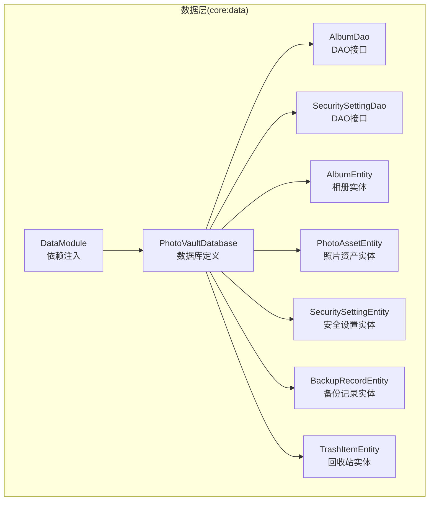
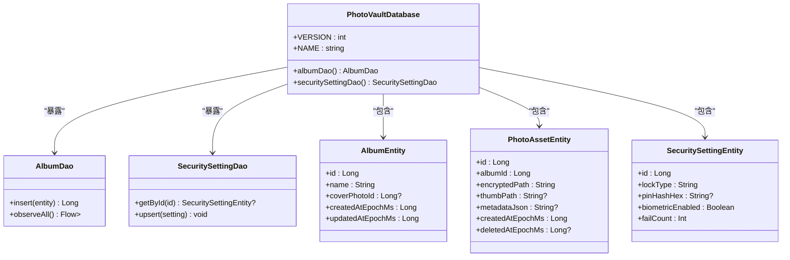
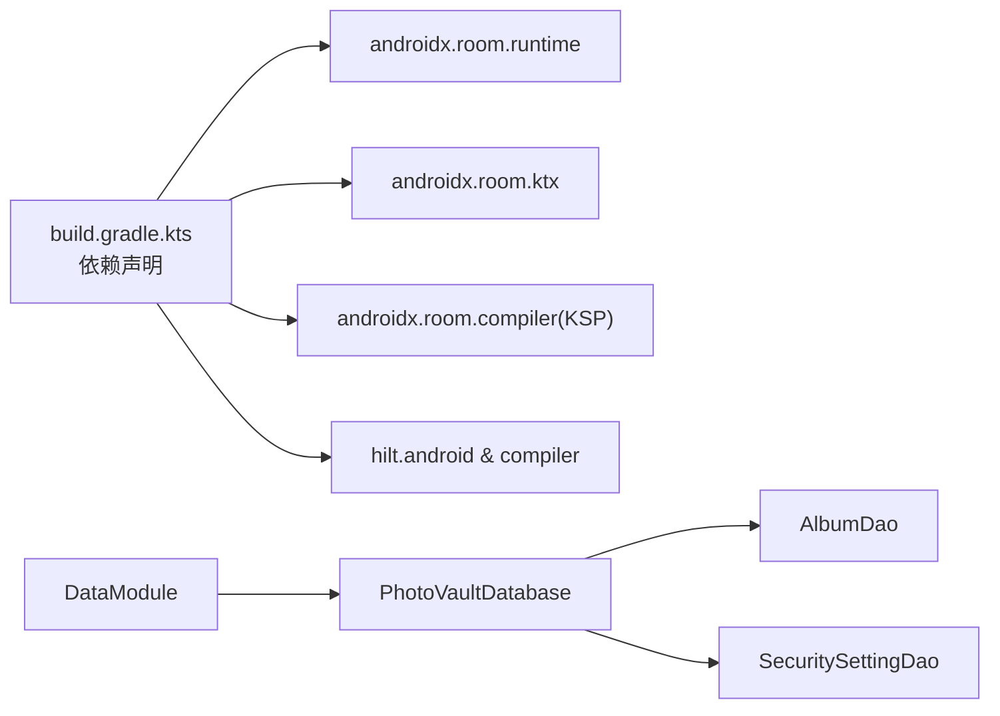

# 数据库设计

<cite>
**本文引用的文件**
- [PhotoVaultDatabase.kt](file://android/core/data/src/main/kotlin/com/photovault/data/db/PhotoVaultDatabase.kt)
- [AlbumDao.kt](file://android/core/data/src/main/kotlin/com/photovault/data/db/dao/AlbumDao.kt)
- [SecuritySettingDao.kt](file://android/core/data/src/main/kotlin/com/photovault/data/db/dao/SecuritySettingDao.kt)
- [AlbumEntity.kt](file://android/core/data/src/main/kotlin/com/photovault/data/db/entity/AlbumEntity.kt)
- [PhotoAssetEntity.kt](file://android/core/data/src/main/kotlin/com/photovault/data/db/entity/PhotoAssetEntity.kt)
- [SecuritySettingEntity.kt](file://android/core/data/src/main/kotlin/com/photovault/data/db/entity/SecuritySettingEntity.kt)
- [BackupRecordEntity.kt](file://android/core/data/src/main/kotlin/com/photovault/data/db/entity/BackupRecordEntity.kt)
- [TrashItemEntity.kt](file://android/core/data/src/main/kotlin/com/photovault/data/db/entity/TrashItemEntity.kt)
- [DataModule.kt](file://android/core/data/src/main/kotlin/com/photovault/data/di/DataModule.kt)
- [AlbumDaoRobolectricTest.kt](file://android/core/data/src/test/kotlin/com/photovault/data/db/AlbumDaoRobolectricTest.kt)
- [PhotoVaultApp.kt](file://android/app/src/main/kotlin/com/photovault/app/PhotoVaultApp.kt)
- [build.gradle.kts](file://android/core/data/build.gradle.kts)
</cite>

## 目录
1. [简介](#简介)
2. [项目结构](#项目结构)
3. [核心组件](#核心组件)
4. [架构总览](#架构总览)
5. [详细组件分析](#详细组件分析)
6. [依赖关系分析](#依赖关系分析)
7. [性能考虑](#性能考虑)
8. [故障排查指南](#故障排查指南)
9. [结论](#结论)
10. [附录](#附录)

## 简介
本文件面向AI照片保险库的数据库层，系统性阐述Room数据库的配置与使用、实体模型设计原则、DAO接口定义规范，并结合现有代码对PhotoVaultDatabase的数据库结构、AlbumEntity与PhotoAssetEntity的字段定义、AlbumDao与SecuritySettingDao的数据访问模式进行深入解析。同时覆盖数据库迁移策略、索引优化、查询性能调优、数据一致性与并发控制、备份与恢复机制等主题，并提供可直接定位到源码位置的示例路径，帮助开发者快速落地实现。

## 项目结构
数据库相关代码集中在android/core/data模块中，采用按职责分层组织：
- 数据库定义：PhotoVaultDatabase
- 实体定义：AlbumEntity、PhotoAssetEntity、SecuritySettingEntity、BackupRecordEntity、TrashItemEntity、SubscriptionStateEntity
- DAO接口：AlbumDao、SecuritySettingDao
- 依赖注入：DataModule
- 测试：AlbumDaoRobolectricTest
- 应用入口：PhotoVaultApp（启用Hilt）

图表来源
- [PhotoVaultDatabase.kt:14-35](file://android/core/data/src/main/kotlin/com/photovault/data/db/PhotoVaultDatabase.kt#L14-L35)
- [DataModule.kt:18-27](file://android/core/data/src/main/kotlin/com/photovault/data/di/DataModule.kt#L18-L27)

章节来源
- [PhotoVaultDatabase.kt:1-36](file://android/core/data/src/main/kotlin/com/photovault/data/db/PhotoVaultDatabase.kt#L1-L36)
- [DataModule.kt:1-40](file://android/core/data/src/main/kotlin/com/photovault/data/di/DataModule.kt#L1-L40)

## 核心组件
- PhotoVaultDatabase：Room数据库抽象类，声明实体集合、版本号、数据库名称，并暴露DAO访问方法。
- AlbumDao：提供相册插入与变更观察能力。
- SecuritySettingDao：提供单例安全设置的查询与UPSERT。
- 实体层：以@Database注解聚合，包含主键、外键、索引与列名映射。

章节来源
- [PhotoVaultDatabase.kt:14-35](file://android/core/data/src/main/kotlin/com/photovault/data/db/PhotoVaultDatabase.kt#L14-L35)
- [AlbumDao.kt:10-17](file://android/core/data/src/main/kotlin/com/photovault/data/db/dao/AlbumDao.kt#L10-L17)
- [SecuritySettingDao.kt:9-16](file://android/core/data/src/main/kotlin/com/photovault/data/db/dao/SecuritySettingDao.kt#L9-L16)

## 架构总览
Room数据库通过DataModule在应用启动时构建并注入，DAO作为数据访问层，实体承载表结构与约束。整体遵循“数据库定义—实体—DAO—依赖注入”的清晰分层。

图表来源
- [PhotoVaultDatabase.kt:14-35](file://android/core/data/src/main/kotlin/com/photovault/data/db/PhotoVaultDatabase.kt#L14-L35)
- [AlbumDao.kt:10-17](file://android/core/data/src/main/kotlin/com/photovault/data/db/dao/AlbumDao.kt#L10-L17)
- [SecuritySettingDao.kt:9-16](file://android/core/data/src/main/kotlin/com/photovault/data/db/dao/SecuritySettingDao.kt#L9-L16)
- [AlbumEntity.kt:8-18](file://android/core/data/src/main/kotlin/com/photovault/data/db/entity/AlbumEntity.kt#L8-L18)
- [PhotoAssetEntity.kt:9-32](file://android/core/data/src/main/kotlin/com/photovault/data/db/entity/PhotoAssetEntity.kt#L9-L32)
- [SecuritySettingEntity.kt:7-18](file://android/core/data/src/main/kotlin/com/photovault/data/db/entity/SecuritySettingEntity.kt#L7-L18)

## 详细组件分析

### PhotoVaultDatabase：数据库定义与版本管理
- 实体集合：包含AlbumEntity、PhotoAssetEntity、TrashItemEntity、SecuritySettingEntity、SubscriptionStateEntity、BackupRecordEntity。
- 版本与名称：当前版本常量为1，数据库名为固定字符串。
- 迁移策略提示：注释明确指出升级时在此注册Migration并递增版本号，为后续演进预留空间。

章节来源
- [PhotoVaultDatabase.kt:14-35](file://android/core/data/src/main/kotlin/com/photovault/data/db/PhotoVaultDatabase.kt#L14-L35)

### AlbumEntity：相册表结构与索引
- 表名：albums
- 主键：自增id
- 列定义：name、coverPhotoId、createdAtEpochMs、updatedAtEpochMs
- 索引：基于updated_at_ms的普通索引，用于按更新时间倒序排序场景

章节来源
- [AlbumEntity.kt:8-18](file://android/core/data/src/main/kotlin/com/photovault/data/db/entity/AlbumEntity.kt#L8-L18)

### PhotoAssetEntity：照片资产表结构、外键与索引
- 表名：photo_assets
- 外键：指向AlbumEntity.id，删除时级联删除
- 主键：自增id
- 列定义：album_id、encrypted_path、thumb_path、metadata_json、created_at_ms、deleted_at_ms
- 索引：album_id、deleted_at_ms，支持按相册分组与软删除过滤

章节来源
- [PhotoAssetEntity.kt:9-32](file://android/core/data/src/main/kotlin/com/photovault/data/db/entity/PhotoAssetEntity.kt#L9-L32)

### SecuritySettingEntity：安全设置单例实体
- 表名：security_settings
- 主键：默认单例id常量
- 字段：lock_type、pin_hash_hex、biometric_enabled、fail_count

章节来源
- [SecuritySettingEntity.kt:7-18](file://android/core/data/src/main/kotlin/com/photovault/data/db/entity/SecuritySettingEntity.kt#L7-L18)

### BackupRecordEntity：备份记录实体
- 表名：backup_records
- 主键：自增id
- 索引：created_at_ms，便于按时间检索备份

章节来源
- [BackupRecordEntity.kt:8-18](file://android/core/data/src/main/kotlin/com/photovault/data/db/entity/BackupRecordEntity.kt#L8-L18)

### TrashItemEntity：回收站实体与过期索引
- 表名：trash_items
- 外键：指向PhotoAssetEntity.id，删除时级联
- 主键：photo_id
- 索引：expire_at_ms，便于定时清理过期条目

章节来源
- [TrashItemEntity.kt:9-24](file://android/core/data/src/main/kotlin/com/photovault/data/db/entity/TrashItemEntity.kt#L9-L24)

### AlbumDao：相册数据访问模式
- 插入：ABORT冲突策略，避免重复主键导致的异常
- 查询：返回Flow列表，支持实时观察相册变更

章节来源
- [AlbumDao.kt:10-17](file://android/core/data/src/main/kotlin/com/photovault/data/db/dao/AlbumDao.kt#L10-L17)

### SecuritySettingDao：安全设置数据访问模式
- 查询：按id查询单例设置
- UPSERT：REPLACE冲突策略，确保单例写入幂等

章节来源
- [SecuritySettingDao.kt:9-16](file://android/core/data/src/main/kotlin/com/photovault/data/db/dao/SecuritySettingDao.kt#L9-L16)

### 依赖注入与数据库构建
- DataModule通过Room.databaseBuilder创建PhotoVaultDatabase实例，使用单例作用域，注入到应用生命周期。
- PhotoVaultApp启用Hilt，确保依赖注入容器可用。

章节来源
- [DataModule.kt:18-27](file://android/core/data/src/main/kotlin/com/photovault/data/di/DataModule.kt#L18-L27)
- [PhotoVaultApp.kt:7-17](file://android/app/src/main/kotlin/com/photovault/app/PhotoVaultApp.kt#L7-L17)

### 数据库迁移策略
- 当前版本为1，未实现任何Migration。
- 升级时应在PhotoVaultDatabase中注册Migration并递增VERSION常量，以保证schema演进的向后兼容。

章节来源
- [PhotoVaultDatabase.kt:30-32](file://android/core/data/src/main/kotlin/com/photovault/data/db/PhotoVaultDatabase.kt#L30-L32)

### 索引与查询性能
- AlbumEntity：updated_at_ms索引，支撑按更新时间倒序查询。
- PhotoAssetEntity：album_id与deleted_at_ms索引，支撑按相册分组与软删除过滤。
- TrashItemEntity：expire_at_ms索引，支撑过期清理任务。
- 建议：在高频查询列上保持索引，避免全表扫描；对组合条件查询评估复合索引必要性。

章节来源
- [AlbumEntity.kt](file://android/core/data/src/main/kotlin/com/photovault/data/db/entity/AlbumEntity.kt#L10)
- [PhotoAssetEntity.kt:19-22](file://android/core/data/src/main/kotlin/com/photovault/data/db/entity/PhotoAssetEntity.kt#L19-L22)
- [TrashItemEntity.kt](file://android/core/data/src/main/kotlin/com/photovault/data/db/entity/TrashItemEntity.kt#L19)

### 数据一致性与并发控制
- Room默认线程安全，DAO方法在协程中执行，避免主线程阻塞。
- 外键约束保障引用完整性（相册与照片、照片与回收站）。
- 单例实体通过REPLACE策略保证幂等写入。

章节来源
- [PhotoAssetEntity.kt:11-17](file://android/core/data/src/main/kotlin/com/photovault/data/db/entity/PhotoAssetEntity.kt#L11-L17)
- [TrashItemEntity.kt:11-17](file://android/core/data/src/main/kotlin/com/photovault/data/db/entity/TrashItemEntity.kt#L11-L17)
- [SecuritySettingDao.kt:14-15](file://android/core/data/src/main/kotlin/com/photovault/data/db/dao/SecuritySettingDao.kt#L14-L15)

### 备份与恢复机制
- 备份记录实体BackupRecordEntity提供文件路径、时间戳、版本与校验和字段，可用于构建备份与恢复流程。
- 建议：在应用层实现基于该实体的导入导出流程，配合加密引擎保障数据安全。

章节来源
- [BackupRecordEntity.kt:12-18](file://android/core/data/src/main/kotlin/com/photovault/data/db/entity/BackupRecordEntity.kt#L12-L18)

### 典型数据操作示例（路径）
以下示例均对应具体源码位置，便于快速定位实现细节：
- 插入相册并返回行ID
  - [AlbumDao.insert(...):12-13](file://android/core/data/src/main/kotlin/com/photovault/data/db/dao/AlbumDao.kt#L12-L13)
  - 示例调用参考：[AlbumDaoRobolectricTest.insertAlbum_returnsRowId(...):38-48](file://android/core/data/src/test/kotlin/com/photovault/data/db/AlbumDaoRobolectricTest.kt#L38-L48)
- 订阅安全设置查询与UPSERT
  - [SecuritySettingDao.getById(...):11-12](file://android/core/data/src/main/kotlin/com/photovault/data/db/dao/SecuritySettingDao.kt#L11-L12)
  - [SecuritySettingDao.upsert(...):14-15](file://android/core/data/src/main/kotlin/com/photovault/data/db/dao/SecuritySettingDao.kt#L14-L15)
- 按更新时间倒序观察相册
  - [AlbumDao.observeAll(...):15-16](file://android/core/data/src/main/kotlin/com/photovault/data/db/dao/AlbumDao.kt#L15-L16)

章节来源
- [AlbumDao.kt:10-17](file://android/core/data/src/main/kotlin/com/photovault/data/db/dao/AlbumDao.kt#L10-L17)
- [SecuritySettingDao.kt:9-16](file://android/core/data/src/main/kotlin/com/photovault/data/db/dao/SecuritySettingDao.kt#L9-L16)
- [AlbumDaoRobolectricTest.kt:37-48](file://android/core/data/src/test/kotlin/com/photovault/data/db/AlbumDaoRobolectricTest.kt#L37-L48)

## 依赖关系分析
- 构建脚本引入Room运行时、KTX扩展、编译器KSP以及Hilt，确保类型安全与依赖注入能力。
- DataModule提供数据库单例，供上层业务模块使用。

图表来源
- [build.gradle.kts:31-41](file://android/core/data/build.gradle.kts#L31-L41)
- [DataModule.kt:18-27](file://android/core/data/src/main/kotlin/com/photovault/data/di/DataModule.kt#L18-L27)

章节来源
- [build.gradle.kts:31-41](file://android/core/data/build.gradle.kts#L31-L41)
- [DataModule.kt:18-27](file://android/core/data/src/main/kotlin/com/photovault/data/di/DataModule.kt#L18-L27)

## 性能考虑
- 索引策略：为高频查询列建立索引，如相册更新时间、照片相册ID、软删除标记、回收站过期时间等。
- 查询优化：优先使用带索引的WHERE条件与ORDER BY，避免SELECT *，仅取必要字段。
- 批量操作：对于大量插入/更新，建议使用Room提供的批量API或事务封装，减少IO次数。
- 事务处理：复杂写入流程应包裹在Room事务中，确保原子性与一致性。
- 线程模型：DAO方法在IO线程执行，避免阻塞UI线程；Flow观察适合响应式UI更新。
- 缓存与去重：对外部资源导入时先做去重检查，减少重复写入。

## 故障排查指南
- 插入失败或主键冲突：确认AlbumDao使用ABORT策略，避免重复主键；若需幂等，请使用UPSERT替代。
  - 参考：[AlbumDao.insert(...):12-13](file://android/core/data/src/main/kotlin/com/photovault/data/db/dao/AlbumDao.kt#L12-L13)
- 安全设置未生效：确认使用REPLACE策略的UPSERT，并检查单例id是否一致。
  - 参考：[SecuritySettingDao.upsert(...):14-15](file://android/core/data/src/main/kotlin/com/photovault/data/db/dao/SecuritySettingDao.kt#L14-L15)
- 查询结果为空：核对索引是否命中，确认WHERE条件与列名映射正确。
  - 参考：[AlbumEntity.updated_at_ms索引](file://android/core/data/src/main/kotlin/com/photovault/data/db/entity/AlbumEntity.kt#L10)
- 外键约束错误：检查PhotoAssetEntity与AlbumEntity、TrashItemEntity与PhotoAssetEntity的外键关系。
  - 参考：[PhotoAssetEntity外键:11-17](file://android/core/data/src/main/kotlin/com/photovault/data/db/entity/PhotoAssetEntity.kt#L11-L17)、[TrashItemEntity外键:11-17](file://android/core/data/src/main/kotlin/com/photovault/data/db/entity/TrashItemEntity.kt#L11-L17)
- 单元测试验证：使用内存数据库与允许主线程查询的配置进行单元测试。
  - 参考：[AlbumDaoRobolectricTest.setup/tearDown:23-35](file://android/core/data/src/test/kotlin/com/photovault/data/db/AlbumDaoRobolectricTest.kt#L23-L35)

章节来源
- [AlbumDao.kt:12-13](file://android/core/data/src/main/kotlin/com/photovault/data/db/dao/AlbumDao.kt#L12-L13)
- [SecuritySettingDao.kt:14-15](file://android/core/data/src/main/kotlin/com/photovault/data/db/dao/SecuritySettingDao.kt#L14-L15)
- [AlbumEntity.kt](file://android/core/data/src/main/kotlin/com/photovault/data/db/entity/AlbumEntity.kt#L10)
- [PhotoAssetEntity.kt:11-17](file://android/core/data/src/main/kotlin/com/photovault/data/db/entity/PhotoAssetEntity.kt#L11-L17)
- [TrashItemEntity.kt:11-17](file://android/core/data/src/main/kotlin/com/photovault/data/db/entity/TrashItemEntity.kt#L11-L17)
- [AlbumDaoRobolectricTest.kt:23-35](file://android/core/data/src/test/kotlin/com/photovault/data/db/AlbumDaoRobolectricTest.kt#L23-L35)

## 结论
本数据库设计方案以Room为核心，通过明确的实体定义、DAO接口与依赖注入，实现了从相册管理到安全设置、备份记录与回收站的完整数据模型。现有索引与外键约束为查询性能与数据一致性提供了基础保障。建议在后续版本中完善迁移策略、引入事务与批量操作封装，并持续优化查询路径与索引覆盖，以满足更高的性能与可靠性要求。

## 附录
- 数据库初始化与注入
  - [DataModule提供数据库单例:18-27](file://android/core/data/src/main/kotlin/com/photovault/data/di/DataModule.kt#L18-L27)
  - [PhotoVaultApp启用Hilt:7-17](file://android/app/src/main/kotlin/com/photovault/app/PhotoVaultApp.kt#L7-L17)
- 依赖声明与构建配置
  - [Room与Hilt依赖:31-41](file://android/core/data/build.gradle.kts#L31-L41)