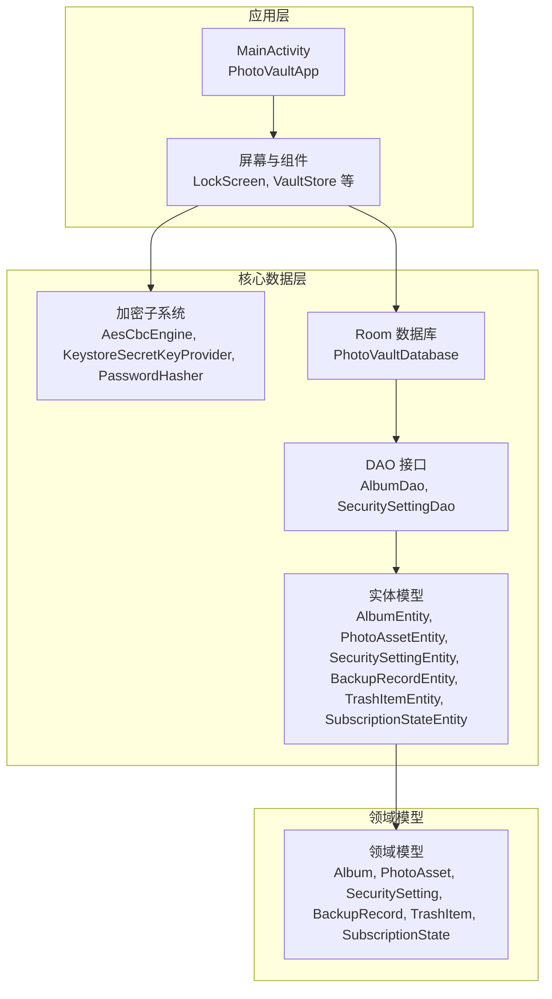
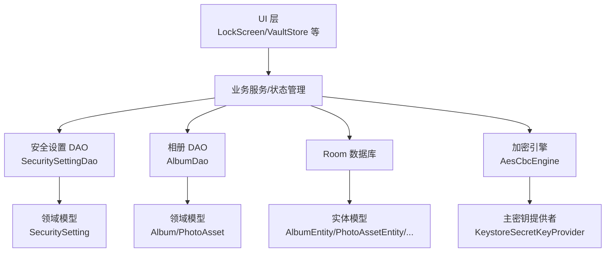
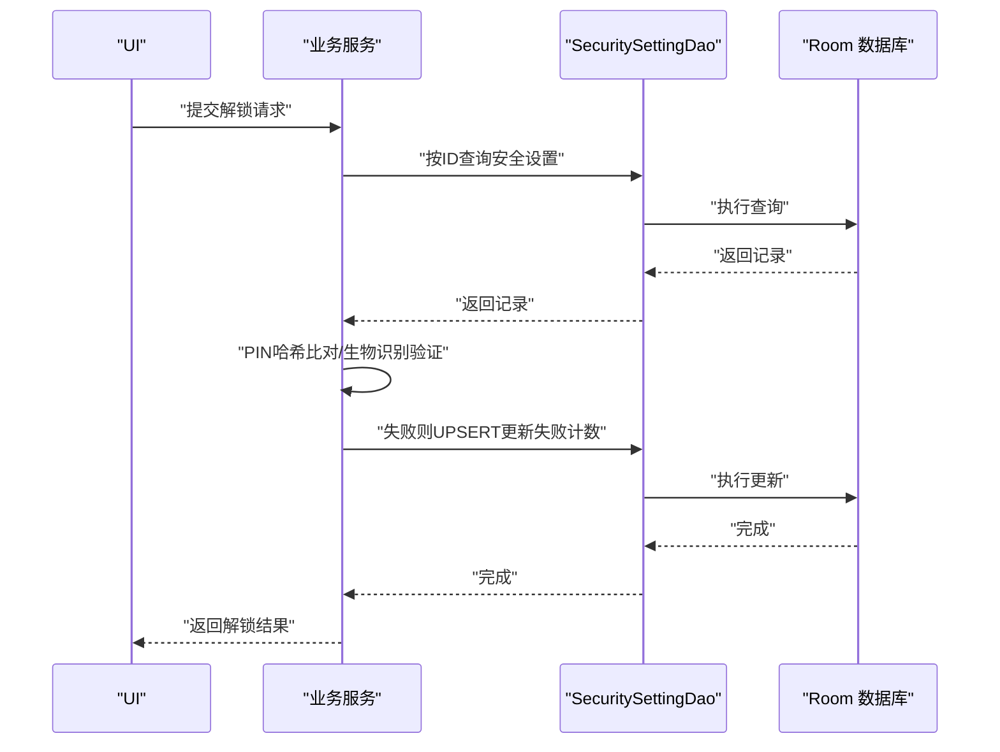
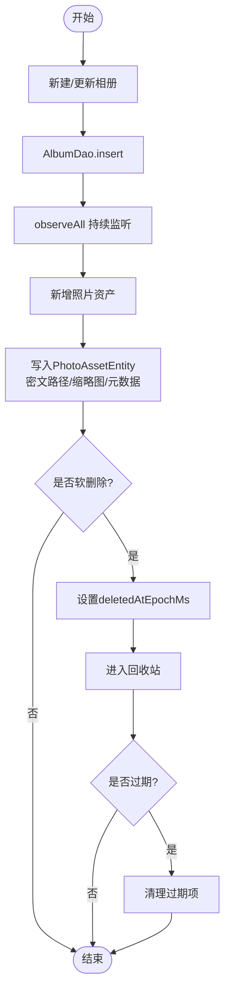
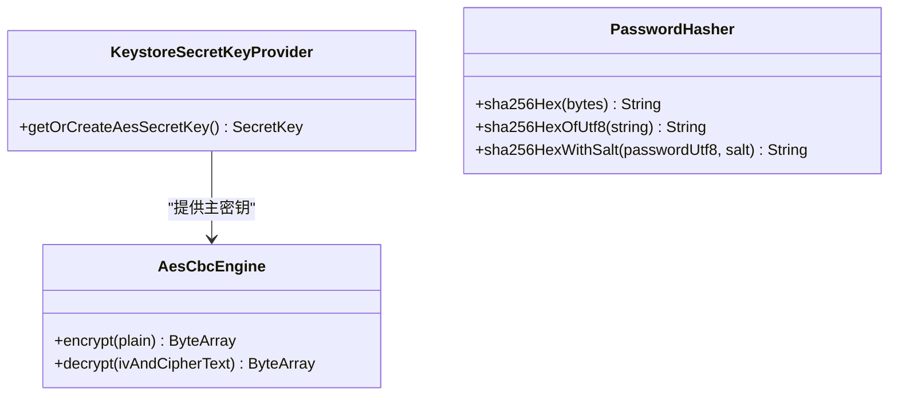
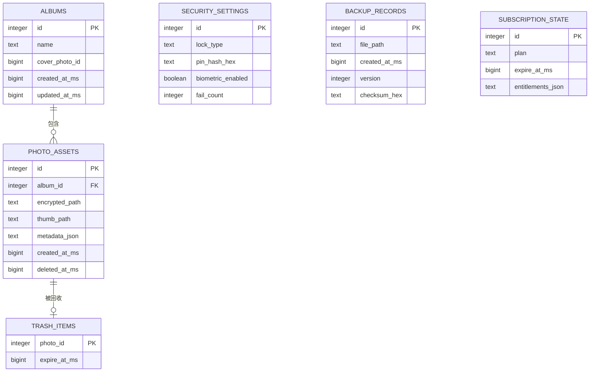
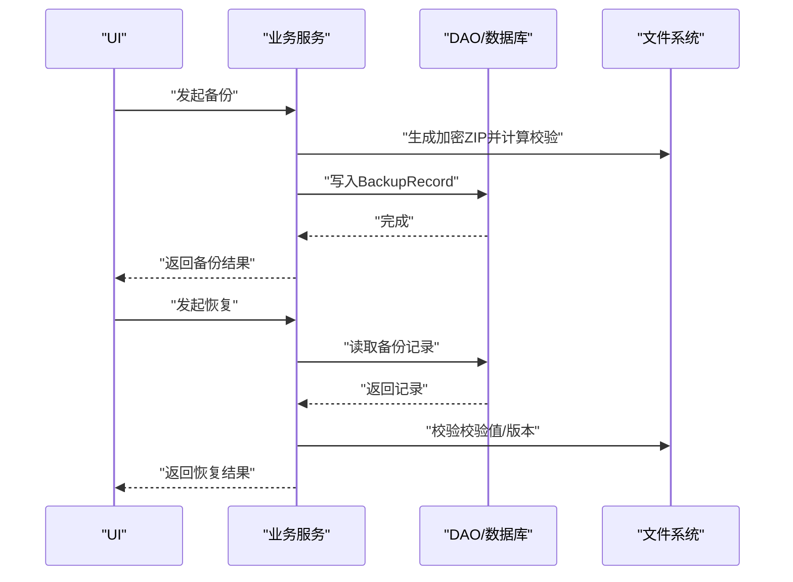
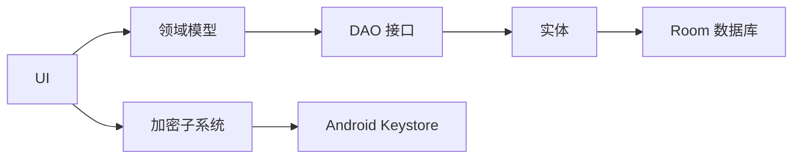

# 核心功能模块

<cite>
**本文引用的文件**
- [AesCbcEngine.kt](file://android/core/data/src/main/kotlin/com/photovault/data/crypto/AesCbcEngine.kt)
- [KeystoreSecretKeyProvider.kt](file://android/core/data/src/main/kotlin/com/photovault/data/crypto/KeystoreSecretKeyProvider.kt)
- [PasswordHasher.kt](file://android/core/data/src/main/kotlin/com/photovault/data/crypto/PasswordHasher.kt)
- [PhotoVaultDatabase.kt](file://android/core/data/src/main/kotlin/com/photovault/data/db/PhotoVaultDatabase.kt)
- [AlbumDao.kt](file://android/core/data/src/main/kotlin/com/photovault/data/db/dao/AlbumDao.kt)
- [SecuritySettingDao.kt](file://android/core/data/src/main/kotlin/com/photovault/data/db/dao/SecuritySettingDao.kt)
- [AlbumEntity.kt](file://android/core/data/src/main/kotlin/com/photovault/data/db/entity/AlbumEntity.kt)
- [PhotoAssetEntity.kt](file://android/core/data/src/main/kotlin/com/photovault/data/db/entity/PhotoAssetEntity.kt)
- [SecuritySettingEntity.kt](file://android/core/data/src/main/kotlin/com/photovault/data/db/entity/SecuritySettingEntity.kt)
- [BackupRecordEntity.kt](file://android/core/data/src/main/kotlin/com/photovault/data/db/entity/BackupRecordEntity.kt)
- [TrashItemEntity.kt](file://android/core/data/src/main/kotlin/com/photovault/data/db/entity/TrashItemEntity.kt)
- [SubscriptionStateEntity.kt](file://android/core/data/src/main/kotlin/com/photovault/data/db/entity/SubscriptionStateEntity.kt)
- [Album.kt](file://android/core/domain/src/main/kotlin/com/photovault/domain/model/Album.kt)
- [PhotoAsset.kt](file://android/core/domain/src/main/kotlin/com/photovault/domain/model/PhotoAsset.kt)
- [SecuritySetting.kt](file://android/core/domain/src/main/kotlin/com/photovault/domain/model/SecuritySetting.kt)
- [BackupRecord.kt](file://android/core/domain/src/main/kotlin/com/photovault/domain/model/BackupRecord.kt)
- [TrashItem.kt](file://android/core/domain/src/main/kotlin/com/photovault/domain/model/TrashItem.kt)
- [SubscriptionState.kt](file://android/core/domain/src/main/kotlin/com/photovault/domain/model/SubscriptionState.kt)
</cite>

## 目录
1. [简介](#简介)
2. [项目结构](#项目结构)
3. [核心组件](#核心组件)
4. [架构总览](#架构总览)
5. [详细组件分析](#详细组件分析)
6. [依赖分析](#依赖分析)
7. [性能考虑](#性能考虑)
8. [故障排查指南](#故障排查指南)
9. [结论](#结论)
10. [附录](#附录)

## 简介
本文件面向AI照片保险库项目的核心功能模块，围绕安全解锁系统、照片管理系统、加密存储系统、数据库设计、AI功能系统、备份恢复系统等进行系统化技术文档梳理。内容覆盖模块设计思路、实现细节、数据流与控制流、扩展点与定制化能力，并提供性能优化建议与最佳实践，帮助开发者快速理解并高效迭代。

## 项目结构
项目采用Android模块化分层组织：
- core/data：数据层（加密引擎、Room数据库、DAO、实体）
- core/domain：领域模型（与数据库实体一一对应的数据传输对象）
- android/app：UI与业务入口（屏幕、主题、组件、锁屏与保险库状态）

图表来源
- [PhotoVaultDatabase.kt:14-35](file://android/core/data/src/main/kotlin/com/photovault/data/db/PhotoVaultDatabase.kt#L14-L35)
- [AlbumDao.kt:10-17](file://android/core/data/src/main/kotlin/com/photovault/data/db/dao/AlbumDao.kt#L10-L17)
- [SecuritySettingDao.kt:9-16](file://android/core/data/src/main/kotlin/com/photovault/data/db/dao/SecuritySettingDao.kt#L9-L16)
- [AlbumEntity.kt:8-18](file://android/core/data/src/main/kotlin/com/photovault/data/db/entity/AlbumEntity.kt#L8-L18)
- [PhotoAssetEntity.kt:9-32](file://android/core/data/src/main/kotlin/com/photovault/data/db/entity/PhotoAssetEntity.kt#L9-L32)
- [SecuritySettingEntity.kt:7-18](file://android/core/data/src/main/kotlin/com/photovault/data/db/entity/SecuritySettingEntity.kt#L7-L18)
- [BackupRecordEntity.kt:8-18](file://android/core/data/src/main/kotlin/com/photovault/data/db/entity/BackupRecordEntity.kt#L8-L18)
- [TrashItemEntity.kt:9-24](file://android/core/data/src/main/kotlin/com/photovault/data/db/entity/TrashItemEntity.kt#L9-L24)
- [SubscriptionStateEntity.kt:7-17](file://android/core/data/src/main/kotlin/com/photovault/data/db/entity/SubscriptionStateEntity.kt#L7-L17)

章节来源
- [PhotoVaultDatabase.kt:14-35](file://android/core/data/src/main/kotlin/com/photovault/data/db/PhotoVaultDatabase.kt#L14-L35)
- [AlbumDao.kt:10-17](file://android/core/data/src/main/kotlin/com/photovault/data/db/dao/AlbumDao.kt#L10-L17)
- [SecuritySettingDao.kt:9-16](file://android/core/data/src/main/kotlin/com/photovault/data/db/dao/SecuritySettingDao.kt#L9-L16)

## 核心组件
本节从模块职责、数据结构、接口契约与典型用法角度，概览六大核心模块。

- 安全解锁系统
  - 负责PIN与生物识别策略的持久化与验证，口令仅保存哈希，失败计数用于风控。
  - 关键实体：SecuritySettingEntity；关键DAO：SecuritySettingDao；关键领域模型：SecuritySetting。

- 照片管理系统
  - 管理自定义相册与照片资产，支持按更新时间排序、软删除标记、回收站过期清理。
  - 关键实体：AlbumEntity、PhotoAssetEntity；关键DAO：AlbumDao；关键领域模型：Album、PhotoAsset。

- 加密存储系统
  - 基于Android Keystore托管的AES-256-CBC主密钥，前置随机IV，统一加密格式；口令哈希用于PIN校验。
  - 关键组件：KeystoreSecretKeyProvider、AesCbcEngine、PasswordHasher。

- 数据库设计
  - Room数据库，包含相册、照片、安全设置、订阅状态、回收站、备份记录等表；通过索引与外键保证查询效率与一致性。
  - 关键文件：PhotoVaultDatabase、各实体类、DAO接口。

- AI功能系统
  - 作为概念性模块，用于后续集成AI打码、智能分类、隐私检测等功能。当前仓库未包含具体实现，建议以插件化方式接入，遵循现有加密与数据库契约。

- 备份恢复系统
  - 记录备份包路径、版本、时间戳与校验值，支持恢复流程中的完整性校验与版本对比。
  - 关键实体：BackupRecordEntity；关键领域模型：BackupRecord。

章节来源
- [SecuritySettingEntity.kt:7-18](file://android/core/data/src/main/kotlin/com/photovault/data/db/entity/SecuritySettingEntity.kt#L7-L18)
- [SecuritySettingDao.kt:9-16](file://android/core/data/src/main/kotlin/com/photovault/data/db/dao/SecuritySettingDao.kt#L9-L16)
- [AlbumEntity.kt:8-18](file://android/core/data/src/main/kotlin/com/photovault/data/db/entity/AlbumEntity.kt#L8-L18)
- [PhotoAssetEntity.kt:9-32](file://android/core/data/src/main/kotlin/com/photovault/data/db/entity/PhotoAssetEntity.kt#L9-L32)
- [AlbumDao.kt:10-17](file://android/core/data/src/main/kotlin/com/photovault/data/db/dao/AlbumDao.kt#L10-L17)
- [KeystoreSecretKeyProvider.kt:12-35](file://android/core/data/src/main/kotlin/com/photovault/data/crypto/KeystoreSecretKeyProvider.kt#L12-L35)
- [AesCbcEngine.kt:12-32](file://android/core/data/src/main/kotlin/com/photovault/data/crypto/AesCbcEngine.kt#L12-L32)
- [PasswordHasher.kt:6-25](file://android/core/data/src/main/kotlin/com/photovault/data/crypto/PasswordHasher.kt#L6-L25)
- [PhotoVaultDatabase.kt:14-35](file://android/core/data/src/main/kotlin/com/photovault/data/db/PhotoVaultDatabase.kt#L14-L35)
- [BackupRecordEntity.kt:8-18](file://android/core/data/src/main/kotlin/com/photovault/data/db/entity/BackupRecordEntity.kt#L8-L18)

## 架构总览
下图展示从UI到数据层的关键交互路径，以及加密与数据库的协作关系。

图表来源
- [PhotoVaultDatabase.kt:14-35](file://android/core/data/src/main/kotlin/com/photovault/data/db/PhotoVaultDatabase.kt#L14-L35)
- [AlbumDao.kt:10-17](file://android/core/data/src/main/kotlin/com/photovault/data/db/dao/AlbumDao.kt#L10-L17)
- [SecuritySettingDao.kt:9-16](file://android/core/data/src/main/kotlin/com/photovault/data/db/dao/SecuritySettingDao.kt#L9-L16)
- [KeystoreSecretKeyProvider.kt:12-35](file://android/core/data/src/main/kotlin/com/photovault/data/crypto/KeystoreSecretKeyProvider.kt#L12-L35)
- [AesCbcEngine.kt:12-32](file://android/core/data/src/main/kotlin/com/photovault/data/crypto/AesCbcEngine.kt#L12-L32)

## 详细组件分析

### 安全解锁系统
- 设计要点
  - 口令仅存哈希，避免明文泄露；失败计数用于风控；生物识别开关与锁类型策略持久化。
  - 使用单例ID约束唯一安全设置记录，简化读写。
- 数据结构与接口
  - 实体：SecuritySettingEntity（字段包括锁类型、PIN哈希、生物识别开关、失败次数）。
  - DAO：SecuritySettingDao（按ID查询与UPSERT）。
  - 领域模型：SecuritySetting。
- 典型流程
  - 登录时先加载安全设置，再进行PIN哈希比对或生物识别验证；失败则递增失败计数并持久化。
- 扩展点
  - 支持新增锁类型（如图形锁）、引入安装级salt增强抗破解能力、集成设备可信圈策略。

图表来源
- [SecuritySettingDao.kt:9-16](file://android/core/data/src/main/kotlin/com/photovault/data/db/dao/SecuritySettingDao.kt#L9-L16)
- [SecuritySettingEntity.kt:7-18](file://android/core/data/src/main/kotlin/com/photovault/data/db/entity/SecuritySettingEntity.kt#L7-L18)

章节来源
- [SecuritySettingEntity.kt:7-18](file://android/core/data/src/main/kotlin/com/photovault/data/db/entity/SecuritySettingEntity.kt#L7-L18)
- [SecuritySettingDao.kt:9-16](file://android/core/data/src/main/kotlin/com/photovault/data/db/dao/SecuritySettingDao.kt#L9-L16)
- [SecuritySetting.kt:6-12](file://android/core/domain/src/main/kotlin/com/photovault/domain/model/SecuritySetting.kt#L6-L12)

### 照片管理系统
- 设计要点
  - 自定义相册与照片资产分离管理；照片资产支持软删除与回收站过期清理；相册按更新时间倒序展示。
- 数据结构与接口
  - 实体：AlbumEntity、PhotoAssetEntity（含外键关联与索引）。
  - DAO：AlbumDao（插入与观察全部相册）、SecuritySettingDao（安全设置）。
  - 领域模型：Album、PhotoAsset。
- 典型流程
  - 新建相册：AlbumDao.insert；更新相册：AlbumDao.insert（冲突中止策略）；观察相册列表：observeAll。
  - 照片入库：PhotoAssetEntity写入密文路径与缩略图路径；软删除：设置deletedAtEpochMs；回收站清理：基于expireAtEpochMs过期项清理。

图表来源
- [AlbumDao.kt:10-17](file://android/core/data/src/main/kotlin/com/photovault/data/db/dao/AlbumDao.kt#L10-L17)
- [AlbumEntity.kt:8-18](file://android/core/data/src/main/kotlin/com/photovault/data/db/entity/AlbumEntity.kt#L8-L18)
- [PhotoAssetEntity.kt:9-32](file://android/core/data/src/main/kotlin/com/photovault/data/db/entity/PhotoAssetEntity.kt#L9-L32)
- [TrashItemEntity.kt:9-24](file://android/core/data/src/main/kotlin/com/photovault/data/db/entity/TrashItemEntity.kt#L9-L24)

章节来源
- [AlbumEntity.kt:8-18](file://android/core/data/src/main/kotlin/com/photovault/data/db/entity/AlbumEntity.kt#L8-L18)
- [PhotoAssetEntity.kt:9-32](file://android/core/data/src/main/kotlin/com/photovault/data/db/entity/PhotoAssetEntity.kt#L9-L32)
- [AlbumDao.kt:10-17](file://android/core/data/src/main/kotlin/com/photovault/data/db/dao/AlbumDao.kt#L10-L17)
- [Album.kt:6-12](file://android/core/domain/src/main/kotlin/com/photovault/domain/model/Album.kt#L6-L12)
- [PhotoAsset.kt:6-14](file://android/core/domain/src/main/kotlin/com/photovault/domain/model/PhotoAsset.kt#L6-L14)

### 加密存储系统
- 设计要点
  - 主密钥托管于Android Keystore，不可导出；加密算法为AES-256-CBC+PKCS7Padding；IV长度16字节，前置拼接在密文前。
  - 口令哈希采用SHA-256，支持salt组合，避免明文口令存储。
- 组件关系
  - KeystoreSecretKeyProvider负责生成/读取主密钥；
  - AesCbcEngine负责加解密；
  - PasswordHasher负责口令哈希计算。

图表来源
- [KeystoreSecretKeyProvider.kt:12-35](file://android/core/data/src/main/kotlin/com/photovault/data/crypto/KeystoreSecretKeyProvider.kt#L12-L35)
- [AesCbcEngine.kt:12-32](file://android/core/data/src/main/kotlin/com/photovault/data/crypto/AesCbcEngine.kt#L12-L32)
- [PasswordHasher.kt:6-25](file://android/core/data/src/main/kotlin/com/photovault/data/crypto/PasswordHasher.kt#L6-L25)

章节来源
- [KeystoreSecretKeyProvider.kt:12-35](file://android/core/data/src/main/kotlin/com/photovault/data/crypto/KeystoreSecretKeyProvider.kt#L12-L35)
- [AesCbcEngine.kt:12-32](file://android/core/data/src/main/kotlin/com/photovault/data/crypto/AesCbcEngine.kt#L12-L32)
- [PasswordHasher.kt:6-25](file://android/core/data/src/main/kotlin/com/photovault/data/crypto/PasswordHasher.kt#L6-L25)

### 数据库设计
- 表与关系
  - albums：相册表，包含名称、封面照片ID、创建/更新时间戳。
  - photo_assets：照片资产表，包含相册ID外键、密文路径、缩略图路径、元数据JSON、创建/删除时间戳。
  - security_settings：安全设置表（单例），包含锁类型、PIN哈希、生物识别开关、失败次数。
  - backup_records：备份记录表，包含文件路径、创建时间、版本、校验值。
  - trash_items：回收站表，包含照片ID与过期时间。
  - subscription_state：订阅状态表（单例），包含计划、到期时间、权益JSON。
- 索引与约束
  - albums.updated_at_ms、photo_assets.deleted_at_ms、backup_records.created_at_ms等索引提升查询效率。
  - photo_assets.album_id、trash_items.photo_id等索引与外键保证一致性。
- 版本与迁移
  - 数据库版本常量与名称集中定义；升级时在相应位置注册Migration并递增版本号。

图表来源
- [PhotoVaultDatabase.kt:14-35](file://android/core/data/src/main/kotlin/com/photovault/data/db/PhotoVaultDatabase.kt#L14-L35)
- [AlbumEntity.kt:8-18](file://android/core/data/src/main/kotlin/com/photovault/data/db/entity/AlbumEntity.kt#L8-L18)
- [PhotoAssetEntity.kt:9-32](file://android/core/data/src/main/kotlin/com/photovault/data/db/entity/PhotoAssetEntity.kt#L9-L32)
- [SecuritySettingEntity.kt:7-18](file://android/core/data/src/main/kotlin/com/photovault/data/db/entity/SecuritySettingEntity.kt#L7-L18)
- [BackupRecordEntity.kt:8-18](file://android/core/data/src/main/kotlin/com/photovault/data/db/entity/BackupRecordEntity.kt#L8-L18)
- [TrashItemEntity.kt:9-24](file://android/core/data/src/main/kotlin/com/photovault/data/db/entity/TrashItemEntity.kt#L9-L24)
- [SubscriptionStateEntity.kt:7-17](file://android/core/data/src/main/kotlin/com/photovault/data/db/entity/SubscriptionStateEntity.kt#L7-L17)

章节来源
- [PhotoVaultDatabase.kt:14-35](file://android/core/data/src/main/kotlin/com/photovault/data/db/PhotoVaultDatabase.kt#L14-L35)
- [AlbumEntity.kt:8-18](file://android/core/data/src/main/kotlin/com/photovault/data/db/entity/AlbumEntity.kt#L8-L18)
- [PhotoAssetEntity.kt:9-32](file://android/core/data/src/main/kotlin/com/photovault/data/db/entity/PhotoAssetEntity.kt#L9-L32)
- [SecuritySettingEntity.kt:7-18](file://android/core/data/src/main/kotlin/com/photovault/data/db/entity/SecuritySettingEntity.kt#L7-L18)
- [BackupRecordEntity.kt:8-18](file://android/core/data/src/main/kotlin/com/photovault/data/db/entity/BackupRecordEntity.kt#L8-L18)
- [TrashItemEntity.kt:9-24](file://android/core/data/src/main/kotlin/com/photovault/data/db/entity/TrashItemEntity.kt#L9-L24)
- [SubscriptionStateEntity.kt:7-17](file://android/core/data/src/main/kotlin/com/photovault/data/db/entity/SubscriptionStateEntity.kt#L7-L17)

### 备份恢复系统
- 设计要点
  - 记录每次备份包的文件路径、创建时间、版本与校验值，便于恢复时进行完整性校验与版本对比。
  - 与数据库版本协同，确保备份与恢复过程中的数据一致性。
- 数据结构
  - 实体：BackupRecordEntity；领域模型：BackupRecord。

图表来源
- [BackupRecordEntity.kt:8-18](file://android/core/data/src/main/kotlin/com/photovault/data/db/entity/BackupRecordEntity.kt#L8-L18)
- [BackupRecord.kt:6-12](file://android/core/domain/src/main/kotlin/com/photovault/domain/model/BackupRecord.kt#L6-L12)

章节来源
- [BackupRecordEntity.kt:8-18](file://android/core/data/src/main/kotlin/com/photovault/data/db/entity/BackupRecordEntity.kt#L8-L18)
- [BackupRecord.kt:6-12](file://android/core/domain/src/main/kotlin/com/photovault/domain/model/BackupRecord.kt#L6-L12)

### AI功能系统（概念性模块）
- 设计要点
  - 作为扩展模块，用于后续集成AI打码、智能分类、隐私检测等功能。
  - 建议以插件化方式接入，遵循现有加密与数据库契约，确保数据在加密存储与受控访问范围内流转。
- 扩展点
  - 插件接口抽象、模型加载与推理管线、与UI的解耦调度、日志与监控埋点。

[本节为概念性说明，不直接分析具体源码文件]

## 依赖分析
- 模块内聚与耦合
  - 数据层通过DAO与实体解耦UI与业务逻辑；领域模型作为跨层的数据载体，降低数据库变更对上层的影响。
  - 加密子系统与数据库解耦，通过服务注入方式在需要时启用。
- 外部依赖
  - Android Keystore用于密钥托管；Room用于本地持久化；SHA-256用于口令哈希。
- 潜在循环依赖
  - 当前结构清晰，DAO依赖实体，实体不反向依赖DAO，避免循环依赖。

图表来源
- [PhotoVaultDatabase.kt:14-35](file://android/core/data/src/main/kotlin/com/photovault/data/db/PhotoVaultDatabase.kt#L14-L35)
- [KeystoreSecretKeyProvider.kt:12-35](file://android/core/data/src/main/kotlin/com/photovault/data/crypto/KeystoreSecretKeyProvider.kt#L12-L35)

章节来源
- [PhotoVaultDatabase.kt:14-35](file://android/core/data/src/main/kotlin/com/photovault/data/db/PhotoVaultDatabase.kt#L14-L35)
- [KeystoreSecretKeyProvider.kt:12-35](file://android/core/data/src/main/kotlin/com/photovault/data/crypto/KeystoreSecretKeyProvider.kt#L12-L35)

## 性能考虑
- 查询优化
  - 为高频查询字段建立索引（如albums.updated_at_ms、photo_assets.deleted_at_ms、backup_records.created_at_ms）。
  - 使用Flow进行响应式观察，避免阻塞主线程。
- 写入策略
  - AlbumDao使用ABORT冲突策略，避免重复写入导致的无意义开销。
  - UPSERT安全设置减少读写往返。
- 加密性能
  - AES-256-CBC在Android平台性能稳定；建议批量处理大文件时分块加密并复用Cipher实例以减少初始化成本。
- 存储与IO
  - 将密文与缩略图路径存入数据库，避免频繁文件系统扫描；对大文件操作使用异步IO与后台线程池。
- 缓存与离线
  - 订阅状态与部分元数据可在本地缓存，结合离线体验优化启动速度。

[本节提供通用性能建议，不直接分析具体源码文件]

## 故障排查指南
- 加密相关
  - 若解密失败，检查输入payload长度与IV长度是否匹配；确认主密钥未被系统重置或删除。
  - 口令哈希不一致：确认salt组合与哈希算法一致。
- 数据库相关
  - 查询异常：核对索引是否存在、外键约束是否满足；必要时清理损坏记录或执行迁移。
  - 写入冲突：确认AlbumDao的冲突策略与业务意图一致。
- 回收站与软删除
  - 照片未显示：检查deletedAtEpochMs是否为空；回收站过期项是否已清理。
- 备份恢复
  - 校验失败：重新生成备份包并更新校验值；核对版本号与数据库版本一致性。

章节来源
- [AesCbcEngine.kt:25-32](file://android/core/data/src/main/kotlin/com/photovault/data/crypto/AesCbcEngine.kt#L25-L32)
- [PasswordHasher.kt:17-24](file://android/core/data/src/main/kotlin/com/photovault/data/crypto/PasswordHasher.kt#L17-L24)
- [AlbumDao.kt:12-13](file://android/core/data/src/main/kotlin/com/photovault/data/db/dao/AlbumDao.kt#L12-L13)
- [PhotoAssetEntity.kt:29-32](file://android/core/data/src/main/kotlin/com/photovault/data/db/entity/PhotoAssetEntity.kt#L29-L32)
- [BackupRecordEntity.kt:14-17](file://android/core/data/src/main/kotlin/com/photovault/data/db/entity/BackupRecordEntity.kt#L14-L17)

## 结论
本项目通过清晰的分层与模块化设计，实现了安全、可扩展且易维护的私密照片保险库核心能力。加密子系统与数据库契约明确，解锁与照片管理流程稳定，备份恢复具备可追溯性。建议在后续迭代中继续完善AI功能的插件化接入与监控埋点，持续优化查询与IO性能，并加强异常场景的容错与可观测性。

## 附录
- 配置与常量
  - 数据库版本与名称：集中定义于数据库类中，升级时需同步迁移脚本。
  - 加密算法与IV长度：固定为AES-256-CBC+PKCS7Padding与16字节IV。
  - 安全设置单例ID：统一为1L，简化读写。
- 最佳实践
  - 所有敏感数据均应加密存储；口令仅存哈希；失败计数用于风控。
  - 使用Flow与协程进行异步处理；避免在主线程进行IO与加密。
  - 对外键与索引进行定期审查，确保查询性能与数据一致性。

[本节为总结性内容，不直接分析具体源码文件]