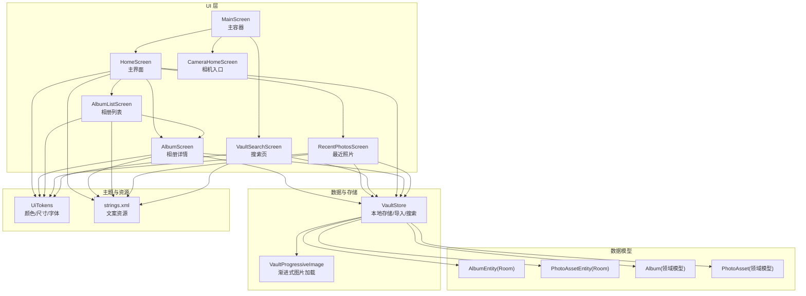
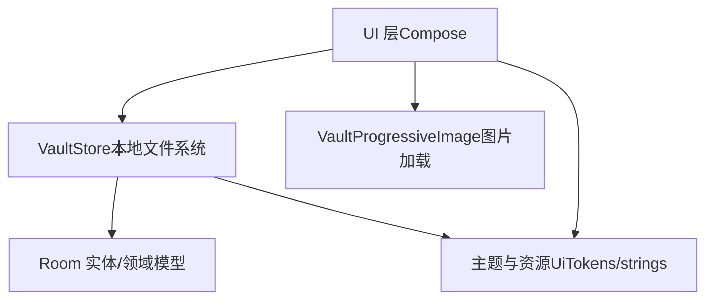
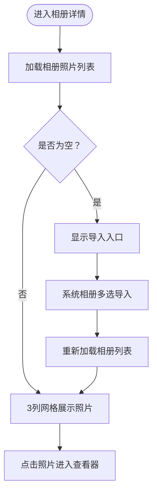
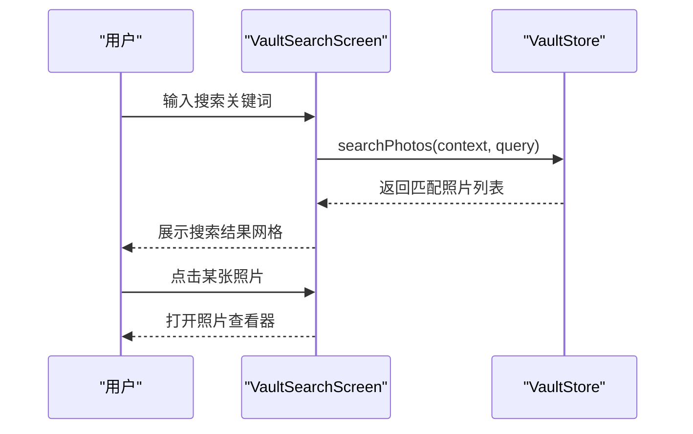
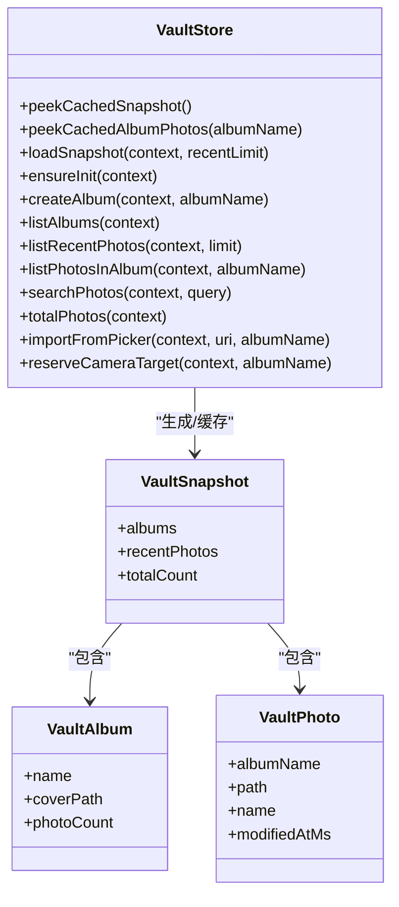
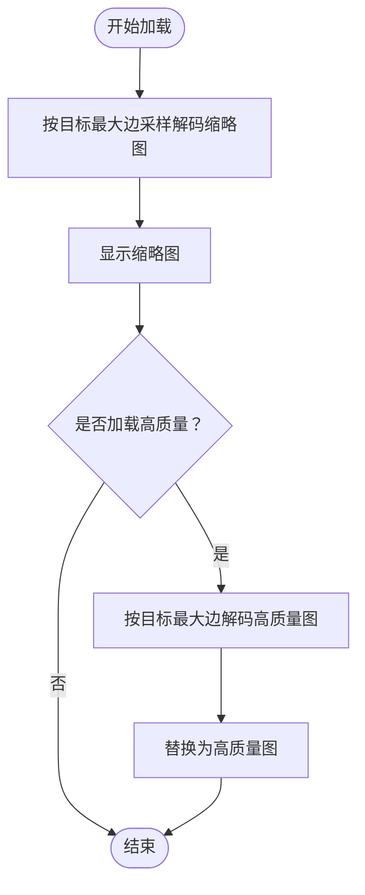
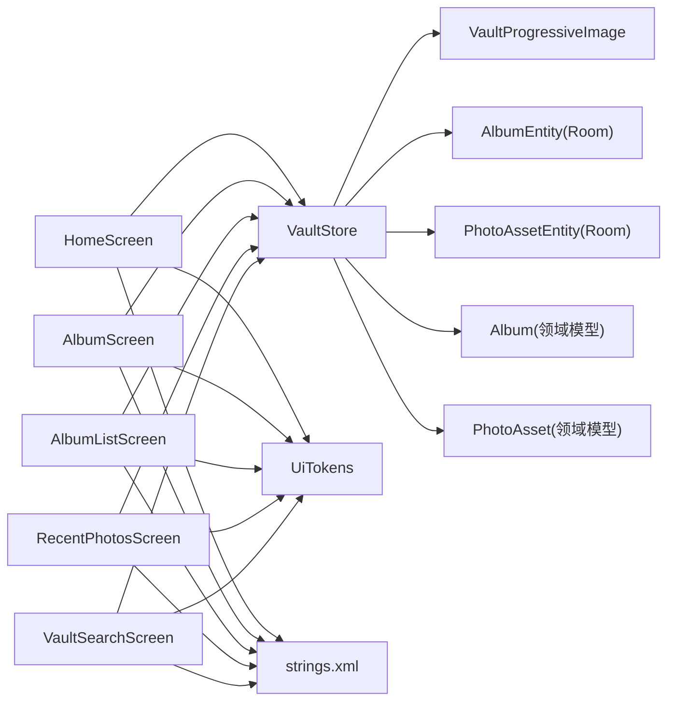

# 照片管理系统

<cite>
**本文引用的文件**
- [HomeScreen.kt](file://android/app/src/main/kotlin/com/photovault/app/ui/HomeScreen.kt)
- [AlbumScreen.kt](file://android/app/src/main/kotlin/com/photovault/app/ui/AlbumScreen.kt)
- [CameraHomeScreen.kt](file://android/app/src/main/kotlin/com/photovault/app/ui/CameraHomeScreen.kt)
- [RecentPhotosScreen.kt](file://android/app/src/main/kotlin/com/photovault/app/ui/RecentPhotosScreen.kt)
- [AlbumListScreen.kt](file://android/app/src/main/kotlin/com/photovault/app/ui/AlbumListScreen.kt)
- [VaultStore.kt](file://android/app/src/main/kotlin/com/photovault/app/ui/vault/VaultStore.kt)
- [VaultProgressiveImage.kt](file://android/app/src/main/kotlin/com/photovault/app/ui/components/VaultProgressiveImage.kt)
- [VaultSearchScreen.kt](file://android/app/src/main/kotlin/com/photovault/app/ui/VaultSearchScreen.kt)
- [MainScreen.kt](file://android/app/src/main/kotlin/com/photovault/app/ui/MainScreen.kt)
- [UiTokens.kt](file://android/app/src/main/kotlin/com/photovault/app/ui/theme/UiTokens.kt)
- [strings.xml](file://android/app/src/main/res/values/strings.xml)
- [AlbumEntity.kt](file://android/core/data/src/main/kotlin/com/photovault/data/db/entity/AlbumEntity.kt)
- [PhotoAssetEntity.kt](file://android/core/data/src/main/kotlin/com/photovault/data/db/entity/PhotoAssetEntity.kt)
- [Album.kt](file://android/core/domain/src/main/kotlin/com/photovault/domain/model/Album.kt)
- [PhotoAsset.kt](file://android/core/domain/src/main/kotlin/com/photovault/domain/model/PhotoAsset.kt)
</cite>

## 目录
1. [简介](#简介)
2. [项目结构](#项目结构)
3. [核心组件](#核心组件)
4. [架构总览](#架构总览)
5. [详细组件分析](#详细组件分析)
6. [依赖关系分析](#依赖关系分析)
7. [性能考量](#性能考量)
8. [故障排查指南](#故障排查指南)
9. [结论](#结论)
10. [附录](#附录)

## 简介
本文件为 AI 照片保险库的照片管理系统综合文档，聚焦于相册浏览界面、照片列表展示、相册创建与管理、照片导入与搜索等核心功能。文档从系统架构、组件关系、数据流、处理逻辑、集成点、错误处理与性能特性等方面进行深入解析，并提供可视化图表、最佳实践与优化建议，帮助开发者与产品人员高效理解与迭代系统。

## 项目结构
- UI 层采用 Jetpack Compose 构建，包含主界面 HomeScreen、相册详情 AlbumScreen、相册列表 AlbumListScreen、最近照片 RecentPhotosScreen、相机入口 CameraHomeScreen、搜索页 VaultSearchScreen 以及主容器 MainScreen。
- 数据层通过 VaultStore 提供本地文件系统上的照片与相册管理能力；同时存在 Room 实体与领域模型，用于后续数据库持久化与扩展。
- 主题与尺寸通过 UiTokens 统一管理，确保视觉一致性与可维护性。
- 字符串资源集中于 strings.xml，便于国际化与文案管理。

**图表来源**
- [MainScreen.kt:14-82](file://android/app/src/main/kotlin/com/photovault/app/ui/MainScreen.kt#L14-L82)
- [HomeScreen.kt:81-331](file://android/app/src/main/kotlin/com/photovault/app/ui/HomeScreen.kt#L81-L331)
- [AlbumScreen.kt:53-210](file://android/app/src/main/kotlin/com/photovault/app/ui/AlbumScreen.kt#L53-L210)
- [AlbumListScreen.kt:46-162](file://android/app/src/main/kotlin/com/photovault/app/ui/AlbumListScreen.kt#L46-L162)
- [RecentPhotosScreen.kt:47-146](file://android/app/src/main/kotlin/com/photovault/app/ui/RecentPhotosScreen.kt#L47-L146)
- [VaultSearchScreen.kt:47-134](file://android/app/src/main/kotlin/com/photovault/app/ui/VaultSearchScreen.kt#L47-L134)
- [VaultStore.kt:39-224](file://android/app/src/main/kotlin/com/photovault/app/ui/vault/VaultStore.kt#L39-L224)
- [VaultProgressiveImage.kt:23-90](file://android/app/src/main/kotlin/com/photovault/app/ui/components/VaultProgressiveImage.kt#L23-L90)
- [UiTokens.kt:9-185](file://android/app/src/main/kotlin/com/photovault/app/ui/theme/UiTokens.kt#L9-L185)
- [strings.xml:1-151](file://android/app/src/main/res/values/strings.xml#L1-L151)
- [AlbumEntity.kt:8-18](file://android/core/data/src/main/kotlin/com/photovault/data/db/entity/AlbumEntity.kt#L8-L18)
- [PhotoAssetEntity.kt:9-32](file://android/core/data/src/main/kotlin/com/photovault/data/db/entity/PhotoAssetEntity.kt#L9-L32)
- [Album.kt:6-12](file://android/core/domain/src/main/kotlin/com/photovault/domain/model/Album.kt#L6-L12)
- [PhotoAsset.kt:6-14](file://android/core/domain/src/main/kotlin/com/photovault/domain/model/PhotoAsset.kt#L6-L14)

**章节来源**
- [MainScreen.kt:14-82](file://android/app/src/main/kotlin/com/photovault/app/ui/MainScreen.kt#L14-L82)
- [HomeScreen.kt:81-331](file://android/app/src/main/kotlin/com/photovault/app/ui/HomeScreen.kt#L81-L331)
- [VaultStore.kt:39-224](file://android/app/src/main/kotlin/com/photovault/app/ui/vault/VaultStore.kt#L39-L224)

## 核心组件
- 主界面 HomeScreen：聚合相册与最近照片展示，支持权限引导、导入提示、底部导航与相册创建对话框。
- 相册详情 AlbumScreen：按网格展示相册内照片，支持从系统相册批量导入到指定相册。
- 相册列表 AlbumListScreen：展示所有相册封面与数量，支持筛选与跳转。
- 最近照片 RecentPhotosScreen：展示最近导入的照片列表，支持筛选标签。
- 相机入口 CameraHomeScreen：相机页占位，承载私密拍照入口。
- 搜索页 VaultSearchScreen：基于文件名的轻量搜索，展示结果网格。
- 存储与模型 VaultStore：负责本地文件系统初始化、相册/照片枚举、导入、搜索、计数与缓存。
- 渐进式图片组件 VaultProgressiveImage：按需解码缩略图与高质量图，提升首帧与滚动性能。
- 主容器 MainScreen：根据选中标签切换不同子界面，控制透明度与层级。

**章节来源**
- [HomeScreen.kt:81-331](file://android/app/src/main/kotlin/com/photovault/app/ui/HomeScreen.kt#L81-L331)
- [AlbumScreen.kt:53-210](file://android/app/src/main/kotlin/com/photovault/app/ui/AlbumScreen.kt#L53-L210)
- [AlbumListScreen.kt:46-162](file://android/app/src/main/kotlin/com/photovault/app/ui/AlbumListScreen.kt#L46-L162)
- [RecentPhotosScreen.kt:47-146](file://android/app/src/main/kotlin/com/photovault/app/ui/RecentPhotosScreen.kt#L47-L146)
- [CameraHomeScreen.kt:25-58](file://android/app/src/main/kotlin/com/photovault/app/ui/CameraHomeScreen.kt#L25-L58)
- [VaultSearchScreen.kt:47-134](file://android/app/src/main/kotlin/com/photovault/app/ui/VaultSearchScreen.kt#L47-L134)
- [VaultStore.kt:39-224](file://android/app/src/main/kotlin/com/photovault/app/ui/vault/VaultStore.kt#L39-L224)
- [VaultProgressiveImage.kt:23-90](file://android/app/src/main/kotlin/com/photovault/app/ui/components/VaultProgressiveImage.kt#L23-L90)
- [MainScreen.kt:14-82](file://android/app/src/main/kotlin/com/photovault/app/ui/MainScreen.kt#L14-L82)

## 架构总览
系统采用 UI 层（Compose）+ 存储层（本地文件系统）+ 资源与主题层的分层设计。UI 层通过 VaultStore 访问本地存储，使用 VaultProgressiveImage 进行图片渲染；VaultSearchScreen 与 HomeScreen 的搜索入口共享同一搜索逻辑。Room 实体与领域模型为后续数据库持久化与扩展预留接口。

**图表来源**
- [HomeScreen.kt:81-331](file://android/app/src/main/kotlin/com/photovault/app/ui/HomeScreen.kt#L81-L331)
- [VaultStore.kt:39-224](file://android/app/src/main/kotlin/com/photovault/app/ui/vault/VaultStore.kt#L39-L224)
- [VaultProgressiveImage.kt:23-90](file://android/app/src/main/kotlin/com/photovault/app/ui/components/VaultProgressiveImage.kt#L23-L90)
- [UiTokens.kt:9-185](file://android/app/src/main/kotlin/com/photovault/app/ui/theme/UiTokens.kt#L9-L185)
- [strings.xml:1-151](file://android/app/src/main/res/values/strings.xml#L1-L151)
- [AlbumEntity.kt:8-18](file://android/core/data/src/main/kotlin/com/photovault/data/db/entity/AlbumEntity.kt#L8-L18)
- [PhotoAssetEntity.kt:9-32](file://android/core/data/src/main/kotlin/com/photovault/data/db/entity/PhotoAssetEntity.kt#L9-L32)
- [Album.kt:6-12](file://android/core/domain/src/main/kotlin/com/photovault/domain/model/Album.kt#L6-L12)
- [PhotoAsset.kt:6-14](file://android/core/domain/src/main/kotlin/com/photovault/domain/model/PhotoAsset.kt#L6-L14)

## 详细组件分析

### 主界面 HomeScreen 分析
- 布局与导航：顶部标题与统计信息、搜索与添加按钮、底部导航栏；根据生命周期事件在 onResume 时刷新快照。
- 权限与导入：检测相册读取权限，引导授权或跳转系统设置；支持从系统相册批量选择并导入至默认相册，导入后刷新快照并展示导入提示。
- 内容展示：相册横向滚动卡片区与最近照片网格区；空态时提供导入与拍照入口。
- 相册创建：弹窗输入相册名，调用 VaultStore.createAlbum 并自动打开新相册。

**图表来源**
- [HomeScreen.kt:114-165](file://android/app/src/main/kotlin/com/photovault/app/ui/HomeScreen.kt#L114-L165)
- [VaultStore.kt:120-154](file://android/app/src/main/kotlin/com/photovault/app/ui/vault/VaultStore.kt#L120-L154)

**章节来源**
- [HomeScreen.kt:81-331](file://android/app/src/main/kotlin/com/photovault/app/ui/HomeScreen.kt#L81-L331)
- [VaultStore.kt:39-84](file://android/app/src/main/kotlin/com/photovault/app/ui/vault/VaultStore.kt#L39-L84)

### 相册详情 AlbumScreen 分析
- 加载策略：首次加载与 onResume 时刷新；支持从系统相册向指定相册批量导入。
- 空态与列表：空相册时提供导入入口；非空时以 3 列网格展示照片，支持点击进入查看器。
- 缓存与排序：按相册内文件最后修改时间降序排列；缓存相册照片列表。

**图表来源**
- [AlbumScreen.kt:53-210](file://android/app/src/main/kotlin/com/photovault/app/ui/AlbumScreen.kt#L53-L210)
- [VaultStore.kt:86-107](file://android/app/src/main/kotlin/com/photovault/app/ui/vault/VaultStore.kt#L86-L107)

**章节来源**
- [AlbumScreen.kt:53-210](file://android/app/src/main/kotlin/com/photovault/app/ui/AlbumScreen.kt#L53-L210)
- [VaultStore.kt:86-107](file://android/app/src/main/kotlin/com/photovault/app/ui/vault/VaultStore.kt#L86-L107)

### 相册列表 AlbumListScreen 分析
- 展示：按名称排序（默认相册优先），显示封面与照片数量。
- 筛选：提供“最近创建/名称排序”标签，当前默认选中“最近创建”。

**章节来源**
- [AlbumListScreen.kt:46-162](file://android/app/src/main/kotlin/com/photovault/app/ui/AlbumListScreen.kt#L46-L162)
- [VaultStore.kt:186-203](file://android/app/src/main/kotlin/com/photovault/app/ui/vault/VaultStore.kt#L186-L203)

### 最近照片 RecentPhotosScreen 分析
- 展示：3 列网格展示最近导入照片，支持筛选标签（拍摄日期/按相册）。
- 加载：首次加载与 onResume 时刷新最近照片列表。

**章节来源**
- [RecentPhotosScreen.kt:47-146](file://android/app/src/main/kotlin/com/photovault/app/ui/RecentPhotosScreen.kt#L47-L146)
- [VaultStore.kt:81-84](file://android/app/src/main/kotlin/com/photovault/app/ui/vault/VaultStore.kt#L81-L84)

### 相机入口 CameraHomeScreen 分析
- 占位：当前为纯文本占位，后续接入私密拍照流程。

**章节来源**
- [CameraHomeScreen.kt:25-58](file://android/app/src/main/kotlin/com/photovault/app/ui/CameraHomeScreen.kt#L25-L58)

### 搜索页 VaultSearchScreen 分析
- 输入：顶部输入框，输入即触发搜索。
- 结果：3 列网格展示搜索结果，点击进入查看器。
- 逻辑：调用 VaultStore.searchPhotos(context, query)，按文件名模糊匹配并按修改时间倒序。

**图表来源**
- [VaultSearchScreen.kt:47-134](file://android/app/src/main/kotlin/com/photovault/app/ui/VaultSearchScreen.kt#L47-L134)
- [VaultStore.kt:109-113](file://android/app/src/main/kotlin/com/photovault/app/ui/vault/VaultStore.kt#L109-L113)

**章节来源**
- [VaultSearchScreen.kt:47-134](file://android/app/src/main/kotlin/com/photovault/app/ui/VaultSearchScreen.kt#L47-L134)
- [VaultStore.kt:109-113](file://android/app/src/main/kotlin/com/photovault/app/ui/vault/VaultStore.kt#L109-L113)

### 存储与模型 VaultStore 分析
- 初始化：确保根目录与默认相册存在，必要时迁移旧目录。
- 快照：聚合相册列表、最近照片与总数，缓存于内存。
- 导入：基于 SHA-256 去重，写入带哈希命名的最终文件，支持重复跳过与失败处理。
- 列表：按修改时间倒序列出相册与照片；支持搜索与总数统计。
- 缓存：快照与相册照片列表缓存，减少 IO 与重复计算。

**图表来源**
- [VaultStore.kt:39-224](file://android/app/src/main/kotlin/com/photovault/app/ui/vault/VaultStore.kt#L39-L224)
- [VaultProgressiveImage.kt:23-90](file://android/app/src/main/kotlin/com/photovault/app/ui/components/VaultProgressiveImage.kt#L23-L90)

**章节来源**
- [VaultStore.kt:39-224](file://android/app/src/main/kotlin/com/photovault/app/ui/vault/VaultStore.kt#L39-L224)

### 图片加载组件 VaultProgressiveImage 分析
- 渐进式策略：先解码采样后的缩略图，再按需解码高质量图，降低内存峰值与首帧延迟。
- 参数化：支持目标最大边长、是否加载高质量图与高质量最大边长。
- 容错：解码失败时回退到背景色，保证 UI 稳定。

**图表来源**
- [VaultProgressiveImage.kt:23-90](file://android/app/src/main/kotlin/com/photovault/app/ui/components/VaultProgressiveImage.kt#L23-L90)

**章节来源**
- [VaultProgressiveImage.kt:23-90](file://android/app/src/main/kotlin/com/photovault/app/ui/components/VaultProgressiveImage.kt#L23-L90)

## 依赖关系分析
- UI 与存储：HomeScreen、AlbumScreen、RecentPhotosScreen、VaultSearchScreen 均依赖 VaultStore 进行数据访问；AlbumListScreen 依赖 VaultStore.listAlbums。
- 图片渲染：各网格列表通过 VaultProgressiveImage 渲染缩略图，提升滚动性能。
- 主容器：MainScreen 根据选中标签切换不同子界面，控制透明度与层级，避免重复重建。
- 资源与主题：UiTokens 提供统一的颜色、圆角、尺寸与字号；strings.xml 提供文案资源。
- 数据模型：Room 实体与领域模型为后续数据库持久化与扩展预留接口。

**图表来源**
- [HomeScreen.kt:81-331](file://android/app/src/main/kotlin/com/photovault/app/ui/HomeScreen.kt#L81-L331)
- [AlbumScreen.kt:53-210](file://android/app/src/main/kotlin/com/photovault/app/ui/AlbumScreen.kt#L53-L210)
- [AlbumListScreen.kt:46-162](file://android/app/src/main/kotlin/com/photovault/app/ui/AlbumListScreen.kt#L46-L162)
- [RecentPhotosScreen.kt:47-146](file://android/app/src/main/kotlin/com/photovault/app/ui/RecentPhotosScreen.kt#L47-L146)
- [VaultSearchScreen.kt:47-134](file://android/app/src/main/kotlin/com/photovault/app/ui/VaultSearchScreen.kt#L47-L134)
- [VaultStore.kt:39-224](file://android/app/src/main/kotlin/com/photovault/app/ui/vault/VaultStore.kt#L39-L224)
- [VaultProgressiveImage.kt:23-90](file://android/app/src/main/kotlin/com/photovault/app/ui/components/VaultProgressiveImage.kt#L23-L90)
- [UiTokens.kt:9-185](file://android/app/src/main/kotlin/com/photovault/app/ui/theme/UiTokens.kt#L9-L185)
- [strings.xml:1-151](file://android/app/src/main/res/values/strings.xml#L1-L151)
- [AlbumEntity.kt:8-18](file://android/core/data/src/main/kotlin/com/photovault/data/db/entity/AlbumEntity.kt#L8-L18)
- [PhotoAssetEntity.kt:9-32](file://android/core/data/src/main/kotlin/com/photovault/data/db/entity/PhotoAssetEntity.kt#L9-L32)
- [Album.kt:6-12](file://android/core/domain/src/main/kotlin/com/photovault/domain/model/Album.kt#L6-L12)
- [PhotoAsset.kt:6-14](file://android/core/domain/src/main/kotlin/com/photovault/domain/model/PhotoAsset.kt#L6-L14)

**章节来源**
- [MainScreen.kt:14-82](file://android/app/src/main/kotlin/com/photovault/app/ui/MainScreen.kt#L14-L82)
- [VaultStore.kt:39-224](file://android/app/src/main/kotlin/com/photovault/app/ui/vault/VaultStore.kt#L39-L224)

## 性能考量
- 图片加载优化
  - 使用渐进式解码：先显示低分辨率缩略图，再按需加载高质量图，显著降低首帧延迟与内存峰值。
  - 目标尺寸控制：通过 thumbnailMaxPx 与高分辨率参数控制解码质量，平衡清晰度与性能。
- 列表渲染优化
  - 使用 LazyColumn/LazyVerticalGrid 与固定列数，减少不必要的重组与绘制。
  - 采用键值 key 以稳定列表项状态，避免不必要的重绘。
- 数据访问优化
  - 快照与相册照片列表缓存：避免频繁 IO 与重复计算，提高响应速度。
  - 按需加载：仅在可见区域解码图片，隐藏项不进行解码。
- 导入与去重
  - 导入前进行 SHA-256 哈希计算与文件存在性检查，避免重复写入与磁盘浪费。
- 生命周期感知
  - 在 ON_RESUME 时刷新数据，确保前台可见时数据新鲜度。

[本节为通用性能指导，无需特定文件引用]

## 故障排查指南
- 权限问题
  - 现象：主界面显示权限引导或空态。
  - 排查：确认 READ_MEDIA_IMAGES/READ_MEDIA_VIDEO 或 READ_EXTERNAL_STORAGE 权限状态；若被永久拒绝，引导用户前往系统设置开启。
- 导入失败
  - 现象：导入提示显示失败或重复。
  - 排查：检查系统相册 URI 可读性、磁盘空间、文件是否损坏；重复导入会被跳过。
- 网格空白
  - 现象：网格显示背景色或空白。
  - 排查：检查文件路径有效性、解码异常；组件会回退到背景色以保证 UI 稳定。
- 相册排序与筛选
  - 现象：相册顺序不符合预期。
  - 排查：默认相册优先，其余按名称大小写排序；筛选标签当前为占位，实际逻辑以代码为准。

**章节来源**
- [HomeScreen.kt:779-800](file://android/app/src/main/kotlin/com/photovault/app/ui/HomeScreen.kt#L779-L800)
- [VaultStore.kt:120-154](file://android/app/src/main/kotlin/com/photovault/app/ui/vault/VaultStore.kt#L120-L154)
- [VaultProgressiveImage.kt:23-90](file://android/app/src/main/kotlin/com/photovault/app/ui/components/VaultProgressiveImage.kt#L23-L90)
- [AlbumListScreen.kt:164-183](file://android/app/src/main/kotlin/com/photovault/app/ui/AlbumListScreen.kt#L164-L183)

## 结论
本系统以 Compose 为核心构建 UI，结合 VaultStore 的本地文件系统存储与 VaultProgressiveImage 的渐进式图片加载，实现了高效、稳定的相册浏览与照片管理体验。通过快照与列表缓存、按需加载与生命周期感知，系统在性能与交互上取得良好平衡。未来可在 Room 数据库、AI 智能分类与检索、更丰富的筛选与排序选项方面持续演进。

[本节为总结性内容，无需特定文件引用]

## 附录

### 具体实现示例（代码片段路径）
- 相册创建与跳转
  - [HomeScreen.kt:315-322](file://android/app/src/main/kotlin/com/photovault/app/ui/HomeScreen.kt#L315-L322)
- 从系统相册导入到默认相册
  - [HomeScreen.kt:142-148](file://android/app/src/main/kotlin/com/photovault/app/ui/HomeScreen.kt#L142-L148)
- 从系统相册导入到指定相册
  - [AlbumScreen.kt:87-90](file://android/app/src/main/kotlin/com/photovault/app/ui/AlbumScreen.kt#L87-L90)
- 搜索功能
  - [VaultSearchScreen.kt:58-59](file://android/app/src/main/kotlin/com/photovault/app/ui/VaultSearchScreen.kt#L58-L59)
  - [VaultStore.kt:109-113](file://android/app/src/main/kotlin/com/photovault/app/ui/vault/VaultStore.kt#L109-L113)
- 相册排序与封面
  - [VaultStore.kt:186-203](file://android/app/src/main/kotlin/com/photovault/app/ui/vault/VaultStore.kt#L186-L203)

**章节来源**
- [HomeScreen.kt:142-148](file://android/app/src/main/kotlin/com/photovault/app/ui/HomeScreen.kt#L142-L148)
- [AlbumScreen.kt:87-90](file://android/app/src/main/kotlin/com/photovault/app/ui/AlbumScreen.kt#L87-L90)
- [VaultSearchScreen.kt:58-59](file://android/app/src/main/kotlin/com/photovault/app/ui/VaultSearchScreen.kt#L58-L59)
- [VaultStore.kt:109-113](file://android/app/src/main/kotlin/com/photovault/app/ui/vault/VaultStore.kt#L109-L113)
- [VaultStore.kt:186-203](file://android/app/src/main/kotlin/com/photovault/app/ui/vault/VaultStore.kt#L186-L203)