# 照片管理系统

<cite>
**本文引用的文件**
- [HomeScreen.kt](file://android/app/src/main/kotlin/com/xpx/vault/ui/HomeScreen.kt)
- [AlbumScreen.kt](file://android/app/src/main/kotlin/com/xpx/vault/ui/AlbumScreen.kt)
- [CameraHomeScreen.kt](file://android/app/src/main/kotlin/com/xpx/vault/ui/CameraHomeScreen.kt)
- [RecentPhotosScreen.kt](file://android/app/src/main/kotlin/com/xpx/vault/ui/RecentPhotosScreen.kt)
- [AlbumListScreen.kt](file://android/app/src/main/kotlin/com/xpx/vault/ui/AlbumListScreen.kt)
- [PhotoViewerScreen.kt](file://android/app/src/main/kotlin/com/xpx/vault/ui/PhotoViewerScreen.kt)
- [VideoPlayerScreen.kt](file://android/app/src/main/kotlin/com/xpx/vault/ui/VideoPlayerScreen.kt)
- [BulkExportScreen.kt](file://android/app/src/main/kotlin/com/xpx/vault/ui/BulkExportScreen.kt)
- [ExportProgressScreen.kt](file://android/app/src/main/kotlin/com/xpx/vault/ui/ExportProgressScreen.kt)
- [ExportResultScreen.kt](file://android/app/src/main/kotlin/com/xpx/vault/ui/ExportResultScreen.kt)
- [SettingsHomeScreen.kt](file://android/app/src/main/kotlin/com/xpx/vault/ui/SettingsHomeScreen.kt)
- [TrashBinScreen.kt](file://android/app/src/main/kotlin/com/xpx/vault/ui/TrashBinScreen.kt)
- [VaultStore.kt](file://android/app/src/main/kotlin/com/xpx/vault/ui/vault/VaultStore.kt)
- [VaultProgressiveImage.kt](file://android/app/src/main/kotlin/com/xpx/vault/ui/components/VaultProgressiveImage.kt)
- [VaultSearchScreen.kt](file://android/app/src/main/kotlin/com/xpx/vault/ui/VaultSearchScreen.kt)
- [MainScreen.kt](file://android/app/src/main/kotlin/com/xpx/vault/ui/MainScreen.kt)
- [UiTokens.kt](file://android/app/src/main/kotlin/com/xpx/vault/ui/theme/UiTokens.kt)
- [Theme.kt](file://android/app/src/main/kotlin/com/xpx/vault/ui/theme/Theme.kt)
- [AppDialog.kt](file://android/app/src/main/kotlin/com/xpx/vault/ui/components/AppDialog.kt)
- [AppTopBar.kt](file://android/app/src/main/kotlin/com/xpx/vault/ui/components/AppTopBar.kt)
- [MediaExporter.kt](file://android/app/src/main/kotlin/com/xpx/vault/ui/export/MediaExporter.kt)
- [ExportRuntimeState.kt](file://android/app/src/main/kotlin/com/xpx/vault/ui/export/ExportRuntimeState.kt)
- [strings.xml](file://android/app/src/main/res/values/strings.xml)
- [strings-en.xml](file://android/app/src/main/res/values-en/strings.xml)
- [AlbumEntity.kt](file://android/core/data/src/main/kotlin/com/xpx/vault/data/db/entity/AlbumEntity.kt)
- [PhotoAssetEntity.kt](file://android/core/data/src/main/kotlin/com/xpx/vault/data/db/entity/PhotoAssetEntity.kt)
- [Album.kt](file://android/core/domain/src/main/kotlin/com/xpx/vault/domain/model/Album.kt)
- [PhotoAsset.kt](file://android/core/domain/src/main/kotlin/com/xpx/vault/domain/model/PhotoAsset.kt)
- [TrashItem.kt](file://android/core/domain/src/main/kotlin/com/xpx/vault/domain/model/TrashItem.kt)
- [MainActivity.kt](file://android/app/src/main/kotlin/com/xpx/vault/MainActivity.kt)
- [PhotoVaultApp.kt](file://android/app/src/main/kotlin/com/xpx/vault/PhotoVaultApp.kt)
</cite>

## 更新摘要
**所做更改**
- 新增批量导出功能，支持多张图片和视频的批量导出到系统相册
- 相册详情页增加完整的多选模式，支持长按选择、全选功能和底部操作栏
- 照片查看器和视频播放器集成单个文件导出功能
- 设置页面新增批量导出入口
- 新增导出系统架构，包括 MediaExporter、ExportRuntimeState、ExportProgressScreen 等组件
- **重大更新**：导出系统架构重大改进，包括MediaExporter零拷贝文件传输机制、ExportRuntimeState并发执行优化、ExportProgressScreen取消支持增强等
- 新增照片查看器功能，支持左右滑动切换、删除确认系统、底部操作栏
- 新增临时回收站功能，支持30天过期的临时删除
- 底部导航栏重构，提供更好的用户体验
- 国际化支持完善，提供中英文双语界面
- 删除功能集成到VaultStore，实现本地临时回收站

## 目录
1. [简介](#简介)
2. [项目结构](#项目结构)
3. [核心组件](#核心组件)
4. [架构总览](#架构总览)
5. [详细组件分析](#详细组件分析)
6. [依赖关系分析](#依赖关系分析)
7. [性能考量](#性能考量)
8. [故障排查指南](#故障排查指南)
9. [结论](#结论)
10. [附录](#附录)

## 简介
本文件为 AI 照片保险库的照片管理系统综合文档，聚焦于相册浏览界面、照片列表展示、相册创建与管理、照片导入与搜索等核心功能。系统现已大幅增强照片查看器功能，新增删除确认系统、临时回收站功能、底部操作栏重构，以及完善的国际化支持。**最新更新**包括新增的批量导出功能，支持多张图片和视频的批量导出到系统相册，相册详情页的完整多选模式，以及照片查看器和视频播放器的单个文件导出功能。**重大架构改进**包括导出系统采用MediaExporter零拷贝文件传输机制、ExportRuntimeState并发执行优化、ExportProgressScreen取消支持增强等，显著提升了导出性能和用户体验。文档从系统架构、组件关系、数据流、处理逻辑、集成点、错误处理与性能特性等方面进行深入解析，并提供可视化图表、最佳实践与优化建议，帮助开发者与产品人员高效理解与迭代系统。

## 项目结构
- UI 层采用 Jetpack Compose 构建，包含主界面 HomeScreen、相册详情 AlbumScreen、相册列表 AlbumListScreen、最近照片 RecentPhotosScreen、相机入口 CameraHomeScreen、搜索页 VaultSearchScreen、照片查看器 PhotoViewerScreen、视频播放器 VideoPlayerScreen、批量导出 BulkExportScreen、导出进度 ExportProgressScreen、导出结果 ExportResultScreen、设置页 SettingsHomeScreen、临时回收站 TrashBinScreen 以及主容器 MainScreen。
- 数据层通过 VaultStore 提供本地文件系统上的照片与相册管理能力，包括新增的删除与回收站功能；同时存在 Room 实体与领域模型，用于后续数据库持久化与扩展。
- 导出系统通过 MediaExporter、ExportRuntimeState、ExportProgressScreen 等组件实现高效的批量导出功能，**采用零拷贝文件传输机制和并发执行优化**。
- 主题与尺寸通过 UiTokens 统一管理，XpxVaultTheme 提供 Material3 主题支持，确保视觉一致性与可维护性。
- 字符串资源集中于 strings.xml 和 values-en/strings.xml，提供中英文国际化支持。

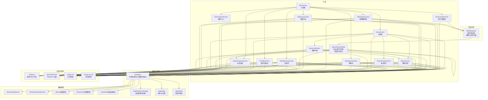

**图表来源**
- [MainScreen.kt:14-82](file://android/app/src/main/kotlin/com/xpx/vault/ui/MainScreen.kt#L14-L82)
- [HomeScreen.kt:81-331](file://android/app/src/main/kotlin/com/xpx/vault/ui/HomeScreen.kt#L81-L331)
- [AlbumScreen.kt:53-295](file://android/app/src/main/kotlin/com/xpx/vault/ui/AlbumScreen.kt#L53-L295)
- [AlbumListScreen.kt:46-162](file://android/app/src/main/kotlin/com/xpx/vault/ui/AlbumListScreen.kt#L46-L162)
- [RecentPhotosScreen.kt:47-146](file://android/app/src/main/kotlin/com/xpx/vault/ui/RecentPhotosScreen.kt#L47-L146)
- [VaultSearchScreen.kt:47-134](file://android/app/src/main/kotlin/com/xpx/vault/ui/VaultSearchScreen.kt#L47-L134)
- [PhotoViewerScreen.kt:43-251](file://android/app/src/main/kotlin/com/xpx/vault/ui/PhotoViewerScreen.kt#L43-L251)
- [VideoPlayerScreen.kt:75-399](file://android/app/src/main/kotlin/com/xpx/vault/ui/VideoPlayerScreen.kt#L75-L399)
- [BulkExportScreen.kt:57-179](file://android/app/src/main/kotlin/com/xpx/vault/ui/BulkExportScreen.kt#L57-179)
- [ExportProgressScreen.kt:35-112](file://android/app/src/main/kotlin/com/xpx/vault/ui/ExportProgressScreen.kt#L35-L112)
- [ExportResultScreen.kt](file://android/app/src/main/kotlin/com/xpx/vault/ui/ExportResultScreen.kt)
- [SettingsHomeScreen.kt:44-228](file://android/app/src/main/kotlin/com/xpx/vault/ui/SettingsHomeScreen.kt#L44-228)
- [TrashBinScreen.kt:35-149](file://android/app/src/main/kotlin/com/xpx/vault/ui/TrashBinScreen.kt#L35-L149)
- [VaultStore.kt:39-253](file://android/app/src/main/kotlin/com/xpx/vault/ui/vault/VaultStore.kt#L39-L253)
- [VaultProgressiveImage.kt:23-90](file://android/app/src/main/kotlin/com/xpx/vault/ui/components/VaultProgressiveImage.kt#L23-L90)
- [AppDialog.kt:22-84](file://android/app/src/main/kotlin/com/xpx/vault/ui/components/AppDialog.kt#L22-L84)
- [AppTopBar.kt:28-65](file://android/app/src/main/kotlin/com/xpx/vault/ui/components/AppTopBar.kt#L28-L65)
- [MediaExporter.kt:27-218](file://android/app/src/main/kotlin/com/xpx/vault/ui/export/MediaExporter.kt#L27-218)
- [ExportRuntimeState.kt:24-155](file://android/app/src/main/kotlin/com/xpx/vault/ui/export/ExportRuntimeState.kt#L24-155)
- [UiTokens.kt:9-185](file://android/app/src/main/kotlin/com/xpx/vault/ui/theme/UiTokens.kt#L9-L185)
- [Theme.kt:1-19](file://android/app/src/main/kotlin/com/xpx/vault/ui/theme/Theme.kt#L1-L19)
- [strings.xml:1-283](file://android/app/src/main/res/values/strings.xml#L1-L283)
- [strings-en.xml:1-240](file://android/app/src/main/res/values-en/strings.xml#L1-L240)
- [AlbumEntity.kt:8-18](file://android/core/data/src/main/kotlin/com/xpx/vault/data/db/entity/AlbumEntity.kt#L8-L18)
- [PhotoAssetEntity.kt:9-32](file://android/core/data/src/main/kotlin/com/xpx/vault/data/db/entity/PhotoAssetEntity.kt#L9-L32)
- [Album.kt:6-12](file://android/core/domain/src/main/kotlin/com/xpx/vault/domain/model/Album.kt#L6-L12)
- [PhotoAsset.kt:6-14](file://android/core/domain/src/main/kotlin/com/xpx/vault/domain/model/PhotoAsset.kt#L6-L14)
- [TrashItem.kt:1-9](file://android/core/domain/src/main/kotlin/com/xpx/vault/domain/model/TrashItem.kt#L1-L9)

**章节来源**
- [MainScreen.kt:14-82](file://android/app/src/main/kotlin/com/xpx/vault/ui/MainScreen.kt#L14-L82)
- [HomeScreen.kt:81-331](file://android/app/src/main/kotlin/com/xpx/vault/ui/HomeScreen.kt#L81-L331)
- [VaultStore.kt:39-253](file://android/app/src/main/kotlin/com/xpx/vault/ui/vault/VaultStore.kt#L39-L253)

## 核心组件
- 主界面 HomeScreen：聚合相册与最近照片展示，支持权限引导、导入提示、底部导航与相册创建对话框。
- 相册详情 AlbumScreen：按网格展示相册内照片，支持从系统相册批量导入到指定相册，**新增完整的多选模式**，支持长按选择、全选功能和底部操作栏。
- 相册列表 AlbumListScreen：展示所有相册封面与数量，支持筛选与跳转。
- 最近照片 RecentPhotosScreen：展示最近导入的照片列表，支持筛选标签。
- 相机入口 CameraHomeScreen：相机页占位，承载私密拍照入口。
- 搜索页 VaultSearchScreen：基于文件名的轻量搜索，展示结果网格。
- 照片查看器 PhotoViewerScreen：全新增强的照片浏览界面，支持左右滑动切换、删除确认、底部操作栏，**新增单个文件导出功能**。
- 视频播放器 VideoPlayerScreen：全新增强的视频播放界面，支持播放控制、底部操作栏，**新增单个文件导出功能**。
- 批量导出 BulkExportScreen：**全新组件**，提供批量导出到系统相册的功能，支持图片和视频的筛选与选择。
- 导出进度 ExportProgressScreen：**全新组件**，显示批量导出的进度和状态，**增强取消支持**，提供完善的取消对话框和返回键处理。
- 导出结果 ExportResultScreen：**全新组件**，展示批量导出的结果和统计信息。
- 设置页 SettingsHomeScreen：**新增批量导出入口**，提供批量导出功能的设置和访问。
- 临时回收站 TrashBinScreen：管理已删除的项目，支持30天过期的临时存储。
- 存储与模型 VaultStore：负责本地文件系统初始化、相册/照片枚举、导入、搜索、删除与回收站管理。
- 渐进式图片组件 VaultProgressiveImage：按需解码缩略图与高质量图，提升首帧与滚动性能。
- 确认对话框 AppDialog：统一的确认对话框组件，支持删除确认等操作。
- 顶部导航栏 AppTopBar：统一的顶部导航组件，提供返回功能。
- 主容器 MainScreen：根据选中标签切换不同子界面，控制透明度与层级。
- XpxVaultTheme：Material3 主题提供者，基于系统深色模式自动切换颜色方案。
- 导出系统：**全新架构**，包括 MediaExporter（媒体导出器，采用零拷贝文件传输机制）、ExportRuntimeState（导出运行时状态，支持并发执行优化）等组件，实现高效的批量导出功能。

**章节来源**
- [HomeScreen.kt:81-331](file://android/app/src/main/kotlin/com/xpx/vault/ui/HomeScreen.kt#L81-L331)
- [AlbumScreen.kt:53-295](file://android/app/src/main/kotlin/com/xpx/vault/ui/AlbumScreen.kt#L53-L295)
- [AlbumListScreen.kt:46-162](file://android/app/src/main/kotlin/com/xpx/vault/ui/AlbumListScreen.kt#L46-L162)
- [RecentPhotosScreen.kt:47-146](file://android/app/src/main/kotlin/com/xpx/vault/ui/RecentPhotosScreen.kt#L47-L146)
- [CameraHomeScreen.kt:25-58](file://android/app/src/main/kotlin/com/xpx/vault/ui/CameraHomeScreen.kt#L25-L58)
- [VaultSearchScreen.kt:47-134](file://android/app/src/main/kotlin/com/xpx/vault/ui/VaultSearchScreen.kt#L47-L134)
- [PhotoViewerScreen.kt:43-251](file://android/app/src/main/kotlin/com/xpx/vault/ui/PhotoViewerScreen.kt#L43-L251)
- [VideoPlayerScreen.kt:75-399](file://android/app/src/main/kotlin/com/xpx/vault/ui/VideoPlayerScreen.kt#L75-L399)
- [BulkExportScreen.kt:57-179](file://android/app/src/main/kotlin/com/xpx/vault/ui/BulkExportScreen.kt#L57-179)
- [ExportProgressScreen.kt:35-112](file://android/app/src/main/kotlin/com/xpx/vault/ui/ExportProgressScreen.kt#L35-L112)
- [ExportResultScreen.kt](file://android/app/src/main/kotlin/com/xpx/vault/ui/ExportResultScreen.kt)
- [SettingsHomeScreen.kt:44-228](file://android/app/src/main/kotlin/com/xpx/vault/ui/SettingsHomeScreen.kt#L44-228)
- [TrashBinScreen.kt:35-149](file://android/app/src/main/kotlin/com/xpx/vault/ui/TrashBinScreen.kt#L35-L149)
- [VaultStore.kt:39-253](file://android/app/src/main/kotlin/com/xpx/vault/ui/vault/VaultStore.kt#L39-L253)
- [VaultProgressiveImage.kt:23-90](file://android/app/src/main/kotlin/com/xpx/vault/ui/components/VaultProgressiveImage.kt#L23-L90)
- [AppDialog.kt:22-84](file://android/app/src/main/kotlin/com/xpx/vault/ui/components/AppDialog.kt#L22-L84)
- [AppTopBar.kt:28-65](file://android/app/src/main/kotlin/com/xpx/vault/ui/components/AppTopBar.kt#L28-L65)
- [MainScreen.kt:14-82](file://android/app/src/main/kotlin/com/xpx/vault/ui/MainScreen.kt#L14-L82)
- [Theme.kt:1-19](file://android/app/src/main/kotlin/com/xpx/vault/ui/theme/Theme.kt#L1-L19)
- [MediaExporter.kt:27-218](file://android/app/src/main/kotlin/com/xpx/vault/ui/export/MediaExporter.kt#L27-218)
- [ExportRuntimeState.kt:24-155](file://android/app/src/main/kotlin/com/xpx/vault/ui/export/ExportRuntimeState.kt#L24-155)

## 架构总览
系统采用 UI 层（Compose）+ 存储层（本地文件系统）+ 资源与主题层的分层设计。UI 层通过 VaultStore 访问本地存储，使用 VaultProgressiveImage 进行图片渲染；VaultSearchScreen 与 HomeScreen 的搜索入口共享同一搜索逻辑。**新增的批量导出系统**通过 MediaExporter、ExportRuntimeState、ExportProgressScreen 等组件实现高效的批量导出功能，**采用零拷贝文件传输机制和并发执行优化**。新增的 PhotoViewerScreen 和 VideoPlayerScreen 提供了完整的照片和视频浏览体验，TrashBinScreen 实现了临时回收站功能。Room 实体与领域模型为后续数据库持久化与扩展预留接口。

**章节来源**
- [HomeScreen.kt:81-331](file://android/app/src/main/kotlin/com/xpx/vault/ui/HomeScreen.kt#L81-L331)
- [VaultStore.kt:39-253](file://android/app/src/main/kotlin/com/xpx/vault/ui/vault/VaultStore.kt#L39-L253)
- [VaultProgressiveImage.kt:23-90](file://android/app/src/main/kotlin/com/xpx/vault/ui/components/VaultProgressiveImage.kt#L23-L90)
- [UiTokens.kt:9-185](file://android/app/src/main/kotlin/com/xpx/vault/ui/theme/UiTokens.kt#L9-L185)
- [Theme.kt:1-19](file://android/app/src/main/kotlin/com/xpx/vault/ui/theme/Theme.kt#L1-L19)
- [strings.xml:1-283](file://android/app/src/main/res/values/strings.xml#L1-L283)
- [strings-en.xml:1-240](file://android/app/src/main/res/values-en/strings.xml#L1-L240)
- [AlbumEntity.kt:8-18](file://android/core/data/src/main/kotlin/com/xpx/vault/data/db/entity/AlbumEntity.kt#L8-L18)
- [PhotoAssetEntity.kt:9-32](file://android/core/data/src/main/kotlin/com/xpx/vault/data/db/entity/PhotoAssetEntity.kt#L9-L32)
- [Album.kt:6-12](file://android/core/domain/src/main/kotlin/com/xpx/vault/domain/model/Album.kt#L6-L12)
- [PhotoAsset.kt:6-14](file://android/core/domain/src/main/kotlin/com/xpx/vault/domain/model/PhotoAsset.kt#L6-L14)
- [TrashItem.kt:1-9](file://android/core/domain/src/main/kotlin/com/xpx/vault/domain/model/TrashItem.kt#L1-L9)
- [MediaExporter.kt:27-218](file://android/app/src/main/kotlin/com/xpx/vault/ui/export/MediaExporter.kt#L27-218)
- [ExportRuntimeState.kt:24-155](file://android/app/src/main/kotlin/com/xpx/vault/ui/export/ExportRuntimeState.kt#L24-155)

## 详细组件分析

### 主界面 HomeScreen 分析
- 布局与导航：顶部标题与统计信息、搜索与添加按钮、底部导航栏；根据生命周期事件在 onResume 时刷新快照。
- 权限与导入：检测相册读取权限，引导授权或跳转系统设置；支持从系统相册批量选择并导入至默认相册，导入后刷新快照并展示导入提示。
- 内容展示：相册横向滚动卡片区与最近照片网格区；空态时提供导入与拍照入口。
- 相册创建：弹窗输入相册名，调用 VaultStore.createAlbum 并自动打开新相册。
- 底部导航重构：HomeBottomNav 提供了更直观的导航体验，支持图标与文字标签的组合显示。

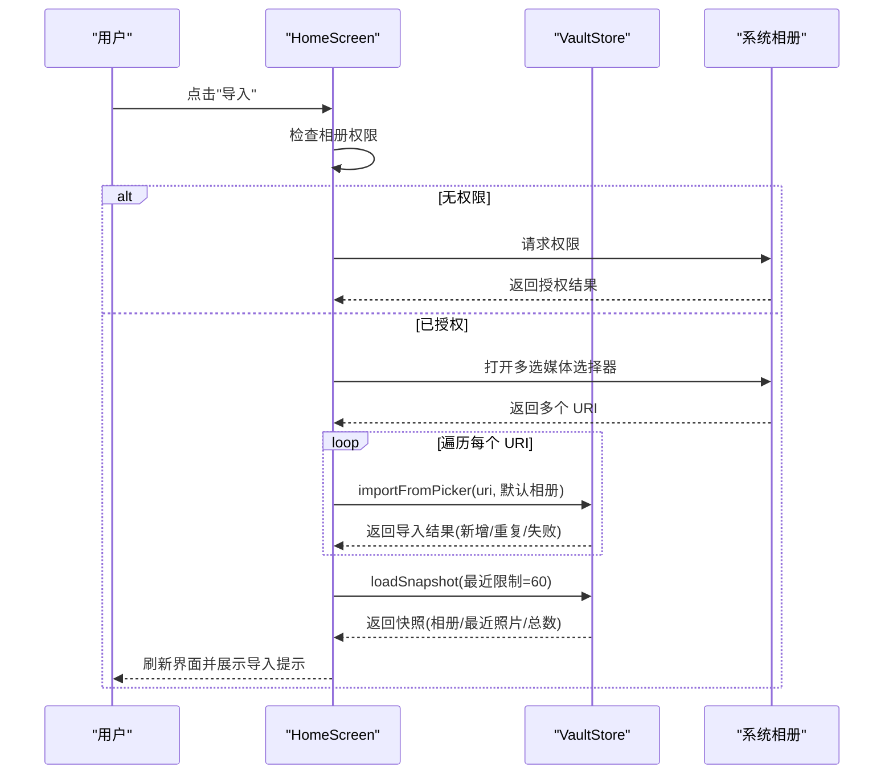

**图表来源**
- [HomeScreen.kt:114-165](file://android/app/src/main/kotlin/com/xpx/vault/ui/HomeScreen.kt#L114-L165)
- [VaultStore.kt:120-154](file://android/app/src/main/kotlin/com/xpx/vault/ui/vault/VaultStore.kt#L120-L154)

**章节来源**
- [HomeScreen.kt:81-331](file://android/app/src/main/kotlin/com/xpx/vault/ui/HomeScreen.kt#L81-L331)
- [VaultStore.kt:39-84](file://android/app/src/main/kotlin/com/xpx/vault/ui/vault/VaultStore.kt#L39-L84)
- [HomeScreen.kt:785-896](file://android/app/src/main/kotlin/com/xpx/vault/ui/HomeScreen.kt#L785-L896)

### 相册详情 AlbumScreen 分析
- 加载策略：首次加载与 onResume 时刷新；支持从系统相册向指定相册批量导入。
- 空态与列表：空相册时提供导入入口；非空时以 3 列网格展示照片，支持点击进入查看器。
- 缓存与排序：按相册内文件最后修改时间降序排列；缓存相册照片列表。
- **新增多选模式**：支持长按选择单个照片，点击进入选择模式；提供全选/取消全选功能；底部显示操作栏，包含分享、导出到相册、删除等操作。

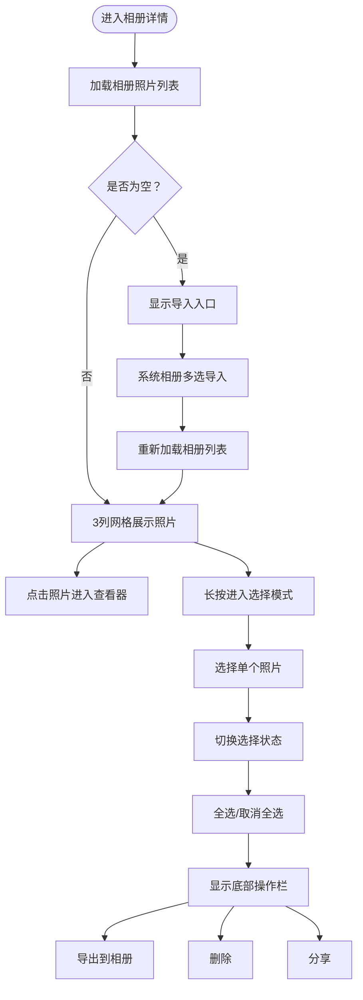

**图表来源**
- [AlbumScreen.kt:53-295](file://android/app/src/main/kotlin/com/xpx/vault/ui/AlbumScreen.kt#L53-L295)
- [VaultStore.kt:86-107](file://android/app/src/main/kotlin/com/xpx/vault/ui/vault/VaultStore.kt#L86-L107)

**章节来源**
- [AlbumScreen.kt:53-295](file://android/app/src/main/kotlin/com/xpx/vault/ui/AlbumScreen.kt#L53-L295)
- [VaultStore.kt:86-107](file://android/app/src/main/kotlin/com/xpx/vault/ui/vault/VaultStore.kt#L86-L107)

### 相册列表 AlbumListScreen 分析
- 展示：按名称排序（默认相册优先），显示封面与照片数量。
- 筛选：提供"最近创建/名称排序"标签，当前默认选中"最近创建"。

**章节来源**
- [AlbumListScreen.kt:46-162](file://android/app/src/main/kotlin/com/xpx/vault/ui/AlbumListScreen.kt#L46-L162)
- [VaultStore.kt:186-203](file://android/app/src/main/kotlin/com/xpx/vault/ui/vault/VaultStore.kt#L186-L203)

### 最近照片 RecentPhotosScreen 分析
- 展示：3 列网格展示最近导入照片，支持筛选标签（拍摄日期/按相册）。
- 加载：首次加载与 onResume 时刷新最近照片列表。

**章节来源**
- [RecentPhotosScreen.kt:47-146](file://android/app/src/main/kotlin/com/xpx/vault/ui/RecentPhotosScreen.kt#L47-L146)
- [VaultStore.kt:81-84](file://android/app/src/main/kotlin/com/xpx/vault/ui/vault/VaultStore.kt#L81-L84)

### 相机入口 CameraHomeScreen 分析
- 占位：当前为纯文本占位，后续接入私密拍照流程。

**章节来源**
- [CameraHomeScreen.kt:25-58](file://android/app/src/main/kotlin/com/xpx/vault/ui/CameraHomeScreen.kt#L25-L58)

### 搜索页 VaultSearchScreen 分析
- 输入：顶部输入框，输入即触发搜索。
- 结果：3 列网格展示搜索结果，点击进入查看器。
- 逻辑：调用 VaultStore.searchPhotos(context, query)，按文件名模糊匹配并按修改时间倒序。

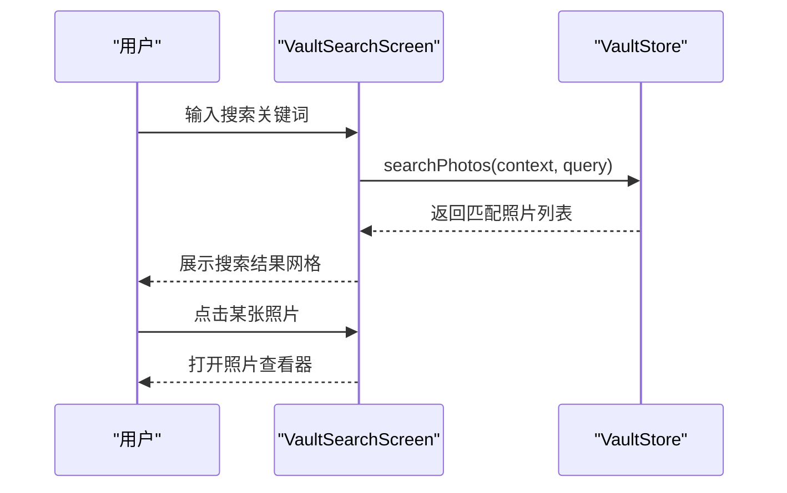

**图表来源**
- [VaultSearchScreen.kt:47-134](file://android/app/src/main/kotlin/com/xpx/vault/ui/VaultSearchScreen.kt#L47-L134)
- [VaultStore.kt:109-113](file://android/app/src/main/kotlin/com/xpx/vault/ui/vault/VaultStore.kt#L109-L113)

**章节来源**
- [VaultSearchScreen.kt:47-134](file://android/app/src/main/kotlin/com/xpx/vault/ui/VaultSearchScreen.kt#L47-L134)
- [VaultStore.kt:109-113](file://android/app/src/main/kotlin/com/xpx/vault/ui/vault/VaultStore.kt#L109-L113)

### 照片查看器 PhotoViewerScreen 分析
- 增强的浏览体验：支持左右滑动切换照片，提供流畅的浏览体验。
- 删除确认系统：点击删除按钮弹出确认对话框，防止误删。
- 底部操作栏：提供分享、编辑、信息、删除等操作按钮。
- **新增单个文件导出功能**：集成 MediaExporter，支持将单个照片导出到系统相册。
- 回收站集成：删除的照片进入临时回收站，支持30天过期。
- 图片加载优化：使用渐进式图片加载，提升大图浏览性能。

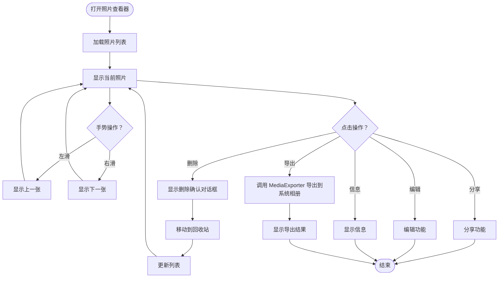

**图表来源**
- [PhotoViewerScreen.kt:43-251](file://android/app/src/main/kotlin/com/xpx/vault/ui/PhotoViewerScreen.kt#L43-L251)
- [AppDialog.kt:22-84](file://android/app/src/main/kotlin/com/xpx/vault/ui/components/AppDialog.kt#L22-L84)
- [VaultStore.kt:170-178](file://android/app/src/main/kotlin/com/xpx/vault/ui/vault/VaultStore.kt#L170-L178)
- [MediaExporter.kt:38-52](file://android/app/src/main/kotlin/com/xpx/vault/ui/export/MediaExporter.kt#L38-52)

**章节来源**
- [PhotoViewerScreen.kt:43-251](file://android/app/src/main/kotlin/com/xpx/vault/ui/PhotoViewerScreen.kt#L43-L251)
- [AppDialog.kt:22-84](file://android/app/src/main/kotlin/com/xpx/vault/ui/components/AppDialog.kt#L22-L84)
- [VaultStore.kt:170-178](file://android/app/src/main/kotlin/com/xpx/vault/ui/vault/VaultStore.kt#L170-L178)
- [MediaExporter.kt:38-52](file://android/app/src/main/kotlin/com/xpx/vault/ui/export/MediaExporter.kt#L38-52)

### 视频播放器 VideoPlayerScreen 分析
- 增强的播放体验：支持播放控制、进度条、音量控制、双击快进/快退等操作。
- 删除确认系统：点击删除按钮弹出确认对话框，防止误删。
- 底部操作栏：提供分享、编辑、信息、删除等操作按钮。
- **新增单个文件导出功能**：集成 MediaExporter，支持将单个视频导出到系统相册。
- 回收站集成：删除的视频进入临时回收站，支持30天过期。
- 播放器优化：使用 ExoPlayer 实现高性能视频播放，支持多种格式。

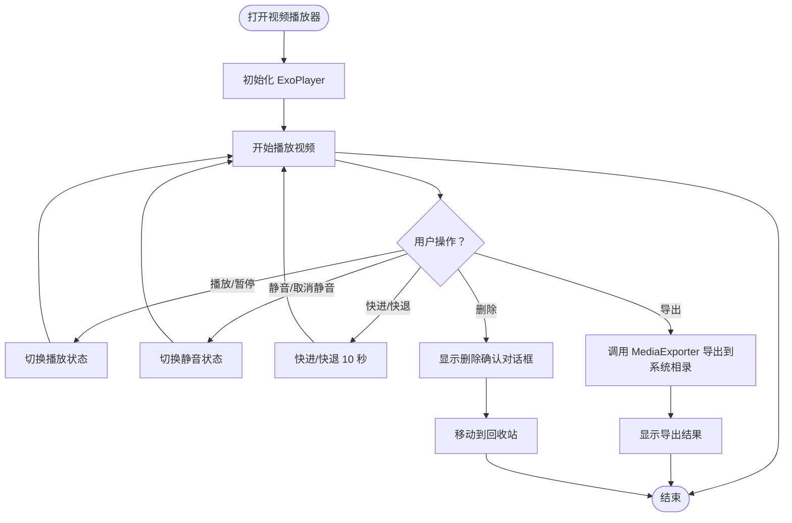

**图表来源**
- [VideoPlayerScreen.kt:75-399](file://android/app/src/main/kotlin/com/xpx/vault/ui/VideoPlayerScreen.kt#L75-L399)
- [AppDialog.kt:22-84](file://android/app/src/main/kotlin/com/xpx/vault/ui/components/AppDialog.kt#L22-L84)
- [VaultStore.kt:170-178](file://android/app/src/main/kotlin/com/xpx/vault/ui/vault/VaultStore.kt#L170-L178)
- [MediaExporter.kt:38-52](file://android/app/src/main/kotlin/com/xpx/vault/ui/export/MediaExporter.kt#L38-52)

**章节来源**
- [VideoPlayerScreen.kt:75-399](file://android/app/src/main/kotlin/com/xpx/vault/ui/VideoPlayerScreen.kt#L75-L399)
- [AppDialog.kt:22-84](file://android/app/src/main/kotlin/com/xpx/vault/ui/components/AppDialog.kt#L22-L84)
- [VaultStore.kt:170-178](file://android/app/src/main/kotlin/com/xpx/vault/ui/vault/VaultStore.kt#L170-L178)
- [MediaExporter.kt:38-52](file://android/app/src/main/kotlin/com/xpx/vault/ui/export/MediaExporter.kt#L38-52)

### 批量导出 BulkExportScreen 分析
- **全新组件**：提供批量导出到系统相册的功能。
- 界面设计：顶部显示标题和选择状态，中间为筛选器（全部/图片/视频），底部为导出按钮。
- 选择功能：支持全选/取消全选，点击网格项进行选择。
- 筛选功能：支持按类型筛选图片和视频。
- 导出流程：选择完成后点击导出按钮，将路径队列加入 ExportRuntimeState，然后跳转到导出进度页面。

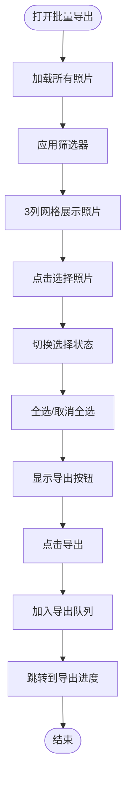

**图表来源**
- [BulkExportScreen.kt:57-179](file://android/app/src/main/kotlin/com/xpx/vault/ui/BulkExportScreen.kt#L57-179)

**章节来源**
- [BulkExportScreen.kt:57-179](file://android/app/src/main/kotlin/com/xpx/vault/ui/BulkExportScreen.kt#L57-179)

### 导出进度 ExportProgressScreen 分析
- **全新组件**：显示批量导出的进度和状态。
- 进度显示：显示当前完成数量、总数量和当前导出的文件名。
- 自动执行：启动时自动执行导出任务，完成后跳转到结果页面。
- 状态管理：通过 ExportRuntimeState 获取进度状态。
- **增强取消支持**：拦截系统返回键，弹出确认对话框，支持取消正在进行的导出任务。

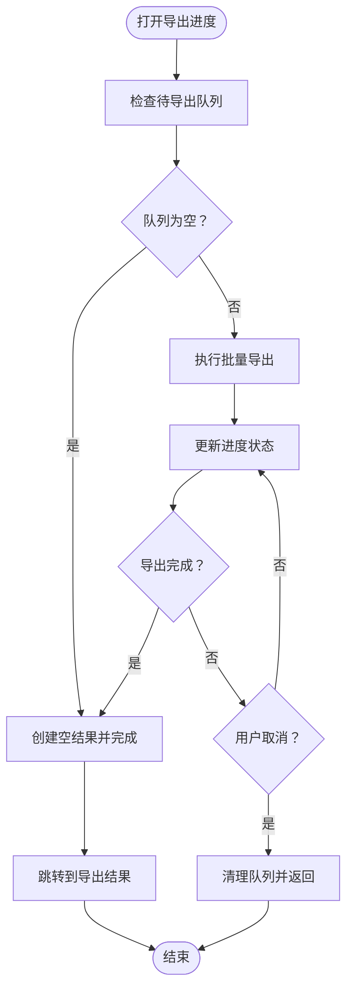

**图表来源**
- [ExportProgressScreen.kt:35-112](file://android/app/src/main/kotlin/com/xpx/vault/ui/ExportProgressScreen.kt#L35-L112)

**章节来源**
- [ExportProgressScreen.kt:35-112](file://android/app/src/main/kotlin/com/xpx/vault/ui/ExportProgressScreen.kt#L35-L112)

### 导出结果 ExportResultScreen 分析
- **全新组件**：展示批量导出的结果和统计信息。
- 结果展示：显示成功数量、失败数量和详细列表。
- 操作功能：提供打开系统相册、重新导出等操作。
- 统计信息：显示导出统计和失败原因。

**章节来源**
- [ExportResultScreen.kt](file://android/app/src/main/kotlin/com/xpx/vault/ui/ExportResultScreen.kt)

### 设置页 SettingsHomeScreen 分析
- **新增批量导出入口**：在设置页面新增"批量导出到相册"功能入口。
- 页面结构：包含安全设置、备份策略、通用设置、关于等分组。
- 导航功能：点击批量导出项跳转到批量导出页面。
- 其他设置：包含生物识别、自动锁定、自动备份、存储管理、备份恢复、临时垃圾桶、升级 Premium 等设置项。

**章节来源**
- [SettingsHomeScreen.kt:44-228](file://android/app/src/main/kotlin/com/xpx/vault/ui/SettingsHomeScreen.kt#L44-228)

### 临时回收站 TrashBinScreen 分析
- 回收站管理：展示已删除的项目，支持30天过期的临时存储。
- 操作功能：提供恢复和彻底删除两种操作。
- 界面设计：采用卡片式布局，清晰展示文件名、大小和剩余时间。
- 回收站模型：TrashItem 数据模型定义了回收站条目的结构。

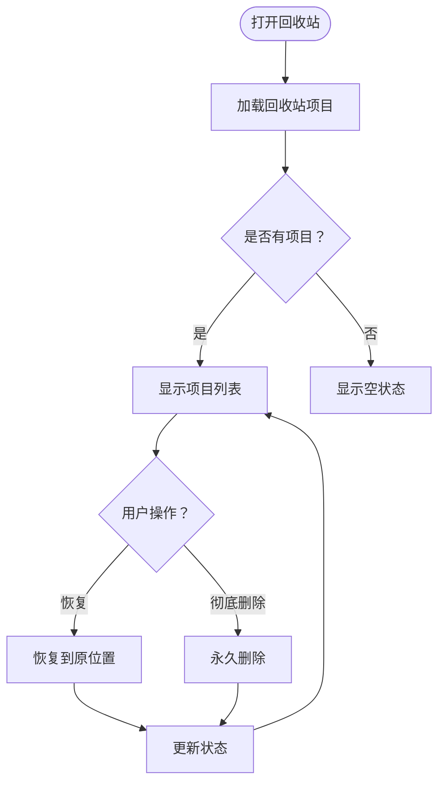

**图表来源**
- [TrashBinScreen.kt:35-149](file://android/app/src/main/kotlin/com/xpx/vault/ui/TrashBinScreen.kt#L35-L149)
- [TrashItem.kt:1-9](file://android/core/domain/src/main/kotlin/com/xpx/vault/domain/model/TrashItem.kt#L1-L9)

**章节来源**
- [TrashBinScreen.kt:35-149](file://android/app/src/main/kotlin/com/xpx/vault/ui/TrashBinScreen.kt#L35-L149)
- [TrashItem.kt:1-9](file://android/core/domain/src/main/kotlin/com/xpx/vault/domain/model/TrashItem.kt#L1-L9)

### 存储与模型 VaultStore 分析
- 初始化：确保根目录与默认相册存在，必要时迁移旧目录。
- 快照：聚合相册列表、最近照片与总数，缓存于内存。
- 导入：基于 SHA-256 去重，写入带哈希命名的最终文件，支持重复跳过与失败处理。
- 列表：按修改时间倒序列出相册与照片；支持搜索与总数统计。
- 缓存：快照与相册照片列表缓存，减少 IO 与重复计算。
- 删除：新增删除功能，将文件移动到临时回收站目录，支持30天过期。

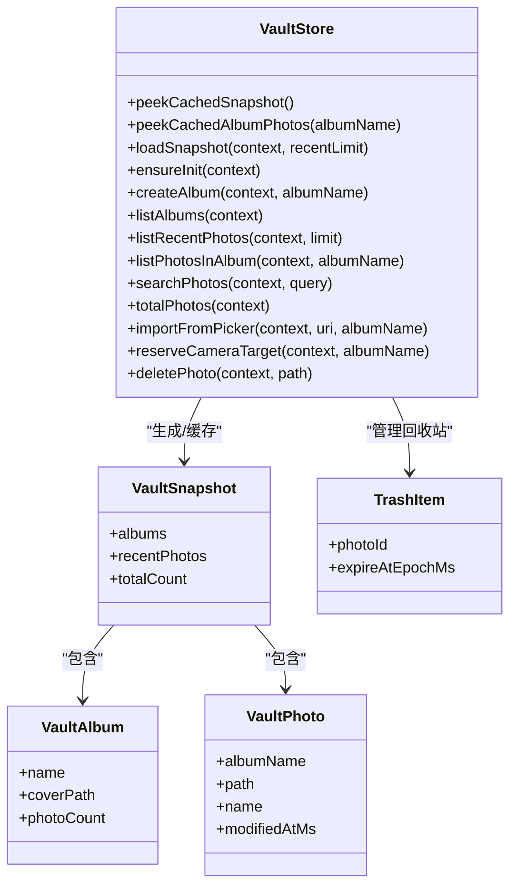

**图表来源**
- [VaultStore.kt:39-253](file://android/app/src/main/kotlin/com/xpx/vault/ui/vault/VaultStore.kt#L39-L253)
- [VaultProgressiveImage.kt:23-90](file://android/app/src/main/kotlin/com/xpx/vault/ui/components/VaultProgressiveImage.kt#L23-L90)
- [TrashItem.kt:1-9](file://android/core/domain/src/main/kotlin/com/xpx/vault/domain/model/TrashItem.kt#L1-L9)

**章节来源**
- [VaultStore.kt:39-253](file://android/app/src/main/kotlin/com/xpx/vault/ui/vault/VaultStore.kt#L39-L253)

### 图片加载组件 VaultProgressiveImage 分析
- 渐进式策略：先解码采样后的缩略图，再按需解码高质量图，降低内存峰值与首帧延迟。
- 参数化：支持目标最大边长、是否加载高质量图与高质量最大边长。
- 容错：解码失败时回退到背景色，保证 UI 稳定。

**图表来源**
- [VaultProgressiveImage.kt:23-90](file://android/app/src/main/kotlin/com/xpx/vault/ui/components/VaultProgressiveImage.kt#L23-L90)

**章节来源**
- [VaultProgressiveImage.kt:23-90](file://android/app/src/main/kotlin/com/xpx/vault/ui/components/VaultProgressiveImage.kt#L23-L90)

### 确认对话框 AppDialog 分析
- 统一样式：提供一致的确认对话框样式，支持标题、消息、确认和取消按钮。
- 变体支持：支持主要、次要、危险等不同变体，用于不同的操作类型。
- 事件处理：提供回调函数处理确认和取消操作。

**章节来源**
- [AppDialog.kt:22-84](file://android/app/src/main/kotlin/com/xpx/vault/ui/components/AppDialog.kt#L22-L84)

### 顶部导航栏 AppTopBar 分析
- 标准化：提供统一的顶部导航栏，包含返回按钮和标题。
- 交互反馈：支持点击反馈效果，提升用户体验。
- 样式统一：与整体主题风格保持一致。

**章节来源**
- [AppTopBar.kt:28-65](file://android/app/src/main/kotlin/com/xpx/vault/ui/components/AppTopBar.kt#L28-L65)

### 主题系统分析
- XpxVaultTheme：Material3 主题提供者，根据系统深色模式自动选择颜色方案。
- UiTokens：统一管理颜色、圆角、尺寸与字体大小，确保视觉一致性。
- MainActivity：应用入口，使用 XpxVaultTheme 包装整个应用界面。
- 国际化支持：strings.xml 和 values-en/strings.xml 提供中英文双语支持。

**章节来源**
- [Theme.kt:1-19](file://android/app/src/main/kotlin/com/xpx/vault/ui/theme/Theme.kt#L1-L19)
- [UiTokens.kt:9-185](file://android/app/src/main/kotlin/com/xpx/vault/ui/theme/UiTokens.kt#L9-L185)
- [MainActivity.kt:56-61](file://android/app/src/main/kotlin/com/xpx/vault/MainActivity.kt#L56-L61)
- [strings.xml:1-283](file://android/app/src/main/res/values/strings.xml#L1-L283)
- [strings-en.xml:1-240](file://android/app/src/main/res/values-en/strings.xml#L1-L240)

### 导出系统架构分析
- **全新架构**：MediaExporter 提供媒体文件导出功能，支持图片和视频导出到系统相册。
- **零拷贝文件传输机制**：采用 FileChannel.transferTo 实现内核级零拷贝传输，避免用户态-内核态双向拷贝，显著提升大文件传输性能。
- **并发处理优化**：ExportRuntimeState 支持并发导出，最大并发度为3，避免过度占用系统资源；支持取消和进度节流更新。
- **空间预检机制**：导出前检查磁盘空间，避免写入过程中磁盘空间不足导致的失败。
- **IS_PENDING事务写入**：Android 10+ 使用 MediaStore 的事务机制，通过 IS_PENDING 标志实现原子性写入。
- **进度管理**：通过状态变量实时更新导出进度，支持节流更新以避免频繁重组。
- **兼容性处理**：根据 Android 版本选择不同的导出策略，Android 10+ 使用 MediaStore，Android 9 及以下使用传统方式。
- **错误处理**：提供详细的错误信息和回退机制，确保导出过程的稳定性。
- **取消支持增强**：ExportProgressScreen 提供完善的取消对话框和返回键处理，支持取消正在进行的导出任务。

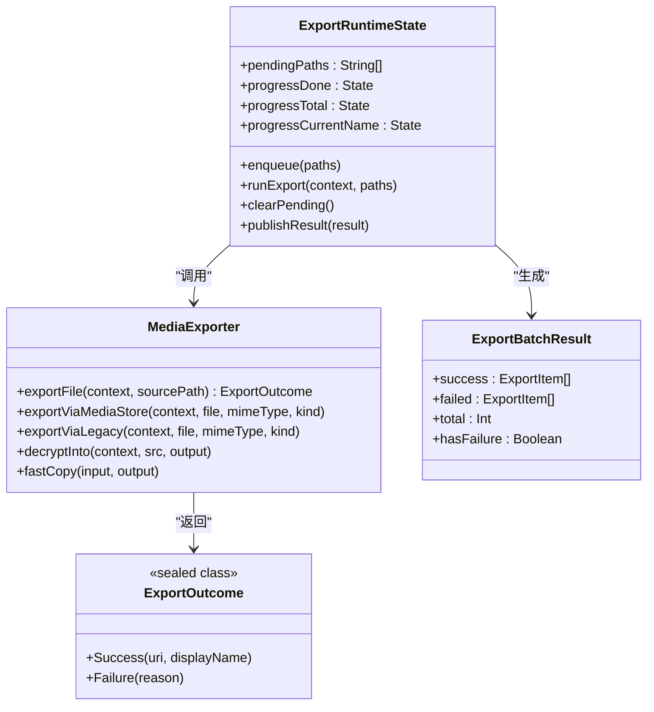

**图表来源**
- [MediaExporter.kt:27-218](file://android/app/src/main/kotlin/com/xpx/vault/ui/export/MediaExporter.kt#L27-218)
- [ExportRuntimeState.kt:24-155](file://android/app/src/main/kotlin/com/xpx/vault/ui/export/ExportRuntimeState.kt#L24-155)

**章节来源**
- [MediaExporter.kt:27-218](file://android/app/src/main/kotlin/com/xpx/vault/ui/export/MediaExporter.kt#L27-218)
- [ExportRuntimeState.kt:24-155](file://android/app/src/main/kotlin/com/xpx/vault/ui/export/ExportRuntimeState.kt#L24-155)

## 依赖关系分析
- UI 与存储：HomeScreen、AlbumScreen、RecentPhotosScreen、VaultSearchScreen、PhotoViewerScreen、VideoPlayerScreen 均依赖 VaultStore 进行数据访问；AlbumListScreen 依赖 VaultStore.listAlbums。
- 图片渲染：各网格列表通过 VaultProgressiveImage 渲染缩略图，提升滚动性能。
- 主容器：MainScreen 根据选中标签切换不同子界面，控制透明度与层级，避免重复重建。
- 主题系统：XpxVaultTheme 提供 Material3 主题支持，UiTokens 提供统一的视觉令牌。
- 资源与主题：UiTokens 提供统一的颜色、圆角、尺寸与字号；strings.xml 和 values-en/strings.xml 提供中英文文案资源。
- 数据模型：Room 实体与领域模型为后续数据库持久化与扩展预留接口。
- 新增组件：PhotoViewerScreen、VideoPlayerScreen 依赖 AppDialog 和 AppTopBar；TrashBinScreen 依赖 AppButton 和 AppTopBar。
- **导出系统**：PhotoViewerScreen、VideoPlayerScreen、BulkExportScreen 依赖 MediaExporter；所有导出功能依赖 ExportRuntimeState 进行状态管理。

**章节来源**
- [MainScreen.kt:14-82](file://android/app/src/main/kotlin/com/xpx/vault/ui/MainScreen.kt#L14-L82)
- [VaultStore.kt:39-253](file://android/app/src/main/kotlin/com/xpx/vault/ui/vault/VaultStore.kt#L39-L253)
- [PhotoViewerScreen.kt:43-251](file://android/app/src/main/kotlin/com/xpx/vault/ui/PhotoViewerScreen.kt#L43-L251)
- [VideoPlayerScreen.kt:75-399](file://android/app/src/main/kotlin/com/xpx/vault/ui/VideoPlayerScreen.kt#L75-L399)
- [TrashBinScreen.kt:35-149](file://android/app/src/main/kotlin/com/xpx/vault/ui/TrashBinScreen.kt#L35-L149)
- [VaultProgressiveImage.kt:23-90](file://android/app/src/main/kotlin/com/xpx/vault/ui/components/VaultProgressiveImage.kt#L23-L90)
- [AppDialog.kt:22-84](file://android/app/src/main/kotlin/com/xpx/vault/ui/components/AppDialog.kt#L22-L84)
- [AppTopBar.kt:28-65](file://android/app/src/main/kotlin/com/xpx/vault/ui/components/AppTopBar.kt#L28-L65)
- [UiTokens.kt:9-185](file://android/app/src/main/kotlin/com/xpx/vault/ui/theme/UiTokens.kt#L9-L185)
- [Theme.kt:1-19](file://android/app/src/main/kotlin/com/xpx/vault/ui/theme/Theme.kt#L1-L19)
- [strings.xml:1-283](file://android/app/src/main/res/values/strings.xml#L1-L283)
- [strings-en.xml:1-240](file://android/app/src/main/res/values-en/strings.xml#L1-L240)
- [AlbumEntity.kt:8-18](file://android/core/data/src/main/kotlin/com/xpx/vault/data/db/entity/AlbumEntity.kt#L8-L18)
- [PhotoAssetEntity.kt:9-32](file://android/core/data/src/main/kotlin/com/xpx/vault/data/db/entity/PhotoAssetEntity.kt#L9-L32)
- [Album.kt:6-12](file://android/core/domain/src/main/kotlin/com/xpx/vault/domain/model/Album.kt#L6-L12)
- [PhotoAsset.kt:6-14](file://android/core/domain/src/main/kotlin/com/xpx/vault/domain/model/PhotoAsset.kt#L6-L14)
- [TrashItem.kt:1-9](file://android/core/domain/src/main/kotlin/com/xpx/vault/domain/model/TrashItem.kt#L1-L9)
- [MediaExporter.kt:27-218](file://android/app/src/main/kotlin/com/xpx/vault/ui/export/MediaExporter.kt#L27-218)
- [ExportRuntimeState.kt:24-155](file://android/app/src/main/kotlin/com/xpx/vault/ui/export/ExportRuntimeState.kt#L24-155)

## 性能考量
- 图片加载优化
  - 使用渐进式解码：先显示低分辨率缩略图，再按需加载高质量图，显著降低首帧延迟与内存峰值。
  - 目标尺寸控制：通过 thumbnailMaxPx 与高分辨率参数控制解码质量，平衡清晰度与性能。
- 列表渲染优化
  - 使用 LazyColumn/LazyVerticalGrid 与固定列数，减少不必要的重组与绘制。
  - 采用键值 key 以稳定列表项状态，避免不必要的重绘。
- 数据访问优化
  - 快照与相册照片列表缓存：避免频繁 IO 与重复计算，提高响应速度。
  - 按需加载：仅在可见区域解码图片，隐藏项不进行解码。
- 导入与去重
  - 导入前进行 SHA-256 哈希计算与文件存在性检查，避免重复写入与磁盘浪费。
- 生命周期感知
  - 在 ON_RESUME 时刷新数据，确保前台可见时数据新鲜度。
- **新增功能优化**
  - **批量导出优化**：使用并发导出（最大3个并发），避免阻塞主线程；支持进度节流更新，减少重组频率。
  - **零拷贝文件传输**：MediaExporter 采用 FileChannel.transferTo 实现内核级零拷贝传输，避免用户态-内核态双向拷贝，显著提升大文件传输性能。
  - **空间预检机制**：导出前检查磁盘空间，避免写入过程中磁盘空间不足导致的失败。
  - **IS_PENDING事务写入**：Android 10+ 使用 MediaStore 的事务机制，通过 IS_PENDING 标志实现原子性写入，提升导出可靠性。
  - **导出系统优化**：根据 Android 版本选择最优导出策略，Android 10+ 使用 MediaStore 的零拷贝传输，Android 9 及以下使用传统方式。
  - **相册多选优化**：使用集合操作进行选择状态管理，避免不必要的重组。
  - **照片查看器优化**：使用记忆化状态管理，避免重复加载相同照片。
  - **视频播放器优化**：使用 ExoPlayer 实现高性能播放，支持多种格式和硬件加速。
  - **取消支持优化**：ExportProgressScreen 提供完善的取消对话框和返回键处理，支持取消正在进行的导出任务。

## 故障排查指南
- 权限问题
  - 现象：主界面显示权限引导或空态。
  - 排查：确认 READ_MEDIA_IMAGES/READ_MEDIA_VIDEO 或 READ_EXTERNAL_STORAGE 权限状态；若被永久拒绝，引导用户前往系统设置开启。
- 导入失败
  - 现象：导入提示显示失败或重复。
  - 排查：检查系统相册 URI 可读性、磁盘空间、文件是否损坏；重复导入会被跳过。
- 网格空白
  - 现象：网格显示背景色或空白。
  - 排查：检查文件路径有效性、解码异常；组件会回退到背景色以保证 UI 稳定。
- 相册排序与筛选
  - 现象：相册顺序不符合预期。
  - 排查：默认相册优先，其余按名称大小写排序；筛选标签当前为占位，实际逻辑以代码为准。
- 主题显示问题
  - 现象：界面颜色不正确或主题不生效。
  - 排查：确认使用 XpxVaultTheme 包装应用界面，检查 UiTokens 中的颜色定义。
- 删除功能问题
  - 现象：删除后无法恢复或回收站为空。
  - 排查：确认删除操作是否成功执行，检查回收站目录是否存在，验证30天过期逻辑。
- 国际化问题
  - 现象：界面显示乱码或语言切换无效。
  - 排查：确认 strings.xml 和 values-en/strings.xml 文件完整性，检查资源文件编码。
- **新增功能故障排查**
  - **批量导出问题**：检查导出队列是否正确加入，确认 ExportRuntimeState 状态是否正常更新；验证 MediaStore 权限。
  - **零拷贝传输问题**：检查 FileChannel 是否可用，验证 transferTo 方法是否正常工作；确认文件系统支持零拷贝。
  - **并发导出问题**：检查并发度设置，确认 Semaphore 是否正确释放；验证进度节流机制。
  - **空间预检问题**：检查磁盘空间检查逻辑，确认 StatFs 调用是否成功；验证空间计算准确性。
  - **IS_PENDING事务问题**：检查 Android 版本判断，确认 MediaStore 事务写入是否成功；验证 IS_PENDING 标志设置。
  - **相册多选问题**：检查选择状态是否正确保存，确认全选/取消全选逻辑；验证底部操作栏显示。
  - **单个文件导出问题**：检查 MediaExporter 的返回结果，确认文件路径有效；验证系统相册权限。
  - **导出进度问题**：检查 ExportRuntimeState 的进度状态，确认并发导出是否正常工作；验证进度节流机制。
  - **取消支持问题**：检查 ExportProgressScreen 的取消对话框，确认返回键处理逻辑；验证导出任务取消机制。

**章节来源**
- [HomeScreen.kt:779-800](file://android/app/src/main/kotlin/com/xpx/vault/ui/HomeScreen.kt#L779-L800)
- [VaultStore.kt:120-154](file://android/app/src/main/kotlin/com/xpx/vault/ui/vault/VaultStore.kt#L120-L154)
- [VaultProgressiveImage.kt:23-90](file://android/app/src/main/kotlin/com/xpx/vault/ui/components/VaultProgressiveImage.kt#L23-L90)
- [AlbumListScreen.kt:164-183](file://android/app/src/main/kotlin/com/xpx/vault/ui/AlbumListScreen.kt#L164-L183)
- [Theme.kt:1-19](file://android/app/src/main/kotlin/com/xpx/vault/ui/theme/Theme.kt#L1-L19)
- [PhotoViewerScreen.kt:93-115](file://android/app/src/main/kotlin/com/xpx/vault/ui/PhotoViewerScreen.kt#L93-L115)
- [VaultStore.kt:170-178](file://android/app/src/main/kotlin/com/xpx/vault/ui/vault/VaultStore.kt#L170-L178)
- [MediaExporter.kt:38-52](file://android/app/src/main/kotlin/com/xpx/vault/ui/export/MediaExporter.kt#L38-52)
- [ExportRuntimeState.kt:68-128](file://android/app/src/main/kotlin/com/xpx/vault/ui/export/ExportRuntimeState.kt#L68-128)

## 结论
本系统以 Compose 为核心构建 UI，结合 VaultStore 的本地文件系统存储与 VaultProgressiveImage 的渐进式图片加载，实现了高效、稳定的相册浏览与照片管理体验。**最新更新**大幅增强了系统的导出能力，新增批量导出功能支持多张图片和视频的高效导出，相册详情页的完整多选模式提升了用户操作效率，单个文件导出功能为用户提供了便捷的导出选项。**重大架构改进**包括导出系统采用MediaExporter零拷贝文件传输机制、ExportRuntimeState并发执行优化、ExportProgressScreen取消支持增强等，显著提升了导出性能和用户体验。通过快照与列表缓存、按需加载与生命周期感知，系统在性能与交互上取得良好平衡。新增的照片查看器功能大幅提升了用户体验，临时回收站提供了更安全的数据管理方式。底部导航栏重构和国际化支持进一步完善了产品的可用性和可访问性。主题系统采用 Material3 设计规范，提供深色/浅色自动适配。导出系统采用并发处理和状态管理，确保批量导出的稳定性和性能。未来可在 Room 数据库、AI 智能分类与检索、更丰富的筛选与排序选项、导出结果的详细统计等方面持续演进。

## 附录

### 具体实现示例（代码片段路径）
- 相册创建与跳转
  - [HomeScreen.kt:315-322](file://android/app/src/main/kotlin/com/xpx/vault/ui/HomeScreen.kt#L315-L322)
- 从系统相册导入到默认相册
  - [HomeScreen.kt:142-148](file://android/app/src/main/kotlin/com/xpx/vault/ui/HomeScreen.kt#L142-L148)
- 从系统相册导入到指定相册
  - [AlbumScreen.kt:122-133](file://android/app/src/main/kotlin/com/xpx/vault/ui/AlbumScreen.kt#L122-L133)
- 搜索功能
  - [VaultSearchScreen.kt:58-59](file://android/app/src/main/kotlin/com/xpx/vault/ui/VaultSearchScreen.kt#L58-L59)
  - [VaultStore.kt:109-113](file://android/app/src/main/kotlin/com/xpx/vault/ui/vault/VaultStore.kt#L109-L113)
- 相册排序与封面
  - [VaultStore.kt:186-203](file://android/app/src/main/kotlin/com/xpx/vault/ui/vault/VaultStore.kt#L186-L203)
- 照片查看器删除确认
  - [PhotoViewerScreen.kt:116-131](file://android/app/src/main/kotlin/com/xpx/vault/ui/PhotoViewerScreen.kt#L116-L131)
- **相册多选模式**
  - [AlbumScreen.kt:85-108](file://android/app/src/main/kotlin/com/xpx/vault/ui/AlbumScreen.kt#L85-L108)
  - [AlbumScreen.kt:253-292](file://android/app/src/main/kotlin/com/xpx/vault/ui/AlbumScreen.kt#L253-L292)
- **单个文件导出（照片查看器）**
  - [PhotoViewerScreen.kt:224-236](file://android/app/src/main/kotlin/com/xpx/vault/ui/PhotoViewerScreen.kt#L224-L236)
- **单个文件导出（视频播放器）**
  - [VideoPlayerScreen.kt:357-368](file://android/app/src/main/kotlin/com/xpx/vault/ui/VideoPlayerScreen.kt#L357-L368)
- **批量导出功能**
  - [BulkExportScreen.kt:169-177](file://android/app/src/main/kotlin/com/xpx/vault/ui/BulkExportScreen.kt#L169-L177)
  - [ExportProgressScreen.kt:56-60](file://android/app/src/main/kotlin/com/xpx/vault/ui/ExportProgressScreen.kt#L56-L60)
- **设置页面批量导出入口**
  - [SettingsHomeScreen.kt:133-138](file://android/app/src/main/kotlin/com/xpx/vault/ui/SettingsHomeScreen.kt#L133-L138)
- 回收站功能
  - [VaultStore.kt:170-178](file://android/app/src/main/kotlin/com/xpx/vault/ui/vault/VaultStore.kt#L170-L178)
  - [TrashBinScreen.kt:129-140](file://android/app/src/main/kotlin/com/xpx/vault/ui/TrashBinScreen.kt#L129-L140)
- 底部导航栏
  - [HomeScreen.kt:785-896](file://android/app/src/main/kotlin/com/xpx/vault/ui/HomeScreen.kt#L785-L896)
- 主题使用示例
  - [MainActivity.kt:56-61](file://android/app/src/main/kotlin/com/xpx/vault/MainActivity.kt#L56-L61)
  - [Theme.kt:10-18](file://android/app/src/main/kotlin/com/xpx/vault/ui/theme/Theme.kt#L10-L18)
- 国际化支持
  - [strings.xml:1-283](file://android/app/src/main/res/values/strings.xml#L1-L283)
  - [strings-en.xml:1-240](file://android/app/src/main/res/values-en/strings.xml#L1-L240)
- **导出系统架构**
  - [MediaExporter.kt:38-52](file://android/app/src/main/kotlin/com/xpx/vault/ui/export/MediaExporter.kt#L38-52)
  - [ExportRuntimeState.kt:68-128](file://android/app/src/main/kotlin/com/xpx/vault/ui/export/ExportRuntimeState.kt#L68-128)
- **零拷贝文件传输机制**
  - [MediaExporter.kt:204-230](file://android/app/src/main/kotlin/com/xpx/vault/ui/export/MediaExporter.kt#L204-L230)
- **并发执行优化**
  - [ExportRuntimeState.kt:66-153](file://android/app/src/main/kotlin/com/xpx/vault/ui/export/ExportRuntimeState.kt#L66-153)
- **取消支持增强**
  - [ExportProgressScreen.kt:83-106](file://android/app/src/main/kotlin/com/xpx/vault/ui/ExportProgressScreen.kt#L83-L106)
- **空间预检机制**
  - [ExportRuntimeState.kt:77-94](file://android/app/src/main/kotlin/com/xpx/vault/ui/export/ExportRuntimeState.kt#L77-94)
- **IS_PENDING事务写入**
  - [MediaExporter.kt:74-95](file://android/app/src/main/kotlin/com/xpx/vault/ui/export/MediaExporter.kt#L74-L95)

**章节来源**
- [HomeScreen.kt:142-148](file://android/app/src/main/kotlin/com/xpx/vault/ui/HomeScreen.kt#L142-L148)
- [AlbumScreen.kt:122-133](file://android/app/src/main/kotlin/com/xpx/vault/ui/AlbumScreen.kt#L122-L133)
- [VaultSearchScreen.kt:58-59](file://android/app/src/main/kotlin/com/xpx/vault/ui/VaultSearchScreen.kt#L58-L59)
- [VaultStore.kt:109-113](file://android/app/src/main/kotlin/com/xpx/vault/ui/vault/VaultStore.kt#L109-L113)
- [VaultStore.kt:186-203](file://android/app/src/main/kotlin/com/xpx/vault/ui/vault/VaultStore.kt#L186-L203)
- [PhotoViewerScreen.kt:116-131](file://android/app/src/main/kotlin/com/xpx/vault/ui/PhotoViewerScreen.kt#L116-L131)
- [AlbumScreen.kt:85-108](file://android/app/src/main/kotlin/com/xpx/vault/ui/AlbumScreen.kt#L85-L108)
- [AlbumScreen.kt:253-292](file://android/app/src/main/kotlin/com/xpx/vault/ui/AlbumScreen.kt#L253-L292)
- [PhotoViewerScreen.kt:224-236](file://android/app/src/main/kotlin/com/xpx/vault/ui/PhotoViewerScreen.kt#L224-L236)
- [VideoPlayerScreen.kt:357-368](file://android/app/src/main/kotlin/com/xpx/vault/ui/VideoPlayerScreen.kt#L357-L368)
- [BulkExportScreen.kt:169-177](file://android/app/src/main/kotlin/com/xpx/vault/ui/BulkExportScreen.kt#L169-L177)
- [ExportProgressScreen.kt:56-60](file://android/app/src/main/kotlin/com/xpx/vault/ui/ExportProgressScreen.kt#L56-L60)
- [SettingsHomeScreen.kt:133-138](file://android/app/src/main/kotlin/com/xpx/vault/ui/SettingsHomeScreen.kt#L133-L138)
- [VaultStore.kt:170-178](file://android/app/src/main/kotlin/com/xpx/vault/ui/vault/VaultStore.kt#L170-L178)
- [TrashBinScreen.kt:129-140](file://android/app/src/main/kotlin/com/xpx/vault/ui/TrashBinScreen.kt#L129-L140)
- [HomeScreen.kt:785-896](file://android/app/src/main/kotlin/com/xpx/vault/ui/HomeScreen.kt#L785-L896)
- [MainActivity.kt:56-61](file://android/app/src/main/kotlin/com/xpx/vault/MainActivity.kt#L56-L61)
- [Theme.kt:10-18](file://android/app/src/main/kotlin/com/xpx/vault/ui/theme/Theme.kt#L10-L18)
- [strings.xml:1-283](file://android/app/src/main/res/values/strings.xml#L1-L283)
- [strings-en.xml:1-240](file://android/app/src/main/res/values-en/strings.xml#L1-L240)
- [MediaExporter.kt:38-52](file://android/app/src/main/kotlin/com/xpx/vault/ui/export/MediaExporter.kt#L38-52)
- [ExportRuntimeState.kt:68-128](file://android/app/src/main/kotlin/com/xpx/vault/ui/export/ExportRuntimeState.kt#L68-128)
- [MediaExporter.kt:204-230](file://android/app/src/main/kotlin/com/xpx/vault/ui/export/MediaExporter.kt#L204-L230)
- [ExportRuntimeState.kt:66-153](file://android/app/src/main/kotlin/com/xpx/vault/ui/export/ExportRuntimeState.kt#L66-153)
- [ExportProgressScreen.kt:83-106](file://android/app/src/main/kotlin/com/xpx/vault/ui/ExportProgressScreen.kt#L83-L106)
- [ExportRuntimeState.kt:77-94](file://android/app/src/main/kotlin/com/xpx/vault/ui/export/ExportRuntimeState.kt#L77-94)
- [MediaExporter.kt:74-95](file://android/app/src/main/kotlin/com/xpx/vault/ui/export/MediaExporter.kt#L74-L95)