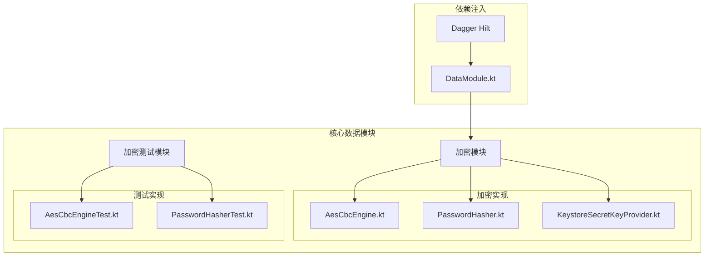
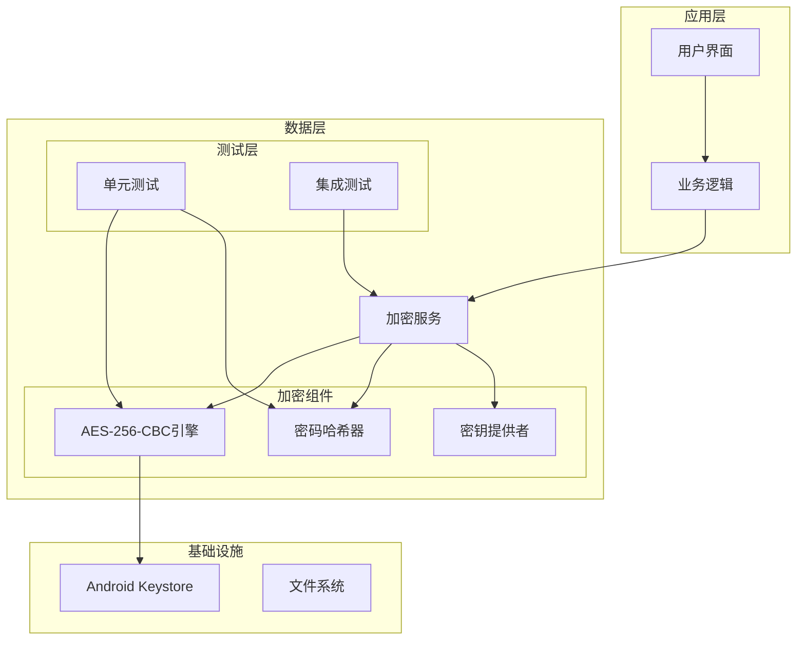
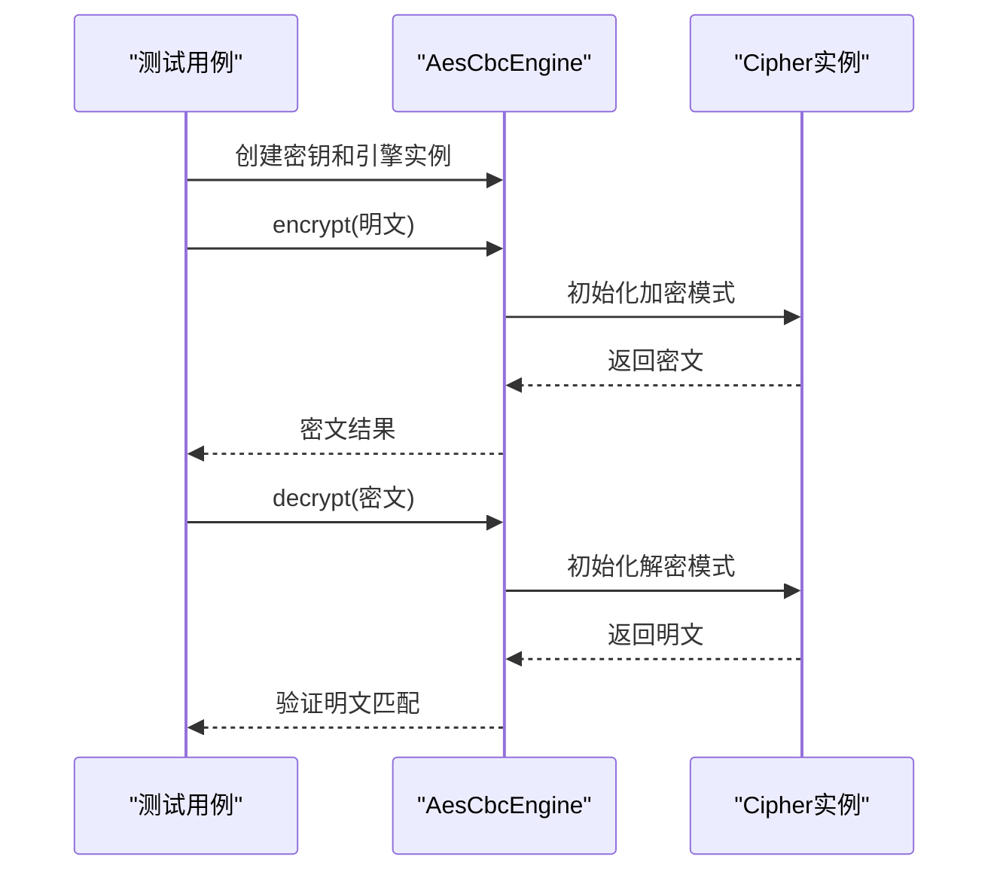
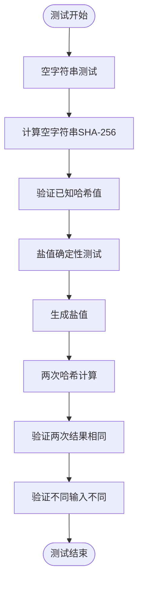
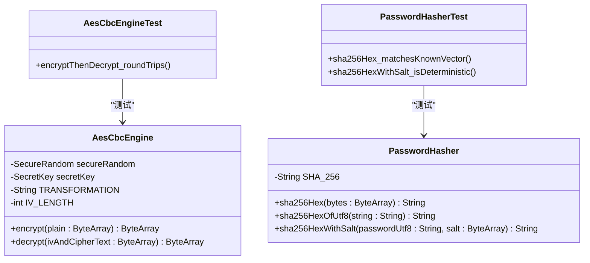
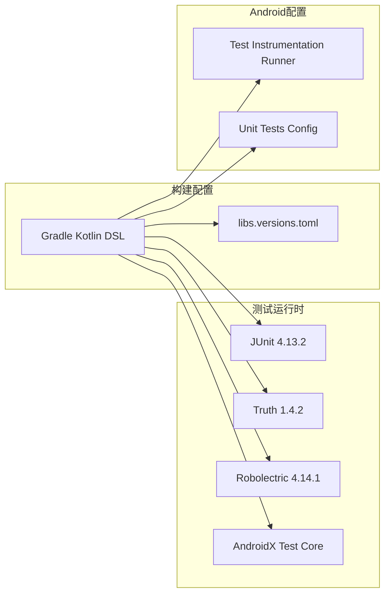
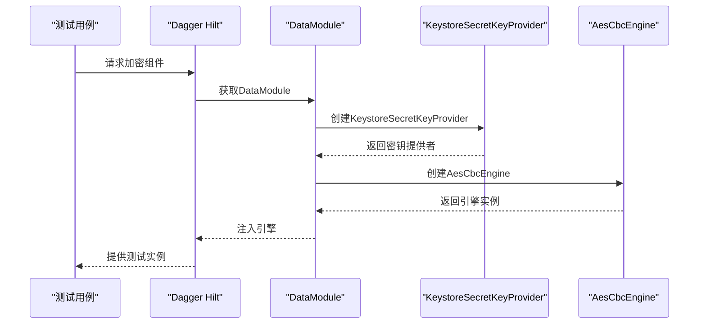

# 单元测试

<cite>
**本文档引用的文件**
- [AesCbcEngine.kt](file://android/core/data/src/main/kotlin/com/photovault/data/crypto/AesCbcEngine.kt)
- [PasswordHasher.kt](file://android/core/data/src/main/kotlin/com/photovault/data/crypto/PasswordHasher.kt)
- [AesCbcEngineTest.kt](file://android/core/data/src/test/kotlin/com/photovault/data/crypto/AesCbcEngineTest.kt)
- [PasswordHasherTest.kt](file://android/core/data/src/test/kotlin/com/photovault/data/crypto/PasswordHasherTest.kt)
- [build.gradle.kts](file://android/core/data/build.gradle.kts)
- [DataModule.kt](file://android/core/data/src/main/kotlin/com/photovault/data/di/DataModule.kt)
</cite>

## 目录
1. [简介](#简介)
2. [项目结构](#项目结构)
3. [核心组件](#核心组件)
4. [架构概览](#架构概览)
5. [详细组件分析](#详细组件分析)
6. [依赖关系分析](#依赖关系分析)
7. [性能考虑](#性能考虑)
8. [故障排除指南](#故障排除指南)
9. [结论](#结论)
10. [附录](#附录)

## 简介

本文件为AI照片保险库项目的单元测试文档，专注于加密模块的测试实现。项目采用Android架构，核心加密功能由AesCbcEngine和PasswordHasher两个关键组件组成。测试框架选择JUnit + Truth组合，提供了简洁而强大的断言能力。

本项目遵循现代Android开发最佳实践，使用Kotlin语言和Gradle构建系统，测试环境配置完善，支持单元测试和集成测试。

## 项目结构

AI照片保险库项目采用模块化架构，加密测试位于核心数据模块中：

**图表来源**
- [AesCbcEngine.kt:1-40](file://android/core/data/src/main/kotlin/com/photovault/data/crypto/AesCbcEngine.kt#L1-L40)
- [PasswordHasher.kt:1-26](file://android/core/data/src/main/kotlin/com/photovault/data/crypto/PasswordHasher.kt#L1-L26)
- [AesCbcEngineTest.kt:1-19](file://android/core/data/src/test/kotlin/com/photovault/data/crypto/AesCbcEngineTest.kt#L1-L19)
- [PasswordHasherTest.kt:1-24](file://android/core/data/src/test/kotlin/com/photovault/data/crypto/PasswordHasherTest.kt#L1-L24)

**章节来源**
- [build.gradle.kts:1-48](file://android/core/data/build.gradle.kts#L1-L48)

## 核心组件

### 加密引擎组件

项目包含两个核心加密组件，都位于crypto包中：

1. **AesCbcEngine**: 实现AES-256-CBC对称加密，支持PKCS5Padding填充
2. **PasswordHasher**: 提供SHA-256密码哈希功能，支持盐值增强

这两个组件都经过精心设计，具有明确的职责分离和清晰的接口定义。

**章节来源**
- [AesCbcEngine.kt:8-40](file://android/core/data/src/main/kotlin/com/photovault/data/crypto/AesCbcEngine.kt#L8-L40)
- [PasswordHasher.kt:5-26](file://android/core/data/src/main/kotlin/com/photovault/data/crypto/PasswordHasher.kt#L5-L26)

## 架构概览

加密模块的整体架构体现了分层设计原则：

**图表来源**
- [DataModule.kt:15-39](file://android/core/data/src/main/kotlin/com/photovault/data/di/DataModule.kt#L15-L39)

## 详细组件分析

### AES-256-CBC引擎测试

AesCbcEngine是项目中最复杂的加密组件，负责实际的数据加密和解密操作。

#### 测试设计要点

测试用例围绕"加解密往返测试"这一核心概念设计：

**图表来源**
- [AesCbcEngineTest.kt:8-17](file://android/core/data/src/test/kotlin/com/photovault/data/crypto/AesCbcEngineTest.kt#L8-L17)

#### 关键测试策略

1. **完整性验证**: 确保加密输出长度大于IV长度（16字节）
2. **正确性验证**: 通过加解密往返验证数据完整性
3. **边界条件**: 验证输入数据的最小长度要求

**章节来源**
- [AesCbcEngineTest.kt:8-17](file://android/core/data/src/test/kotlin/com/photovault/data/crypto/AesCbcEngineTest.kt#L8-L17)
- [AesCbcEngine.kt:17-32](file://android/core/data/src/main/kotlin/com/photovault/data/crypto/AesCbcEngine.kt#L17-L32)

### 密码哈希器测试

PasswordHasher提供了SHA-256哈希功能，支持盐值增强的安全特性。

#### 测试设计策略

测试分为两个主要场景：

1. **已知向量测试**: 验证标准输入的哈希输出
2. **确定性测试**: 验证相同输入产生相同输出，不同输入产生不同输出

**图表来源**
- [PasswordHasherTest.kt:7-22](file://android/core/data/src/test/kotlin/com/photovault/data/crypto/PasswordHasherTest.kt#L7-L22)

**章节来源**
- [PasswordHasherTest.kt:7-22](file://android/core/data/src/test/kotlin/com/photovault/data/crypto/PasswordHasherTest.kt#L7-L22)

### 组件类图

**图表来源**
- [AesCbcEngine.kt:12-38](file://android/core/data/src/main/kotlin/com/photovault/data/crypto/AesCbcEngine.kt#L12-L38)
- [PasswordHasher.kt:6-24](file://android/core/data/src/main/kotlin/com/photovault/data/crypto/PasswordHasher.kt#L6-L24)
- [AesCbcEngineTest.kt:7-17](file://android/core/data/src/test/kotlin/com/photovault/data/crypto/AesCbcEngineTest.kt#L7-L17)
- [PasswordHasherTest.kt:6-22](file://android/core/data/src/test/kotlin/com/photovault/data/crypto/PasswordHasherTest.kt#L6-L22)

## 依赖关系分析

### 测试框架配置

项目使用现代化的测试配置，确保了测试的可靠性和可维护性：

**图表来源**
- [build.gradle.kts:43-46](file://android/core/data/build.gradle.kts#L43-L46)

### 依赖注入集成

测试通过依赖注入容器获取加密组件实例：

**图表来源**
- [DataModule.kt:36-38](file://android/core/data/src/main/kotlin/com/photovault/data/di/DataModule.kt#L36-L38)

**章节来源**
- [build.gradle.kts:43-46](file://android/core/data/build.gradle.kts#L43-L46)
- [DataModule.kt:36-38](file://android/core/data/src/main/kotlin/com/photovault/data/di/DataModule.kt#L36-L38)

## 性能考虑

### 测试性能优化

1. **内存效率**: 测试数据使用ByteArray直接操作，避免不必要的对象创建
2. **执行速度**: 使用简单的测试用例，确保快速反馈
3. **资源管理**: 测试完成后自动释放资源

### 加密性能考量

- AES-256-CBC加密在Android设备上性能优异
- IV随机生成不影响整体性能
- SHA-256哈希计算开销极小

## 故障排除指南

### 常见测试问题

1. **断言失败**: 检查输入数据格式和编码方式
2. **密钥相关错误**: 确保密钥长度和类型正确
3. **时间相关测试**: 避免使用固定时间戳进行测试

### 调试技巧

1. **日志输出**: 使用Truth的详细断言信息
2. **数据验证**: 打印中间结果进行调试
3. **边界测试**: 添加更多边界条件测试

**章节来源**
- [AesCbcEngineTest.kt:15-16](file://android/core/data/src/test/kotlin/com/photovault/data/crypto/AesCbcEngineTest.kt#L15-L16)
- [PasswordHasherTest.kt:10-21](file://android/core/data/src/test/kotlin/com/photovault/data/crypto/PasswordHasherTest.kt#L10-L21)

## 结论

AI照片保险库项目的单元测试实现了以下目标：

1. **完整性覆盖**: 核心加密功能得到充分测试
2. **简洁高效**: 使用JUnit + Truth组合，测试代码简洁易懂
3. **可维护性**: 清晰的测试结构和命名规范
4. **可靠性**: 通过已知向量和确定性测试确保算法正确性

测试框架选择合理，既满足了Android开发需求，又保持了测试的简洁性。建议在未来扩展测试覆盖范围，添加更多边界条件和异常情况测试。

## 附录

### 测试最佳实践清单

1. **命名规范**
   - 使用动词短语描述测试目的
   - 包含预期行为和条件
   - 避免使用否定词汇

2. **断言使用**
   - 使用Truth提供的丰富断言方法
   - 提供清晰的错误消息
   - 避免多个断言在一个测试中

3. **异常处理测试**
   - 测试正常流程
   - 测试异常输入
   - 验证适当的异常抛出

4. **测试数据管理**
   - 使用常量定义测试数据
   - 避免硬编码敏感信息
   - 提供多种数据类型的测试